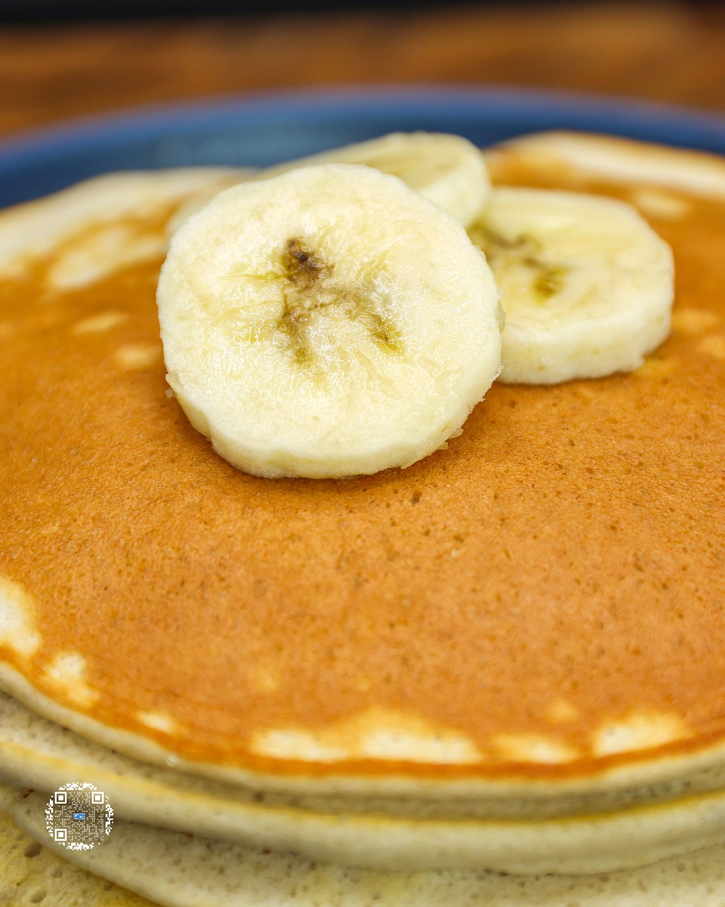

# Diet Cheat Codes PDF Parser - Implementation Plan

## Overview

Parse the 475-page "Diet Cheat Codes 1526.pdf" cookbook into structured markdown files using Bun + TypeScript with Gemini 2.5 Flash for AI-powered recipe extraction.

## PDF Structure Analysis

**Book Layout:**
- Pages 1-10: Title, dedication, copyright, table of contents
- Pages 11-15: Introduction, disclaimers, "Why Do My Recipes Work?"
- Pages 16-19: Pantry Essentials
- Pages 20-25: Kitchen Gear
- Pages 26-44: Cooking Techniques, Informative Illustrations, FAQs, Recipe Page Breakdown
- Pages 45-460: Recipes (organized by category)
- Pages 461-475: Reference Tables (Fruit/Vegetable/Seasoning Macros, Satiety Index)

**Recipe Categories (11 total):**
- `breakfast-bliss`
- `midday-munchies`
- `dinner-is-served`
- `sweet-treats`
- `ice-cream-pints`
- `fruit-sorbets`
- `cookie-dough`
- `shareables`
- `lets-get-saucy`
- `doughlicious`
- `prep-school`

**Recipe Format (each recipe spans 2 pages):**
- Page 1: Full-page photo
- Page 2: Recipe details (name, serves/prep/cook, ingredients, directions, macros, tips)

## Output Structure

```
book/
├── parse.ts                           # Main parser script
├── progress.json                      # Resume state tracker
├── overview.md                        # Intro, pantry, techniques, reference tables
├── images/                            # Extracted recipe images
│   └── breakfast-bliss__banana-pancakes.jpg
├── breakfast-bliss__banana-pancakes.md
└── ... (100+ recipe files)
```

## Recipe Markdown Format

```markdown
# Recipe Name

**Serves:** 1 | **Prep:** 5 mins | **Cook:** 10 mins

## Macros
| Calories | Fat | Carbs | Net Carbs | Protein |
|----------|-----|-------|-----------|---------|
| 361      | 2g  | 72g   | 47g       | 37g     |

## Ingredients

### Wet
- 120g banana
- 100g egg whites

### Dry
- 20g all-purpose flour

## Directions

1. Mash the banana...
2. In a separate bowl...

## Tips
If bulking or for greater flavor...


```

## Implementation Approach

### Tools Used
- `pdftotext` - Extract text from specific pages
- `pdftoppm` - Convert pages to images for Gemini
- `pdfimages` - Extract high-resolution recipe photos

### Progress Tracking (`progress.json`)
```json
{
  "lastUpdated": "2025-01-12T...",
  "overviewComplete": false,
  "recipesProcessed": ["breakfast-bliss__banana-pancakes"],
  "currentPage": 47,
  "errors": []
}
```

### Gemini API
- Endpoint: `https://generativelanguage.googleapis.com/v1beta/models/gemini-2.5-flash:generateContent`
- Multimodal input (image + text)
- Structured JSON output schema
- No delay between calls, retry on rate limits

## Run Command

```bash
cd /Users/stefan/Downloads/book
bun run parse.ts
```
