# Diet Cheat Codes - Overview

*A comprehensive guide to making delicious, low-calorie versions of your favorite foods.*

## Introduction

DIET CHEAT CODES

“I WISH THERE WAS A DIET WHERE
I COULD EAT PIZZA, BURGERS,
AND ICE CREAM BECAUSE THEN
I WOULD ACTUALLY BE ABLE TO
STICK TO IT.”
8

Introduction

DIET CHEAT CODES

INTRODUCTION
When a diet of chicken, broccoli, rice, and unsalted almonds
with a side of plain oatmeal was considered the only way
to lose weight, this is exactly what I used to tell myself —
REPEATEDLY. This was before Instagram was created and
YouTube had juuuuuust started becoming popular, but there
were no recipes or quality nutrition information yet. Unless
you were in Greg Doucette’s kitchen every morning, there
was no anabolic diet and “if it fits your macros” was practiced by very few, if anyone at all, and most certainly wasn’t
common knowledge.
I tried many times to eat copious amounts of hard-boiled
eggs and plain chicken to “finally lose the weight and keep
it off.” For some reason, with every attempt, I kept telling
myself that this time would be different. This time I would
be able to do it forever. This time I would be able to push
through. Without fail, 12, or MAYBE 16 weeks later, I would be
sick of the same food, look pretty good in the mirror, and say
“Fuck it”. I’d go right back to my old ways of Chinese takeout multiple nights a week parlayed with my favorite pizza
place and McDonald’s® the other nights of the week. On
the weekend, it was time to go out with the boys and drink
copious amounts of alcohol and end the night with a full
bag from Taco Bell® that I would demolish before I went to
sleep. Funny enough, during some of these fat loss phases,
I was still working out 4 or 5 times a week, but you can’t
outwork alcohol, fast food, and a massive appetite. In just 2
or 3 months, I was right back to where I started, if not even
heavier and worse off.
As YouTube started to become more educational, I would
watch people like Layne Norton and Zach Rocheleau
(TheFlexibleDietingLifestyle). They started to teach me
that you can eat the stuff you like in moderation, but you
can also make it at home using lower calorie ingredients
and eat it ALL. THE. TIME. This was about the same time I
was in college, majoring in exercise physiology and learning
about the laws of thermodynamics and calories in/calories
out. All of this new information coupled with more low-calorie meal options popping up in grocery stores (think protein pancakes) started changing my mindset. At this point,
I slowly started cooking more and learning my way around
the kitchen.

Fast forward a couple of years and Greg Doucette made a
splash onto the scene. Once anabolic french toast was introduced to me, I realized the possibilities really were endless.
My goal moving forward was to make recipes that not only
helped me lose weight, but tasted great — even if I was eating them day in and day out for weeks on end. I started making my protein ice cream recipes and the rest is history.
So, why should you care?
I mean you really shouldn’t.
However, the process of finding meals that are easy to fit
into your schedule, you never get sick of, and get you to (or
close to) your physique goals is going to take time. We haven’t even talked about the amount of calories you need to
be eating, how many times a day you like to eat, and what
parts of the day you should be having bigger meals. Oh, and
let’s not forget about all the different variables that come into
play when trying to combine diet with exercise too.
With all the information we have at our fingertips, you should
be able to figure it out a lot faster than I did, but it is also okay
if it takes you a few years to learn exactly what works for
you and your body. It took me over 10 years of trial and error
to find what works for me. (That’s well over 3,000 days for
anyone counting.) Shit, even to this day I am still finding new
foods and different techniques that are helping me progress.
Hopefully your journey to finding what works for you will be
a lot shorter than mine, but always remember, learning takes
a lot of time and repetition.
My goal with this book is to make all the information as easy
to digest as possible, so you can take the knowledge in the
pages ahead and apply it to your daily life. To this day, I still
make Greg’s anabolic french toast and just that recipe alone
has changed my life in more ways than I could’ve ever imagined. I hope after reading through and testing the recipes in
this book, you find your anabolic french toast and it changes
the way you look at dieting, forever.

Introduction

9

DIET CHEAT CODES

LET’S COVER
MY BUTT
AND YOURS....

10

Let’s Cover My Butt And Yours....

DIET CHEAT CODES

This cookbook provides subject-specific information based
upon the Author’s education, knowledge, and experience.
The information contained herein is not meant to replace the
professional guidance of a doctor, nurse, nutritionist, dietician or any other specialized expertise. The information contained in this cookbook nor any of the information provided
in connection therewith shall be offered for the purpose of
managing or treating a medical condition. None of the information contained herein or related thereto is intended to
diagnose, treat, prevent or cure any disease or condition.
You should always consult with a physician or other qualified
medical professional prior to following any of the recommendations contained in this cookbook or making any changes
to your diet or lifestyle based on those recommendations.
NEVER DISREGARD PROFESSIONAL MEDICAL ADVICE
OR DELAY SEEKING MEDICAL TREATMENT BECAUSE
OF SOMETHING YOU HAVE READ ON OR ACCESSED
THROUGH THIS COOKBOOK.
The information contained herein has not been evaluated by
the Food and Drug Administration. The nutritional values contained herein are merely the Author’s estimations and should
not be relied upon for purposes of tracking your dietary intake.
You should always check food labels and conduct independent calculations when tracking calories and macros.
The information contained in this cookbook is intended to
be a guide for the recreation and personalization of the various recipes. There are factors unique to you and outside
the control of the Author and Publisher that will determine
the outcome achieved when you prepare the recipes in this
cookbook. Author does not and cannot guarantee any specific results from your use of the recipes in this cookbook.
Author makes no warranties regarding and expressly disclaims all liability related to the outcome of your preparation
of any of the recipes contained herein.

The Author gives no warranties with respect to any of the
information contained herein or related thereto including,
but not limited to results and outcomes. To the fullest extent
possible under the laws, the Author disclaims all implied
warranties, including but not limited to warranties of fitness
for a particular purpose, accuracy, timeliness and merchantability. The Author assumes no responsibility or liability for
reliance on any aspect of the information contained herein
or related thereto and/or any information provided in connection with this cookbook, including, but not limited to
websites, promotional and marketing materials.
Other than to the extent required as a matter of law: (i)
Author shall not be liable for any direct, indirect, special,
incidental, or consequential costs, damages or losses arising directly or indirectly from this cookbook, the information
contained herein or the information related thereto. The maximum aggregate liability of Author for any claim in any way
connected with this cookbook or any information contained
herein or otherwise relating thereto, whether in contract, tort
or otherwise (including any negligent act or omission) shall
be limited to the amount paid for purchase of this cookbook.
The recipes contained in this cookbook contains references
to trademarks owned by third-parties. Author claims no
ownership interest in any intellectual property owned by
third-parties and expressly disclaims any liability concerning those materials.
This cookbook contains links to certain products and the
Author will earn an affiliate commission when you make a
purchase using those links. However, the opinions and experiences published by the Author relating to such products
are a reflection of the Author’s genuine and authentic experiences with such products.

Let’s Cover My Butt And Yours....

11

GETTING

INTO IT

DIET CHEAT CODES

14

Getting Into It

## Pantry Essentials

DIET CHEAT CODES

WHY DO MY
RECIPES WORK?
IT BOILS DOWN TO 2 WORDS:
B A L A N C E A N D TA S T E
Before I explain, I have a question for you:
What are some of your fondest childhood memories?
One of mine was hearing the ice cream truck coming down
the street. I would run to my dad and ask him for a dollar so I
could go buy an ice cream bar that had those gumballs that
lost their flavor in less than 2 minutes.
Another one was going to DiCola’s every time I would visit
my grandparents. DiCola’s is a well-known seafood restaurant in Chicago that has the best colossal shrimp, clam
strips, and tomato bread I have ever had. Since they had no
indoor seating, we would eat our meal in the car or on a
piece of wood that was in the parking lot.

Since then, my goal has been to make every recipe as close
to “Chicago good” as possible, while also striking a balance
between lower calories, higher protein, and sufficient volume to feel full and satisfied. If you are from Chicago, you
know how spoiled we are with great food from every culture,
so “Chicago good” simply means having the most flavor and
being as delicious as humanly possible.
The best part about the recipes I create is that most of them
are low enough in calories that it allows for going on dinner
dates, having a few drinks, or indulging in some Krispy Kreme®
donuts without worrying about gaining weight. This is pivotal
for anyone and everyone that has a thriving social life, significant other, and/or likes trying new food and restaurants.
However, most of the time, these extras aren’t even necessary.
WHY?

Lastly, were the days my dad worked late. Why? He wouldn’t
have time to cook so we would go to Bill’s Place, a local
restaurant, to pick up dinner. I would either get a gyro, a ham
and cheese pita (not-so-coincidentally also in this book), or
a slice of pizza.

In this book you will be able to make pizza, ice cream, famous
fast food items, burgers, and more — and all these recipes
taste nearly as good as the full calorie version. Because
of this, you will never have to sacrifice the foods you love
because of your “diet.”

B U T H O W D O E S T H I S R E L AT E T O M Y R E C I P E S
WORKING?

Now, my childhood memories live on, and it is impossible to
feel like I am missing out on any of my favorite foods when
I can make them all at home. Not only that, but when I do
want dinner from my favorite pizza place, for example, I can
easily fit it into my diet with all the low-calorie options I could
eat earlier in the day.

Some of my greatest memories revolved around food and
with over 30 years of these experiences, it would be near
impossible to change. For as long as I can remember, my
goal has been to develop a diet that I could adhere to indefinitely. After several years of attempting to only eat “clean
foods” and completely depriving myself of the foods I always
loved, I realized I needed to try and make my favorite foods
fit into my day-to-day diet. If I didn’t, I would fail each and
every time I dieted.

To me, this is the best of both worlds and keeps me at my
best physique of all time with minimal effort.

Why Do My Recipes Work?

15

DIET CHEAT CODES

PANTRY
ESSENTIALS
There are ingredients I like to have in my pantry and then there are ingredients I
NEED to have in my pantry. Everything listed below is in my pantry or fridge 24/7
and work in unison with one another. For example, if I woke up at 4am and all the
grocery stores were closed, I could still make a pizza from scratch. How? Because
I always have flour, vital wheat gluten, instant yeast, salt, canned tomatoes, and
mozzarella on hand. If you are a fan of making as little grocery trips as possible, I
highly recommend having these items in your house.

V I TA L W H E AT G L U T E N
If you are going to be baking any
bread or making any pizzas, I would
highly recommend having a bag of
vital wheat gluten in your pantry. It has
the same grams of protein per serving
as protein powder, but costs a fraction
of the price. If you buy a bag of vital
wheat gluten, it will last you months
and is worth every penny.

ERYTHRITOL
Erythritol is an artificial sweetener or
sugar substitute that is used to sweeten
recipes without adding additional calories to them. Erythritol was used to test
and create all the recipes that include a
sweetener in this cookbook. In my opinion, erythritol cooks, bakes, and tastes
the best. If you prefer another sweetener, feel free to use it as a substitute.
The two brands of erythritol I have experience with are Swerve® and Purecane®. I
would get both a granulated version and
brown sugar version as both are used
frequently throughout this cookbook.

16

Pantry Essentials

FLOUR
PROTEIN POWDER
The protein powder I use is a whey/
casein blend and more specifically is
made by PEScience. Whatever brand
you choose, make sure you get a
whey/casein blend. Also, if you are
only going to have one flavor on hand,
make sure it is vanilla. It works with
almost any recipe and can easily be
modified. For example, if you need
chocolate protein powder, you can sub
in some cocoa powder along with a
little bit of extra sweetener.

Flour is essential in any pantry and
that is because it is used in various
recipes. From pizzas, to muffins, to
baguettes, to cookie dough, flour is
necessary. If you are only going to buy
one, get all-purpose flour. If you want
to splurge a little bit, get all-purpose
flour, but also add King Arthur® bread
flour to the arsenal. For the quality,
how long it will last in your pantry, and
how many recipes you will be able to
make with one four-pound bag, it is
well worth it.

DIET CHEAT CODES

I N S TA N T Y E A S T
I make pizzas, buns, and bread
multiple times per week. To make any
of them, I need yeast. I buy the 4oz
bottle and keep it in the freezer after I
open it. This will keep it fresh and lasts
many months before going bad.

CORN MEAL
Corn meal is a more niche pantry
product, but I always have it stocked.
It is used in my DEEP DISH PIZZA ,
but is also very useful to help load and
unload pizzas from a pizza peel onto a
pizza steel. I also like the texture and
taste it gives to the finished pizza as
well. And who knows, maybe one day I
will make cornbread. :)

COCOA POWDER
Again, cocoa powder is more of a
niche product, but is something
I always have on hand. If I had to
choose one cocoa powder to have,
it would be the dutch version. King
Arthur® also makes a great double
dark cocoa powder that I highly
recommend. If you are going to make
any of my cookies n’ cream recipes,
I would suggest having black cocoa
powder on hand as well.

XANTHAN GUM
Xanthan gum thickens and emulsifies
recipes, so the protein ice creams
come out as smooth as soft serve and
the condiments keep their consistency after refrigerating. Guar gum
is another ingredient I would recommend if you are going to be making
protein ice creams regularly as it gives
the cream an even better consistency
when combined with xanthan gum.
Xanthan gum may seem pricey, but
you only need a gram or two at a time,
meaning you can make 200-400 recipes with just one pound.

BLACK PEPPER
Always, always, ALWAYS freshly
crack your pepper, if possible. I buy
whole peppercorns and I use either
an electric pepper mill or a mortar
and pestle to crush them down right
before cooking.

RED PEPPER FLAKES
There are a ton of ways you can add
spice to a dish, but red pepper flakes
are what I grew up on. I would also
argue it doesn’t change the taste of
any recipe and can easily be added as
a topping to many dishes like pasta
or even a slice of pizza. Red pepper
flakes will be in my pantry for life.

S A LT
A recipe can be cooked to perfection,
but if it isn’t salted correctly your taste
buds will tell you it sucks. Every pantry
needs to have salt and, in my case, I
use iodized salt. It dissolves quickly,
costs 60 cents for a pound and a half,
and I honestly can’t tell a difference
when I use different types of salt on
the same dish. Kosher salt is the most
widely used type of salt and since
this book almost always measures in
grams you can use any salt you want.
If you make one of my dishes and it
is too salty, I would use less salt than
I include in my ingredient list going
forward. Salt preferences are different
for everyone, but you can always add
more salt if you need to. However,
once you’ve salted a dish, you can’t
take it away.

DRIED SPICES
There are no hard rules on how many
spices you should have. Some people
may only need 5 spices and use them
for everything. Personally, I have a
spice rack with about 40 different
spices. If you are going to use a
specific spice, even semi-regularly, I
would have it on hand. If I were forced
to pick 5 spices and throw the rest
away, I would pick red pepper flakes,
garlic powder, onion powder, oregano,
and paprika.

Pantry Essentials

17

DIET CHEAT CODES

A R O M AT I C S
Aromatics help add a ton of flavor to
your food with little effort. There are
a ton of different aromatics, but the
ones I always have ready to go are
onions, garlic, and scallions. Desserts
aside, you will notice many of the
recipes include at least one of these,
if not more.

E X T R A-V I R G I N O L I V E O I L
If you are going to buy one oil for
savory foods, it would be extra-virgin
olive oil. And the only ingredient on
the bottles ingredients list should be
extra-virigin olive oil. This doesn’t have
to be expensive either. At Sam’s Club® 3
liters of EV olive oil costs less than $20
and should last you more than a year,
even if you are cooking every day.

FRESH HERBS
Fresh herbs add flavor and freshness
that dried spices just can’t replicate.
The two I have on hand at all times
are parsley and cilantro. They are both
used in combination in many recipes
throughout the book and work as a
garnish on most recipes.

LEMON
Having 1 or 2 lemons and/or limes in
the fridge at all times is a great idea.
The juice can be added to marinades,
sauces, and as a garnish for several
dishes. Not only can you use the juice
of a lemon, but you can use the outer
lemon for zest that is also a perfect
garnish for both sweet and savory
dishes. Not to mention, lemon water is
delicious.

18

Pantry Essentials

T O M AT O E S
Having fresh tomatoes in your fridge
is always a good idea, but in this
instance I am referring to canned
tomatoes. At any given time, I have
4-8 cans of San Marzano whole
peeled tomatoes and crushed
tomatoes in my pantry. A few cans of
tomato paste are sitting right next to
the San Marzanos because the two
usually go hand in hand. And I use all
Cento® everything. In my opinion, it is
the superior tomato brand.

AV O C A D O O I L
Avocado oil is a great source of monosaturated fat, and has a neutral flavor
for recipes that call for it. For example,
in a baked good like my PUMPKIN
MUFFINS , I am reaching for the avocado oil every time.

CHIPOTLE PEPPERS
I love having chipotle peppers in
adobo sauce in my pantry because
they last forever and are a great addition to any dish to bring a punch of
smoky, spicy flavor that very few ingredients can provide. If you want less
spice, just use the adobo sauce they
are packed in instead of the pepper.
If you haven’t made my CHIPOTLE
AIOLI SAUCE , stop what you are
doing right now and go make it.

## Kitchen Gear

DIET CHEAT CODES

CONDIMENTS
If I listed all of the condiments in my
fridge separately, it would’ve made this
list twice as long, I am a condiment
whore and always keep a bunch of
low-calorie options on hand. Let’s do
a speed run of the staples: no sugar
added ketchup, mustard, Sriracha, no
sugar added BBQ sauce, light mayonnaise, soy sauce, hot sauce, and
buffalo sauce.

MILK
Similar to eggs, milk can be utilized
in countless ways and is included in a
majority of recipes in this cookbook.
Fairlife® is the brand I utilize for all of
my recipes, because it tastes delicious and has double the protein per
serving. If you are ballin’ on a budget,
regular milk will work with all of these
recipes as well!

CHEESE
PA R M I G I A N O R E G G I A N O
Considered one of the finest cheeses
in all of the land, Parmigiano Reggiano
is typically aged for 24 months and
is only produced in Italy. Although
expensive, it is worth every dollar and
a few grams goes a long way. I love
the green bottle parm as much as the
next person, but if you can afford it,
parm reg should have a permanent
place in your fridge.

All cheeses are great, unless your
name is swiss, but when I don’t have
mozzarella in the fridge, I feel naked.
Mozzarella can easily be bought in
8oz or 16oz packages that stay fresh
in the fridge for months before going
bad. When you need it, shred it, and
add it to whatever recipe calls for it.
I always keep both fat-free and partskim on hand.

EGGS
Not much needs to be said about
eggs. They strictly provide benefits
with no downside. Need an easy to
make protein source for breakfast?
Eggs. Don’t have enough calories
for the yolk? Only use the egg white.
Want to make cookie dough, meatballs, or french toast? Eggs. I always
have an 18 pack in my fridge and you
should too.

Pantry Essentials

19

DIET CHEAT CODES

KITCHEN
GEAR
CUTTING BOARD
Have you ever rushed to the kitchen to attempt a new recipe, only to find out that
you’re lacking the required equipment to finish the job? I’ve experienced this exact
scenario many times, and it’s the WORST. Having the right tools for the job will
not only allow you to create the recipe, but will also make your life in the kitchen
inexplicably easier. This equates to food on the table more quickly while also being
more delicious. I regularly utilize the tools mentioned on this list, and many of them
are featured in numerous recipes throughout this book. While a few items on the
list are only necessary in specific circumstances, after reading the details about
each item, you should be able to decide whether or not you’d like to add them to
your assortment of kitchen gear.

SCALE
If you don’t have a scale, you won’t be
able to make the recipes in this book,
so that is why it is numero uno on this
list. A scale only costs between $20$30 and if you buy a good one it will
last you many years. Just make sure
you buy one that weighs to .01 grams,
so ingredients will get picked up by
the scale, even if it is less than a gram.

20

Kitchen Gear

The chef’s knife goes hand in hand
with the cutting board. I personally
like having a set of cutting boards that
includes a small, medium, and large
board to use in different scenarios.
However, if I had to pick one, I would
get a large cutting board. By large I
mean at least 18” wide and 12” long. If
you have the space, a 24”x18” board is
even better. This is because you can
get all your prep work done without
having to find other plates or accessories to put the chopped ingredients on.
Ideally, you can cut all your vegetables
on the same cutting board before
transferring them to a sperate bowl or
preheated pan. Also, you won’t need to
wash it multiple times during a recipe.

CHEF’S KNIFE
Chopping, dicing, and slicing is a
regular step in many of the recipes
contained in this book and a chef’s
knife is an essential tool to have in the
kitchen. While a knife block with an
assortment of knives is extremely convenient, you only need one 8-9” chef’s
knife to get the job done 95% of the
time. I use a knife that costs around
$30, and it has completed its job for
over a year. Every once in a while, you
will need to sharpen it, but that is no
different than any knife, even ones that
cost hundreds of dollars.

SMALL, MEDIUM, LARGE
POTS
This is one of the areas I would
recommend all sizes. Large pots are
necessary to make pasta or COOKED
MARINARA while small pots are great
for, well, small parts of a recipe. A
couple examples include making garlic
butter or a nacho cheese sauce.

DIET CHEAT CODES

L A R G E N O N S T I C K PA N
I love my cast iron and it is next on the
list, but a nonstick pan is my go-to for
many recipes because it really makes
the cooking AND cleaning experience
so much easier. Eggs are a breeze,
grilled cheeses brown to perfection,
stir frys come together in minutes, and
pancakes comes out perfect every
time. I would get one that is 12” and
have that be your daily driver.

12” CAST IRON
Cast iron pans will literally last you
generations and can cook certain
recipes better than any pan I have
used before. Steaks get a perfect sear,
smashburgers get scraped off to keep
all the tasty char on the burger, and
deep dish pizzas get a crispy crust
while being perfectly melty in the
middle. There is a little bit of a learning
curve to clean and maintain a cast
iron, but once you get it down, it is an
essential item for any home cook.

S H E E T PA N
Sheet pans have become one of my
favorite pieces of kitchen gear. You
can make a weeks worth of roasted
vegetables in one go OR you can
make a family sized pizza with minimal
effort. They will last forever and are an
essential part of my cooking.

EXTRA SMALL BOWLS

M E TA L T O N G S

Extra small bowls are great for a faster
prep or for dipping sauces. I like to
have my ingredients chopped and
separated into these bowls before I
start cooking, especially for recipes
that cook quickly.

A good pair of tongs last forever. I still
have the ones my dad gave me that
have been in use for 30+ years. I love
a spatula, but when you need more
control, tongs come in clutch.

SMALL, MEDIUM, LARGE
BOWLS

MEDIUM WHISK

Some of the recipes inside this book
won’t need any bowls while some will
require all three sizes. It is good to
have 2 or 3 bowls of each size just in
case you need multiple of the same
size in one recipe.

MEASURING CUP
Typically, I don’t use measuring cups.
However, when it comes to adding
water to dough, I like controlling the
pour and I can’t get that with regular
cups. Plus, I can gauge how many
grams of water are in the cup as I am
filling it up at the sink. The one I use is
made of glass and measures 2 cups.

Whisking is something I do daily.
Having a small and large whisk is nice,
but if I only had a medium whisk, I
would still be able to complete all the
steps necessary to make any recipe in
this book, so invest in a good one.

WOODEN SPOON
Wooden spoons come in handy when
you are cooking something that likes
to stick to the bottom of a pot and you
want to avoid scratching its surface.
What comes to mind instantly is pasta.
It also won’t melt like some other
kitchen utensils might. Get one and
get to cooking.

Kitchen Gear

21

DIET CHEAT CODES

MESH STRAINER
S I L I C O N E S P AT U L A S
I never knew how much I loved
silicone spoons until I started my
YouTube channel. Scraping the sides
of a bowl or pan mid recipe was a
nightmare before I invested in some
and I wish I knew about them sooner.
They also protect your nonstick and
are great for recipes that call for folding in ingredients.

B O X G R AT E R
Ice cream recipes make up the majority of this cookbook, but the most
used ingredient has to be cheese. I
find myself grating blocks of cheese at
least once per week and a box grater
gets the job done time and time again.

While I don’t use a mesh strainer very
often, I always have one on hand. They
can sift dry ingredients, strain liquids,
and remove seeds and pulp. They are
also great for finishing a dessert with a
dusting of powdered sugar.

CAN OPENER
GARLIC PRESS

M E AT T E N D E R I Z E R
A meat tenderizer breaks down the
muscle fibers and connective tissue of
a piece of meat making for a more tender and flavorful dish. I use it at least
once a week and it is worth purchasing if you prep meat regularly.

I am a hoe for garlic. I will add garlic
to almost anything and if it is my dish
I add extra garlic. My garlic press gets
used and abused and I recommend
getting one for yourself. It is light years
easier and faster than mincing garlic
with a knife and it is used in most
recipes.

I suspect you already have a can
opener, but without one my canned
tomatoes would never turn into pasta
sauce. Make sure you always have one
on hand.

V E G E TA B L E P E E L E R
FOOD THERMOMETER
R A S P G R AT E R
Also known as a Microplane®, I mainly
use this to zest lemons/limes and
grate Parmigiano Reggiano. There
isn’t another kitchen tool like it, and it
comes in handy on a regular basis.

22

Kitchen Gear

Food thermometers are clutch when
making any meat. I always want to
make sure my chicken breasts don’t
become dry and overcooked and that
my steak is perfectly medium rare.
Overcooking can happen in just 5-10
degrees or what can be as little as
30-60 seconds.

I don’t need a vegetable peeler all the
time, but if I want to make recipes like
my FRENCH FRIES or my SLOPPY
JOES I need one ready to go. Luckily,
they are small and don’t take up much
space in any drawer.

DIET CHEAT CODES

CITRUS SQUEEZER
A rasp grater will get the zest off a
lemon and the citrus squeezer will get
the juice out of a lemon. If you have to
squeeze more than half a lemon at a
time, I highly recommend one of these.
They get ALL the juice out and catch
most of the seeds so you don’t have to
pick them out of the bowl.

KITCHEN TOWELS
I wash and dry my hands, what feels
like a million times per day. Kitchen
towels are also great for cleaning up
the work surface and counters while
you are cooking or to quickly wipe
your hands off. I like to have 6-8 towels
in my kitchen because I go through
them quite frequently and don’t want
to wash the same two towels every
other day.

M A S K I N G TA P E
Why would you need masking tape,
you ask? I use it to date all my deli
containers. I was notorious for
throwing something in my fridge then
completely forgetting when I threw it
in there in the first place, so I had no
idea whether it was old or not. I simply
put a piece of masking tape on the
top of a deli container, label it with the
date, put the top on, and throw it in
the fridge. When I am done with the
food, I take the tape off, and wash the
container. Those little pieces of tape
have helped me immensely.

BASTING BRUSH
A basting brush comes in handy when
trying to add egg wash to a bun or to
cover a freshly made pizza crust with
garlic butter. This is another small
kitchen tool that is worth having on
hand.

S P R AY B O T T L E
I use a spray bottle to clean off
surfaces all day long. Fill it with a concentrated cleaning solution and water
for a cheap disinfectant that will keep
things looking spotless.

DOUGH SCRAPER
If you won’t be making any doughs,
pizzas, or breads you may not need
this. However, I make these recipes all
the time, so this tool comes in clutch
on many occasions.

ROLLING PIN
If you don’t make pitas, tortillas, or
pizzas, you won’t need this, but it is a
good tool to have if you do.

SALAD SPINNER
D E L I C O N TA I N E R S
Coming in 3 different sizes, these deli
containers have been a lifesaver. Since
they are stackable, they save room
both in a cabinet and when storing
food in the fridge. They have a very
tight seal and are my go-to whenever I
have recipes, leftovers, or sauces that
need to be put away.

I just got a salad spinner and it has
changed my vegetable game. It does
take up some storage space, but I can
successfully clean and dry a pound
of lettuce in just a couple of minutes.
It has helped in special cases as well,
like drying off the potatoes for my
FRENCH FRIES in just one spin.

Kitchen Gear

23

DIET CHEAT CODES

5 B L A D E M E AT C H O P P E R
If you ever break down meat for tacos,
sloppy joes, or make guacamole, I
would highly recommend this kitchen
gadget. It won’t scratch up the surface
of your nonstick pan and is very simple to use.

S T E E L B R E A D LOA F PA N
(8.5”x4.5”)
If you plan on making bread, it’s a
necessity. If you don’t want to make
protein bread, skip this one.

S E R R AT E D K N I F E
I like having a large serrated knife for
PROTEIN BREAD and a small serrated
knife for PROTEIN BUNS . If you don’t
plan to make any dough-based recipes, you can pass on getting one.

IMMERSION BLENDER
I use an immersion blender all the time
because it is efficient and effective. If
I need to break down canned tomatoes, I can put the blender right into
the can and the tomatoes are broken
down in seconds. If I quickly need to
add a xanthan gum/oil mixture into a
recipe, to prevent clumping, I use the
immersion blender. And don’t quote
me, but I hope to figure out how to
make low calorie mayonnaise at home
and an immersion blender is a must.
A whisk or your hands can substitute
for an immersion blender, but if you
want ultimate efficiency, I would pick
one up.

AIRFRYER
While I don’t have a ton of recipes that
use an airfryer, I think they should be a
kitchen staple regardless. Why? They
bring leftovers back to life, they cook
food faster than a traditional oven can,
and they can cook a side dish while
the main dish is cooking in the oven.
There are MANY more benefits to
airfryers, but these are the top 3 I can
think of.

NINJA CREAMI®
If you currently buy low calorie ice
cream or you want to make low calorie
ice cream, I HIGHLY recommend a
CREAMi®. Making a pint at home costs
about $1 and many low-calorie pints
in the grocery store cost $5 or more.
This will pay for itself in no time and is
probably one of the greatest inventions for the home kitchen. (sorry air
fryer, you are an extremely close second though) The majority of future ice
cream recipes will also be made with
this appliance, so it is a must have if
you want to be eating new ice cream
recipes for the foreseeable future.

FROTHER
This is an appliance strictly used for
my ice cream recipes, so you may not
need this if you don’t plan on getting a
CREAMi®.

NINJA® BLENDER
The Ninja® Blender I have is technically
a 3-1 that includes a blender, food processor, and a single serving bottle. The
blender is used for my old ice cream
recipes while my food processor is frequently utilized throughout the book.

24

Kitchen Gear

## Cooking Techniques & FAQs

DIET CHEAT CODES

PIZZA STEEL
If you are going to make pizzas or any
recipes that include dough, I would
buy one in an instant. It browns the
bottom of a pizza unlike any other
piece of equipment and reheats frozen
dough recipes in minutes. It is easy
to clean and maintain and sits in my
oven at all times. I use it many times
per week, and I’m just upset I didn’t
start using it sooner. I would buy one
that is 16”x16” so you have room to
work with when placing a pizza onto
the steel and also have the option
of baking an extra-large pizza if you
would like.

PIZZA PEEL
This makes life 10x easier if you are
making pizza. Shoot pizzas into the
oven with ease, quickly grab them
once they are done, and hang the peel
up when you are finished cooking.
If you are going to invest the money
for a pizza steel, I would invest in a
pizza peel as well. They will last you a
lifetime. Make sure you buy one that
matches your steel. If you buy one that
fits 16” pizzas, but only buy a 14” steel,
you are paying more for no reason.

Kitchen Gear

25

DIET CHEAT CODES

COOKING
TECHNIQUES

F O R M A X I M U M F L AV O R

There are a million in-depth, scientific explanations for good
cooking techniques out there. However, from the beginning,
my goal in creating this cookbook was to explain everything
in the simplest terms possible. Any actual chefs or experienced home cooks will probably scoff at my explanations,
but as long as they make sense to you and you can apply
them in the kitchen, I am a happy Exercise4CheatMeals.
These are beginner techniques and can become way more
advanced if you want them to be. If a particular technique
piques your interest, I highly suggest reading more articles
or even buying a book to really take your knowledge to the
next level. I recently purchased The Food Lab by J. Kenji
López-Alt and I learned more in the first 30 pages than I have
watching countless videos on YouTube.

26

Cooking Techniques

I am no different than you and am learning new things in
the kitchen every single day. That being said, as I learn new
techniques and/or improve techniques already in this section, I will make updates. That way, as I learn, you can too.

DIET CHEAT CODES

2. Tenderize your meat.

Tenderizing your meat essentially just means beating your
meat. It only takes a few seconds and ensures even cooking
and tender meat.
a. Place a chicken breast into a gallon bag.
b. Using the flat side of a meat tenderizer, pound the
chicken gently, starting from the center of the meat and
working your way out.

P R E PA R I N G C H I C K E N B R E AS T S

c. Once the entire breast is about a half inch thick, it is
finished.

It took me more than 10 years to make chicken breasts that I
can enjoy without any sauces, oils, or seasonings.

d. Repeat for any remaining chicken breasts.

Just salt and chicken.
Don’t make dry and bland chicken like I did for over a
decade. Simply apply the following steps before cooking
your chicken.
Trim your chicken breasts, ideally using kitchen
scissors.
Everyone has had an experience where they bite into a
chicken sandwich and it is rubbery, gross, and ruins the rest
of the meal. This is typically caused by tendons, and we can
remove them quickly and easily along with any excess fat.
1.

a. Place the chicken breast on a cutting board with the
smooth side facing up.
b. Using scissors, remove any visible tendons and fat from
the chicken breast.

3. Salt your chicken.

Salt can come in many forms, but this step is crucial to retain
as much moisture in your chicken breasts as possible. Nine
times out of 10, I either dry brine my chicken or throw it in a
bag, add a marinade, and let it sit overnight. Then, I cook it
the next day. If you have never brined chicken before, check
the next cooking technique!

of course use
these scissors in
the KITCHEN ONLY
and wash after
each use

c. Flip the breast over and find the tendon. It usually runs
down the middle of the breast and ends in the thick part
of the breast towards the corner.
d. Cut the corner of the chicken breast to remove the
tendon and any fat that may not have been removed
from the chicken before it was packaged.

Cooking Techniques

27

DIET CHEAT CODES

B R I N I N G / D R Y B R I N I N G M E AT
WHAT: Salt is added directly on the meat itself or it is dissolved
in water and the meat is added to the saltwater solution.
WHY: A brined piece of meat can hold more moisture than

the same cut of meat that wasn’t brined. The ability to retain
more moisture will make for a juicier final product. In my
experience, this is the case even when the meat is slightly
overcooked. Brining is especially important in lean cuts of
meat such as chicken breast and porkchops because these
cuts are far more prone to overcooking, which leads to a dry,
chewy, and lifeless dinner.
HOW: For a wet brine, I like to use a 5% salt to water ratio.
This simply means I will add 5 grams of salt for every 100
grams of water.

1.

When ready to brine, add enough water to fully submerge
the meat in your container, add salt, whisk until salt is
dissolved, and add your meat.

2. Cover with a lid or plastic wrap, refrigerate, and let the
meat brine for at least an hour, as long as 12 hours.
a. Everyone’s palate is different, so I suggest testing different
lengths of brine time to get the perfect saltiness for
you. However, I would be careful as wet brines are very
powerful and if you leave a chicken breast overnight it may
become too salty for your liking. I would start by brining for
an hour and increase the brine time each time you cook
until it becomes too salty. You will then know your brine
time limit for the rest of eternity (or at least until your taste
buds change). Larger or thicker cuts of meat, such as a
pork tenderloin or a whole turkey, will take longer and will
again be something you have to test for yourself.

28

Cooking Techniques

For a dry brine, I like to use a 1.5% salt to meat ratio. This
simply means I will add 1.5 grams of salt for every 100 grams
of meat. If you would like to make it even simpler, you can
use 1 gram of salt for every 100 grams of meat. The most
important part of a dry brine is to make sure every square
inch of meat is covered. For example, when I dry brine a
chicken breast, I will completely and evenly coat both the
top and bottom with salt. I highly suggest you weigh out your
salt before adding it to your meat. Oversalting is easy to do
if you are pouring straight from the container. Refrigerate the
meat uncovered for at least 1 hour or up to overnight and
you are ready to cook. If you are worried about uncovered
raw meat in your fridge, you can loosely cover the meat with
aluminum foil, making sure it still has room to breathe. In my
experience, dry brining is more forgiving than a wet brine in
that it takes longer for the meat to become overly salty.
THE MORE YOU KNOW: You can also add sugar to your
brine, but I have never done so. If you end up using sugar,
please send me an e-mail or DM on Instagram and let me
know which cut of meat you used and if you think it’s worth
adding.

DIET CHEAT CODES

BROIL
1.

Preheat broiler on high.

2. Line a sheet pan with aluminum foil and place the
vegetables, whole, on the pan.
3. Place the pan in the oven with the top of the vegetables
about 3-4” from the broiler. Some ovens have the broiler
below the oven, but for most ovens this means placing the
sheet pan on the top rack of the oven.

R O A S T I N G V E G E TA B L E S
WHAT: Whole or chopped vegetables are put into an oven

or under a broiler.

WHY: Some people think vegetables are gross. I used to be

4. Broil the vegetables for 3-10 minutes, or until the skin is
charred and blistered on all sides.
5. Using tongs, occasionally turn vegetables to ensure even
cooking.
6. Remove from oven and let cool for 15 minutes.
• Some people will tell you to put the vegetables in a
bowl and cover with a lid to steam them. This method
is supposed to help more easily peel the skin off, but
made no noticeable difference in my testing with both
poblanos and red peppers. Feel free to try both and let
me know your results!

one of those people. Similar to chicken breasts, if prepared
and cooked correctly, vegetables can be delicious. Roasting
vegetables enhances their flavor, brings out some sweetness, and leaves them with a caramelized exterior and a
crisp, yet tender, interior.
HOW: I think of roasting vegetables in two methods — slow

7.

Peel the burnt outer skin off the vegetables.

roast and broil.

8. Add a pinch of salt over the top, chop into bite sized
pieces, and refrigerate.

SLOW ROAST

9. Use within a week and add to any dish that could use an
extra boost of flavor.

1.

Chop vegetables into similar-sized pieces to ensure even
cooking.

2. Add to a large bowl, lightly coat with oil and seasonings
of choice, and toss.
• Make sure you don’t soak them in oil unless you need
the added calories. 10-15 grams of oil goes a LONG way.

*Vegetables that I commonly like to broil are red peppers,
poblano peppers, and green peppers. This is another good
place to experiment with other vegetables and see what
you like!

3. Place vegetables on a sheet pan lined with parchment
paper and arrange in a single layer.
4. Bake in a preheated 400°F oven for 20-40 minutes,
tossing halfway through.
• Every vegetable is different and may require a range
of cooking times, especially with the added variable
of different ovens. This is where you will have to
experiment and see what works for your palate.

Cooking Techniques

29

DIET CHEAT CODES

ROASTED GARLIC

KNEADING DOUGH
WHAT: Rolling a formed dough back and forth on a work

WHAT: Putting a head of garlic into an oven.

surface.

WHY: I always keep roasted garlic in my fridge because it
is an easy addition to a main dish, side dish, or sauce as an
instant flavor boost with minimal effort. Since I use roasted
garlic in various dishes throughout the cookbook, I thought
roasted garlic deserved its own section.

WHY: When the dough is kneaded properly, it develops gluten, improves texture, and increases elasticity aka makes it
easier to shape before cooking.

HOW: Get a knife, aluminum foil, and salt.

1.

Take a full head of garlic and chop off the top so that the
tips of the cloves are exposed.

HOW: Kneading gets a bad rap, but is actually extremely simple. I recommend doing it while listening to music, watching
a tv show, or watching your favorite YouTuber.

1.

Lightly dust your work surface with flour and place your
dough on it.

2. Lightly spray top with oil, add a pinch of salt, and a dash
of pepper.

2. Press dough down and away from you using the heel of
your hand.

3. Wrap the garlic head in aluminum foil and bake in a
preheated 400°F oven for 45 minutes.

3. Fold the dough in half and press it down, pushing it away
from you as you do so to elongate it just enough to fold
it again.

TIP: I highly recommend making at least a few heads of garlic at once. Once you see how simple it is to do and how it
adds great flavor to almost any dish, you will find yourself
going through multiple heads per week.

4. Repeat steps 2 and 3 until the dough becomes smooth
and elastic. This usually takes 5-10 minutes.
5. Shape the dough into a ball and place it into an oiled bowl
or container and cover for 1-2 hours or according to the
recipe’s instructions.
*I purposely formulated most of my recipes so kneading wasn’t
required. However, if you feel your dough is too wet, shaggy, or
stiff, it wouldn’t hurt to knead it for 5-10 minutes before putting
it in a bowl to rise.

30

Cooking Techniques

DIET CHEAT CODES

P I C K L I N G V E G E TA B L E S
WHAT: A salt solution used to preserve vegetables while

enhancing their flavor.

WHY: To be frank, they are delicious. Bread + butter pickles anyone? In all seriousness, pickled vegetables massively extend the shelf life of the vegetable while improving
their flavor. They are also extremely convenient while being
insanely versatile. Grab them out of the fridge and add them
to a sandwich, salad, or eat them straight out of the jar.
HOW:

1.

Slice vegetables into desired size and shape. Place them
in a glass jar or plastic container.

2. Boil even parts water and vinegar along with salt and any
spices you want to add for additional flavor.
• Common spices added are garlic cloves, black
peppercorns, and dill.
3. The amount of salt added will vary depending on what
vegetables you are using and personal taste preferences,
but a good rule of thumb is to add 15-30 grams of salt per
every 1000 grams of vinegar solution.
4. Once the vinegar solution comes to a boil, remove from
heat, let it cool for 5-10 minutes, and pour over the sliced
vegetables.
5. Cover with a lid and allow it to come to room temperature.

BLOOMING SPICES
WHAT: Adding ground spices to a hot pan with a thin layer

of oil.

WHY: How long ago were your spices dried and ground?
The first time someone asked me this question it opened my
eyes, wide. Some of the seasonings in your pantry could be
months, if not years old, even if you recently bought them.
When cooking, blooming spices will help release their natural oils and aromas while simultaneously creating a smoother
texture in a dish. Simply put, blooming your spices will
enhance the flavor of any dish with nearly zero extra effort.
HOW:

1.

Add spices to a small bowl and mix to combine.

2. If your preheated pan is empty, add a few grams of oil
to the middle of the pan. If the pan has food in it already,
create a “dugout” in the middle of the pan and then add
oil. Let the oil heat up for 20-30 seconds and then add the
seasonings.
3. Mix the seasonings with the oil and let them cook for 3060 seconds or until they become fragrant.
a. If the pan is very hot, continuously stir the oil/spice
combination to prevent burning.
4. Combine the rest of the food with the seasonings and
continue following the recipe’s instructions.

6. Store in the fridge and allow those flavors to develop. The
longer you let it sit, the stronger the flavor will be. Most of
these vegetables should stay good in the fridge for up to
6 months.

Cooking Techniques

31

DIET CHEAT CODES

INFORMATIVE
ILLUSTRATIONS
Having easy to read charts and tables in your pocket that
you can quickly refer back to is MASSIVELY beneficial. They
can be used for meal prep ideas or to help you choose the
foods you want to introduce in your weight loss phase to
keep hunger at bay. Since I created these tables and charts,
I have used them nonstop, and I think they will be just as
useful for you.

32

Informative Illustrations

DIET CHEAT CODES

CALORIES PER 100G FRUITS
A N D V E G E TA B L E S
While I think all fruits and vegetables can and should be eaten,
I also think knowledge is power. It’s always good to know
which ones contain more calories versus the ones that can
be eaten by the truck load without many calories being added
to your daily total. Below I have two graphs, one for fruits and
one for vegetables. They are in order by the least to the most
calories per 100 grams. If the fruit or vegetable isn’t shown
here or you want to see the full tables, check them out HERE .

Informative Illustrations

33

DIET CHEAT CODES

C A L O R I E S P E R 1 1 3 G M E AT
AND SEAFOOD
Many people eat the same types of meats for months on end,
which can get boring fast. There is a plethora of meats that
can be added to a diet and in the chart below I have listed
different cuts of meat and seafood from the least to the most
calories per 113 grams. If the cut of meat you are looking for
isn’t on this chart, check out the full table HERE .

34

Informative Illustrations

S AT I E T Y I N D E X
When you aren’t hungry, or what people in the medical
field call satiated, there is a significantly reduced chance of
snacking or overeating both during a meal and in-between
meals. In other words, the more you feel satiated during a
weight loss phase, the better chance you’re going to have of
losing your goal weight. PRIOR STUDIES have shown what
foods seem to make people feel more satiated than others, which I have added to the chart below. Potatoes have
worked the best for me personally, but everyone is different,
so if one of these highly rated foods doesn’t work for you, try
another one. If you want the entire satiety index list, check
out the table HERE .

DIET CHEAT CODES

FIBER PER 100G FRUITS
A N D V E G E TA B L E S
Knowing how many calories are in fruits and vegetables is
great, but knowing how much fiber is in them can be a game
changer. I can write a whole book about fiber, but let’s keep
it simple. The FDA recommends we eat at least 25 GRAMS
OF FIBER PER DAY . Consuming enough fiber every day
helps regulate blood sugar, LOWER CHOLESTEROL, LOWER
BLOOD PRESSURE , and keeps you full. AKA it has so many
benefits there is really no reason not to consume it.

Fiber forms a gel-like substance slowing the digestion of
your food through your intestines and makes you feel full
faster and longer. While having a sufficient amount of fiber
every day is recommended, this can be difficult if you don’t
know where to get your fiber from. This is further reiterated
by the data showing that 95% of people don’t meet DAILY
FIBER RECOMMENDATIONS. In the charts below, I have listed
14 different fruits and vegetables that have varying fiber per
100g. If you would like to see the fiber amounts in every fruit
and vegetable, check out the reference tables HERE .

Informative Illustrations

35

DIET CHEAT CODES

FREQUENTLY
ASKED
QUESTIONS
Should I eat every meal exclusively from this
cookbook?
While you certainly can eat every meal out of this cookbook,
it’s not necessary. I typically eat 1-2 meals from the book
everyday while also rounding out my other meals with simple snacks, a variety of fruits and vegetables, and leftovers.
1.

2. Am I guaranteed to lose weight if I eat from this

No.

cookbook?

Your calorie intake can exceed the calories you burn everyday even if you were strictly eating fruits and vegetables.
Regardless of the food choices, if you’re in a calorie surplus,
you will gain weight. It is important that you track your calorie intake, figure out if what you are eating is bringing you
closer to your goals, and adjust from there.
3. Are the nutrition facts 100% accurate?

No, but they are as accurate as I could get with the information at hand.
While I am as consistent as possible in tracking each and
every item of food I put into this cookbook, it will inevitably
have errors.
Some common places where discrepancies can occur are
the food label itself, the actual weight of the food vs what the
listed weight says on the label, different dietary fibers, and
the quality of the nutrition label testing.
For example, labels always round the calories down, so what
might be 108 calories is actually labeled as 100 calories. If there
are 5 servings in a recipe that is a discrepancy of 40 calories.
The good news is that companies and labels have been doing
this for decades and people still have success losing weight.
If you aren’t losing weight and are consistently eating similar
things, all you need to do is lower your calorie intake and you
will start losing weight as long as you are in a calorie deficit.
36

Frequently Asked Questions

(PLEASE READ)

4. How do I accurately track recipes that use

breading or marinades?
The only way to legitimately track the breading is to weigh
out the dry and wet ingredients before and after breading and then divide the leftover into all of the ingredient
amounts. Then you must subtract from the total amount of
each ingredient and log it. Sound confusing? That’s because
it is. This is a tedious process and when I perform tests for
any recipes that utilize breading these are the steps I follow. I
then take the average of all my test recipes and log it into my
calorie tracking app. Save yourself the time and effort and let
me do all that work for you.
As far as marinades go, it is impossible. The videos I have
watched pertaining to this subject show that the marinade
will penetrate the surface of the meat, but I will never truly
know how much of that stays in the meat or gets cooked off.
This brings me back to the last answer, where just adding
100 calories at the end of the day to my daily calorie log is the
way to go. This should make up for anything that was near
impossible to calculate accurately.
5. Do you have any recommended kitchen

equipment?
I made an ENTIRELY SEPARATE PAGE for the equipment
I think is necessary when owning this cookbook and why. I
also made a PANTRY LIST of things I commonly keep in my
kitchen and why, which you should check out as well.
Also, I made an Amazon store page that has the supplies I
use in many of my recipes.
You most certainly do not need all these items and can use
minimal equipment for a majority of these recipes.
For example, if you plan to make ice cream, you need to have
a CREAMi® and/or Ninja® blender to make them. However,
if you won’t be making any ice creams, but want to make
pizzas, then I highly recommend a pizza steel and pizza peel.

DIET CHEAT CODES

You can make pizzas without these tools, but it makes the
process of making and cooking them exponentially easier.
Plus, if you buy these kitchen tools once, you have them for
a lifetime.
6. Does it matter what blender I use for ice creams?

Yes, absolutely! I broke 2 blenders trying to make protein
ice cream before I got my Ninja®. In my experience, and from
everyone’s feedback, this is the only blender I would recommend for long-term use. You don’t need the expensive
one either! The first one I bought was their entry level, $70
dollar blender. You can get them even cheaper on Facebook
Marketplace, both new and used.
Do you have any recommended supplements and
special ingredients?
As noted above, I will refer you to my Amazon store page for
special ingredients, but almost everything can be bought in
store as well.
7.

Some common ingredients in my recipes that aren’t typically
used in most home kitchens are vital wheat gluten, oat fiber,
xanthan gum, guar gum, diastatic malt powder, as well as
many more.
8. Some of these ingredients are expensive, are

they worth it/necessary?
That is something you are going to decide for yourself and
take on a case-by-case basis. For example, vital wheat gluten costs me about $20 for a 4 pound bag, but it lasts me
months. Not only that, but it has the same calories and macronutrient content of protein powder but is about ¼ of the
price. Xanthan gum costs also costs about $20 for a pound,
but even if you ate one ice cream per day, would last you well
over a year.
9. Can I substitute ingredients?

Yes, you can most certainly substitute ingredients. However,
I cannot guarantee perfect results if you try to directly substitute in ingredients. For example, coconut flour for regular
flour. You will have to use some trial and error and attempt
the recipe a few times, if not more, when an ingredient
that doesn’t substitute 1 to 1 is added. I highly recommend
researching anything you will substitute in before you waste
your time making a recipe for it to turn out at best mediocre
to at worst garbage.

10. Is measuring food ACTUALLY important?

Absolutely 100%.

In terms of reaching your desired physique, reaching a point
where you don’t have to measure out portions and can eat
intuitively without putting on extra weight is the end goal.
However, this is a process that takes time, effort, and repetition. Even though I can look at a plate and guess pretty accurately how many calories are on it, I still count my calories
when I am trying to lose weight. It takes all the guess work
out of it and will make it much easier to adjust your calories
if you aren’t losing weight.
For example, I had a client that was following a keto diet
and not counting calories before coming to me. He ended up
gaining 17 pounds over a 6-month period. Once he started
counting his daily caloric intake, he realized that every day
he was actually eating 300-500 calories more than what his
body needed to maintain his weight. That revelation completely changed his perspective, and he ended up losing
nearly 50 pounds over the following 7 months.
In terms of recipes, it is also very important. I have seen
firsthand cups and tablespoons measured wildly differently
and can cause the recipe itself to be ruined. The recipes
that include flour or xanthan gum are the most important.
Regardless, spending the $20-30 on a scale is well worth
the investment to make perfect recipes over and over again.
11. Why do some of the recipes call for extra meat/

sauce when the final recipe only needs a small
amount?
There are two main reasons for this.
The size of a piece of steak or chicken varies widely package
to package. One piece of steak may weigh 16 ounces while
another weighs 8 ounces. Also, chicken breasts are usually
sold in multiples, which complicates the situation even more.
It is easier to find a package of 3 breasts and cook them all at
once than to find just one, which leads me to my next point.
Prepping and cooking meat takes time and time is extremely
valuable to most people. It would be tedious to pound out,
brine, and cook one serving of meat every day, so instead I
list enough for multiple meals throughout the week. Then,
for the rest of the week, making the same dish will take a
fraction of the time it did the first day. However, there are no
rules in the kitchen and if you want to make one serving at a
time, that is 100% your call.

Frequently Asked Questions

37

DIET CHEAT CODES

12. What is the difference between cooked meat and

raw meat?
To keep it simple, cooked meat usually weighs 3/4 or 75%
of what raw meat does because of the water and fat that
releases during cooking.
For example, if a recipe calls for 112 grams of raw meat then,
once cooked, that same meat will weigh about 84 grams.
This value will be slightly different for different cuts of meat,
but this is a great ballpark to use. If you would like to be as
accurate as possible, weigh out your meat after it is cooked
and divide by the number of servings.

If you want to cover all your bases, you can add the calories from erythritol to your calorie tracking app on a recipe-by-recipe basis. I prefer to just add 100 calories at the end
of every day to “make up” for any calories I may have missed,
like calories coming from mustard, a few sprays of oil, or a
small amount of veggies.
17. Why do you use erythritol to sweeten

everything?
Out of all the sweeteners, erythritol is digested the best
while causing the least, if any, side effects.
Has the least calories per 100g of nearly every sweetener.

13. What should I do if I want to eat your cookie

It is the most cost effective.

dough recipe, but I don’t want to eat raw eggs
because I am worried about salmonella?
You have one of two options.

Erythritol replaces sugar in a 1-to-1 ratio in every brand I
have purchased so far.

You can pasteurize your own eggs, which is a fairly simple
process.

18. Can I substitute other sweeteners and/or brands

You can substitute the raw eggs for boxed egg whites which
are already pasteurized.
14. What should I do if a specific ingredient is out of

stock or unavailable in my country?
Please email me at CONTACT@EXERCISE4CHEATMEALS.
COM with the ingredient you are looking for and where you
live, and, if possible, I will come up with a solution.
15. What is erythritol?

Erythritol is an artificial sweetener or sugar substitute that is
used to sweeten foods without adding additional calories to
them. It is about 60-70% as sweet as table sugar. While technically a carbohydrate, it adds very little, if any, calories to a
recipe. It also does not affect blood sugar or insulin levels.
For example, my Lucky Charms Ice Cream has 45g of erythritol and it adds, at most, ten calories to the recipe. If the
same amount of sugar was added in place of erythritol, it
would add 180 calories to the recipe. That is more calories
than in the entire recipe itself!
16. Does erythritol have calories?

This is up for debate as I have seen studies cite that there are 0
calories in 100 grams of erythritol while others have said there
are up to 23 calories per 100 grams. For the purposes of continuity and transparency I did not count the potential calories
from erythritol because there is no clear evidence on the matter.

38

Frequently Asked Questions

for one another?
Yes, absolutely. I typically use Swerve® or Purecane® for my sweetener, but more companies have been popping up that make their
own brand of erythritol. I would use whatever you prefer, just try
to make sure it is a 1-to-1 ratio when replacing sugar.
However, it is important to note that different brands of
sweeteners have slightly different tastes, effects on a recipe,
and overall sweetness.
19. Why do you mention specific brands on some

recipes?
The first reason I mention specific brands is because that is
what I used and got me to the final dish you see in the pictures throughout the cookbook. Other brands will work, but
may produce a slightly different texture or taste. For example, there are other whey/casein protein powder blends, but
the flavor of the protein powder itself will also have a huge
impact on the taste of the dish. If the vanilla protein powder
you use isn’t that good in terms of flavor, it is more than likely
that your recipe won’t taste that good.
Secondly, there are just some brands that I find to be far
superior to others in terms of taste. Tomatoes are a great
example. Ethan Chlebowski actually did a phenomenal
video about canned tomatoes that you should check out at
some point. In his video, he asks the question, “Are the more
expensive tomatoes worth the price tag?” and then runs a
bunch of tests on them. I have found Cento® San Marzano
whole peeled tomatoes make for better sauces, dips, and are

DIET CHEAT CODES

just better tasting tomatoes overall. Again, feel free to use
other brands if there are ones you prefer.
Lastly, I pick specific brands because of the calories and
macros. For example, La Banderita® tortillas are only 45-80
calories a piece when most other tortillas are 110-220 calories for the same size tortilla. You may eat 2-3 tortillas in a
recipe which will save you hundreds of calories on your daily
caloric intake.
20. Why do some recipes have net carbs added to

them?
Put simply, net carbs are the amount of carbs in a given recipe that the body can actually utilize to store or use as energy
— AKA the carbs that have calories. For example, erythritol
is technically counted as a carb, but as it travels through
your body and is broken down, the body can’t metabolize it.
In turn, it can’t be used by the body as calories and is eventually excreted in your urine.
21. My baked recipe is dry and AWFUL. Why is this in

the cookbook?
There could be a variety of reasons that the recipe didn’t
come out as desired. Some recipes, such as my muffins,
could become dry if overcooked by 1-2 minutes. Other recipes may rely on fats and if substituted or eliminated completely, will totally alter the taste and texture of the dish. If
you have questions about a specific recipe, please email me
at CONTACT@EXERCISE4CHEATMEALS.COM and give me
as many details as possible as to how it was prepared and
cooked and what the issue was. If possible, I will try and
come up with a solution.
22. Why am I getting different calories when I input

the recipe into my calorie tracking app?
For a single ingredient, each brand can have a significant
difference in macros and total calories even if it is technically
the “same” product. Even the same brand can change their
manufacturer or ingredient list every few years causing the
exact same product to have different calories and macros.
In this TABLE , I added frequently used ingredients along
with the calorie count and macros I used to calculate the
total macros for any given recipe. I did this to keep as much
consistency as I could throughout the book, but if you want
to be as accurate as possible, log each product you use
manually into your calorie tracker.

23. Do I have to use fat-free milk in ice creams?

Absolutely not. I have heard of people using almond milk,
cashew milk, and several others. I think milk gives the most
authentic flavor of ice cream, but if you can’t drink cow’s milk
for whatever reason then feel free to use your milk of choice.
24. What if I need more detail than the instructions

have?
While I try to give as much detail as I can in each recipe
throughout the cookbook, there is only so much that can
be explained through words. If there are any additional
questions about a certain step and what it should look like
I highly suggest checking out my YouTube video on the recipe. If it still isn’t clear or you have further questions, e-mail
me at CONTACT@EXERCISE4CHEATMEALS.COM . I will try
and help you troubleshoot what may have gone wrong or
something else you may be able to try.
25. Why are some of the instructions or ingredients

different than your YouTube videos?
In the process of making this cookbook, I typed up and
made every single recipe I ever created. I wanted to make
sure each recipe lived up to my current cooking standard.
As I have gotten more and more experienced in the kitchen, I
have started using different techniques and ingredients that
have made my recipes better. If I made a recipe and felt it
didn’t reach this new standard I went back and tested the
recipe several times with slight tweaks as if I was going to
make a new video on it. Although many of the recipes are
the same as when they were posted, there are a handful I
went back through and updated to make a tastier and more
flavorful dish.
26. What if my dough is too dry or too wet?

Luckily, the solution is pretty simple, but the reasons for why
it’s happening are pretty complex. If you are making a recipe
that includes dough and it’s either too wet or too dry, you
will need to:
• Add 5-10g of liquid.
• Add 5-10g of flour.
If you have to add more flour, just note that for next time and
use less liquid so you don’t have to add calories to the dish.
Although I test every recipe several times to make sure it can
be universally used, dough can be affected by the season,
the humidity or lack thereof, the brand of flour, and more.

Frequently Asked Questions

39

RECIPES

DIET CHEAT CODES

RECIPE PAGE
BREAKDOWN
This is a
photo of the

COMPLETED
RECIPE.

Approximately how
many SERVINGS
are in each recipe.

The INGREDIENT
SECTIONS refer to

a group of ingredients
used in combination
during a certain
part of the recipe.
The sections will be
capitalized in the
directions so you can
easily identify what
you are looking for on
the ingredient list.

Dominos Cheesy Bread

This is the per serving
breakdown of the

NUTRITION FACTS

If you SCAN
THIS QR CODE
with your camera
or click on it if
viewing on your
phone, it will take
you straight to
the recipe video.

42

Recipe Page Breakdown

for the recipe. If there
is only one serving,
these are the macros
for the entire recipe.
If there are two pages
of instructions, the
macros will be located
on the second page.

MACROS
985 CALORIES
2 9 G F AT
114G CARBS
109G NET CARBS
75G PROTEIN

DIET CHEAT CODES

If you tap on the book title, it will
take you back to the TABLE OF
CONTENTS for quick navigation.
The title of the RECIPE also
doubles as a clickable link
you can utilize to go to the
recipe video.

The amount of
TIME you will
need to prep the
recipe if you have
the ingredients on
the table, ready
to go. It also
includes waiting
time. For example,
letting chicken
brine or letting
dough rise. This
means PREP
TIME does NOT
mean physical
working time.

DIET CHEAT CODES

CHEESY BREAD
SERVES
1

PREP
1.25 HRS

INGREDIENTS

DIRECTIONS

DOUGH

1.

COOK
15 MINS

Add Dry Ingredients to a food processor and process on high for 15 seconds.

DRY

2. Add avocado oil and imitation butter to food processor. Heat water up to 110°F.

115g all-purpose flour

3. While processing on high, pour water into the food processor over a 15 second
period and continue to process for an additional 30 seconds.

30g vital wheat gluten
2g salt
3g instant yeast
5g granulated erythritol
WET
5g avocado oil
1g imitation butter
105g water
C O AT I N G
30g corn meal
INSIDE CHEESE
42g fat-free mozzarella cheese
42g part-skim mozzarella cheese
OUTSIDE CHEESE

4. Dump dough onto the counter, KNEAD for 1-2 minutes, form into a ball, put it
in a lightly oiled bowl, cover, and let rise in a warm place for one hour or until
doubled in size.
5. While dough is rising, shred the cheese, make the garlic oil, and/or make a
FOOLPROOF HOMEMADE MARINARA for dipping sauce.
6. Pour cornmeal on the top of the dough, flip dough out onto counter, and sprinkle
additional cornmeal on the top.
7.

8. Mix Inside Cheese together, then sprinkle the inside cheese mixture on half of
the dough. Fold the other half of the dough over the cheese, and seal edge of
dough.
9. Rip off 6 inches of parchment paper, place dough on top of it, and slice the folded
dough into 8 pieces.

14g fat-free mozzarella cheese
14g mild cheddar cheese

11. Put the finished cheesy bread into a preheated 450°F oven for 12-16 minutes.

14g part-skim mozzarella cheese

COOK TIME

also occurs
during the prep
time, especially
when there are
multiple parts to a
recipe.

Using the tips of your fingers, press and stretch dough until it is shaped into a
roughly 9x8” rectangle.

10. Mix the fat-free cheeses of the Outside Cheeses together and sprinkle over the
top of the cheesy bread. Mix the rest of the cheeses together and add over the
top of the fat-free cheeses.

14g fat-free cheddar cheese

The amount of
time it will take
to cook the dish.
Sometimes the

Tapping on
the BLUE

HIGHLIGHTED
WORDS will take
you to the recipe
or technique in
question for easy
navigation.

12. Add Toppings and it’s time to eat.

TOPPINGS
5-6g garlic oil
Pinch dried parsley
B AT C H G A R L I C O I L
100g avocado oil (or oil of choice)
3g imitation butter

Tapping the

4g garlic powder

SECTION at

2g salt
5g grated parmesan cheese
Dinner is Served

111

the bottom of the
page will take you
back to the start
of the section.

Recipe Page Breakdown

43

## Reference Tables

REFERENCE

TABLES

DIET CHEAT CODES

M A S T E R R E C I P E N U T R I T I O N TA B L E
Alphabetical Order
PER SERVING

RECIPE

CALORIES

F AT
(G)

CARBS
(G)

$1 Breakfast Burrito Meal
Prep

461

20

$1 Burrito Meal Prep

506

$1 Neapolitan Pizza
$1 Pizza Meal Prep

E N T I R E B AT C H

NET
CARB (G)

PROTEIN
(G)

CALORIES

F AT
(G)

CARBS
(G)

37

32

2307

102

184

159

14

68

34

2531

70

342

170

608

12

84

37

3041

60

422

186

651

14

91

40

3255

69

453

202

1458

49

116

136

1314

33

159

96

45

NET
CARB (G)

PROTEIN
(G)

1 Hour Calzone

501

16

55

1 Hour PIzza

729

24

58

44

200 Calorie Breakfast
Burrito

466

20

37

13

47

Animal Cracker Freeze
(Blizzard)

489

12

68

48

45

Apple Pie Ice Cream

375

11

68

26

41

Banana Bread Muffins

101

3

12

Banana Pancakes

361

2

72

47

37

Basque Cheesecake

372

15

47

28

29

2979

116

375

BBQ Chicken Sheet Pan
Pizza

506

13

51

48

4050

104

410

Beef Stroganoff

643

15

63

65

3214

72

316

Beefy 5 Layer

517

18

70

34

54

2067

74

280

136

215

Beefy Poblano Quesadilla

306

13

21

10

35

Birthday Cake Cookie
Dough (60g)

158

5

22

15

12

937

32

129

87

69

Birthday Cake French
Toast

506

8

96

70

37

Birthday Cake Milkshake

464

10

70

40

52

BLT Dip (60g serving)

78

5

2

8

1055

62

23

101

Breakfast Sausage
Patties

144

7

3

18

797

38

14

97

Buffalo Chicken Dip

546

18

16

82

2184

70

63

327

Buffalo Mac and Cheese

722

12

107

49

1443

24

215

98

Buffalo Sauce (30g)

29

2

3

0

299

25

32

1

Buffalo Wing Combo Meal

603

26

49

43

3017

132

246

213

68

7

225

233
387
325

Burrito Tortillas

177

4

37

22

14

354

8

74

34

28

Candied Pecans

147

15

8

2

3

1650

160

88

38

28

Cantaloupe Sorbet

102

0

44

24

3

Caramel Pumpkin Spice
Protein Ice Cream

505

6

69

49

61

Cheese + Pep Sheet Pan
Pizza

116

4

12

8

3709

140

371

5184

170

504

3039

64

301

Cheesy Beef Burritos

259

9

25

8

23

Cheesy Gordita Crunch

303

13

30

24

24

Cherry Chocolate Chunk

497

22

78

38

Chicken Alfredo

608

13

60

66

Chicken Alfredo Pizza

903

18

101

89

456

Reference Tables

262
154

460

39
329

DIET CHEAT CODES

M A S T E R R E C I P E N U T R I T I O N TA B L E
Alphabetical Order
PER SERVING

E N T I R E B AT C H

RECIPE

CALORIES

Chicken Gyro

264

7

23

Chicken Gyro Salad

481

4

30

83

Chicken Noodle Soup

515

10

57

52

Chicken Parmesan
Sandwich

412

10

40

44

Chicken Parmesan
Sandwich Meal Prep

450

12

44

Chicken Strips

349

7

19

52

1745

37

95

Chicken Tinga Tostadas

611

12

79

56

3053

58

393

Chipotle Aioli (30g)

34

2

3

1

660

40

59

49

22

Chocolate Base "Good"

143

6

56

6

11

Chocolate Base "Better"

225

6

62

12

25

F AT
(G)

CARBS
(G)

NET
CARB (G)
17

39

PROTEIN
(G)

CALORIES

F AT
(G)

CARBS
(G)

2573

52

283

2252

58

218

NET
CARB (G)

PROTEIN
(G)

33

51

260

189

253
260
282

Chocolate Base "Best"

345

14

71

21

28

Chocolate Chip

495

23

51

31

41

Chocolate Chip Cookie
Dough

156

6

17

13

12

965

35

106

82

72

Chocolate Chip Cookie
Dough (V2)

180

7

26

16

11

897

34

131

83

57

Chocolate Chip Cookie
Freeze (Blizzard)

497

13

67

47

45

Chocolate Chip Cookie
Dough Ice Cream

499

15

44

26

58

Cilantro Lime Salsa (30g)

20

1

1

205

7

12

25

Cinnamon Toast Crunch
Ice Cream

162

5

66

16

10

Cocoa Pebbles Ice Cream

176

6

64

14

12

Cookie Dough Protein Ice
Cream

501

12

60

41

55

Cookie Dough Stuffed
Waffle

550

17

67

51

43

Cookies & Cream Ice
Cream

512

12

61

51

49

Cookies N’ Cream
NickFlurry

547

15

88

58

53

Cookies N' Cream
NickFlurry (Creami)

496

14

61

41

49

Cotton Candy Protein Ice
Cream

384

6

50

35

46

Creamy Beef & Shells

526

15

53

44

10518

301

1050

887

Creamy Cajun Chicken

639

17

60

55

1279

34

120

111

Crispy Rice Squares

150

3

22

11

1354

29

195

Crispy Roasted Potatoes

218

4

43

5

1089

21

216

Crunchy Cinnamon
Squares Protein Ice
Cream V1

368

3

35

2

19

17

171

101
25

67

Reference Tables

457

DIET CHEAT CODES

M A S T E R R E C I P E N U T R I T I O N TA B L E
Alphabetical Order
PER SERVING

RECIPE

E N T I R E B AT C H

CALORIES

F AT
(G)

CARBS
(G)

NET
CARB (G)

PROTEIN
(G)

Crunchy Cinnamon
Squares Protein Ice
Cream V2

394

7

55

45

39

Deep Dish Pizza

363

14

32

28

Detroit Pizza

612

19

57

53

Dominos Cheesy Bread

985

29

114

Dumpling Fried Rice

311

13

38

Eggnog Ice Cream

342

10

66

Elote Salad

577

19

53

Foolproof Homemade
Marinara (61g)

25

1

5

4

1

French Toast Roll Ups

446

2

91

56

53

Fruity Pebbles Ice Cream

205

5

67

27

10

Fudge Brownie Ice Cream

560

20

70

45

49

Garlic Parmesan Sauce

48

3

3

Garlic Parmesan Sauce
V2

44

3

2

Garlic Parmesan Boneless
Wings

418

11

25

Garlic Parmesan Wing
Combo Meal

618

27

48

Grapefruit Sorbet

73

0

69

19

2

Ham and Cheese Pita

289

11

32

26

24

Hazelnut Protein Ice
Cream

492

15

74

39

48

Hoagie Rolls

306

3

50

Homemade Marinara
(Cooked) (61g)

32

1

6

Honey Butter Biscuit

381

12

32

36

Italian Beef Pizza

479

20

32

Italian Sausage (92g)

133

6

2

Jalapeno Cheeseburger
Nickwrap

452

19

57

Jalapeno Popper Grilled
Cheese

412

17

35

Japanese Pancakes

350

11

45

20

39

Jumbo Blueberry Muffins

252

6

43

26

Jumbo Chocolate Chip
Muffins

261

10

42

22

Jumbo Triple Chocolate
Muffins

301

11

28

Pumpkin Cheesecake
Muffins

258

9

41

Kimchi Fried Rice

308

14

30

Korean Breakfast
Sandwich

438

18

47

458

Reference Tables

109

CALORIES

F AT
(G)

CARBS
(G)

NET
CARB (G)

PROTEIN
(G)

2901

111

259

226

1225

38

114

105

372

9

71

61

2

387

28

27

22

3

569

37

29

33

56

1253

33

76

167

45

3090

134

242

225

20

1225

13

199

78

1

441

11

78

43

1915

80

128

173

18

665

29

10

92

23

1510

39

257

157

135

22

1568

57

249

129

133

24

1808

64

167

20

1549

53

248

75
18

26

35
55

5

26

73

12

14

13

44
33

25

20
17

50

143
150

120

DIET CHEAT CODES

M A S T E R R E C I P E N U T R I T I O N TA B L E
Alphabetical Order
PER SERVING

RECIPE

CALORIES

F AT
(G)

CARBS
(G)

E N T I R E B AT C H

NET
CARB (G)

PROTEIN
(G)

CALORIES

F AT
(G)

CARBS
(G)

NET
CARB (G)

PROTEIN
(G)

1429

43

232

132

123

2321

107

151

Lemon Glaze Muffins

102

3

17

10

9

Lemon Protein Ice Cream

506

9

72

42

64

Lou's Sausage Deep Dish

387

18

25

Lucky Charms Ice Cream
(Creami)

160

5

61

31
16

184

11

Mac + Cheese Egg Rolls

271

3

42

21

1084

12

167

83

Manicotti

412

17

23

43

4942

202

276

511

Maple Syrup

0

0

4

0

11

0

78

Margherita Pizza

649

20

80

0

39

1297

41

159

78

McChicken Meal Prep

541

11

72

41

2703

55

360

206

McDonalds Breakfast
Burrito

466

19

46

861

9

181

21

2289

95

115

232

46

179

185

24

0

49

McDonalds French Fries

172

2

36

4

Meatball Sandwich on
Garlic Bread

528

38

31

44

Meatball Sub

917

25

89

84

Meatloaf

286

12

14

Mexican Pizza

395

12

52

Mint Chocolate Chip

456

16

Mint Chocolate Cookie
Protein Ice Cream

571

11

Mint Cookie Freeze
(Blizzard)

490

11

Mozzarella Sticks

498

23

29

42

NickChicken

368

9

36

37

1842

NickChicken Meal Prep

541

11

72

NickDonald’s Breakfast
Sausage

139

8

4

NickDonald’s French Fries

172

2

36

NickDonald’s Sweet &
Sour Sauce

10

0

9

Nickwrap Supreme

456

21

Oatmeal Crème Pie Ice
Cream CREAMi

536

Oatmeal Creme Pie
Protein Ice Cream

29
30

40

49

29

50

78

48

69

71

51

44

41

2703

55

360

16

832

45

26

4

861

9

181

3

0

126

0

104

53

28

45

10

79

59

48

432

9

60

51

38

OG Mac and Cheese

656

9

103

44

1312

19

207

Oreo Cookie Dough (60g)

143

5

20

16

10

1185

43

Oreo O’s Ice Cream
(Creami)

169

6

69

19

11

Pan Pizza

983

27

106

103

86

Peach Sorbet

117

1

59

29

3

Peanut Butter Cookie
Dough (60g)

162

7

15

11

14

1099

45

1

3

206
6

93
21

29

1

163

131

84

104

76

97

88

Reference Tables

459

DIET CHEAT CODES

M A S T E R R E C I P E N U T R I T I O N TA B L E
Alphabetical Order
PER SERVING

RECIPE

E N T I R E B AT C H

CALORIES

F AT
(G)

CARBS
(G)

NET
CARB (G)

PROTEIN
(G)

CALORIES

F AT
(G)

CARBS
(G)

NET
CARB (G)

PROTEIN
(G)

Peanut Butter Cup
Milkshake

558

16

69

39

67

Pecan Pie Freeze
(Blizzard)

594

21

78

53

53

Peppermint Chip
Milkshake (Chicfila)

507

13

68

40

55

Pizza Pot Pie

619

18

71

47

1237

36

141

Pizza Pot Pie Meal Prep

585

17

69

/

41

2926

86

346

/

204

Potato Buns

155

4

24

20

11

931

23

145

121

65

Protein Baguette (7”)

321

1

59

20

Protein Bread (26g)

59

1

9

6

2567

5

473

157

1373

11

195

128

Protein Breadsticks

117

2

19

18

Protein Buns

158

1

28

25

8

701

11

112

106

46

10

945

8

170

152

62

Protein Pita

106

3

19

13

Protein Pita Yogurt Base

221

2

31

26

Pulled Pork + Mac

604

14

89

Pumpkin Pie Muffins

97

3

14

Raspberry Sorbet

120

2

67

Reeses Puffs Ice Cream
(Creami)

170

5

60

15

14

94

8

212

5

38

20

1327

12

186

70

3624

81

536

300

418

11

7

1261

35

176

136

97

27

3

761

6

156

50

Refried Beans

152

1

31

11

Reuben

486

19

32

47

17
118

54

Russian Dressing (30g)

31

2

2

1

272

14

18

7

Salsa Crema (30g)

14

0

1

2

165

0

17

24

Salted Caramel Brownie
Protein Ice Cream

523

12

72

Sausage and Pepperoni
Pizza

587

23

43

54

2348

92

171

218

Sausage Egg NickMuffin

346

15

34

29

2074

89

202

134

171

Shrimp Fried Rice

296

8

27

Sloppy Joes

211

7

26

2113

73

259

79

258

Smashburger

487

20

34

Smashburger Salad

533

20

27

Smores Protein Ice Cream

460

3

80

62

44

Snickerdoodle Cookie
Dough (60g)

153

6

20

12

13

981

35

128

80

81

Steak Fajita Dinner

614

19

64

52

3068

94

319

259

Steak Tacos

438

19

25

39

2189

97

123

196

Strawberry Cheesecake
Stuffed Waffle

402

12

41

34

36

Strawberry Donut
Milkshake

513

10

70

50

52

Strawberry Soft Serve
(Frosty)

388

2

78

53

37

Strawberry Sorbet

96

0

44

24

3

460

Reference Tables

54

23

45

30
8

26
43
59

DIET CHEAT CODES

Reference Tables

461

DIET CHEAT CODES

M E AT + S E A F O O D M A C R O S
Alphabetical Order
P E R 8 5 G C O O K E D ( 1 1 3 G R AW )

CALORIES

F AT

CARBS

PROTEIN

80/20 Ground Beef

290

22

0

19

85/15 Ground Beef

240

17

0

21

90/10 Ground Beef

200

11

0

23

93/7 Ground Beef

170

8

0

23

96/4 Ground Beef

140

5

0

24

Anchovies

156

9

0

19

Baby Back Ribs

300

25

0

19

Bacon

400

35

0

30

Beef Brisket

314

25

0

21

Beef Tenderloin

170

8

0

24

Boneless Chuck Roast

300

24

0

19

Bottom Round Roast

140

4

0

24

Calamari (Squid)

104

2

0

18

Catfish

122

6

0

16

Caviar

224

15

3

21

Chicken Breasts, skinless

110

1

0

25

Chicken Drumsticks

204

11

0

25

Chicken Drumsticks, skinless

144

5

0

24

Chicken Thighs, skinless

140

5

0

22

Chicken Wings

240

16

0

23

Chicken Wings, air fried

170

10

1

18

Chicken Wings, skinless

154

6

0

23

Clams

126

2

4

22

Cod

71

0

0

17

Crab, Blue

71

1

0

15

Crab, King

82

1

0

17

Crab, Snow

77

1

0

16

Eel (Unagi)

201

13

0

20

Filet Mignon

227

15

0

23

Flank Steak

175

8

0

24

Flat Iron Steak

189

11

0

21

Frog Legs

82

0

0

18

Lobster, Northern

76

1

0

16

Lobster, Rock

122

2

3

22

Mock Tender Steak

148

6

0

24

New York Strip Steak

260

18

0

23

Oxtail

288

19

0

29

Oysters, Eastern

87

3

5

10

Oysters, Pacific

139

4

8

16

462

Reference Tables

DIET CHEAT CODES

M E AT + S E A F O O D M A C R O S , C O N T
Alphabetical Order
P E R 8 5 G C O O K E D ( 1 1 3 G R AW )
Pollock

CALORIES

F AT

CARBS

PROTEIN

74

1

0

17

Pork Chop

175

8

0

24

Pork Sirloin Roast

190

10

0

23

Pork Tenderloin

123

3

0

24

Ranch Steak

155

7

0

22

Rib Tips

210

12

0

23

Ribeye Steak

280

22

0

21

Salmon, Atlantic (Farmed)

240

15

0

23

Salmon, Pink

130

5

0

21

Salmon, Sockeye

133

5

0

23

Sardines

150

8

0

20

Short Ribs

271

22

0

19

Shrimp

84

0

0

20

Skirt Steak

187

10

0

22

Spareribs

313

26

0

18

T-Bone Steak

170

7

0

25

Tilapia

110

2

0

23

Top Round Steak

144

4

0

27

Top Sirloin Steak

242

16

0

23

Trout

162

7

0

23

Tuna, Albacore

100

1

0

21

Tuna, Chunk Light

71

1

0

16

Reference Tables

463

DIET CHEAT CODES

M E AT + S E A F O O D M A C R O S
Calories (least to most)
P E R 8 5 G C O O K E D ( 1 1 3 G R AW )

CALORIES

F AT

CARBS

PROTEIN

Cod

71

0

0

17

Crab, Blue

71

1

0

15

Tuna, Chunk Light

71

1

0

16

Pollock

74

1

0

17

Lobster, Northern

76

1

0

16

Crab, Snow

77

1

0

16

Crab, King

82

1

0

17

Frog Legs

82

0

0

18

Shrimp

84

0

0

20

Oysters, Eastern

87

3

5

10

Tuna, Albacore

100

1

0

21

Calamari (Squid)

104

2

0

18

Chicken Breasts, skinless

110

1

0

25

Tilapia

110

2

0

23

Catfish

122

6

0

16

Lobster, Rock

122

2

3

22

Pork Tenderloin

123

3

0

24

Clams

126

2

4

22

Salmon, Pink

130

5

0

21

Salmon, Sockeye

133

5

0

23

Oysters, Pacific

139

4

8

16

96/4 Ground Beef

140

5

0

24

Bottom Round Roast

140

4

0

24

Chicken Thighs, skinless

140

5

0

22

Top Round Steak

144

4

0

27

Chicken Drumsticks, skinless

144

5

0

24

Mock Tender Steak

148

6

0

24

Sardines

150

8

0

20

Chicken Wings, skinless

154

6

0

23

Ranch Steak

155

7

0

22

Anchovies

156

9

0

19

Trout

162

7

0

23

93/7 Ground Beef

170

8

0

23

Beef Tenderloin

170

8

0

24

Chicken Wings, air fried

170

10

1

18

T-Bone Steak

170

7

0

25

Flank Steak

175

8

0

24

Pork Chop

175

8

0

24

Skirt Steak

187

10

0

22

464

Reference Tables

DIET CHEAT CODES

M E AT + S E A F O O D M A C R O S , C O N T
Calories (least to most)
P E R 8 5 G C O O K E D ( 1 1 3 G R AW )

CALORIES

F AT

CARBS

PROTEIN

189

11

0

21

Pork Sirloin Roast

190

10

0

23

90/10 Ground Beef

200

11

0

23

Eel (Unagi)

201

13

0

20

Chicken Drumsticks

204

11

0

25

Rib Tips

210

12

0

23

Caviar

224

15

3

21

Filet Mignon

227

15

0

23

85/15 Ground Beef

240

17

0

21

Chicken Wings

240

16

0

23

Salmon, Atlantic (Farmed)

240

15

0

23

Top Sirloin Steak

242

16

0

23

New York Strip Steak

260

18

0

23

Short Ribs

271

22

0

19

Ribeye Steak

280

22

0

21

Oxtail

288

19

0

29

Flat Iron Steak

80/20 Ground Beef

290

22

0

19

Baby Back Ribs

300

25

0

19

Boneless Chuck Roast

300

24

0

19

Spareribs

313

26

0

18

Beef Brisket

314

25

0

21

Bacon

400

35

0

30

Reference Tables

465

DIET CHEAT CODES

FRUIT MACROS
Alphabetical Order
PER 100G

CALORIES

F AT

CARBS

PROTEIN

FIBER

65

0.2

15.6

0.2

2.1

Apples, gala

61

0.2

14.8

0.1

2.1

Apples, honeycrisp

60

0.1

14.7

0.1

1.7

Apples, granny smith

59

0.1

14.1

0.3

2.5

Apples, red delicious

62

0.2

14.8

0.2

2

Apples, fuji

Apples, general

52

0.2

13.8

0.3

2.4

Apricots

48

0.4

11

1.4

2

Avocado

160

14.7

8.5

2

6.7

Bananas

89

0.3

23

1.1

2.6

Blackberries

43

0.5

9.6

1.4

5.3

Blueberries

57

0.3

14.5

0.7

2.4

Boysenberry

50

0.3

12.2

1.1

5.3

Cantaloupe

34

0.2

8.2

0.8

0.9

Clemintines

47

0.2

12

0.9

1.7

Coconut

354

33.5

15.2

3.3

9

Cranberry

46

0.1

12

0.5

3.6

Dragon Fruit

57

0.1

15.2

0.4

3.1

Durian

147

5.3

27.1

1.5

3.8

Figs

74

0.3

19.2

0.8

2.9

Grapefruit

33

0.1

8.4

0.7

1.1

Grapes, green

80

0.2

18.6

0.9

0.9

Grapes, red

86

0.2

20.2

0.9

0.9

Guava

68

1

14.3

2.6

5.4

Honeydew

36

0.1

9.1

0.5

0.8

Jackfruit

95

0.6

23.2

1.7

1.5

Kiwi

64

0.4

14

1.1

3

Kumquat

71

0.9

15.9

1.9

6.5

Lemon

29

0.3

9.3

1.1

2.8

Lemon, juice

22

0.2

7

0.4

0.3

Lime

30

0.2

10.5

0.7

2.8

Lime, juice

25

0.1

8.4

0.4

0.4

Lychee

66

0.4

16.5

0.8

1.3

Mango

60

0.4

15

0.8

1.6

Nectarine

44

0.3

10.6

1.1

1.7

Olives

145

15.3

3.8

1

3.3

Oranges

52

0.2

11.8

0.9

2

Papaya

43

0.3

10.8

0.5

1.7

Passion Fruit

97

0.7

23.4

2.2

10.4

Peaches

39

0.3

9.5

0.9

1.5

466

Reference Tables

DIET CHEAT CODES

FRUIT MACROS, CONT
Alphabetical Order
PER 100G

CALORIES

F AT

CARBS

PROTEIN

FIBER

57

0.1

15.2

0.4

3.1

Persimmon

70

0.2

18.6

0.6

3.6

Pineapple

50

0.1

13

1

1.4

Plantain

122

0.4

31.9

1.3

1.7

Plums

46

0.3

11.4

0.7

1.4

Pomegranate

83

1.2

18.7

1.7

4

Rambutan

73

0.3

16

0.9

2.8

Raspberries

52

0.7

11.9

1.2

6.5

Cherries, Sour

50

0.3

12.2

1

1.6

Cherries, Sweet

63

0.2

16

1.1

2.1

Starfruit

31

0.3

6.7

1

2.8

Strawberries

32

0.3

7.7

0.7

2

Pears

Tangerines

53

0.3

13.3

0.8

1.8

Watermelon

30

0.2

7.6

0.6

0.4

Reference Tables

467

DIET CHEAT CODES

FRUIT MACROS
Calories (least to most)
PER 100G

CALORIES

F AT

CARBS

PROTEIN

FIBER

Lemon, juice

22

0.2

7

0.4

0.3

Lime, juice

25

0.1

8.4

0.4

0.4

Lemon

29

0.3

9.3

1.1

2.8

Lime

30

0.2

10.5

0.7

2.8

Watermelon

30

0.2

7.6

0.6

0.4

Starfruit

31

0.3

6.7

1

2.8

Strawberries

32

0.3

7.7

0.7

2

Grapefruit

33

0.1

8.4

0.7

1.1

Cantaloupe

34

0.2

8.2

0.8

0.9

Honeydew

36

0.1

9.1

0.5

0.8

Peaches

39

0.3

9.5

0.9

1.5

Blackberries

43

0.5

9.6

1.4

5.3

Papaya

43

0.3

10.8

0.5

1.7

Nectarine

44

0.3

10.6

1.1

1.7

Cranberry

46

0.1

12

0.5

3.6

Plums

46

0.3

11.4

0.7

1.4

Clemintines

47

0.2

12

0.9

1.7

Apricots

48

0.4

11

1.4

2

Boysenberry

50

0.3

12.2

1.1

5.3

Cherries, Sour

50

0.3

12.2

1

1.6

Pineapple

50

0.1

13

1

1.4

Apples, general

52

0.2

13.8

0.3

2.4

Oranges

52

0.2

11.8

0.9

2

Raspberries

52

0.7

11.9

1.2

6.5

Tangerines

53

0.3

13.3

0.8

1.8

Blueberries

57

0.3

14.5

0.7

2.4

Dragon Fruit

57

0.1

15.2

0.4

3.1

Pears

57

0.1

15.2

0.4

3.1

Apples, granny smith

59

0.1

14.1

0.3

2.5

Apples, honeycrisp

60

0.1

14.7

0.1

1.7

Mango

60

0.4

15

0.8

1.6

Apples, gala

61

0.2

14.8

0.1

2.1

Apples, red delicious

62

0.2

14.8

0.2

2

Cherries, Sweet

63

0.2

16

1.1

2.1

Kiwi

64

0.4

14

1.1

3

Apples, fuji

65

0.2

15.6

0.2

2.1

Lychee

66

0.4

16.5

0.8

1.3

Guava

68

1

14.3

2.6

5.4

Persimmon

70

0.2

18.6

0.6

3.6

468

Reference Tables

DIET CHEAT CODES

FRUIT MACROS, CONT
Calories (least to most)
PER 100G

CALORIES

F AT

CARBS

PROTEIN

FIBER

Kumquat

71

0.9

15.9

1.9

6.5

Rambutan

73

0.3

16

0.9

2.8

Figs

74

0.3

19.2

0.8

2.9

Grapes, green

80

0.2

18.6

0.9

0.9

Pomegranate

83

1.2

18.7

1.7

4

Grapes, red

86

0.2

20.2

0.9

0.9

Bananas

89

0.3

23

1.1

2.6

Jackfruit

95

0.6

23.2

1.7

1.5

Passion Fruit

97

0.7

23.4

2.2

10.4

Plantain

122

0.4

31.9

1.3

1.7

Olives

145

15.3

3.8

1

3.3

Durian

147

5.3

27.1

1.5

3.8

Avocado

160

14.7

8.5

2

6.7

Coconut

354

33.5

15.2

3.3

9

Reference Tables

469

DIET CHEAT CODES

FRUIT MACROS
Fiber (most to least)
PER 100G

CALORIES

F AT

CARBS

PROTEIN

FIBER

Passion Fruit

97

0.7

23.4

2.2

10.4

Coconut

354

33.5

15.2

3.3

9

Avocado

160

14.7

8.5

2

6.7

Kumquat

71

0.9

15.9

1.9

6.5

Raspberries

52

0.7

11.9

1.2

6.5

Guava

68

1

14.3

2.6

5.4

Blackberries

43

0.5

9.6

1.4

5.3

Boysenberry

50

0.3

12.2

1.1

5.3

Pomegranate

83

1.2

18.7

1.7

4

Durian

147

5.3

27.1

1.5

3.8

Cranberry

46

0.1

12

0.5

3.6

Persimmon

70

0.2

18.6

0.6

3.6

Olives

145

15.3

3.8

1

3.3

Dragon Fruit

57

0.1

15.2

0.4

3.1

Pears

57

0.1

15.2

0.4

3.1

Kiwi

64

0.4

14

1.1

3

Figs

74

0.3

19.2

0.8

2.9

Lemon

29

0.3

9.3

1.1

2.8

Lime

30

0.2

10.5

0.7

2.8

Rambutan

73

0.3

16

0.9

2.8

Starfruit

31

0.3

6.7

1

2.8

Bananas

89

0.3

23

1.1

2.6

Apples, granny smith

59

0.1

14.1

0.3

2.5

Apples, general

52

0.2

13.8

0.3

2.4

Blueberries

57

0.3

14.5

0.7

2.4

Apples, fuji

65

0.2

15.6

0.2

2.1

Apples, gala

61

0.2

14.8

0.1

2.1

Cherries, Sweet

63

0.2

16

1.1

2.1

Apples, red delicious

62

0.2

14.8

0.2

2

Apricots

48

0.4

11

1.4

2

Oranges

52

0.2

11.8

0.9

2

Strawberries

32

0.3

7.7

0.7

2

Tangerines

53

0.3

13.3

0.8

1.8

Apples, honeycrisp

60

0.1

14.7

0.1

1.7

Clemintines

47

0.2

12

0.9

1.7

Nectarine

44

0.3

10.6

1.1

1.7

Papaya

43

0.3

10.8

0.5

1.7

Plantain

122

0.4

31.9

1.3

1.7

Mango

60

0.4

15

0.8

1.6

470

Reference Tables

DIET CHEAT CODES

FRUIT MACROS, CONT
Fiber (most to least)
PER 100G

CALORIES

F AT

CARBS

PROTEIN

FIBER

Cherries, Sour

50

0.3

12.2

1

1.6

Jackfruit

95

0.6

23.2

1.7

1.5

Peaches

39

0.3

9.5

0.9

1.5

Pineapple

50

.1

13

1

1.4

Plums

46

0.3

11.4

0.7

1.4

Lychee

66

0.4

16.5

0.8

1.3

Grapefruit

33

0.1

8.4

0.7

1.1

Cantaloupe

34

0.2

8.2

0.8

0.9

Grapes, green

80

0.2

18.6

0.9

0.9

Grapes, red

86

0.2

20.2

0.9

0.9

Honeydew

36

0.1

9.1

0.5

0.8

Lime, juice

25

0.1

8.4

0.4

0.4

Watermelon

30

0.2

7.6

0.6

0.4

Lemon, juice

22

0.2

7

0.4

0.3

Reference Tables

471

DIET CHEAT CODES

V E G E TA B L E M A C R O S
Alphabetical Order
PER 100G

CALORIES

F AT

CARBS

PROTEIN

FIBER

Anaheim Pepper

27

0.5

5.4

1.7

3.4

Artichoke

47

0.2

10.5

3.3

5.4

Arugula

25

0.7

3.7

2.6

1.6

Asparagus

20

0.1

3.9

2.2

2.1

Banana Pepper

27

0.5

5.4

1.7

3.4

Beans, black (dry)*

286

0

63

23

14

Beets

43

0.2

9.6

1.6

2.8

Bitter Melon (Bitter Gourd)

17

0.2

3.7

1

2.8

Bok Choy

13

0.2

2.2

1.5

1

Broccoflower

31

0.3

6.1

3

3.2

Broccoli

34

0.4

6.6

2.8

2.6

Brussel Sprouts

43

0.3

9

3.4

3.8

Cabbage

25

0.1

5.8

1.3

2.5

Carrots

41

0.2

9.6

0.9

2.8

Cassava/Yucca

160

0.3

38.1

1.4

1.8

Cauliflower

25

0.3

5

1.9

2

Celery

14

0.2

3

0.7

1.6

Cilantro

23

0.5

3.7

2.1

2.8

Collard Greens

32

0.6

5.4

3

4

Cucumber

15

0.1

3.6

0.7

0.5

Dandelion Greens

45

0.7

9.2

2.7

3.5

Edamame

109

4.7

7.6

11.2

4.8

Eggplant

25

0.2

5.9

1

3

Endive

17

0.2

3.4

1.3

3
3.1

Fennel

31

0.2

7.3

1.2

Fiddleheads

34

0.4

5.5

4.6

Garlic

149

0.5

33

6

2.1

Ginger

80

1

18

2

2

Green Beans

31

0.2

7

1.8

2.7

Green Bell Pepper

20

0.2

4.6

0.9

1.7

Green Onion

32

0.2

7

1.8

2.6

Iceburg Lettuce

14

0.1

3

0.9

1.2

Jalapenos

29

0.4

7

0.9

2.8

Kale

35

1.5

4.4

2.9

4.1

Moringa (pods)

37

0.2

8.5

2.1

3.2

Mushroom, portabella

32

0.3

4.7

2.8

1.9

Mushroom, shiitake

44

0.2

8.2

2.4

4.2

Mushroom, white button

31

0.4

4.1

2.9

1.7

Nopalitos

16

0.1

3.3

1.3

2.2

472

Reference Tables

DIET CHEAT CODES

V E G E TA B L E M A C R O S , C O N T
Alphabetical Order
PER 100G
Okra

CALORIES

F AT

CARBS

PROTEIN

FIBER

33

0.2

7.5

1.9

3.2

Orange Bell Pepper

32

0.2

6.7

0.9

1

Parsley

36

0.8

6.3

3

3.3

Parsnips

75

0.3

18

1.2

4.9

Peas

81

0.4

14.4

5.4

5.7

Poblano Peppers

20

0.2

4.6

0.9

1.7

Potatoes, Gold

74

0

17.6

2

1.4

Potatoes, Red

70

0.1

15.9

1.9

1.7

Potatoes, Russet

79

0.1

18.1

2.1

1.3

Potatoes, Sweet**

90

0.2

20.7

2

3.3

Pumpkin

26

0.1

6.5

1

0.5

Radish

16

0.1

3.4

0.7

1.6

Rapini

22

0.5

2.9

3.2

2.7

Red Bell Pepper

26

0.3

6

1

2.1

Red Onion

44

0.1

9.9

0.9

2.2

Rhubarb

21

0.2

4.5

1

1.8

Romaine Lettuce

17

0.3

3.3

1.2

2.1

Rutabaga

37

0.2

8.6

1.1

2.3

Serrano Pepper

32

0.4

6.7

1.7

3.7

Snowpeas

42

0.2

7.6

2.8

2.6

Spinach

23

0.4

3.6

2.9

2.2

Sprouts (alfalfa)

23

0.7

2.1

4

1.9

Squash, Butternut

45

0.1

11.7

1

2

Squash, Chayote

19

0.1

4.5

0.8

1.7

Squash, Spaghetti

31

0.6

6.9

0.6

1.5

Swiss Chard/Beets Greens

19

0.2

3.7

1.8

1.6

Tomatillos

32

1

5.8

1

1.9

Tomatoes

18

0.2

3.9

0.9

1.2

Turnip

28

0.1

6.4

0.9

1.8

Watercress

11

0.1

1.3

2.3

0.5

White Onion

40

0.1

9.3

1.1

1.7

Yellow Corn

86

1.4

18.7

3.3

2

Yellow Bell Pepper

27

0.2

6.3

1

0.9

Zucchini

17

0.3

3.1

1.2

1

*This will not apply to any canned or other hydrated beans. Please check your labels and base your nutritional facts that are
provided by the company who produced them.
**Calories and macros based on baked version since there is no raw data information in the database

Reference Tables

473

DIET CHEAT CODES

V E G E TA B L E M A C R O S
Calories (least to most)
PER 100G

CALORIES

F AT

CARBS

PROTEIN

FIBER

11

0.1

1.3

2.3

0.5

Bok Choy

13

0.2

2.2

1.5

1

Celery

14

0.2

3

0.7

1.6

Iceburg Lettuce

14

0.1

3

0.9

1.2

Cucumber

15

0.1

3.6

0.7

0.5

Nopalitos

16

0.1

3.3

1.3

2.2

Radish

16

0.1

3.4

0.7

1.6

Bitter Melon (Bitter Gourd)

17

0.2

3.7

1

2.8

Endive

17

0.2

3.4

1.3

3

Romaine Lettuce

17

0.3

3.3

1.2

2.1

Zucchini

17

0.3

3.1

1.2

1

Tomatoes

18

0.2

3.9

0.9

1.2

Squash, Chayote

19

0.1

4.5

0.8

1.7

Swiss Chard/Beets Greens

19

0.2

3.7

1.8

1.6

Asparagus

20

0.1

3.9

2.2

2.1

Green Bell Pepper

20

0.2

4.6

0.9

1.7

Poblano Peppers

20

0.2

4.6

0.9

1.7

Rhubarb

21

0.2

4.5

1

1.8

Rapini

22

0.5

2.9

3.2

2.7

Cilantro

23

0.5

3.7

2.1

2.8

Spinach

23

0.4

3.6

2.9

2.2

Sprouts (alfalfa)

23

0.7

2.1

4

1.9

Arugula

25

0.7

3.7

2.6

1.6

Cabbage

25

0.1

5.8

1.3

2.5

Cauliflower

25

0.3

5

1.9

2

Eggplant

25

0.2

5.9

1

3

Pumpkin

26

0.1

6.5

1

0.5

Red Bell Pepper

26

0.3

6

1

2.1

Yellow Bell Pepper

27

0.2

6.3

1

0.9

Anaheim Pepper

27

0.5

5.4

1.7

3.4

Banana Pepper

27

0.5

5.4

1.7

3.4

Turnip

28

0.1

6.4

0.9

1.8

Jalapenos

29

0.4

7

0.9

2.8

Broccoflower

31

0.3

6.1

3

3.2

Fennel

31

0.2

7.3

1.2

3.1

Green Beans

31

0.2

7

1.8

2.7

Mushroom, white button

31

0.4

4.1

2.9

1.7

Squash, Spaghetti

31

0.6

6.9

0.6

1.5

Collard Greens

32

0.6

5.4

3

4

Watercress

474

Reference Tables

DIET CHEAT CODES

V E G E TA B L E M A C R O S , C O N T
Calories (least to most)
PER 100G

CALORIES

F AT

CARBS

PROTEIN

FIBER

Green Onion

32

0.2

7

1.8

2.6

Mushroom, portabella

32

0.3

4.7

2.8

1.9

Orange Bell Pepper

32

0.2

6.7

0.9

1

Tomatillos

32

1

5.8

1

1.9

Okra

33

0.2

7.5

1.9

3.2

Broccoli

34

0.4

6.6

2.8

2.6

Fiddleheads

34

0.4

5.5

4.6

Kale

35

1.5

4.4

2.9

Parsley

36

0.8

6.3

3

3.3

Moringa (pods)

37

0.2

8.5

2.1

3.2

Rutabaga

37

0.2

8.6

1.1

2.3

White Onion

40

0.1

9.3

1.1

1.7

Carrots

41

0.2

9.6

0.9

2.8

Snowpeas

42

0.2

7.6

2.8

2.6

Beets

43

0.2

9.6

1.6

2.8

Brussel Sprouts

43

0.3

9

3.4

3.8

Mushroom, shiitake

44

0.2

8.2

2.4

4.2

Red Onion

44

0.1

9.9

0.9

2.2

Dandelion Greens

45

0.7

9.2

2.7

3.5

Squash, Butternut

45

0.1

11.7

1

2

Artichoke

47

0.2

10.5

3.3

5.4

Potatoes, Red

70

0.1

15.9

1.9

1.7

Potatoes, Gold

74

0

17.6

2

1.4

Parsnips

75

0.3

18

1.2

4.9

Potatoes, Russet

79

0.1

18.1

2.1

1.3

Ginger

80

1

18

2

2

Peas

81

0.4

14.4

5.4

5.7

4.1

Yellow Corn

86

1.4

18.7

3.3

2

Potatoes, Sweet**

90

0.2

20.7

2

3.3

Edamame

109

4.7

7.6

11.2

4.8

Garlic

149

0.5

33

6

2.1

Cassava/Yucca

160

0.3

38.1

1.4

1.8

Beans, black (dry)*

286

0

63

23

14

*This will not apply to any canned or other hydrated beans. Please check your labels and base your nutritional facts that are
provided by the company who produced them.
**Calories and macros based on baked version since there is no raw data information in the database

Reference Tables

475

DIET CHEAT CODES

V E G E TA B L E M A C R O S
Fiber (most to least)
PER 100G

CALORIES

F AT

CARBS

PROTEIN

FIBER

286

0

63

23

14

Peas

81

0.4

14.4

5.4

5.7

Artichoke

47

0.2

10.5

3.3

5.4

Parsnips

75

0.3

18

1.2

4.9

Edamame

109

4.7

7.6

11.2

4.8

Mushroom, shiitake

44

0.2

8.2

2.4

4.2

Kale

35

1.5

4.4

2.9

4.1

Collard Greens

32

0.6

5.4

3

4

Brussel Sprouts

43

0.3

9

3.4

3.8

Dandelion Greens

45

0.7

9.2

2.7

3.5

Anaheim Pepper

27

0.5

5.4

1.7

3.4

Beans, black (dry)*

Banana Pepper

27

0.5

5.4

1.7

3.4

Parsley

36

0.8

6.3

3

3.3

Potatoes, Sweet**

90

0.2

20.7

2

3.3

Broccoflower

31

0.3

6.1

3

3.2

Moringa (pods)

37

0.2

8.5

2.1

3.2

Okra

33

0.2

7.5

1.9

3.2

Fennel

31

0.2

7.3

1.2

3.1

Eggplant

25

0.2

5.9

1

3

Endive

17

0.2

3.4

1.3

3

Beets

43

0.2

9.6

1.6

2.8

Bitter Melon (Bitter Gourd)

17

0.2

3.7

1

2.8

Carrots

41

0.2

9.6

0.9

2.8

Cilantro

23

0.5

3.7

2.1

2.8

Jalapenos

29

0.4

7

0.9

2.8

Green Beans

31

0.2

7

1.8

2.7

Rapini

22

0.5

2.9

3.2

2.7

Broccoli

34

0.4

6.6

2.8

2.6

Green Onion

32

0.2

7

1.8

2.6

Snowpeas

42

0.2

7.6

2.8

2.6

Cabbage

25

0.1

5.8

1.3

2.5

Rutabaga

37

0.2

8.6

1.1

2.3

Nopalitos

16

0.1

3.3

1.3

2.2

Red Onion

44

0.1

9.9

0.9

2.2

Spinach

23

0.4

3.6

2.9

2.2

Asparagus

20

0.1

3.9

2.2

2.1

Garlic

149

0.5

33

6

2.1

Red Bell Pepper

26

0.3

6

1

2.1

Romaine Lettuce

17

0.3

3.3

1.2

2.1

476

Reference Tables

DIET CHEAT CODES

V E G E TA B L E M A C R O S , C O N T
Fiber (most to least)
PER 100G

CALORIES

F AT

CARBS

PROTEIN

FIBER

Cauliflower

25

0.3

5

1.9

2

Ginger

80

1

18

2

2

Squash, Butternut

45

0.1

11.7

1

2

Yellow Corn

86

1.4

18.7

3.3

2

Mushroom, portabella

32

0.3

4.7

2.8

1.9

Sprouts (alfalfa)

23

0.7

2.1

4

1.9

Tomatillos

32

1

5.8

1

1.9

Cassava/Yucca

160

0.3

38.1

1.4

1.8

Rhubarb

21

0.2

4.5

1

1.8

Turnip

28

0.1

6.4

0.9

1.8

Green Bell Pepper

20

0.2

4.6

0.9

1.7

Mushroom, white button

31

0.4

4.1

2.9

1.7

Poblano Peppers

20

0.2

4.6

0.9

1.7

Potatoes, Red

70

0.1

15.9

1.9

1.7

Squash, Chayote

19

0.1

4.5

0.8

1.7

White Onion

40

0.1

9.3

1.1

1.7

Arugula

25

0.7

3.7

2.6

1.6

Celery

14

0.2

3

0.7

1.6

Radish

16

0.1

3.4

0.7

1.6

Swiss Chard/Beets Greens

19

0.2

3.7

1.8

1.6

Squash, Spaghetti

31

0.6

6.9

0.6

1.5

Potatoes, Gold

74

0

17.6

2

1.4

Potatoes, Russet

79

0.1

18.1

2.1

1.3

Iceburg Lettuce

14

0.1

3

0.9

1.2

Tomatoes

18

0.2

3.9

0.9

1.2

Bok Choy

13

0.2

2.2

1.5

1

Orange Bell Pepper

32

0.2

6.7

0.9

1

Zucchini

17

0.3

3.1

1.2

1

Yellow Bell Pepper

27

0.2

6.3

1

0.9

Cucumber

15

0.1

3.6

0.7

0.5

Pumpkin

26

0.1

6.5

1

0.5
0.5

Watercress

11

0.1

1.3

2.3

Fiddleheads

34

0.4

5.5

4.6

*This will not apply to any canned or other hydrated beans. Please check your labels and base your nutritional facts that are
provided by the company who produced them.
**Calories and macros based on baked version since there is no raw data information in the database.

Reference Tables

477

DIET CHEAT CODES

SEASONINGS + DRIED INGREDIENT MACROS
Alphabetical Order
PER 100G

CALORIES

F AT

CARBS

PROTEIN

Allspice

263

9

72

6

Baking Powder

53

0

28

0

Baking Soda

0

0

0

0

Black Pepper

251

3

64

10

Cayenne Pepper

318

17

57

12

Chili Powder

282

14

50

13

Cinnamon

247

1

81

4

Coriander

279

5

52

22

Corn Starch

375

0

88

0

Cream of Tartar

258

0

62

0

Crushed Red Pepper

318

17

56

12

Cumin

375

22

44

18

Curry Powder

325

14

56

14

Dried Basil

233

4

48

23

Dried Basil

233

4

48

23

Dried Chives

311

4

64

21

Dried Dill Weed

253

4

56

20

Dried Minced Onion

300

0

80

0

Dried Oregano

265

4

69

9

Dried Parsley

292

5

51

27

Fennel Seeds

345

15

52

16

Garlic Powder

331

1

73

17

Ground Ginger

335

4

72

9

Ground Mustard

508

36

28

26

Habanero Powder

286

0

57

14

Marjoram

271

7

61

13

Nutmeg

525

36

49

6

Onion Powder

342

1

79

10

Paprika

282

13

54

14

Poppy Seed

525

42

28

18

Sage

315

13

61

11

Sesame Seed

573

50

23

18

Thyme

276

7

64

9

Turmeric

312

3

67

10

White Pepper

296

2

69

10

478

Reference Tables

DIET CHEAT CODES

S AT I E T Y I N D E X S C O R E
Most to Least Filling
FOODS

S AT I E T Y I N D E X S C O R E

Potatoes

323

Fish

225

Oatmeal

209

Oranges

202

Apples

197

Brown Pasta

188

Steak

176

Beans

168

Grapes

162

Whole Wheat Bread

157

Grain Bread

154

Popcorn

154

All-Bran

151

Eggs

150

Cheese

146

White Rice

138

Lentils

133

Brown Rice

132

Honeysmacks

132

Crackers

127

Cookies

120

White Pasta

119

Bananas

118

Cornflakes

118

Jellybeans

118

Special K

116

French Fries

116

Sustain

112

Muesli

100

White Bread

100

Ice Cream

96

Chips

91

Yogurt

88

Peanuts

84

Mars Bar

70

Doughnuts

68

Cake

65

Croissant

47

Reference Tables

479

DIET CHEAT CODES

C O N T R O L M A C R O S F O R C O M M O N LY U S E D I N G R E D I E N T S
INGREDIENTS

SERVING (G)

CALORIES

F AT ( G )

CARBS (G)

PROTEIN (G)

1% Milk (Fairlife)

240

100

2.5

6

13

2% Milk (Fairlife)

240

120

4.5

6

13

All-Purpose Flour

30

110

0

23

3

Apple Cider Vinegar

100

22

0

0.9

0

Avocado Oil

14

124

14

0

0

Bread Flour

30

110

0

23

4

Cocoa

5

20

1

0

1

Egg Whites

33

17

0.1

0.2

3.6

Fat Free Greek Yogurt

170

90

0

5

18

Fat Free Milk (Fairlife)

240

80

0

6

13

Guar Gum

9

35

0

9

0

Large Egg

50

72

4.8

0.4

6

Light Mayo

14

35

3.5

1

0

Mustard

5

3

0.2

0.3

0.2

Olive Oil

13.5

119

14

0

0

Part Skim Mozzarella

28

80

6

1

7

Powdered Peanut Butter

16

70

2

5

8

Turkey Pepperoni

30

70

4

0

9

Unsweetened Almond Milk

240

30

2.5

1

1

Vanilla Extract

4.2

12

0

0.5

0

Vinegar

100

18

0

0

0

Vital Wheat Gluten

30

110

1.5

4

23

Xanthan Gum

1.5

5

0

1

0

480

Reference Tables

---

# ANIMAL CRACKER FREEZE

**Serves:** 1 | **Prep:** 15 MINS | **Cook:** 4 MINS

## Macros

| Calories | Fat | Carbs | Net Carbs | Protein |
|----------|-----|-------|-----------|---------|
| 0 | 0 | 0 | 0 | 0 |

## Ingredients

### HOMEMADE FROSTING

- 226g sugar-free whipped topping
- 10g sugar-free vanilla instant pudding mix
- 4.2g vanilla extract
- 6 drops red food coloring

### ANIMAL CRACKER FREEZE

- 460g Ice

### SPIN 1

- 70g fat-free milk
- 80g fat-free Greek yogurt
- 18g sugar-free whipped topping
- 4.2g vanilla extract
- 1g salt

### SPIN 2

- 7g sugar-free vanilla instant pudding mix
- 1g xanthan gum
- 1g guar gum
- 40g PEScience Gourmet Vanilla protein powder
- 20g granulated erythritol

### MIX-INS/TOPPINGS

- 24g animal crackers, chopped
- 30g Homemade Frosting

## Directions

1. Using a hand mixer, mix 226g whipped topping for one minute.
2. Add all other Homemade Frosting ingredients and mix for an additional 5 minutes or until a thick frosting consistency forms.
3. Chop animal crackers into your preferred size pieces.
4. Add ice to blender and blend for 1 minute on high.
5. Add Spin 1 ingredients to blender in the order listed and blend for 1 minute on high.
6. Take blade out, mix everything around with a spatula, scrape off any dry ingredients stuck on the walls of blender, and replace blade.
7. Add Spin 2 ingredients to blender in the order listed and blend for 1 minute on high.
8. Take blade out, mix everything around with a spatula, scrape off any dry ingredients stuck on the walls of blender, and blend for 1 more minute.
9. Take blade out, add ½ the animal crackers, and stir into the freeze.
10. Top with remaining animal crackers and frosting.
11. EAT.

## Tips

If you want the cream to look more aesthetic put a gallon bag in a cup, add frosting to it, cut the tip of the bag off, and pipe the frosting on top of your freeze.

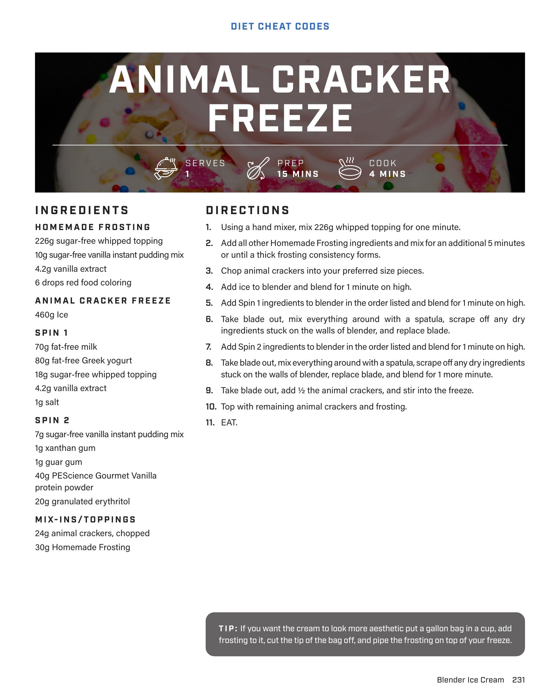

## Source Pages

232

---

# BIRTHDAY CAKE MILKSHAKE

**Serves:** 1 | **Prep:** 8 MINS | **Cook:** 4 MINS

## Macros

| Calories | Fat | Carbs | Net Carbs | Protein |
|----------|-----|-------|-----------|---------|
| 464 | 10 | 70 | 40 | 52 |

## Ingredients

### SPIN 1

- 440g ice
- 84g fat-free milk
- 100g fat-free Greek yogurt
- 4.2g vanilla extract
- 4g cake batter extract
- 1g salt

### SPIN 2

- 7g sugar-free vanilla instant pudding mix
- 1g guar gum
- 1g xanthan gum
- 47g PEScience Cake Pop protein powder
- 30g granulated erythritol

### MIX-INS

- 3 Little Bites® party cake muffins, chopped
- 0g sprinkles

## Directions

1. Chop muffins.
2. Add ice to blender and blend for 1 minute on high.
3. Add Spin 1 ingredients to blender in the order listed and blend for 1 minute on high.
4. Take blade out, mix everything around with a spatula, scrape off any dry ingredients stuck on the walls of blender, and replace blade.
5. Add Spin 2 ingredients to blender in the order listed and blend for 1 minute on high.
6. Take blade out, mix everything around with a spatula, scrape off any dry ingredients stuck on the walls of blender, and replace blade, and blend for 1 more minute on high.
7. Take blade out, add ¾ of the Mix-ins and stir together.
8. Transfer to desired drinking container, top with the rest of the Mix-ins, and enjoy!

## Additional Recipe Pages

## Source Pages

225, 226

---

# CARAMEL PUMPKIN SPICE PROTEIN ICE CREAM

**Serves:** 1 | **Prep:** 8 MINS | **Cook:** 4 MINS

## Macros

| Calories | Fat | Carbs | Net Carbs | Protein |
|----------|-----|-------|-----------|---------|
| 505 | 6 | 69 | 49 | 61 |

## Ingredients

### BLENDER

- 480g ice

### SPIN 1

- 122g pure pumpkin
- 50g fat-free Greek yogurt
- 112g fat-free milk
- 4.2g vanilla extract

### SPIN 2

- 7g sugar-free cheesecake instant pudding mix
- 1g guar gum
- 1g xanthan gum
- 3g pumpkin pie spice
- 62g PEScience Snickerdoodle protein powder
- 20g granulated erythritol

### MIX-INS

- 25g caramel syrup
- 35g fat-free whipped cream

## Directions

1. Add ice to blender and blend for 1 minute.
2. Add Spin 1 ingredients to blender in the order listed and blend for 1 minute on high.
3. Take blade out, mix everything around with a spatula, scrape off any dry ingredients stuck on the walls of blender, and replace blade.
4. Add Spin 2 ingredients to blender in the order listed and blend for 1 minute on high.
5. Take blade out, mix everything around with a spatula, scrape off any dry ingredients stuck on the walls of blender, replace blade, and blend for 1 more minute.
6. Take blade out, add 15g caramel, and fold in with a spatula.
7. Transfer to desired drinking container, top with whipped cream and remaining caramel, and enjoy!

## Additional Recipe Pages

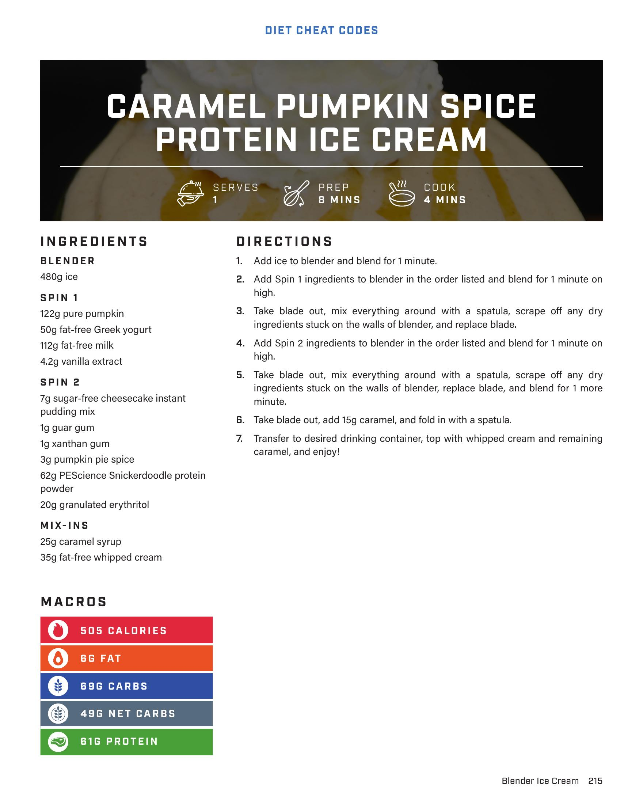

## Source Pages

215, 216

---

# CHOCOLATE CHIP COOKIE FREEZE

**Serves:** 1 | **Prep:** 8 MINS | **Cook:** 15 MINS

## Macros

| Calories | Fat | Carbs | Net Carbs | Protein |
|----------|-----|-------|-----------|---------|
| 497 | 13 | 67 | 47 | 45 |

## Ingredients

### SPIN 1

- 420g ice
- 65g fat-free milk
- 65g fat-free Greek yogurt
- 4.2g vanilla extract
- 18g sugar-free whipped topping
- 1g salt

### SPIN 2

- 7g sugar-free vanilla instant pudding mix
- 1g guar gum
- 1g xanthan gum
- 31g PEScience Gourmet Vanilla protein powder
- 20g granulated erythritol

### MIX-INS

- 50g CHOCOLATE CHIP COOKIE DOUGH (refrigerated)
- 25g Nestle Toll House® cookies (baked, then frozen)

## Directions

1. Bake cookies, chop them into bite sized chunks, and throw them in the freezer at least an hour before you want to eat.
2. Add ice to blender and blend for 1 minute.
3. Add Spin 1 ingredients to blender in the order listed and blend for 1 minute on high.
4. Take blade out, mix everything around with a spatula, scrape off any dry ingredients stuck on the walls of blender, and replace blade.
5. Add Spin 2 ingredients to blender in the order listed and blend for 1 minute on high.
6. Take blade out, mix everything around with a spatula, scrape off any dry ingredients stuck on the walls of blender, replace blade, and blend for 1 more minute.
7. Get Mix-ins, take blade out, put spatula in the corner of the blender, and push ice cream out of the corner to create a tunnel to the bottom of the blender.
8. Add a layer of cookies into the blender tunnel, followed by a layer of cookie dough, and repeat until Mix-ins are gone.
9. After putting blade back into blender, pulse 15 times (yes precisely 15) to make sure Mix-ins are dispersed evenly throughout cream.
10. Pop the top off, take the blade out, and ENJOY.

## Tips

For a more aesthetic freeze along with cookie dough bites throughout, line the drinking container with a third of the cookie dough, add some of the chopped cookies, and mix in the remaining cookie dough/cookie pieces.

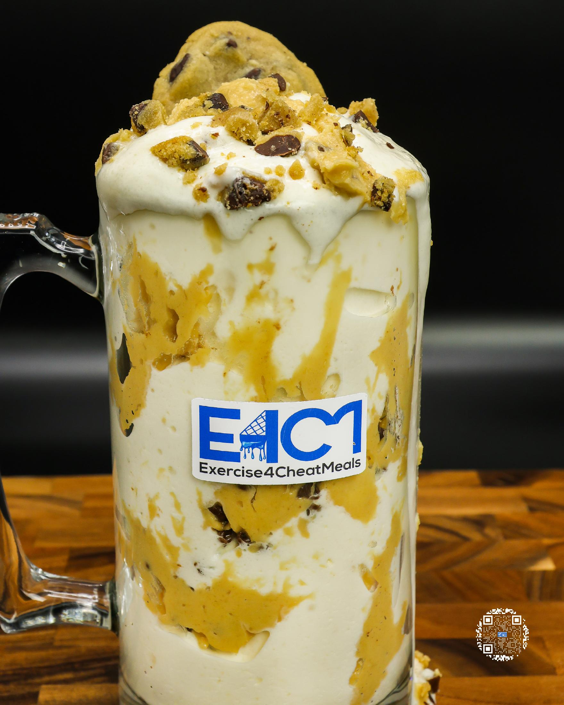

## Additional Recipe Pages

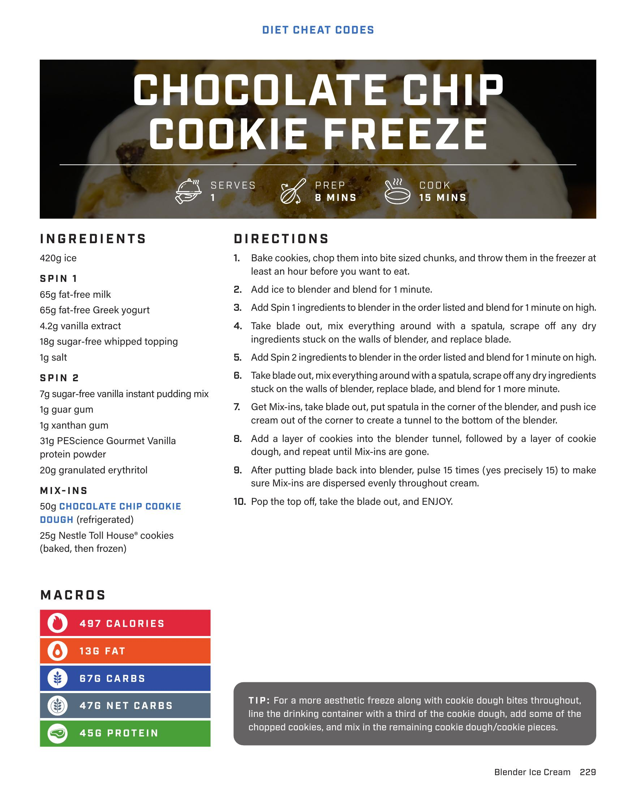

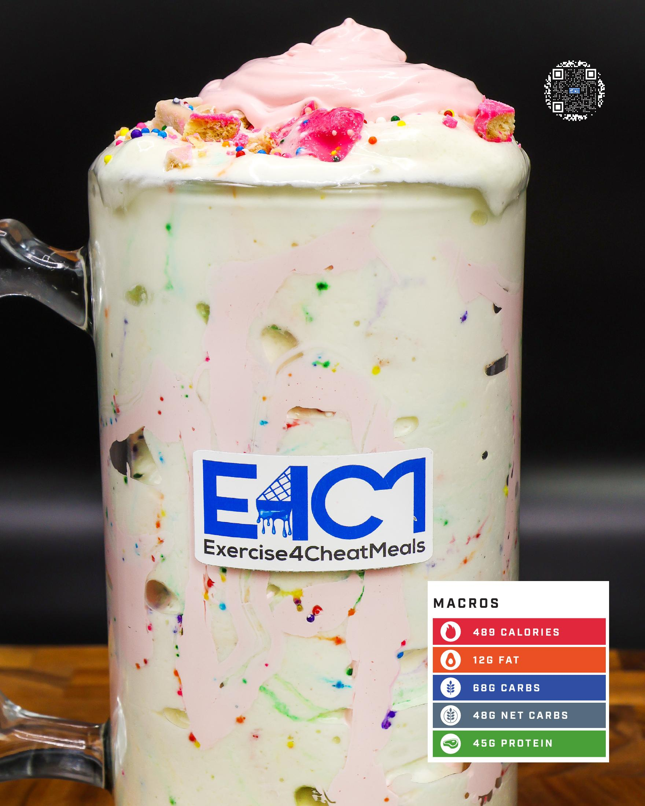

## Source Pages

229, 230, 231

---

# COOKIE DOUGH PROTEIN ICE CREAM

**Serves:** 1 | **Prep:** 8 MINS | **Cook:** 4 MINS

## Macros

| Calories | Fat | Carbs | Net Carbs | Protein |
|----------|-----|-------|-----------|---------|
| 501 | 12 | 60 | 41 | 55 |

## Ingredients

### SPIN 1

- 400g ice
- 18g sugar-free whipped topping
- 130g fat-free Greek yogurt
- 84g fat-free milk
- 4.2g vanilla extract
- 1.5g salt

### SPIN 2

- 7g sugar-free white chocolate instant pudding mix
- 1g xanthan gum
- 1g guar gum
- 31g PEScience Gourmet Vanilla protein powder
- 15g granulated erythritol

### MIX-INS

- 2 Hershey Kisses®, grated
- 60g CHOCOLATE CHIP COOKIE DOUGH

## Directions

1. Add ice to blender and blend for 1 minute.
2. Add Spin 1 ingredients to blender in the order listed and blend for 1 minute on high.
3. Take blade out, mix everything around with a spatula, scrape off any dry ingredients stuck on the walls of blender, and replace blade.
4. Add Spin 2 ingredients to blender in the order listed and blend for 1 minute on high.
5. Take blade out, mix everything around with a spatula, scrape off any dry ingredients stuck on the walls of blender, replace blade, and blend for 1 more minute on high.
6. While blending, grate Hershey Kisses®.
7. Take blender stick out, add Hershey Kisses® to the blender, and mix in with a spatula.
8. Add 3-4 small chunks of cookie dough to the blender and gently fold in. Repeat until 60g of cookie dough has been added.
9. Transfer to desired drinking container, top with the rest of the Mix-ins, and enjoy!

## Tips

For a more aesthetic milkshake, line the drinking container with a third of the cookie dough, mix in a third of the cookie dough, and top with a third of the cookie dough.

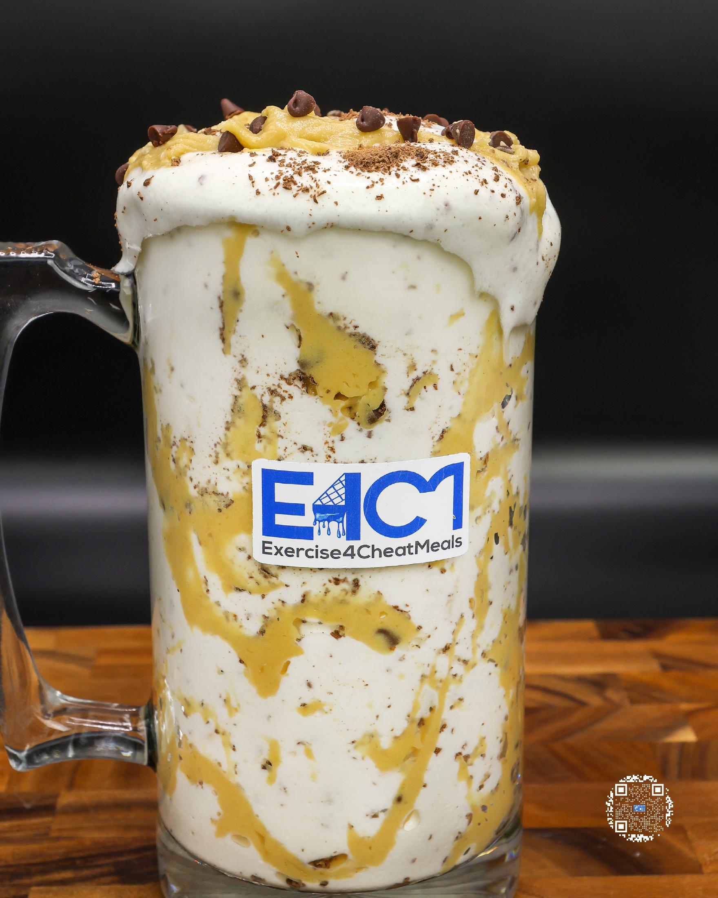

## Additional Recipe Pages

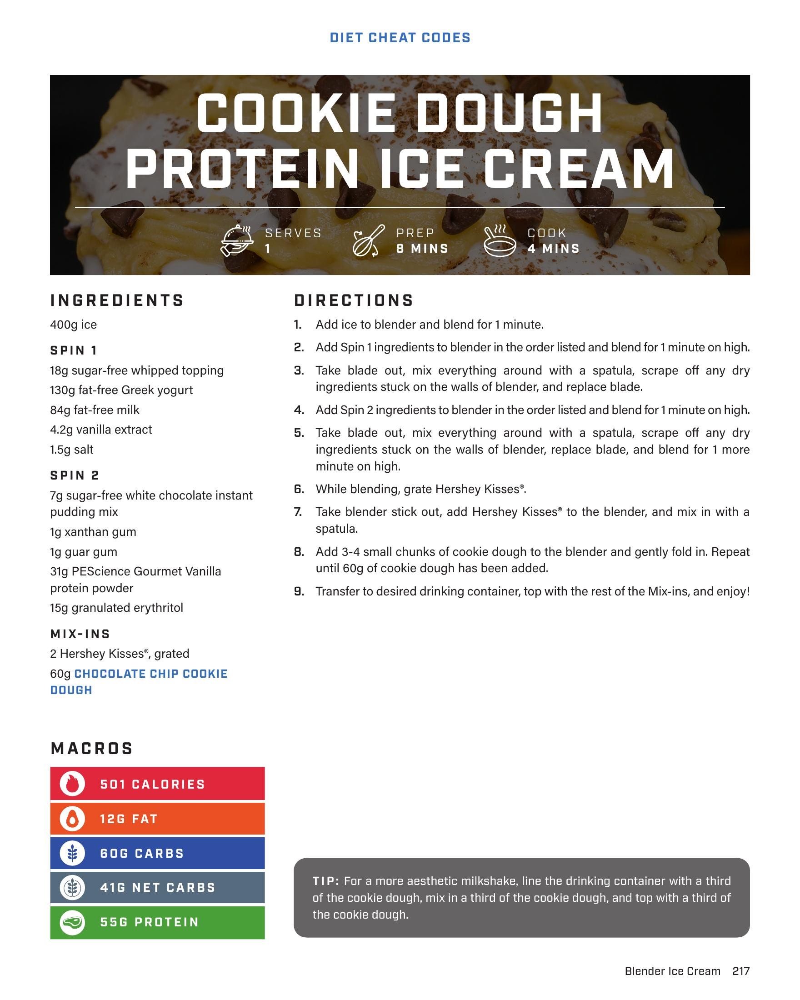

## Source Pages

217, 218

---

# COOKIES N' CREAM NICKFLURRY

**Serves:** 1 | **Prep:** 8 MINS | **Cook:** 4 MINS

## Macros

| Calories | Fat | Carbs | Net Carbs | Protein |
|----------|-----|-------|-----------|---------|
| 547 | 15 | 88 | 58 | 53 |

## Ingredients

### SPIN 1

- 480g ice
- 130g 1% milk
- 120g fat-free Greek yogurt
- 4.2g vanilla extract
- 2g salt

### SPIN 2

- 7g sugar-free vanilla instant pudding mix
- 1.5g guar gum
- 1.5g xanthan gum
- 42g PEScience Cookies and Cream protein powder
- 10g black cocoa powder
- 30g granulated erythritol
- 3 Oreos®

### MIX-INS

- 1 Oreo®, crushed

## Directions

1. Add ice to blender and blend for 1 minute.
2. Add Spin 1 ingredients to blender in the order listed and blend for 1 minute on high.
3. Take blade out, mix everything around with a spatula, scrape off any dry ingredients stuck on the walls of blender, and replace blade.
4. Add Spin 2 ingredients to blender in the order listed and blend for 1 minute on high.
5. Take blade out, mix everything around with a spatula, scrape off any dry ingredients stuck on the walls of blender, and blend for 1 more minute.
6. Add 1/2 the Mix-ins and stir together.
7. Top with remaining Mix-ins and it's time to eat.

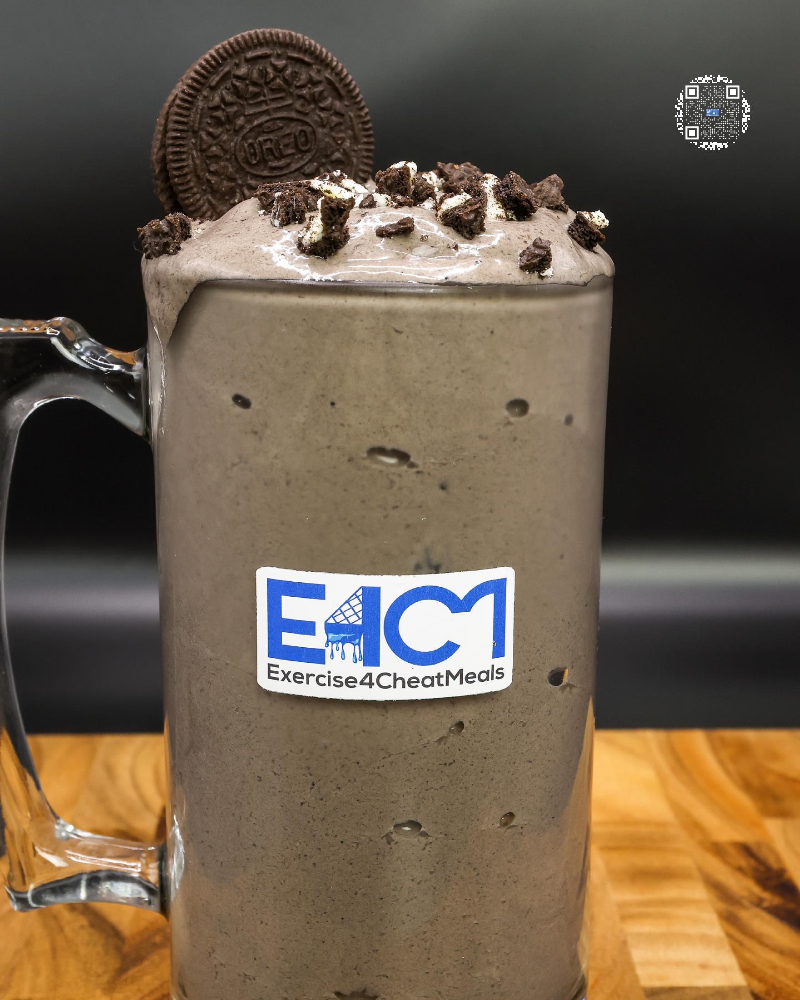

## Additional Recipe Pages

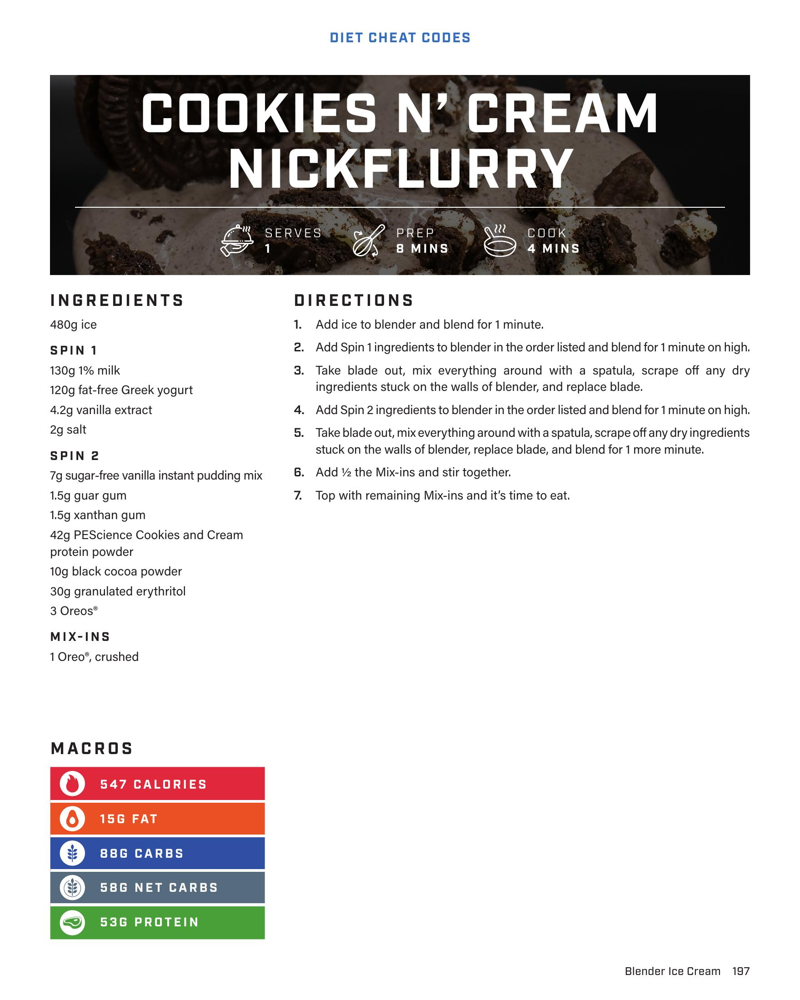

## Source Pages

197, 198

---

# COTTON CANDY PROTEIN ICE CREAM

**Serves:** 1 | **Prep:** 8 MINS | **Cook:** 4 MINS

## Macros

| Calories | Fat | Carbs | Net Carbs | Protein |
|----------|-----|-------|-----------|---------|
| 384 | 6 | 50 | 35 | 48 |

## Ingredients

### SPIN 1

- 460g ice
- 70g 1% milk
- 40g Cotton Candy Skinny Syrup*
- 4.2g vanilla extract
- 22g sugar-free whipped topping
- 1g salt

### SPIN 2

- 7g sugar-free vanilla instant pudding mix
- 1g xanthan gum
- 1g guar gum
- 55g PEScience Gourmet Vanilla protein powder
- 15g granulated erythritol

### MIX-INS

- 14g cotton candy

## Directions

1. Add ice to blender and blend for 1 minute.
2. Add Spin 1 ingredients to blender in the order listed and blend for 1 minute on high.
3. Take blade out, mix everything around with a spatula, scrape off any dry ingredients stuck on the walls of blender, and replace blade.
4. Add Spin 2 ingredients to blender in the order listed and blend for 1 minute on high.
5. Take blade out, mix everything around with a spatula, scrape off any dry ingredients stuck on the walls of blender, replace blade, and blend for 1 more minute.
6. Add cotton candy to the top and stir in with a spatula.
7. Transfer to desired drinking container, top with the rest of the Mix-ins, and enjoy!

## Additional Recipe Pages

## Source Pages

209, 210

---

# CRUNCHY CINNAMON SQUARE PROTEIN ICE CREAM V2

**Serves:** 1 | **Prep:** 8 MINS | **Cook:** 4 MINS

## Macros

| Calories | Fat | Carbs | Net Carbs | Protein |
|----------|-----|-------|-----------|---------|
| 394 | 7 | 55 | 45 | 39 |

## Ingredients

### SPIN 1

- 420g ice
- 80g fat-free Greek yogurt
- 80g fat-free milk
- 4.2g vanilla extract
- 2g salt

### SPIN 2

- 7g sugar-free vanilla instant pudding mix
- 1g xanthan gum
- 1g guar gum
- 31g PEScience Snickerdoodle protein powder
- 10g brown sugar erythritol
- 10g granulated erythritol
- 1g ground cinnamon

### MIX-INS/TOPPINGS

- 20g Cinnamon Toast Crunch® cereal
- 1 Cinnamon Toast Crunch® soft baked bar

## Directions

1. Add ice to blender and blend for 1 minute.
2. Add Spin 1 ingredients to blender in the order listed and blend for 1 minute on high.
3. Take blade out, mix everything around with a spatula, scrape off any dry ingredients stuck on the walls of blender, and replace blade.
4. Add Spin 2 ingredients to blender in the order listed and blend for 1 minute on high.
5. Take blade out, mix everything around with a spatula, scrape off any dry ingredients stuck on the walls of blender, replace blade, and blend for 1 more minute.
6. Take blade out, add ¾ Mix-ins, and stir together.
7. Transfer to desired drinking container, top with the rest of the Mix-ins, and enjoy!

## Additional Recipe Pages

## Source Pages

201, 202, 203

---

# CRUNCHY CINNAMON SQUARES PROTEIN ICE CREAM V1

**Serves:**  | **Prep:** 6 MINS | **Cook:** 4 MINS

## Macros

| Calories | Fat | Carbs | Net Carbs | Protein |
|----------|-----|-------|-----------|---------|
| 368 | 3 | 35 | 17 | 67 |

## Ingredients

### SPIN 1

- 440g ice
- 84g fat-free milk
- 140g fat-free Greek yogurt
- 4.2g vanilla extract
- 1g salt

### SPIN 2

- 7g sugar-free vanilla instant pudding mix
- 1g guar gum
- 1g xanthan gum
- 62g PEScience Snickerdoodle protein powder
- 2g cinnamon
- 18g brown sugar erythritol
- 18g granulated erythritol

## Directions

1. Add ice to blender and blend for 1 minute.
2. Add Spin 1 ingredients to blender in the order listed and blend for 1 minute on high.
3. Take blade out, mix everything around with a spatula, scrape off any dry ingredients stuck on the walls of blender, and replace blade.
4. Add Spin 2 ingredients to blender in the order listed and blend for 1 minute on high.
5. Take blade out, mix everything around with a spatula, scrape off any dry ingredients stuck on the walls of blender, replace blade, and blend for 1 more minute.
6. Transfer to desired drinking container and enjoy!

## Additional Recipe Pages

## Source Pages

199, 200

---

# HAZELNUT PROTEIN ICE CREAM

**Serves:** 1 | **Prep:** 8 MINS | **Cook:** 4 MINS

## Macros

| Calories | Fat | Carbs | Net Carbs | Protein |
|----------|-----|-------|-----------|---------|
| 492 | 15 | 74 | 39 | 48 |

## Ingredients

### SPIN 1

- 500g ice
- 90g fat-free milk
- 90g fat-free Greek yogurt
- 5g vanilla extract
- 5g hazelnut extract
- 2g salt

### SPIN 2

- 7g sugar-free white chocolate instant pudding mix
- 1g xanthan gum
- 1g guar gum
- 46.5g Gorilla Mode Vanilla Ice Cream protein powder
- 35g granulated erythritol

### MIX-INS/TOPPINGS

- 32g Nutella®
- 4g hazelnuts, chopped

## Directions

1. Chop hazelnuts and heat Nutella® for 20 seconds in the microwave.
2. Drizzle Nutella® all over the inside of a large cup, but leave 5-6 grams for topping later.
3. Sprinkle ¼ of the hazelnuts inside the cup, making sure the nuts are evenly dispersed.
4. Add ice to blender and blend for 1 minute.
5. Add Spin 1 ingredients to blender in the order listed and blend for 1 minute on high.
6. Take blade out, mix everything around with a spatula, scrape off any dry ingredients stuck on the walls of blender, and replace blade.
7. Add Spin 2 ingredients to blender in the order listed and blend for 1 minute on high.
8. Take blade out, mix everything around with a spatula, scrape off any dry ingredients stuck on the walls of blender, and replace blade, and blend for 1 more minute.
9. Take blade out, pour ice cream into the Nutella®-lined cup, add remaining toppings, and enjoy.

## Additional Recipe Pages

## Source Pages

213, 214

---

# LEMON PROTEIN ICE CREAM

**Serves:** 1 | **Prep:** 12 MINS | **Cook:** 4 MINS

## Macros

| Calories | Fat | Carbs | Net Carbs | Protein |
|----------|-----|-------|-----------|---------|
| 506 | 9 | 72 | 42 | 64 |

## Ingredients

### SPIN 1

- 420g Ice
- 56g fat-free milk
- 106g fat-free Greek yogurt
- 50g lemon juice
- 2g lemon zest
- 4.2g vanilla extract
- 1g salt

### SPIN 2

- 7g sugar-free vanilla instant pudding mix
- 1g guar gum
- 1g xanthan gum
- 62g PEScience Gourmet Vanilla protein powder
- 30g granulated erythritol

### MIX-INS

- 4 Lemon Oreo Thins®, crushed

## Directions

1. Zest the lemon, juice the lemon, and crush Oreos®.
2. Add ice to blender and blend for 1 minute.
3. Add Spin 1 ingredients to blender in the order listed and blend for 1 minute on high.
4. Take blade out, mix everything around with a spatula, scrape off any dry ingredients stuck on the walls of blender, and replace blade.
5. Add Spin 2 ingredients to blender in the order listed and blend for 1 minute on high.
6. Take blade out, mix everything around with a spatula, scrape off any dry ingredients stuck on the walls of blender, replace blade, and blend for 1 more minute.
7. Take blade out, add ¾ of the Mix-ins, and stir together.
8. Transfer to desired drinking container, top with the rest of the Mix-ins, and enjoy!

## Additional Recipe Pages

## Source Pages

219, 220

---

# MINT CHOCOLATE COOKIE PROTEIN ICE CREAM

**Serves:** 1 | **Prep:** 6 MINS | **Cook:** 4 MINS

## Macros

| Calories | Fat | Carbs | Net Carbs | Protein |
|----------|-----|-------|-----------|---------|
| 0 | 0 | 0 | N/A | 0 |

## Ingredients

- 480g ice

### SPIN 1

- 84g fat-free milk
- 140g fat-free Greek yogurt
- 15 drops or ¼ tsp peppermint extract
- 4.2g vanilla extract
- 12 drops green food coloring (optional)
- 1g salt

### SPIN 2

- 10g Oreo® instant pudding mix
- 1g xanthan gum
- 1g guar gum
- 62g PEScience Gourmet Vanilla protein powder
- 30g granulated erythritol

### MIX-INS

- 4 Mint Oreo Thins®, crushed
- 7g Dark Chocolate Hershey Kisses®, grated

## Directions

1. Crush Oreo Thins® into your preferred chunks and grate chocolate on small-holed side of grater.
2. Add ice to blender and blend for 1 minute.
3. Add Spin 1 ingredients to blender in the order listed and blend for 1 minute on high.
4. Take blade out, mix everything around with a spatula, scrape off any dry ingredients stuck on the walls of blender, and replace blade.
5. Add Spin 2 ingredients to blender in the order listed and blend for 1 minute on high.
6. Take blade out, mix everything around with a spatula, scrape off any dry ingredients stuck on the walls of blender, replace blade, and blend for 1 more minute.
7. Take blade out, add ¾ Mix-ins, and stir together.
8. Transfer to desired drinking container, top with the rest of the Mix-ins, and enjoy!

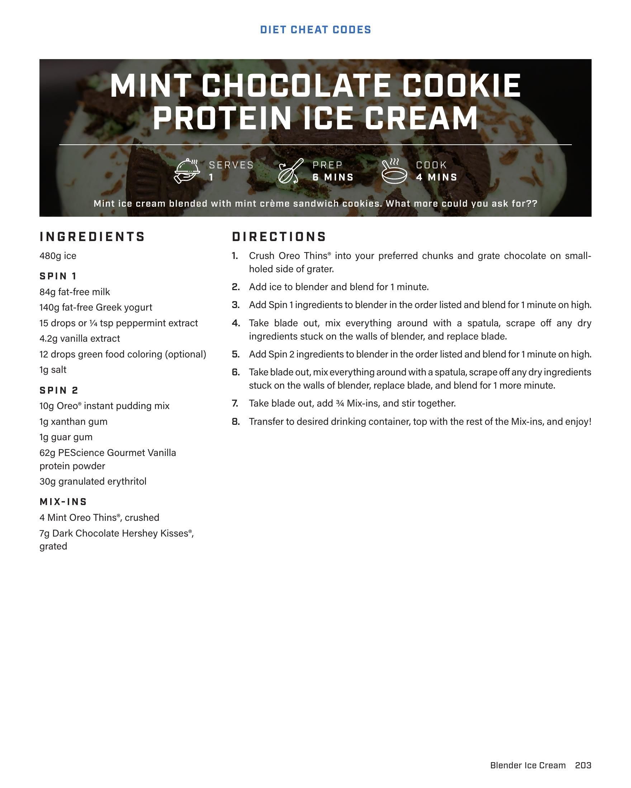

## Source Pages

204

---

# MINT COOKIE FREEZE

**Serves:** 1 | **Prep:** 0 MINS | **Cook:** 4 MINS

## Macros

| Calories | Fat | Carbs | Net Carbs | Protein |
|----------|-----|-------|-----------|---------|
| 490 | 11 | 71 | 51 | 44 |

## Ingredients

- 460g Ice

### SPIN 1

- 65g fat-free milk
- 80g fat-free Greek yogurt
- 4.2g vanilla extract
- 14g creme de menthe syrup
- 18g sugar-free whipped topping
- 1g salt

### SPIN 2

- 7g sugar-free vanilla instant pudding mix
- 1g guar gum
- 1g xanthan gum
- 40g PEScience Gourmet Vanilla protein powder
- 20g granulated erythritol

### MIX-INS

- 29g Grasshoppers® or Thin Mints®, chopped

## Directions

1. Chop up Mix-ins.
2. Add ice to blender and blend for 1 minute.
3. Add Spin 1 ingredients to blender in the order listed and blend for 1 minute on high.
4. Take blade out, mix everything around with a spatula, scrape off any dry ingredients stuck on the walls of blender, and replace blade.
5. Add Spin 2 ingredients to blender in the order listed and blend for 1 minute on high.
6. Take blade out, mix everything around with a spatula, scrape off any dry ingredients stuck on the walls of blender, replace blade, and blend for 1 more minute.
7. Take blade out, add ¾ Mix-ins, and stir together.
8. Transfer to desired drinking container, top with the rest of the Mix-ins, and enjoy!

## Additional Recipe Pages

## Source Pages

233, 234

---

# OATMEAL CRÈME PIE PROTEIN ICE CREAM

**Serves:** 1 | **Prep:** 8 MINS | **Cook:** 4 MINS

## Macros

| Calories | Fat | Carbs | Net Carbs | Protein |
|----------|-----|-------|-----------|---------|
| 432 | 9 | 60 | 51 | 38 |

## Ingredients

### SPIN 1

- 420g ice
- 75g fat-free milk
- 75g fat-free Greek yogurt
- 4.2g vanilla extract
- 2g salt

### SPIN 2

- 7g sugar-free vanilla instant pudding mix
- 1g xanthan gum
- 1g guar gum
- 31g PEScience Snickerdoodle protein powder
- 9g brown sugar erythritol
- 9g granulated erythritol
- 1g ground cinnamon

### MIX-INS

- 1 Little Debbie® oatmeal creme pie
- 14g mini marshmallows

## Directions

1. Break creme pie into bite-sized chunks.
2. Add ice to blender and blend for 1 minute.
3. Add Spin 1 ingredients to blender in the order listed and blend for 1 minute on high.
4. Take blade out, mix everything around with a spatula, scrape off any dry ingredients stuck on the walls of blender, and replace blade.
5. Add Spin 2 ingredients to blender in the order listed and blend for 1 minute on high.
6. Take blade out, mix everything around with a spatula, scrape off any dry ingredients stuck on the walls of blender, replace blade, and blend for 1 more minute.
7. Take blade out, add ¾ Mix-ins, and stir together.
8. Transfer to desired drinking container, top with remaining Mix-ins, and EAT!

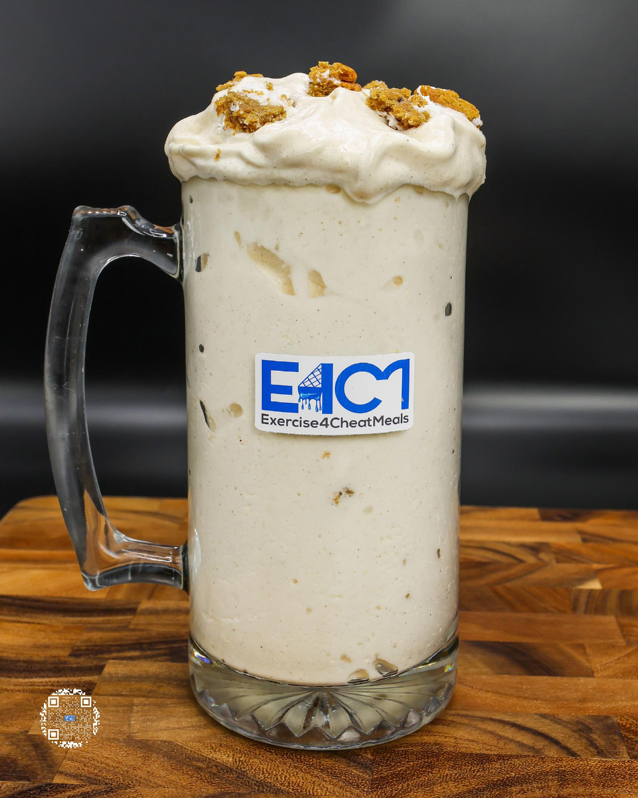

## Additional Recipe Pages

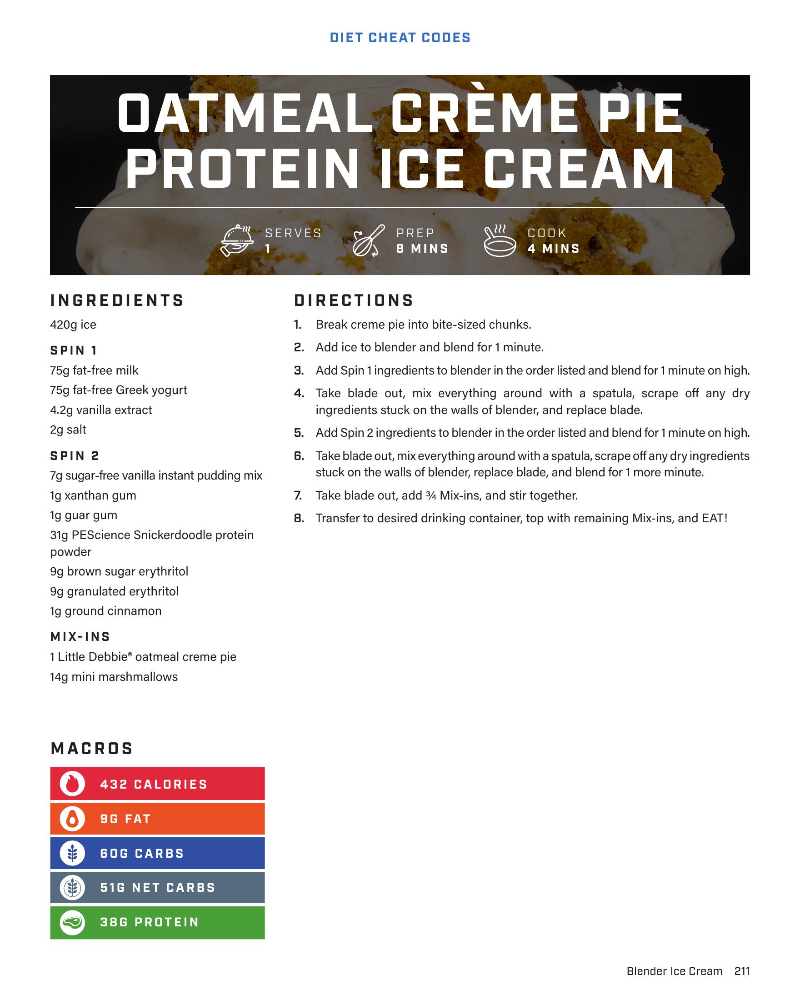

## Source Pages

211, 212

---

# PEANUT BUTTER CUP MILKSHAKE

**Serves:** 1 | **Prep:** 8 MINS | **Cook:** 4 MINS

## Macros

| Calories | Fat | Carbs | Net Carbs | Protein |
|----------|-----|-------|-----------|---------|
| 558 | 16 | 69 | 39 | 67 |

## Ingredients

### SPIN 1

- 460g ice
- 120g fat-free milk
- 140g fat-free Greek yogurt
- 1g salt

### SPIN 2

- 7g sugar-free chocolate fudge instant pudding mix
- 1g xanthan gum
- 1g guar gum
- 20g powdered peanut butter
- 5g unsweetened cocoa powder
- 41g PEScience Peanut Butter Cup protein powder
- 30g granulated erythritol

### MIX-INS

- 8g peanut butter
- 2 Reese's Thins®, chopped

## Directions

1. Add ice to blender and blend for 1 minute.
2. Add Spin 1 ingredients to blender in the order listed and blend for 1 minute on high.
3. Take blade out, mix everything around with a spatula, scrape off any dry ingredients stuck on the walls of blender, and replace blade. Add Spin 2 ingredients to blender in the order listed and blend for 1 more minute.
4. Take blade out, mix everything around with a spatula, scrape off any dry ingredients stuck on the walls of blender, replace blade, and blend for 1 more minute.
5. While blending, chop up Reese's Thins® into desired chunks and microwave peanut butter in small bowl for 30 seconds.
6. Take blade out, add ½ the Mix-ins, and fold in.
7. Top the milkshake with the rest of the Mix-ins and eat right out of the blender or pour into a cup and enjoy!

## Tips

Leave Reese's® in the freezer to make them easier to chop when ready to make a shake. This will also slow the melting process of the milkshake so you can enjoy for longer.

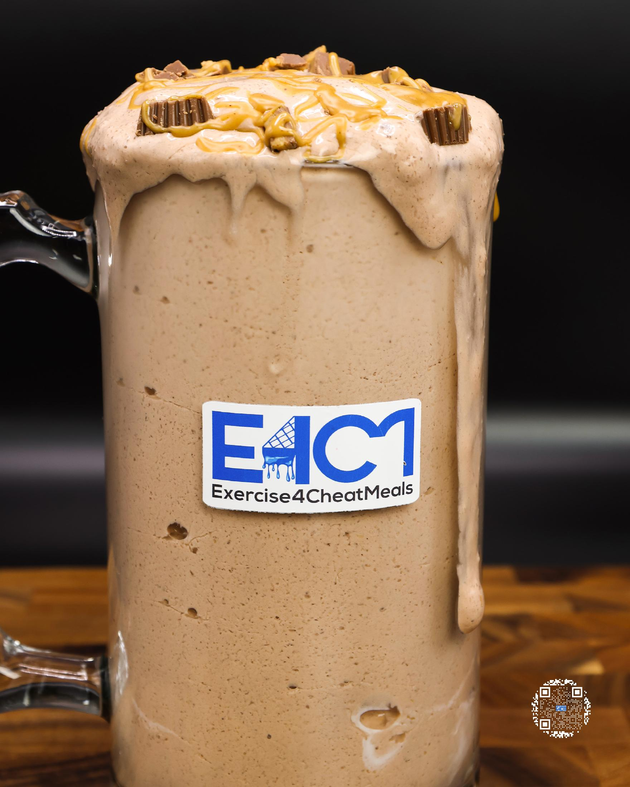

## Additional Recipe Pages

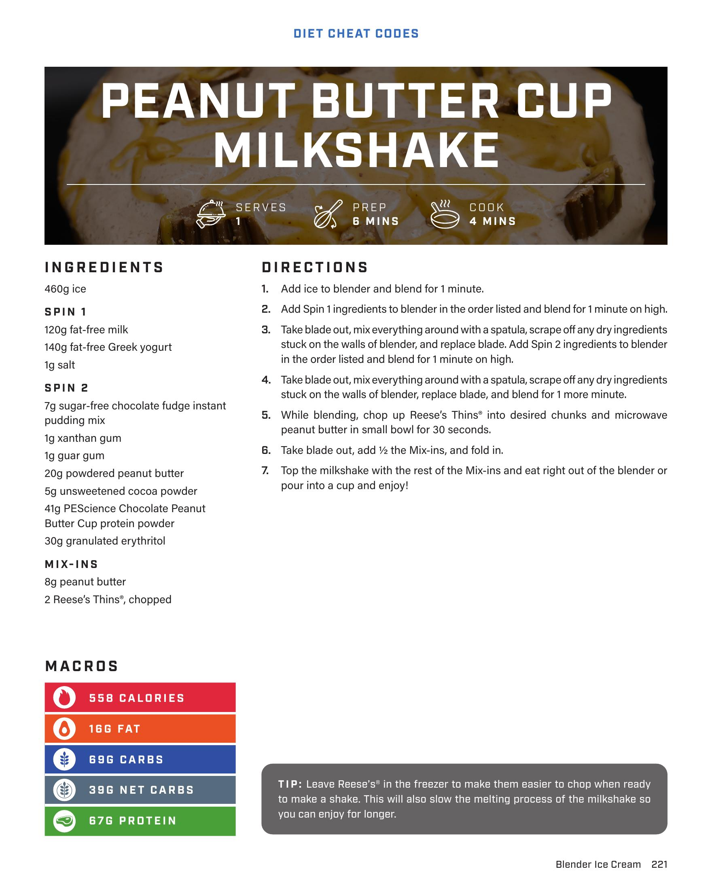

## Source Pages

221, 222

---

# PECAN PIE FREEZE

**Serves:** 1 | **Prep:** 8 MINS | **Cook:** 4 MINS

## Macros

| Calories | Fat | Carbs | Net Carbs | Protein |
|----------|-----|-------|-----------|---------|
| 594 | 21 | 78 | 53 | 53 |

## Ingredients

- 480g Ice
- 120g fat-free milk
- 120g fat-free Greek yogurt
- 4.2g vanilla extract
- 2g salt

### SPIN 2

- 7g sugar-free vanilla instant pudding mix
- 1g guar gum
- 1g xanthan gum
- 38g PEScience Gourmet Vanilla protein powder
- 25g granulated erythritol

### MIX-INS

- 31g Candied Pecans, chopped
- 18g Salerno's butter cookies, chopped
- 23g caramel sauce

## Directions

1. Chop pecans and butter cookies.
2. Add ice to blender and blend for 1 minute.
3. Add Spin 1 ingredients to blender in the order listed and blend for 1 minute on high.
4. Take blade out, mix everything around with a spatula, scrape off any dry ingredients stuck on the walls of blender, and replace blade.
5. Add Spin 2 ingredients to blender in the order listed and blend for 1 minute on high.
6. Take blade out, mix everything around with a spatula, scrape off any dry ingredients stuck on the walls of blender, replace blade, and blend for 1 more minute.
7. Take blade out, add ¾s the pecans and butter cookies, and stir together.
8. Get caramel, put spatula in the corner of the blender, and push ice cream out of the corner using the spatula to create a tunnel to the bottom of the blender.
9. Add caramel from the bottom to the top.
10. Fold in caramel, top with remaining Mix-ins, and enjoy!

## Tips

For a more aesthetic freeze, line the inside of a large glass with % of the caramel after Step 7 and immediately pour it into the glass. Top with the remaining Mix-ins and caramel and enjoy!

## Additional Recipe Pages

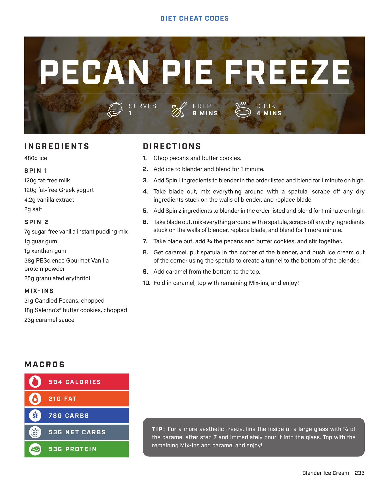

## Source Pages

235, 236

---

# PEPPERMINT CHIP MILKSHAKE

**Serves:** 1 | **Prep:** 8 MINS | **Cook:** 4 MINS

## Macros

| Calories | Fat | Carbs | Net Carbs | Protein |
|----------|-----|-------|-----------|---------|
| 507 | 13 | 68 | 40 | 55 |

## Ingredients

### SPIN 1

- 440g ice
- 160g 1% milk
- 140g fat-free Greek yogurt
- 4.2g vanilla extract
- 8 drops peppermint extract
- 6 drops red food coloring
- 2g salt

### SPIN 2

- 7g sugar-free vanilla instant pudding mix
- 1g xanthan gum
- 1g guar gum
- 38g PEScience Gourmet Vanilla protein powder
- 28g granulated erythritol

### MIX-INS/TOPPINGS

- 30g fat-free whipped topping
- 1 maraschino cherry
- 2 Ghirardelli® peppermint bark squares, chopped

## Directions

1. Add ice to blender and blend for 1 minute.
2. Add Spin 1 ingredients to blender in the order listed and blend for 1 minute on high.
3. Take blade out, mix everything around with a spatula, scrape off any dry ingredients stuck on the walls of blender, and replace blade.
4. Add Spin 2 ingredients to blender in the order listed and blend for 1 minute on high.
5. Take blade out, mix everything around with a spatula, scrape off any dry ingredients stuck on the walls of the blender, and replace blade.
6. Add peppermint bark squares and blend for 1 minute.
7. Top with whipped cream and cherry and enjoy!

## Additional Recipe Pages

## Source Pages

227, 228

---

# SALTED CARAMEL FUDGE BROWNIE PROTEIN ICE CREAM

**Serves:** 1 | **Prep:** 0 MINS | **Cook:** 4 MINS

## Macros

| Calories | Fat | Carbs | Net Carbs | Protein |
|----------|-----|-------|-----------|---------|
| 523 | 12 | 72 | 54 | 45 |

## Ingredients

- 400g ice

### SPIN 1

- 90g fat-free milk
- 90g fat-free Greek yogurt
- 4.2g vanilla extract
- 2g salt

### SPIN 2

- 7g sugar-free vanilla instant pudding mix
- 1g guar gum
- 1g xanthan gum
- 38g PEScience Gourmet Vanilla protein powder
- 18g granulated erythritol

### MIX-INS

- 2 Toffee Crunch Oreos®
- 1 brownie bite (85 Cal)

### TOPPING

- 12g sea salt caramel sauce
- Dash sea salt

## Directions

1. Chop up Oreos® and the brownie bite and put to the side.
2. Add ice to blender and blend for 1 minute.
3. Add Spin 1 ingredients to blender in the order listed and blend for 1 minute on high.
4. Take blade out, mix everything around with a spatula, scrape off any dry ingredients stuck on the walls of blender, and replace blade.
5. Add Spin 2 ingredients to blender in the order listed and blend for 1 minute on high.
6. Take blade out, mix everything around with a spatula, scrape off any dry ingredients stuck on the walls of blender, replace blade, and blend for 1 more minute.
7. Take blade out, add ¾ Mix-ins, and fold in.
8. Transfer to desired drinking container, top with the rest of the Mix-ins and toppings, and enjoy!

## Tips

For an even better eating experience, after step 7, line a large glass with the sea salt caramel. Then sprinkle some of the Mix-ins into the glass which will stick directly onto the caramel. Pour the ice cream into your glass, top with remaining caramel and Mix-ins, and continually get bites filled with caramel, oreo®, and brownie as you eat your way down the glass.

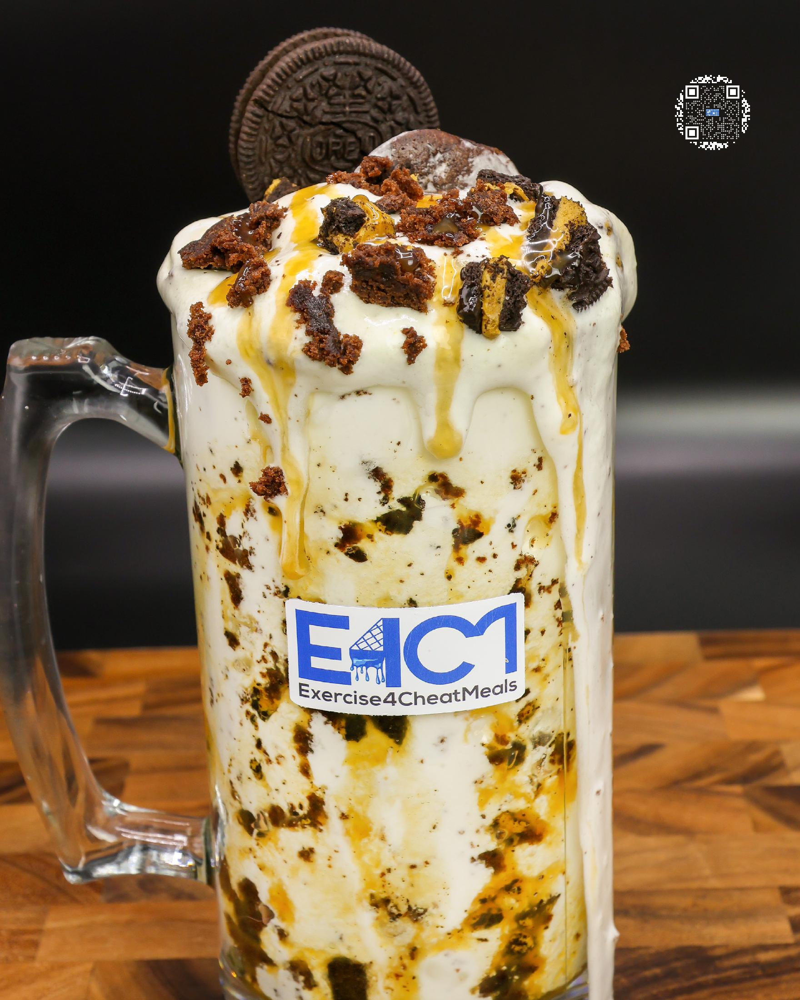

## Additional Recipe Pages

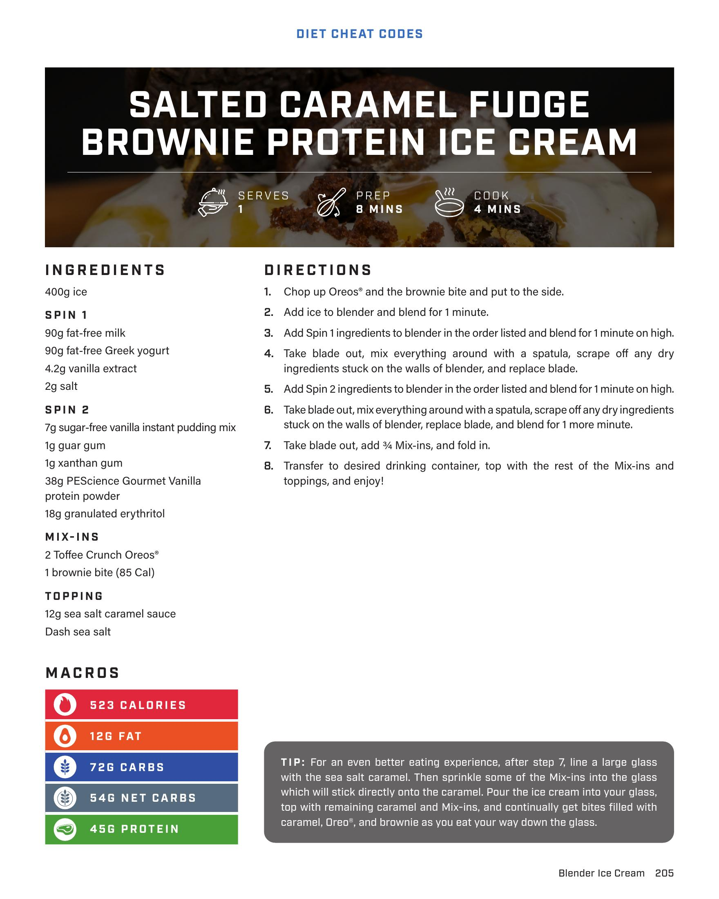

## Source Pages

205, 206

---

# S'Mores Protein Ice Cream

**Serves:** 1 | **Prep:** 10 MINS | **Cook:** 4 MINS

## Macros

| Calories | Fat | Carbs | Net Carbs | Protein |
|----------|-----|-------|-----------|---------|
| 460 | 3 | 80 | 62 | 44 |

## Ingredients

- 480g ice

### SPIN 1

- 84g fat-free milk
- 60g fat-free Greek yogurt
- 2.1g vanilla extract
- 1.5g salt
- 6 large marshmallows (150 Cal)

### SPIN 2

- 7g sugar-free vanilla instant pudding mix
- 1g guar gum
- 1g xanthan gum
- 40g PEScience Gourmet Vanilla protein powder
- 18g granulated erythritol

### MIX-INS

- 15g graham crackers

## Directions

1. Chop graham crackers
2. Place marshmallows in an even line on a lightly oiled sheet pan and put underneath the broiler for 45 seconds to a minute or until browned to your preference. CAUTION: Do not leave the oven unattended, you must watch this process. This can easily start on fire if just left under the broiler for an extended period of time.
3. Add ice to blender and blend for 1 minute on high.
4. Add Spin 1 ingredients to blender in the order listed and blend for 1 minute on high.
5. Take blade out, mix everything around with a spatula, scrape off any dry ingredients stuck on the walls of blender, and replace blade.
6. Add Spin 2 ingredients to blender in the order listed and blend for 1 minute on high.
7. Take blade out, mix everything around with a spatula, scrape off any dry ingredients stuck on the walls of blender, replace blade, and blend for 1 more minute.
8. Take blade out, add ¾ Mix-ins, and stir together.
9. Transfer to desired drinking container, top with remaining graham crackers and EAT!

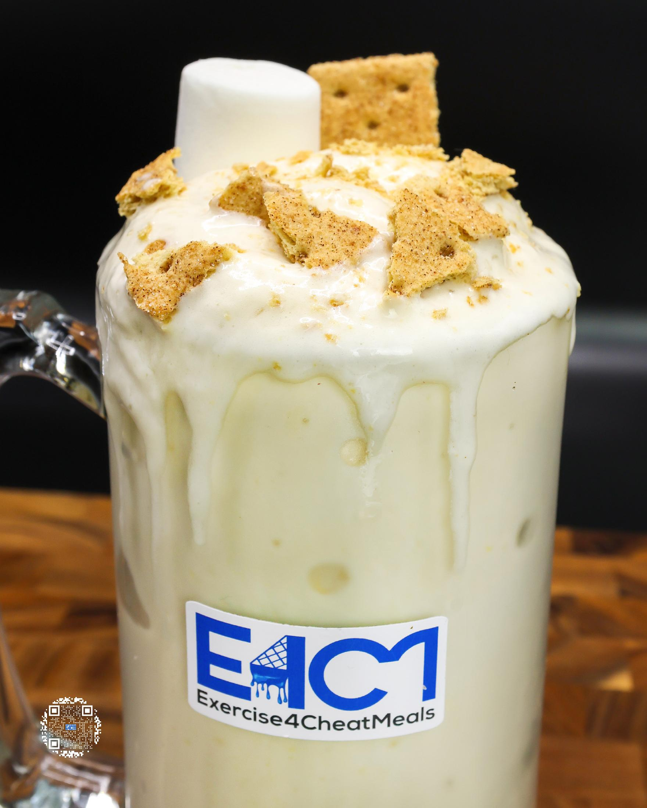

## Additional Recipe Pages

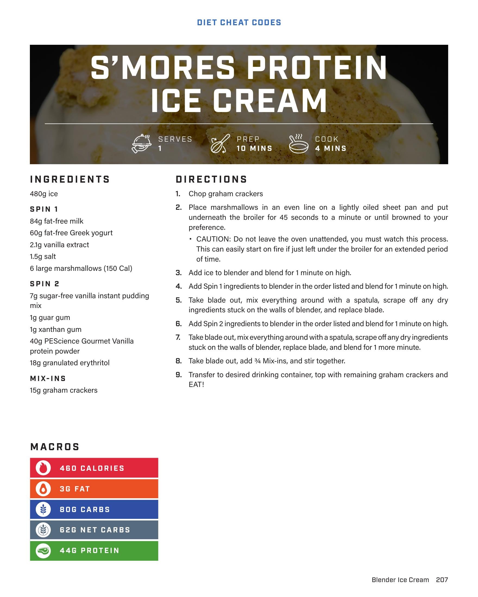

## Source Pages

207, 208

---

# STRAWBERRY DONUT MILKSHAKE

**Serves:** 1 | **Prep:** 8 MINS | **Cook:** 4 MINS

## Macros

| Calories | Fat | Carbs | Net Carbs | Protein |
|----------|-----|-------|-----------|---------|
| 513 | 10 | 70 | 50 | 52 |

## Ingredients

### SPIN 1

- 360g Ice
- 100g frozen strawberries
- 84g fat-free milk
- 150g fat-free Greek yogurt
- 6g strawberry extract
- 4.2g vanilla extract
- 2g salt

### SPIN 2

- 7g sugar-free vanilla instant pudding mix
- 1g xanthan gum
- 1g guar gum
- 40g PEScience Gourmet Vanilla protein powder
- 20g granulated erythritol

### MIX-INS

- 6g sprinkles
- 2 Strawberry Frosted Donut Oreos®, chopped OR 4 Vanilla Oreo Thins®, chopped

## Directions

1. Add ice to blender and blend for 1 minute.
2. Add Spin 1 ingredients to blender in the order listed and blend for 1 minute on high.
3. Take blade out, mix everything around with a spatula, scrape off any dry ingredients stuck on the walls of blender, and replace blade.
4. Add Spin 2 ingredients to blender in the order listed and blend for 1 minute on high.
5. Take blade out, mix everything around with a spatula, scrape off any dry ingredients stuck on the walls of blender, replace blade, and blend for 1 more minute.
6. Take blade out, add ¾ Mix-ins, and stir together.
7. Transfer to desired drinking container, top with the rest of the Mix-ins, and enjoy!

## Tips

You can use pre-packaged frozen strawberries or buy your own from the store. If you buy fresh from the produce sections just cut off the stem of the strawberries and add them to a plastic bag. They should be frozen and ready to go in just a few hours. If you want an even deeper strawberry flavor, substitute some of the ice for frozen strawberries. Just make sure you account for any changes in your calorie tracking. Also, depending on the freshness and sweetness of your strawberries you may need to add more or less granulated erythritol.

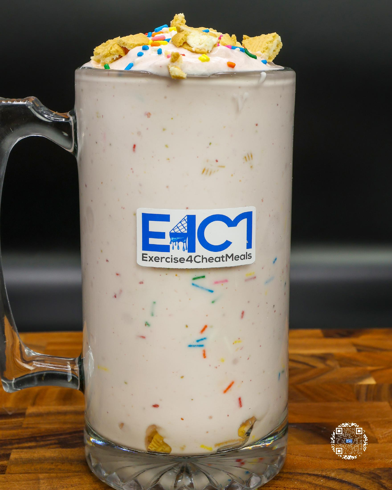

## Additional Recipe Pages

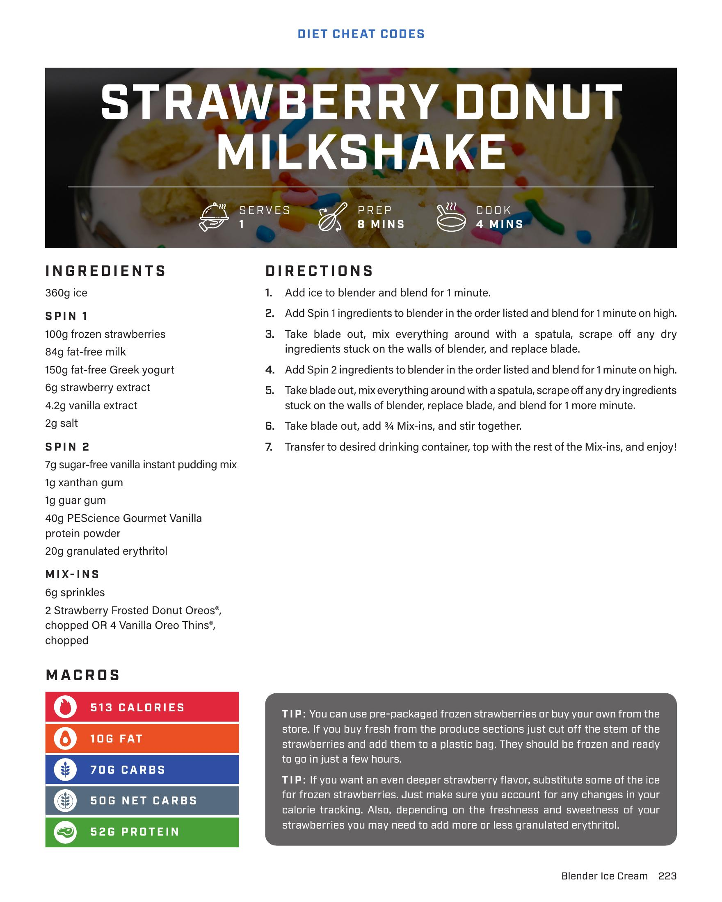

## Source Pages

223, 224

---

# STRAWBERRY SOFT SERVE

**Serves:** 1 | **Prep:** 8 MINS | **Cook:** 4 MINS

## Macros

| Calories | Fat | Carbs | Net Carbs | Protein |
|----------|-----|-------|-----------|---------|
| 388 | 2 | 78 | 53 | 37 |

## Ingredients

### SPIN 1

- 470g ice
- 110g fat-free milk
- 40g Torani* strawberry puree
- 4.2g vanilla extract
- 2g salt

### SPIN 2

- 7g sugar-free vanilla instant pudding mix
- 1g guar gum
- 1g xanthan gum
- 40g PEScience Gourmet Vanilla protein powder
- 25g granulated erythritol

## Directions

1. Add ice to blender and blend for 1 minute on high.
2. Add Spin 1 ingredients to blender in the order listed and blend for 1 minute on high.
3. Take blade out, mix everything around with a spatula, scrape off any dry ingredients stuck on the walls of blender, and replace blade.
4. Add Spin 2 ingredients to blender in the order listed and blend for 1 minute on high.
5. Take blade out, mix everything around with a spatula, scrape off any dry ingredients stuck on the walls of blender, replace blade, and blend for 1 more minute.
6. Take blade out, pour into a glass, and enjoy.

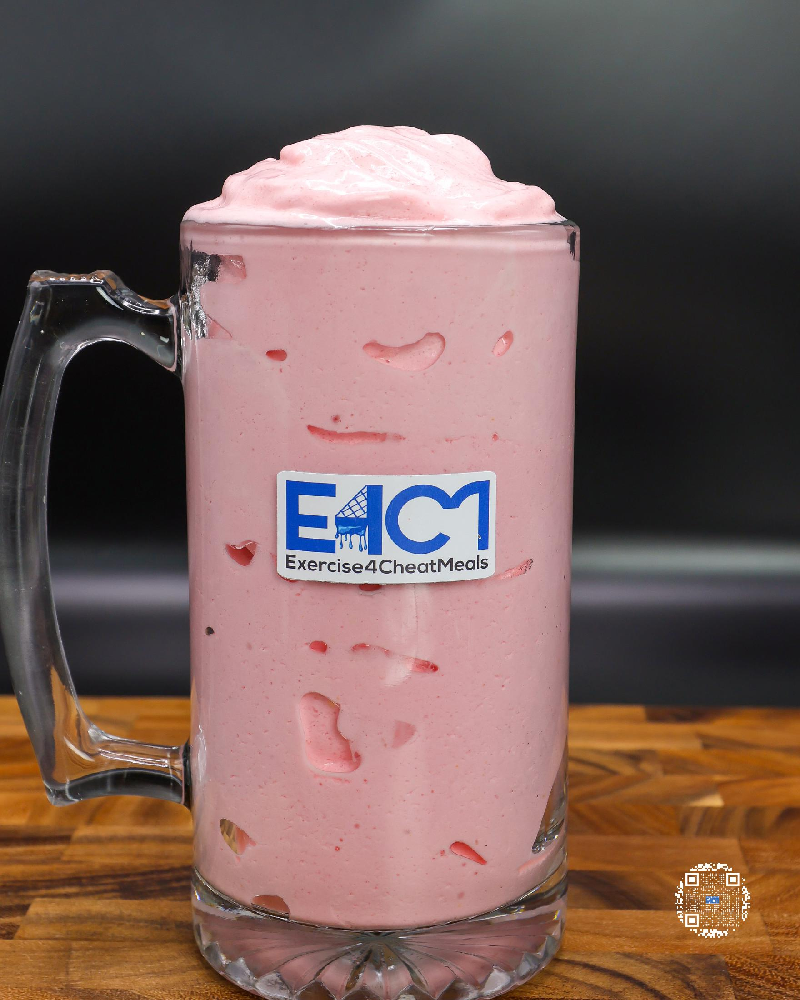

## Additional Recipe Pages

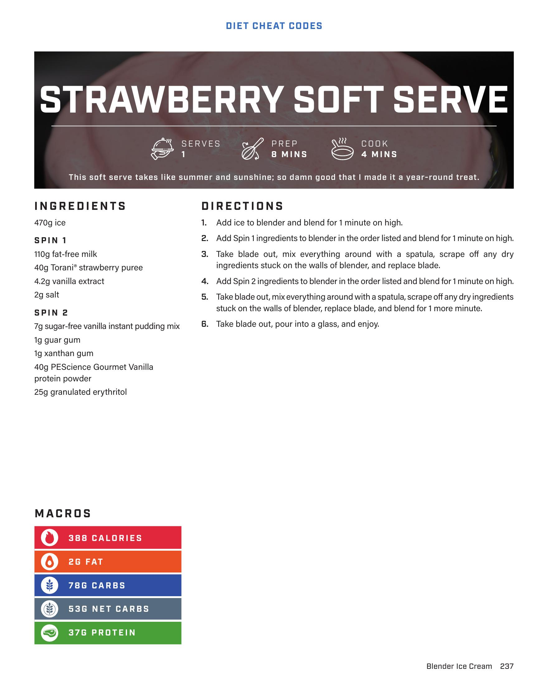

## Source Pages

237, 238

---

# BURRITO TORTILLAS

**Serves:** 2 | **Prep:** 60 MINS | **Cook:** 3 MINS

## Macros

| Calories | Fat | Carbs | Net Carbs | Protein |
|----------|-----|-------|-----------|---------|
| 177 | 4 | 37 | 22 | 14 |

## Ingredients

### DRY

- 42g all-purpose flour
- 30g vital wheat gluten
- 30g oat fiber
- 2g baking powder
- 2g salt
- 2g xanthan gum

### WET

- 6g avocado oil
- 85g water

## Directions

1. Add Dry Ingredients into a medium-sized bowl and whisk to combine.
2. In a separate bowl, mix the Wet Ingredients together, add to the Dry Ingredients, and mix with a spoon until most of the ingredients come together.
3. Dump the contents of the bowl onto the counter and use hands to incorporate until there are no more dry parts left in the dough.
4. Finish "kneading" this dough by squeezing dough for 30-60 seconds, switching hands with each squeeze.
5. Divide dough in half, form into balls, cover with a damp towel or wrap each ball individually with plastic wrap, and rest dough for 30 minutes.
6. Dust counter with flour, plop a dough ball down, dust top of the dough with flour, and roll out using a rolling pin. If dough starts sticking to the rolling pin, add more flour where it is sticking, spread, and continue. I like to roll the dough 4-5 times then turn it 90 degrees, roll 4-5 times again, and repeat.
7. Once rolled out to 11-12" place underneath a damp tea towel or kitchen towel to prevent the tortilla from drying out.
8. Repeat with the second tortilla and place on a preheated cast iron or griddle on medium-high heat.
9. Cook each side for 30-60 seconds, flip, and cook another 30-60 seconds.
10. Put under a separate wet tea towel or kitchen towel until cool.
11. Use right away or fold and place in a plastic bag for up to 3-4 days.

## Tips

If storing for later use, put tortilla in the microwave for 10 seconds when ready to eat. If making a large batch and need to avoid molding, fold twice, place in a gallon bag, and throw into the freezer. When ready to use cover with a damp tea towel or paper towel and reheat for 30 seconds.

## Notes

I include an extra 8g into the macros of all-purpose flour that is used to roll the tortilla out, even though it is not included in the ingredient list itself.

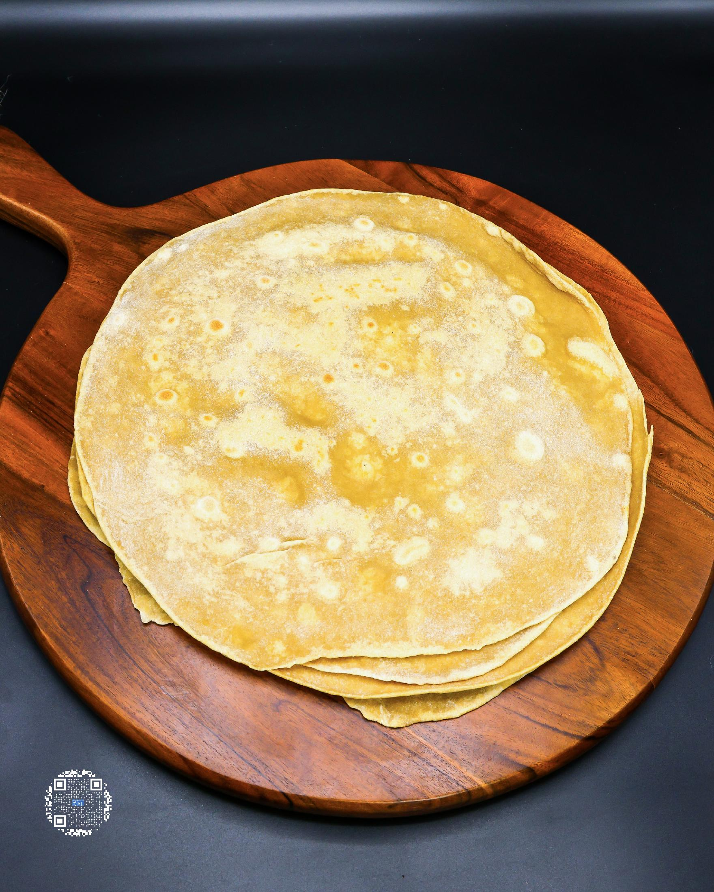

## Additional Recipe Pages

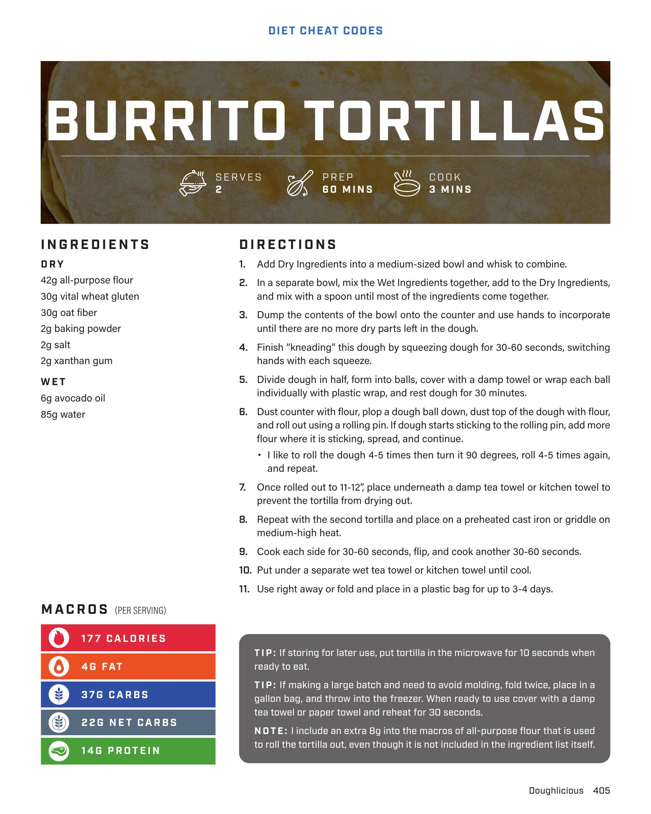

## Source Pages

405, 406

---

# HOAGIE ROLLS

**Serves:** 4 | **Prep:** 3.5 HRS | **Cook:** 13 MINS

## Macros

| Calories | Fat | Carbs | Net Carbs | Protein |
|----------|-----|-------|-----------|---------|
| 308 | 3 | 50 | undefined | 20 |

## Ingredients

### DRY

- 240g King Arthur® bread flour
- 60g vital wheat gluten
- 8g dough conditioner
- 6g diastatic malt powder
- 2.5g instant yeast
- 5g salt

### WET

- 10g Crisco®
- 192g water
- Corn meal
- 56g water (oven)

## Directions

1. Add all dry ingredients to a food processor and mix for 60 seconds.
2. Add Crisco® to the food processor and start blending for 10 seconds. As the processor is blending, add water over a 20 second period and continue mixing for 30 seconds.
3. Plop the dough on the counter, knead for 6-8 minutes, and divide into 4 equal sized pieces of dough. Each dough should weigh about 129g.
4. Roll each piece of dough into a ball, making sure the bottom of the ball is sealed. Line a baking pan with a nonstick liner, space dough balls evenly apart, and cover for 90 minutes.
5. Flip one piece of dough bottom side up and gently roll the dough back and forth with a rolling pin. Continue rolling until about a quarter inch thick.
6. Pick up the dough and place onto the counter in the shape of a square. Roll out the edges to get an even thickness.
7. The dough should be about 6" wide and 6.5" long.
8. Take the top of the dough and fold about half of it onto itself. Using the tips of your fingers, press the edge of the dough into the crease.
9. Take the bottom of the dough and fold it up. It should perfectly line up to the top corners of the dough. Seal the roll by pinching along the edge and sides of the dough. The roll should be about 6" long.
10. Dust a nonstick liner with corn meal and place the hoagie roll directly on the corn meal.
11. Repeat for the other pieces of dough and cover for 90 minutes.
12. Add a steel brownie pan to the bottom rack of the oven and preheat the oven to 425°F.
13. Add a piece of parchment paper to a pizza peel or a cookie sheet.
14. Grab each piece of dough from the bottom, lightly stretch it out from the middle for a couple seconds, and place them on the pizza peel, making sure to evenly space them out. The roll should be about 8" long.
15. Make a cut down the middle of each roll with a sharp knife or bread lame.
16. Heat up 56g water in a microwave for 30-40 seconds or until boiling.
17. Using oven mitts, add the hoagies to a baking steel, pour the water into the brownie pan, and quickly shut the oven door.
18. Bake for 12-14 minutes and immediately transfer to a wire rack to cool.

## Tips

If you don't have a baking steel, you can cook these on a sheet pan with a nonstick liner. There is only 1 difference. About 3-4 minutes before the rolls are finished baking, you will have to flip them to ensure the bottom of the hoagie browns correctly.

## Additional Recipe Pages

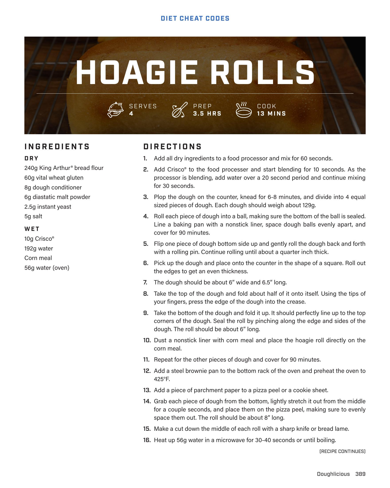

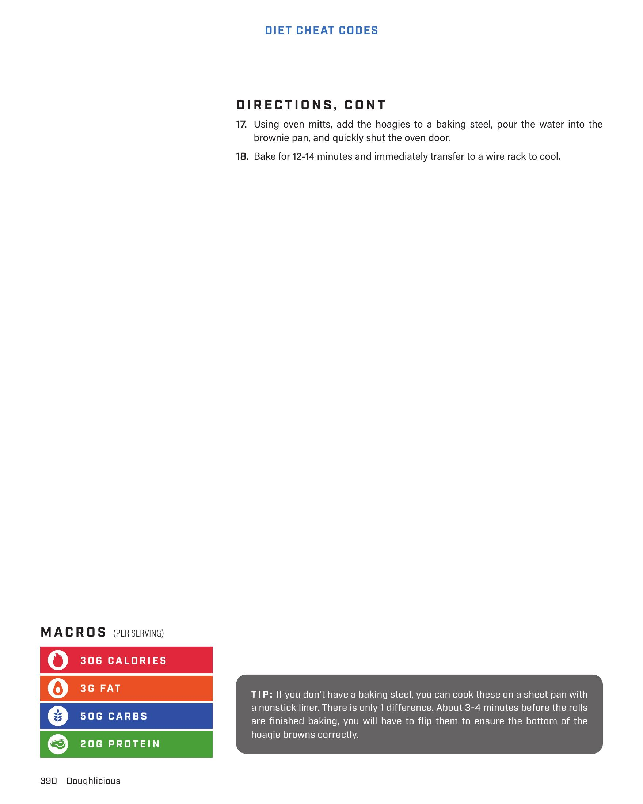

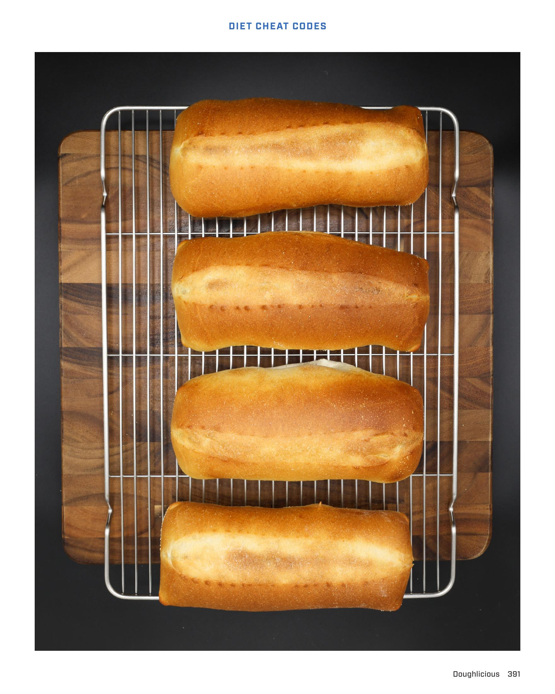

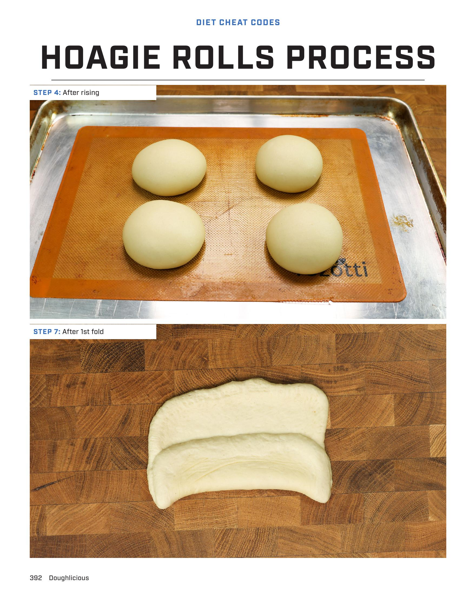

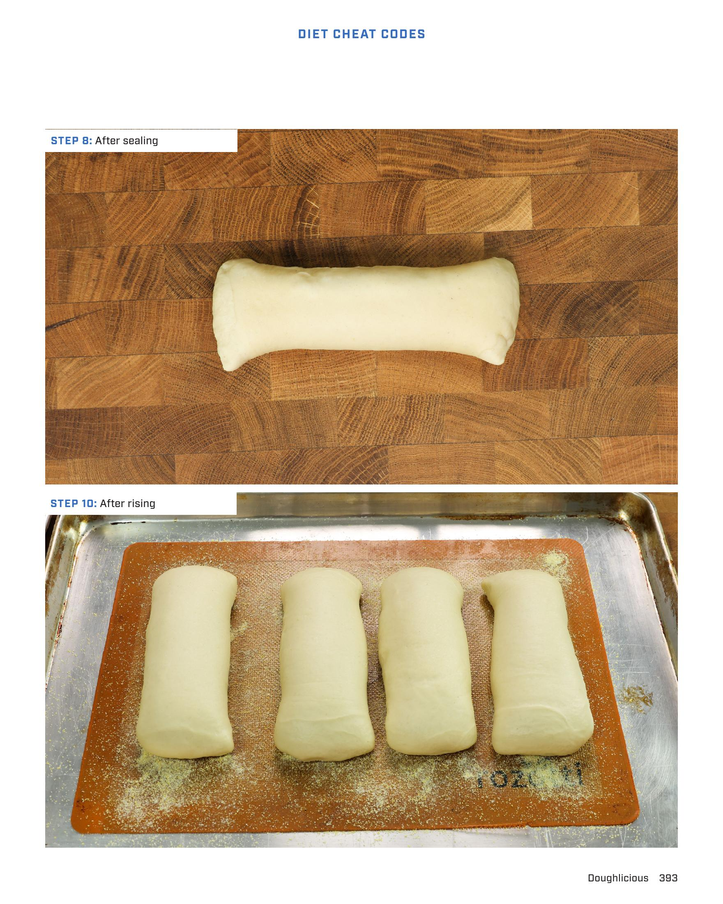

## Source Pages

389, 390, 391, 392, 393, 394

---

# POTATO BUNS

**Serves:** 6 | **Prep:** 3 HRS | **Cook:** 18 MINS

## Macros

| Calories | Fat | Carbs | Net Carbs | Protein |
|----------|-----|-------|-----------|---------|
| 0 |  |  | N/A |  |

## Ingredients

### MASHED POTATO

- 70g water
- 17g dried mashed potato

### DOUGH

- 135g 00 flour
- 55g vital wheat gluten
- 6g dough conditioner
- 5g diastatic malt powder
- 24g granulated erythritol
- 5g instant yeast
- 3g salt

### WET

- 40g fat-free milk
- 14g unsalted butter, melted
- Potato
- 1 egg

### EGG WASH

- 1 egg
- 15g water

## Directions

1. Add 70 grams of water into a medium size bowl and microwave for 60 seconds.
2. Using kitchen gloves, grab the bowl out of the microwave, add dried potato, and mix to combine.
3. Add Dry ingredients into the food processor and process for 60 seconds. You may use bread flour instead of 00 flour, but the final product won't be as soft and pillowy.
4. Add milk and butter to a glass measuring cup and microwave for 20-30 seconds. Mix until the butter is melted. The temperature should not exceed 120°F.
5. Add potato and egg into the food processor, process on high, and pour in milk mixture over a 15 second period. Continue to process for an additional 30 seconds.
6. Place dough on your work surface, KNEAD the dough for 8-10 minutes or until smooth, and round into a taut ball.
7. Lightly spray a large bowl with oil, place dough ball into the center of the bowl, lightly spray the top of the ball with oil, and cover for 1.5-2 hours.
8. Divide dough into 6 equal portions, about 97 grams each. Roll each piece of dough into a ball, making sure the bottom of the ball is sealed.
9. Line a baking pan with a nonstick liner and space dough balls evenly apart.
10. With the bottom of your palm, flatten each dough ball so that after rising and baking they will look like a bun. Pop any noticeable air pockets with fingers or a toothpick.
11. Cover buns with another baking pan or damp tea towel and put in a warm place to rise for 60-90 minutes.
12. In a small bowl, add Egg Wash ingredients, whisk to combine, and brush a thin layer of egg wash on the top and sides of each bun.
13. Bake the buns in a preheated 375°F oven for 16-18 minutes, turning the pan halfway through. Place buns on a cooling rack when finished.

## Tips

If not using within 3-4 days, throw the cooked buns in the freezer and reheat them in a preheated 350°F oven for 10-12 minutes.

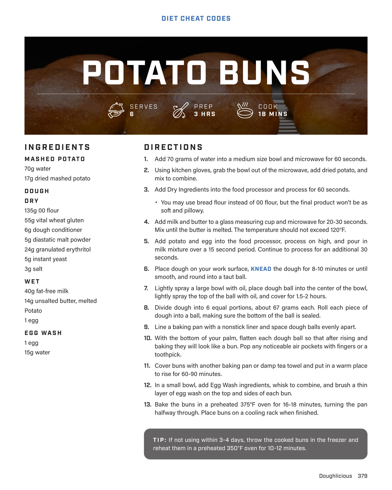

## Additional Recipe Pages

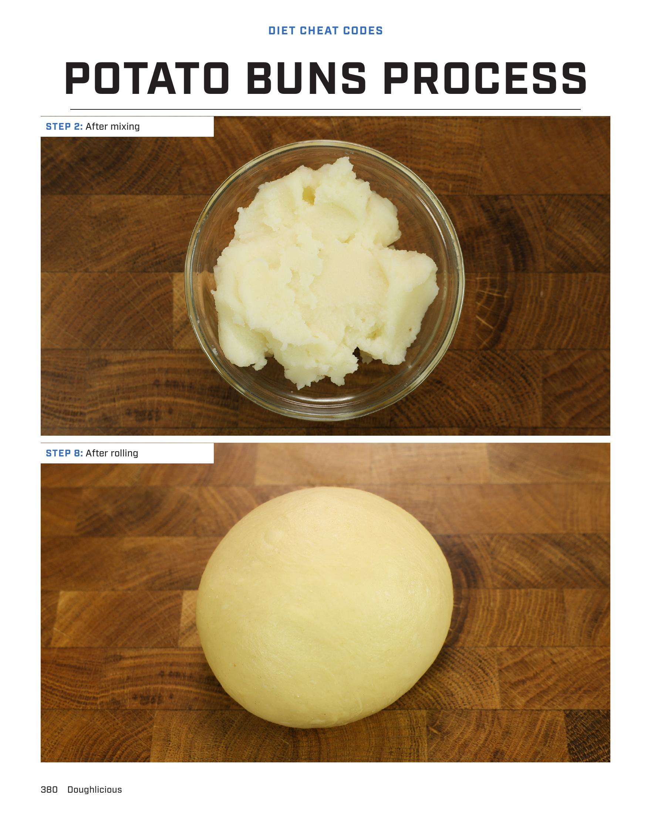

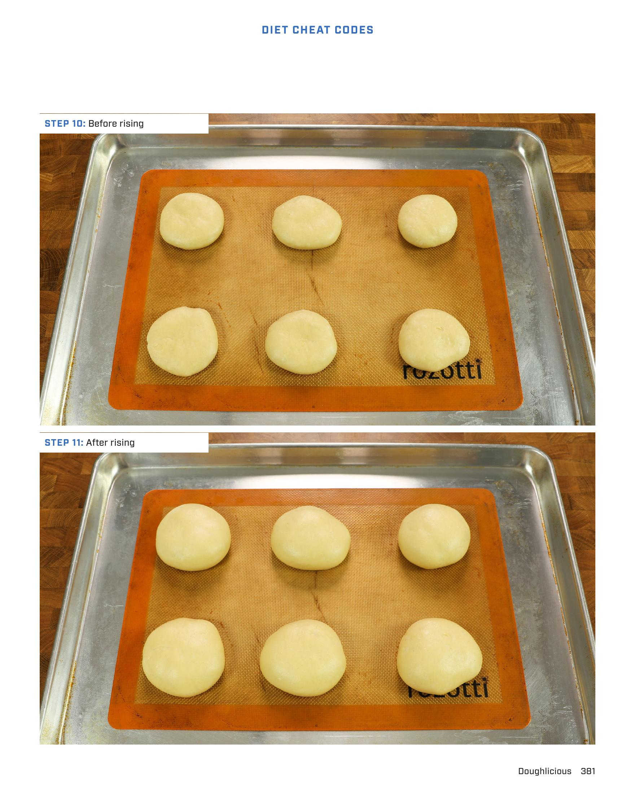

## Source Pages

380, 381, 382

---

# PROTEIN BAGUETTE

**Serves:** 8 | **Prep:** 3 HRS | **Cook:** 25 MINS

## Macros

| Calories | Fat | Carbs | Net Carbs | Protein |
|----------|-----|-------|-----------|---------|
| 321 | 16 | 59 | undefined | 20 |

## Ingredients

- 600g King Arthur® bread flour
- 100g vital wheat gluten
- 500g warm water
- 16g salt
- 15g instant yeast
- 50g water (yeast)

## Directions

1. Add bread flour and vital wheat gluten into a large bowl and whisk.
2. Pour lukewarm water into the bowl and using a spoon, mix everything together until it becomes a shaggy dough.
3. Rinse your hand under water and use your wet hand to mix the dough until there are no more dry parts.
4. Once finished, top dough evenly with salt, and cover for 20 minutes.
5. While waiting, put yeast and water into a glass and mix yeast using a spoon until yeast is covered in water.
6. Add yeast mixture onto the dough and using a wet hand, squeeze the dough repeatedly for 4-5 minutes or until the yeast mixture and salt is completely mixed into the dough. I like to squeeze one part of the dough through my fingers, then move to another part and repeat while occasionally flipping the dough.
7. Cover the dough for 30 minutes.
8. Using a wet hand, perform a stretch and fold by pulling one side of the dough as high as possible then folding it over itself.
9. Turn the bowl 90 degrees and repeat 3-4 more times until all dough has been stretched.
10. Flip the dough over, and form into a ball by sliding your hand underneath the dough and pulling it in a circular motion towards your body. When the ball is formed, the dough should have a fairly smooth surface and look like kneaded dough.
11. Cover the dough for 30 minutes, repeat steps 8-10, spray the top of the dough with oil, and cover for 90 minutes.
12. Lightly dust work surface and top of the dough with flour, degas the dough by punching it down, and flip it onto the work surface.
13. Using a bread scraper, divide the dough into four roughly 310g pieces and put three of them to the side.
14. To prevent sticking, spray hands with oil and push the dough outward to get any big air bubbles out.
15. Fold the sides of the dough, followed by the top and bottom of the dough, flip the dough over, and round it into a ball making sure the bottom of the dough is sticking together.
16. Put the dough ball off to the side, cover with a damp tea towel, and repeat with the other 3 pieces of dough.
17. Let the dough rest for 20 minutes, grab a sheet pan, line it with parchment paper, lightly spray with oil, and put it off to the side.
18. Lightly dust surface with flour, put one of the dough balls in front of you bottom side up, put a little bit of oil on your hands, and press the dough out into a roughly 8x6" rectangular shape while getting any massive air bubbles out.
19. Take the top of the dough and fold about a quarter of it onto itself. Using the tips of your fingers, press the edge of the dough into the crease.
20. Slowly roll the dough down by continually pressing the seams together with each roll and popping any large air bubbles while doing so.
21. Seal the roll by pinching along the edge, lightly dust with flour, and put the sealed side on the work surface.
22. Using both hands, start in the middle of the dough and slowly apply pressure both down and out while trying to keep the seam side down the entire time.
23. Each time the dough is rolled out, apply more pressure, especially at the ends of the dough to give it an authentic baguette taper. This usually takes about 3-5 rolls and should be about 12-14" in length.
24. Put the rolled dough on the parchment paper, cover with a sheet pan, and repeat for the remaining dough balls, making sure the pieces of dough are evenly spaced out on the sheet pan.
25. Let the dough rise in a warm place for 60-90 minutes. Try and make sure the rolled pieces of dough are as straight as possible before rising or else they will most likely be crooked.
26. Spray the baguettes with water, score the baguettes with a bread lame or a sharp knife every 2 inches or down the middle. Bake in a preheated 450°F oven with a small cast iron pan preheating on the rack below. Add 5-6 pieces of ice to the hot cast iron pan when you add the baguettes to the oven and close the oven door.
27. Bake for 25-30 minutes, flipping the sheet pan around halfway through and moving the bread on the inside of the pan to the outside and vice versa.
28. Baguettes are done when you can knock on them and they sound hollow. Let them cool and store any you will not use that day in the freezer.

## Tips

To reheat from the freezer, simply put baguette into a preheated 350° oven for 15 minutes and it will be good as new.

## Additional Recipe Pages

## Source Pages

383, 384, 385, 386, 387, 388

---

# PROTEIN BREAD

**Serves:** 23 | **Prep:** 3 HRS | **Cook:** 25 MINS

## Macros

| Calories | Fat | Carbs | Net Carbs | Protein |
|----------|-----|-------|-----------|---------|
| 59 | 1 | 6 | undefined | 6 |

## Ingredients

- 220g King Arthur® bread flour
- 110g vital wheat gluten
- 15g dough conditioner
- 270g 2% milk
- 15g white vinegar
- 7g salt
- 10g instant yeast
- 30g water (yeast)

## Directions

1. Add bread flour, vital wheat gluten, and dough conditioner to a large bowl and whisk.
2. Pour milk into a measuring cup and microwave for 30-45 seconds or until it reaches 90°F. Add milk to the bowl and using a spoon, mix everything together until the milk has dissolved.
3. Add vinegar, rinse your hand under water, and use your wet hand to mix the dough until there are no more dry parts.
4. Once finished, top dough evenly with salt, and cover for 15 minutes.
5. While waiting, put yeast and water into a glass and mix using a spoon until yeast is covered in water.
6. Add yeast mixture onto the dough and using a wet hand, squeeze the dough repeatedly for 2-3 minutes or until the yeast mixture and salt is completely mixed into the dough. I like to squeeze one part of the dough through my fingers, then move to another part and repeat while occasionally flipping the dough.
7. Cover the dough for 30 minutes.
8. Using a wet hand, perform a stretch and fold by pulling one side of the dough as high as possible then folding it over itself.
9. Turn the bowl 90 degrees and repeat 3-4 more times until all dough has been stretched.
10. Flip the dough over, and form into a ball by sliding your hand underneath the dough and pulling it in a circular motion towards your body. When the ball is formed, the dough should have a fairly smooth surface and look like kneaded dough.
11. Cover the dough for 30 minutes, repeat steps 8-10, and cover for 30 more minutes.
12. Pick the dough up out of the bowl and let it hang to stretch it into a long, narrow piece of dough that is about 5-6" wide.
13. Lay the dough down with the bottom side facing up towards the ceiling.
14. Take the top of the dough and fold about a quarter of it onto itself. Using the tips of your fingers, press the edge of the dough into the crease.
15. Slowly roll the dough down by continually pressing the seams together with each roll and popping any large air bubbles while doing so.
16. Seal the roll by pinching along the edge of the dough as well as each side of the roll.
17. Lightly spray an 8.5x4.5" steel loaf pan with oil, place the dough inside of the pan sealed side down, and let the dough rise in a warm place for 60-90 minutes.
18. Bake in a preheated 350°F oven for 25-30 minutes.
19. Take bread out of the pan, add to a wire rack, and let the bread completely cool. This will take 2-3 hours.
20. Using a serrated knife, slice a couple pieces, and enjoy.

## Tips

For optimal freshness, cut the loaf in half and slice from the middle of the loaf. Then put the two halves back together and wrap in cling wrap or use a bread bag to store. I have had loaves for up to 6 days with no staling or mold formation.

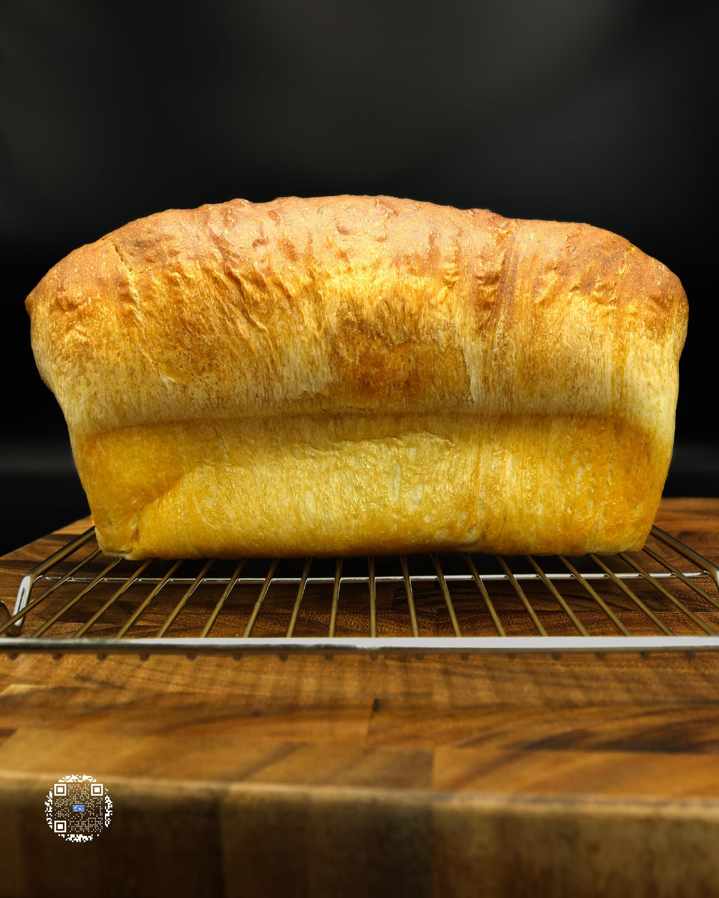

## Additional Recipe Pages

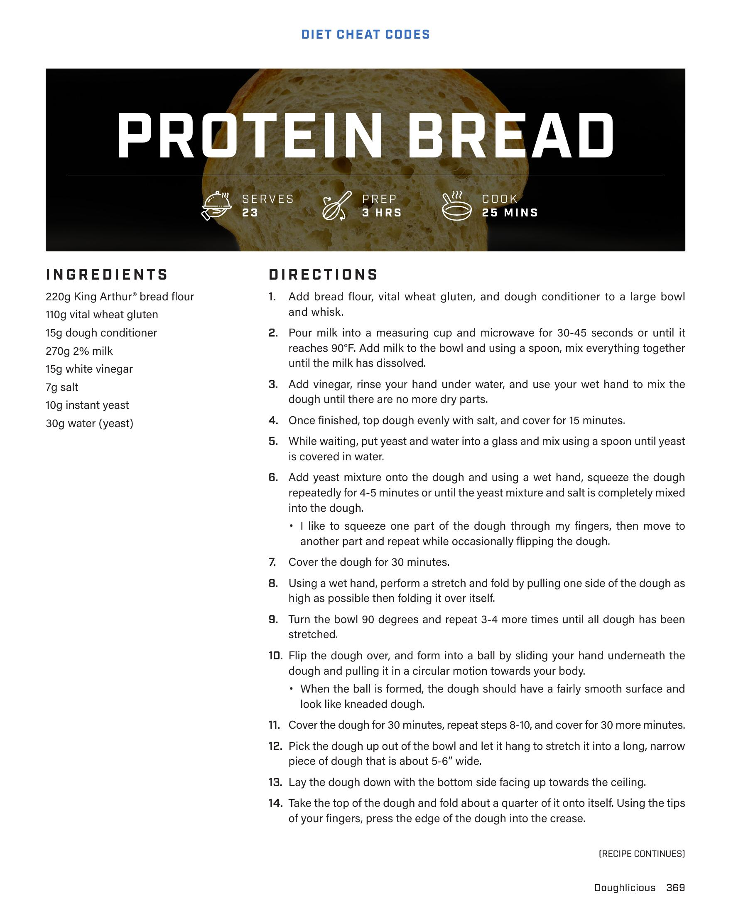

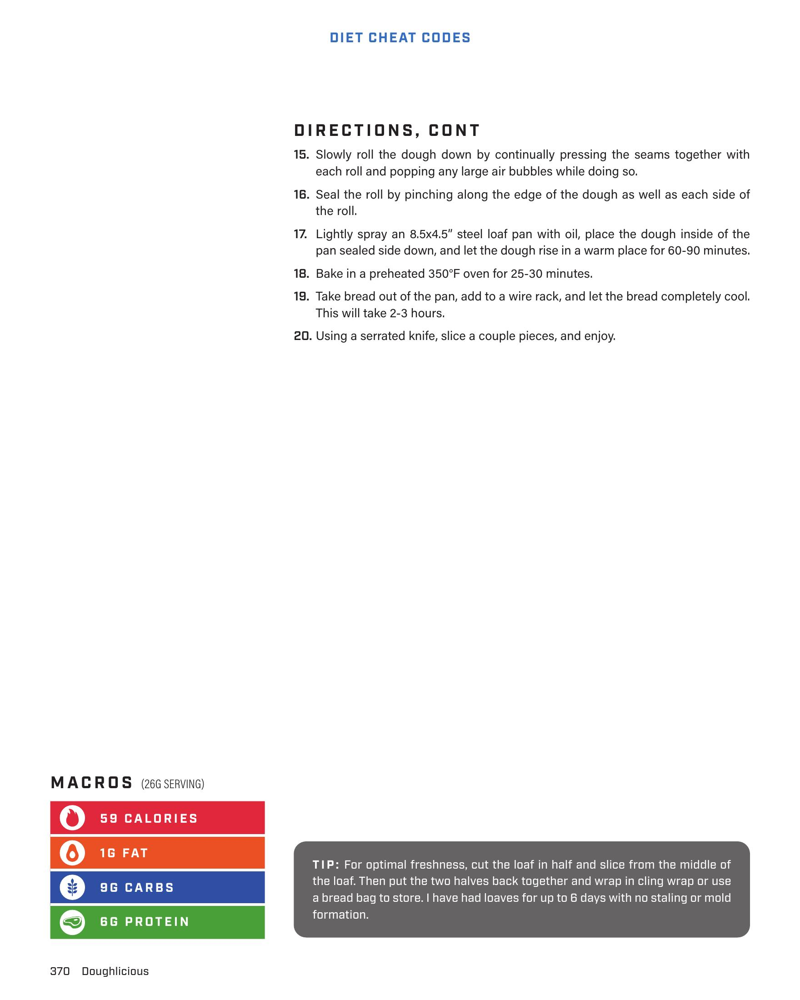

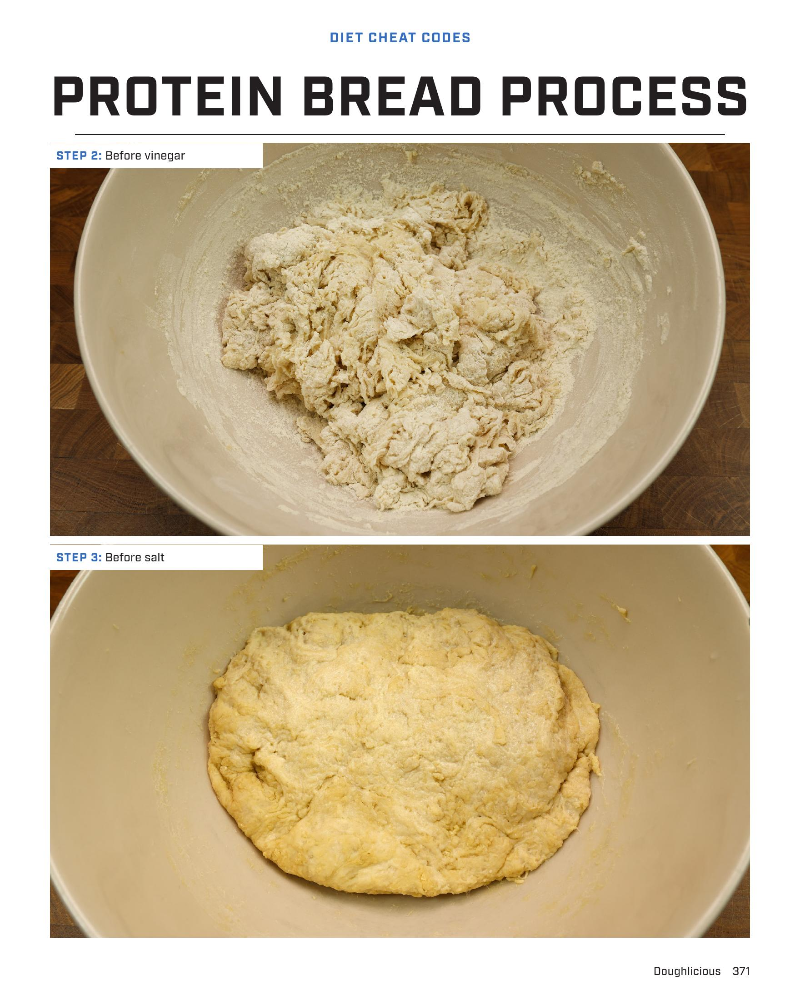

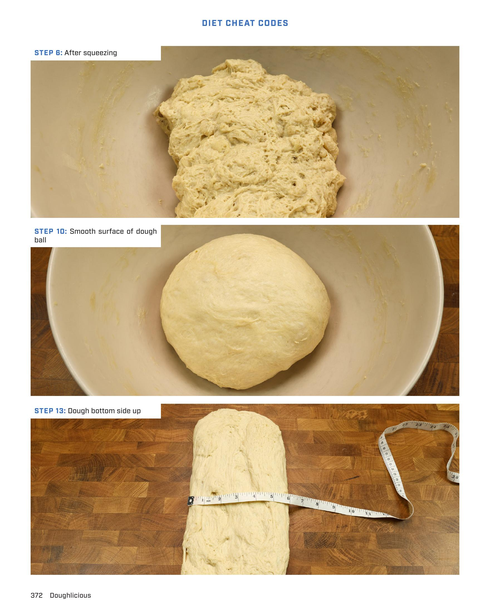

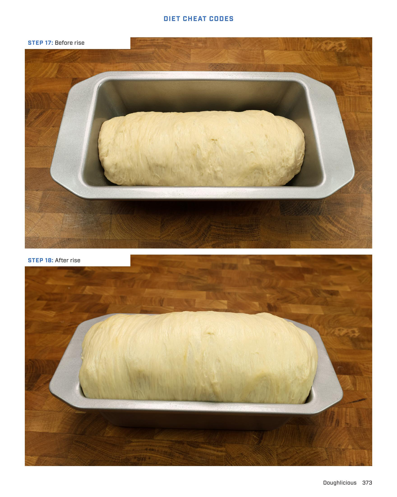

## Source Pages

369, 370, 371, 372, 373, 374

---

# PROTEIN BREADSTICKS

**Serves:** 6 | **Prep:** 1 HR | **Cook:** 15 MINS

## Macros

| Calories | Fat | Carbs | Net Carbs | Protein |
|----------|-----|-------|-----------|---------|
| 117 | 2 | 19 | 18 | 8 |

## Ingredients

### DRY

- 131g King Arthur® all-purpose flour
- 34g vital wheat gluten
- 1.5g salt
- 3g instant yeast
- 6g granulated erythritol

### WET

- 5g avocado oil
- 115g water

### TOPPING

- 4g unsalted butter
- 5g grated parmesan
- Dash salt
- Dash garlic powder
- Dash dried parsley

## Directions

1. Add all Dry Ingredients into a food processor and process for 30 seconds.
2. Add avocado oil over the top of the Dry Ingredients.
3. Heat up water to 110°F.
4. While processing on high, slowly mix in water over 10-15 seconds and continue to process for an additional 30 seconds.
5. Plop dough onto the counter, roll it around for 1 minute, form it into a ball, place in a lightly oiled bowl, and cover for 30 minutes.
6. Divide dough into roughly six 48g portions, roll each piece out using your hands, pop any big air bubbles while doing so, and get them to about 8" in length.
7. Place each piece of dough on a sheet pan lined with parchment paper or a silicone liner, keeping the breadsticks evenly apart. Cover with another sheet pan or a damp towel for about 20 minutes.
8. Put breadsticks into a preheated 400°F oven for 12-15 minutes or until bottom of breadsticks are nicely browned.
9. Add butter, salt, and garlic powder in a small bowl, then microwave until the butter is melted. Mix ingredients to combine.
10. Brush each bread stick with the butter mixture and top with parmesan and parsley while breadsticks are hot.
11. Eat one or all 6. Both are great options.

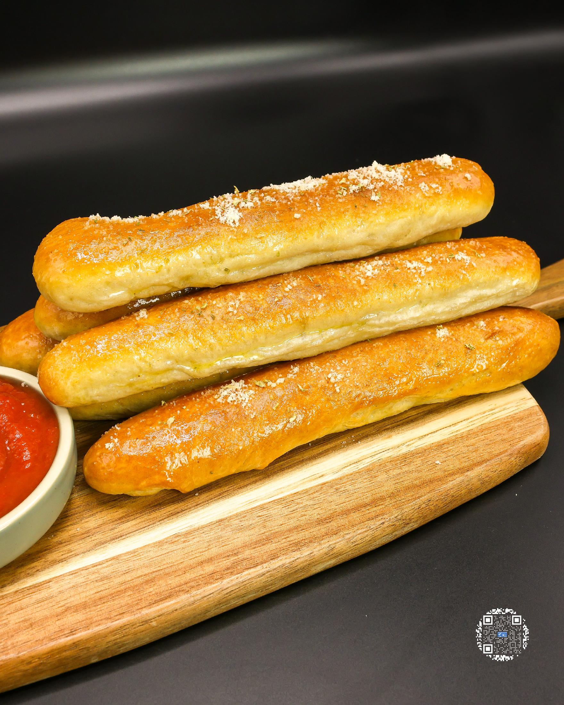

## Additional Recipe Pages

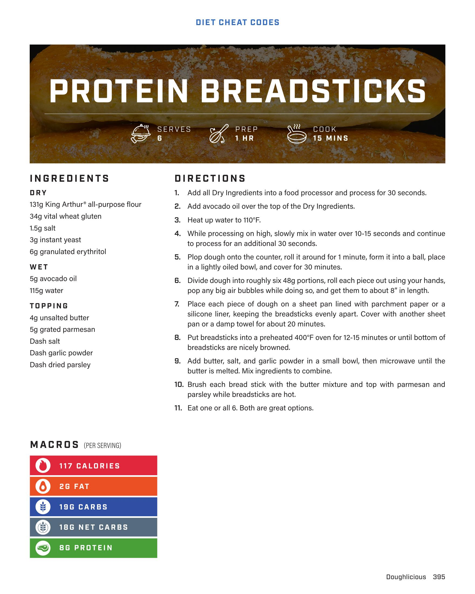

## Source Pages

395, 396

---

# PROTEIN BUNS

**Serves:** 8 | **Prep:** 2 HRS | **Cook:** 20 MINS

## Macros

| Calories | Fat | Carbs | Net Carbs | Protein |
|----------|-----|-------|-----------|---------|
| 155 | 4 | 24 | 20 | 11 |

## Ingredients

### TANGZHONG

- 30g fat-free milk
- 15g water
- 15g all-purpose flour

### DOUGH DRY

- 165 all-purpose flour
- 45g vital wheat gluten
- 5g diastatic malt powder
- 18g granulated erythritol
- 3g instant yeast
- 4g salt

### WET

- 130g fat-free milk
- Tangzhong
- 7g unsalted butter

## Directions

1. Add Tangzhong ingredients into a small pan, whisk until combined, then put on medium low heat. Keep stirring with whisk until it begins to thicken and clump.
2. Switch to a rubber spatula and keep mixing until there is no more liquid left, or it looks similar to mashed potatoes.
3. Place Tangzhong in a small bowl to cool. In a separate glass, heat up milk for the dough until it reaches 110°F (about 20-30 seconds in the microwave).
4. Add Dry ingredients into the food processor and process for 15 seconds.
5. Add Tangzhong and butter into the food processor, process on high, then pour in milk over a 15 second period, and continue to process for an additional 30 seconds.
6. The dough should have formed into a ball. Plop dough on the counter and KNEAD dough for 3-5 minutes.
7. Lightly spray a large bowl with oil, place dough ball into the center of the bowl, lightly spray the top of the ball with oil, and cover for an hour.
8. Press any big air pockets out of the dough and divide into 6 equal portions.
9. Roll each piece of dough into a ball, making sure the bottom of the ball is sealed. Line a baking pan with a nonstick liner, and space dough balls evenly apart.
10. With the bottom of your palm, flatten each dough ball so that after rising and baking they will look like buns. Pop any noticeable air pockets with fingers or a toothpick.
11. Cover buns with another baking pan or damp kitchen towel and let rise for 45 minutes. Place a small cast iron pan on a lower rack in the oven before preheating.
12. In a small bowl whisk an egg and brush a thin layer of egg wash to the top of each bun. Optional: Add sesame seeds over the top.
13. Bake the buns in a preheated 400°F oven, add 4-5 cubes of ice into the cast iron, and shut the oven door right away.
14. Bake for 17 minutes, flipping the pan halfway through. Place buns on a cooling rack when finished.

## Tips

If not using within 3-4 days, throw the cooked buns in the freezer and reheat them in a preheated 350°F oven for 10-12 minutes.

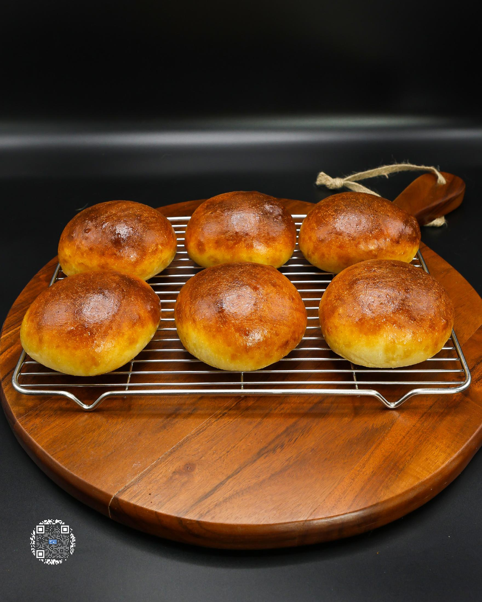

## Additional Recipe Pages

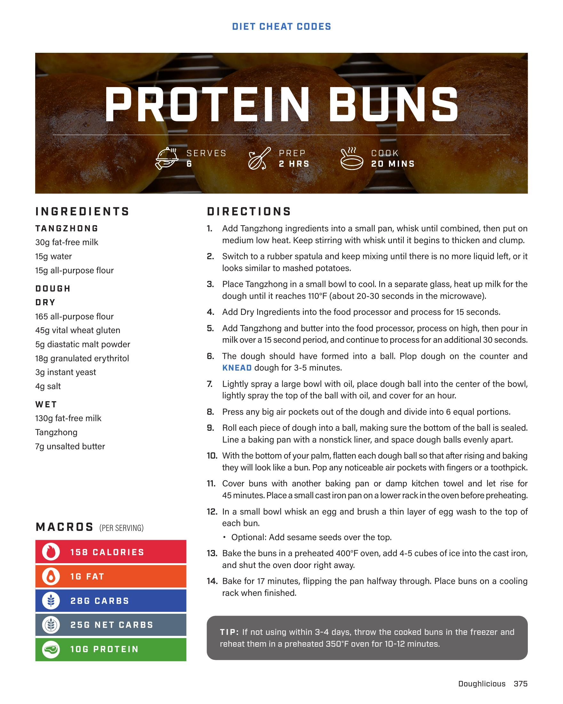

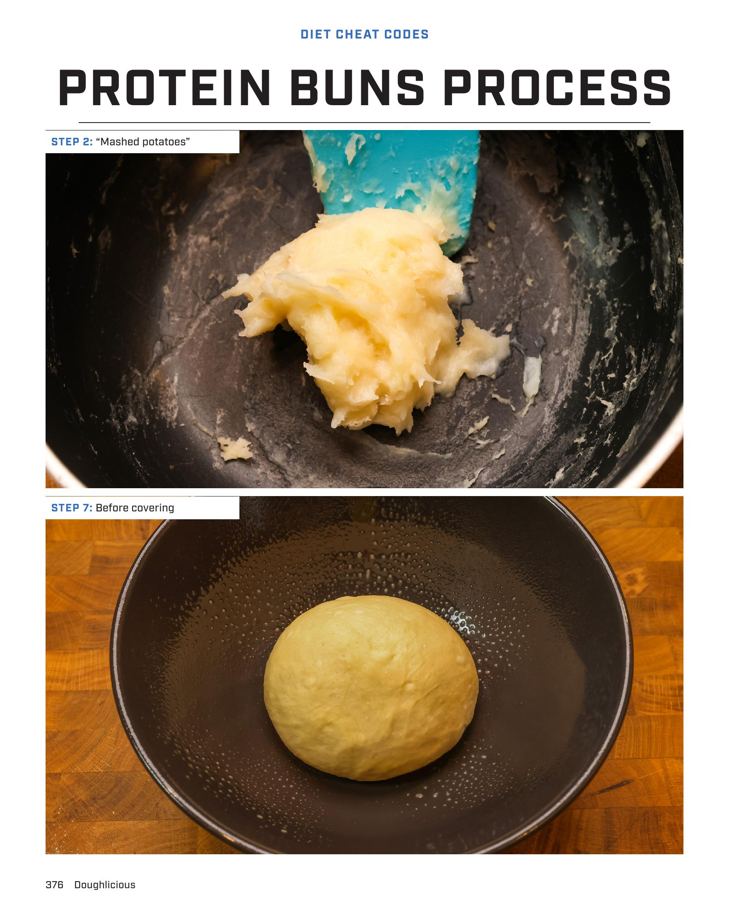

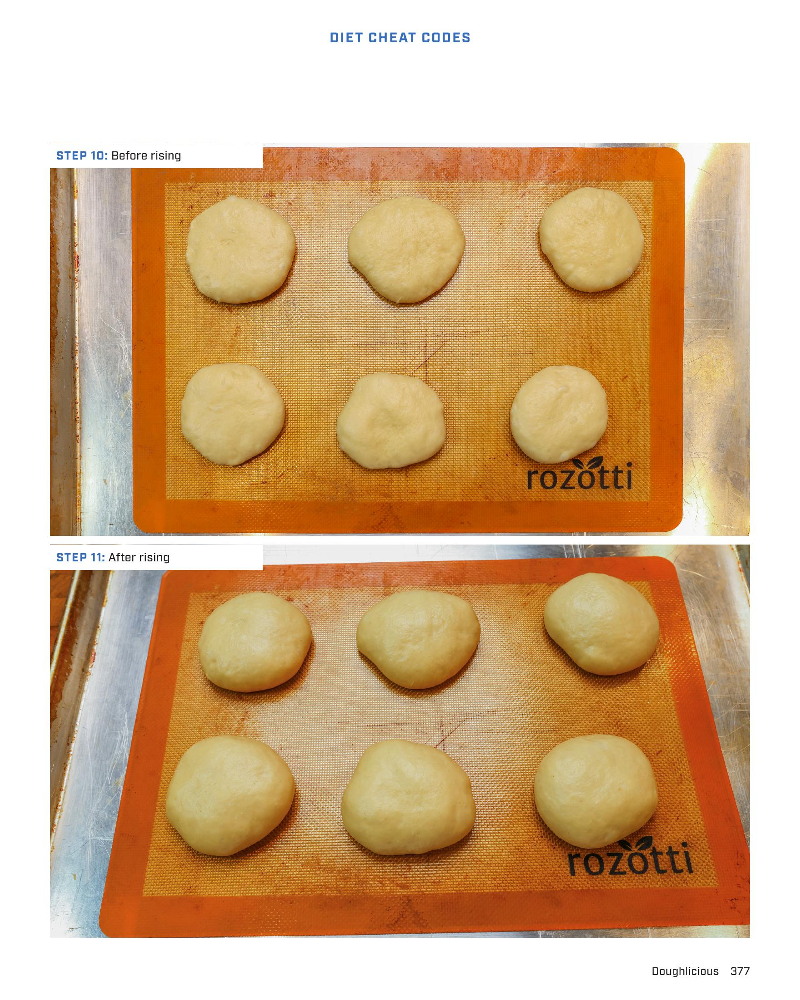

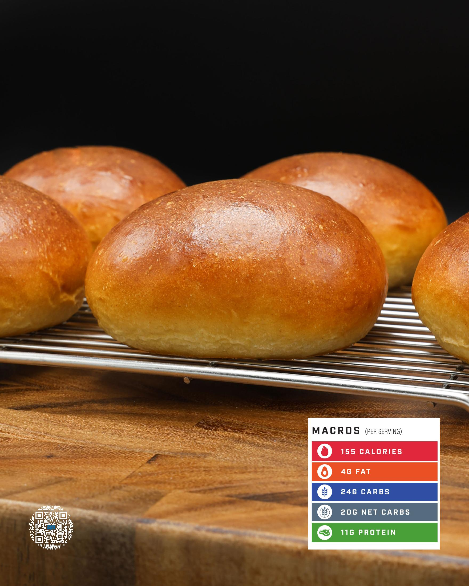

## Source Pages

375, 376, 377, 378, 379

---

# PROTEIN PITA YOGURT BASE

**Serves:** 6 | **Prep:** 25 MINS | **Cook:** 20 MINS

## Macros

| Calories | Fat | Carbs | Net Carbs | Protein |
|----------|-----|-------|-----------|---------|
| 221 | 2 | 31 | undefined | 20 |

## Ingredients

### DRY

- 195g all-purpose flour
- 78g vital wheat gluten
- 3.6g salt
- 4.5g baking powder

### WET

- 365g 2% Greek yogurt

### SHAPING

- 18g flour (for rolling)

## Directions

1. Add dry ingredients to a bowl and whisk to combine.
2. Place yogurt in the bowl and mix with a spoon until a shaggy dough forms.
3. Using your hand, press and fold the dough until fully combined and no dry ingredients remain.
4. Split the dough into 6 equal pieces (about 107g each) and shape into balls.
5. Place a dough ball on the counter, flatten with your palm, then lightly dust the top and bottom with flour.
6. Using a rolling pin, roll the dough 2-3 times, turn 90°, roll 2-3 more times, and repeat until the dough is about 7-8" wide and 1/8-1/4" thick. Whenever the dough starts to stick to the rolling pin, lightly dust both sides of the pita with flour, spread evenly, and continue rolling.
7. Place the pita in a preheated pan over medium heat and cook each side for 1-2 minutes, or until browned to your preference.
8. While each pita cooks, roll out the next dough ball.
9. Move the cooked pita to a tea towel and fold the towel over it to prevent it from drying out. Repeat the cooking process with remaining dough.

## Tips

Freeze any pitas you won't eat within 2-3 days. Microwave on a plate covered with a damp paper towel for 30-60 seconds, or until soft and heated through.

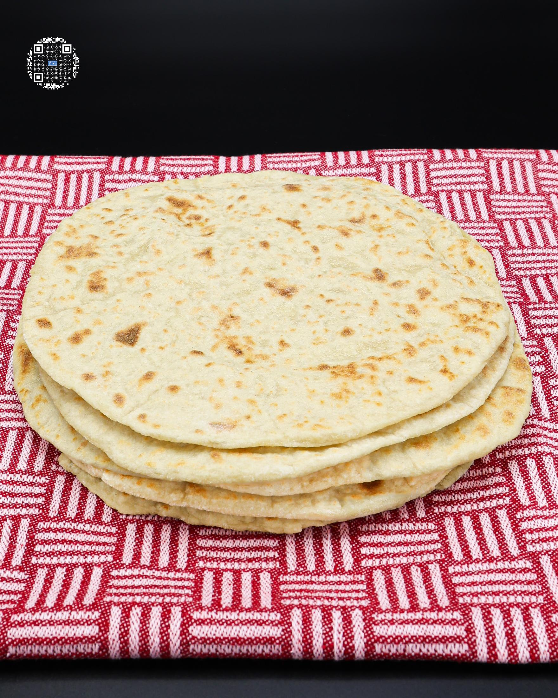

## Additional Recipe Pages

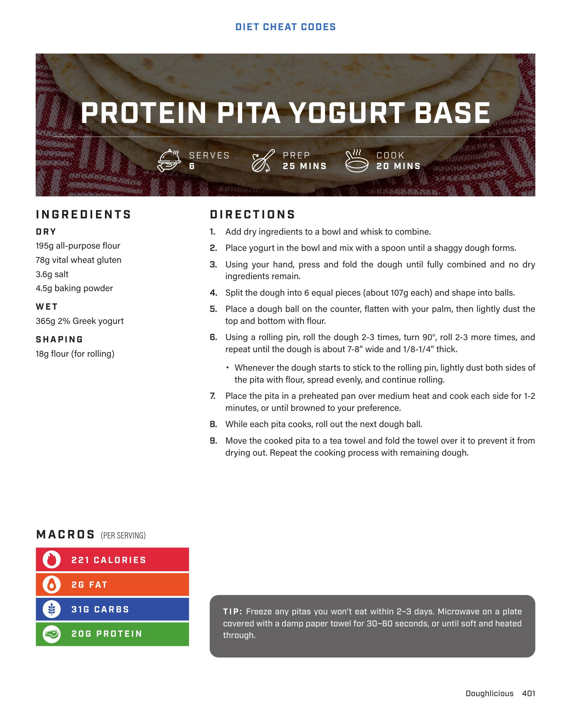

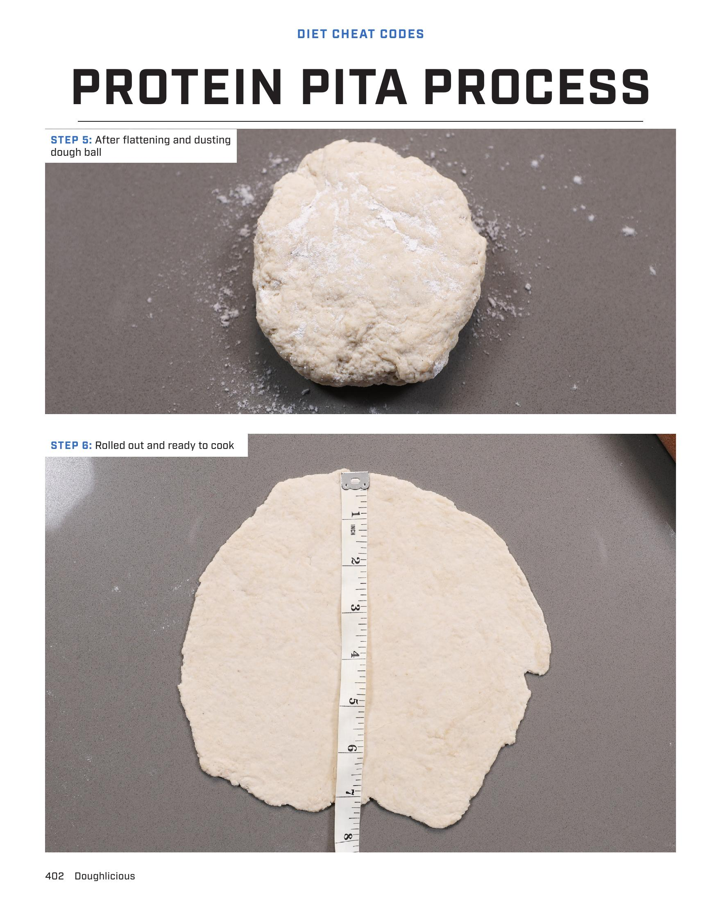

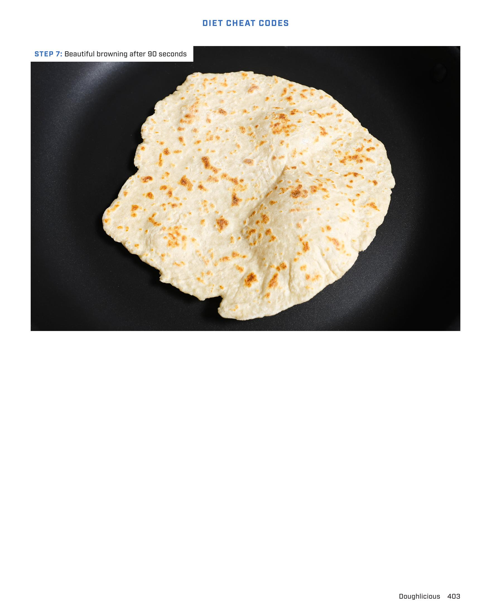

## Source Pages

401, 402, 403, 404

---

# PROTEIN PITA

**Serves:** 2 | **Prep:** 15 MINS | **Cook:** 3 MINS

## Macros

| Calories | Fat | Carbs | Net Carbs | Protein |
|----------|-----|-------|-----------|---------|
| 106 | 3 | 19 | 13 | 8 |

## Ingredients

### DRY

- 30g all-purpose flour
- 18g vital wheat gluten
- 12g oat fiber
- 1.5g salt
- 2g baking powder

### WET

- 4g extra virgin olive oil
- 54g water

## Directions

1. Add Dry ingredients to a bowl and whisk together.
2. Add olive oil to the Dry ingredients and mix the oil into the ingredients so it is spread evenly.
3. Add water to the bowl and using a spoon, incorporate the mixture as much as possible.
4. Flip the dough out onto the counter and continue incorporating all the ingredients into the dough making sure there are no dry parts.
5. Squeeze dough ball between fingers, switch hands, and repeat for one minute. This will make sure everything is evenly dispersed throughout.
6. Split dough into two balls.
7. Lightly dust counter and rolling pin with flour, put one dough ball down, and add a light dusting of flour to the top of the dough.
8. Roll dough 2-3 times, turn 90°, roll 2-3 times, and repeat until the dough is about 6" wide and 1/8" thick. - If dough starts to stick to the rolling pin, lightly dust the surface where the dough is sticking, spread around, and continue rolling.
9. Lightly spray a cast iron pan on medium-high heat, place one rolled out piece of dough onto the pan, and cook each side for 1-2 minutes or until browning occurs.
10. Put cooked pita under a damp towel to prevent drying out and repeat for the other pita.

## Tips

Letting the dough balls relax for 15 minutes after step 6 will make the dough easier to roll out. Cook 3-4 batches at a time so that you have enough for multiple days. If you won't eat all of the pitas within 3-4 days, I would freeze them and reheat them in the microwave or on a skillet.

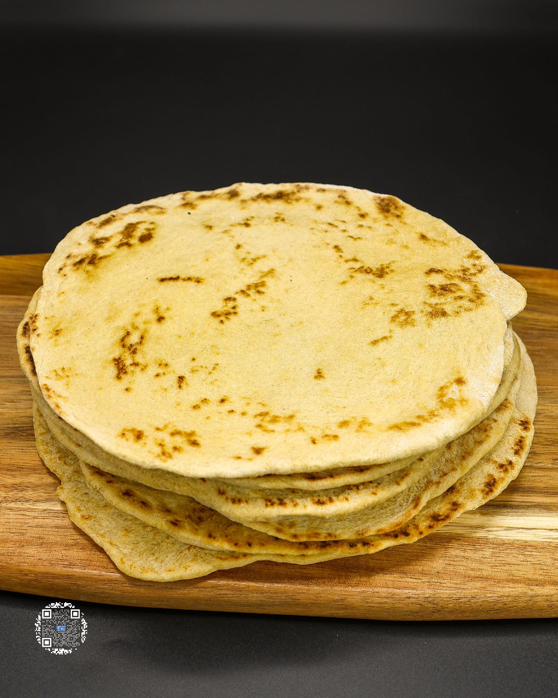

## Additional Recipe Pages

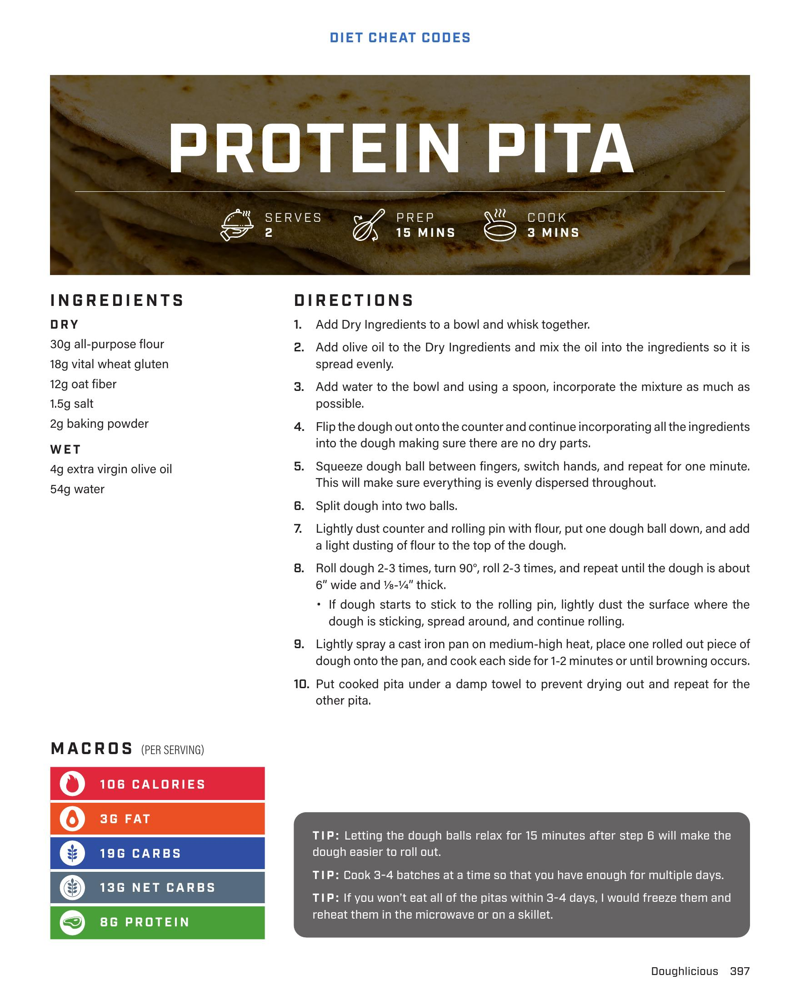

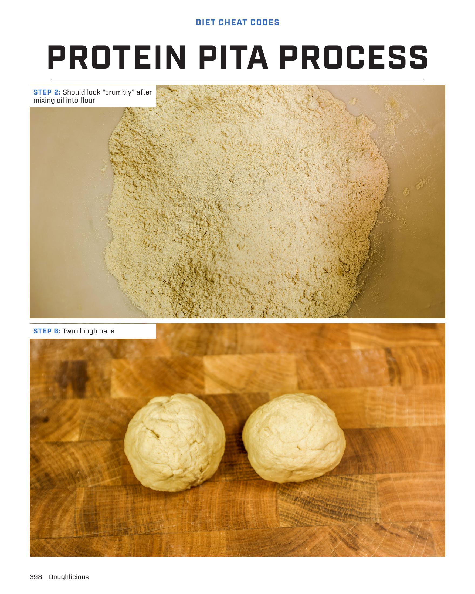

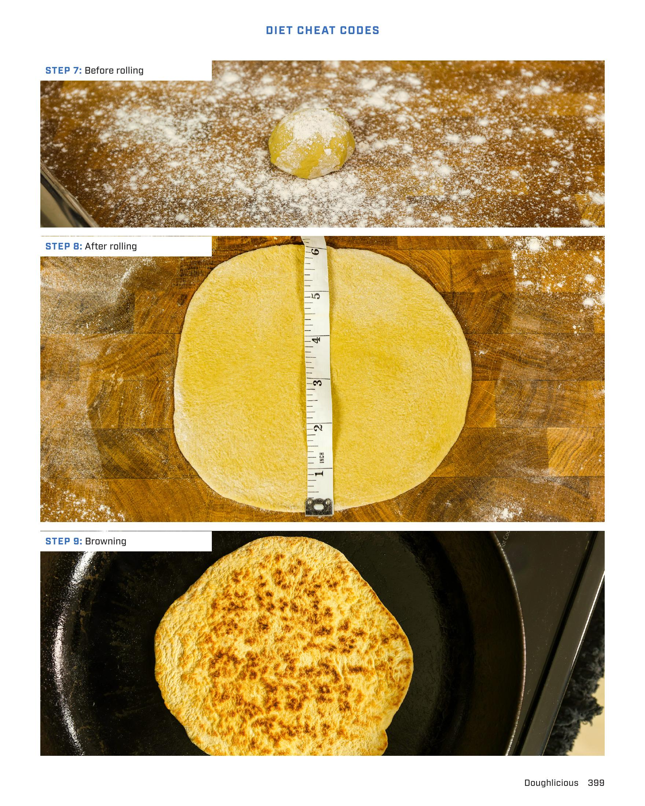

## Source Pages

397, 398, 399, 400

---

# 200 CALORIE BREAKFAST BURRITO

**Serves:** 1 | **Prep:** 10 MINS | **Cook:** 20 MINS

## Macros

| Calories | Fat | Carbs | Net Carbs | Protein |
|----------|-----|-------|-----------|---------|
| 466 | 20 | 37 | 13 | 47 |

## Ingredients

- 2 La Banderta® Carb Counter taco tortillas
- 2 slices original Velveeta® cheese
- 23g center cut bacon (cooked)
- 5 egg whites
- 1 egg
- Salt, to taste
- Black pepper, to taste
- 1g bacon fat

## Directions

1. Place each tortilla on a separate piece of parchment paper. Tear the cheese slices in half and lay them across the middle of the tortilla leaving about 1 inch of space on each end.
2. Cook the bacon on griddle or in a pan on high. Once bottom of bacon is cooked to your preference, flip to cook the other side, and put on a paper towel lined plate to cool. Reserve some bacon fat from the pan.
3. Add egg whites, egg, salt, and black pepper to a large bowl and whisk together.
4. Add bacon fat to a preheated pan on medium heat and spread evenly.
5. Add egg mixture to the pan and keep moving the eggs around with a spatula until fully cooked, then place them on a plate or into a container.
6. Chop bacon and evenly spread onto the tortilla followed by the scrambled eggs.
7. Bring the ends of the tortilla in while slowly flipping one side of the tortilla over the filling.
8. Use the end of the tortilla to bring filling towards the middle, seal the filling in, and finish by rolling until completely sealed.
9. Wrap the burrito in parchment paper and repeat the same process for the other burrito.
10. Put burritos in the microwave for about 30 seconds, let cool for a minute, and enjoy.

## Tips

To save time throughout the week, cook a full package of bacon on a parchment-lined sheet pan at 425 F for 10-12 minutes or crisp to your liking. Once cooled, chop into bite-sized pieces and store in the fridge.

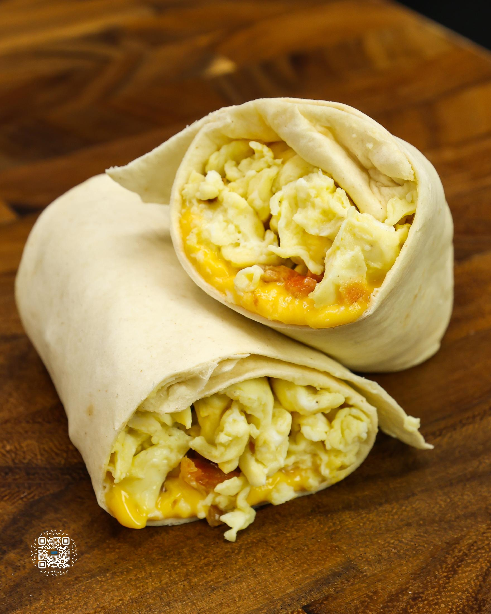

## Additional Recipe Pages

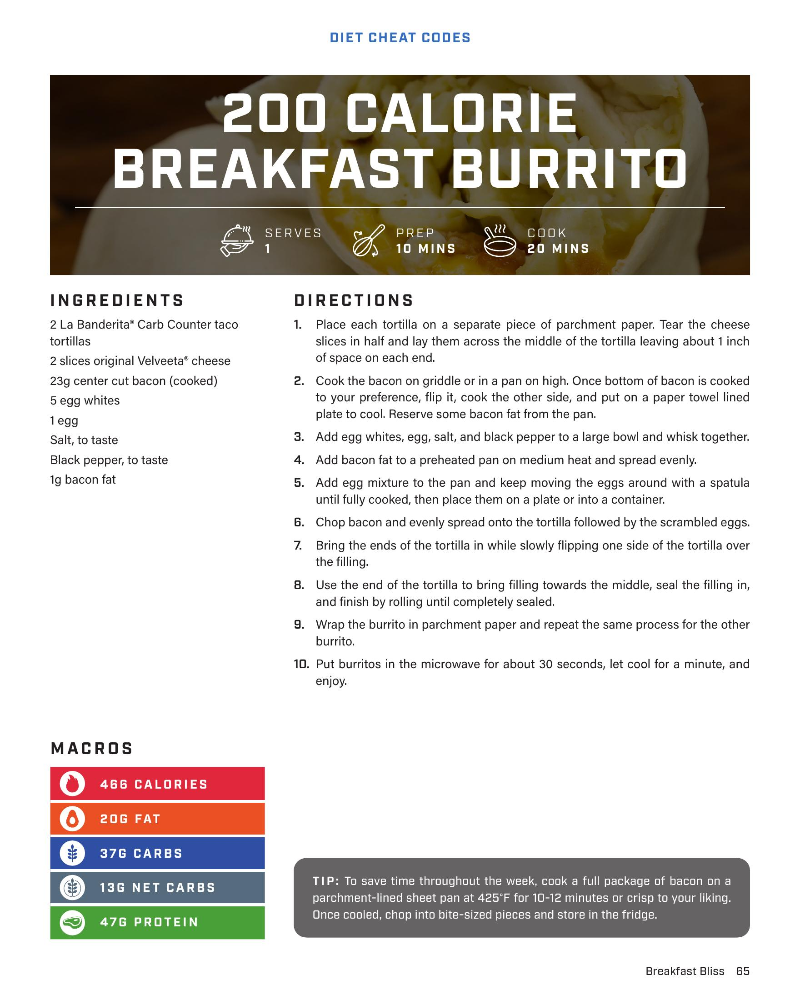

## Source Pages

65, 66

---

# BANANA BREAD MUFFINS

**Serves:** 13 | **Prep:** 15 MINS | **Cook:** 17 MINS

## Macros

| Calories | Fat | Carbs | Net Carbs | Protein |
|----------|-----|-------|-----------|---------|
| 97 | 3 | 14 | 11 | 7 |

## Ingredients

### WET

- 360g banana
- 2 eggs
- 10g unsalted butter, melted
- 11g avocado oil
- 4.2g vanilla extract
- 80g brown sugar erythritol

### DRY

- 85g all-purpose flour
- 93g PEScience Snickerdoodle protein powder
- 7g ground cinnamon
- 3g salt
- 4g baking powder
- 2g baking soda

## Directions

1. In a large bowl, add bananas and break them down using a fork or an immersion blender.
2. Add the Wet Ingredients to the bowl and whisk to combine.
3. In another large bowl, add the Dry Ingredients and whisk to combine.
4. Add Dry Ingredients into the bowl of the Wet Ingredients and whisk until just BARELY combined - overmixing will result in chewy muffins. To make sure everything is combined, fold the mixture 3-4 times and scrape the bottom of the bowl with a silicone spatula.
5. Line 13 muffin liners on a sheet pan, add 58g of muffin mix to each liner, and bake in a preheated 350°F oven for 16-18 minutes. You know they are done when a toothpick inserted in the center of a muffin has some crumbs sticking to it, but nothing wet.
6. Store muffins in a paper towel lined air-tight container or simply throw them in a plastic bag and enjoy for the next 3-4 days.

## Tips

If you want a moister muffin, pull them about one minute before they are done. They will be slightly underdone, but it'll make them so much more flavorful in my opinion.

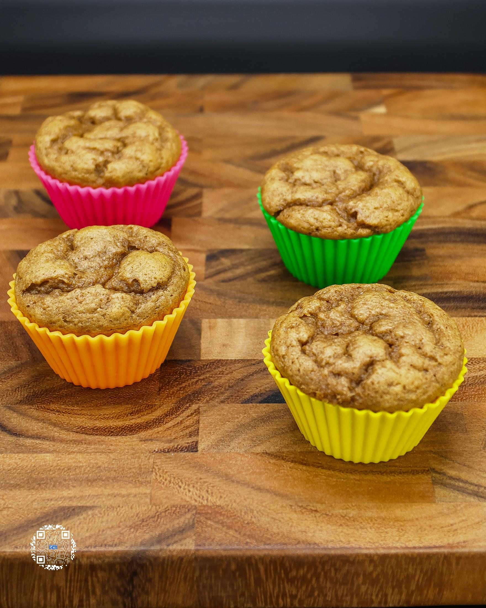

## Additional Recipe Pages

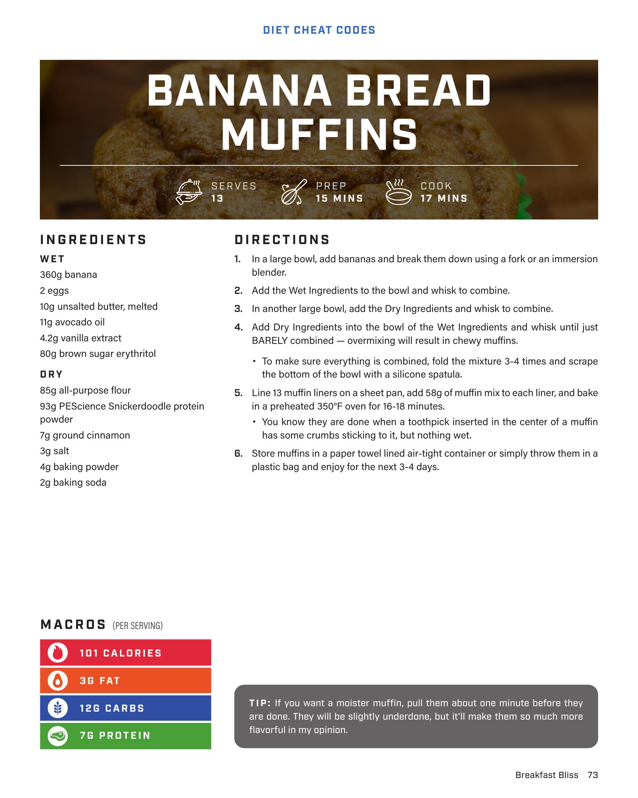

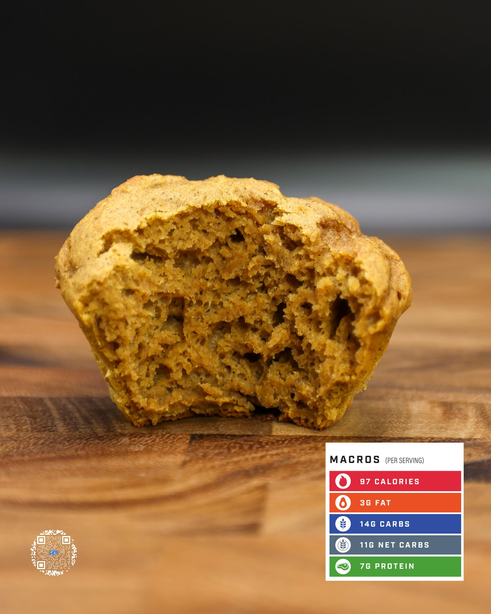

## Source Pages

73, 74, 75

---

# BANANA PANCAKES

**Serves:** 1 | **Prep:** 5 MINS | **Cook:** 10 MINS

## Macros

| Calories | Fat | Carbs | Net Carbs | Protein |
|----------|-----|-------|-----------|---------|
| 361 | 2 | 72 | 47 | 37 |

## Ingredients

### WET

- 120g banana
- 100g egg whites
- 4.2g vanilla extract
- 25g granulated erythritol

### DRY

- 20g all-purpose flour
- 30g PEScience Gourmet Vanilla protein powder
- 1g salt
- 1.5g baking powder

## Directions

1. Mash the banana with a fork or hand mixer, add the rest of your Wet Ingredients, and stir to combine.
2. In a separate bowl, combine the Dry Ingredients and mix together.
3. Pour your dry ingredients into your wet ingredients and whisk until just combined.
4. Lightly coat a pan with oil and preheat on medium. When the pan is preheated, add enough batter to the pan to form pancakes in your desired size.
5. After 2-3 minutes or when the bottom of the pancakes are browned, lightly spray the top of the pancakes with oil to prevent any sticking, then flip, and cook the topside.
6. Once cooked to your liking, remove the pancakes from pan, and optionally garnish with a few slices of bananas.
7. Time to eat.

## Tips

If bulking or for greater flavor, substitute two whole eggs for the egg whites.

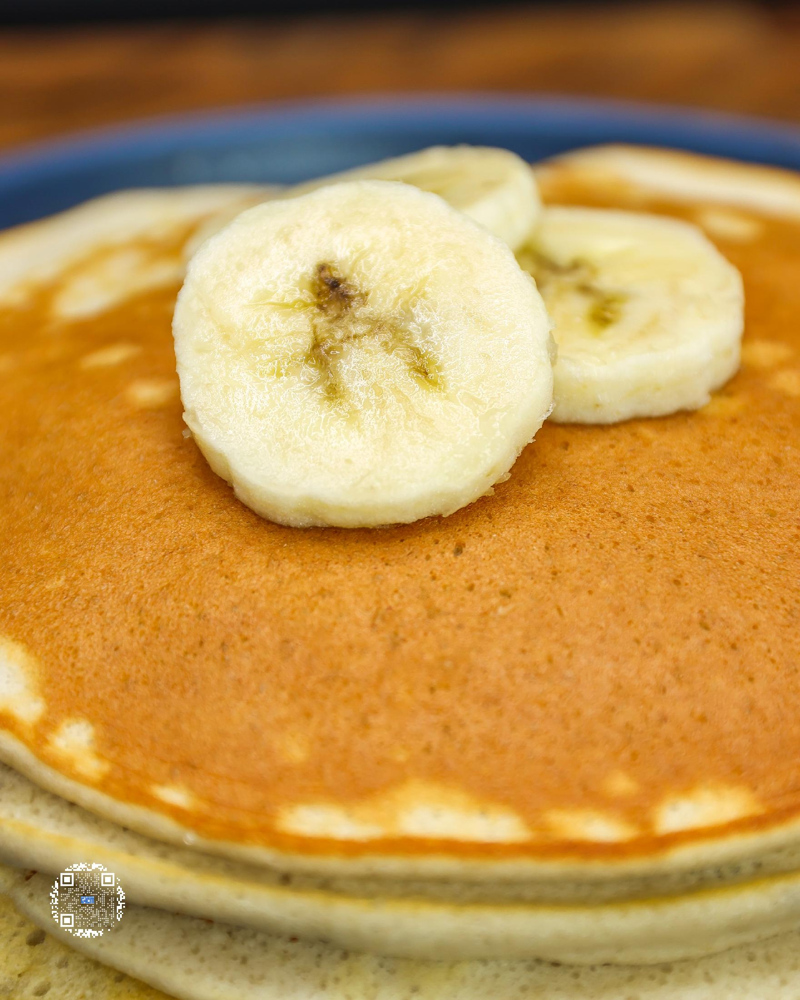

## Additional Recipe Pages

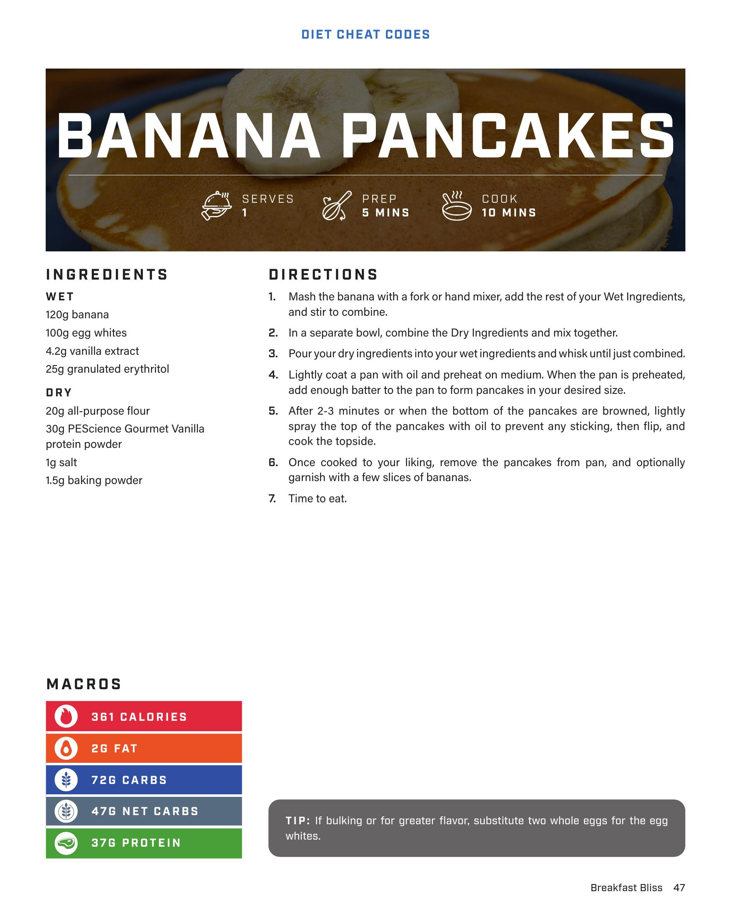

## Source Pages

47, 48

---

# BIRTHDAY CAKE FRENCH TOAST

**Serves:** 1 | **Prep:** 20 MINS | **Cook:** 20 MINS

## Macros

| Calories | Fat | Carbs | Net Carbs | Protein |
|----------|-----|-------|-----------|---------|
| 506 | 8 | 96 | 70 | 37 |

## Ingredients

### FRENCH TOAST

- 3 slices Texas Toast (90 cal/slice)
- 6 egg whites (204g)
- 12g granulated erythritol
- 4.2g vanilla extract
- 5g ground cinnamon
- 2g salt

### FROSTING

- 21g unsalted butter
- 224g fat-free cream cheese
- 1.5g salt
- 4g cake batter extract
- 4.2g vanilla extract
- 60g confectioners erythritol
- 12g sprinkles

### FRENCH TOAST BUILD

- 3 slices French Toast
- 75g Frosting

## Directions

1. In a large bowl, add egg whites, sweetener, vanilla, cinnamon, and salt. Mix with whisk or hand blender for 60 seconds or until all ingredients are incorporated.
2. Dip slices of bread one at a time in the wet mixture, soak for one minute, flip, and let bread soak on the other side for an additional minute.
3. Lightly spray a preheated pan on medium heat with oil. Place a soaked slice of bread into the pan.
4. Repeat for the additional slices. Lightly spray top of french toast with oil spray and let them cook for 20 minutes, flipping halfway through.
5. If there is extra wet mixture leftover, pour it on top of the bread before spraying the french toast with oil.
6. While the french toast cooks, add butter, cream cheese, and salt into a large bowl. Blend for 5 minutes using a hand mixer.
7. Pause halfway through to scrape down the sides of the bowl, then continue mixing.
8. Add cake batter extract and vanilla extract to the bowl and continue mixing for an additional 3 minutes.
9. In 3 parts, add confectioners erythritol to the bowl. Add more sweetener once each part is fully mixed in. This blend should take 5 minutes in total.
10. When finished mixing, add sprinkles and fold into frosting.
11. Put frosting into a plastic container and refrigerate.
12. You can use the frosting right away, but it tastes best after sitting in the fridge for 1-2 hours.
13. Add one slice of french toast to your plate, top with ½ of the frosting, spread evenly, and repeat for the other two slices of French toast.
14. Let's eat.

## Additional Recipe Pages

## Source Pages

57, 58

---

# BREAKFAST SAUSAGE PATTIES

**Serves:** 6.8 | **Prep:** 10 MINS | **Cook:** 10 MINS

## Macros

| Calories | Fat | Carbs | Net Carbs | Protein |
|----------|-----|-------|-----------|---------|
| 144 | 7 | 3 | undefined | 18 |

## Ingredients

- 448g 93% lean ground beef
- 30g sugar-free maple syrup
- 5g extra virgin olive oil
- 1g ground sage
- 1g ground thyme
- 6g salt
- 8g brown sugar erythritol
- 1g black pepper
- 0.8g ground nutmeg
- 1g cayenne pepper
- 1g paprika
- 12.5g powdered nonfat dairy milk

## Directions

1. Put all ingredients into a bowl, mix thoroughly, and form into 46.5g balls.
2. Flatten balls to about a -inch thick patty and add to a preheated pan on medium heat. You should hear that sizzle as soon as it hits the pan.
3. Cook for 2-3 minutes per side, until lightly brown.

## Tips

Have sage or thyme, but need to grind it down? Use a food processor or coffee grinder to do so. It becomes ground sage or thyme in seconds.TIP: Spray hands with oil for an easier time forming patties.TIP: Let meat mixture sit in the fridge up to 24 hours to amplify the flavor profile.

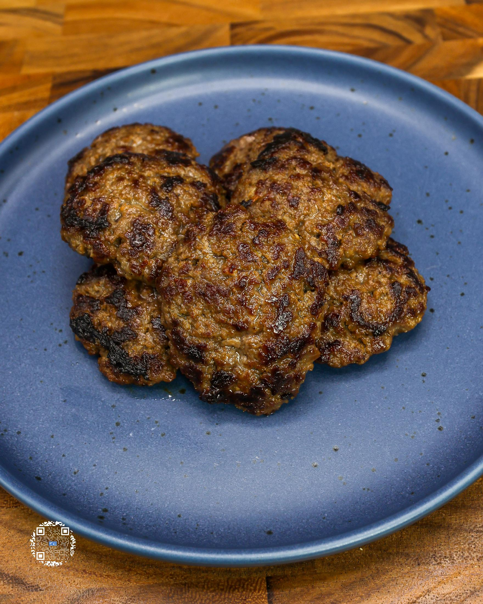

## Additional Recipe Pages

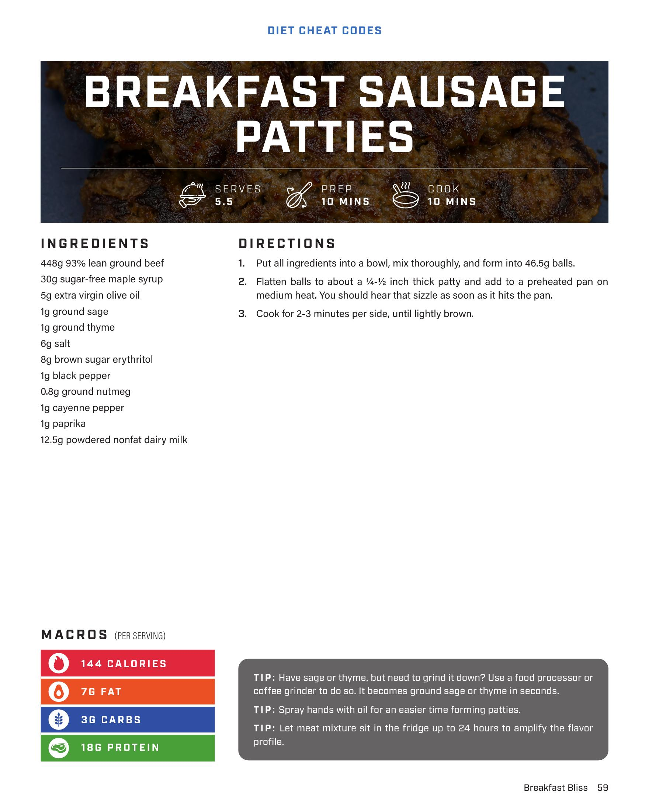

## Source Pages

59, 60

---

# COOKIE DOUGH STUFFED WAFFLE

**Serves:** 1 | **Prep:** 15 MINS | **Cook:** 5 MINS

## Macros

| Calories | Fat | Carbs | Net Carbs | Protein |
|----------|-----|-------|-----------|---------|
| 550 | 17 | 67 | 51 | 43 |

## Ingredients

- 50g PEScience Waffle & Pancake Mix
- 16.2g Gorilla Mode Vanilla Ice Cream protein OR 16g PEScience Gourmet Vanilla protein
- 100g water
- 100g chocolate chip cookie dough V2

## Directions

1. Make CHOCOLATE CHIP COOKIE DOUGH V2.
2. Add waffle mix and protein powder to a large bowl and whisk.
3. Add water and whisk until a batter forms. Wait 2-3 minutes to let it thicken.
4. Into a preheated Stuffler waffle maker, add a layer of waffle batter so the bottom grids and waffle divider are thinly, but completely covered.
5. Shape the cookie dough into a flat circle and place it in the center of the waffle maker.
6. The cookie dough should look like a cookie and be about a quarter inch from the edges of the waffle maker.
7. Cover the cookie dough with the remaining batter until it reaches the top of the square projections on the waffle tongs.
8. Close the waffle maker, flip, and cook for 5-6 minutes.

## Notes

You can use any premade waffle mix that you would like. However, you may need to adjust the amount of water used and macros as needed. One batch of cookie dough makes enough for 3 waffles.

## Additional Recipe Pages

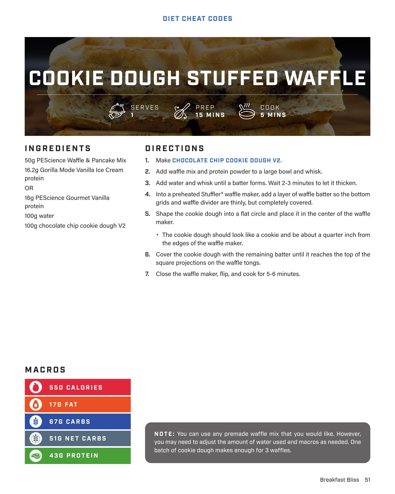

## Source Pages

51, 52

---

# FRENCH TOAST ROLL-UPS

**Serves:** 1 | **Prep:** 20 MINS | **Cook:** 10 MINS

## Macros

| Calories | Fat | Carbs | Net Carbs | Protein |
|----------|-----|-------|-----------|---------|
| 0 |  |  | undefined |  |

## Ingredients

- 4 slices bread (35 cal)

### FILLING

- 112g fat-free cream cheese
- 4g brown sugar erythritol
- 16g PEScience Snickerdoodle protein powder
- 4.2g vanilla extract
- 30g fat-free milk
- 20g granulated erythritol

### EGG WASH

- 3 egg whites
- 10g granulated erythritol
- 2.1g vanilla extract
- 1g cinnamon

### ICING

- 1/3 scoop PEScience Snickerdoodle protein powder
- 3g all-purpose flour
- 5g granulated erythritol

### TOPPING

- 4g brown sugar erythritol

## Directions

1. Preheat pan on stovetop on medium low.
2. Add Filling Ingredients into a medium bowl and mix with a hand mixer or whisk until smooth. Add Egg Wash ingredients into another medium bowl and whisk until smooth.
3. Flatten a slice of bread with a rolling pin, then layer filling across the bread. Roll the bread up, keeping the filling inside. It does not have to be rolled up super tight.
4. Add a little bit of extra filling to the end of the bread and firmly press down to seal.
5. Repeat until all rolls are finished.
6. Place the first piece of stuffed french toast into egg wash, and let it soak up as much liquid as possible.
7. Once french toast is almost falling apart, add it to pan, and repeat with other pieces.
8. Top the french toast with any extra egg wash and cook 2-3 minutes on each side or until golden brown on each side.
9. While cooking, mix Icing Ingredients in a small bowl. Slowly add a few drops of water at a time and mix until the icing reaches your desired consistency.
10. Top french toast with brown sugar and icing and IT'S TIME TO EAT!

## Source Pages

56

---

# HONEY BUTTER CHICKEN BISCUIT

**Serves:** 4 | **Prep:** 1.5 HRS | **Cook:** 15 MINS

## Macros

| Calories | Fat | Carbs | Net Carbs | Protein |
|----------|-----|-------|-----------|---------|
| 381 | 12 | 32 | undefined | 38 |

## Ingredients

- Ready-to-bake jumbo biscuits
- 3 chicken breasts

### DREDGE STATION 1

- 30g soy sauce
- 30g Sriracha
- 1 egg
- 4g sesame oil
- 1.5g salt
- Dash black pepper

### DREDGE STATION 2

- 60g all-purpose flour
- 1.5g salt

### HONEY BUTTER (Per Biscuit)

- 5g unsalted butter, softened
- 2.5g honey

### GLAZE

- 16g Sriracha

## Directions

1. PREP AND BRINE the chicken breasts.
2. Cut chicken into 140g cutlets.
3. Set up Dredge Station 1 in a medium bowl, whisk, add chicken, cover with plastic wrap, and put into the fridge for at least 1 hour.
4. Put as many biscuits as you need into a preheated oven, put extras in a plastic bag and into the fridge, and follow the cooking instructions on the label.
5. Set up Dredge Station 2 in a container, grab a piece of chicken from Dredge Station 1, let excess drip off, and put it into the flour.
6. Shake container around to get flour all over the chicken and press more flour into the chicken itself and its crevices to get it completely covered.
7. Shake off any excess, add to a wire rack, and repeat for all pieces of chicken.
8. Add chicken to a preheated air fryer at 350°F, lightly spray each side with oil, and cook for 8-10 minutes or until internal temperature is 155°F.
9. Add honey butter ingredients into a small bowl and whisk.
10. When biscuits are out of the oven and cooled, cut each biscuit into thirds, discarding the middle third. The goal is to make the biscuit weight about 37g to reduce calories.
11. Add honey butter to each side of the biscuit and add Sriracha into the container that just had the honey butter in it.
12. Mix the Sriracha and honey butter remnants together and brush onto chicken.
13. Add chicken in-between the biscuits and EAT.

## Tips

Use an extra biscuit with a layer removed to add more volume to your meal. Just cut the chicken in half and split it between biscuits.

## Additional Recipe Pages

## Source Pages

69, 70, 71

---

# JAPANESE PANCAKES

**Serves:** 1 | **Prep:** 10 MINS | **Cook:** 10 MINS

## Macros

| Calories | Fat | Carbs | Net Carbs | Protein |
|----------|-----|-------|-----------|---------|
| 350 | 11 | 45 | 20 | 39 |

## Ingredients

- 2 eggs
- 40g fat-free milk
- 2.1g vanilla extract
- Pinch salt (~.4 grams)
- 19g all-purpose flour
- 30g PEScience Gourmet Vanilla protein powder
- 1g baking powder
- 25g granulated erythritol
- Dash cream of tartar

## Directions

1. In a large bowl, separate egg whites from the yolks and place yolks in a separate bowl.
2. Add milk, vanilla extract, and salt to the yolks.
3. Into the egg yolk mixture, sift flour, protein powder, and baking powder. You can do this by using a strainer and gently shaking the flour-laden strainer until it is empty. Whisk to combine.
4. Start blending the egg whites using a hand mixer on low speed. When it begins to foam, add 1/2 of the erythritol at a time, and add more once the sweetener is completely mixed in.
5. Once the erythritol has been completely mixed in, the egg whites should be very close to forming stiff peaks and it is time to add the cream of tartar and mix for an additional 30 seconds or until stiff peaks have formed.
6. Take a quarter of the meringue and vigorously mix it into the egg yolk mixture.
7. Take the remaining meringue, pour it on top, and gently fold it in until the mixture has JUST BARELY come together.
8. Lightly spray a preheated pan on low with oil and pipe batter into the pan where the middle of the pancake will be. Let gravity do the work while slowing raising the bag up as the pancake gets taller and spreads out.
9. Repeat for the other pancakes, add a few drops of water into the pan, and cover.
10. Let pancakes cook for 3-5 minutes, lightly spray the top of each pancake, flip, and cover.
11. Let the pancakes cook for an additional 2-3 minutes, plate it, pour some sugar-free syrup on top, and enjoy!

## Tips

The goal here is to not overwork the batter because that will cause the pancake to be noticeably less fluffy. Transfer finished batter to a plastic gallon bag and when ready to cook, cut the corner of the bag off.

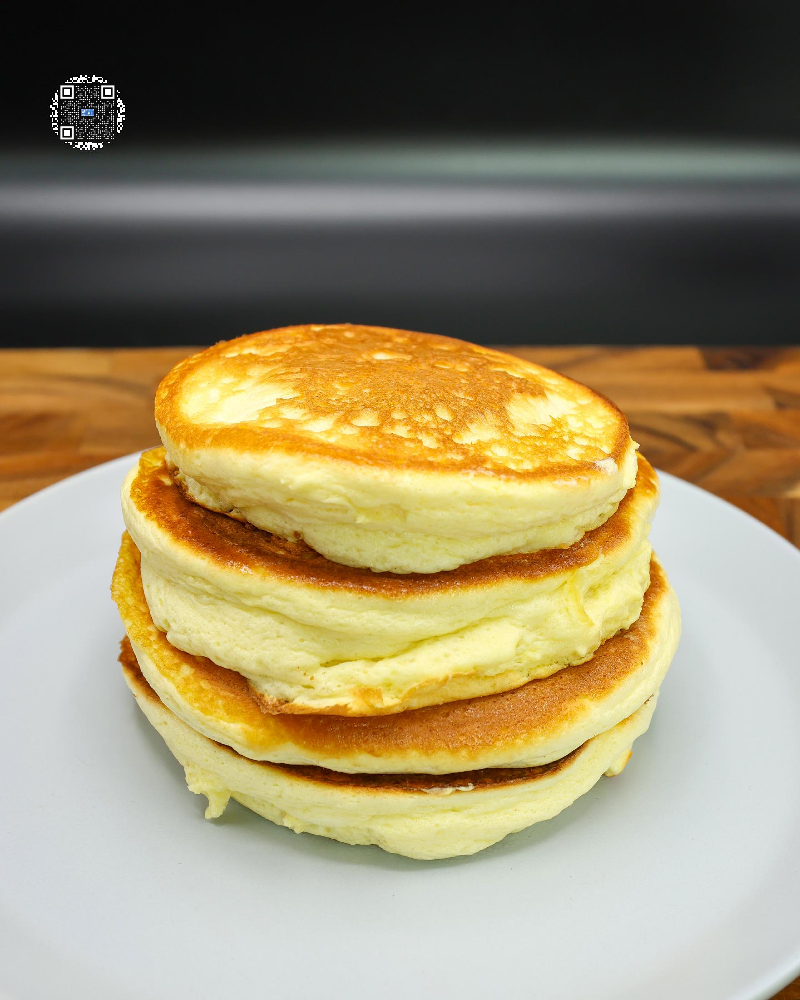

## Additional Recipe Pages

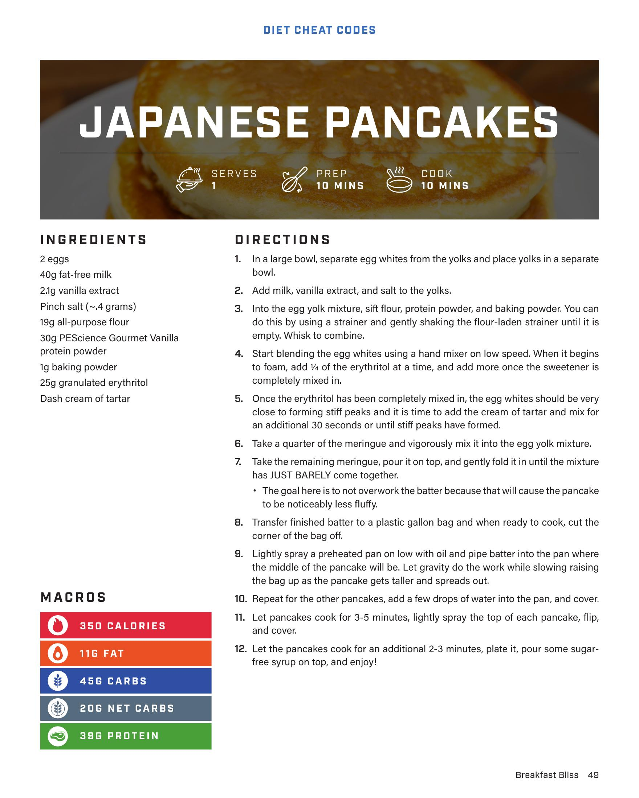

## Source Pages

49, 50

---

# JUMBO BLUEBERRY MUFFINS

**Serves:** 6 | **Prep:** 15 MINS | **Cook:** 35 MINS

## Macros

| Calories | Fat | Carbs | Net Carbs | Protein |
|----------|-----|-------|-----------|---------|
| 0 | 0 | 0 | undefined | 0 |

## Ingredients

### WET

- 2 eggs
- 1 egg yolk
- 100g granulated erythritol
- 350g 2% Greek yogurt
- 12g avocado oil
- 10g imitation vanilla

### DRY

- 90g all-purpose flour
- 95g PEScience Gourmet Vanilla protein powder
- 3g salt
- 4g baking powder
- 2g baking soda
- 1g xanthan gum

### MIX-IN

- 225g blueberries
- 3g all-purpose flour

### TOPPING

- 30g blueberries
- 24g turbinado sugar
- 2g lemon zest

## Directions

1. Add the eggs, egg yolk, and erythritol to a large bowl and whisk to combine.
2. Add the rest of the Wet Ingredients to the bowl and whisk to combine.
3. In another large bowl, add the Dry Ingredients and whisk to combine.
4. Add Dry Ingredients into the bowl of the Wet Ingredients and whisk until just BARELY combined — overmixing will result in chewy muffins.
5. To make sure everything is combined, fold the mixture 3-4 times and scrape the bottom of the bowl with a silicone spatula.
6. Add blueberries to a medium bowl, top with flour, and shake the bowl to evenly distribute the flour. This will stop the blueberries from sinking to the bottom while cooking.
7. Add blueberries to the batter and fold them in until evenly distributed.
8. Line a jumbo muffin pan with large baking cups, lightly spray each cup with oil to prevent sticking, and add 170g of batter to each cup.
9. In a small bowl, add turbinado sugar. Using a zester, add the zest from a medium lemon into the bowl and mix to combine.
10. Top each muffin with the sugar mixture and blueberries. Bake in a preheated 300°F oven for 33-37 minutes.
11. Let muffins cool on a wire rack for 1 hour and store in a paper towel lined air-tight container or simply throw them in a plastic bag and enjoy for the next 3-4 days.

## Tips

You know they are done when a toothpick inserted in the center of a muffin has some crumbs sticking to it, but nothing wet.

## Source Pages

78

---

# JUMBO CHOCOLATE CHIP MUFFINS

**Serves:** 6 | **Prep:** 12 MINS | **Cook:** 30 MINS

## Macros

| Calories | Fat | Carbs | Net Carbs | Protein |
|----------|-----|-------|-----------|---------|
| 261 | 10 | 42 | 22 | 22 |

## Ingredients

### WET

- 2 eggs
- 1 egg yolk
- 60g granulated erythritol
- 60g brown sugar erythritol
- 350g 2% Greek yogurt
- 15g avocado oil
- 10g imitation vanilla

### DRY

- 90g all-purpose flour
- 95g PEScience Gourmet Vanilla protein powder
- 3g salt
- 4g baking powder
- 2g baking soda
- 1g xanthan gum

### MIX-IN/TOPPING

- 56g mini chocolate chips

## Directions

1. Add the eggs, egg yolk, granulated erythritol, and brown sugar erythritol to a large bowl and whisk to combine.
2. Add the rest of the Wet Ingredients to the bowl and whisk to combine.
3. In another large bowl, add the Dry Ingredients and whisk to combine.
4. Add Dry Ingredients into the bowl of the Wet Ingredients and whisk until just BARELY combined - overmixing will result in chewy muffins. To make sure everything is combined, fold the mixture 3-4 times and scrape the bottom of the bowl with a silicone spatula.
5. Add 45 grams of chocolate chips to the batter and fold them in until evenly distributed.
6. Line a jumbo muffin pan with large baking cups, lightly spray each cup with oil to prevent sticking, and add 140g of batter to each cup.
7. Add remaining chocolate chips to a small bowl, top each muffin with chocolate chips, and bake in a preheated 300°F oven for 28-32 minutes. You know the muffins are done when a toothpick inserted in the center of a muffin has some crumbs sticking to it, but nothing wet.
8. Let muffins cool on a wire rack for 1 hour and store in a paper towel lined air-tight container or simply throw them in a plastic bag and enjoy for the next 3-4 days.

## Tips

For the ultimate eating experience, pop the muffin in the microwave for 10-15 seconds before indulging. This will make the muffin soft, ultra moist, and melt the chocolate chips to perfection.

## Additional Recipe Pages

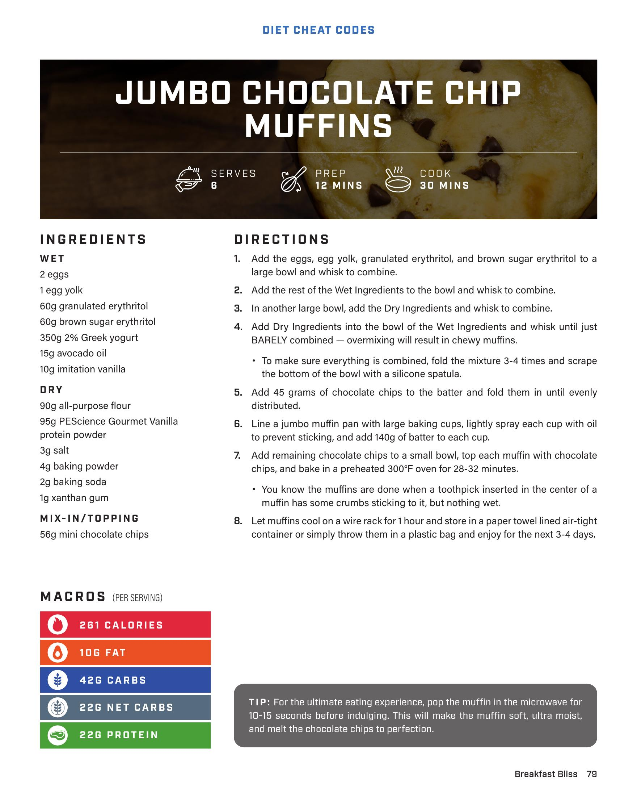

## Source Pages

79, 80

---

# JUMBO PUMPKIN CHEESECAKE MUFFINS

**Serves:** 6 | **Prep:** 25 MINS | **Cook:** 34 MINS

## Macros

| Calories | Fat | Carbs | Net Carbs | Protein |
|----------|-----|-------|-----------|---------|
| 0 | 0 | 0 | undefined | 0 |

## Ingredients

### CHEESECAKE FILLING

- 84g low-fat cream cheese
- 84g 2% cottage cheese
- 15g sugar
- 20g erythritol
- 2g imitation vanilla

### DRY

- 90g all-purpose flour
- 102g PEScience Pumpkin Pie protein powder
- 3g pumpkin spice
- 7g ground cinnamon
- 3g salt
- 4g baking powder
- 2g baking soda
- .5g xanthan gum

### WET

- 425g pure pumpkin
- 2 eggs
- 18g avocado oil
- 6g imitation vanilla
- 40g brown sugar erythritol
- 40g granulated erythritol

## Directions

1. Add all cheesecake ingredients into a high sided container and using an immersion blender, mix ingredients until smooth.
2. Put a gallon bag in a cup, add the cheesecake to it, close the bag, and freeze.
3. Add the dry ingredients to a large bowl and whisk to combine.
4. In another large bowl, add the wet ingredients and whisk to combine.
5. Add dry ingredients into the bowl of the wet ingredients and whisk until just BARELY combined — overmixing will result in chewy muffins.
6. To make sure everything is combined, fold the mixture 3-4 times and scrape the bottom of the bowl with a silicone spatula.
7. Line a jumbo muffin pan with large baking cups, lightly spray each cup with oil to prevent sticking, and add 140g of batter to each cup.
8. Take the back of a spoon and spin it in the middle of the batter while pushing the batter up the sides of the baking cups until there is a circular hole about 1.5" deep. Repeat for each muffin.
9. Grab the cheesecake filling, cut the tip of the gallon bag, and distribute the filling evenly to each muffin.
10. Bake in a preheated 300°F oven for 32-36 minutes.
11. You know the muffins are done when you shake the muffin pan and the middle of the cheesecake filling still has a little bit of jiggle to it.
12. Let muffins cool on a wire rack for an hour and store in a paper towel lined airtight container or simply throw them in a plastic bag and enjoy for the next 3-4 days.

## Tips

For the ultimate eating experience, freeze them in a plastic bag and microwave them for 60-75 seconds when ready to eat. Let them sit for 1 minute and the muffin should be warm while the cheesecake is still cold and soft. These muffins will store in the freezer for 2-3 months.

## Source Pages

84

---

# JUMBO TRIPLE CHOCOLATE MUFFINS

**Serves:** 6 | **Prep:** 15 MINS | **Cook:** 40 MINS

## Macros

| Calories | Fat | Carbs | Net Carbs | Protein |
|----------|-----|-------|-----------|---------|
| 301 | 11 | 28 | undefined | 24 |

## Ingredients

### DRY

- 120g granulated erythritol
- 30g sugar
- 4.5g salt
- 90g all-purpose flour
- 99g PEScience Chocolate Truffle protein powder
- 30g cocoa powder
- 6g baking powder
- 2g baking soda
- 5g xanthan gum

### WET

- 1 egg
- 2 egg yolks
- 120g 2% chocolate milk
- 100g 2% greek yogurt
- 10g avocado oil
- 2g coffee extract

### TOPPING

- 56g chocolate chips

## Directions

1. Add the erythritol, sugar, and salt to a large bowl and place a mesh strainer over the bowl.
2. Add the remaining dry ingredients to the strainer and sift them into the bowl.
3. If you only have vanilla whey/casein protein powder, it will work, but it may reduce the chocolaty flavor-add 5-10g extra cocoa powder to compensate.
4. Press any remaining chunks through the strainer, and pour any leftover remnants into the bowl.
5. Thoroughly whisk the dry ingredients, then use a spoon to create a well in the middle of the bowl.
6. Pour all the wet ingredients into the well and whisk ONLY the wet ingredients until fully combined.
7. Switch to a rubber spatula and gently fold the ingredients together until just BARELY combined-overmixing will result in chewy muffins. WHEN finished, fold 3-4 more times and scrape the bottom to ensure the dry ingredients have been soaked up.
8. Line a jumbo muffin pan with large baking cups, lightly spray each cup with oil to prevent sticking, and add 160g of batter into each cup.
9. Evenly top each muffin with chocolate chips and bake in a preheated 300°F oven for 38-42 minutes. The muffins are done when a toothpick inserted in the center comes out with a few crumbs but no wet batter.
10. Allow the muffins to cool on a wire rack for 1 hour or until the chocolate hardens.
11. Store them in an airtight container lined with a paper towel, or simply place them in a plastic bag. Enjoy within 3-4 days.

## Tips

TIP 1: Turn muffins into lava cakes by baking 4-5 minutes less. TIP 2: Microwave for 10-15 seconds to enjoy a fresh baked eating experience.

## Additional Recipe Pages

## Source Pages

81, 82, 83

---

# KOREAN BREAKFAST SANDWICH

**Serves:** 4 | **Prep:** 15 MINS | **Cook:** 30 MINS

## Macros

| Calories | Fat | Carbs | Net Carbs | Protein |
|----------|-----|-------|-----------|---------|
| 438 | 18 | 47 | 17 | 50 |

## Ingredients

### FLUFFY EGGS

- 6 eggs
- 238g egg whites
- 210g 2% milk
- 4g salt
- 2g MSG

### SANDWICH

- Bagel (110 cal)
- 2 slices jalapeño Velveeta*
- 56g Canadian bacon (60 cal)
- ¼ fluffy eggs
- 20g chipotle aioli

## Directions

1. Preheat oven to 325°F. Add water to a medium saucepan and bring to a boil. Once boiling, reduce to a low simmer.
2. While water comes to a boil, add eggs to a large bowl and whisk with a fork. Add egg whites, milk, salt, and MSG, then whisk again until fully combined.
3. Lightly spray an 8" x 8" pan with oil. Strain the egg mixture into the pan using a fine-mesh strainer.
4. Tap the pan gently on the counter to release air bubbles. Cover tightly with aluminum foil.
5. Place the covered pan into a larger baking dish and transfer to the oven. Carefully pour the simmering water into the baking dish until it reaches halfway up the sides of the pan.
6. Bake for 25-30 minutes, or until the eggs are just set and reach 175°F internally.
7. While the eggs cook, prepare the CHIPOTLE AIOLI.
8. When the eggs are fully cooked, remove the dish from the oven and lift the pan out of the water bath and onto a towel. Let it rest for 5 minutes.
9. Uncover, place a cutting board over the pan, and flip to release the eggs. Cut into 4 equal squares.
10. Lightly oil a preheated pan over medium heat. Add Canadian bacon and sear for 1-2 minutes per side, or until browned.
11. While the bacon browns, toast the inside of the bagel.
12. On a sheet of parchment paper, layer the sandwich in this order: bottom bagel, cheese, bacon, egg, cheese, aioli, and top bagel.
13. Wrap sandwich in parchment, microwave for 30 seconds, and let rest (still wrapped) for 2 minutes to let the flavors mingle with each other.
14. Cut in half and enjoy.

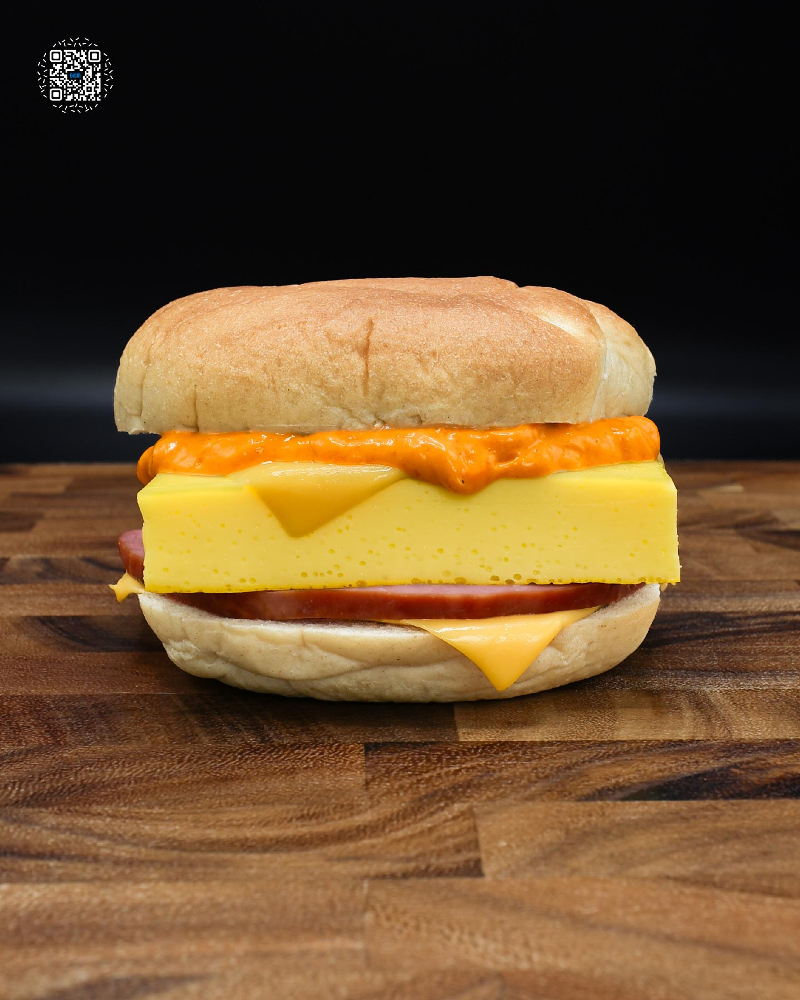

## Additional Recipe Pages

## Source Pages

67, 68

---

# LEMON GLAZE MUFFINS

**Serves:** 14 | **Prep:** 20 MINS | **Cook:** 17 MINS

## Macros

| Calories | Fat | Carbs | Net Carbs | Protein |
|----------|-----|-------|-----------|---------|
| 0 | 0 | 0 | undefined | 0 |

## Ingredients

### WET

- 300g 2% Greek yogurt
- 2 eggs
- 21g avocado oil
- 4.2g vanilla extract
- 80g lemon juice
- 4g lemon zest
- 2g lemon extract (optional)
- 100g granulated erythritol (add 20g if using lemon extract)

### DRY

- 90g all-purpose flour
- 93g PEScience Gourmet Vanilla protein powder
- 3g salt
- 4g baking powder
- 2g baking soda

### GLAZE

- 5g unsalted butter
- 110g powdered sugar
- 35g lemon juice
- Zest half lemon

## Directions

1. In a large bowl, add the Wet Ingredients and whisk to combine.
2. In another large bowl, add the Dry Ingredients and whisk to combine.
3. Add Dry Ingredients into the bowl of the Wet Ingredients and whisk until just BARELY combined — overmixing will result in chewy muffins. To make sure everything is combined, fold the mixture 3-4 times and scrape the bottom of the bowl with a silicone spatula.
4. Line 14 muffin liners on a sheet pan, add 59g of muffin mix to each liner, and bake in a preheated 350°F oven for 16-18 minutes. You know they are done when a toothpick inserted in the center of a muffin has some crumbs sticking to it, but nothing wet.
5. While the muffins are baking, prepare the glaze by microwaving butter in a small bowl in ten second intervals until melted.
6. In a medium bowl, add the melted butter, powdered sugar, lemon juice, and lemon zest for the glaze. Whisk to combine.
7. Put parchment paper below a wire rack, add hot muffins to the rack, top each muffin with glaze, and spread the glaze around the top of the muffin using a spatula.
8. Store muffins in a paper towel lined air-tight container and enjoy for the next 3-4 days.

## Tips

If you want a moister muffin, pull them about one minute before they are done. They will be slightly undone, but it'll make them so much more flavorful in my opinion.

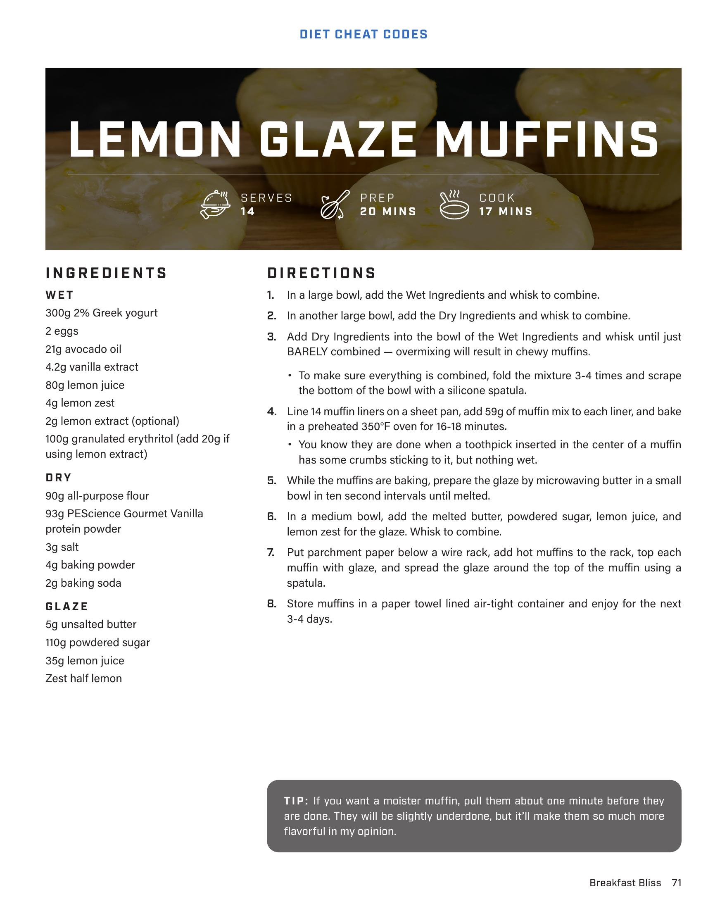

## Source Pages

72

---

# NICKDONALD'S BREAKFAST BURRITO

**Serves:** 4 | **Prep:** 10 MINS | **Cook:** 15 MINS

## Macros

| Calories | Fat | Carbs | Net Carbs | Protein |
|----------|-----|-------|-----------|---------|
| 468 | 19 | 46 | 24 | 49 |

## Ingredients

- 10g tomato, chopped
- 10g canned green chiles
- 5g dried minced onion
- 2 egg whites
- 1 egg
- 30g fat-free milk
- Salt and black pepper, to taste
- 3.5g unsalted butter
- 94g BREAKFAST SAUSAGE
- 2 La Bandenta® Carb Counter taco tortillas
- 2 slices original Velveeta® cheese
- Optional: Pace® picante salsa

## Directions

1. Dice tomatoes and pat green chiles with paper towel to remove some of the moisture.
2. Take minced onion, add just enough water to cover, then heat in microwave for 30 seconds. Drain the water and pat onions dry with a towel. They should be soft at this point.
3. Add egg, egg whites, milk, salt, and pepper to a container and whisk together.
4. Add butter to preheated pan on medium heat, spread it around, and add egg mixture.
5. Constantly move eggs around the pan with a spatula until just slightly wet or about 15 seconds from being done since there will be carryover cooking.
6. Add tomatoes, green chiles, and onion to eggs and mix together just before eggs finish cooking.
7. Add egg to a plate or container and add BREAKFAST SAUSAGE PATTY mix to a separate preheated pan on medium heat.
8. Using a spoon, continuously break apart the sausage mix into small pieces while constantly stirring until meat is browned and in small pieces.
9. Lay tortillas on counter, add 1 slice of cheese to each, followed by the meat, and eggs.
10. Bring the ends of the tortilla in while slowly flipping one side of the tortilla over the filling.
11. Use the end of the tortilla to bring filling towards the middle and seal the filling in and finish by rolling until completely sealed.
12. Add burritos to separate pieces of parchment paper, roll them up, and throw in the microwave for 30 seconds.
13. Let sit for 1-2 minutes, grab some salsa, and it's time to EAT.

## Additional Recipe Pages

## Source Pages

63, 64

---

# NICKDONALD'S BREAKFAST SAUSAGE

**Serves:** 6 | **Prep:** 10 MINS | **Cook:** 10 MINS

## Macros

| Calories | Fat | Carbs | Net Carbs | Protein |
|----------|-----|-------|-----------|---------|
| 139 | 8 | 4 | 1 | 16 |

## Ingredients

- 448g 90% lean ground pork
- 6g salt
- 2g MSG
- 2g black pepper
- 1.5g sage
- 1.5g rosemary
- 1g garlic powder
- 1g onion powder
- .5g nutmeg
- 2.5g potato starch
- 20g erythritol

## Directions

1. Combine ingredients in a large bowl. Cover and refrigerate for 12-24 hours for best flavor.
2. Divide sausage into 80g portions, roll into balls, and place each on a sheet of parchment paper. Cover with another sheet, and press into 5" patties using a flat-bottomed pan or pot.
3. Heat a pan over medium heat and cook the patties for 2-3 minutes on one side, until browned.
4. Flip the patties and cook for an additional 1-2 minutes.

## Additional Recipe Pages

## Source Pages

61, 62

---

# PUMPKIN PIE MUFFINS

**Serves:** 13 | **Prep:** 15 MINS | **Cook:** 17 MINS

## Macros

| Calories | Fat | Carbs | Net Carbs | Protein |
|----------|-----|-------|-----------|---------|
| 252 | 8 | 43 | 26 | 23 |

## Ingredients

### WET

- 120g banana
- 240g pure pumpkin
- 2 eggs
- 21g avocado oil
- 4.2g vanilla extract
- 40g brown sugar erythritol (add 20g if using PEScience Multipurpose protein powder)
- 40g granulated erythritol (add 20g if using PEScience Multipurpose protein powder)

### DRY

- 90g all-purpose flour
- 93g PEScience Pumpkin Pie protein powder (90g PEScience Multipurpose protein powder if sold out)
- 5g pumpkin spice (6g if using PEScience Multipurpose protein powder)
- 7g ground cinnamon
- 3g salt
- 4g baking powder
- 2g baking soda

## Directions

1. In a large bowl, add bananas and break them down using a fork or an immersion blender.
2. In a large bowl, add the Wet Ingredients and whisk to combine.
3. In another large bowl, add the Dry Ingredients and whisk to combine.
4. Add Dry Ingredients into the bowl of the Wet Ingredients and whisk until just BARELY combined 
 overmixing will result in chewy muffins. To make sure everything is combined, fold the mixture 3-4 times and scrape the bottom of the bowl with a silicone spatula.
5. Line 13 muffin liners on a sheet pan, add 59g of muffin mix to each liner, and bake in a preheated 350°F oven for 16-18 minutes. You know they are done when a toothpick inserted in the center of a muffin has some crumbs sticking to it, but nothing wet.
6. Store muffins in a paper towel lined air-tight container or simply throw them in a plastic bag and enjoy for the next 3-4 days.

## Tips

If you want a moister muffin, pull them about one minute before they are done. They will be slightly underdone, but it'll make them so much more flavorful in my opinion.

## Additional Recipe Pages

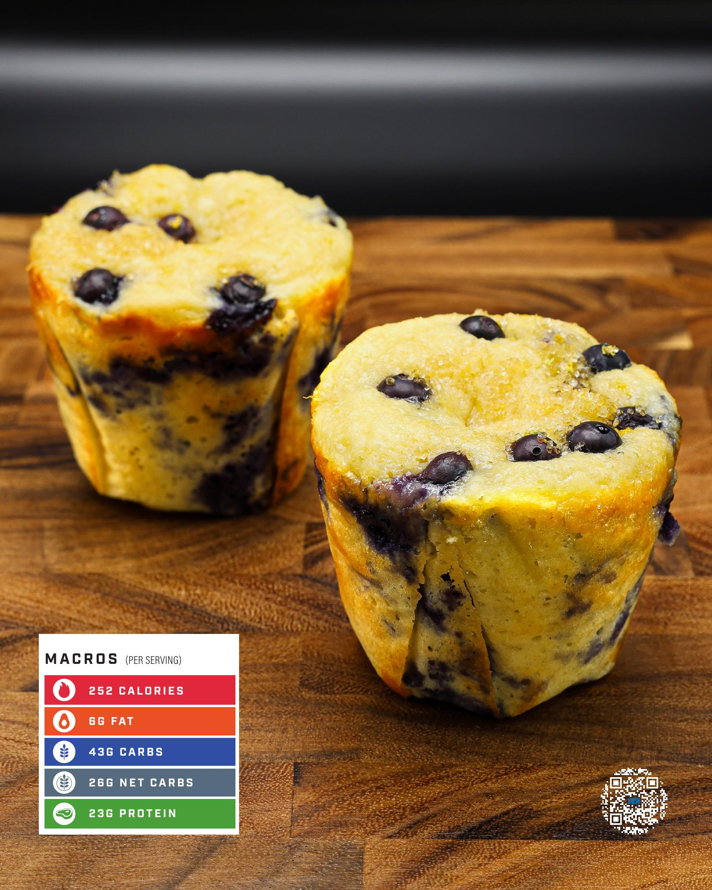

## Source Pages

76, 77

---

# STRAWBERRY CHEESECAKE STUFFED WAFFLE

**Serves:** 1 | **Prep:** 15 MINS | **Cook:** 5 MINS

## Macros

| Calories | Fat | Carbs | Net Carbs | Protein |
|----------|-----|-------|-----------|---------|
| 402 | 12 | 41 | 34 | 36 |

## Ingredients

### CHEESECAKE FILLING

- 60g 2% cottage cheese
- 56g low-fat cream cheese
- 56g fat-free cream cheese
- 1 egg yolk
- 15g granulated sugar
- 20g erythritol
- 1g salt
- 2g imitation vanilla
- 80g strawberries (40g whole, 40g chopped)
- 19g Gorilla Mind Vanilla Ice Cream protein

### WAFFLE

- 50g PEScience Waffle & Pancake Mix
- 16.2g Gorilla Mode Vanilla Ice Cream protein
- 90g water
- 108g Cheesecake Filling

## Directions

1. Place waffle mix and protein in a large bowl and whisk.
2. Add water and whisk until a batter forms.
3. Minus the 40 grams of chopped strawberries, add all cheesecake filling ingredients into a high-sided container and using an immersion blender mix for 2 minutes. You can use a blender cup to do this as well. You may need to scrape down the sides a few times to fully combine.
4. Put the chopped strawberries in the container and stir to evenly distribute.
5. Add 108 grams of the cheesecake filling to a small bowl and refrigerate the rest.
6. Into a preheated Stuffer® waffle maker, add a layer of waffle batter so the bottom grids and waffle divider are thinly, but completely covered.
7. Place the cheesecake filling in the center of the waffle maker. Make sure it is evenly spread out and is about a half inch from the edges of the waffle maker.
8. Cover the filling with the remaining batter until it reaches the top of the square projections on the waffle tongs.
9. Close the waffle maker, flip, and cook for 5-6 minutes.
10. Let the waffle cool for 2 minutes and cut in half. If you wait too long, the filling may be over cooked.

## Notes

You can use any premade waffle mix that you would like. However, you may need to adjust the amount of water used and macros as needed. One batch of cheesecake filling makes enough for 3 waffles.

## Additional Recipe Pages

## Source Pages

53, 54, 55

---

# BIRTHDAY CAKE COOKIE DOUGH

**Serves:** 8 | **Prep:** 10 MINS | **Cook:** N/A

## Macros

| Calories | Fat | Carbs | Net Carbs | Protein |
|----------|-----|-------|-----------|---------|
| 158 | 5 | 22 | 15 | 12 |

## Ingredients

### DRY

- 90g all-purpose flour
- 71g Gorilla Mind Vanilla Ice Cream protein powder OR 62g PEScience Gourmet Vanilla protein powder
- 1.5g salt

### WET

- 21g unsalted butter
- 2 eggs
- 5g cake batter extract
- 4.2g vanilla extract
- 42g granulated erythritol
- 14g brown sugar erythritol

### MIX-INS

- 8g sprinkles

## Directions

1. Add flour to large bowl and heat it up in the microwave in ten second intervals until it reaches 155°F.
2. Add the rest of the Dry Ingredients to the bowl and whisk thoroughly.
3. In a separate large bowl, microwave butter in ten second intervals until melted.
4. Add the rest of the Wet Ingredients over the butter and whisk until combined.
5. Add the Dry ingredients to the Wet Ingredients in 3-4 parts and combine using a whisk. Once one part is fully mixed in, add another, and repeat until finished.
6. To ensure everything is well combined, bring the mixture up the sides of the bowl with the spatula and wipe down the sides of the bowl, pressing out any clumps. Repeat this process 3-5 times.
7. Add sprinkles, mix until combined, and put in a container.
8. Enjoy right away or for peak flavor, refrigerate for 24 hours.

## Notes

When the mixture becomes too thick for the whisk, switch to a spatula.

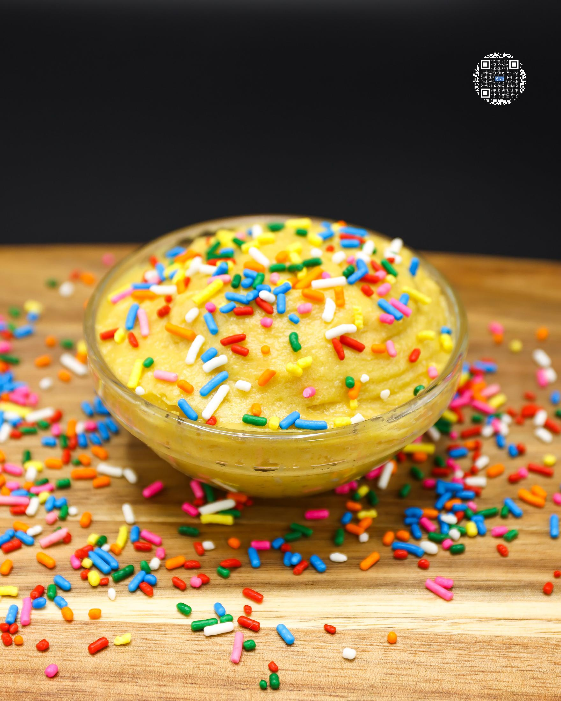

## Additional Recipe Pages

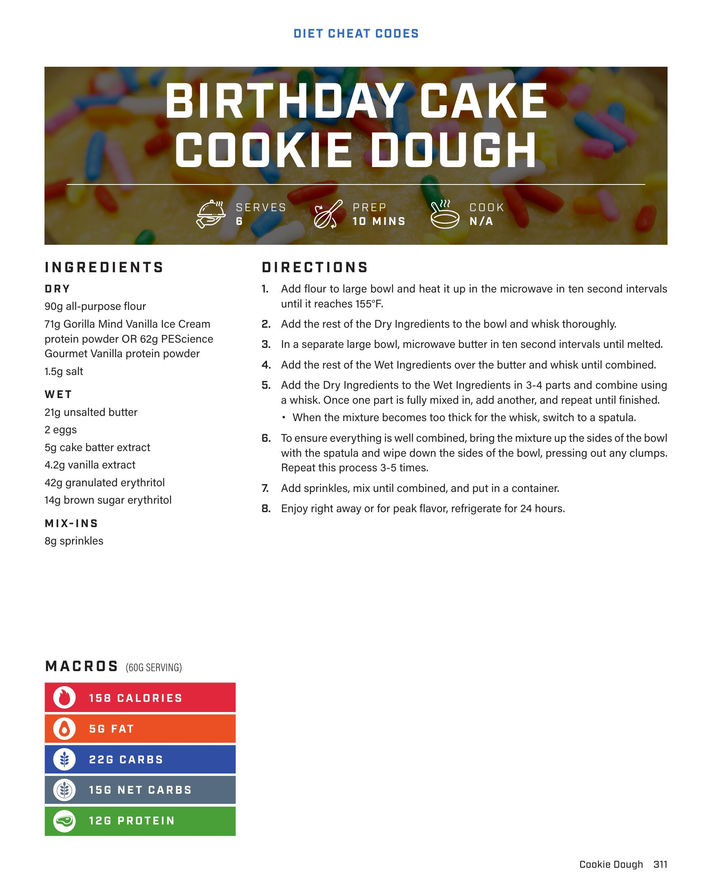

## Source Pages

311, 312

---

# CHOCOLATE CHIP COOKIE DOUGH V2

**Serves:** 5 | **Prep:** 10 MINS | **Cook:** N/A

## Macros

| Calories | Fat | Carbs | Net Carbs | Protein |
|----------|-----|-------|-----------|---------|
| 160 | 7 | 28 | 16 | 11 |

## Ingredients

### DRY

- 90g all-purpose flour
- 48.6g Gorilla Mode Vanilla Ice Cream protein powder
- 1.5g salt

### WET

- 21g unsalted butter
- 1 egg
- 1 egg yolk
- 4.2g vanilla extract
- 24g granulated erythritol
- 24g brown sugar erythritol

### MIX-INS

- 21g mini chocolate chips

## Directions

1. Add flour to large bowl and heat it up in the microwave in ten second intervals until it reaches 155°F.
2. Add the rest of the Dry Ingredients to the bowl and whisk thoroughly.
3. In a separate large bowl, microwave butter in ten second intervals until melted.
4. Add the rest of the Wet Ingredients over the butter and whisk until combined.
5. Add the Dry Ingredients to the Wet Ingredients in 3-4 parts and combine using a whisk. Once one part is fully mixed in, add another, and repeat until finished. When mixture becomes too thick for the whisk, switch to a spatula.
6. To ensure everything is well combined, bring mixture up the sides of the bowl with the spatula and wipe down the sides of the bowl. Repeat this process 3-5 times.
7. Add chocolate chips, mix until combined, and put in a container.
8. Enjoy right away or for peak flavor, refrigerate for 24 hours.

## Additional Recipe Pages

## Source Pages

303, 304

---

# CHOCOLATE CHIP COOKIE DOUGH

**Serves:** 6 | **Prep:** 10 MINS | **Cook:** N/A

## Macros

| Calories | Fat | Carbs | Net Carbs | Protein |
|----------|-----|-------|-----------|---------|
| 156 | 6 | 17 | 13 | 12 |

## Ingredients

### DRY

- 80g all-purpose flour
- 62g PEScience Gourmet Vanilla protein powder OR
- 71g Gorilla Mode Vanilla Ice Cream protein powder
- 1.5g salt

### WET

- 21g unsalted butter
- 2 eggs
- 1 egg white
- 4.2g vanilla extract
- 24g granulated erythritol
- 24g brown sugar erythritol

### MIX-INS

- 21g mini chocolate chips

## Directions

1. Add flour to large bowl and heat it up in the microwave in ten second intervals until it reaches 155°F.
2. Add the rest of the Dry Ingredients to the bowl and whisk thoroughly.
3. In a separate large bowl, microwave butter in ten second intervals until melted.
4. Add the rest of the Wet Ingredients over the butter and whisk until combined.
5. Add the Dry Ingredients to the Wet Ingredients in 3-4 parts and combine using a whisk. Once one part is fully mixed in, add another, and repeat until finished. When mixture becomes too thick for the whisk, switch to a spatula.
6. To ensure everything is well combined, bring mixture up the sides of the bowl with the spatula and wipe down the sides of the bowl. Repeat this process 3-5 times.
7. Add chocolate chips, mix until combined, and put in a container.
8. Enjoy right away or for peak flavor, refrigerate for 24 hours.

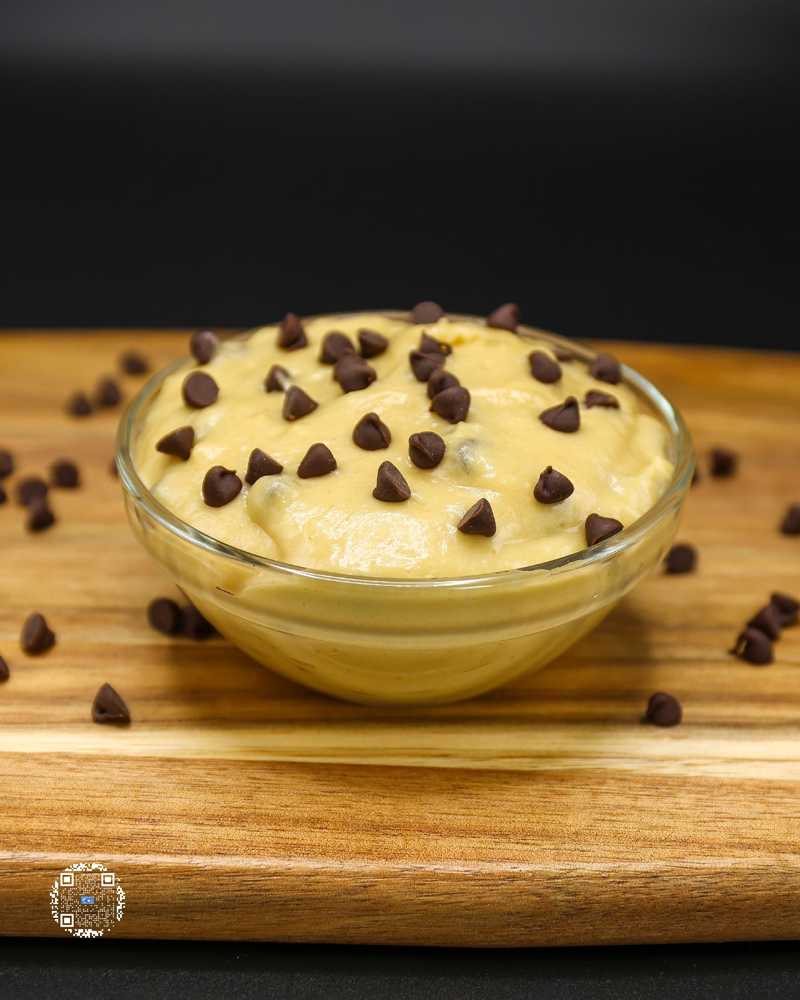

## Additional Recipe Pages

## Source Pages

301, 302

---

# COOKIES N' CREAM COOKIE DOUGH

**Serves:** 8 | **Prep:** 10 MINS | **Cook:** N/A

## Macros

| Calories | Fat | Carbs | Net Carbs | Protein |
|----------|-----|-------|-----------|---------|
| 143 | 5 | 20 | 16 | 10 |

## Ingredients

### DRY

- 90g all-purpose flour
- 40g black cocoa powder
- 71g Gorilla Mind Vanilla Ice Cream protein powder OR 67g PEScience Frosted Chocolate Cupcake protein powder
- 1.5g salt

### WET

- 21g unsalted butter
- 2 eggs
- 68g egg whites
- 32g granulated erythritol
- 32g brown sugar erythritol
- 4.2g vanilla extract
- 2g coffee extract

### MIX-INS/TOPPING

- 3 Oreos®, crushed

## Directions

1. Add flour to large bowl and heat it up in the microwave in ten second intervals until it reaches 160°F.
2. Add the rest of the Dry Ingredients to the bowl and whisk thoroughly.
3. In a separate large bowl, microwave butter in ten second intervals until melted.
4. Add the rest of the Wet Ingredients over the butter and whisk until combined.
5. Add the Dry Ingredients to the Wet Ingredients in 3-4 parts and combine using a whisk. Once one part is fully mixed in, add another, and repeat until finished.
6. To ensure everything is well combined, bring the mixture up the sides of the bowl with the spatula and wipe down the sides of the bowl, pressing out any clumps. I repeat this process 3-5 times.
7. Add ¾ of the Oreos®, fold them in, add to a container, and top with the remaining Oreos®.
8. Enjoy right away or for peak flavor refrigerate for 24 hours.

## Notes

When the mixture becomes too thick for a whisk, switch to a spatula.

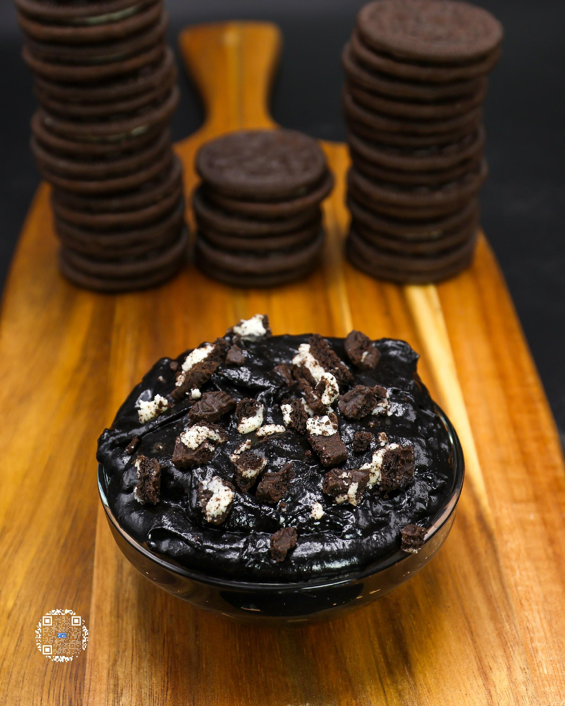

## Additional Recipe Pages

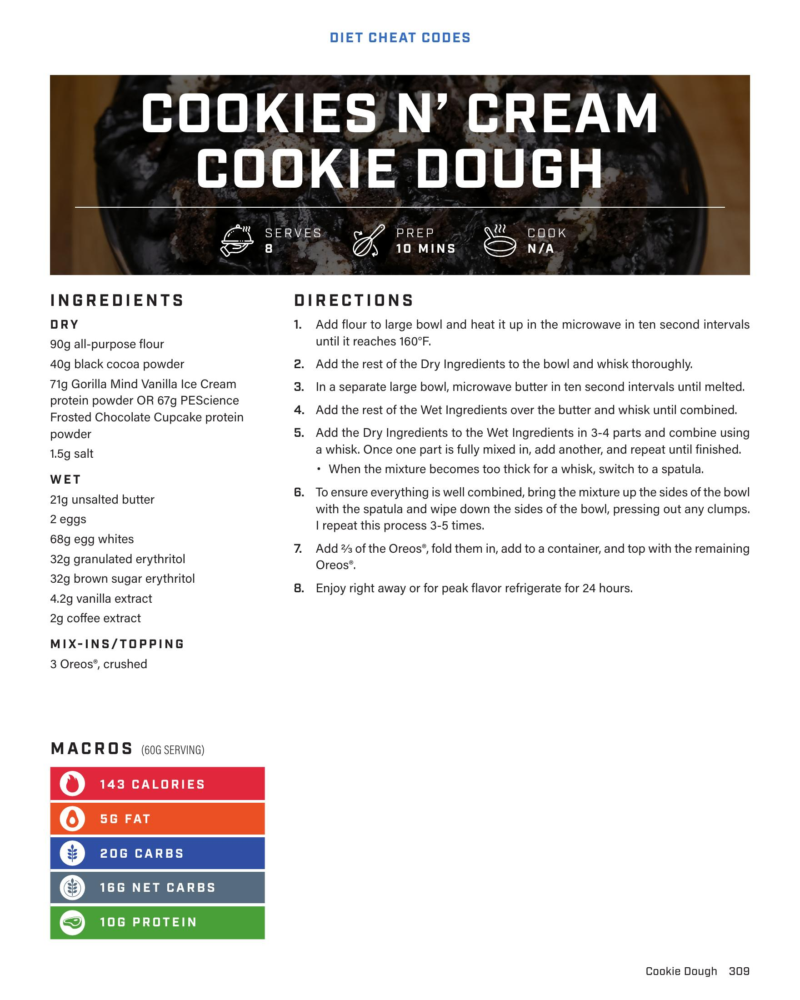

## Source Pages

309, 310

---

# PEANUT BUTTER COOKIE DOUGH

**Serves:** 7 | **Prep:** 10 MINS | **Cook:** N/A

## Macros

| Calories | Fat | Carbs | Net Carbs | Protein |
|----------|-----|-------|-----------|---------|
| 162 | 7 | 15 | 11 | 14 |

## Ingredients

### DRY

- 60g all-purpose flour
- 40g powdered peanut butter
- 65g PEScience Peanut Butter Cookie protein powder

### WET

- 30g peanut butter
- 14g unsalted butter
- 2 eggs
- 1 egg white
- 4.2g vanilla extract
- 28g granulated erythritol
- 28g brown sugar erythritol

### TOPPING

- 4g peanut butter, melted

## Directions

1. Add flour to large bowl and heat it up in the microwave in ten second intervals until it reaches 155°F.
2. Add the rest of the Dry Ingredients to the bowl and whisk thoroughly.
3. In a separate large bowl, microwave butter in ten second intervals until melted.
4. Add the rest of the Wet Ingredients over the butter and whisk until combined.
5. Add the Dry Ingredients to the Wet Ingredients in 3-4 parts and combine using a whisk. Once one part is fully mixed in, add another, and repeat until finished. When mixture becomes too thick for the whisk, switch to a spatula.
6. To ensure everything is well combined, bring mixture up the sides of the bowl with the spatula and wipe down the sides of the bowl. Repeat this process 3-5 times.
7. Enjoy right away or for peak flavor, refrigerate for 24 hours.
8. For additional flavor, heat up 4g of peanut butter and drizzle over the top of the cookie dough before eating.

## Additional Recipe Pages

## Source Pages

305, 306

---

# SNICKERDOODLE COOKIE DOUGH

**Serves:** 6 | **Prep:** 10 MINS | **Cook:** N/A

## Macros

| Calories | Fat | Carbs | Net Carbs | Protein |
|----------|-----|-------|-----------|---------|
| 153 | 6 | 20 | 12 | 13 |

## Ingredients

### DRY

- 90g all-purpose flour
- 72g PEScience Snickerdoodle protein powder
- 2g ground cinnamon
- 1.5g salt

### WET

- 28g unsalted butter
- 2 eggs
- 1 egg white
- 4.2g vanilla extract
- 48g granulated erythritol

### TOPPING

- 4g sugar
- 0.5g ground cinnamon

## Directions

1. Add flour to large bowl and heat it up in the microwave in ten second intervals until it reaches 155°F.
2. Add the rest of the Dry Ingredients to the bowl and whisk thoroughly.
3. In a separate large bowl, microwave butter in ten second intervals until melted.
4. Add the rest of the Wet Ingredients over the butter and whisk until combined.
5. Add the Dry Ingredients to the Wet Ingredients in 3-4 parts and combine using a whisk. Once one part is fully mixed in, add another, and repeat until finished.
6. When mixture becomes too thick for the whisk, switch to a spatula.
7. To ensure everything is well combined, bring mixture up the sides of the bowl with the spatula and wipe down the sides of the bowl. Repeat this process 3-5 times.
8. Enjoy right away or for peak flavor, refrigerate for 24 hours.
9. For additional flavor, whisk sugar and ground cinnamon and top dough with mixture right before eating.

## Notes

When mixture becomes too thick for the whisk, switch to a spatula. To ensure everything is well combined, bring mixture up the sides of the bowl with the spatula and wipe down the sides of the bowl. Repeat this process 3-5 times.

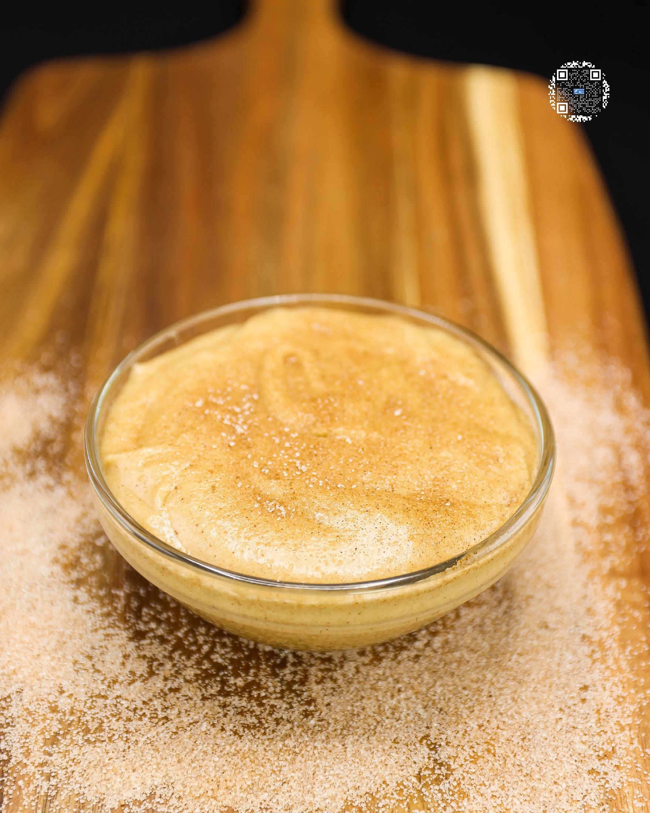

## Additional Recipe Pages

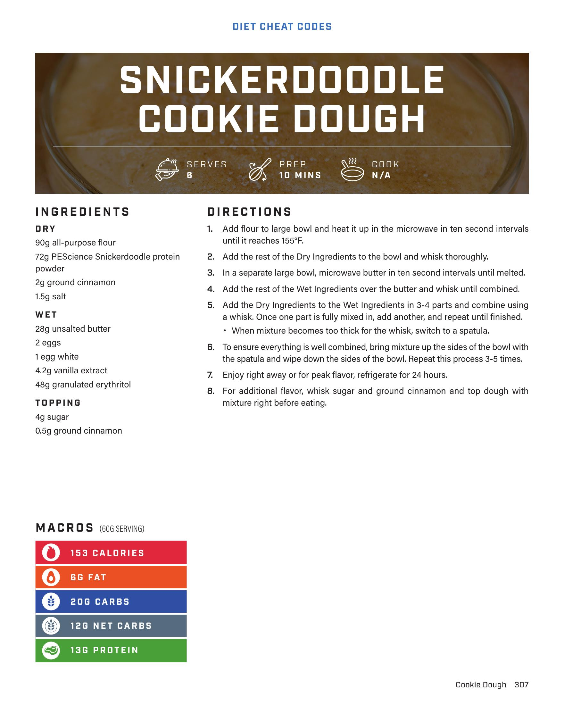

## Source Pages

307, 308

---

# BASQUE CHEESECAKE

**Serves:** 8 | **Prep:** 25 MINS | **Cook:** 35 MINS

## Macros

| Calories | Fat | Carbs | Net Carbs | Protein |
|----------|-----|-------|-----------|---------|
| 372 | 15 | 47 | 28 | 29 |

## Ingredients

- 325g 2% cottage cheese, blended
- 448g low-fat cream cheese
- 224g fat-free cream cheese
- 100g granulated sugar
- 150g erythritol
- 4g salt
- 8g imitation vanilla
- 3 eggs
- 2 egg yolks
- 480g 2% milk
- 40g all-purpose flour
- 97.2g Gorilla Mind Vanilla Ice Cream protein

## Directions

1. Allow cottage cheese, cream cheese, eggs, and milk to come to room temperature. This will take about 2-4 hours.
2. Add eggs and yolks to a medium bowl.
3. Using an immersion blender, mix the cottage cheese for 2 minutes or until smooth.
4. Add flour and protein to a medium bowl and whisk.
5. Add cottage cheese, cream cheese, sugar, erythritol, salt, and vanilla to a large bowl.
6. Using a hand mixer, blend for 2 minutes on low or until everything is combined. Using a rubber spatula, scrape down the sides and bottom of the bowl as needed. You can make this entire recipe whisking by hand or with a stand mixer. Whichever option you choose, just follow the instructions as listed.
7. While mixing on low, add in one egg/yolk at a time until it is fully combined. This should take about 5 minutes in total. Scrape down sides and bottom of bowl.
8. Slowly pour in milk while mixing on low. Once all milk is poured in, scrape down sides of bowl and mix for an additional minute.
9. Add flour/protein mixture to a meat strainer and a sift the powder over the bowl while mixing on low. Once all powder is sifted, mix for one minute and scrape down sides. Mix for an additional minute or until everything is combined.
10. Spray a 10" springform pan with oil, place on a sheet pan, and add mixture to springform pan. You can place parchment paper inside of the springform pan before pouring for easier removal and transfer of the cheesecake. This works for other round 10" pans as well.
11. Bake in a preheated 475°F oven for 35-40 minutes or until brown on top with a slight jiggle throughout the cheesecake. Turn sheet pan halfway through cooking.
12. Allow cheesecake to set for 2-4 hours before cutting into it. The goal is to have a custard-like middle with the outer edges firm.

## Tips

if you can't get fat-free cream cheese, you can use a combination of 500g 2% cottage cheese and 500g low-fat cream cheese.

## Additional Recipe Pages

## Source Pages

189, 190

---

# CANDIED PECANS

**Serves:** 8 | **Prep:** 5 MINS | **Cook:** 30 MINS

## Macros

| Calories | Fat | Carbs | Net Carbs | Protein |
|----------|-----|-------|-----------|---------|
| 147 | 15 | 8 | 2 | 3 |

## Ingredients

- 224g pecans

### DRY

- 50g granulated erythritol
- 50g brown sugar erythritol
- 6g ground cinnamon
- 3g salt

### WET

- 1 egg white
- 4.2g vanilla extract
- 2g water

## Directions

1. Add DRY ingredients into a medium-sized bowl and whisk together.
2. In a separate medium-sized bowl, separate an egg white from the yolk and whisk the white for 60 seconds or until it becomes frothy.
3. Add vanilla extract and water to the frothed egg white and whisk until combined.
4. Add ⅓ dry ingredients to the wet ingredients and mix until combined. Repeat with ⅓ of the dry ingredients at a time until dry ingredients are fully mixed in.
5. Pour pecans into the bowl and using a spatula, mix ingredients together until all pecans are fully coated.
6. Spread pecans into one even layer on a cookie sheet lined with parchment paper or silicone baking mat.
7. Bake in a preheated oven at 300°F for 30 minutes, mixing the pecans halfway through the baking process.
8. Let cool for one hour and store in an airtight container.

## Tips

If you want a lighter roast, turn oven temperature down to 250°F and cook for the same amount of time.

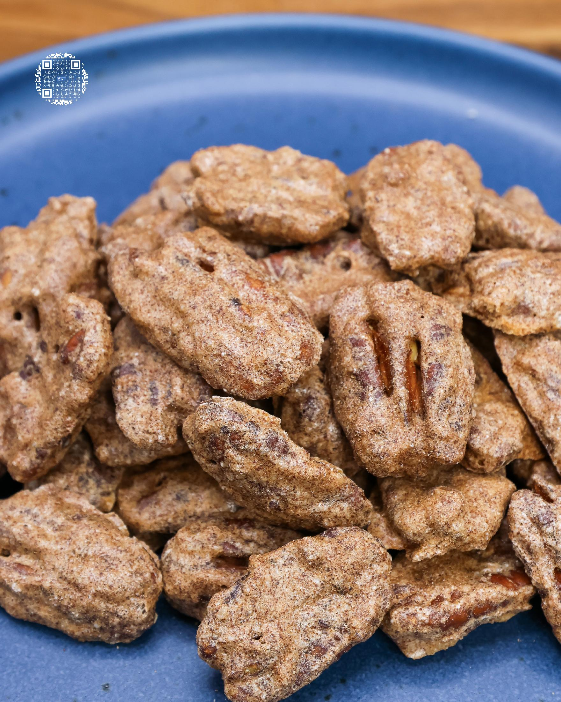

## Additional Recipe Pages

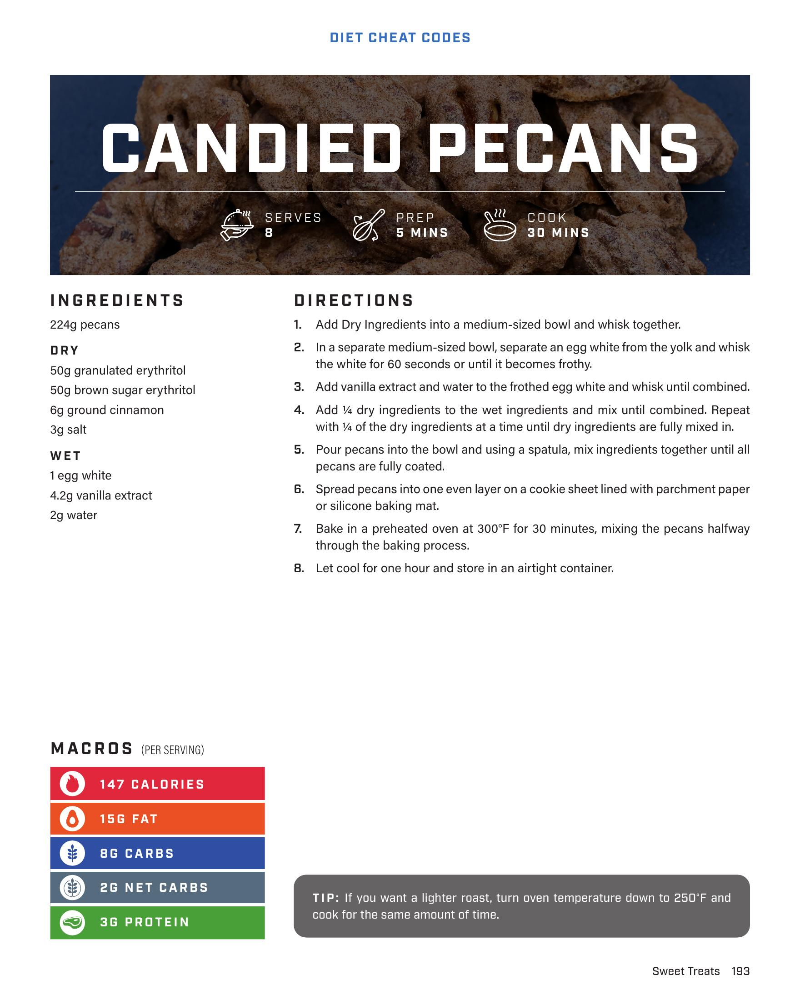

## Source Pages

193, 194

---

# CRISPY RICE SQUARES

**Serves:** 9 | **Prep:** 5 MINS | **Cook:** 10 MINS

## Macros

| Calories | Fat | Carbs | Net Carbs | Protein |
|----------|-----|-------|-----------|---------|
| 150 | 3 | 22 | 19 | 11 |

## Ingredients

- 28g butter
- 50g 2% milk
- 4g vanilla extract
- 1g salt
- 192g Max Mallow*
- 97.2g Gorilla Mind Vanilla Ice Cream protein powder
- 145g crispy rice cereal
- Oil spray

## Directions

1. Add butter, milk, vanilla extract, and salt to a large pot.
2. Set the stovetop to medium-low heat and place the pot onto the stove.
3. Using a wooden spoon, mix the pot as the butter melts.
4. Add marshmallows to the pot. Stir the marshmallows every minute until they are almost melted.
5. Add protein powder, remove pot from heat, and stir until the protein powder is fully mixed in.
6. Pour crispy rice into the pot and mix to combine.
7. Lightly spray an 8x8 inch baking pan with oil, pour crispy rice treats into the pan, and pat down into an even layer. Spray a little bit of oil onto your hands and rub them together to prevent the crispy rice treats from sticking to them.
8. Cut into 9 squares and try one while they are still warm.

## Tips

Microwave one serving for 8-10 seconds for a warm, fresh crispy rice square.

## Additional Recipe Pages

## Source Pages

191, 192

---

# 1 HOUR CALZONE

**Serves:** 1 | **Prep:** 60 MINS | **Cook:** 40 MINS

## Macros

| Calories | Fat | Carbs | Net Carbs | Protein |
|----------|-----|-------|-----------|---------|
| 501 | 16 | 55 | 45 | 44 |

## Ingredients

### DOUGH

- 44g all-purpose flour
- 14g vital wheat gluten
- 10g oat fiber
- 3g instant yeast
- 1g salt

### WET

- 3g unsalted butter
- 62g water

### CALZONE BUILD

- 21g part-skim ricotta cheese
- 21g fat-free mozzarella cheese
- 21g part-skim mozzarella cheese
- 4g garlic, roasted
- Pinch salt
- 42g chicken, cooked
- 2 slices bacon, cooked (80 cal)
- Corn meal

## Directions

1. Put Dry Ingredients into a food processor and process for 30 seconds.
2. Cut butter in half, add one piece to each side of the food processor, and process for 30 seconds to combine.
3. While processing, heat water up to 110°F.
4. Start food processor up again, slowly pour in water over 15-20 seconds, and process for an additional 30 seconds.
5. Take the blade out and squeeze the dough together a few times to make sure any dry bits are incorporated.
6. Lightly spray a high-sided container with oil, place dough into the container, and lightly spray the top of the dough with oil as well. Cover and place somewhere warm for 45 minutes.
7. On a sheet pan lined with parchment paper, arrange one package of bacon into strips, trying not to overlap. Bake in a preheated 425°F oven for 20-25 minutes or until it is cooked to your preference.
8. Remove your bacon and turn oven up to its highest temperature setting.
9. In a medium bowl, add ricotta, both mozzarellas, garlic, and salt. Mix to combine.
10. Lightly spray counter with oil, plop the dough down, and stretch the dough from the middle outward until it is an 8-9” circle.
11. Place cheese mix on one half of the dough, leaving a 1” space between the edge of the calzone and the start of the cheese mix.
12. Place chicken and bacon directly on top of the cheese mix, fold the dough over the fillings, and line up the edges of the dough.
13. Using your fingertips, push down on the edges of the dough to create an initial seal.
14. Starting at one end, fold in a small piece of dough. Then directly next to the first fold repeat and keep going until the entire edge has been completely sealed.
15. Push down the edge of the dough once more, whisk an egg in a glass, brush the outside of the dough with a thin layer of egg wash, and make 3-4 cuts on top of the calzone using a knife.
16. Put corn meal on the end of a pizza peel or tray, put the calzone on the corn meal, and slide into the oven for 12-14 minutes or until golden brown.
17. Cut in half, dip into some SPICY RANCH and let’s eat!

## Tips

For better technique on how I do this, please refer to timestamp 5:03 in the video.

## Additional Recipe Pages

## Source Pages

153, 154

---

# 1 HOUR PIZZA

**Serves:** 2 | **Prep:** 50 MINS | **Cook:** 10 MINS

## Macros

| Calories | Fat | Carbs | Net Carbs | Protein |
|----------|-----|-------|-----------|---------|
| 729 | 24 | 58 | undefined | 68 |

## Ingredients

### DOUGH (makes 2 doughs)

- 120g tipo 00 flour
- 40g vital wheat gluten
- 6g instant yeast
- 2g salt
- 1g garlic powder
- 2g diastatic malt powder
- 6g extra virgin olive oil
- 120g light beer

### PIZZA

- 1 Dough
- 90g FOOLPROOF HOMEMADE MARINARA
- 5g grated parmesan
- 56g fat-free mozzarella cheese
- 70g part-skim mozzarella cheese
- 28g turkey pepperoni

## Directions

1. Add flour, vital wheat gluten, malt powder, garlic powder, salt, and yeast to food processor and process on high for 15 seconds. Add olive oil on top of dry ingredients.
2. Heat beer to 90°F, then turn food processor on high and slowly pour beer into it over a 20 second period. Keep processing for an additional 30 seconds.
3. Flip dough out onto a lightly floured surface and knead for 1 minute. Divide dough into two pieces, shape into balls, and put under a damp towel for 15 minutes.
4. While waiting, shred any cheese needed and/or make a FOOLPROOF HOMEMADE MARINARA.
5. For four 12-inch pieces of parchment paper on the counter and lightly spray with oil.
6. Grab a dough, pat between your hands until it is roughly 5 inches in diameter, put it on the parchment paper, and cover with another piece of parchment oil side down.
7. Using a rolling pin, gently roll back and forth at different angles to keep the shape of a circle.
8. Once pizza is about 12" or to your desired thickness, place in a warm spot in the kitchen to rise for 30 minutes and start preheating oven to 500°F.
9. Take parchment paper off the top of the dough and add Pizza Ingredients in the order listed.
10. Put pizza on a tray or using a pizza peel, put pizza in the oven for 8-10 minutes or to preferred doneness.
11. Slice and EAT.

## Tips

If you only want to make one pizza you can store the extra dough in the fridge for up to a week. In a high-sided container, spray with oil, place the dough ball (not rolled out), cover, and throw it in the fridge. An hour before you are ready to eat, take the dough out of the fridge and then start at step 4.

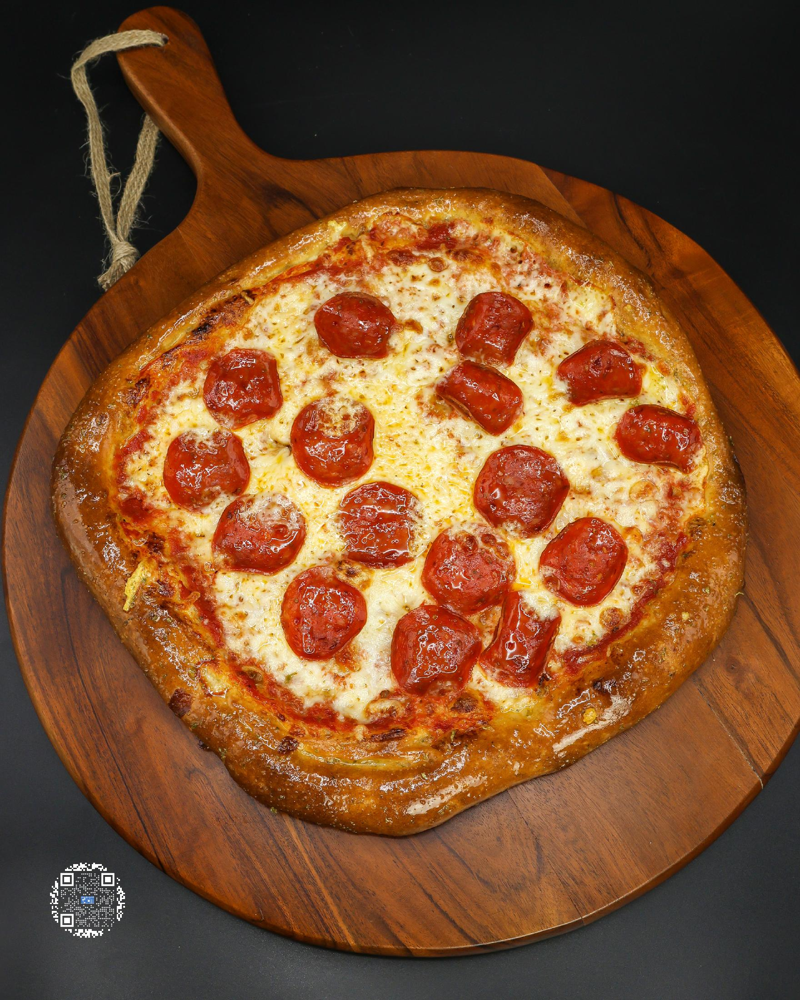

## Additional Recipe Pages

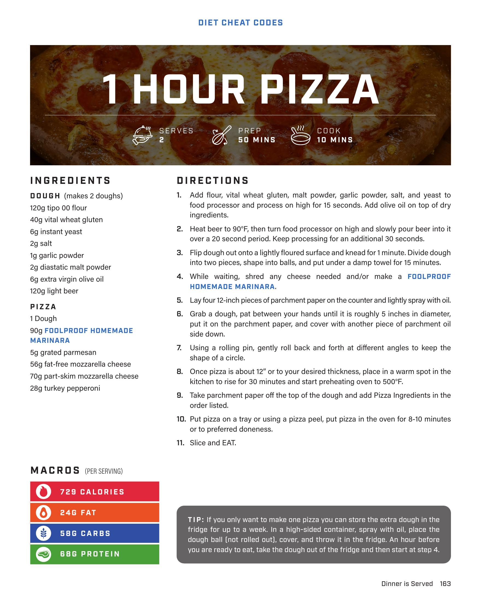

## Source Pages

163, 164

---

# BBQ CHICKEN SHEET PAN PIZZA

**Serves:** 8 | **Prep:** 3 HRS | **Cook:** 20 MINS

## Macros

| Calories | Fat | Carbs | Net Carbs | Protein |
|----------|-----|-------|-----------|---------|
| 506 | 13 | 51 | undefined | 48 |

## Ingredients

### DOUGH

- 420g all-purpose flour
- 105g vital wheat gluten
- 6g salt
- 7g instant yeast

### WET

- 340g warm water

### PIZZA

- 16g olive oil
- Dough
- 280g no sugar added BBQ sauce
- 422g chicken breast, cooked
- 224g fat-free mozzarella cheese, shredded
- 294g part-skim mozzarella cheese, shredded
- 30g red onion, chopped
- Cilantro, chopped

## Directions

1. In a large bowl, combine flour, vital wheat gluten, salt, and yeast. Whisk to evenly distribute.
2. Add water and mix with a spoon until a shaggy dough forms.
3. Using a wet hand, press and fold the dough until fully combined and no dry flour remains.
4. Cover and rest in a warm area for 60-90 minutes. The dough can safely rise longer than 90 minutes. If you need to leave for 2-3 hours, it'll be ready when you return.
5. With a wet hand, pull one side of the dough up as high as possible and fold it over itself. Rotate the bowl 90° and repeat 3-4 times. Flip the dough, form into a ball, cover, and rest 60-90 minutes.
6. Pour olive oil onto a 21x15" sheet pan and spread it across the entire surface.
7. Remove dough from the bowl, let it hang for a few seconds so it naturally stretches into a rectangle, and plop it onto the sheet pan.
8. Using your fingertips, press outward to stretch the dough across the pan. Cover with another sheet pan and rest 15-20 minutes. If the dough keeps snapping back while stretching, cover and rest 15-20 minutes to allow the gluten to relax.
9. Rinse chopped red onion under water and dry with a paper towel.
10. If the dough has snapped back from the corners, lightly stretch it back into place. Top with BBQ sauce, chicken, both cheeses, and red onion.
11. Bake in a preheated 450°F oven for 20-24 minutes, or until cheese is browned to your preference.
12. Slice into 8 pieces, garnish with cilantro, and enjoy.
13. To reheat, pop a slice in a preheated 350°F air fryer for 2-4 minutes.

## Tips

TIP: You can perform steps 1-3 in a food processor to make this recipe even easier. For best results and visual guidance, refer to the recipe video. TIP: Pre-cooked chipotle chicken from Costco works perfectly here.

## Additional Recipe Pages

## Source Pages

165, 166

---

# BEEFY 5-LAYER BURRITOS

**Serves:** 3 | **Prep:** 20 MINS | **Cook:** 20 MINS

## Macros

| Calories | Fat | Carbs | Net Carbs | Protein |
|----------|-----|-------|-----------|---------|
| 303 | 13 | 30 | 24 | 24 |

## Ingredients

- 448g 96% lean ground beef

### SEASONING FOR BEEF

- 3g chili powder
- 1g garlic powder
- 1g onion powder
- 1g paprika
- 3g ground cumin
- 1g crushed red pepper flakes
- 0.5g dried oregano
- 6g salt
- 2.5g black pepper

### BEEFY 5-LAYER (Makes 2)

- 2 La Banderita® Carb Counter taco tortillas
- 2 La Banderita® Carb Counter snack tortillas
- 62g La Preferida® cheddar cheese
- 65g fat-free refried beans
- 100g cooked seasoned beef
- 60g fat-free Greek yogurt
- 14g shredded sharp cheddar cheese

## Directions

1. Add Seasoning Ingredients into small bowl and mix.
2. Place beans, La Preferida® cheddar cheese, sharp cheddar cheese, and Greek yogurt in four separate bowls.
3. Lightly spray a pan with oil, turn burner on medium, and start adding small chunks of ground beef until all beef is in the pan.
4. Once all beef is added, lightly spray the top of the meat with oil, then evenly add seasoning mix over the top. Add 15g of water to the pan.
5. Stir meat every 1-2 minutes until browned.
6. Set cooked meat aside in a container or on a plate and cover.
7. Place the taco tortillas on the counter, add La Preferida® cheddar cheese, and spread evenly across all tortillas.
8. Take the refried beans, microwave for 20 seconds, and spread evenly across the center of the snack tortillas, leaving about an inch of bare tortilla on each side.
9. Directly on top of the beans add seasoned beef, sour cream, and sharp cheddar cheese.
10. Take one side of the taco tortilla and fold it over.
11. Repeat with the other side and take 1-2 grams of the refried beans, put it on the edge of the tortilla, and stick it to the other side of the tortilla. Repeat with second taco tortilla.
12. Lay the folded snack tortillas on the middle end of the taco tortillas.
13. Take the end of the burrito tortilla and lay it on top of the taco tortilla. Then fold one side of the burrito and overlap it with the other side.
14. You now have 2 perfect beefy 5-layer burritos.
15. To get the authentic taste and texture of the drive-thru, roll each burrito in a piece of parchment paper, and throw them in the microwave for about 30 seconds.

## Tips

If you can't get the snack size tortilla, you can use a taco tortilla and cut off about an inch around it to make it the same size.

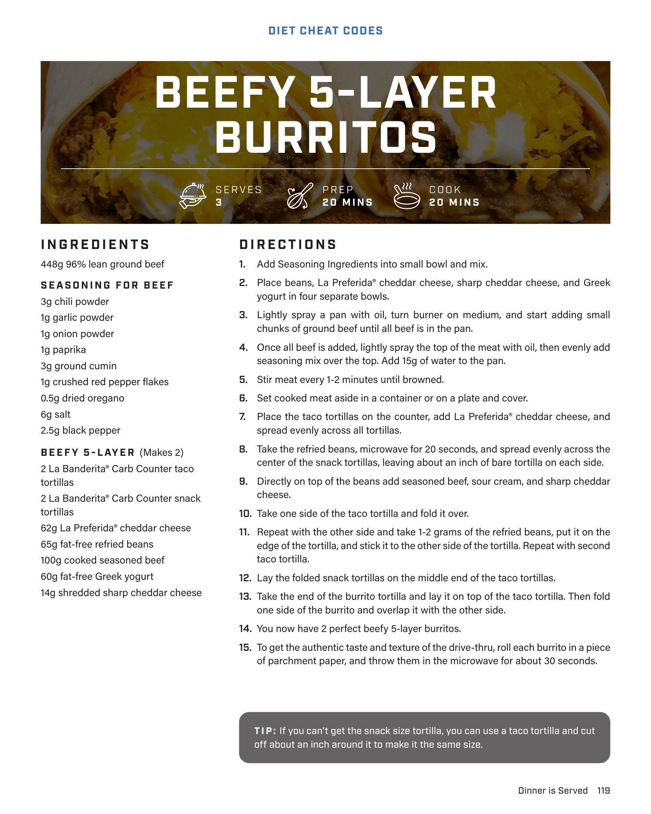

## Additional Recipe Pages

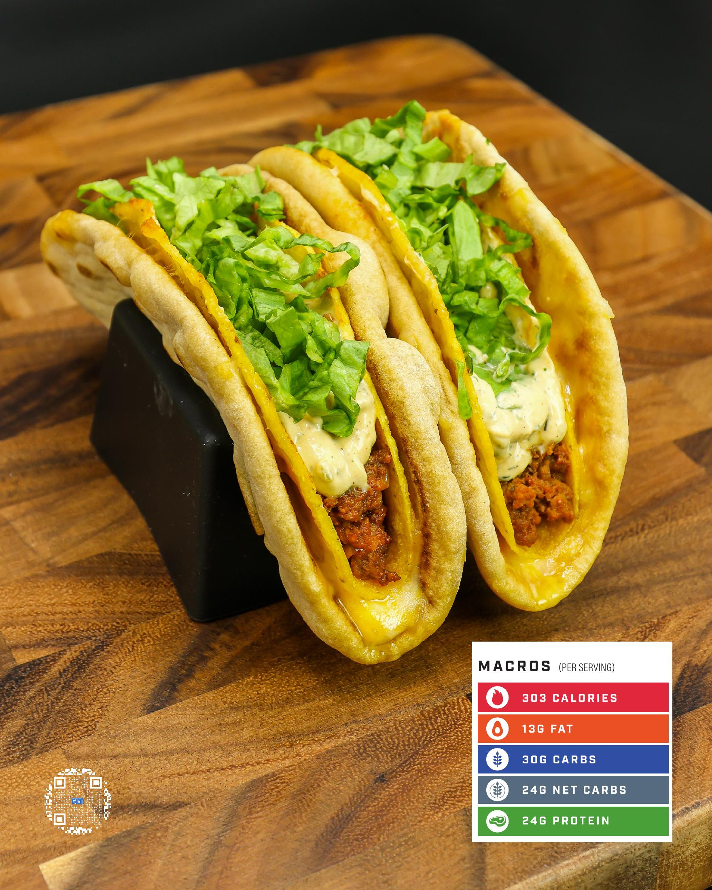

## Source Pages

120, 121

---

# BUFFALO MAC AND CHEESE

**Serves:** 2 | **Prep:** 5 MINS | **Cook:** 10 MINS

## Macros

| Calories | Fat | Carbs | Net Carbs | Protein |
|----------|-----|-------|-----------|---------|
| 722 | 12 | 107 | N/A | 49 |

## Ingredients

### PASTA MIXTURE

- 410g chicken broth
- 240g fat-free milk
- 224g medium shells pasta

### MIX-INS/TOPPINGS

- 56g fat-free cheddar cheese, shredded
- 126g sharp cheddar Velveeta* cheese
- 50g buffalo sauce
- 84g chicken strips (150 cal), frozen
- 14g blue cheese

## Directions

1. Add Pasta Mixture to a pot, put on the stovetop, stir to combine, and turn on high heat.
2. Set a 10-minute timer for the pasta.
3. Add chicken strips to a preheated air fryer and cook according to the instructions on the package.
4. Stir pasta more frequently as it comes to a boil to avoid burning the milk or having the noodles stick to the bottom of the pot.
5. After 10 minutes, take the pasta pot off the heat and immediately add fat-free cheese and Velveeta*. Stir for 1-2 minutes or until melted.
6. Add buffalo sauce, mix for an additional minute, and let pasta sit for 2 minutes to thicken up.
7. Give pasta a stir, pour into a bowl, top with chicken and blue cheese, and it is time to eat.

## Additional Recipe Pages

## Source Pages

109, 110, 111

---

# CHEESE AND PEPPERONI SHEET PAN PIZZA

**Serves:** 32 | **Prep:** 2 HRS | **Cook:** 18 MINS

## Macros

| Calories | Fat | Carbs | Net Carbs | Protein |
|----------|-----|-------|-----------|---------|
| 116 | 4 | 12 | N/A | 8 |

## Ingredients

### DRY

- 420g all-purpose flour
- 100g vital wheat gluten
- 6g salt
- 5g instant yeast

### WET

- 15g extra virgin olive oil
- 375g water

### DOUGH

- 250g FOOLPROOF HOMEMADE MARINARA

### PIZZA BUILD

- 476g part-skim mozzarella cheese, shredded
- 71g turkey pepperoni
- Cilantro, chopped

## Directions

1. Throw all Dry Ingredients in a food processor and process on high for 30 seconds.
2. Add olive oil to the food processor, put the top on, turn the processor on high, and slowly add water over 15-20 seconds. Continue processing for an additional 30 seconds.
3. Lightly spray a large bowl with oil, plop the dough on the counter, form into a ball, put it in the bowl, lightly spray the top of the dough with oil, and cover for 90 minutes or until doubled in size.
4. Make FOOLPROOF HOMEMADE MARINARA if not already made.
5. Pour olive oil onto a 21x15" sheet pan and spread around the entire sheet pan.
6. Take dough out of the bowl, let it hang for a couple seconds so it naturally starts stretching into a rectangular shape, and plop it onto the sheet pan.
7. Using the tips of your fingers, start stretching the dough out across the pan and cover with another sheet pan for 30 minutes.
8. If the corners snap back a little bit, lightly stretch the dough into the corners of the pan, then top with marinara sauce, part-skim cheese, and cover half of the pizza with pepperoni.
9. Bake in a preheated 400°F oven for 16-20 minutes or until cheese has a nice browning.
10. Pull it out of the oven, slice, and enjoy.

## Tips

It will not hurt the dough if it rises longer than 90 minutes as it still needs an additional rise anyway. If you need to go somewhere for 2-3 hours, your dough will be waiting for you when you get back. It the dough keeps snapping back when you are stretching it in the sheet pan, cover it and let it rest for 15-20 minutes. This will allow the gluten to relax and help the dough stretch.

## Additional Recipe Pages

## Source Pages

167, 168

---

# CHEESY BREAD

**Serves:** 1 | **Prep:** 1.25 HRS | **Cook:** 15 MINS

## Macros

| Calories | Fat | Carbs | Net Carbs | Protein |
|----------|-----|-------|-----------|---------|
| 0 | 0 | 0 | undefined | 0 |

## Ingredients

### DRY

- 115g all-purpose flour
- 30g vital wheat gluten
- 2g salt
- 3g instant yeast
- 5g granulated erythritol

### WET

- 5g avocado oil
- 1g imitation butter
- 105g water

### COATING

- 30g corn meal

### INSIDE CHEESE

- 42g fat-free mozzarella cheese
- 42g part-skim mozzarella cheese

### OUTSIDE CHEESE

- 14g fat-free cheddar cheese
- 14g fat-free mozzarella cheese
- 14g mild cheddar cheese
- 14g part-skim mozzarella cheese

### TOPPINGS

- 5-6g garlic oil
- Pinch dried parsley

### BATCH GARLIC OIL

- 100g avocado oil (or oil of choice)
- 3g imitation butter
- 4g garlic powder
- 2g salt
- 5g grated parmesan cheese

## Directions

1. Add Dry Ingredients to a food processor and process on high for 15 seconds.
2. Add avocado oil and imitation butter to food processor. Heat water up to 110°F.
3. While processing on high, pour water into the food processor over a 15 second period and continue to process for an additional 30 seconds.
4. Dump dough onto the counter, KNEAD for 1-2 minutes, form into a ball, put it in a lightly oiled bowl, cover, and let rise in a warm place for one hour or until doubled in size.
5. While dough is rising, shred the cheese, make the garlic oil, and/or make a FOOLPROOF HOMEMADE MARINARA for dipping sauce.
6. Pour cornmeal on the top of the dough, flip dough out onto counter, and sprinkle additional cornmeal on the top.
7. Using the tips of your fingers, press and stretch dough until it is shaped into a roughly 9x8" rectangle.
8. Mix Inside Cheese together, then sprinkle the inside cheese mixture on half of the dough. Fold the other half of the dough over the cheese, and seal edge of dough.
9. Rip off 6 inches of parchment paper, place dough on top of it, and slice the folded dough into 8 pieces.
10. Mix the fat-free cheeses of the Outside Cheeses together and sprinkle over the top of the cheesy bread. Mix the rest of the cheeses together and add over the top of the fat-free cheeses.
11. Put the finished cheesy bread into a preheated 450°F oven for 12-16 minutes.
12. Add Toppings and it's time to eat.

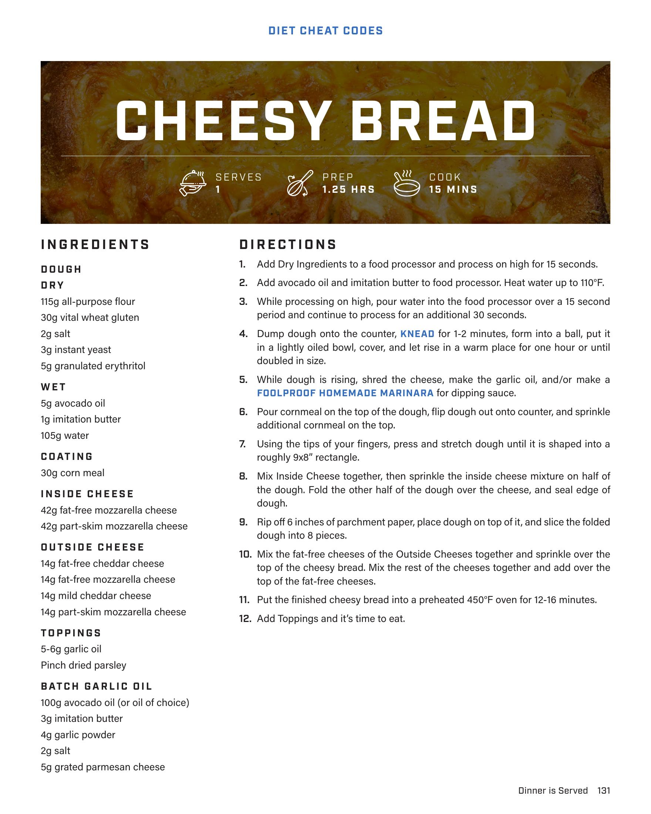

## Source Pages

132

---

# CHEESY GORDITA CRUNCH

**Serves:** 13 | **Prep:** 30 MINS | **Cook:** 30 MINS

## Macros

| Calories | Fat | Carbs | Net Carbs | Protein |
|----------|-----|-------|-----------|---------|
| 395 | 12 | 52 | 30 | 40 |

## Ingredients

### TACO FILLING

- 5g avocado oil (ground beef)
- 448g 96% lean ground beef
- 6g MSG
- 6g avocado oil
- 130g onion, diced
- 5g garlic, minced
- 3g chili powder
- 3g cumin
- 3g coriander
- 3g smoked paprika
- 1g black pepper
- 125g tomato sauce
- 100g beef broth
- 3g salt

### GORDITA CRUNCH BUILD

- 1 PROTEIN PITA
- 21g reduced-fat colby jack cheese, shredded
- 1 taco shell
- 48g Taco Filling
- 13g SPICY RANCH
- 15g lettuce, finely chopped

## Directions

1. Wash and cut the veggies.
2. Add avocado oil to a preheated pan on medium heat and add ground beef to the pan by crumbling in bite-sized chunks.
3. Add MSG evenly across the beef, break down beef even more using a wooden spatula, and stir constantly until meat is cooked.
4. Set meat aside on a plate or into a container, wipe down pan, place back on the stovetop, and add avocado oil.
5. Into a small bowl, add chili powder, cumin, coriander, smoked paprika, and black pepper and mix.
6. Add onions to pan, mix around so oil is spread evenly throughout, and cook 2-3 minutes or until onions become translucent.
7. Make room in the middle of the pan, add garlic, and stir.
8. Make room in the middle of the pan again, add the seasoning mix, let it sit for 20-30 seconds, then add cooked meat into the pan. Mix well.
9. Once combined, add beef broth and tomato sauce, mix to combine, and turn burner to low to let the mixture simmer for about 15 minutes.
10. Spread cheese evenly across the pita, place taco shell on pita, and microwave for 20 seconds.
11. Using an oven mitt, hold the pita and taco shell together for 20 seconds or until cheese sticks and glues the pita to the taco shell.
12. Try Taco Filling and see if it needs any additional salt.
13. Add filling to the taco shell followed by spicy ranch and lettuce and it's time to eat.

## Additional Recipe Pages

## Source Pages

122, 123

---

# CHICKEN ALFREDO PIZZA

**Serves:** 1 | **Prep:** 1.5 HRS | **Cook:** 1.25 HRS

## Macros

| Calories | Fat | Carbs | Net Carbs | Protein |
|----------|-----|-------|-----------|---------|
| 903 | 18 | 101 | N/A | 88 |

## Ingredients

- 3 chicken breasts
- 1 head of garlic, roasted

### DOUGH

- 10g King Arthur® bread flour
- 20g vital wheat gluten
- 1.5g yeast
- 1g salt
- 91g water

### PIZZA BUILD

- 14g corn meal
- Dough
- 80g roasted garlic alfredo sauce (45 cal)
- 6g roasted garlic
- 105g chicken, cooked
- 7g Parmigiano Reggiano cheese
- 40g fat-free mozzarella cheese
- 40g part-skim mozzarella cheese

## Directions

1. BRINE your chicken breasts.
2. While the chicken is brining, ROAST your garlic.
3. While the garlic is roasting, add the bread flour, vital wheat gluten, yeast, and salt into a food processor and process on high for 30 seconds.
4. While processor is running, slowly add water over 15-20 seconds. Continue to process for an additional 30 seconds.
5. Lightly spray a medium-sized bowl with oil, plop the dough on the counter, form into a ball, and add to the bowl. Lightly spray the top of the dough with oil and cover for 90 minutes or until doubled in size.
6. Pat the chicken dry with a paper towel and add chicken to a preheated 400°F oven for 20-25 minutes or until internal temperature of the chicken reaches 155°F. Cut the chicken into bite sized pieces.
7. Cover the work surface with corn meal, add the dough on top of the corn meal bottom side down, and cover the top of the dough with corn meal as well.
8. Stretch the dough until it is about 11" in diameter, leaving the crust thicker than the rest of the pizza. Lightly dust a pizza peel with corn meal.
9. Toss the dough back and forth between your hands to remove any excess corn meal and place the dough onto the pizza peel.
10. Top the dough with alfredo sauce, garlic, chicken, Parmigiano Reggiano, and fat-free and part-skim mozzarella.
11. Bake in a preheated oven at the highest temperature possible (mine oven goes to 550°F) for 5-8 minutes or until cheese starts browning
12. Add to a wire rack to cool, slice, and it's time to eat.

## Tips

Grill the chicken breasts instead for greater flavor. If you would like slices that don't bend or break, once the pizza has cooled off, I would add the pizza back in the oven for 60-90 seconds. The bottom will become crispy again while holding all the toppings as you eat it.

## Additional Recipe Pages

## Source Pages

185, 186

---

# CHICKEN GYRO SALAD

**Serves:** 1 | **Prep:** 90 MINS | **Cook:** 20 MINS

## Macros

| Calories | Fat | Carbs | Net Carbs | Protein |
|----------|-----|-------|-----------|---------|
| 481 | 46 | 30 | undefined | 83 |

## Ingredients

### CHICKEN MARINADE

- 4 chicken breasts
- 6g fresh parsley, chopped
- 30g white vinegar
- 10g garlic, minced
- 60g lemon juice
- 120g fat-free Greek yogurt
- 12g extra virgin olive oil
- 8g smoked paprika
- 12g salt
- 6g MSG
- 6g black pepper

### CHICKEN GYRO SALAD BUILD

- 300g romaine lettuce, chopped
- 140g tomato, sliced
- 150g cucumber, sliced
- 168g chicken, cooked
- 170g TZATZIKI SAUCE
- 40g PICKLED ONION
- 42g fat-free feta cheese

## Directions

1. Using a cutting board, trim excess fat off the chicken breasts.
2. Add the Chicken Marinade ingredients to a large bowl, whisk until combined, add chicken, and make sure every piece of chicken is thoroughly coated.
3. Cover bowl with plastic wrap and refrigerate for one hour, up to 24 hours for maximum flavor.
4. Prep TZATZIKI SAUCE. If you plan to eat this recipe through the week, double the recipe to make enough tzatziki for 4 salads.
5. Prep PICKLED ONION.
6. When ready to eat, arrange marinated chicken on a sheet pan lined with parchment paper and a wire rack and bake in a preheated 400°F oven for 20-25 minutes or until internal temperature of the chicken reaches 155°F.
7. While the chicken is cooking, prep the vegetables and add them to a large bowl.
8. Chop chicken into bite-sized chunks and add over top of the vegetables along with the tzatziki sauce, feta cheese, and an optional garnish of chopped parsley. Enjoy!

## Tips

Although there is a lot of prep work for this recipe, if you make it once, you should have enough prepared ingredients for the entire week. The only thing you will have to prep each day is the lettuce, cucumber, and tomato – and even those can be prepared for multiple days at a time if you prefer.

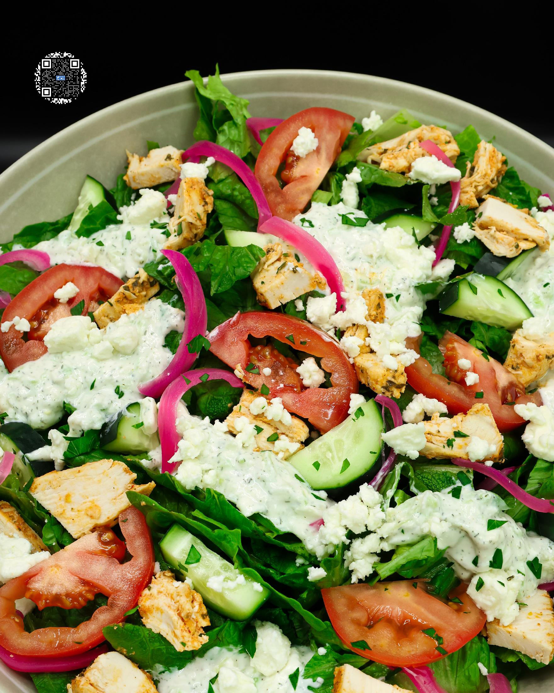

## Additional Recipe Pages

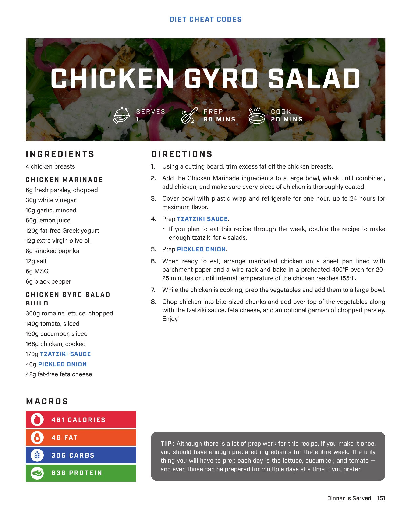

## Source Pages

151, 152

---

# CHICKEN GYRO

**Serves:** 5 | **Prep:** 1.5 HRS | **Cook:** 30 MINS

## Macros

| Calories | Fat | Carbs | Net Carbs | Protein |
|----------|-----|-------|-----------|---------|
| 264 | 7 | 23 | 17 | 33 |

## Ingredients

### CHICKEN MARINADE

- 4 boneless skinless chicken thighs
- 3g fresh parsley, chopped
- 15g white vinegar
- 5g garlic, minced
- 30g lemon juice
- 60g fat-free Greek yogurt
- 6g extra virgin olive oil
- 4g smoked paprika
- 6g salt
- 3g MSG
- 3g black pepper

### CHICKEN GYRO BUILD

- 1 PROTEIN PITA
- 63g cooked chicken
- 60g TZATZIKI SAUCE
- 7g fat-free feta
- 2 slices tomato
- 6 slices onion
- Parsley, chopped

## Directions

1. Using a cutting board, trim excess fat off the chicken.
2. Add Chicken Marinade ingredients to a medium bowl, whisk until combined, add chicken, and make sure every piece is thoroughly coated.
3. Cover bowl with plastic wrap and refrigerate for one hour – up to 24 hours for maximum flavor.
4. When ready to eat, arrange chicken on a sheet pan lined with parchment paper and a wire rack and bake in a preheated 400°F oven for 20-30 minutes or until internal temperature of the chicken reaches 155°F.
5. Chop tomatoes and onion. Once chicken is finished, slice into bite sized pieces.
6. Microwave a pita for 10 seconds and layer it with chicken, tzatziki sauce, feta, tomato, onion, and parsley.
7. Repeat step 6 for any additional servings and it’s time to eat.

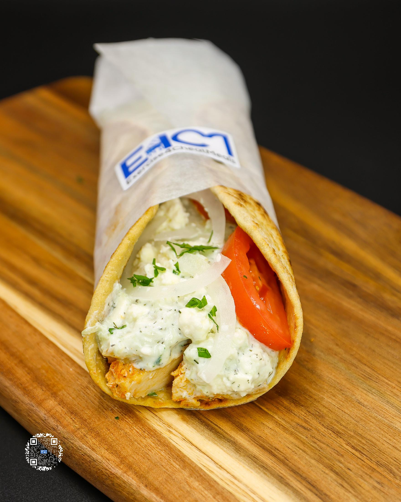

## Additional Recipe Pages

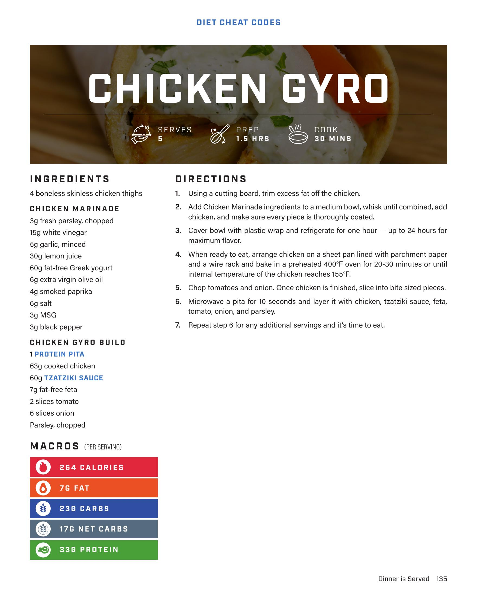

## Source Pages

135, 136

---

# CREAMY CAJUN CHICKEN

**Serves:** 2 | **Prep:** 10 MINS | **Cook:** 15 MINS

## Macros

| Calories | Fat | Carbs | Net Carbs | Protein |
|----------|-----|-------|-----------|---------|
| 639 | 17 | 60 | undefined | 55 |

## Ingredients

### CHICKEN

- 448g chicken thighs
- 5g salt
- 1g black pepper
- 3g avocado oil

### CAJUN SAUCE

- 80g onion, grated
- 8g garlic, minced
- 2g smoked paprika
- 3g Cajun seasoning
- 50g white wine (or unsalted chicken broth)
- 40g water
- 80g 2% cottage cheese
- 40g low-fat cream cheese
- 45g roasted red peppers (jarred in water)
- 4g green onion, sliced

### RICE

- 2 pre-cooked rice cups (210 cal each)

## Directions

1. Butterfly any thicker parts of the chicken thighs so they cook more quickly and evenly.
2. Season both sides of the chicken with salt and pepper.
3. Add oil to a preheated pan on medium-high heat and sear thighs top-side down for 7-8 minutes.
4. While cooking, grate onion, mince garlic, and blend water, cottage cheese, cream cheese, and red peppers until smooth.
5. Flip chicken, add 15g water, cover with a lid, and cook for 2 minutes.
6. Check for 170°F internal temp, then transfer to a cutting board.
7. Add onion to the pan, stir for 1-2 minutes, then add garlic, paprika, and Cajun seasoning. Mix everything together.
8. Once garlic and seasonings become fragrant, deglaze the pan with wine (or broth) and simmer for 60-90 seconds.
9. While simmering, microwave precooked rice according to package instructions. If making dinner for two, microwave 2 cups.
10. Remove the pan from heat and mix in the sauce.
11. Slice chicken into bite-sized slices.
12. Plate one cup of rice, then top with half the sliced chicken and half the sauce.
13. Finish with green onion and get ready for pure pleasure after you take that first bite.

## Additional Recipe Pages

## Source Pages

137, 138

---

# DEEP DISH PIZZA

**Serves:** 8 | **Prep:** 2 HRS | **Cook:** 1 HR

## Macros

| Calories | Fat | Carbs | Net Carbs | Protein |
|----------|-----|-------|-----------|---------|
| 387 | 18 | 25 | N/A | 31 |

## Ingredients

### DOUGH

- 190g all-purpose flour
- 40g vital wheat gluten
- 20g corn meal
- 6g sugar
- 4g salt
- 3g instant yeast

### WET

- 28g unsalted butter
- 160g water

### SAUCE

- 100g white onion, grated
- 15g garlic, minced
- 10g extra virgin olive oil
- 28oz can Cento* San Marzano whole peeled tomatoes
- 66g tomato paste
- 1g oregano
- 4g salt
- 10g granulated erythritol

### PIZZA BUILD

- 7g extra virgin olive oil
- 1 Dough
- 224g whole milk low moisture mozzarella cheese, shredded
- 224g fat-free mozzarella cheese, shredded
- 126g turkey pepperoni
- Sauce
- Optional: grated parmesan cheese

## Directions

1. Place Dry Ingredients into a food processor, process for 30 seconds, add butter to processor, and blend for an additional 20 seconds or until mixture becomes pebbly-looking.
2. Turn the processor on high while slowly adding the water over a 30 second period and let dough mixture process for an additional 20-30 seconds.
3. Flip the dough onto work surface, shape it into a ball, and place it in a lightly oiled medium-sized bowl. Spray the top of the dough with oil and cover for 60 minutes.
4. Grate 100g of onion on a box grater and drain any extra liquid.
5. Add olive oil, onion, and garlic to a preheated pot on medium heat, stir to combine, and let them cook for a few minutes while stirring occasionally.
6. Once the ingredients start to take on some color, add tomato paste and incorporate it into the mixture.
7. Using your hands, crush one tomato at a time in-between your fingers to your preferred chunkiness. If any tomatoes are too chunky, simply grab them out of the pan and crush them again.
8. Add the rest of the sauce ingredients to the pot and stir to combine. Once the sauce comes to a simmer, turn stovetop to low, cover with a lid that lets steam escape, and let it reduce for 20-30 minutes.
9. After the dough has risen for 60 minutes, refrigerate it for an additional 30 minutes.
10. Lightly dust work surface with flour, plop the dough down, lightly dust the dough and rolling pin with flour, and roll the dough out into a roughly 13" circle using a rolling pin.
11. Spread olive oil into a 12" cast iron pan, add the rolled-out dough, and spread it evenly across the bottom and sides of the pan making sure the crust comes all the way up the sides.
12. Add fat-free cheese, then a layer of whole milk cheese, and top with pepperoni. Add sauce to the top layer of the pizza, making sure everything is evenly spread out.
13. Bake pizza in a preheated 400°F oven for 30-40 minutes. Once removed from the oven, top with parmesan, slice it, and it is time to eat.

## Tips

I would wait 5-10 minutes before slicing and another 5 minutes before serving to avoid burning your mouth. You have been warned.

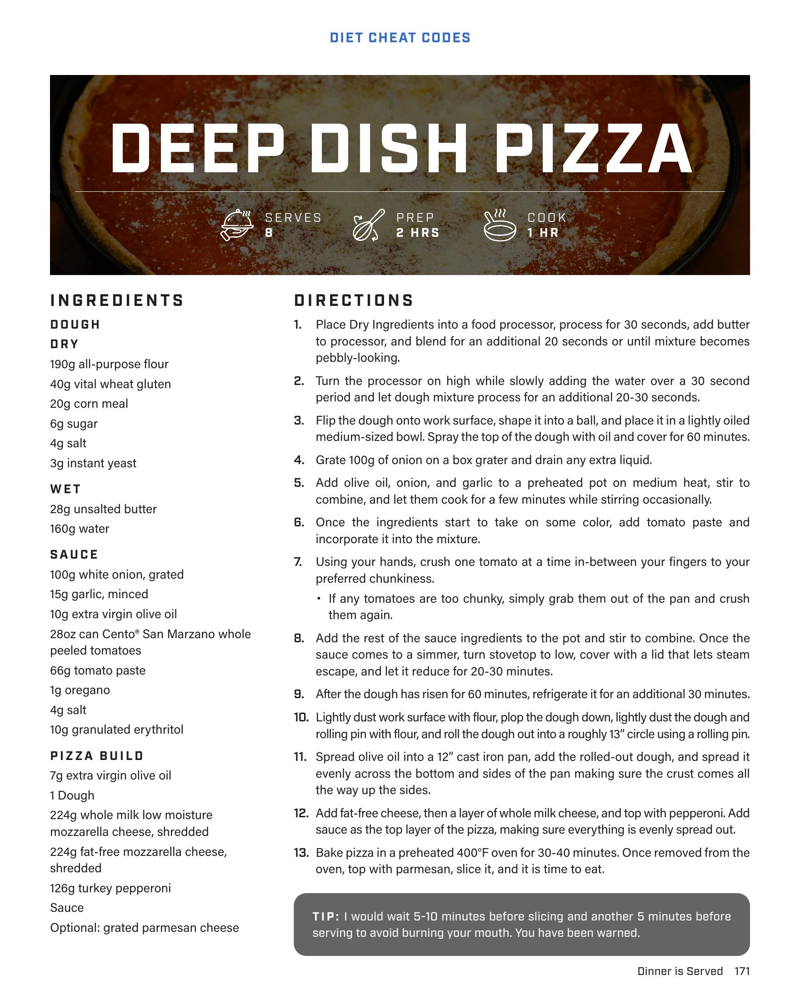

## Additional Recipe Pages

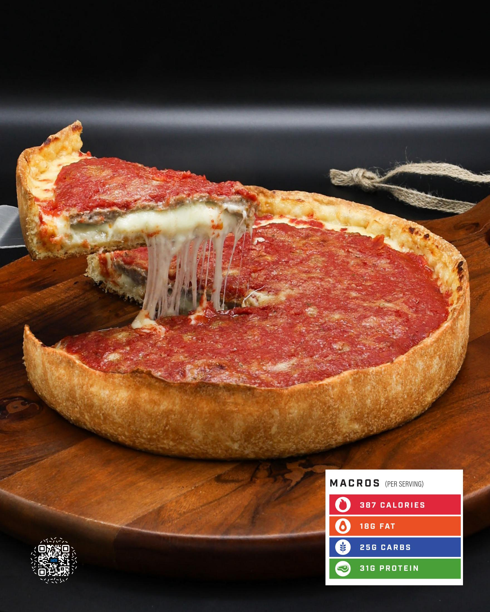

## Source Pages

172, 173

---

# DETROIT PIZZA

**Serves:** 2 | **Prep:** 24 HRS | **Cook:** 30 MINS

## Macros

| Calories | Fat | Carbs | Net Carbs | Protein |
|----------|-----|-------|-----------|---------|
| 612 | 19 | 57 | N/A | 53 |

## Ingredients

### DOUGH (MAKES 2)

- 240g all-purpose flour
- 80g vital wheat gluten
- 5g salt
- 3g instant yeast
- 225g water

### SAUCE

- 794g crushed tomatoes
- 10g olive oil
- 8g garlic, minced
- 1g dried oregano
- 5g dried basil
- 1g garlic powder
- 4g salt
- .5g black pepper

### PIZZA BUILD

- 1.5g Crisco®
- 1 dough
- 42g turkey pepperoni
- 84g fat-free mozzarella cheese, shredded
- 30g brick cheese, shredded
- 30g sauce

## Directions

1. Add flour, vital wheat gluten, salt, and yeast to a large bowl. Whisk to combine.
2. Add water and mix the ingredients using a spoon until a shaggy dough forms.
3. Go in with a wet hand, press the dough down, and fold it onto itself. Repeat until all dry ingredients are fully hydrated. Cover for 20 minutes.
4. Using a wet hand, perform a stretch and fold by pulling one side of the dough as high as possible then folding it over itself. Turn the bowl 90 degrees and repeat 3-4 more times until all dough has been stretched.
5. Flip the dough over and form into a ball by sliding your hand underneath the dough and pulling it in a circular motion towards the side of the bowl.
6. Cover the dough for 20 minutes, repeat steps 4 and 5, and divide the dough into 2 pieces. Each piece should weigh roughly 275g.
7. Form each piece into individual balls by flattening the dough with your fingers, folding each side of the dough into the middle, flipping it over, and rolling it in a circular motion until a ball is formed.
8. Grab 2 high-sided containers, lightly spray them with oil, and add the dough balls. Cover with a lid and refrigerate for a minimum of 24 hours. (96 hours creates peak flavor)
9. Add olive oil and garlic to a preheated pot on medium heat and mix. Sauté the garlic for 30 seconds, add oregano and basil, and stir to combine.
10. After 10-15 seconds, immediately add all other sauce ingredients and mix.
11. Bring sauce to a simmer, turn the heat down to low, and let it reduce for 15 minutes. Add to a container and refrigerate.
12. Grab an 8x10" hard-anodized pan and spread Crisco® around the bottom and sides of the pan. Add dough to the pan and cover.
13. After 1-2 hours, spread the dough out edge to edge and cover for 2-4 hours
14. Parbake dough in a preheated 500°F oven for 6-8 minutes and get all other toppings ready.
15. Remove pan from oven, add toppings, and bake for another 8-12 minutes.
16. Immediately place the pizza on a wire rack so the bottom stays crispy.
17. Divide into 4 slices and eat.

## Additional Recipe Pages

## Source Pages

177, 178

---

# ELOTE SALAD

**Serves:** 1 | **Prep:** 90 MINS | **Cook:** 30 MINS

## Macros

| Calories | Fat | Carbs | Net Carbs | Protein |
|----------|-----|-------|-----------|---------|
| 0 |  |  | N/A |  |

## Ingredients

- 3 chicken breasts
- Smoked paprika, to taste
- Chili powder, to taste
- 200g yellow corn, frozen
- 5g unsalted butter

### DRESSING

- 30g light mayonnaise
- 60g fat-free Greek yogurt
- 15g lime juice
- 20g water
- 10g Valentina® hot sauce
- 6g cilantro, chopped
- 2g garlic, minced
- 2g smoked paprika
- 1g salt
- Pinch black pepper

### ELOTE SALAD BUILD

- 200g romaine lettuce, chopped
- 126g chicken, cooked
- Corn dressing
- 8g green onion, chopped
- 14g part-skim cotija cheese

## Directions

1. PREP and BRINE chicken breasts.
2. Pat the chicken dry with a paper towel, top the chicken with smoked paprika and chili powder, and add chicken to a preheated 400°F oven for 20-25 minutes or until internal temperature of chicken reaches 155°F.
3. While chicken is cooking, add butter and corn to a preheated cast iron pan on high heat.
4. Mix corn and butter to combine, add a pinch of salt over top, and cook for 60-90 seconds to char the corn.
5. Toss the corn, cook for an additional 60-90 seconds, then add to a medium bowl. The corn should literally be popping like popcorn as it finishes cooking.
6. In a separate medium bowl, add Dressing ingredients and stir to combine.
7. Add the corn to the dressing and stir to combine. Prep the vegetables and chop the cooked chicken into bite-sized pieces.
8. To a large bowl, add lettuce, chicken, Corn Dressing, cotija, and green onion. It's time to eat.

## Source Pages

150

---

# GARLIC PARMESAN BONELESS WINGS

**Serves:** 3 | **Prep:** 1.75 HRS | **Cook:** 20 MINS

## Macros

| Calories | Fat | Carbs | Net Carbs | Protein |
|----------|-----|-------|-----------|---------|
| 418 | 11 | 25 | N/A | 56 |

## Ingredients

- 672g chicken breast

### DREDGING STATIONS

- 70g all-purpose flour
- 20g corn starch
- 1g chili powder
- 2g paprika
- 2g cumin
- 3g onion powder
- 3g garlic powder
- 3g salt
- 2g black pepper

### WET STATION

- 15g fat-free milk
- 1 egg
- 1 egg white
- Oil spray to coat

## Directions

1. PREP AND BRINE chicken breast, then cut into boneless wing-sized chunks.
2. While chicken is brining, make GARLIC PARMESAN SAUCE.
3. Add Dredging Ingredients to your wet and dry station containers and mix thoroughly.
4. Add a few chunks of meat at a time into flour mixture using one hand, which I call your "dry hand".
5. Using your other hand, or "wet hand," completely cover the coated chicken in wet mixture and let any excess liquid drip off.
6. Finish chicken by adding it back into the flour mixture and push any of the flour mixture into the cracks and crevices of the chicken to make sure it is completely coated. Add to a wire rack.
7. Lightly spray chicken with oil, then add to a preheated 400°F air fryer oil side down. Lightly spray the other side with oil as well.
8. Cook for 5-6 minutes, flipping halfway through. If you see any white spots after flipping, quickly spray with oil and continue cooking.
9. In a medium-sized bowl, add 220g of cooked chicken and 30g of GARLIC PARMESAN SAUCE. Using a brush, coat the pieces of chicken evenly with sauce.
10. Put any additional servings WITHOUT sauce into meal prep containers.
11. When hunger strikes, reheat in air fryer for 3-4 minutes at 350°F, add sauce, and they will be good as new.

## Tips

You can reduce prep time by nearly 30 minutes by buying a "Better Breader". This device can essentially bread all of the pieces at once without having to go one by one. This is available in my Amazon store if you want to check it out. When cooking, try and make sure the pieces of chicken aren't touching each other. If you need to do it in batches, that's okay.

## Additional Recipe Pages

## Source Pages

129, 130, 131

---

# ITALIAN BEEF PIZZA

**Serves:** 4 | **Prep:** 2 HRS | **Cook:** 10 MINS

## Macros

| Calories | Fat | Carbs | Net Carbs | Protein |
|----------|-----|-------|-----------|---------|
| 479 | 20 | 32 | undefined | 43 |

## Ingredients

### DOUGH

- 130g 00 flour
- 30g vital wheat gluten
- 1g instant yeast
- 2g salt
- 10g butter, cubed
- 95g water

### PIZZA SAUCE

- 1 can Cento® crushed tomatoes
- 50g tomato paste
- 12g olive oil
- 10g granulated erythritol
- 5g salt
- Pinch dried oregano

### AU JUS

- 1g allspice
- 2g celery seed
- 2g coriander
- 1g crushed red pepper
- 2g cumin
- 2g fennel seed
- 5g MSG
- 2g mustard seed
- 2g onion powder
- 2g oregano
- 5g paprika
- 2g black peppercorns
- 13g garlic cloves
- 1 bay leaf
- 907g beef broth
- 24g beef bouillon

### PIZZA BUILD

- 130g pizza sauce
- 224g italian beef, thinly sliced
- 120g giardiniera
- 8g pecorino romano cheese, grated
- 8g parmigiano reggiano cheese, grated
- 112g fat-free mozzarella cheese, shredded
- 112g part-skim mozzarella cheese, thinly sliced
- Corn meal

## Directions

1. Add flour, vital wheat gluten, yeast, and salt into a food processor and mix on high for 1 minute.
2. While mixing, add butter one cube at a time and mix for an additional 15 seconds.
3. While mixing, add water over a 20-30 second period and continue blending for an additional 30 seconds.
4. Lightly spray a medium-sized bowl with oil, plop the dough on the counter, form into a ball, and add to the bowl. Cover for 1.5-2 hours.
5. Add all sauce ingredients directly into the crushed tomato can and mix. Add to a container and refrigerate.
6. Add all spices to a small bowl besides the garlic cloves and bay leaf. Add spices to a preheated saucepan on medium heat and mix together. Let dry roast for 30-60 seconds.
7. Add bay leaf, garlic cloves, and beef broth to the saucepan and bring to a simmer.
8. Add beef bouillon and stir. Turn the pot to low and allow it to simmer for 30 minutes.
9. Place a strainer over a medium-sized bowl, pour the au jus through the strainer, and wipe the saucepan with a towel.
10. Discard spices, pour the au jus back into the saucepan, and place back onto the stovetop.
11. Add roast beef to the saucepan and heat the beef juice to 140°F. Remove pan from heat and allow meat to marinade.
12. Place a strainer on top of a plate, add giardiniera and allow to drain for at least 20 minutes.
13. Grab the same bowl used to strain the spices and strain the beef. Allow beef to drain for 20 minutes.
14. Using a paper towel, dab the giardiniera to remove as much excess oil as possible and weigh out 120 grams.
15. Using your hands, squeeze as much juice out of the beef as possible and add to a medium bowl.
16. Lightly sprinkle corn meal onto the work surface, flip dough onto the corn meal and add additional corn meal to the bottom of the dough.
17. Flip the dough back over and using a rolling pin, roll back and forth two times. Turn the dough 90° or a quarter turn, and roll back and forth two more times. Repeat this process until the dough is 16-17".
18. Pick up the dough, make two fists underneath it and move the dough in a circular motion. Make sure you go around the entire dough. The dough should be about 12" now.
19. Take the dough and grab the crust by your finger tips. Similar to spinning the dough with your fists, do the same thing to the crust and go all the way around the pizza. The dough should now have reached final form at 14".
20. Roll out the edges of the dough to remove any air pockets and flatten.
21. Place dough on top of a sheet of parchment paper and add pizza sauce, leaving about a quarter inch for a crust.
22. Add remaining toppings in the order listed and add to a preheated 550°F oven for 8-10 minutes.
23. Enjoy an authentic Chicago style pizza.

## Tips

Keep the au jus if you plan to make another pizza or an italian beef sandwich in the next week. Simply reheat the au jus and beef to 140°F and the Italian beef is ready.

## Notes

If there is too much oil or au jus on the pizza, it will end up a soggy mess.

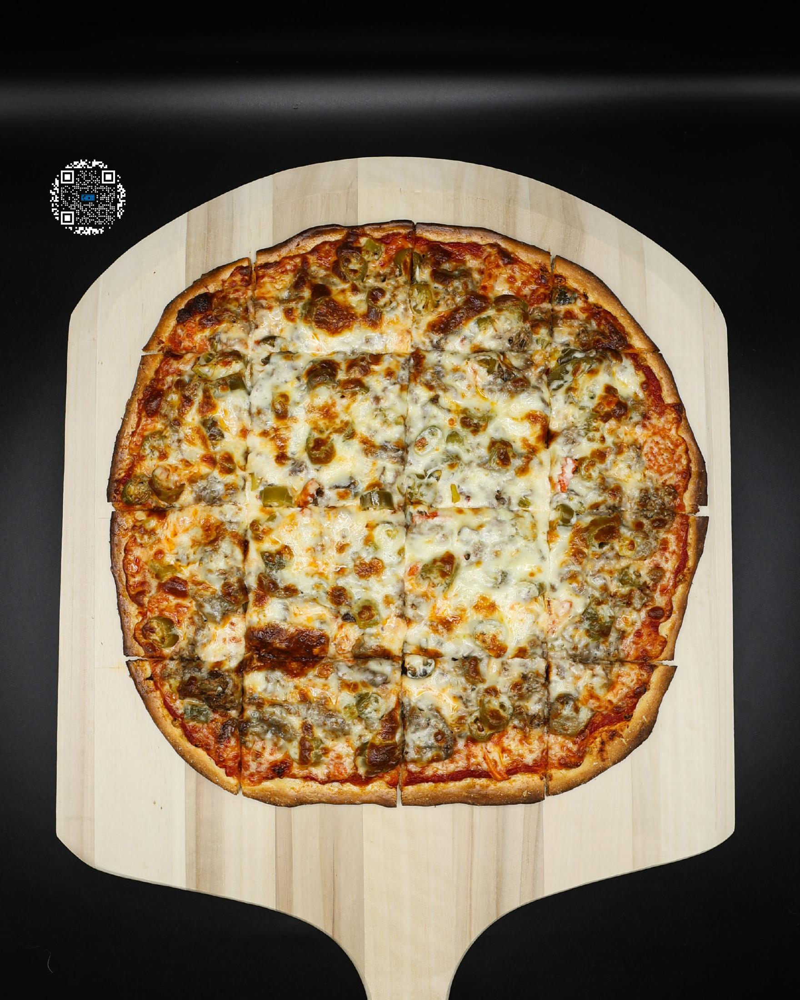

## Additional Recipe Pages

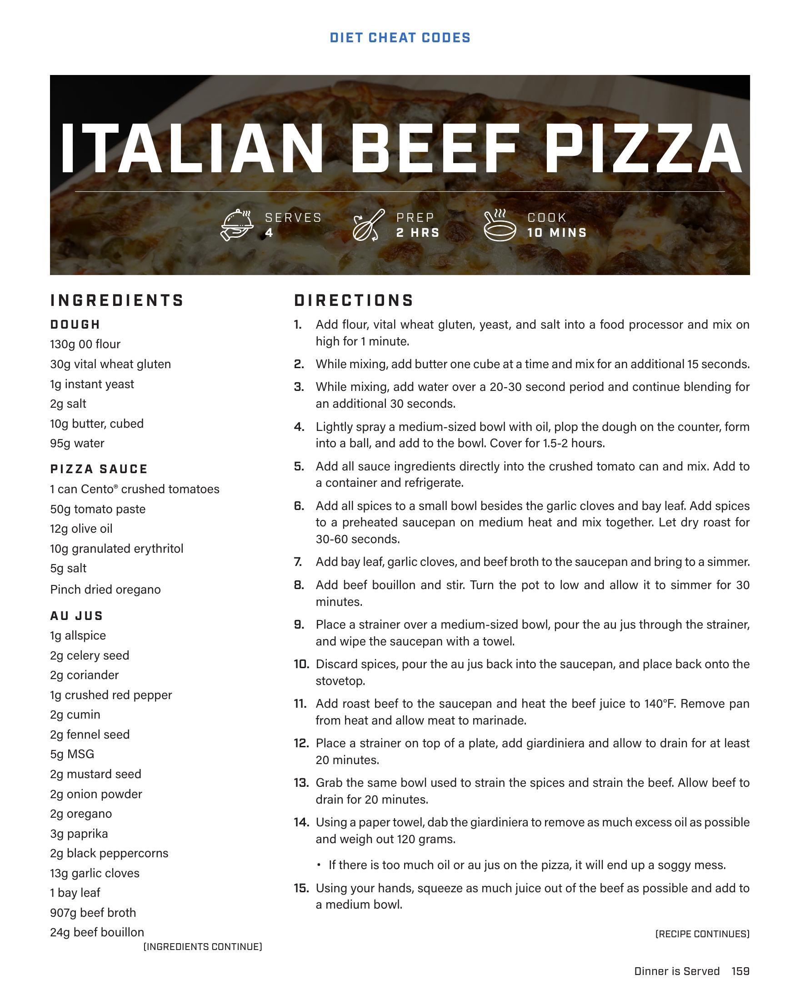

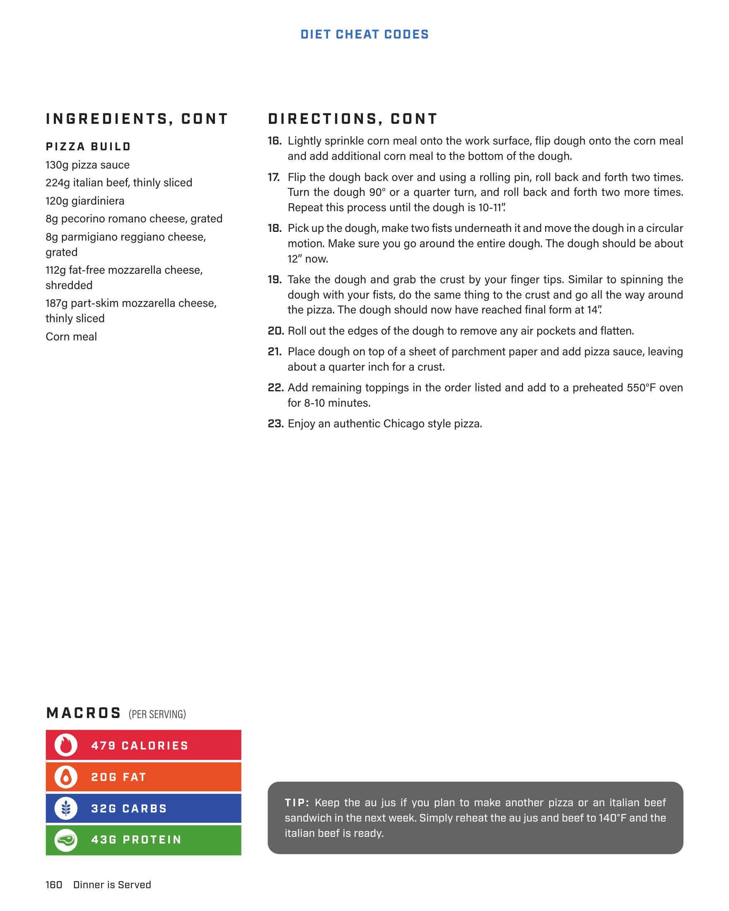

## Source Pages

159, 160, 161

---

# ITALIAN SAUSAGE

**Serves:** 5 | **Prep:** 5 MINS | **Cook:** 5 MINS

## Macros

| Calories | Fat | Carbs | Net Carbs | Protein |
|----------|-----|-------|-----------|---------|
| 133 | 6 | 2 | undefined | 18 |

## Ingredients

- 2g fennel seeds, crushed
- 420g 96% lean ground beef
- 7g garlic, minced
- 2g parsley, chopped
- 7g salt
- Dash black pepper
- 6.5g paprika
- 3.5g onion powder
- 1g crushed red pepper flakes
- 1g Italian seasoning
- 10g extra virgin olive oil

## Directions

1. Place fennel seeds on a preheated pan on medium-low for 2 minutes or until they start to take on some color.
2. Crush fennel seeds using a mortar and pestle or food processor.
3. Into a large bowl, add fennel and all other ingredients, mix to combine, cover with plastic wrap, and refrigerate for 2-3 hours.
4. Take out a 92g serving, form in desired shape/s, and add to a preheated pan on medium high heat for 2 minutes per side or until internal temperature has reached 155°F.
5. Repeat step 4 and store any extra in the fridge.

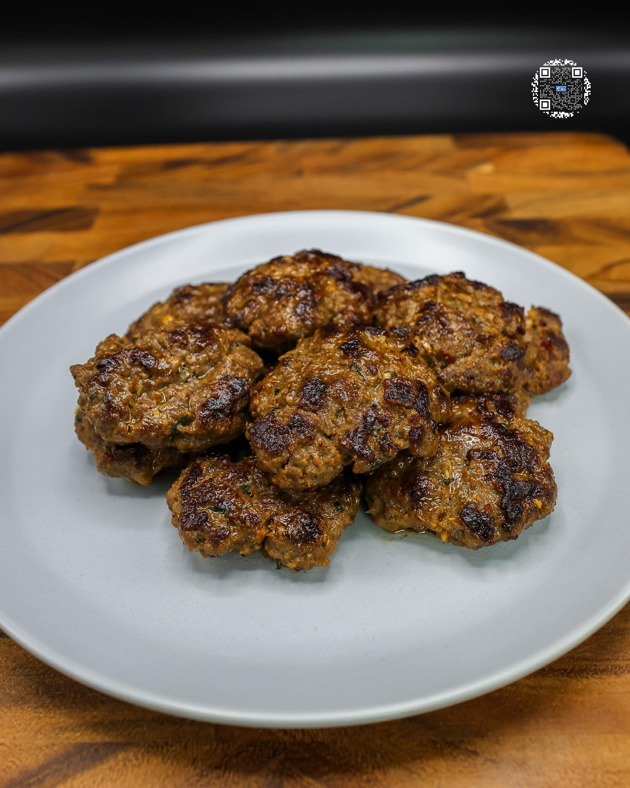

## Additional Recipe Pages

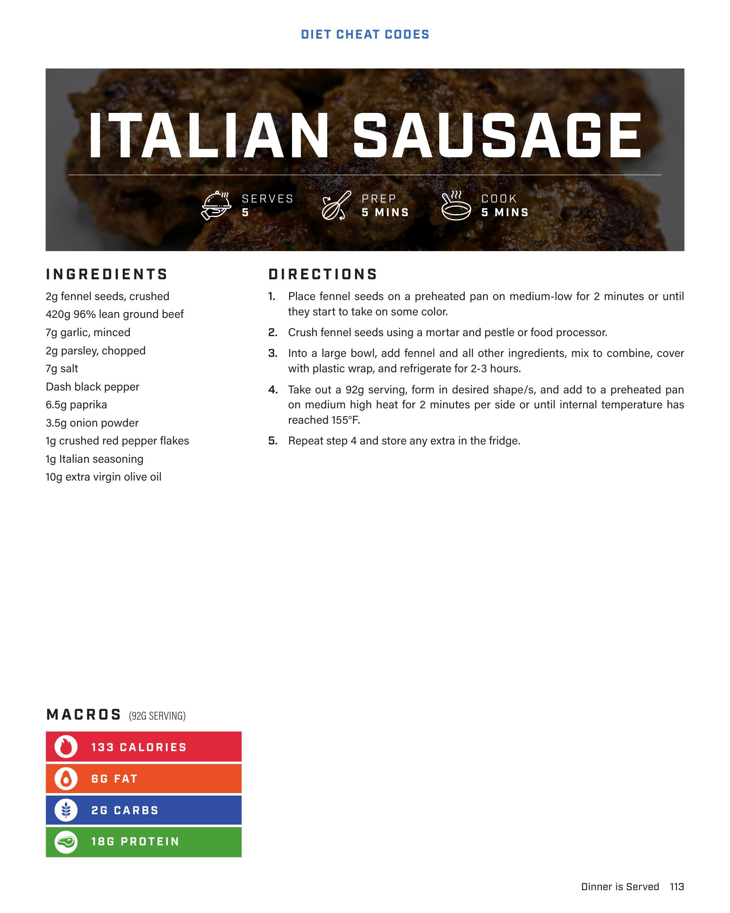

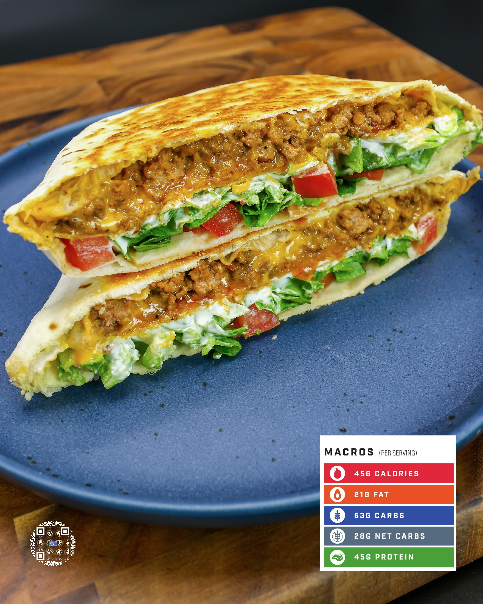

## Source Pages

113, 114, 115

---

# JALAPEÑO CHEESEBURGER NICKWRAP

**Serves:** 4 | **Prep:** 10 MINS | **Cook:** 20 MINS

## Macros

| Calories | Fat | Carbs | Net Carbs | Protein |
|----------|-----|-------|-----------|---------|
| 452 | 19 | 57 | 26 | 44 |

## Ingredients

- Oil spray
- 448g 96% lean ground beef

### BURGER SEASONINGS

- 5g salt
- 2g garlic powder
- 1g white pepper

### NICKWRAP FILLING

- 14g pickled jalapeños
- 5g juice from pickled jalapeños
- 2 slices original Velveta® cheese
- 5g Sriracha
- 84g cooked ground beef

### NICKWRAP BUILD

- 1.25 Mission® Carb Balance burrito tortillas
- 32g jalapeño cheddar cheese dip

### NICKWRAP FILLING

- 1 tostada (45 Cal)
- Lettuce, chopped
- Tomato, deseeded and chopped

## Directions

1. Lightly spray a medium pan with oil and cook the ground beef on medium heat. Add Burger Seasonings on top of beef and break down meat with a spatula.
2. Let meat cook while occasionally stirring until meat is cooked through. Drain off any excess fat. This is the meat that will be added to the cheese sauce.
3. Turn a small pot on low heat, add the Nickwrap Filling ingredients, and stir until cheese is melted and everything is combined. If you need a little extra liquid to make the mixture silky smooth, add 5-10 grams of pickled jalapeño juice or milk.
4. Lay tortilla on counter, and tear off an additional quarter tortilla, which will be used to seal the Nickwrap.
5. On top of the tortilla, spread the jalapeño cheese dip in a circle the size of the tostada.
6. Directly on top of cheese dip, add Nickwrap Filling, tostada, lettuce, tomato, and quarter tortilla.
7. Fold the first side of the tortilla towards the center, then fold the piece right next to it, and repeat until finished. This should take 5 folds to seal.
8. Place the completed Nickwrap folded side down into a preheated pan on medium heat.
9. Brown the Nickwrap to your desire, flip, and do the same on the top side.
10. Grab some hot sauce and enjoy!

## Additional Recipe Pages

## Source Pages

117, 118, 119

---

# LOU'S SAUSAGE DEEP DISH PIZZA

**Serves:** 6 | **Prep:** 24 HRS | **Cook:** 30 MINS

## Macros

| Calories | Fat | Carbs | Net Carbs | Protein |
|----------|-----|-------|-----------|---------|
| 0 |  |  | undefined |  |

## Ingredients

### DRY

- 160g all-purpose flour
- 30g vital wheat gluten
- 1g instant yeast
- 2g salt

### WET

- 25g corn oil
- 5g olive oil
- 90g water

### ITALIAN SAUSAGE

- 448g 90% lean ground pork
- 9g salt
- 2g black pepper
- 1.5g garlic powder

### PIZZA BUILD

- 1.5g Crisco®
- 1 dough
- 140g fat-free mozzarella cheese, shredded
- 168g whole milk low moisture mozzarella cheese, thinly sliced
- 280g sausage
- 180g 3 in 1 ground tomatoes
- 5g pecorino romano, grated
- 5g Parmigiano-Reggiano, grated
- Pinch dried oregano

## Directions

1. Place dry ingredients into a food processor and mix for 60 seconds.
2. Add corn oil and olive oil into processor and blend on high for 10 seconds. While blending, slowly add water over a 15-20 second period and continue blending for an additional 20 seconds.
3. Place dough on the counter. Use a piece of the dough to scrape up any ingredients that remain in the food processor.
4. Knead the ingredients into the dough for one minute, place in a bowl, cover with cling wrap, and refrigerate for 24-48 hours.
5. Top the ground pork with salt, black pepper, and garlic powder and knead the seasonings into the meat for 2-3 minutes. Place the sausage in a bowl, cover with cling wrap, and refrigerate for 24-48 hours.
6. Take dough out of the fridge 2-3 hours before cooking to rise. Spread Crisco® in a 10" springform pan, making sure the bottom and sides are completely covered.
7. Add dough into the pan and stretch the dough edge to edge, making sure the outside edge of the dough is thicker than the rest of the dough.
8. Using your fingertips, bring the edge of the dough 1" up the pan. The dough along the edge of the pan should be very thin.
9. Add fat-free mozzarella on top of the dough. Then overlap the whole milk mozzarella slices along the edge of the pan, followed by another piece placed in the middle. Evenly distribute any remaining slices.
10. Place pieces of sausage throughout the pan and push the pieces into the cheese to ensure a thin layer of sausage once finished. I like start on the edge of the pan and work my way in.
11. Add sauce onto the middle of the pizza and push the sauce out to the edges.
12. Mix the parmesan, romano, and oregano in a small bowl. Spread across the pizza.
13. Using 3"x4" pieces of aluminum foil, cover the pizza crust at the sauce line and wrap any extra foil around the top of the pan.
14. Bake pizza in a preheated 450°F oven for 25-30 minutes.
15. Remove from the oven and immediately place the pizza on a wire rack. Let cool for 5 minutes before slicing into 6 pieces and eating the shit out of it.

## Additional Recipe Pages

## Source Pages

174, 175, 176

---

# MANICOTTI

**Serves:** 12 | **Prep:** 75 MINS | **Cook:** 75 MINS

## Macros

| Calories | Fat | Carbs | Net Carbs | Protein |
|----------|-----|-------|-----------|---------|
| 412 | 17 | 23 | undefined | 43 |

## Ingredients

### CREPES

- 3 eggs
- 480g fat-free milk
- 15g olive oil
- 4g salt
- 35g unflavored whey protein powder
- 50g all-purpose flour
- 10g potato starch

### SAUCE

- 448g 96% lean ground beef
- 6g salt (for ground beef)
- 15g olive oil
- 250g onion, grated
- 3g salt (for onions)
- 2g black pepper
- 25g garlic paste
- 30g Calabrian chilis, chopped
- 45g tomato paste
- 158g Cento® All-in-One Crushed Tomatoes
- 40g water
- 2g salt (for tomatoes)
- 10g fresh basil

### CHEESE FILLING

- 454g whole milk ricotta
- 448g fat-free mozzarella cheese, shredded
- 224g 2% cottage cheese
- 45g Parmigiano-Reggiano, grated
- 284g frozen chopped spinach
- 15g fresh parsley, chopped
- 3g salt
- 3g garlic powder
- 1 egg, beaten

### TOPPING

- 224g part-skim mozzarella cheese, shredded

## Directions

1. Flatten ground beef on a sheet pan, season with salt, set oven to broil on high, and place the pan 6 inches from the broiler. Cook 18-22 minutes or until a deep brown crust forms.
2. Add all crepe ingredients to a high-sided container and blend with an immersion blender. A standard blender works too.
3. Microwave spinach 3-4 minutes, then squeeze out excess water using a cheesecloth or paper towels.
4. Combine all cheese filling ingredients in a large bowl, mix well, and set aside.
5. Grate the onion, prep the remaining sauce ingredients, and place everything next to a preheated pot over medium heat.
6. Add ground onion to the pot. Let the excess liquid steam off, then drizzle in the olive oil and salt. Cook, stirring occasionally, until the onions start to take on color.
7. While the onions sauté, use a meat chopper to crumble the broiled ground beef into small pieces.
8. Stir the salt, black pepper, garlic paste, Calabrian chilis, and tomato paste into the onions and cook for 2-3 minutes.
9. Pour in the crushed tomatoes, then fill each empty can with 20g of water. Shake the water around the inside of the cans to loosen the remaining tomato and pour that liquid into the pot.
10. Throw the ground beef into the pot, mix, bring the sauce to a simmer, and reduce for 30 minutes, or until a spatula leaves a clear trail in the pan.
11. While the sauce simmers, stir the crepe batter to lift any starch from the bottom of the container. Lightly spray a preheated pan (8-inch surface) over medium-low heat with oil, pour in 62g of batter, and quickly spread it across the surface before it sets.
12. Cook 2-3 minutes or until the crepe loosens when you shake the pan. Flip, cook 10-15 seconds, and transfer to a plate.
13. Repeat until you have 12 crepes. Stir basil into the sauce and remove from heat.
14. Spread a thick 1-inch layer of sauce across the bottom of a 9x13 inch baking dish.
15. For each crepe, shape 110g of cheese filling into a 5-inch log and place it on the lower third. Roll the crepe like a burrito with the ends tucked in and place seam-side down in the dish. Make two rows of six crepes.
16. Cover the manicotti with a layer of sauce and top with mozzarella. You should still have about 420g of sauce leftover. Cover with parchment paper, then aluminum foil.
17. Bake in a preheated 400°F oven for 20-32 minutes. Remove the parchment/foil, then bake another 12-15 minutes.
18. Broil for the final 2 minutes or until the cheese browns, keeping the dish 6 inches from the broiler.
19. Plate each manicotti with some of the surrounding sauce from the dish, plus 35g of the leftover sauce.

## Tips

To reheat from the fridge, cover with a damp paper towel and microwave 1:30-2:30. Rest 1 minute, then microwave another 20-30 seconds. To reheat from frozen, microwave at 40% power for 6-8 minutes, rest 1 minute, then microwave at 70% power for 1-2 minutes.

## Additional Recipe Pages

## Source Pages

139, 140, 141, 142, 143

---

# MARGHERITA PIZZA

**Serves:** 2 | **Prep:** 24 HRS | **Cook:** 10 MINS

## Macros

| Calories | Fat | Carbs | Net Carbs | Protein |
|----------|-----|-------|-----------|---------|
| 649 | 20 | 80 | undefined | 39 |

## Ingredients

### DRY

- 190g 00 flour
- 40g vital wheat gluten
- 5g salt
- 3g instant yeast

### WET

- 170g water

### PIZZA BUILD

- 1 dough
- 70g 6 in 1 ground tomatoes
- 60g fresh mozzarella
- 5g Parmigiano Reggiano
- 5g olive oil
- 3g fresh basil

## Directions

1. In a large bowl, whisk the dry ingredients together. Add water and mix with a spoon until a shaggy dough forms.
2. Use a wet hand to press and fold the dough until fully combined and no dry parts remain. Cover and rest for 20 minutes.
3. With a wet hand, pull one side of the dough up as high as possible and fold it over itself. Rotate the bowl 90°, repeating 3-4 times. Flip the dough, form a ball, and cover for another 20 minutes.
4. Repeat step 3.
5. Divide the dough into 2 pieces, each about 200g.
6. Flatten each piece, fold the edges into the center, flip, and shape into a ball by pulling it toward yourself. Rotate 90° and repeat until smooth.
7. Place each dough ball in a lightly oiled, high-sided container, cover, and refrigerate for 24-48 hours.
8. Two to three hours before baking, let the dough rise on the counter and reach room temperature.
9. Lightly flour your surface. Place dough on the flour and dust the top.
10. Outline the crust with your fingers. Press outward from the center of the dough until it is about 8" wide. If sticking occurs, add more flour and continue stretching.
11. Lift the dough (avoiding the crust) and stretch it with your fists in a circular motion until 9-11 inches wide.
12. Place the stretched dough on parchment paper and top with tomatoes.
13. Bake on a preheated pizza steel at 550°F for 4-5 minutes. Remove, pat mozzarella dry with paper towel, and add to the pizza.
14. Bake for an additional 2-3 minutes or until the cheese bubbles.
15. Finish the pizza with Parmigiano Reggiano, olive oil (on both the toppings and crust), and basil. Serve immediately and enjoy!

## Tips

You can substitute 00 flour with all-purpose flour and use your preferred tomatoes.

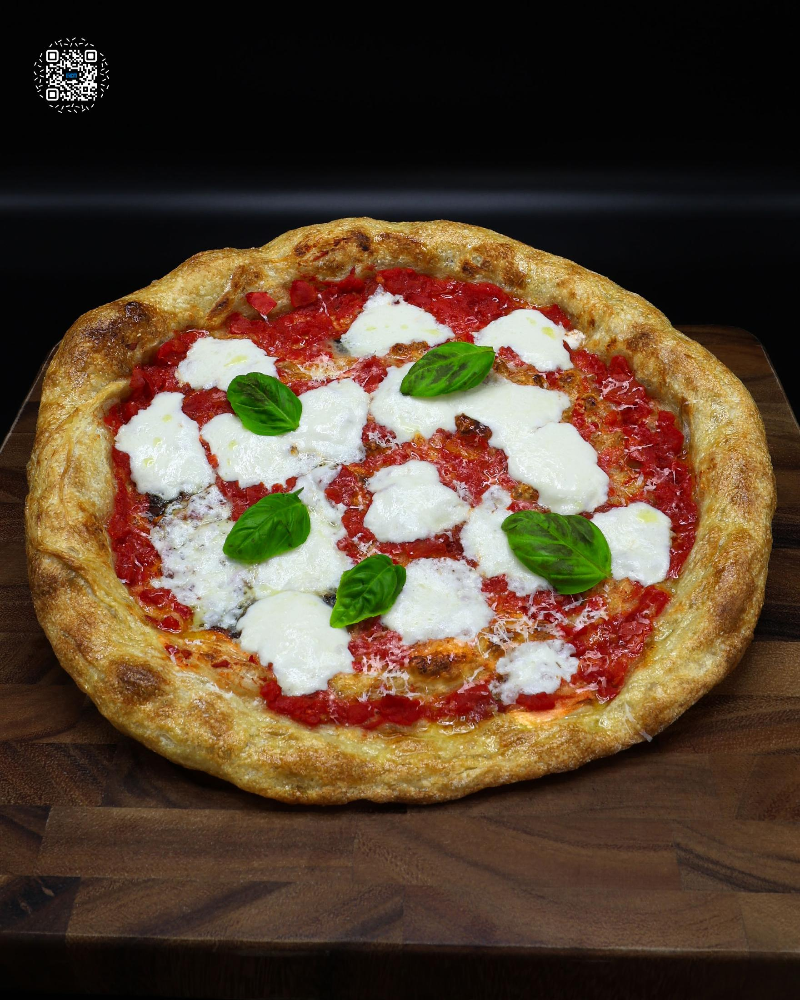

## Additional Recipe Pages

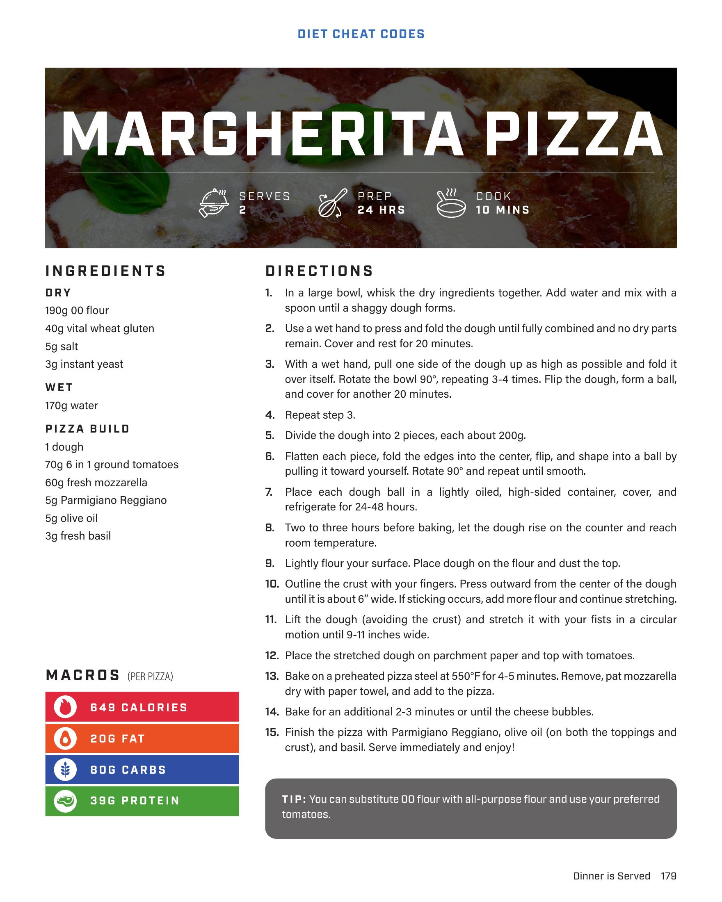

## Source Pages

179, 180

---

# MEATBALL SUB

**Serves:** 4 | **Prep:** 45 MINS | **Cook:** 45 MINS

## Macros

| Calories | Fat | Carbs | Net Carbs | Protein |
|----------|-----|-------|-----------|---------|
| 0 |  |  | N/A |  |

## Ingredients

### SAUCE

- 10g extra virgin olive oil
- 135g white onion, diced
- 15g garlic, minced
- 66g tomato paste
- 28oz can Cento® San Marzano whole peeled tomatoes
- 3g fresh parsley, chopped
- 1g dried oregano
- 1g crushed red pepper flakes
- 6g salt (or to taste)
- 5g granulated erythritol (or to taste)
- Dash black pepper

### MEATBALL MIXTURE

- 250g fat-free milk
- 104g white bread, cubed
- 1 egg
- 63g grated Parmigiano-Reggiano
- 15g fresh parsley, chopped
- 15g garlic, minced
- 18g salt
- 3g black pepper
- 15g lemon juice
- 1g crushed red pepper flakes
- 448g 96% lean ground beef
- 448g 90% lean ground pork

### SANDWICH BUILD

- ½ PROTEIN BAGUETTE (7"), frozen
- 3 Meatballs

## Directions

1. Add olive oil and onions to a preheated oven-safe pot on medium heat and stir to combine.
2. Press in garlic, stir to combine, and let mixture cook for 3-5 minutes.
3. Add tomato paste, combine the rest of the Sauce Ingredients thoroughly, and let combination simmer for 1 minute.
4. Put an immersion blender into the can of tomatoes, blend 15-20 seconds or until smooth, add to the pan with the rest of the Sauce ingredients, and stir to combine. You can also crush the tomatoes by hand if you prefer.
5. Once sauce starts bubbling, give it a stir, turn stovetop to low, and let sauce simmer for 20-30 minutes, stirring occasionally.
6. Into a large bowl add milk, bread, and an egg and whisk until mixture looks like a wet banana pudding.
7. Add the remaining meatball ingredients into the bowl and mix until well combined.
8. Divide meatball mixture into 120g portions, form into balls, and spread out evenly on a sheet pan lined with parchment paper.
9. Bake meatballs in a preheated 475°F oven for 15 minutes, flip the meatballs, and continue cooking for another 5-8 minutes.
10. Turn oven down to 350°F, add meatballs to the sauce, and mix them until completely covered.
11. Throw pot into the oven, without a lid, along with frozen protein baguettes for 15 minutes.
12. Cut the baguette in half lengthwise and put a layer of sauce on the bottom piece of the baguette. Add meatballs, another layer of sauce on top of the meatballs, optional parmesan, and close the sandwich with the top of the baguette.

## Tips

You can use store bought baguettes if you would like, but the protein baguette recipe makes 8 servings that you can store in the freezer for months and is well worth making in my opinion.

## Source Pages

144

---

# MEATLOAF

**Serves:** 8 | **Prep:** 40 MINS | **Cook:** 35 MINS

## Macros

| Calories | Fat | Carbs | Net Carbs | Protein |
|----------|-----|-------|-----------|---------|
| 288 | 12 | 14 | undefined | 29 |

## Ingredients

### LOAF

- 56g breadcrumbs
- 120g fat-free milk
- 1 egg
- 15g soy sauce
- 14g gelatin
- 10g avocado oil
- 300g onion, grated
- 100g carrot, grated
- 15g garlic, minced
- 5g smoked paprika
- 12g cremini mushrooms, chopped
- 10g fresh parsley, chopped
- 448g 93% lean ground beef
- 448g 90% lean ground pork
- 10g salt
- 4g black pepper

### GLAZE

- 100g ketchup, no sugar added
- 30g Worcestershire sauce
- 15g sriracha
- 40g brown sugar erythritol

## Directions

1. Add breadcrumbs, milk, egg, soy sauce, and gelatin to a large bowl and whisk to combine.
2. Grate onion, carrot, and garlic. Add avocado oil to a preheated pot on medium heat along with the grated vegetables. Stir to combine.
3. Finely chop parsley and mushrooms and add to the bowl with the breadcrumb mixture.
4. Stir the pot full of vegetables and add a pinch of salt. Allow vegetables to sauté for another 1-2 minutes, add smoked paprika, and mix one more time. Let the vegetables sauté for an additional 30 seconds and add to the breadcrumb mixture.
5. Add beef, pork, salt, and pepper to the breadcrumb mixture. Mix all ingredients together until combined.
6. If you can't get pork, you can use all ground beef instead.
7. Add meat mixture to an aluminum foil lined sheet pan and form into a 10x6 inch rectangle.
8. Spray hands with oil for a much easier time shaping the loaf.
9. Place meatloaf under a broiler for 8-10 minutes or until a brown sear occurs across the top of the loaf. The meatloaf should be sitting about 4-6 inches from the broiler.
10. While the meatloaf is broiling, add ketchup, worch, sriracha, and erythritol to a bowl and mix to combine. The glaze is ready.
11. Brush a thick layer of glaze on the top and sides of the meatloaf. Place in a preheated 400°F oven for 15 minutes.
12. Add a second layer of glaze to the meatloaf and continue baking for another 5-10 minutes or until the internal temperature reaches 140-145°F throughout the loaf.
13. Apply any leftover glaze and allow the meatloaf to set for 15-20 minutes. Cut into ½" slices and enjoy this lower calorie version of an American Classic.

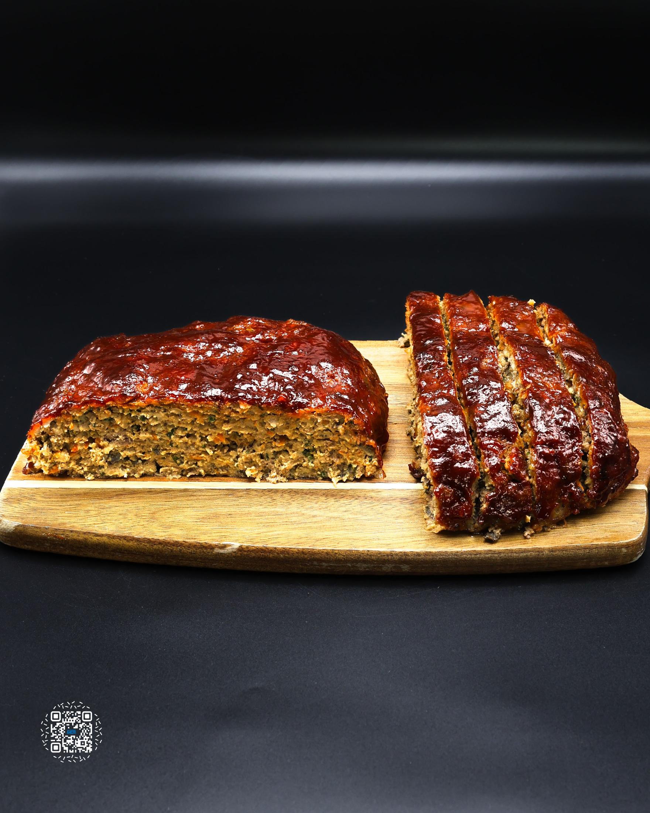

## Additional Recipe Pages

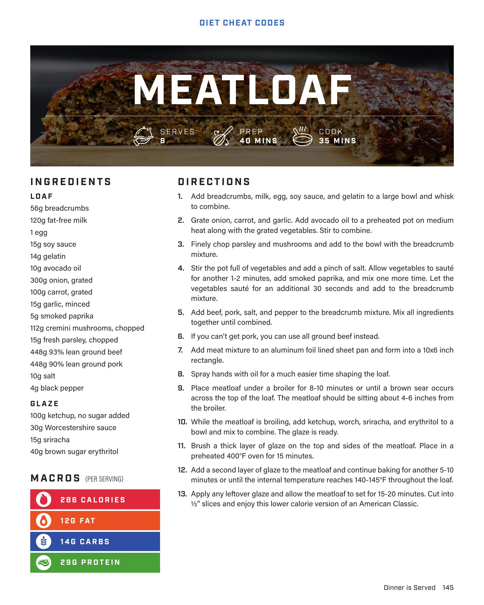

## Source Pages

145, 146

---

# MEXICAN PIZZA

**Serves:** 6 | **Prep:** 15 MINS | **Cook:** 30 MINS

## Macros

| Calories | Fat | Carbs | Net Carbs | Protein |
|----------|-----|-------|-----------|---------|
| 0 |  |  | undefined |  |

## Ingredients

### SEASONING MIX

- 8g cumin
- 8g smoked paprika
- 2g chili powder
- 1g dried oregano
- 3g coriander
- 3g MSG

### PIZZA FILLING

- 5g avocado oil
- 448g 96% lean ground beef
- 4g salt
- 70g onion, diced
- 8g garlic, minced
- 150g tomato sauce
- 100g beef broth
- 10g brown sugar erythritol
- 4g apple cider vinegar

### MEXICAN PIZZA BUILD

- 2 La Banderita® Carb Counter taco tortillas
- 80g fat-free refried beans
- 110g Pizza Filling
- 20g enchilada sauce
- 28g reduced-fat colby jack cheese
- Tomatoes, diced

## Directions

1. Add cumin, paprika, chili powder, oregano and MSG into a small bowl and mix to combine. Dice onion.
2. Place tortillas on a sheet pan lined with aluminum foil. Lightly spray both sides of the tortillas with oil and bake in a preheated 300°F oven for 20 minutes, flipping halfway through.
3. Add avocado oil to a preheated pan on medium heat and add ground beef to the pan by crumbling in bite-sized chunks.
4. Add salt evenly across the beef, break down beef even more using a wooden spatula, and stir constantly until meat is cooked.
5. Make room in the middle of the pan, add onions to it, let them cook for 45 seconds, and mix to combine.
6. Once onions become translucent, make room in the middle of the pan, add garlic and Seasoning Mix, let it bloom for 30 seconds, and mix to combine.
7. Add tomato sauce, beef broth, brown sugar, and apple cider vinegar, mix to combine, then turn heat down to low and simmer for 10 minutes.
8. Once meat is finished, try it to see if it needs any additional salt or brown sugar and add more if necessary.
9. Grab one of the cooked tortillas, add beans to the top, spread onto the entire tortilla, and repeat with the Pizza Filling.
10. Place the other tortilla on top of the ground beef, top with enchilada sauce and cheese, and bake in a preheated 350°F oven for 3-5 minutes.
11. Garnish with tomatoes, cut into 4 pieces, and enjoy.

## Source Pages

124

---

# NICKCHICKEN

**Serves:** 5 | **Prep:** 1 HR | **Cook:** 20 MINS

## Macros

| Calories | Fat | Carbs | Net Carbs | Protein |
|----------|-----|-------|-----------|---------|
| 388 | 9 | 38 | undefined | 37 |

## Ingredients

### CHICKEN MIX

- 700g chicken breast
- 9g salt
- 6g granulated erythritol
- 3g baking soda

### WET STATION 1

- 230g water
- 20g corn starch

### DRY STATION

- 90g all-purpose flour
- 3g garlic powder
- 2g paprika
- 3g salt
- 2g white pepper
- 3g black pepper

### WET STATION 2

- 1 egg
- 1 egg white
- 2g baking powder

### FINISHING TOUCHES

- Olive oil spray

### NICKCHICKEN BUILD

- Buns (110 Cal)
- 1 NickChicken patty
- 15g light mayonnaise
- Lettuce

## Directions

1. Preheat an air fryer to 400°F.
2. Cut chicken breast into medium-sized chunks, add to blender, and pulse blender for 10-15 seconds or until it is a similar consistency to ground chicken.
3. Add ground chicken to a bowl, then add salt and erythritol. Mix together until ingredients are thoroughly combined.
4. Spray your hands with oil so the ground chicken does not stick to your hands, then separate the chicken mix into 140g-sized balls. Form the chicken balls into patties that are slightly wider than the buns, and place on a piece of parchment paper.
5. Set up dredging stations by adding all Dredge Station Ingredients to three separate containers and mixing until well combined.
6. With one hand or your "wet hand," take a chicken patty, submerge it into the first wet station container; let extra liquid drip off, and place into the dry ingredients container.
7. Using your other hand or what I like to call your "dry hand," add the wet patty to your dry flour mixture and push flour into the patty to coat it thoroughly, making sure the sides of the patty are covered as well.
8. Once patty is fully coated, shake any excess flour off, and add to wet station two.
9. Make sure the chicken patty is completely coated in egg wash and let any excess drip off.
10. Put chicken patty back into the dry station and repeat step 7.
11. Place the finished chicken patty on wire rack, mix wet station one with whisk, and repeat the process until all patties are breaded.
12. Cook chicken for 6-8 minutes in the air fryer, or until chicken has reached an internal temperature of 165°F, flipping halfway through. Repeat this process until all chicken is cooked.
13. When ready to eat, toast inside of the buns and chop lettuce.
14. Add NickChicken to bottom bun, then some chopped lettuce. Add mayo to the top bun and complete the NickChicken by closing the sandwich.
15. Put any extra NickChicken's in separate containers and reheat whenever hunger arises.

## Tips

Put some of the dry mix on a plate or in a separate container before putting patty into the dry station. Then you can easily add the dry mixture to the top of the patty after it is already in the dry station container. For best results, use an air fryer when possible. However, you can use a preheated 400°F oven for 20 minutes or until the internal temperature of the chicken patty reaches 165°F. I recommend using a food thermometer to check the internal temperature of the chicken and make sure it reaches 165°F before removing from air fryer. There will be carryover cooking of another 5 degrees or so while it is sitting. I typically reheat these in a preheated 350°F air fryer for 4 minutes.

## Additional Recipe Pages

## Source Pages

125, 126, 127

---

# NICKWRAP SUPREME

**Serves:** 4 | **Prep:** 20 MINS | **Cook:** 20 MINS

## Macros

| Calories | Fat | Carbs | Net Carbs | Protein |
|----------|-----|-------|-----------|---------|
| 0 | 0 | 0 | undefined | 0 |

## Ingredients

- Mission® Carb Balance burrito tortillas
- 448g 96% lean ground beef
- Oil spray

### SEASONING

- 3g chili powder
- 1g garlic powder
- 1g onion powder
- 1g paprika
- 3g ground cumin
- 1g crushed red pepper flakes
- 0.3g dried oregano (1/4 teaspoon)
- 6g salt
- 2.5g black pepper

### FILLINGS

- 1.2 tortillas
- 45g nacho cheese
- 84g cooked taco meat
- 14g reduced-fat sharp cheddar cheese
- 1 tostada (12-14g)
- 42g fat-free Greek yogurt OR
- 42g CILANTRO LIME SALSA
- Lettuce
- Tomato

## Directions

1. Mix all Seasoning ingredients in a small bowl until combined.
2. Cut the tomato in half, remove the seeds with a spoon, and dice the remaining tomato.
3. Rough chop a few pieces of lettuce and shred the sharp cheddar cheese.
4. Lightly spray a pan with oil, turn the burner on medium-low, and start adding small chunks of ground beef until all the beef is in the pan.
5. Once all the beef is added, lightly spray the top of meat with oil and sprinkle the seasoning over the top.
6. Stir the meat every 1-2 minutes until browned and seasoned.
7. Pour meat into container or onto plate and cover.
8. Into a large pan on low heat, add one tortilla at a time and heat for about 15-30 seconds or until pliable.
9. Using scissors, cut a small circle from another tortilla, about a fifth of the size of the tortilla. This will be used to help keep the Crunchwrap® sealed.
10. Place the larger warmed tortilla on the counter and add nacho cheese, ground beef, and cheddar cheese. You should spread these ingredients out the size of the tostada.
11. Add tostada on top of all ingredients, then spread a thin layer of Greek yogurt evenly over top of tostada.
12. Top the tostada with lettuce, tomatoes, and the small, pre-cut tortilla.
13. Fold the first side of the tortilla towards the center, then fold the piece right next to it, and repeat until finished. This should take 5 folds to seal.
14. Place the completed Crunchwrap® folded side down into a preheated pan on medium heat.
15. Brown the Crunchwrap® to your desire, flip, and do the same on the top side.
16. Grab some Taco Bell® sauce and enjoy!

## Source Pages

116

---

# OG MAC AND CHEESE

**Serves:** 2 | **Prep:** 5 MINS | **Cook:** 10 MINS

## Macros

| Calories | Fat | Carbs | Net Carbs | Protein |
|----------|-----|-------|-----------|---------|
| 656 | 9 | 103 | undefined | 44 |

## Ingredients

### PASTA MIXTURE

- 450g water
- 240g fat-free milk
- 4g salt
- 224g elbow macaroni

### MIX-INS

- 15g Parmigiano-Reggiano, grated
- 84g fat-free cheddar cheese, shredded
- 10g corn starch
- 105g sharp cheddar Velveeta® cheese

## Directions

1. Add Pasta Mixture to a pot, put on the stovetop, stir to combine, and turn on high heat.
2. Set a 10-minute timer for the pasta.
3. Add parmesan, fat-free cheese, and corn starch into a bowl and mix to combine.
4. Stir pasta more frequently as it comes to a boil to avoid burning the milk or having the noodles stick to the bottom of the pot.
5. After 10 minutes, take the pasta pot off the heat and immediately add Velveeta®.
6. Stir for 1-2 minutes or until melted.
7. Add corn starch mixture and stir constantly for 2-3 minutes until everything is melted and mixed thoroughly.
8. Let pasta sit for 2 minutes to help thicken the cheese.
9. Give pasta a stir, pour into a bowl, and it is time to eat.

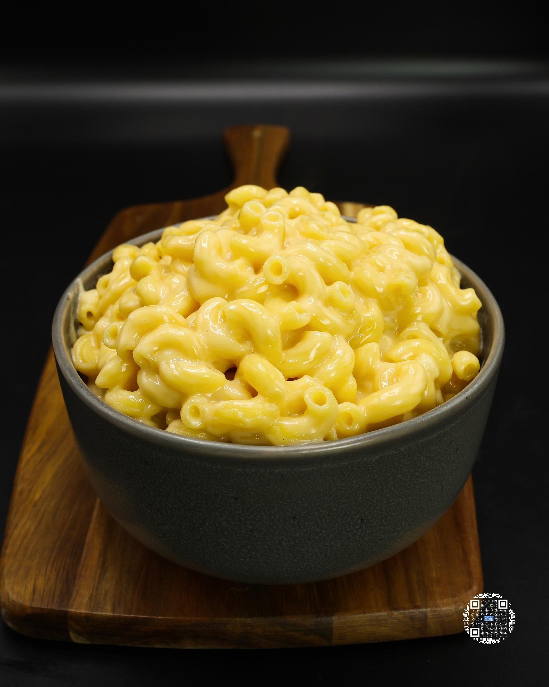

## Additional Recipe Pages

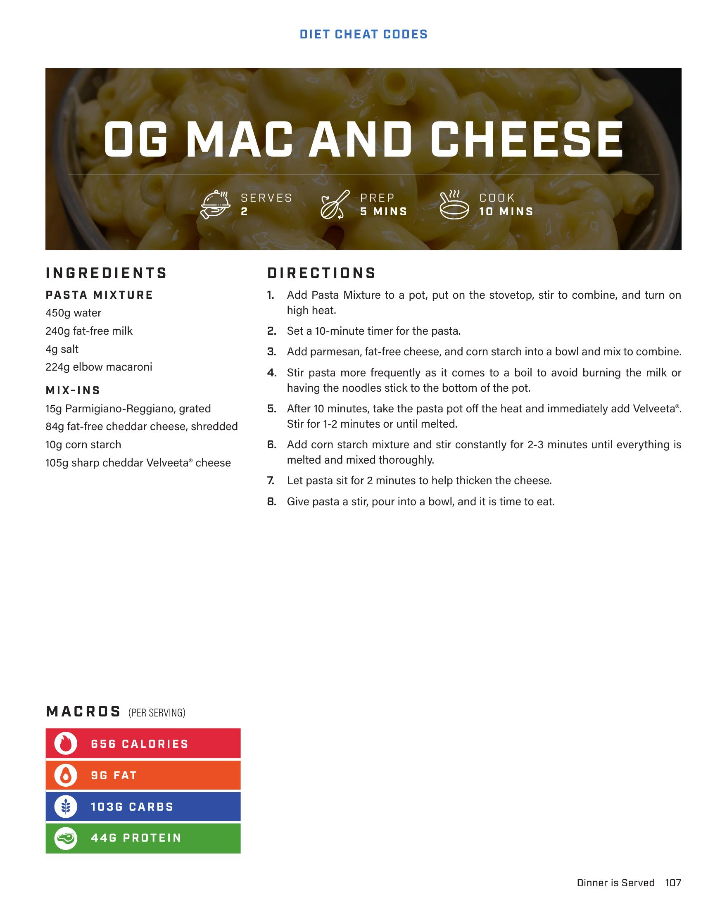

## Source Pages

107, 108

---

# PAN PIZZA

**Serves:** 1 | **Prep:** 2 HRS | **Cook:** 10 MINS

## Macros

| Calories | Fat | Carbs | Net Carbs | Protein |
|----------|-----|-------|-----------|---------|
| 983 | 27 | 106 | 103 | 88 |

## Ingredients

### DOUGH

- 110g bread flour
- 2g salt
- 1g garlic powder
- 2g instant yeast
- 3g granulated erythritol
- 85g 1% milk

### PIZZA BUILD

- 100g FOOLPROOF HOMEMADE MARINARA
- 5g parmesan, grated
- 112g fat-free mozzarella cheese, shredded
- 112g part-skim mozzarella cheese, shredded

## Directions

1. Add yeast, flour, salt, erythritol, and garlic to a large bowl and whisk to combine.
2. Heat milk in the microwave for 20-30 seconds or until it reaches 110°F, add it to the bowl. Using a spoon, mix the rest of the Dough Ingredients until a dough ball starts to form.
3. Once all ingredients are incorporated, cover with plastic wrap, and let the dough sit for 15 minutes.
4. Take the dough ball out of the bowl, KNEAD for 5 minutes, form into a ball, and add it to a lightly oiled bowl. Cover and put in a warm place for 1-2 hours or until doubled in size.
5. Lightly spray a 10" nonstick pan with oil, put the dough down in the middle of the pan, spread it out evenly until dough just starts to creep up the side of the pan, and lightly spray the top of the dough with oil.
6. Put pan on the stovetop, turn burner onto medium low heat, and cook the bottom of the dough for 3-5 minutes or until the crust is a deep golden brown.
7. Put pan onto the work surface and top dough with sauce, parmesan, fat-free cheese, and part-skim cheese.
8. Broil for 3-4 minutes or until cheese is bubbling and brown on top.
9. Cut into four slices and enjoy.

## Notes

The dough will be very wet at this point.

## Additional Recipe Pages

## Source Pages

169, 170, 171

---

# PIZZA POT PIE

**Serves:** 2 | **Prep:** 1.5 HRS | **Cook:** 45 MINS

## Macros

| Calories | Fat | Carbs | Net Carbs | Protein |
|----------|-----|-------|-----------|---------|
| 619 | 18 | 71 | undefined | 47 |

## Ingredients

### DOUGH (makes 2 doughs)

- 142g bread flour
- 1g garlic powder
- 2g salt
- 2g instant yeast
- 2g extra virgin olive oil
- 94g water

### HOMEMADE SAUCE

- 28oz can Cento" crushed tomatoes
- 66g tomato paste
- 80g onion, diced
- 80g green bell pepper, diced
- 7g garlic, minced
- 5g extra virgin olive oil
- 1g oregano
- 1g crushed red pepper
- 5g salt
- 10g granulated erythritol

### PIZZA

- Oil spray
- 65g part skim mozzarella (thinly sliced)
- 65g fat-free mozzarella
- 85g Homemade Sauce
- 1 Dough
- 3g unsalted butter

## Directions

1. Add all Dough ingredients into a medium-sized bowl and mix together until you have a shaggy dough (if it's not perfectly mixed at this stage, that's okay).
2. Cover the bowl with plastic wrap and let sit in a warm place for 15 minutes.
3. Lightly dust your surface with flour, then turn out your dough. Knead with the palm of your hand for 5 minutes.
4. Lightly spray your dough bowl with oil, place the kneaded dough back into the bowl, and lightly spray the top of the dough with oil. Cover the bowl with plastic wrap, and place in a warm area to rise for one hour.
5. To make the sauce, dice the green pepper and the onion and add to a preheated pot on medium heat along with the olive oil.
6. Cook for 3 minutes or until vegetables become soft, stirring occasionally.
7. Make room in middle of pan and add minced garlic. Once garlic becomes fragrant, add crushed tomatoes and mix thoroughly.
8. Add tomato paste, oregano, and crushed red pepper to the pot and stir to combine.
9. Bring sauce to a simmer, turn burner to low, and let it simmer for about 20-30 minutes or to preferred thickness.
10. Add salt and erythritol to the sauce, mix, and put sauce to the side to cool.
11. Split dough in half and round into balls. Grab a bowl that is about 6.5" wide and 1.5" deep, and lightly spray with oil.
12. Add thin slices of mozzarella to the bowl, covering the interior surface completely, then repeat with the fat free mozzarella. Add homemade sauce to the bowl.
13. Using your fingers, push out from the middle of the dough, rotating it and working it into a circle, until it is big enough to cover the entire bowl.
14. Lay dough over top of bowl and pat the edges so it sticks to the bowl.
15. Place bowl on a tray and bake in a 400°F oven for 16 minutes.
16. Once finished pull it out, heat 3g of butter in the microwave until melted, and brush on top.
17. With high quality oven mitts, quickly flip bowl on tray lined with aluminum foil, slowly go around the rim with a spoon, pull bowl away from pot pie, and EAT.

## Tips

If you want a smoother sauce, mix with an immersion blender for about 30 seconds once all ingredients are added OR chop veggies smaller before adding them into the pot.

## Additional Recipe Pages

## Source Pages

181, 182, 183

---

# SAUSAGE AND PEPPERONI PIZZA

**Serves:** 4 | **Prep:** 2 HRS | **Cook:** 10 MINS

## Macros

| Calories | Fat | Carbs | Net Carbs | Protein |
|----------|-----|-------|-----------|---------|
| 587 | 23 | 43 | undefined | 54 |

## Ingredients

### DOUGH (MAKES 2)

- 340g all-purpose flour
- 90g vital wheat gluten
- 3g yeast
- 8g salt
- 240g warm water
- 16g olive oil

### PIZZA SAUCE

- 780g 6 in 1 ground tomatoes
- 14g olive oil
- 9g garlic, minced
- 4.5g salt

### ITALIAN SAUSAGE

- 448g 90% lean ground pork
- 8g salt
- 8g garlic, minced
- 4g fennel seed
- 3g ground fennel
- 2g ground anise
- 2g garlic powder
- 1g black pepper
- 0.5g crushed red pepper
- 0.5g dried oregano

### PIZZA BUILD

- 6g corn meal
- 1 dough
- 176g pizza sauce
- 8g Pecorino Romano, grated
- 8g Parmigiano-Reggiano, grated
- 239g italian sausage
- 84g turkey pepperoni
- 112g fat-free mozzarella cheese
- 182g part-skim mozzarella cheese
- Sprinkle dried oregano

## Directions

1. In a large bowl, combine flour, vital wheat gluten, yeast, and salt. Whisk to evenly distribute.
2. Add water and olive oil. Mix with a spoon until a shaggy dough forms.
3. Using a wet hand, press and fold the dough until fully combined and no dry flour remains. Cover and rest 20-30 minutes.
4. With a wet hand, pull one side of the dough up as high as possible and fold it over itself. Rotate the bowl 90° and repeat 3-4 times. Flip the dough, form into a ball, cover, and rest 20-30 minutes.
5. Repeat step 4.
6. Divide the dough into 2 pieces, about 345g each.
7. Flatten each piece, fold the edges into the center, flip seam-side down, and shape into a smooth ball by pulling it toward yourself. Rotate 90° and repeat until tight.
8. Place each dough ball in a container and refrigerate for 24 hours.
9. Combine all Italian sausage ingredients in a bowl. Mix thoroughly and refrigerate for 24 hours.
10. Combine all pizza sauce ingredients in a high-sided container. Mix to combine and refrigerate.
11. Any crushed tomatoes you prefer can be used instead of 6-in-1.
12. Remove one dough from the fridge 2-3 hours before shaping.
13. Lightly sprinkle cornmeal on top of the dough. Flip onto the counter and dust the bottom with additional cornmeal.
14. Flip the dough back over. Using your fingers, press the dough outward until it’s 8-10 inches wide.
15. Using a rolling pin, roll back and forth twice. Rotate the dough 90° and repeat. Continue until the dough reaches 10-12 inches.
16. Lift the dough and stretch using your fists underneath, rotating in a circular motion until evenly stretched.
17. Transfer to a 16-inch sheet of parchment paper. Lightly roll the crust to remove air pockets and adjust thickness if needed.
18. Place the pizza sauce in the center of the dough and spread evenly, leaving a quarter inch border for the crust.
19. Add remaining toppings in the order listed in the ingredients section.
20. Bake in a preheated 500°F oven for 8-12 minutes or until the cheese is browned to your preference.
21. Transfer pizza to a wire rack for 2-3 minutes. Return to the pizza steel for an additional 2-3 minutes with the oven door slightly cracked.
22. Enjoy an authentic Chicago pizza.

## Notes

Any crushed tomatoes you prefer can be used instead of 6-in-1.

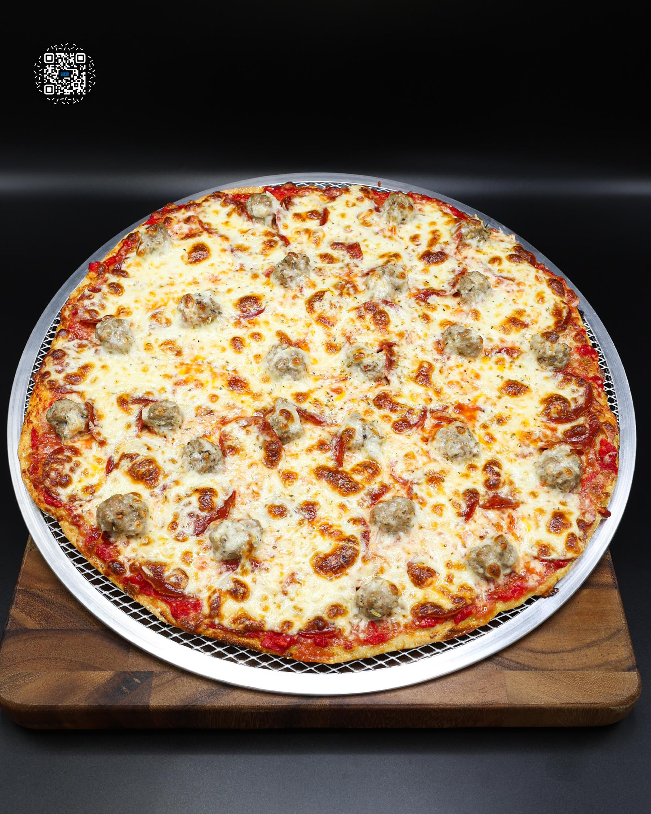

## Additional Recipe Pages

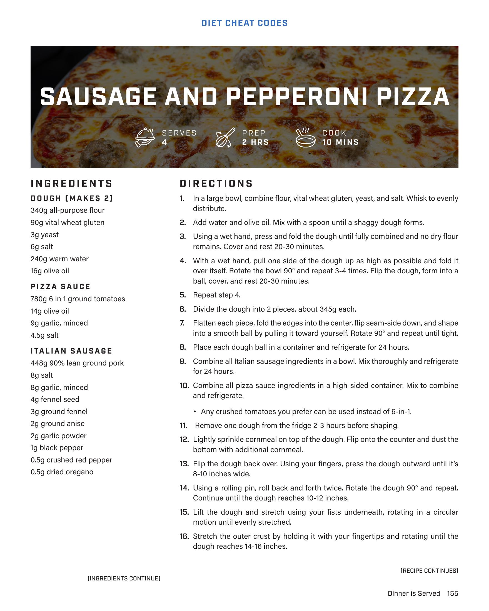

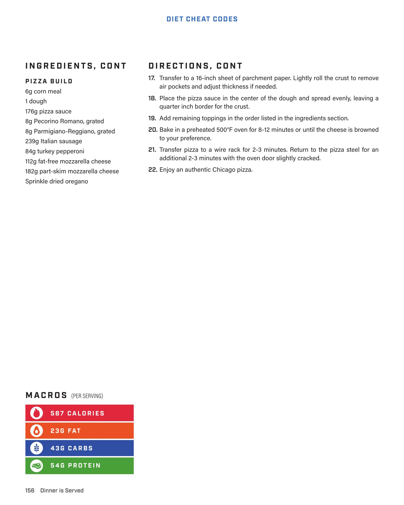

## Source Pages

155, 156, 157

---

# SLOPPY JOES

**Serves:** 10 | **Prep:** 20 MINS | **Cook:** 30 MINS

## Macros

| Calories | Fat | Carbs | Net Carbs | Protein |
|----------|-----|-------|-----------|---------|
| 211 | 7 | 26 | 8 | 26 |

## Ingredients

- 10g olive oil (veggies)
- 125g onion, diced
- 125g green bell pepper, diced
- 125g carrots, diced
- 15g garlic, minced
- 2lb 96% lean ground beef
- 3g baking soda
- 10g olive oil (meat)
- 8g salt (or to taste)
- 5g onion powder
- 2g black pepper
- 226g G Hughes' sugar-free ketchup
- 10g mustard
- 30g Worcestershire sauce
- 30g brown sugar erythritol
- 8g cornstarch
- 30g water
- Keto Culture® buns (50 Cal)

## Directions

1. Add ground beef and baking soda to a large bowl and mix until well combined.
2. Dice peppers, jalapenos, peeled carrots, and onion. Mince garlic.
3. Heat olive oil in a saucepan over medium-high heat, then add chopped veggies. Cook until they are soft or begin to take on some color.
4. Create a small hole in the center of the pan, add minced garlic, and stir until garlic becomes fragrant. Transfer sautéed vegetables to a medium bowl.
5. Return the pan to the stovetop over medium-high heat. Allow pan to heat up for 2-3 minutes and add oil.
6. Add meat to the pan and press it down firmly to ensure maximum contact with the hot surface. Allow to brown for 2-3 minutes and flip.
7. Break the meat into small, bite-sized pieces using a meat chopper or potato masher.
8. Add vegetables back to the pan, along with salt, black pepper, and onion powder. Mix to combine.
9. While the meat is cooking, combine ketchup, mustard, Worcestershire sauce, and brown sugar in a separate bowl.
10. When the meat is fully cooked and no longer pink, pour the sauce into the pan.
11. Mix the sauce and meat in the pan and cook for 1-2 minutes.
12. In a small bowl, combine cornstarch and water, stirring until the cornstarch is fully dissolved.
13. Add cornstarch slurry to the pan, stirring immediately. Reduce the heat to low.
14. Allow the mixture to cook for 3-5 minutes, stirring occasionally.
15. Once sauce has thickened, divide the meat into 10 equal portions. Place each portion, approximately 130-140g, onto a bun and enjoy!

## Tips

Taste meat before serving and add salt if necessary.

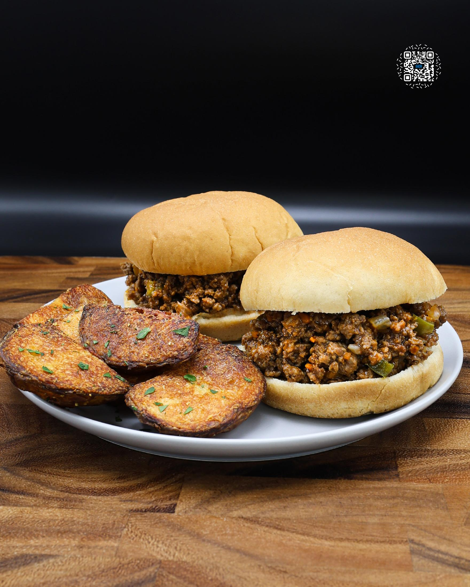

## Additional Recipe Pages

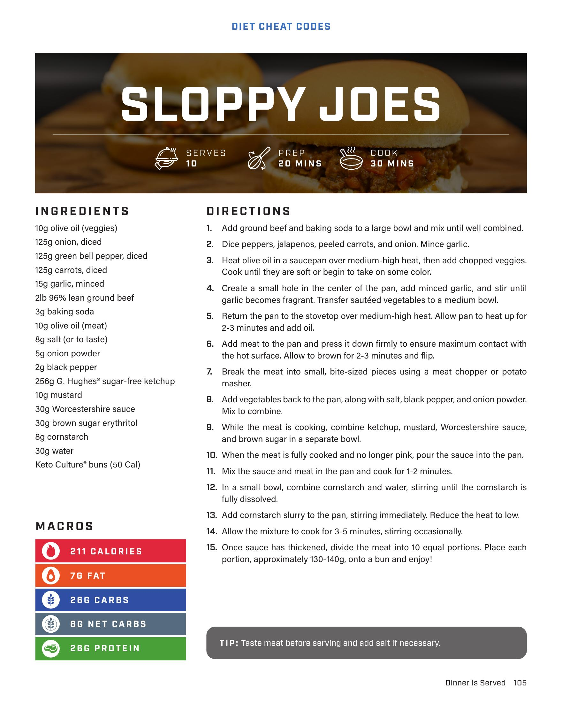

## Source Pages

105, 106

---

# SMASHBURGER SALAD

**Serves:** 1 | **Prep:** 10 MINS | **Cook:** 10 MINS

## Macros

| Calories | Fat | Carbs | Net Carbs | Protein |
|----------|-----|-------|-----------|---------|
| 533 | 20 | 27 | undefined | 59 |

## Ingredients

- 210g 96% lean ground beef
- 7.5g unsalted butter
- 3 slices original Velveta® cheese
- 250g iceberg lettuce, chopped
- 140g tomato, sliced
- 64g no sugar added ketchup
- 20g mustard
- Salt and pepper, to taste

## Directions

1. Separate the ground beef into three 70g balls.
2. Place each ball between 2 pieces of 10"x10" parchment paper and flatten using a cast iron pan or another flat, heavy object.
3. Prep vegetables and add them to a large bowl.
4. Add 2.5g of butter to a preheated pan on medium high heat and swirl it around the pan.
5. Add one patty to the pan, press the patty into the pan for 2 seconds using a spatula, add salt and pepper, and let first side cook for 1 minute or until juices have risen to the top of the patty.
6. Scrape the burger off the pan while trying to keep the charred bits attached to the burger. Flip it, add cheese to the top of the patty, and cook for an additional minute.
7. Place the finished patty on a cutting board, repeat steps 3-5 for the other patties, and chop the cheeseburgers into bite sized chunks.
8. Add chopped burgers over the top of the vegetables, top with ketchup and mustard, and it is time to dig in.

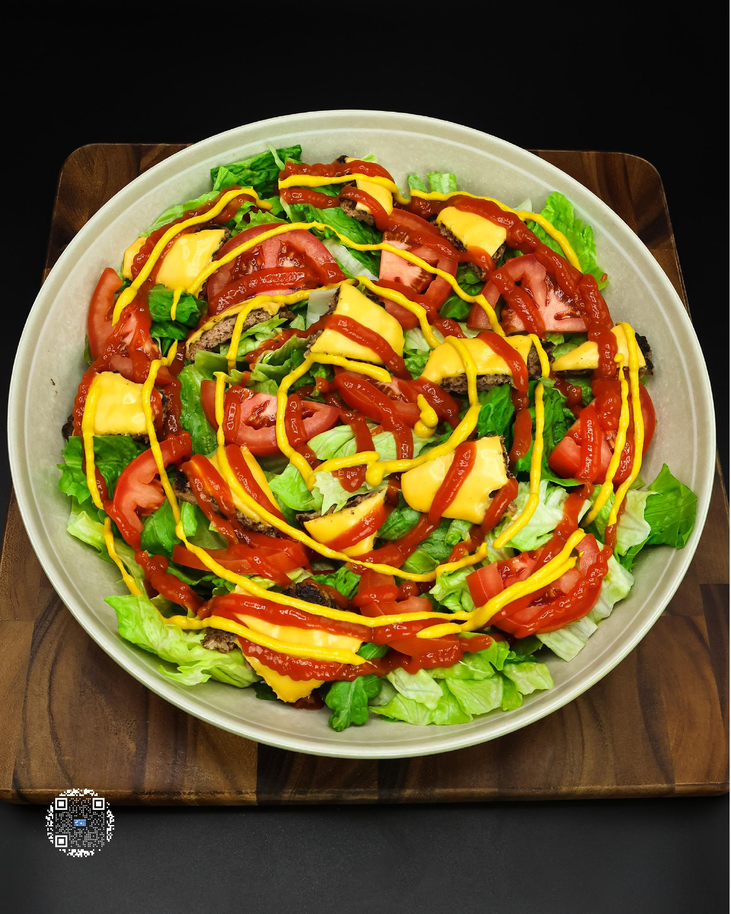

## Additional Recipe Pages

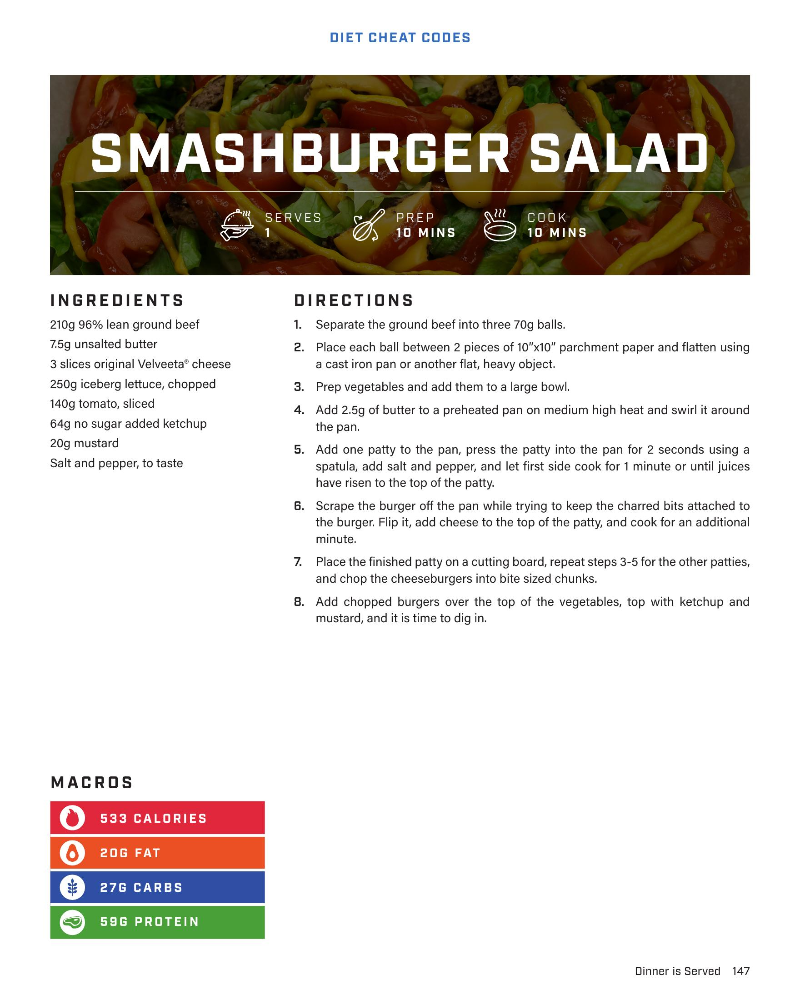

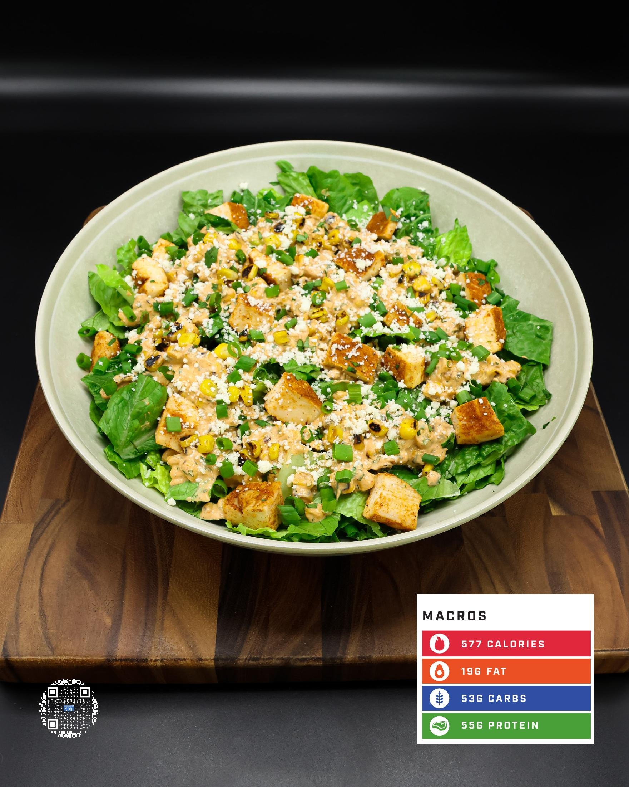

## Source Pages

147, 148, 149

---

# SMASHBURGER

**Serves:** 1 | **Prep:** 5 MINS | **Cook:** 5 MINS

## Macros

| Calories | Fat | Carbs | Net Carbs | Protein |
|----------|-----|-------|-----------|---------|
| 487 | 20 | 34 | undefined | 43 |

## Ingredients

- PROTEIN BUN (or bun of choice)
- 4g unsalted butter (for bun)
- Two 70g 93% lean ground beef balls
- 5g unsalted butter (for pan)
- Salt and black pepper, to taste
- 1 slice original Velveeta® cheese
- Tomatoes, thinly sliced
- Lettuce, finely chopped
- 15g no sugar added ketchup

## Directions

1. Sandwich each ball of meat between 2 pieces of 10x10” parchment paper and flatten using a cast iron pan or another flat, heavy object.
2. Prep vegetables, spread 2g of butter on each bun, then place buns butter side down on a preheated pan on medium-high heat, and toast for 1-2 minutes.
3. Remove bun from the pan, then add 2.5g of butter and swirl it around the pan.
4. Add one patty, press into pan for 2 seconds, add salt and pepper, and let the first side cook for 1 minute or until juices have risen to the top of the patty.
5. Scrape burger off the pan, trying to keep the charred bits attached to the burger and flip it. Add cheese to the top of the patty and cook for an additional minute.
6. Place the finished patty on the toasted bottom bun, repeat steps 4 and 5 for the second patty, and place the second patty on top of the first patty.
7. Add tomatoes and lettuce directly onto the patties, put desired ketchup on top bun, and place onto the veggies for a completed burger.

## Tips

If you have a range hood or another way to ventilate your kitchen, I would utilize it. There will be a lot of smoke from the charring of the ground beef that is necessary to get that authentic smash burger taste. If you don’t have a range hood, opening windows with a fan pointing towards the window would also be a great way to mitigate the smoke.

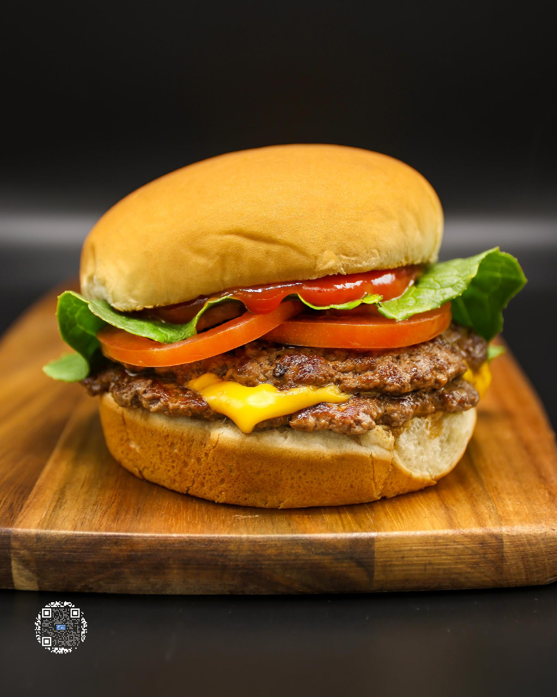

## Additional Recipe Pages

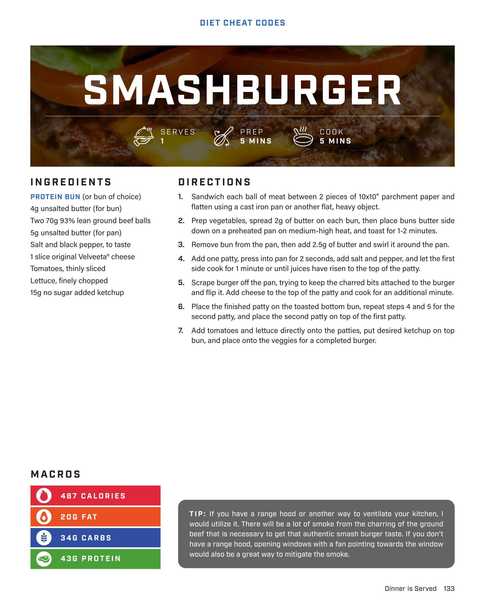

## Source Pages

133, 134

---

# STEAK TACOS

**Serves:** 5-8 | **Prep:** 4.5 HRS | **Cook:** 10 MINS

## Macros

| Calories | Fat | Carbs | Net Carbs | Protein |
|----------|-----|-------|-----------|---------|
| 438 | 19 | 25 | N/A | 39 |

## Ingredients

- 2-3lb skirt steak
- Corn tortillas (35-40 cal)

### MARINADE

- 4g garlic, minced
- 5g Tajin original
- 2g habanero powder
- 2g black pepper
- 30g soy sauce
- 20g avocado oil
- 5g salt

### TOPPINGS

- 60g onion, chopped
- 10g fresh cilantro, chopped
- 14g oaxacacheese, shredded

### ONE SERVING

- 3 tortillas
- 126g cooked skirt steak
- 14g oaxacacheese, shredded
- Cilantro and onion, to taste

## Directions

1. Trim any excess fat from the skirt steak and tenderize using pointed teeth side of tenderizer.
2. Place steak in a gallon zipper bag and add all of the Marinade Ingredients to the bag.
3. Close bag and shake to cover the steak thoroughly in marinade. Making sure every crevice of the steak has marinade on it is important for even flavor.
4. Place the bag in the fridge for a minimum of 4 hours and up to 24. More time = more flavor.
5. Turn grill to high and let it preheat for 15 minutes.
6. Cook steaks on the grill, 2-3 minutes per side.
7. Wrap steak in aluminum foil and let sit on the counter for 15-30 minutes.
8. Dice an onion, chop cilantro, and shred cheese for taco topping.
9. Cut steak against the grain into bite-sized pieces.
10. Weigh out 126g of cooked steak, heat up 3 tortillas, add Toppings, and enjoy!

## Tips

When getting your steak from the store ask the deli to cut the fat off for you. This will save you time.You can also do this in a pan, but there will be a ton of smoke. If your kitchen doesn't have a vent hood, you are guaranteed to set off fire alarms. I would suggest opening a couple of windows and facing a fan towards the window to ventilate the smoke.

## Additional Recipe Pages

## Source Pages

103, 104

---

# TACO MAC AND CHEESE

**Serves:** 4 | **Prep:** 10 MINS | **Cook:** 30 MINS

## Macros

| Calories | Fat | Carbs | Net Carbs | Protein |
|----------|-----|-------|-----------|---------|
| 0 | N/A | N/A | N/A | N/A |

## Ingredients

- 448g 96% lean ground beef
- 7.5g all-purpose flour
- 1.5g chili powder
- 1g crushed red pepper
- 2g ground cumin
- 1g garlic powder
- 1g onion powder
- .5g dried oregano
- 2g smoked paprika
- 4.5g salt
- 2g MSG
- 1.5g black pepper
- 75g tomato paste
- 480g beef bone broth
- 7g gelatin
- 220g fat-free milk
- 196g small shell pasta
- 3g salt
- 6 slices jalapeño Velveeta® cheese
- 56g fat-free cheddar cheese, shredded
- 56g 2% cheddar cheese, shredded
- 140g 2% greek yogurt

## Directions

1. Mix flour, chili powder, red pepper, cumin, garlic powder, onion powder, oregano, smoked paprika, salt, MSG, and black pepper in a small bowl. (Omit chili powder and red pepper if heat sensitive.)
2. Add ground beef to a preheated pan on medium heat and spread evenly for maximum browning.
3. Place a heavy object (like another pan) on top of the beef to enhance browning, leaving room for moisture to escape. Cook 7-9 minutes.
4. Sprinkle gelatin over broth and let it absorb.
5. Crumble beef into smaller pieces, stir in the seasoning mixture, and cook for 30 seconds. Slightly reduce heat.
6. Add tomato paste to beef, mix thoroughly, and cook for 30 seconds.
7. Stir in the bloomed broth-gelatin mixture and milk.
8. Scrape the bottom of the pan to loosen and incorporate any browned bits stuck to the pan.
9. Add pasta and 3g salt, stirring to combine. Bring mixture to a simmer and reduce for 10-12 minutes, stirring occasionally.
10. Remove pan from heat, add Velveeta®, and let it melt for 1 minute.
11. Stir thoroughly, add both cheddar cheeses, and mix again.
12. Finish by stirring in Greek yogurt until fully combined.

## Tips

To reheat, microwave for 60 seconds, stir in 15-20g of milk, then microwave for another 60 seconds. If you want it more creamy, stir in an additional 15-20g of milk and microwave for a final 30 seconds.

## Source Pages

112

---

# APPLE PIE ICE CREAM

**Serves:** 1 | **Prep:** 10 MINS | **Cook:** 5 MINS

## Macros

| Calories | Fat | Carbs | Net Carbs | Protein |
|----------|-----|-------|-----------|---------|
| 375 | 11 | 68 | 28 | 41 |

## Ingredients

### WET

- 410g 1% milk
- 4.2g vanilla extract
- 1 egg yolk (or 20g extra milk)

### DRY

- 20g PEScience Snickerdoodle protein powder
- 40g granulated erythritol
- 1g apple pie spice
- 1g salt
- 1g xanthan gum

### MIX-INS

- 12g Apple Toast Crunch® cereal
- 20g apple, peeled and diced
- Pinch granulated erythritol
- Pinch ground cinnamon

## Directions

1. Pour Wet Ingredients directly into the pint.
2. In a small bowl, add Dry Ingredients and whisk together.
3. Put a small hand blender into the bottom of your pint and start blending the Wet Ingredients together. Slowly add your Dry Ingredients into the middle of the pint.
4. Once all Dry Ingredients have dissolved in the pint, continue blending for 90 seconds.
5. Put the top on the pint and freeze for 24 hours.
6. Take the frozen pint, run it under hot water for 60 seconds, load it into the CREAMi®, and hit the ice cream button.
7. While the pint is being mixed, peel and dice ½ of an apple.
8. Top with erythritol and cinnamon and mix into the pieces of apple until evenly distributed.
9. Once the first spin is finished, load pint right back up for a re-spin.
10. Using a butter knife, make a hole in the middle of the pint about 1" in diameter, pull the ice cream out, and load the Mix-ins into the middle by adding a layer of apple followed by a layer of cereal.
11. Load the pint back up, press the mix-in setting, and enjoy some apple pie.

## Tips

Leave a couple grams of Mix-ins to the side to top your pint with when it is finished.

## Additional Recipe Pages

## Source Pages

281, 282

---

# CHERRY CHOCOLATE CHUNK

**Serves:** 1 | **Prep:** 10 MINS | **Cook:** 5 MINS

## Macros

| Calories | Fat | Carbs | Net Carbs | Protein |
|----------|-----|-------|-----------|---------|
| 497 | 22 | 78 | 38 | 39 |

## Ingredients

### WET

- 20g cherry juice, jarred
- 380g 2% milk
- 2 egg yolks
- 4.2g vanilla extract

### DRY

- 16g PEScience Gourmet Vanilla protein
- 40g granulated erythritol
- .5g salt
- .8g xanthan gum

### MIX-INS

- 5 bing cherries, jarred
- 14g dark chocolate

## Directions

1. Add Wet Ingredients into a high sided container.
2. In a measuring cup, add Dry Ingredients and whisk together.
3. Put an immersion blender in the bottom of the container and start blending the Wet Ingredients together. Slowly add your Dry Ingredients into the container.
4. Once all Dry Ingredients have dissolved, continue blending for 90 seconds.
5. Add the liquid to a pint, put the top on, and freeze for 24 hours.
6. Take the frozen pint, run it under hot water for 60 seconds, load it into the CREAMi®, and hit the sorbet button.
7. While mixing, chop chocolate into 1/8" chunks and press cherries into paper towels to remove excess liquid.
8. Using a butter knife, make a hole in the middle of the pint about 1" in diameter, pull the ice cream out, and load the Mix-ins up by adding a layer of chocolate followed by a layer of cherries. Repeat layering until all Mix-ins are added.
9. Place the previously removed ice cream into the pint, reload the pint, and press the mix-in setting.
10. Grab a spoon and enjoy.

## Tips

You can deseed, juice, and strain your own cherries in place of the jarred cherries and cherry juice. Also, you can make a homemade version of jarred cherries. Please refer to the recipe video for more detailed information.

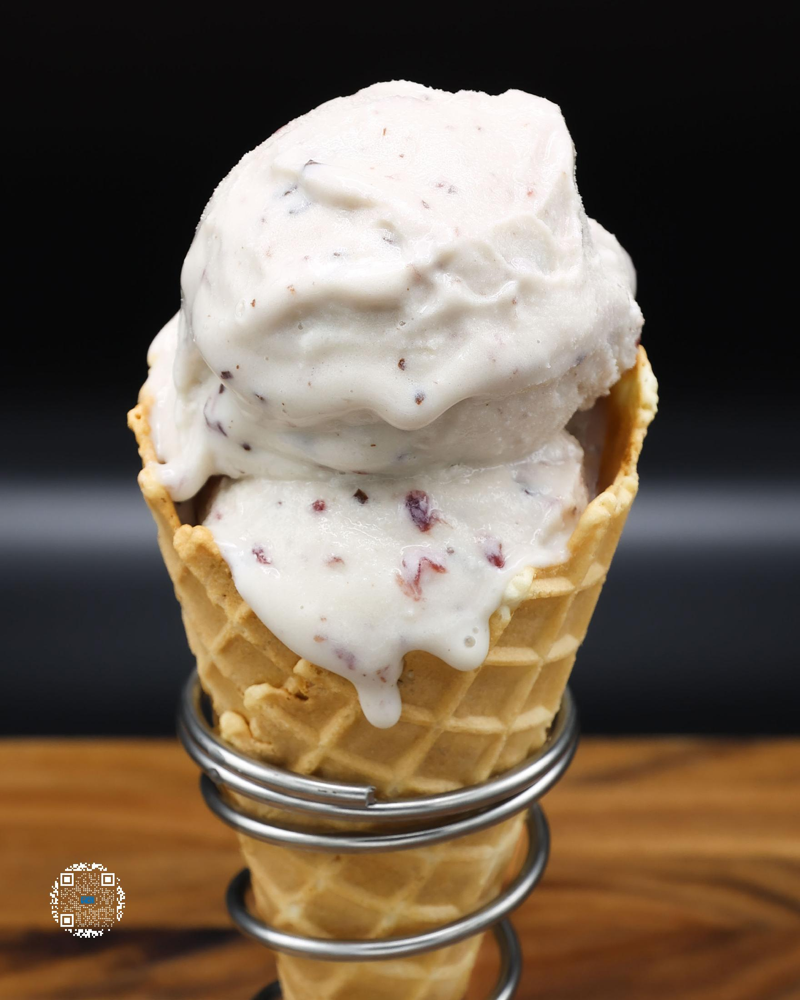

## Additional Recipe Pages

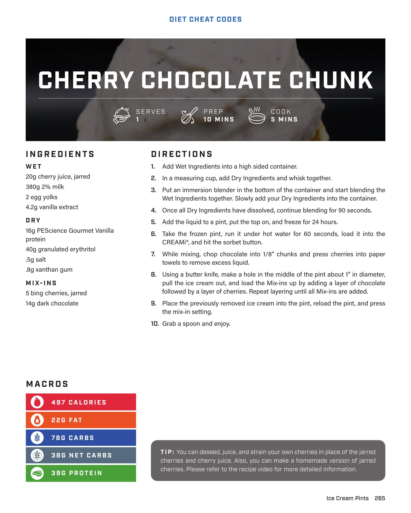

## Source Pages

265, 266

---

# CHOCOLATE BASE “BEST”

**Serves:** 1 | **Prep:** 10 MINS | **Cook:** 5 MINS

## Macros

| Calories | Fat | Carbs | Net Carbs | Protein |
|----------|-----|-------|-----------|---------|
| 345 | 14 | 71 | 21 | 28 |

## Ingredients

### WET

- 410g 1% milk
- 1 egg yolk
- 2.1g vanilla extract
- 14g semi-sweet chocolate, melted

### DRY

- 50g granulated erythritol
- 10g cocoa powder
- 1g salt
- 1g xanthan gum

## Directions

1. Pour milk, an egg yolk, and vanilla extract into a high sided container and mix for 30 seconds using an immersion blender.
2. In a small bowl, add Dry Ingredients and mix to combine.
3. Microwave the wet ingredients for 30-60 seconds or until they reach 80-90°F and stir using a spoon.
4. Add chocolate to a small bowl and microwave for 45-60 seconds or until melted. Put on a glove and stir with a rubber spatula.
5. Add melted chocolate to the wet ingredients and mix for 30 seconds.
6. While blending, slowly add your Dry Ingredients into the container.
7. Once all Dry Ingredients have dissolved, continue blending for 90 seconds.
8. Add the liquid to a pint, put the top on, and freeze for 36 hours.
9. Take the frozen pint, run it under hot water for 60 seconds, load it into the CREAMi™, and hit the light ice cream button.
10. Once the first spin is finished, load pint right back up and hit the mix-in setting.
11. Adjust creaminess with an additional mix-in/re-spin if necessary.
12. Grab a spoon and enjoy.

## Tips

For a soft serve like consistency, run the re-spin setting instead.

## Notes

Do this as quickly as possible. We want to make sure the chocolate stays melted and fully mixes into the milk mixture. As an added precaution, you can strain the liquid while pouring it into the pint to ensure that no solid particles are introduced into the container.

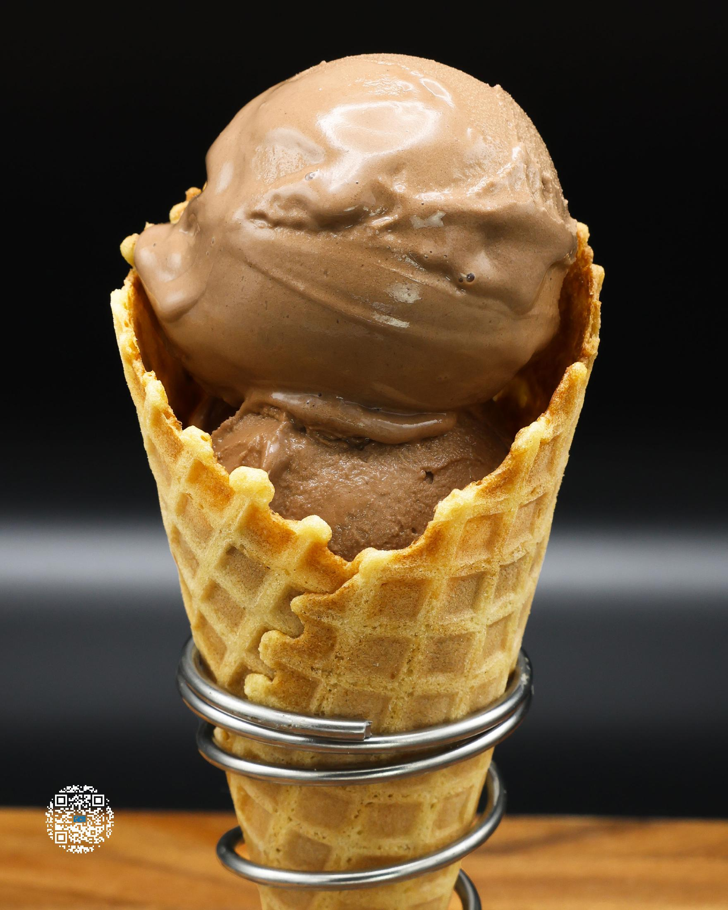

## Additional Recipe Pages

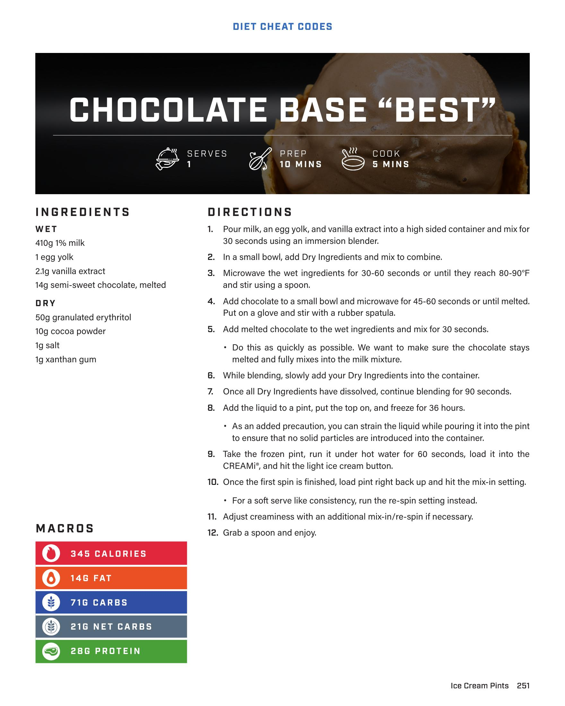

## Source Pages

251, 252

---

# CHOCOLATE BASE "BETTER"

**Serves:** 1 | **Prep:** 5 MINS | **Cook:** 5 MINS

## Macros

| Calories | Fat | Carbs | Net Carbs | Protein |
|----------|-----|-------|-----------|---------|
| 225 | 6 | 62 | 12 | 25 |

## Ingredients

### WET

- 440g 1% milk
- 2.1g vanilla extract

### DRY

- 50g granulated erythritol
- 8g cocoa powder
- 1g salt
- 1g xanthan gum

## Directions

1. Pour Wet Ingredients directly into the pint.
2. In a small bowl, add Dry Ingredients and whisk together.
3. Put a small hand blender into the bottom of your pint and start blending the Wet Ingredients together. Slowly add your Dry Ingredients into the middle of the pint.
4. Once all Dry Ingredients have dissolved in the pint, continue blending for 90 seconds.
5. Put the top on the pint and freeze for 24 hours.
6. Take the frozen pint, run it under hot water for 60 seconds, load it into the CREAMi®, and hit the light ice cream button.
7. Once the first spin is finished, load pint right back up and hit the mix-in setting.
8. Adjust creaminess with an additional mix-in/re-spin if necessary.
9. Grab a spoon and enjoy.

## Tips

For a soft serve like consistency, run the re-spin setting instead.

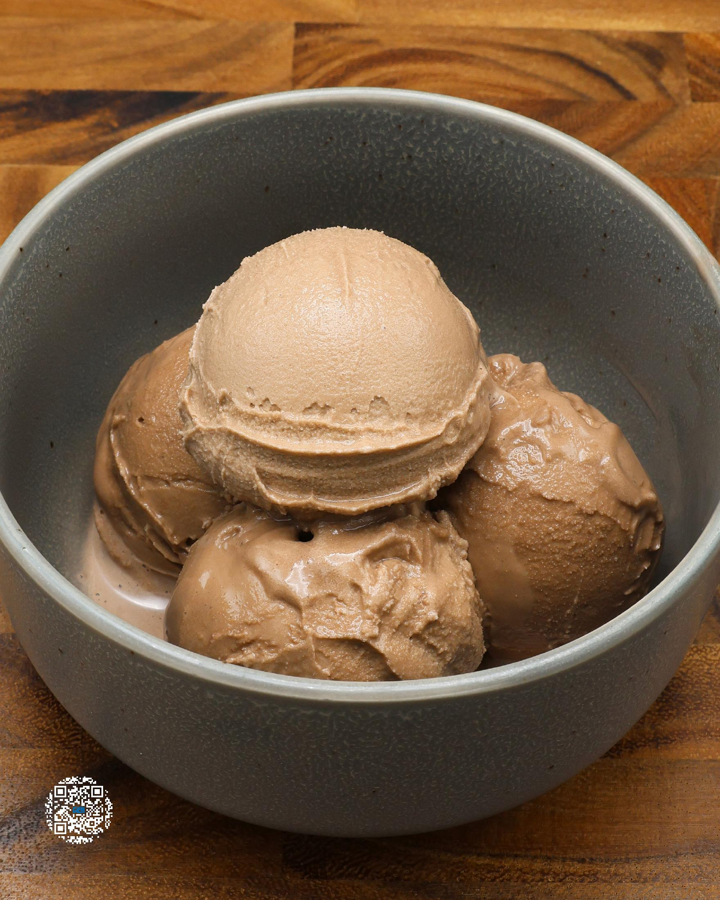

## Additional Recipe Pages

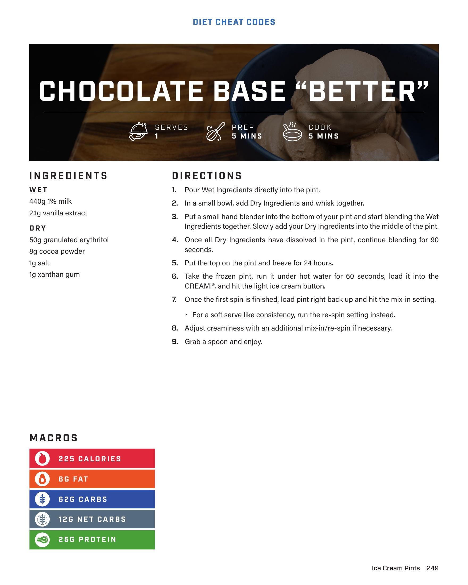

## Source Pages

249, 250

---

# CHOCOLATE BASE "GOOD"

**Serves:** 1 | **Prep:** 5 MINS | **Cook:** 5 MINS

## Macros

| Calories | Fat | Carbs | Net Carbs | Protein |
|----------|-----|-------|-----------|---------|
| 143 | 6 | 58 | 6 | 11 |

## Ingredients

### WET

- 160g 1% milk
- 280g unsweetened almond milk
- 2.1g vanilla extract

### DRY

- 50g granulated erythritol
- 8g cocoa powder
- 1g salt
- 1g xanthan gum

## Directions

1. Pour Wet Ingredients directly into the pint.
2. In a small bowl, add Dry Ingredients and whisk together.
3. Put a small hand blender into the bottom of your pint and start blending the Wet Ingredients together. Slowly add your Dry Ingredients into the middle of the pint.
4. Once all Dry Ingredients have dissolved in the pint, continue blending for 90 seconds.
5. Put the top on the pint and freeze for 24 hours.
6. Take the frozen pint, run it under hot water for 60 seconds, load it into the CREAMI®, and hit the light ice cream button.
7. Once the first spin is finished, load pint right back up and hit the mix-in setting.
8. For a soft serve like consistency, run the re-spin setting instead.
9. Adjust creaminess with an additional mix-in/re-spin if necessary.
10. Grab a spoon and enjoy.

## Additional Recipe Pages

## Source Pages

247, 248

---

# CHOCOLATE CHIP COOKIE DOUGH

**Serves:** 1 | **Prep:** 15 MINS | **Cook:** 5 MINS

## Macros

| Calories | Fat | Carbs | Net Carbs | Protein |
|----------|-----|-------|-----------|---------|
| 499 | 15 | 44 | 28 | 58 |

## Ingredients

### WET

- 430g 2% milk
- 4.2g vanilla extract

### DRY

- 32.4g Gorilla Mode Vanilla Ice Cream protein
- 10g granulated erythritol
- .5g salt
- .5g xanthan gum

### MIX-INS

- 50g cookie dough

## Directions

1. Make COOKIE DOUGH V2 and refrigerate.
2. Add Wet Ingredients into a high-sided container.
3. In a measuring cup, add Dry Ingredients and whisk together.
4. Put an immersion blender in the bottom of the container and start blending the Wet Ingredients together. Slowly add your Dry Ingredients into the container.
5. Once all Dry Ingredients have dissolved, continue blending for 90 seconds.
6. Add the liquid to a pint, put the top on, and freeze for 24 hours.
7. Take the frozen pint, run it under hot water for 60 seconds, load it into the CREAMi®, and hit the sorbet button.
8. Using a butter knife, make a hole in the middle of the pint about 1" in diameter, pull the ice cream out, and load the cookie dough into the center.
9. Place the previously removed ice cream into the pint, reload the pint, and press the mix-in setting.
10. Grab a spoon and enjoy.

## Tips

Don't pull the cookie dough out of the fridge until you need to fill the center. This will keep it in the perfect sized chunks after the mix-in setting.

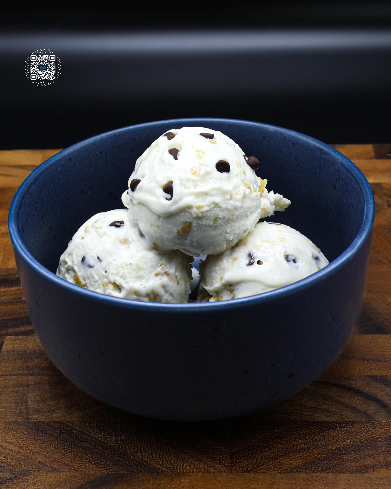

## Additional Recipe Pages

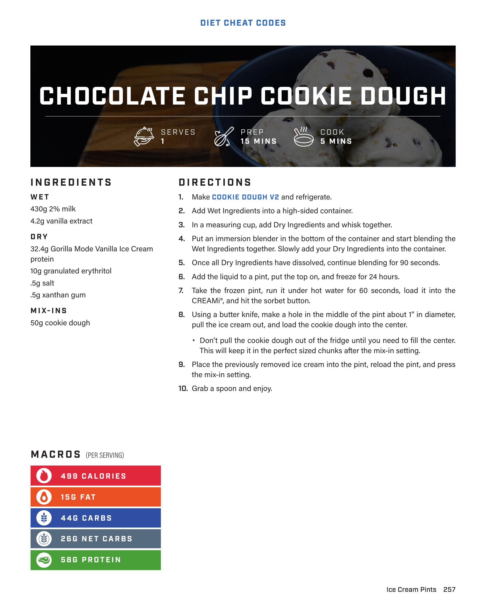

## Source Pages

257, 258

---

# CHOCOLATE CHIP

**Serves:** 1 | **Prep:** 15 MINS | **Cook:** 15 MINS

## Macros

| Calories | Fat | Carbs | Net Carbs | Protein |
|----------|-----|-------|-----------|---------|
| 495 | 23 | 51 | 31 | 41 |

## Ingredients

### MELTING CHOCOLATE

- 113g semi-sweet chocolate bar
- 7g peanut oil

### WET

- 410g 2% milk
- 1 egg yolk
- 1 vanilla bean
- 4.2g vanilla extract

### DRY

- 16.2g Gorilla Mode Vanilla Ice Cream protein
- 8g fat-free milk powder
- 20g granulated erythritol
- 0.5g salt
- 0.7g xanthan gum

### MIX-INS

- 26g melting chocolate

## Directions

1. Fill a small pot with 1" of water and bring to a simmer. Place a ceramic bowl over the pot, making sure it's wider than the pot. Add the chocolate and melt.
2. Stir in oil with a whisk until combined.
3. Line a quarter sheet pan or small tray with parchment paper.
4. Spread melted chocolate into a thin layer on the pan and freeze until solid.
5. Chop frozen chocolate into bite-sized pieces, quickly transfer to a plastic bag, and freeze. Makes enough for 5 pints.
6. Using a knife, cut a vanilla bean pod down the middle, scrape the beans out of the inside of the pod, and add to a high-sided container.
7. Add remaining wet ingredients into the high-sided container.
8. Place the dry ingredients in a measuring cup and whisk to combine.
9. With an immersion blender at the bottom of the container, start blending wet ingredients while gradually adding dry ingredients.
10. Once all dry ingredients dissolve, blend for another 90 seconds.
11. Pour into a pint, cover, and freeze for 24 hours.
12. Take the frozen pint, run the sides and bottom under hot water for 1 minute, load it into the CREAMi®, and hit the light ice cream button.
13. Use a butter knife to make a 1" hole in the center of the pint, remove the ice cream, and take the chocolate out of the freezer.
14. Quickly add the chocolate to the pint, return the ice cream, reload, and run the mix-in setting. Push down the chocolate so most of it sits near the bottom of the pint. This ensures it spreads evenly throughout during the mix-in setting.

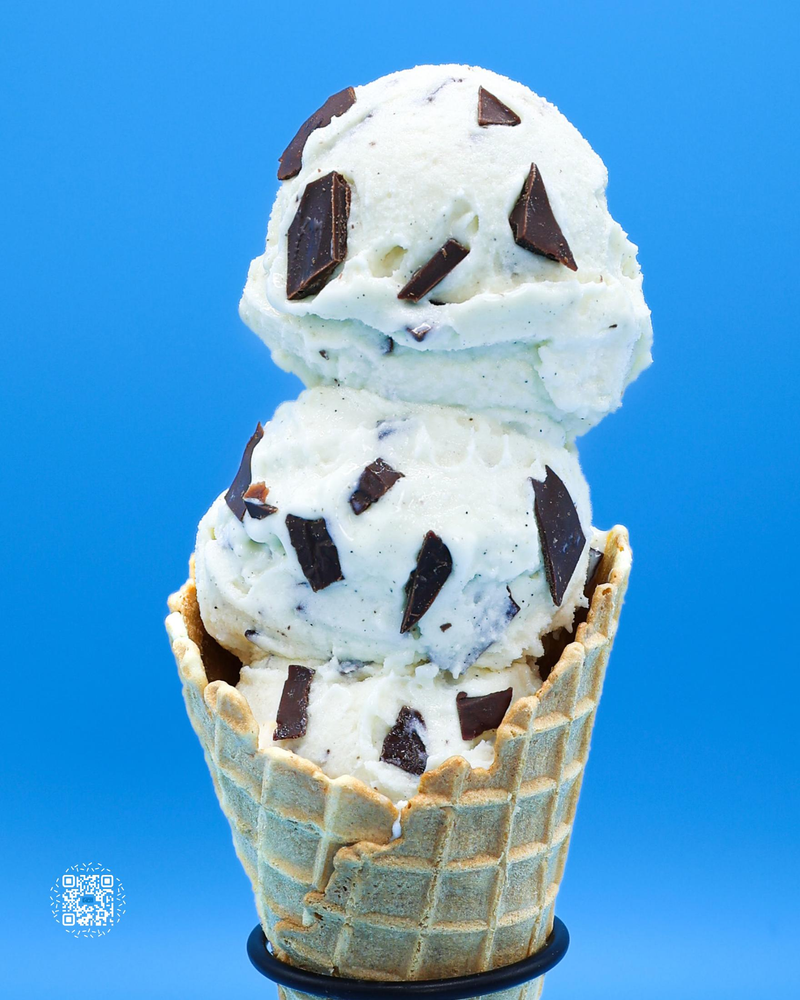

## Additional Recipe Pages

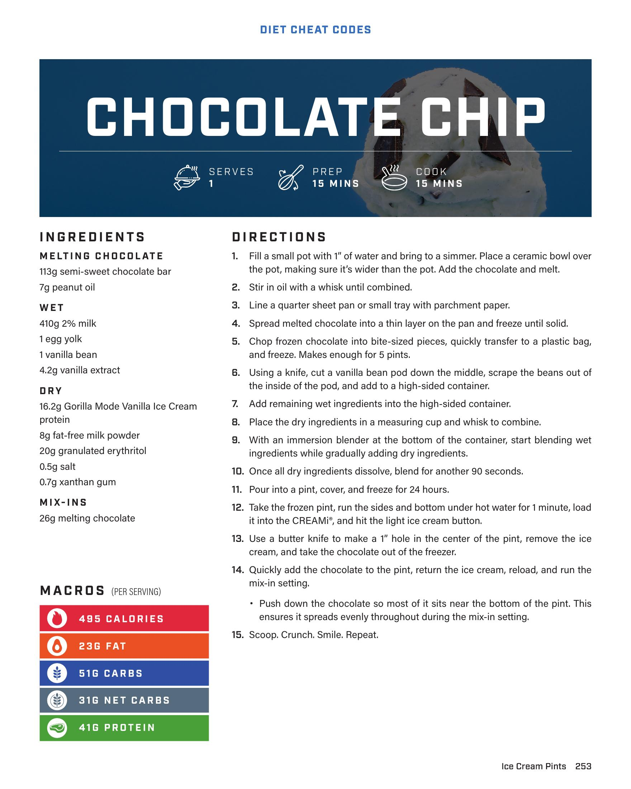

## Source Pages

253, 254

---

# COCOA CRISPS ICE CREAM

**Serves:** 1 | **Prep:** 5 MINS | **Cook:** 5 MINS

## Macros

| Calories | Fat | Carbs | Net Carbs | Protein |
|----------|-----|-------|-----------|---------|
| 176 | 6 | 64 | 14 | 12 |

## Ingredients

### WET

- 160g 1% milk
- 280g unsweetened almond milk

### DRY

- 50g granulated erythritol
- 1g salt
- 1g xanthan gum
- 8g dutch-processed cocoa powder

### MIX-INS

- 10g Cocoa Pebbles® cereal

## Directions

1. Pour Wet Ingredients directly into the pint.
2. In a small bowl, add Dry Ingredients and whisk together.
3. Put a small hand blender into the bottom of your pint and start blending the Wet Ingredients together. Slowly add your Dry Ingredients into the middle of the pint.
4. Once all Dry Ingredients have dissolved in the pint, continue blending for 90 seconds.
5. Put the top on the pint and freeze for 24 hours.
6. Take the frozen pint, run it under hot water for 40 seconds, load it into the CREAMi®, and hit the ice cream button.
7. Get Mix-ins ready and once the first spin is finished, load pint right back up for a re-spin.
8. Using a butter knife, make a hole in the middle of the pint about 1" in diameter, pull the ice cream out, and load the Cocoa Pebbles® into the middle. PRO TIP: Leave a couple grams of cereal on the side to top your pint with when it is finished.
9. Load the pint back up, press the mix-in setting, and you now have a cream that is ready to eat.

## Tips

Add 1-2 drops of coffee extract to the Wet Ingredients to get an even deeper and more satisfying chocolate flavor. PRO TIP: Leave a couple grams of cereal on the side to top your pint with when it is finished.

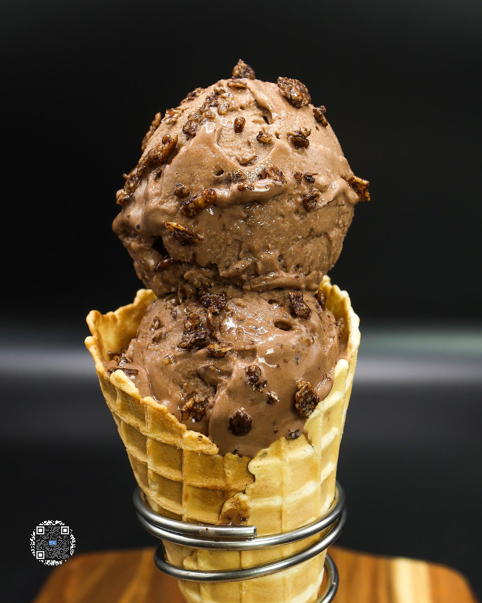

## Additional Recipe Pages

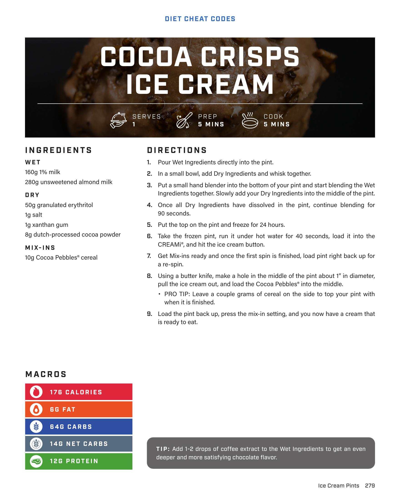

## Source Pages

279, 280

---

# COOKIES & CREAM

**Serves:** 1 | **Prep:** 5 MINS | **Cook:** 5 MINS

## Macros

| Calories | Fat | Carbs | Net Carbs | Protein |
|----------|-----|-------|-----------|---------|
| 512 | 12 | 61 | 51 | 49 |

## Ingredients

### WET

- 410g fat-free milk
- 1 Oreo®
- 4.2g vanilla extract

### DRY

- 35.6g Gorilla Mode Cookies & Cream protein
- 10g granulated erythritol
- 4g black cocoa powder
- .5g salt
- .5g xanthan gum

### MIX-INS

- 2 Oreos®, frozen
- 1 Oreo®, chopped

## Directions

1. Pour milk into a high sided container, dunk an Oreo® for 15-20 seconds, and add the wet cookie to a plastic bag. Repeat, seal the plastic bag, and freeze.
2. Add an Oreo® and vanilla extract to the container.
3. In a measuring cup, add Dry Ingredients and whisk together.
4. Using an immersion blender, start blending the Wet Ingredients together. Slowly add the Dry Ingredients into the middle of the pint.
5. Once all Dry Ingredients have dissolved, continue blending for 90 seconds.
6. Put the top on the pint and freeze for 24 hours.
7. Take the frozen pint, run it under hot water for 1 minute, load it into the CREAMI®, and hit the sorbet button.
8. Once the first spin is finished, make a hole near the side of the pint about 1" in diameter.
9. Chop the frozen Oreos® in half and fill the hole.
10. Add the ice cream that was taken out back on top, load it into the CREAMI®, and hit the mix-in function.
11. Chop up a fresh Oreo® and top cream with cookie crumbles.
12. Eat.

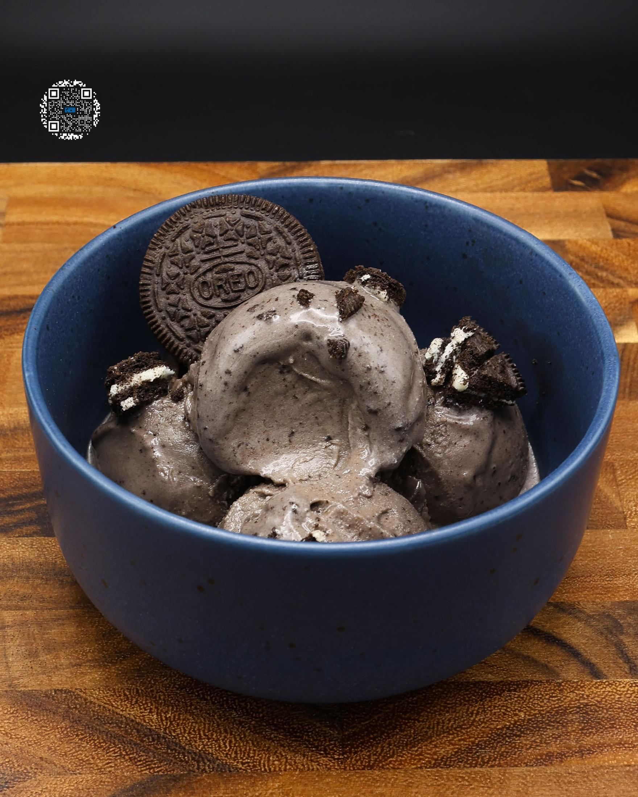

## Additional Recipe Pages

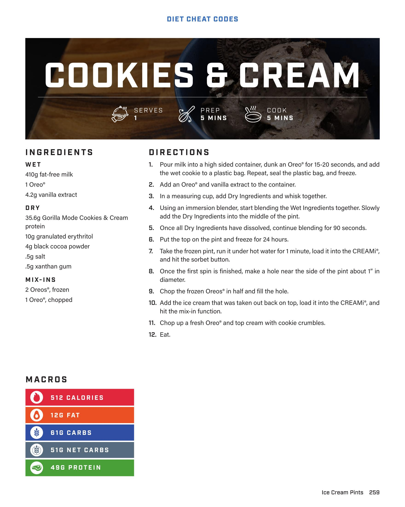

## Source Pages

259, 260

---

# COOKIES N' CREAM NICKFLURRY

**Serves:** 1 | **Prep:** 5 MINS | **Cook:** 5 MINS

## Macros

| Calories | Fat | Carbs | Net Carbs | Protein |
|----------|-----|-------|-----------|---------|
| 496 | 14 | 61 | 41 | 49 |

## Ingredients

### WET

- 430g 1% milk
- 4.2g vanilla extract

### DRY

- 32.4g Gorilla Mode Vanilla Ice Cream protein
- 20g granulated erythritol
- .5g salt
- .5g xanthan gum

### MIX-INS

- 39g mini Oreos®

## Directions

1. Add wet ingredients into a high-sided container.
2. In a measuring cup, add dry ingredients and whisk together.
3. Using an immersion blender, start blending the wet ingredients. Slowly add the dry ingredients into the middle of the pint.
4. Once all dry ingredients have dissolved, continue blending for 90 seconds.
5. Add the blended liquid to a pint and freeze for 24 hours.
6. Take the frozen pint, run the sides and bottom under hot water for 1 minute, load it into the CREAMI®, and hit the light ice cream button.
7. Using a butter knife, make a hole in the middle of the pint about 1" in diameter, pull the ice cream out, and load 28g mini Oreos® into the center.
8. Add the ice cream that was taken out back on top, load it into the CREAMI®, and hit the mix-in function.
9. Chop 11g Oreos®, add to the top of the cream, and grab a spoon.

## Tips

I like to add half the chopped Oreos® at the start and then the other half when I am halfway through the pint. This gives you crunchy pieces of cookie throughout the entire pint.

## Additional Recipe Pages

## Source Pages

267, 268

---

# COOKIES N' CRUNCH ICE CREAM

**Serves:** 1 | **Prep:** 5 MINS | **Cook:** 5 MINS

## Macros

| Calories | Fat | Carbs | Net Carbs | Protein |
|----------|-----|-------|-----------|---------|
| 169 | 6 | 6 | 1 | 11 |

## Ingredients

### WET

- 160g 1% milk
- 280g unsweetened almond milk
- 2.1g vanilla extract

### DRY

- 50g granulated erythritol
- 1g salt
- 1g xanthan gum
- 8g black cocoa powder

### MIX-INS

- 10g Oreo O's® cereal

## Directions

1. Pour Wet Ingredients directly into the pint.
2. In a small bowl, add Dry Ingredients and whisk together.
3. Put a small hand blender into the bottom of the pint and start blending the Wet Ingredients together. Slowly add your Dry Ingredients into the middle of the pint.
4. Once all Dry Ingredients have dissolved in the pint, continue blending for 90 seconds.
5. Put the top on the pint and freeze for 24 hours.
6. Take the frozen pint, run it under hot water for 40 seconds, load it into the CREAMi®, and hit the ice cream button.
7. Get Mix-ins ready and once the first spin is finished, load pint right back up for a re-spin.
8. Using a butter knife, make a hole in the middle of the pint about 1" in diameter, pull the ice cream out, and load the Oreo O's® into the middle.
9. Load the pint back up, press the mix-in setting, and you now have a cream that is ready to eat.

## Tips

Want to take this cream to the next level? Add 10g of mini marshmallows (+34 calories) to your Mix-ins and layer them into the middle of the pint before loading it back up for the mix-in setting. Leave a couple grams of cereal on the side to top your pint with when it is finished.

## Additional Recipe Pages

## Source Pages

277, 278

---

# CRUNCHY CINNAMON SQUARES ICE CREAM

**Serves:** 1 | **Prep:** 5 MINS | **Cook:** 5 MINS

## Macros

| Calories | Fat | Carbs | Net Carbs | Protein |
|----------|-----|-------|-----------|---------|
| 162 | 5 | 66 | 16 | 10 |

## Ingredients

### WET

- 160g 1% milk
- 280g unsweetened almond milk
- 4.2g vanilla extract

### DRY

- 50g granulated erythritol
- 1.5g ground cinnamon
- 1g salt
- 1g xanthan gum

### MIX-INS

- 10g Cinnamon Toast Crunch® cereal

## Directions

1. Pour Wet Ingredients directly into the pint.
2. In a small bowl add Dry Ingredients and whisk together.
3. Put a small hand blender into the bottom of your pint and start blending the Wet Ingredients together. Slowly add your Dry Ingredients into the middle of the pint.
4. Once all Dry Ingredients have dissolved in the pint, continue blending for 90 seconds.
5. Put the top on the pint and freeze for 24 hours.
6. Take the frozen pint, run it under hot water for 40 seconds, load it into the CREAMi®, and hit the ice cream button.
7. Get Mix-ins ready and once the first spin is finished, load pint right back up for a re-spin.
8. Using a butter knife, make a hole in the middle of the pint about 1" in diameter, pull the ice cream out, and load the Cinnamon Toast Crunch® into the middle.
9. Load the pint back up, press the mix-in setting, and you now have a cream that is ready to eat.

## Tips

Leave a couple grams of cereal on the side to top your pint with when it is finished.

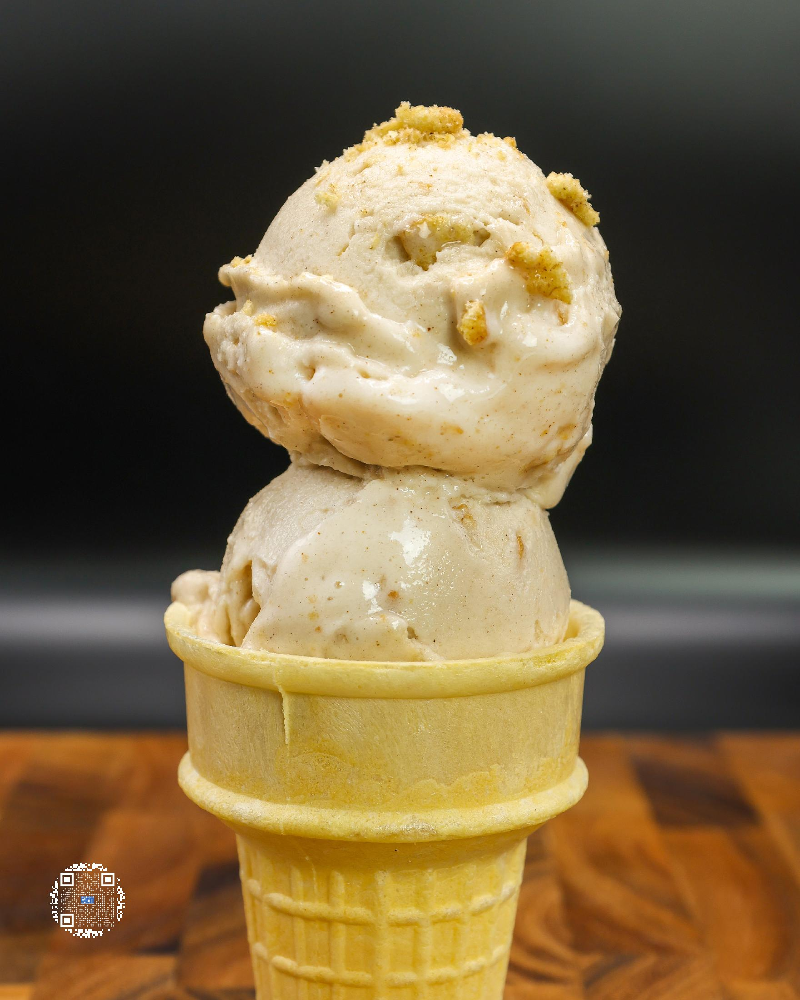

## Additional Recipe Pages

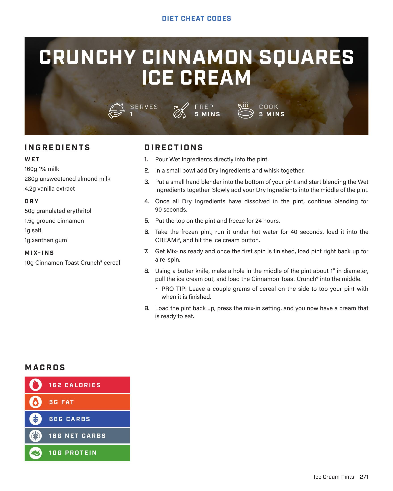

## Source Pages

271, 272

---

# EGGNOG ICE CREAM

**Serves:** 1 | **Prep:** 5 MINS | **Cook:** 5 MINS

## Macros

| Calories | Fat | Carbs | Net Carbs | Protein |
|----------|-----|-------|-----------|---------|
| 342 | 10 | 66 | 26 | 35 |

## Ingredients

### WET

- 290g 1% milk
- 120g almond milk eggnog
- 4.2g vanilla extract
- 1 egg yolk (or 20g extra milk)

### DRY

- 20g PEScience Gourmet Vanilla protein powder
- 40g granulated erythritol
- 1g ground cinnamon
- 1g salt
- 1g xanthan gum
- Dash nutmeg

## Directions

1. Pour Wet Ingredients directly into the pint.
2. In a small bowl add Dry Ingredients and whisk together.
3. Put a small hand blender into the bottom of your pint and start blending the Wet Ingredients together. Slowly add your Dry Ingredients into the middle of the pint.
4. Once all Dry Ingredients have dissolved in the pint, continue blending for 90 seconds.
5. Put the top on the pint and freeze for 24 hours.
6. Take the frozen pint, run it under hot water for 60 seconds, load it into the CREAMI®, and hit the ice cream button.
7. Once the first spin is finished, load pint right back up for a re-spin.
8. Load the pint back up, press the mix-in setting, and you now have eggnog ice cream for a fraction of the calories.

## Additional Recipe Pages

## Source Pages

283, 284

---

# FRUITY CRISPS ICE CREAM

**Serves:** 1 | **Prep:** 5 MINS | **Cook:** 5 MINS

## Macros

| Calories | Fat | Carbs | Net Carbs | Protein |
|----------|-----|-------|-----------|---------|
| 205 | 5 | 67 | 27 | 10 |

## Ingredients

### WET

- 160g 1% milk
- 265g unsweetened almond milk
- 4.2g vanilla extract
- 15g Fruity Pebbles syrup

### DRY

- 40g granulated erythritol
- 1g salt
- 1g xanthan gum

### MIX-INS

- 9g Fruity Pebbles cereal

## Directions

1. Pour Wet Ingredients directly into the pint.
2. In a small bowl, add Dry Ingredients and whisk together.
3. Put a small hand blender into the bottom of your pint and start blending the Wet Ingredients together. Slowly add your Dry Ingredients into the middle of the pint.
4. Once all Dry Ingredients have dissolved in the pint, continue blending for 90 seconds.
5. Put the top on the pint and freeze for 24 hours.
6. Take the frozen pint, run it under hot water for 40 seconds, load it into the CREAMi®, and hit the ice cream button.
7. Get Mix-Ins ready and once the first spin is finished, load pint right back up for a re-spin.
8. Using a butter knife, make a hole in the middle of the pint about 1" in diameter, pull the ice cream out, and load the Fruity Pebbles® cereal into the middle.
9. Load the pint back up, press the mix-in setting, and you now have a cream that is ready to eat.

## Tips

Leave a couple grams of cereal on the side to top your pint with when it is finished.

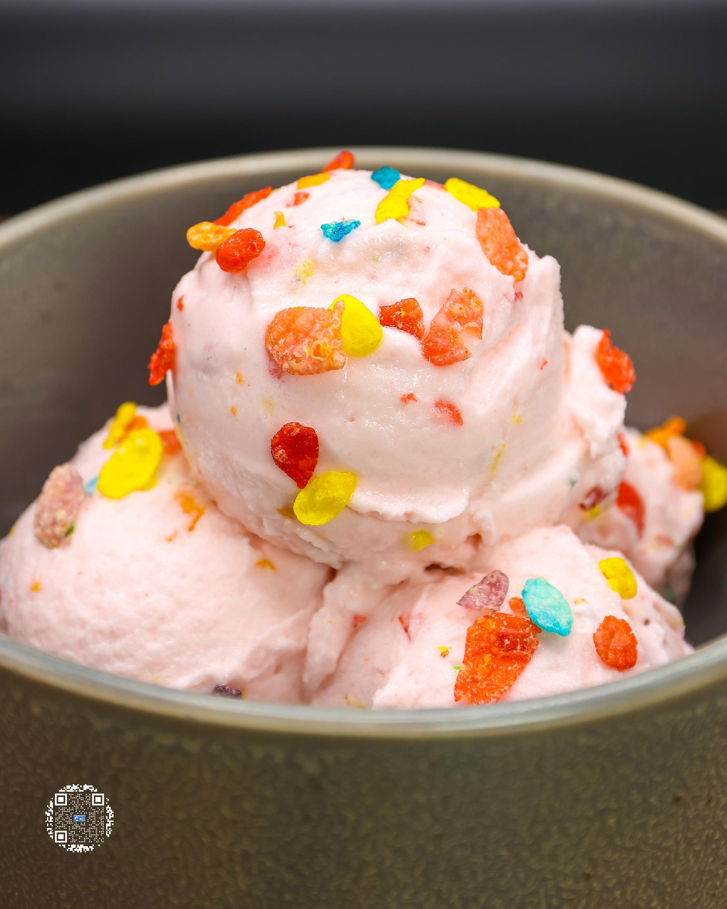

## Additional Recipe Pages

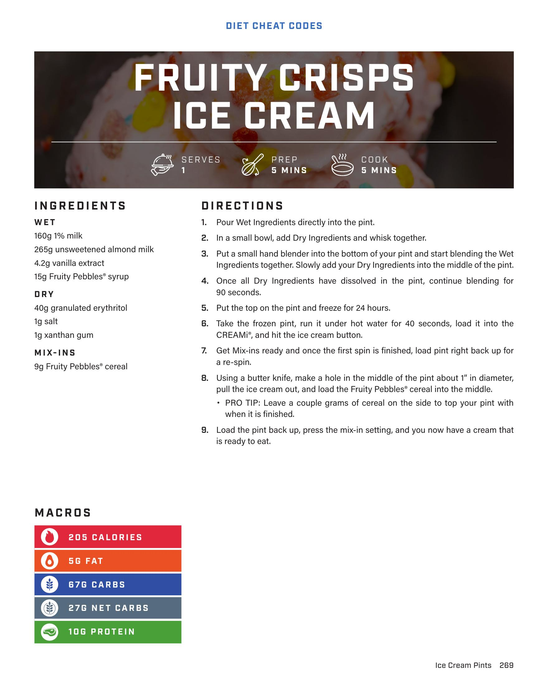

## Source Pages

269, 270

---

# FUDGE BROWNIE

**Serves:** 1 | **Prep:** 15 MINS | **Cook:** 35 MINS

## Macros

| Calories | Fat | Carbs | Net Carbs | Protein |
|----------|-----|-------|-----------|---------|
| 560 | 20 | 70 | 45 | 49 |

## Ingredients

### BROWNIES (8 SERVINGS)

- 1 box SUGAR FREE BROWNIE MIX
- 55g 2% milk
- 28g peanut oil
- 1 egg

### WET

- 410g 1% milk
- 1 egg yolk
- 2.1g vanilla extract
- 6 drops coffee extract

### DRY

- 27.8g Gorilla Mode Milk Chocolate protein
- 20g granulated erythritol
- 12g cocoa powder
- 0.5g salt
- 1g xanthan gum

### MIX-INS/TOPPINGS

- 56g brownie (179 cal), frozen

## Directions

1. Place all brownie ingredients, except the brownie mix, into a bowl and whisk to combine.
2. Add the brownie mix and fold in with a spatula until incorporated the batter should be very thick.
3. Line an 8x8-inch steel pan with parchment paper. Spray your spatula with a little oil so it won't stick, then spread the batter evenly in the pan.
4. Bake in a preheated 350°F oven for 26-30 minutes, or until a toothpick inserted in the center comes out with a few moist crumbs (not wet batter).
5. Once cooled, chop the brownie into bite-sized chunks and store in the freezer.
6. Add wet ingredients into a high-sided container.
7. Place dry ingredients in a measuring cup and whisk to combine.
8. With an immersion blender at the bottom of the container, start blending wet ingredients while gradually adding dry ingredients.
9. Once all dry ingredients dissolve, blend for another 90 seconds.
10. Pour into a pint, cover, and freeze for 24 hours.
11. Take the frozen pint, run the sides and bottom under hot water for 1 minute, load it into the CREAMI®, and hit the light ice cream button.
12. Use a butter knife to create a 1" hole near the side of the pint, remove the ice cream, and grab the brownie bites from the freezer.
13. Quickly add 44g brownie bites into the hole and return the ice cream to the pint.
14. Reload the pint and run the mix-in setting.
15. Sprinkle an additional 12g of brownie bites over the top and get fudged up.

## Tips

Can't find the brownie mix where you live? Swap in your favorite low-calorie or high-protein brownie. Boo's Ridiculous Brownie Recipe is one many people enjoy. It's easy to find online and utilizes common ingredients.

## Additional Recipe Pages

## Source Pages

263, 264

---

# MARSHMALLOWS + CRISPS ICE CREAM

**Serves:** 1 | **Prep:** 5 MINS | **Cook:** 5 MINS

## Macros

| Calories | Fat | Carbs | Net Carbs | Protein |
|----------|-----|-------|-----------|---------|
| 160 | 5 | 81 | 16 | 11 |

## Ingredients

### WET

- 160g 1% milk
- 280g unsweetened almond milk
- 4.2g vanilla extract

### DRY

- 45g granulated erythritol
- 1g salt
- 1g xanthan gum

### MIX-INS

- 11g Lucky Charms® cereal

## Directions

1. Pour Wet Ingredients directly into the pint.
2. In a small bowl add Dry Ingredients and whisk together.
3. Put a small hand blender into the bottom of your pint and start blending the Wet Ingredients together. Slowly add your Dry Ingredients into the middle of the pint.
4. Once all Dry Ingredients have dissolved in the pint, continue blending for 90 seconds.
5. Put the top on the pint and freeze for 24 hours.
6. Take the frozen pint, run it under hot water for 40 seconds, load it into the CREAMi®, and hit the ice cream button.
7. Get Mix-ins ready and once the first spin is finished, load pint right back up for a re-spin.
8. Using a butter knife, make a hole in the middle of the pint about 1" in diameter, pull the ice cream out, and load the Lucky Charms® into the middle.
9. Load the pint back up, press the mix-in setting, and you now have a cream that is ready to eat.

## Tips

Leave a couple grams of cereal on the side to top your pint with when it is finished.

## Additional Recipe Pages

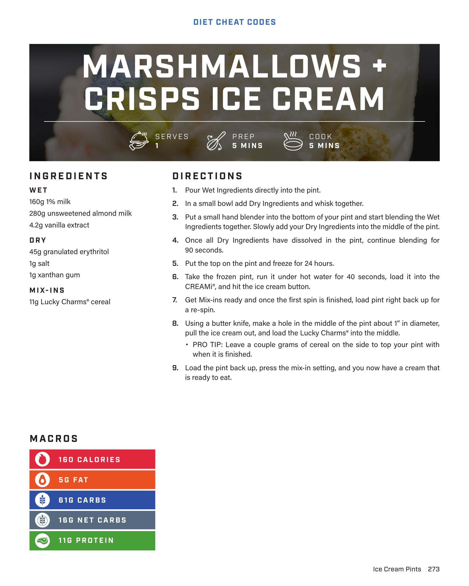

## Source Pages

273, 274

---

# MINT CHOCOLATE CHIP

**Serves:** 1 | **Prep:** 15 MINS | **Cook:** 15 MINS

## Macros

| Calories | Fat | Carbs | Net Carbs | Protein |
|----------|-----|-------|-----------|---------|
| 456 | 16 | 49 | 29 | 50 |

## Ingredients

### MELTING CHOCOLATE

- 113g semi-sweet chocolate bar
- 7g peanut oil

### WET

- 430g 1% milk
- 4.2g vanilla extract
- Peppermint extract (See tip below!)
- 8 drops green food coloring (not necessary)

### DRY

- 32.4 Gorilla Mode Vanilla Ice Cream protein
- .20g granulated erythritol
- .5g salt
- .5g xanthan gum

### MIX-INS

- 28g melting chocolate

## Directions

1. Melt chocolate using the double boiler method.
2. Fill a small pot with 1" of water and bring to a simmer. Place a ceramic bowl over the pot, making sure the bowl is wider than the pot. Add chocolate.
3. Once melted, add oil and mix with a whisk until combined.
4. Line a quarter sheet pan or small tray with parchment paper.
5. Add the melted chocolate to the sheet pan and spread into a thin layer. Freeze until solid.
6. Add chocolate to a cutting board and chop into bite sized pieces. Add chocolate to a plastic bag and freeze. This makes enough chocolate for 4 pints.
7. Add Wet Ingredients into a high-sided container.
8. In a measuring cup, add Dry Ingredients and whisk together.
9. Put an immersion blender in the bottom of the container and start blending the Wet Ingredients together. Slowly add your Dry Ingredients into the container.
10. Once all Dry Ingredients have dissolved, continue blending for 30 seconds.
11. Add the liquid to a pint, put the top on, and freeze for 24 hours.
12. Take the frozen pint, run it under hot water for 60 seconds, load it into the CREAMi®, and hit the sorbet button.
13. Using a butter knife, make a hole in the middle of the pint about 1" in diameter, pull the ice cream out, and load the chocolate into the center.
14. Place the previously removed ice cream into the pint, reload the pint, and press the mix-in setting.

## Tips

Peppermint extract strength and flavor is going to vary brand to brand. The two I experimented with are Loranns Oils® and McCormick's®. They both taste great in mint ice cream, but have their differences. McCormick's® is a more laid back mint flavor while LorAnn's® is much more intense. If using McCormick's®, use 12 drops. If using LorAnn's®, use 4 drops! Don't pull the chocolate out of the freezer until you need to fill the center. The chocolate melts very quickly at room temperature.

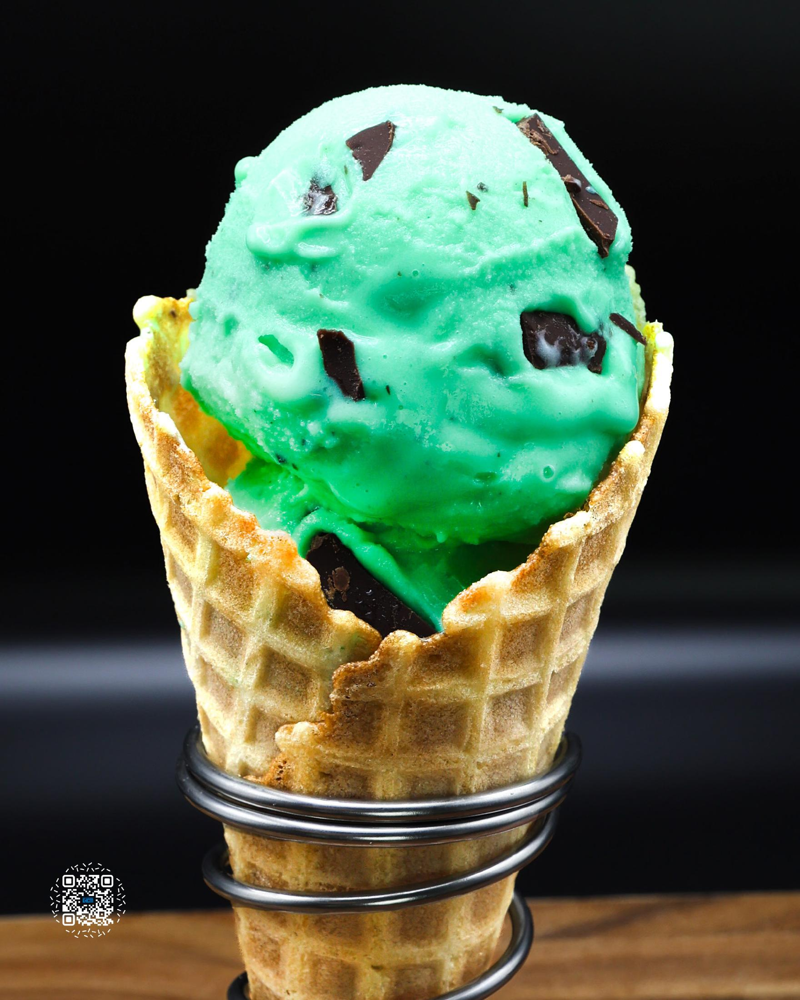

## Additional Recipe Pages

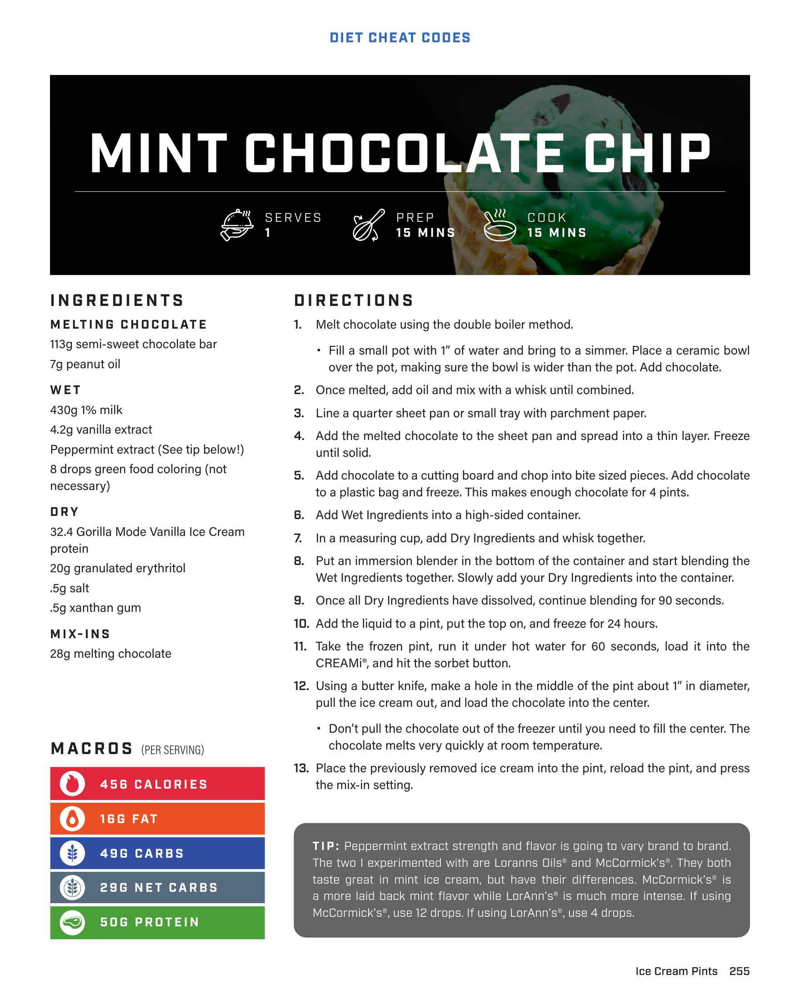

## Source Pages

255, 256

---

# OATMEAL CRÈME PIE

**Serves:** 1 | **Prep:** 5 MINS | **Cook:** 5 MINS

## Macros

| Calories | Fat | Carbs | Net Carbs | Protein |
|----------|-----|-------|-----------|---------|
| 536 | 10 | 79 | 59 | 48 |

## Ingredients

### WET

- 440g fat-free milk
- 20g brown sugar erythritol
- 4.2g vanilla extract

### DRY

- 20.3g Gorilla Mode Vanilla Ice Cream protein
- 20g fat-free milk powder
- 0.8g cinnamon
- 0.5g salt
- 1g xanthan gum

### MIX-INS/TOPPINGS

- 38g oatmeal crème pie (170 cal), frozen
- 13g oatmeal crème pie (58 cal), chopped

## Directions

1. Add wet ingredients into a high-sided container.
2. Place dry ingredients in a measuring cup and whisk to combine.
3. With an immersion blender at the bottom of the container, start blending wet ingredients while gradually adding dry ingredients.
4. Once all dry ingredients dissolve, blend for another 90 seconds.
5. Pour into a pint, cover, and freeze for 24 hours.
6. Take the frozen pint, run the sides and bottom under hot water for 1 minute, load it into the CREAMi®, and hit the light ice cream button.
7. Use a butter knife to make a long, thin hole slightly off-center in the pint. Remove that strip of ice cream and grab the crème pie from the freezer.
8. Press the crème pie into the hole, return the ice cream to the pint, reload, and run the mix-in setting.
9. Chop 13g of additional creme pie into bite-sized chunks and sprinkle on top.
10. Get ready for the crèmiest ride of your life.

## Additional Recipe Pages

## Source Pages

261, 262

---

# PEANUT BUTTER PUFFS ICE CREAM

**Serves:** 1 | **Prep:** 5 MINS | **Cook:** 5 MINS

## Macros

| Calories | Fat | Carbs | Net Carbs | Protein |
|----------|-----|-------|-----------|---------|
| 170 | 5 | 60 | 15 | 14 |

## Ingredients

### WET

- 160g fat-free milk
- 280g unsweetened almond milk
- 4.2g vanilla extract

### DRY

- 45g granulated erythritol
- 1.5g salt
- 1g xanthan gum
- 8g powdered peanut butter

### MIX-INS

- 8g Reese's Puffs® cereal

## Directions

1. Pour Wet Ingredients directly into the pint.
2. In a small bowl, add Dry Ingredients and whisk together.
3. Put a small hand blender into the bottom of your pint and start blending the Wet Ingredients together. Slowly add your Dry Ingredients into the middle of the pint.
4. Once all Dry Ingredients have dissolved in the pint, continue blending for 90 seconds.
5. Put the top on the pint and freeze for 24 hours.
6. Take the frozen pint, run it under hot water for 40 seconds, load it into the CREAMi®, and hit the ice cream button.
7. Get Mix-ins ready and once the first spin is finished, load pint right back up for a re-spin.
8. Using a butter knife, make a hole in the middle of the pint about 1" in diameter, pull the ice cream out, and load the Reese's Puffs® into the middle.
9. Load the pint back up, press the mix-in setting, and you now have a cream that is ready to eat.

## Tips

Leave a couple grams of cereal on the side to top your pint with when it is finished.

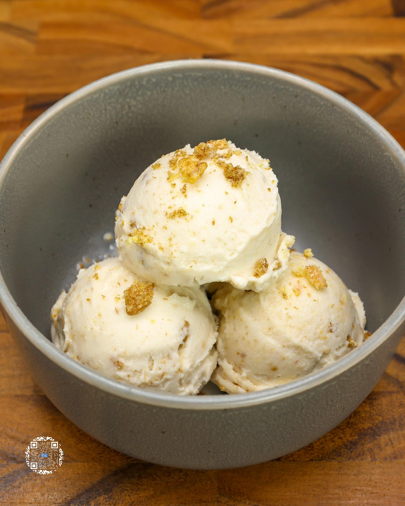

## Additional Recipe Pages

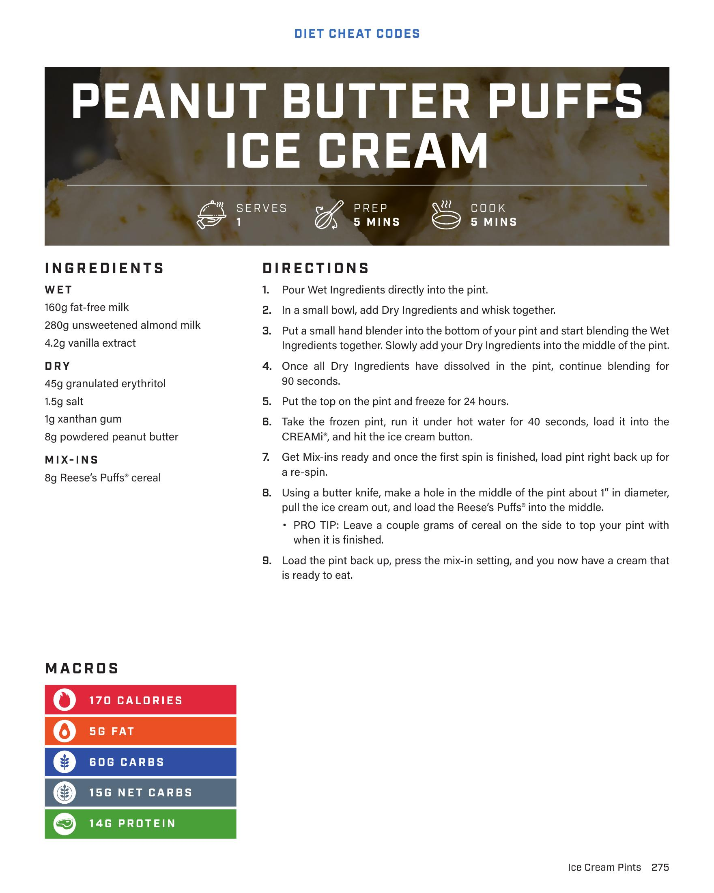

## Source Pages

275, 276

---

# VANILLA BASE "BEST"

**Serves:** 1 | **Prep:** 5 MINS | **Cook:** 5 MINS

## Macros

| Calories | Fat | Carbs | Net Carbs | Protein |
|----------|-----|-------|-----------|---------|
| 285 | 13 | 58 | 13 | 26 |

## Ingredients

### WET

- 430g 2% milk
- 1 egg yolk
- 4g vanilla extract
- ½ vanilla bean pod

### DRY

- 45g granulated erythritol
- 1g salt
- 1g xanthan gum

## Directions

1. Using a knife, cut a vanilla bean pod down the middle, scrape the beans of half of the pod, and add to a high sided container.
2. Add milk, vanilla extract, and an egg yolk to the container.
3. In a small bowl, add Dry Ingredients and whisk together.
4. Put an immersion blender in the bottom of the container and start blending the Wet Ingredients together. Slowly add your Dry Ingredients into the container.
5. Once all Dry Ingredients have dissolved, continue blending for 90 seconds.
6. Add the liquid to a pint, put the top on, and freeze for 24 hours.
7. Take the frozen pint, run it under hot water for 60 seconds, load it into the CREAMi®, and hit the ice cream button.
8. Once the first spin is finished, load pint right back up for a re-spin.
9. Adjust creaminess with an additional re-spin if necessary.
10. Grab a spoon and enjoy.

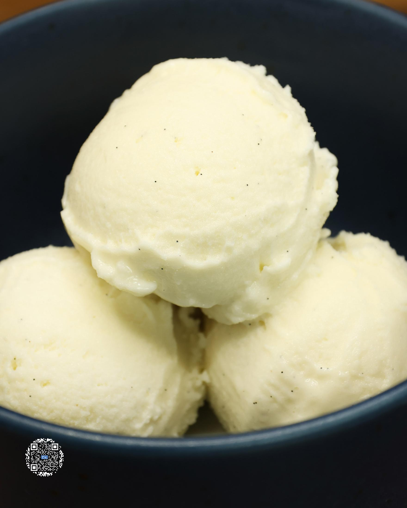

## Additional Recipe Pages

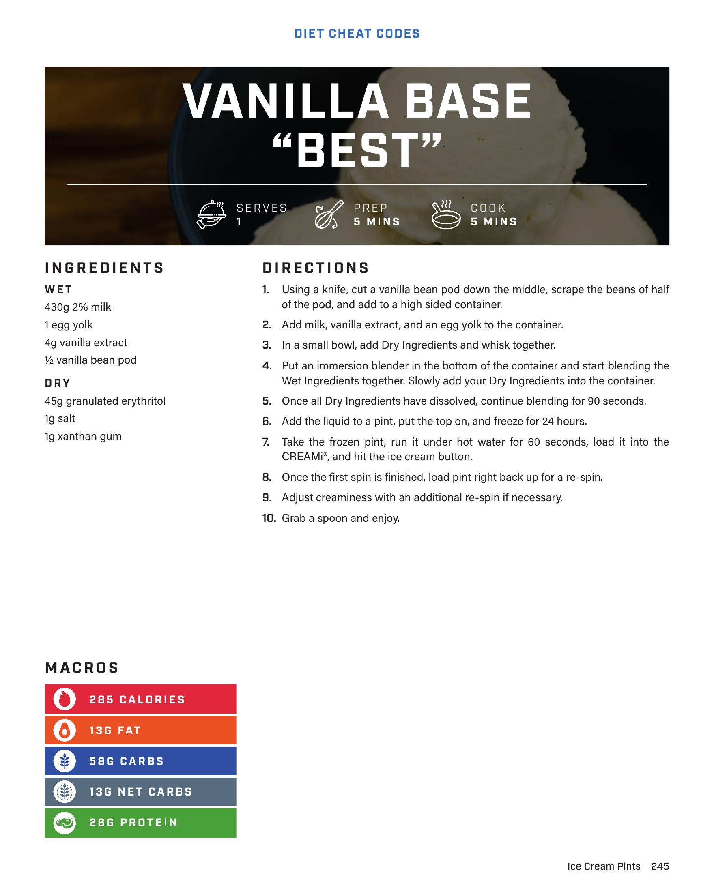

## Source Pages

245, 246

---

# VANILLA BASE "BETTER"

**Serves:** 1 | **Prep:** 5 MINS | **Cook:** 5 MINS

## Macros

| Calories | Fat | Carbs | Net Carbs | Protein |
|----------|-----|-------|-----------|---------|
| 201 | 4 | 57 | 12 | 24 |

## Ingredients

### WET

- 440g 1% milk
- 5g vanilla extract
- 1g salt

### DRY

- 45g granulated erythritol
- 1g xanthan gum

## Directions

1. Pour Wet Ingredients directly into the pint.
2. In a small bowl, add Dry Ingredients and whisk together.
3. Put a small hand blender into the bottom of your pint and start blending the Wet Ingredients together. Slowly add your Dry Ingredients into the middle of the pint.
4. Once all Dry Ingredients have dissolved in the pint, continue blending for 90 seconds.
5. Put the top on the pint and freeze for 24 hours.
6. Take the frozen pint, run it under hot water for 60 seconds, load it into the CREAMi®, and hit the ice cream button.
7. Once the first spin is finished, load pint right back up for a re-spin.
8. Adjust creaminess with an additional re-spin if necessary.
9. Grab a spoon and enjoy.

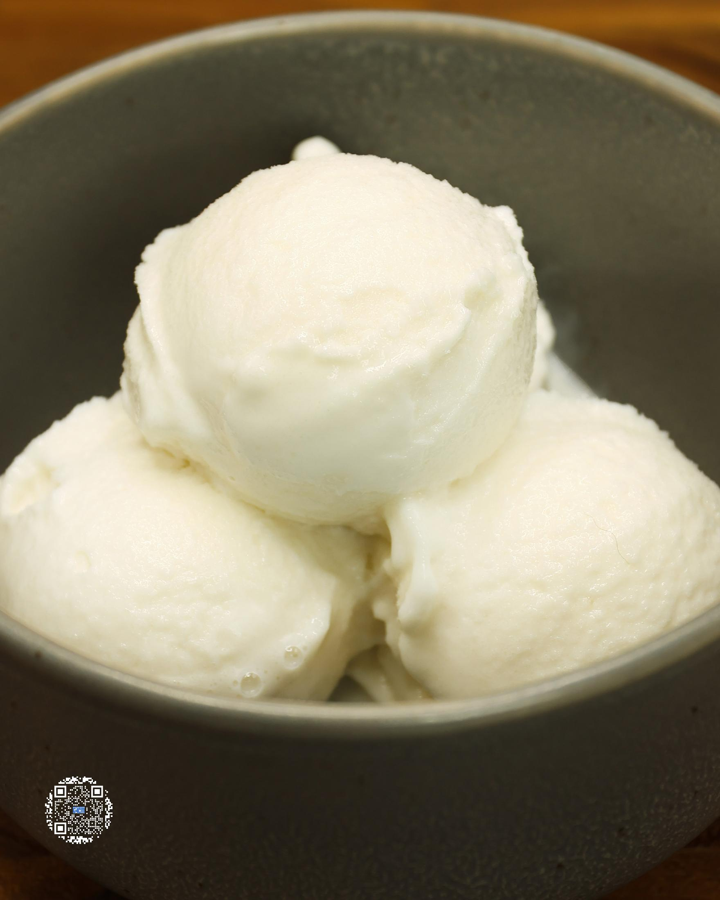

## Additional Recipe Pages

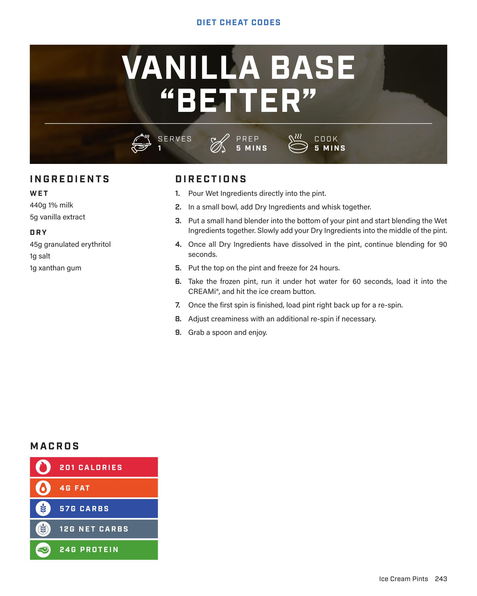

## Source Pages

243, 244

---

# VANILLA BASE "GOOD"

**Serves:** 1 | **Prep:** 5 MINS | **Cook:** 5 MINS

## Macros

| Calories | Fat | Carbs | Net Carbs | Protein |
|----------|-----|-------|-----------|---------|
| 143 | 5 | 53 | 8 | 14 |

## Ingredients

### WET

- 240g 1% milk
- 200g unsweetened almond milk
- 5g vanilla extract

### DRY

- 45g granulated erythritol
- 1g salt
- 1g xanthan gum

## Directions

1. Pour Wet Ingredients directly into the pint.
2. In a small bowl, add Dry Ingredients and whisk together.
3. Put a small hand blender into the bottom of your pint and start blending the Wet Ingredients together. Slowly add your Dry Ingredients into the middle of the pint.
4. Once all Dry Ingredients have dissolved in the pint, continue blending for 90 seconds.
5. Put the top on the pint and freeze for 24 hours.
6. Take the frozen pint, run it under hot water for 60 seconds, load it into the CREAMI®, and hit the ice cream button.
7. Once the first spin is finished, load pint right back up for a re-spin.
8. Adjust creaminess with an additional re-spin if necessary.
9. Grab a spoon and enjoy.

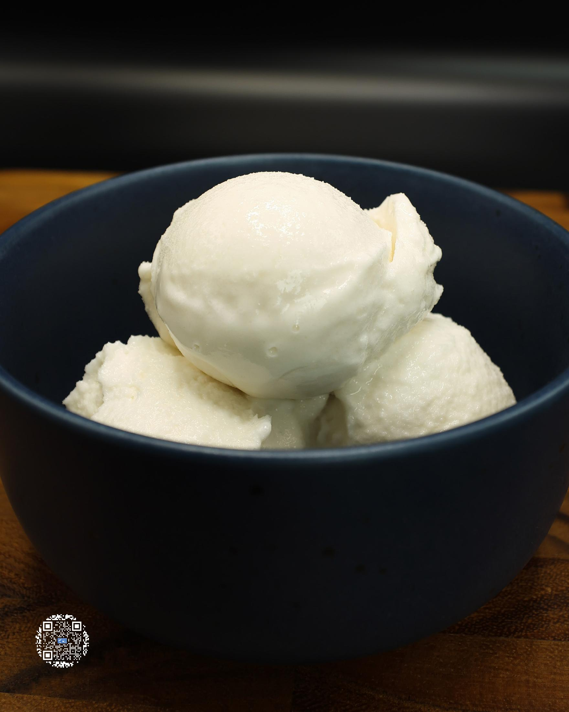

## Additional Recipe Pages

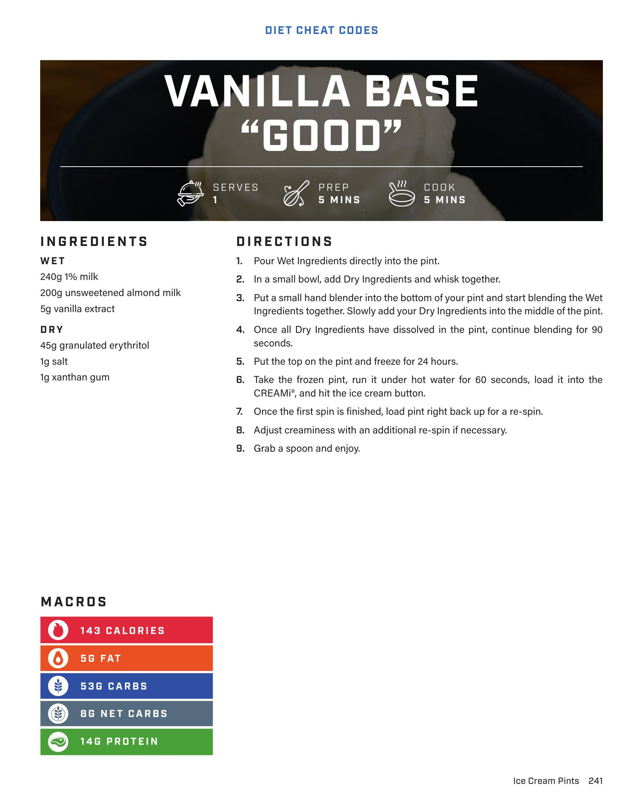

## Source Pages

241, 242

---

# CHEESY POBLANO QUESADILLA

**Serves:** 1 | **Prep:** 30 MINS | **Cook:** 30 MINS

## Macros

| Calories | Fat | Carbs | Net Carbs | Protein |
|----------|-----|-------|-----------|---------|
| 308 | 13 | 21 | 10 | 35 |

## Ingredients

- La Banderita® Carb Counter taco tortillas
- 4 poblano peppers
- 448g 93% lean ground beef
- 4g salt

### QUESADILLA BUILD

- 1 La Banderita® Carb Counter taco tortilla
- 35g reduced-fat colby jack cheese, shredded
- 35g fat-free mozzarella cheese, shredded
- 24g poblano peppers, roasted
- 30g 93% lean ground beef, cooked
- 25g SALSA CREMA
- 3g unsalted butter

## Directions

1. ROAST poblanos, take outer layer of skin off, and shred cheese.
2. Lightly spray a preheated cast iron pan on medium high heat, add ground beef, and flatten it into the pan using a spatula. Top the meat with salt and break the meat down into smaller chunks with a wooden spatula.
3. Constantly stir beef until cooked through, then set aside on a plate or in a separate container.
4. Put a tortilla on the center and on the bottom half of it add half of each cheese, poblanos, salsa, beef, and the other half of each cheese and fold the top half of the tortilla over.
5. In a small container, add butter and heat up in the microwave for 20-30 seconds or until melted.
6. Brush a thin layer of butter on the top half of the quesadilla, then add the quesadilla to a preheated pan on medium heat, butter side down. Brush the remaining butter on the other side of the quesadilla.
7. After 1-2 minutes, flip the quesadilla and cook for an additional 1-2 minutes.
8. Cut it in half, plate it, and it's time to eat.

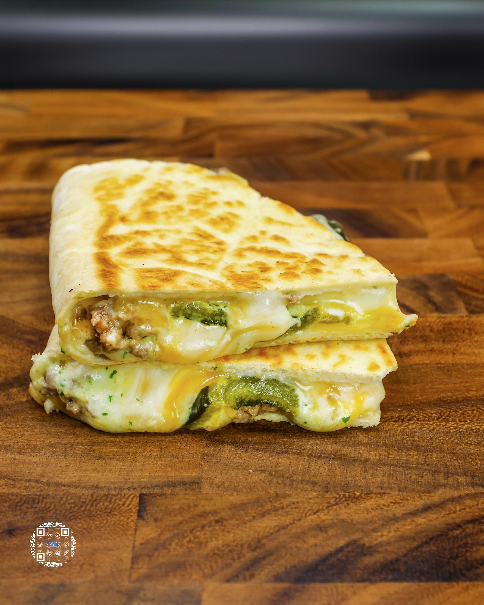

## Additional Recipe Pages

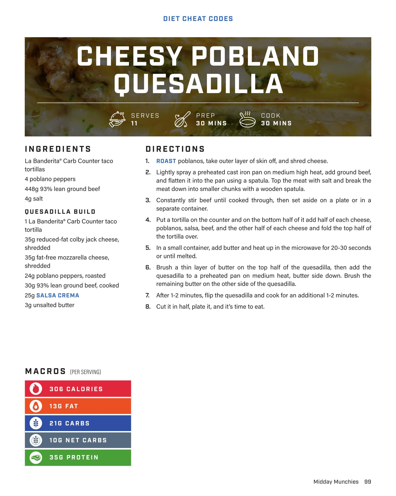

## Source Pages

99, 100

---

# CHICKEN PARMESAN SANDWICH

**Serves:** 5 | **Prep:** 1.5 HRS | **Cook:** 15 MINS

## Macros

| Calories | Fat | Carbs | Net Carbs | Protein |
|----------|-----|-------|-----------|---------|
| 0 |  |  | N/A |  |

## Ingredients

- 3 chicken breasts

### DREDGE STATION 1

- 40g all-purpose flour

### DREDGE STATION 2

- 1 egg
- 1 egg white

### DREDGE STATION 3

- 100g panko breadcrumbs
- 10g Parmigiano-Reggiano cheese, grated
- 5g salt
- 4g garlic powder
- 1g dried parsley
- Dash black pepper

### CHICKEN PARMESAN BUILD

- 1 Chicken patty
- 40g FOOLPROOF HOMEMADE MARINARA
- 5g grated Parmigiano-Reggiano cheese
- Buns (110 cal)
- Oil spray

## Directions

1. Prep and BRINE the chicken breasts.
2. Cut chicken into 140g cutlets.
3. Set up dredging stations by adding all Dredge Station Ingredients to three separate containers and mixing until well combined.
4. Take one piece of chicken and add it to Dredging Station 1.
5. Cover with flour, making sure to get into all the crevices, and shake off excess flour.
6. Add chicken to Dredging Station 2 and completely soak with egg, making sure there are no dry spots.
7. Move chicken to Dredging Station 3 and again completely cover with the breadcrumb mixture, making sure to press it into the chicken and all its crevices.
8. Put finished chicken on a wire rack and repeat the process until all chicken is breaded.
9. Spray bottom of air fryer, add chicken to a preheated 400°F air fryer, and lightly spray the top of the chicken with oil.
10. Air fry for 6-8 minutes or until internal temperature of the chicken reaches 155°F.
11. Halfway through cooking, flip chicken and lightly spray with oil.
12. With about 2 minutes remaining on the chicken, toast your buns on the bagel setting in a toaster to make sure only the insides of the buns are browned.
13. Add chicken to bottom bun followed by the marinara sauce and grated parmesan.
14. Put the top bun on and ENJOY.

## Source Pages

92

---

# CHICKEN STRIPS

**Serves:** 5 | **Prep:** 20 MINS | **Cook:** 25 MINS

## Macros

| Calories | Fat | Carbs | Net Carbs | Protein |
|----------|-----|-------|-----------|---------|
| 349 | 7 | 18 | undefined | 52 |

## Ingredients

- 1120g chicken breast
- 60g all-purpose flour
- 1 egg
- 140g Italian-style breadcrumbs
- 235g Frank's RedHot® sauce

## Directions

1. Preheat oven to 400°F.
2. Cut chicken breasts into 1-2" thick strips.
3. Set up dredging station with 3 containers. Meal prep containers work best in this instance.
4. Put flour in first container, an egg in the second, and breadcrumbs in the third.
5. Beat egg with a whisk until smooth.
6. Lay one strip at a time in the flour and thoroughly cover. Make sure to get flour into all of the crevices of the chicken to ensure full coverage.
7. Put the chicken strip in the egg wash, making sure it is thoroughly coated. Let excess egg wash drip off of the chicken before transferring to the breadcrumb station.
8. Lay the chicken on top of the breadcrumbs, pick up the container and start shaking it back and forth to fully coat the chicken strip.
9. Once coated, cover with additional breadcrumbs and push them into the chicken and its crevices to make sure full coverage is achieved.
10. Place the breaded chicken strip on a sheet pan with a baking rack and repeat until all chicken strips are finished.
11. Bake chicken strips in the oven for 20-25 minutes or until internal temperature has reached 165°F.
12. Separate into five even servings. When you are ready to eat, add one serving to a bowl with 45g hot sauce, and toss.
13. Reheat in the oven or air fryer for 3-4 minutes at 350°F and coat with hot sauce right before serving.

## Tips

Bake your chicken strips in an air fryer at 400°F for 6-8 minutes to cook your tenders faster and make them crispier. Use a sauce brush to coat the tenders with hot sauce for a more even coat and no risk of the breading coming off.

## Additional Recipe Pages

## Source Pages

87, 88

---

# HAM AND CHEESE PITA

**Serves:** 1 | **Prep:** 5 MINS | **Cook:** 5 MINS

## Macros

| Calories | Fat | Carbs | Net Carbs | Protein |
|----------|-----|-------|-----------|---------|
| 289 | 11 | 32 | 26 | 24 |

## Ingredients

- 1 PROTEIN PITA
- 2 slices original Velveeta® Cheese
- 56g honey ham (70 Cal)
- 15g light mayonnaise
- Tomato, chopped
- Lettuce, chopped

## Directions

1. Add a pita to a preheated pan on medium heat, add cheese and ham, and warm for 1-2 minutes or until cheese is melted.
2. Place pita on a sheet of parchment paper, add mayonnaise, tomato, and lettuce. Wrap the pita in parchment paper and microwave for 10 seconds.
3. Let sit for one minute and enjoy.

## Tips

If you need to eat ASAP, put pita directly on a piece of parchment paper, add ham and cheese, wrap it up, and heat up in the microwave for 20-30 seconds. To finish, add mayonnaise and veggies.

## Additional Recipe Pages

## Source Pages

97, 98

---

# JALAPEÑO POPPER GRILLED CHEESE

**Serves:** 1 | **Prep:** 15 MINS | **Cook:** 10 MINS

## Macros

| Calories | Fat | Carbs | Net Carbs | Protein |
|----------|-----|-------|-----------|---------|
| 412 | 17 | 35 | undefined | 33 |

## Ingredients

- 8g green onion, chopped
- 28g reduced-fat cheddar cheese
- 28g pepper jack cheese
- 28g fat-free cheddar cheese
- 50g fat-free cream cheese
- Dash black pepper
- 1g salt
- 50g jalapeños, diced
- 4g garlic, minced
- 2 slices of bread (35 Cal)
- Spray oil

## Directions

1. Thinly slice green onions, shred cheese, and add to a medium-sized bowl. Add the cream cheese, black pepper, and salt.
2. Dice the jalapeños and add to a preheated pan on medium heat until blistering.
3. Once the jalapeños blister, use a garlic press to mince garlic into the middle of the pan. Cook until fragrant, then add mixture to the bowl with the cheeses.
4. Mix everything in the bowl until thoroughly combined.
5. Using the same pan and keeping the heat on medium, lightly spray pan with oil and add bread to pan. Lightly spray the top of bread with oil as well.
6. Once browning starts to occur on the bottom side of the bread, flip it over and add the cheese mixture to one of the slices of bread.
7. Take the other slice of bread and place the toasted side onto the cheese mixture. Once the bottom slice of bread is toasted, flip over to toast the other side.
8. Once finished, put in microwave for 15-20 seconds or until cheese starts melting down the sides.

## Tips

If bread is too soft after the microwave, put back on the pan for 1-2 minutes per side to crisp back up.

## Notes

If you're concerned about spice levels, remove the seeds from the jalapeño to reduce the spiciness. Due to thickness of this grilled cheese, if you want a truly melty consistency this step is an absolute must.

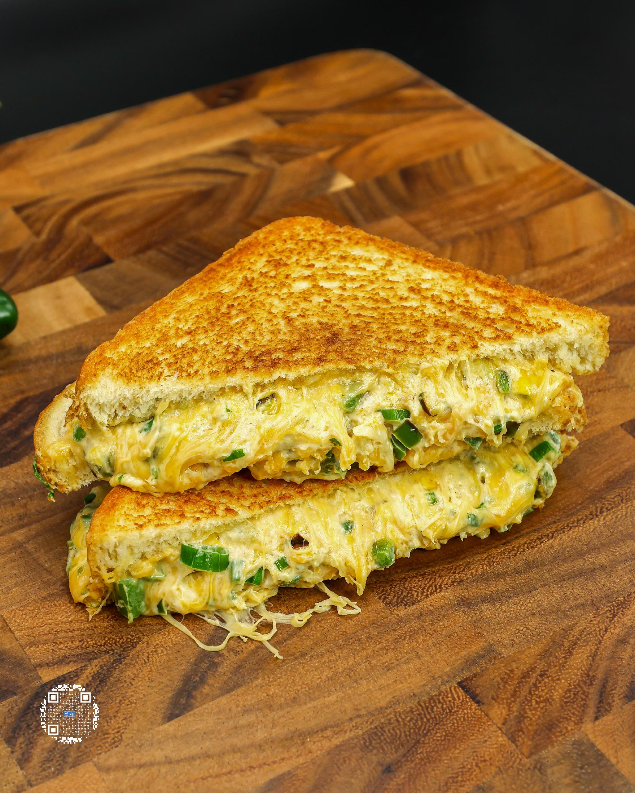

## Additional Recipe Pages

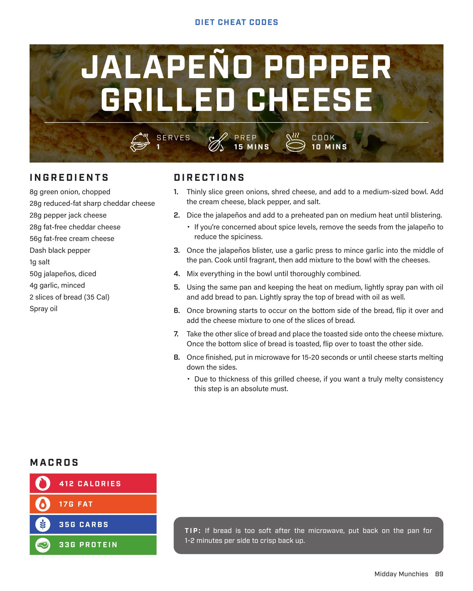

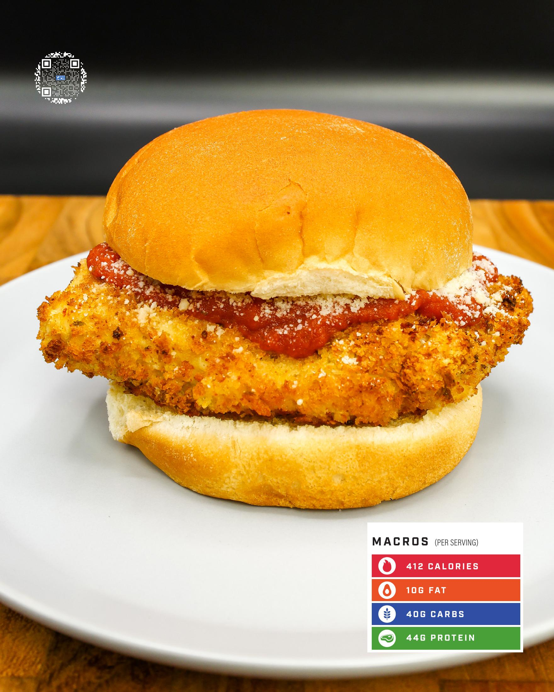

## Source Pages

89, 90, 91

---

# MEATBALL SANDWICH ON GARLIC BREAD

**Serves:** 1 | **Prep:** 15 MINS | **Cook:** 10 MINS

## Macros

| Calories | Fat | Carbs | Net Carbs | Protein |
|----------|-----|-------|-----------|---------|
| 528 | 38 | 31 | undefined | 44 |

## Ingredients

### GARLIC BREAD SPREAD

- 21g unsalted butter, softened
- 3.5g garlic, minced
- 1g fresh parsley, chopped
- 5g extra virgin olive oil
- 5g parmesan, grated
- 1g salt

### MEATBALL SANDWICH BUILD

- 2 slices bread (45 Cal)
- 28g fat-free mozzarella cheese
- 28g part-skim mozzarella cheese
- 72g ITALIAN SAUSAGE, cooked
- 80g FOOLPROOF HOMEMADE MARINARA
- 5g parmesan, grated

## Directions

1. In a bowl, add softened butter, garlic, parsley, olive oil, grated parmesan, and salt. Mix thoroughly.
2. Evenly spread the butter mix on each slice of bread and add to a preheated pan on medium heat, butter side down.
3. After 3-4 minutes or when the bottom of the bread starts to brown, flip bread and place half of the fat-free mozzarella and half of regular mozzarella on top of each slice.
4. Heat the Italian Sausage up in the microwave for 15 seconds if necessary and add to one of the slices of bread.
5. Turn burner down to low and add HOMEMADE MARINARA, parmesan and other slice of bread cheese side down on top of the sausage.
6. Once both sides of the bread are browned, remove sandwich from heat and put in the microwave for 15 seconds.
7. Cut in half or enjoy it whole.

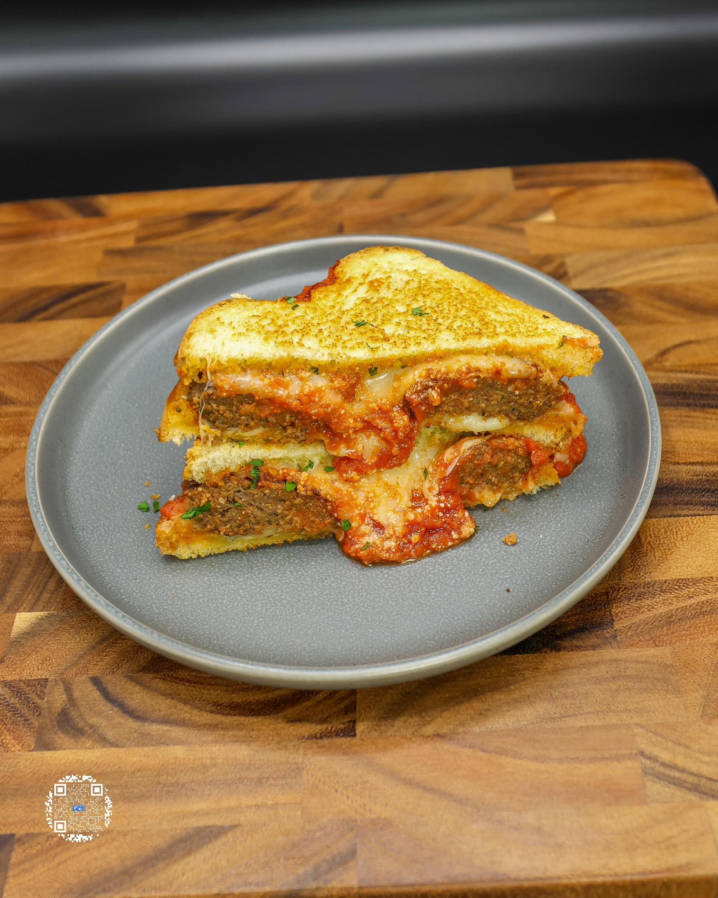

## Additional Recipe Pages

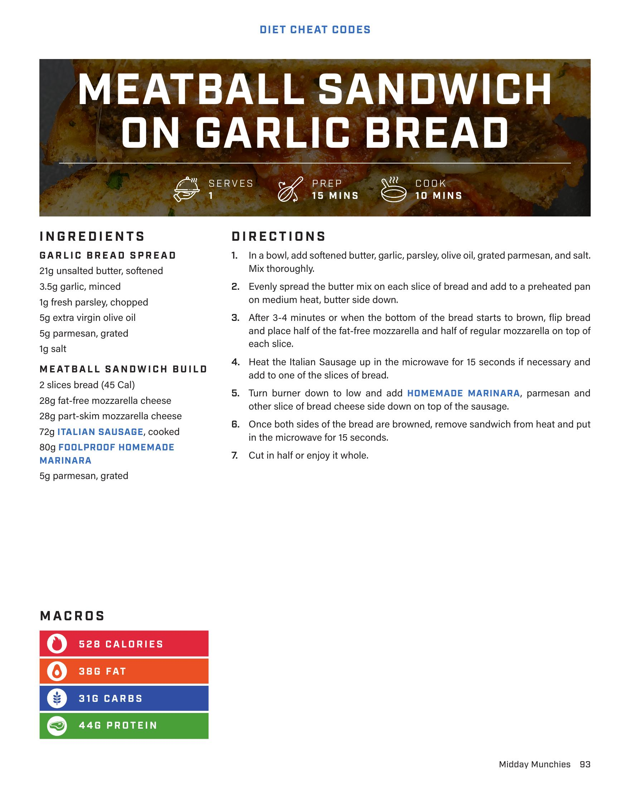

## Source Pages

93, 94

---

# REUBEN

**Serves:** 1 | **Prep:** 5 MINS | **Cook:** 5 MINS

## Macros

| Calories | Fat | Carbs | Net Carbs | Protein |
|----------|-----|-------|-----------|---------|
| 486 | 19 | 32 | undefined | 47 |

## Ingredients

- 2 slices Lewis* hearty rye bread
- 30g RUSSIAN DRESSING
- 28g Amish Farms* baby swiss cheese (thinly sliced)
- 84g Kretschmar* pastrami
- 84g Eckrich* corned beef
- 60g sauerkraut

## Directions

1. Take two slices of bread, add RUSSIAN DRESSING onto both, and spread out evenly.
2. Add 1 slice of baby swiss to each slice of bread.
3. Add the corned beef and pastrami to one of the slices of bread and close the sandwich with the other slice.
4. Lay sandwich on parchment paper, fold closed, and heat in the microwave for 1 minute.
5. Take sandwich out of parchment paper and add it to a preheated pan on medium heat until bottom side is browned.
6. Once bottom side is browned, flip and repeat.
7. Add sauerkraut to the sandwich, cut in half, and it's time to eat.

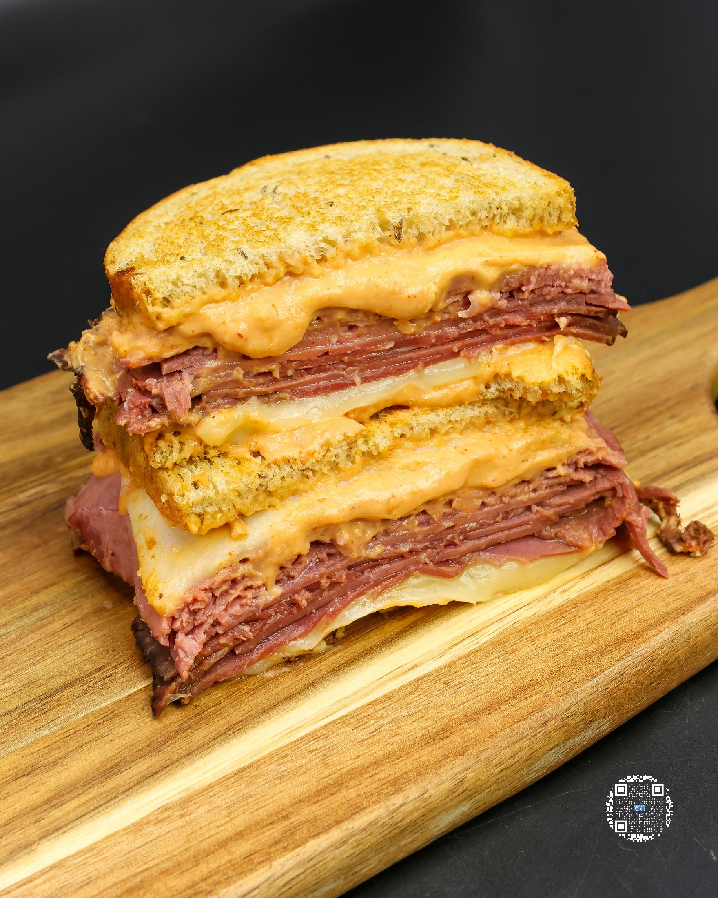

## Additional Recipe Pages

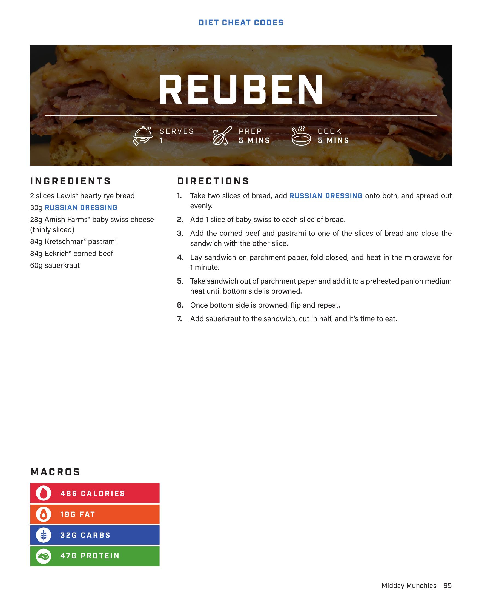

## Source Pages

95, 96

---

# $1 BREAKFAST BURRITO MEAL PREP

**Serves:** 5 | **Prep:** 40 MINS | **Cook:** 20 MINS

## Macros

| Calories | Fat | Carbs | Net Carbs | Protein |
|----------|-----|-------|-----------|---------|
| 481 | 20 | 37 | undefined | 32 |

## Ingredients

- Five 9" tortillas (200 cal)
- 112g 2% colby jack cheese, shredded
- 5g avocado oil
- 224g 90% lean ground pork
- 5g garlic, minced
- 4g salt
- 1g black pepper
- 1g dried sage
- 1g dried thyme
- 5g apple cider vinegar
- 10g sugar-free maple syrup
- 5g avocado oil
- 12 eggs
- 3g salt
- 1g black pepper

## Directions

1. Add ground pork, garlic, salt, pepper, sage, thyme, apple cider vinegar, and syrup to a medium bowl. Mix to combine.
2. Add oil to a preheated pan on medium heat, followed by the seasoned pork sausage, and press down on the meat until it is about a ½" thick.
3. Cook for 2-3 minutes or until browned to your preference and flip.
4. Cook for an additional 30-60 seconds and chop up the sausage with a spatula or masher.
5. Add the sausage to a large bowl and place back on the stovetop on medium-low heat.
6. Add 5 whole eggs, 7 egg whites, 3g salt, and 1g black pepper to a large bowl and whisk to combine.
7. Add oil to the preheated pan, spread it around, and add the egg mixture.
8. Constantly move the eggs around the pan with a spatula until just slightly wet or about 15 seconds from being done since there will be carryover cooking.
9. Pour the scrambled eggs over the sausage, mix to combine, and allow to cool for 5-10 minutes.
10. Spread tortillas on the counter.Place cheese, eggs, and sausage on the first half of each tortilla and wrap into burritos.
11. Brush a small amount of water along the seam of the burrito. Place it seam side down into a preheated pan on medium heat. Press down on the burrito for 20-30 seconds to ensure even browning and to seal it shut.
12. After 30-45 seconds or browned to your preference, flip onto the other side, and repeat.
13. Let burritos cool and store in the fridge for up to a week or place in a vacuum sealed bag in the freezer.
14. Whether refrigerated or frozen, wrap a burrito in parchment paper. Microwave for 60-90 seconds if refrigerated or 3-4 minutes if frozen. You can also reheat it in a preheated 400° oven for 6-10 minutes if refrigerated or 16-20 minutes if frozen.

## Additional Recipe Pages

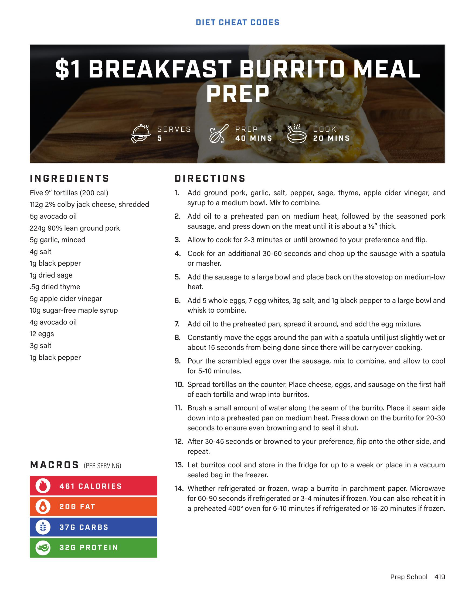

## Source Pages

419, 420

---

# $1 BURRITO MEAL PREP

**Serves:** 5 | **Prep:** 20 MINS | **Cook:** 3 HRS

## Macros

| Calories | Fat | Carbs | Net Carbs | Protein |
|----------|-----|-------|-----------|---------|
| 259 | 9 | 25 | 8 | 23 |

## Ingredients

- 9" tortilla (200 cal)
- 160g refried beans
- 30g fat-free cheddar cheese, shredded
- 30g 2% sharp cheddar cheese, shredded
- Oil spray

## Directions

1. Make Refried Beans. A pinch of smoked paprika was added to the beans for this recipe. Your final beans should be much thicker than if you were eating them as a side dish, so they hold up better in the burrito.
2. Once beans have cooled, add beans and cheese to the middle of each tortilla. Wrap into burritos.
3. Lightly spray a preheated pan or griddle on medium heat with oil and add each burrito folded side down. Lightly press down on each burrito to ensure even browning and to help them seal.
4. After 30 seconds or browned to your preference, lightly spray the top of each burrito with oil and flip onto the other side. Again, lightly press down on each burrito and allow to brown for 30 seconds.
5. Let burritos cool and store in the fridge for up to a week or place in a vacuum sealed bag in the freezer.
6. If refrigerated, wrap burrito in parchment paper and microwave for 60-90 seconds. The same applies if frozen, but heat up 3-4 minutes or until cooked through. You can also heat a burrito up in a preheated 400° oven for 6-10 minutes if refrigerated or 16-20 minutes if frozen.

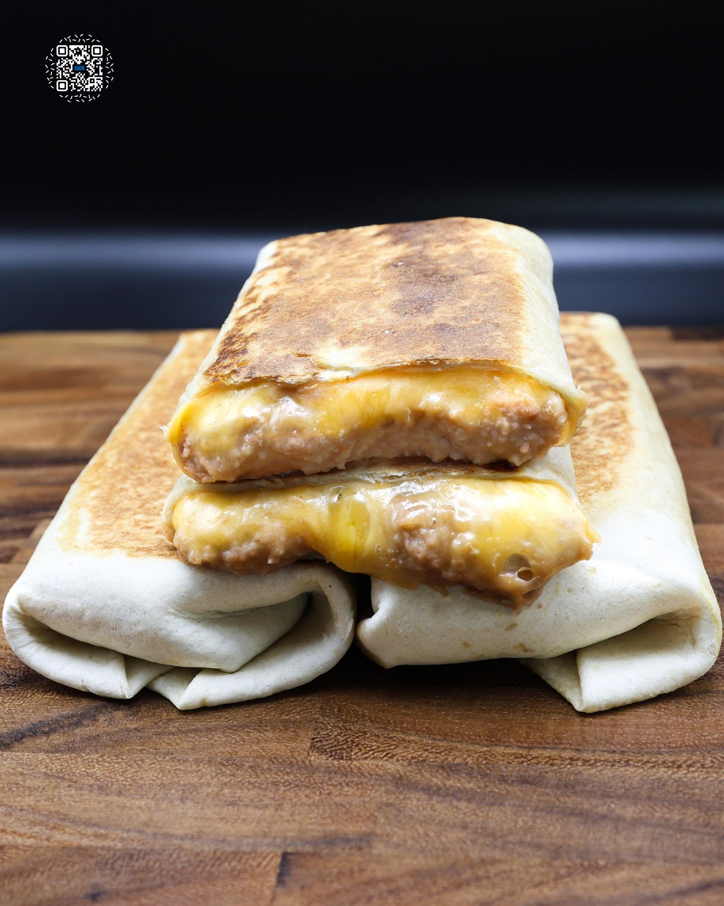

## Additional Recipe Pages

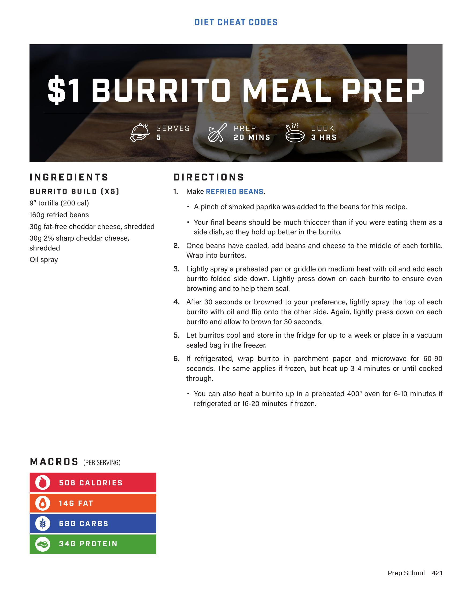

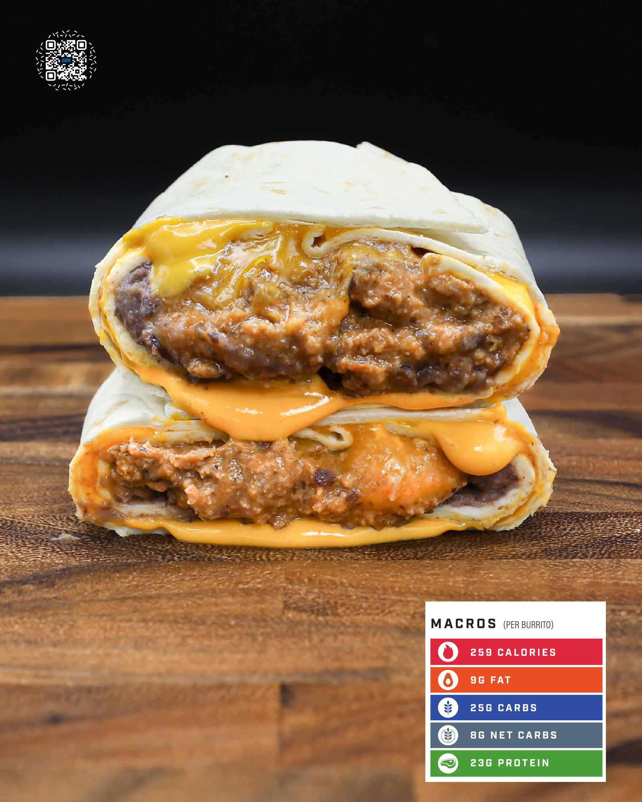

## Source Pages

421, 422, 423

---

# $1 NEAPOLITAN PIZZA

**Serves:** 5 | **Prep:** 24 HR | **Cook:** 10 MINS

## Macros

| Calories | Fat | Carbs | Net Carbs | Protein |
|----------|-----|-------|-----------|---------|
| 608 | 12 | 84 | undefined | 37 |

## Ingredients

### DRY

- 475g all-purpose flour
- 100g vital wheat gluten
- 12.5g salt
- 4g instant yeast

### WET

- 425g water

### TOPPINGS

- 300g fresh mozzarella
- 350g 6 in 1 ground tomatoes

## Directions

1. In a large bowl, whisk the dry ingredients together. Add water and mix with a spoon until a shaggy dough forms.
2. Use a wet hand to press and fold the dough until fully combined and no dry parts remain. Cover and rest for 20 minutes.
3. With a wet hand, pull one side of the dough up as high as possible and fold it over itself. Rotate the bowl 90°, repeating 3-4 times. Flip the dough, form a ball, and cover for another 20 minutes.
4. Repeat step 3.
5. Divide the dough into 5 pieces, each about 200g.
6. Flatten each piece, fold the edges into the center, flip, and shape into a ball by pulling it toward yourself. Rotate 90° and repeat until smooth.
7. Place each dough ball in a vacuum-sealed bag and refrigerate for 24 hours.
8. After refrigeration, re-seal each bag to remove any air caused by the yeast, then freeze.
9. Portion five servings of 60g cheese, pat dry with a paper towel, and vacuum seal with slight separation between pieces. Divide sauce into five 70g portions and transfer to containers. Freeze both.
10. 2-3 hours before baking, place a dough ball, sauce, and cheese on the counter to defrost. Transfer the cheese to a small bowl to manage condensation.
11. Lightly flour your surface and carefully remove the dough from the vac seal. Place it on the floured surface and dust the top with flour.
12. Outline the crust with your fingers. Press outward from the center of the dough until it is about 6 inches wide. If sticking occurs, add more flour and continue stretching.
13. Lift the dough (avoiding the crust) and stretch it with your fists in a circular motion until 9-11 inches wide.
14. Place the stretched dough on parchment paper and top with tomatoes.
15. Bake on a preheated pizza steel at 550°F for 4-5 minutes. Remove, pat mozzarella dry with paper towel, and add to the pizza. Bake for an additional 2-3 minutes.

## Tips

You can use regular freezer bags to store the dough. Just keep in mind, it will get freezer burn and lose flavor faster.

## Additional Recipe Pages

## Source Pages

417, 418

---

# $1 PAN PIZZA

**Serves:** 5 | **Prep:** 1 HR | **Cook:** 13 MINS

## Macros

| Calories | Fat | Carbs | Net Carbs | Protein |
|----------|-----|-------|-----------|---------|
| 651 | 14 | 91 | undefined | 40 |

## Ingredients

### DOUGH

- 500g all-purpose flour
- 100g vital wheat gluten
- 10g salt
- 5g instant yeast
- 440g water

### SAUCE

- 28oz can Cento® crushed tomatoes
- 1.5g garlic powder
- 6g salt, or to taste

### PIZZA BUILD

- Oil spray
- 1 Dough
- 80g Sauce
- 60g part-skim mozzarella cheese, shredded

## Directions

1. Place flour, vital wheat gluten, yeast, and salt into a food processor and process for 30 seconds.
2. Turn processor on high, slowly mix in water over a 30-60 second period, and let dough mixture process for an additional 30-60 seconds.
3. Plop dough onto the counter, roll it into a ball, and divide the dough into 5 pieces. Each piece should weigh roughly 200-210g.
4. Form each dough into individual balls by flattening the dough with your fingers, folding each side of the dough into the middle, flipping it over, and rolling it in a circular motion until a ball is formed.
5. Grab 5 high sided containers, lightly spray oil into each one, put one dough ball into each container, spray the top of the dough ball, cover with a lid, and put any dough that will not be used in the next hour or two in the fridge.
6. In a separate high-sided container, add the can of tomatoes, garlic powder, and salt. Stir to combine, cover with a lid, and refrigerate.
7. Spray oil onto your hands and an oven safe pan, plop dough into the middle, start stretching it towards the corners of the pan, and spread it to your desired size and thickness. If the dough keeps snapping back, cover it for 15 minutes, then come back and finish stretching. This gives the dough time to relax.
8. Add sauce and spread evenly over the dough with the back of a spoon. Top with mozzarella cheese and bake in a preheated 425°F oven for 12-14 minutes or until cheese is golden brown.
9. Using a spatula, check the bottom of the pizza to make sure it is golden brown as well. If it isn't, you can put it on the stovetop on medium heat and check it every minute or two until it is cooked to your preference.

## Tips

Dough can be stored in the fridge up to a week and actually develops MORE flavor over time. You can store any unused dough by spreading it out in a lightly oiled gallon bag, freezing it, and removing it an hour before they need to be used.

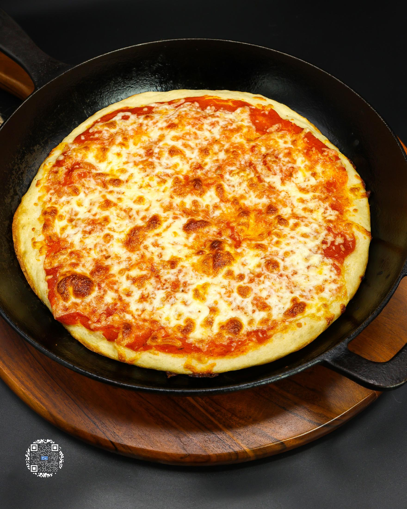

## Additional Recipe Pages

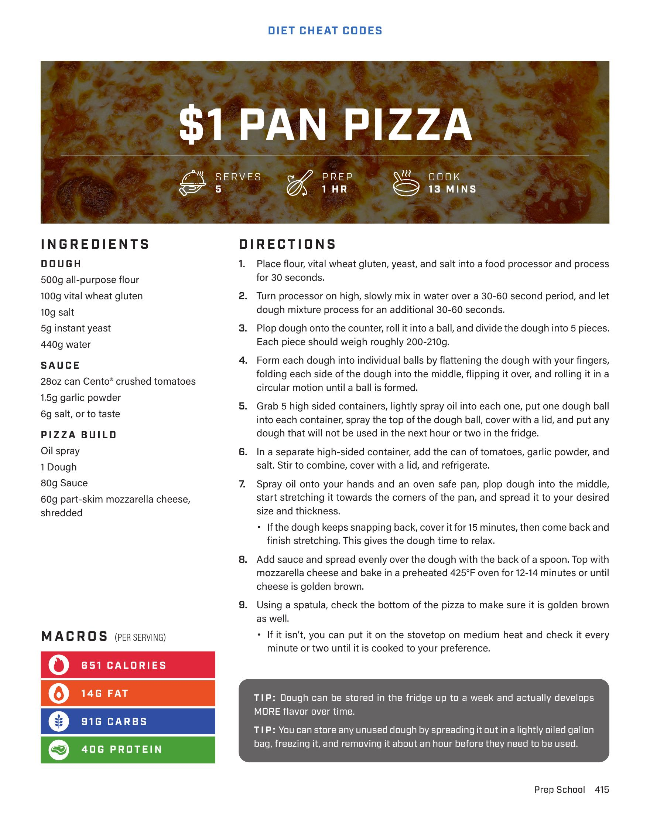

## Source Pages

415, 416

---

# BEEF STROGANOFF

**Serves:** 5 | **Prep:** 40 MINS | **Cook:** 50 MINS

## Macros

| Calories | Fat | Carbs | Net Carbs | Protein |
|----------|-----|-------|-----------|---------|
| 0 |  |  | undefined |  |

## Ingredients

### SAUCE

- 896g 96% lean ground beef
- 8g salt
- 10g olive oil
- 454g mushrooms, sliced
- 400g onion, sliced
- 20g garlic, minced
- 15g all-purpose flour
- 30g tomato paste
- 4g smoked paprika
- 4g black pepper
- 140g chardonnay
- 360g beef broth
- 15g Better Than Bouillon® beef base
- 14g gelatin
- 255g 2% Greek yogurt
- 30g Worcestershire sauce
- 50g water

### PASTA

- 2000g water
- 30g salt
- 336g chickpea pasta

## Directions

1. Heat a large pot over medium heat.
2. Flatten ground beef on a sheet pan (½ inch thick), sprinkle with 8g of salt, and broil 8-10 inches from heat for 15-20 minutes, or until the top is browned.
3. Chop mushrooms and onions (¼ inch slices), mince garlic.
4. Add 5g olive oil to the pot and sauté mushrooms with a pinch of salt for 10 minutes, stirring occasionally.
5. Add onions, another 5g of oil, and a pinch of salt to the pot. Mix well, then sauté for 10 minutes, stirring occasionally.
6. Add garlic and mix to combine. When fragrant, stir in flour, tomato paste, paprika, and pepper. Cook for 2 minutes.
7. Pour in the chardonnay, scrape the bottom of the pot, stir to combine, and sauté for 2 minutes.
8. In a medium bowl, mix the broth and bouillon while gradually adding the gelatin, then combine. Add to the pot and mix well.
9. While the sauce comes to a simmer, crumble the beef and mix it with its juices.
10. Once simmering, add beef to the pot and cook for 20 minutes, stirring occasionally.
11. While the sauce reduces, add water and salt to a pot, bring to a boil, and cook the noodles according to package instructions. Strain and rinse with cold water.
12. Mix Greek yogurt, Worcestershire sauce, and water in a bowl. Add to the sauce and simmer for another 10-15 minutes.
13. Let the sauce cool for 1-2 hours, add noodles, stir, and divide into 5 portions. Each portion should weigh approximately 500g.
14. To reheat, cover with a damp paper towel and microwave for 2-3 minutes. Add parmesan for extra flavor and enjoy

## Tips

You can use regular noodles here as well, just account for the change in macros.

## Source Pages

438

---

# BUFFALO WING COMBO MEAL

**Serves:** 5 | **Prep:** 40 MINS | **Cook:** 50 MINS

## Macros

| Calories | Fat | Carbs | Net Carbs | Protein |
|----------|-----|-------|-----------|---------|
| 603 | 26 | 49 | undefined | 43 |

## Ingredients

### CHICKEN WINGS

- 15 whole chicken wings
- 8g salt
- 50g all-purpose flour
- 50g cornstarch
- Oil spray

### MEAL PREP BUILD

- 6 chicken wings
- 60g buffalo sauce
- French fries

## Directions

1. Complete steps 1-3 of the NICKDONALD'S FRENCH FRIES. You can keep the skins of the potatoes on for this meal prep if you prefer.
2. Pat the chicken wings dry with a paper towel. Using a knife, remove wingtips and discard.
3. Using a knife, separate wings into drums and flats. Pat the chicken wings dry with a paper towel. You can buy flats and drums that are already separated; they will just be more expensive.
4. Add salt to both sides of the wings and place in a bowl.
5. Add flour and cornstarch and toss until evenly coated.
6. Add a layer of wings to a preheated 400°F air fryer, lightly spray the top of the wings with oil, and repeat layering/oil combination until all wings are added.
7. Cook for 25 minutes, shaking every 8-10 minutes for even browning.
8. While the wings cook, make the BUFFALO SAUCE.
9. Complete step 4 of the Nickdonald's French Fries.
10. Place finished wings into a large bowl and wipe down the air fryer using paper towels.
11. Complete steps 5-7 of the Nickdonald's French Fries.
12. Once the fries have cooled, separate everything into 5 meal prep containers and refrigerate.
13. When it's time to dig in, place the wings in a preheated 400°F air fryer for 6-8 minutes. Add the fries during the last 3 minutes of the cooking process.
14. Add buffalo sauce and wings into a large bowl and toss to coat. Plate the combo meal and go to town.

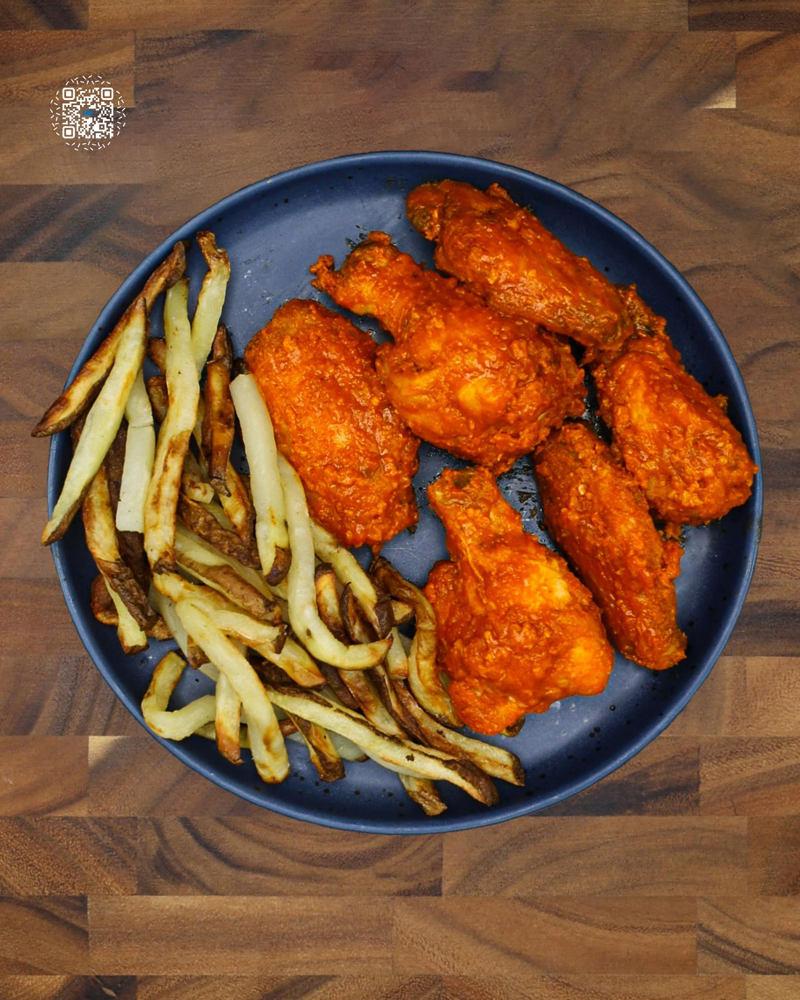

## Additional Recipe Pages

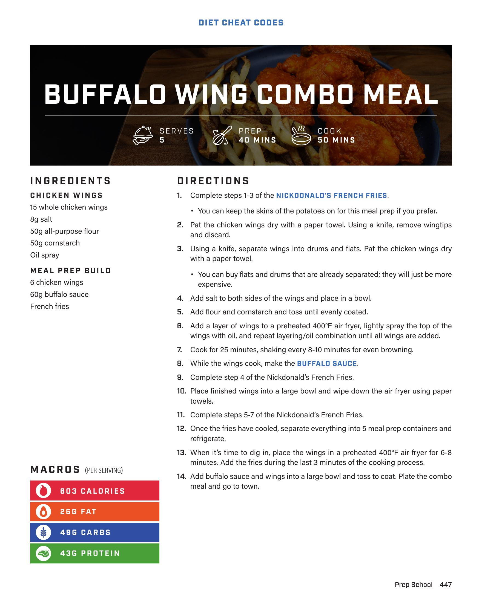

## Source Pages

447, 448

---

# CHEESY BEEF BURRITOS

**Serves:** 20 | **Prep:** 60 MINS | **Cook:** 30 MINS

## Macros

| Calories | Fat | Carbs | Net Carbs | Protein |
|----------|-----|-------|-----------|---------|
| 0 |  |  | undefined |  |

## Ingredients

### BEEF MIX

- 896g 96% lean ground beef
- 15g all-purpose flour
- 3g chili powder
- 2g crushed red pepper
- 4g ground cumin
- 2g garlic powder
- 2g onion powder
- 1g dried oregano
- 4g paprika
- 9g salt
- 4g MSG
- 3g black pepper
- 480g beef bone broth
- 7g gelatin
- 102g tomato paste
- 500g fat-free Greek yogurt

### ASSEMBLY

- La Banderaita® Carb Counter soft taco tortilla
- La Banderaita® Carb Counter street taco tortilla
- 30g jalapeño cheddar dip
- 30g fat-free refried black beans
- 86g beef mix
- 7g 2% sharp cheddar cheese, grated

## Directions

1. Mix flour, chili powder, red pepper, cumin, garlic powder, onion powder, oregano, paprika, salt, MSG, and black pepper in a small bowl. (Omit chili powder and red pepper if heat sensitive.)
2. Add ground beef to a preheated pan on medium heat and spread it evenly to fully cover the bottom.
3. Place a heavy object (like another pan) on top for even browning. Cook 8-12 minutes.
4. Sprinkle gelatin over broth and let absorb.
5. Crumble beef into small pieces, mix in seasoning, and cook for 30 seconds.
6. Stir in the bloomed broth-gelatin mixture and tomato paste. Bring to a simmer and reduce for 10-12 minutes, stirring every couple of minutes.
7. Remove from heat, let cool for 10 minutes, then stir in Greek yogurt until fully combined.
8. Lay out soft taco tortillas and spread 30g of cheddar dip in a circle about the size of the street taco tortillas.
9. Spread 30g of refried beans onto each street taco tortilla and place them on top of the cheddar dip layer.
10. Add 86g beef mix on top of the beans, followed by 7g sharp cheddar cheese.
11. Fold both ends of the tortilla inward, tucking them in farther than expected.
12. While holding the ends in place, fold the flap nearest to you over the filling, tucking in any escaping ingredients, then roll up tightly. Repeat until you have 20 burreats.
13. Store burritos: Refrigerate what you will eat in the next 2-4 days and freeze the rest.
14. When you need more, move 2-3 days' worth from the freezer to the fridge to thaw for 24 hours.

## Tips

FROM FRIDGE: Microwave for 60-90 seconds wrapped in parchment. FROM FREEZER: Bake for 30-35 minutes in a 400 degree oven wrapped in foil.

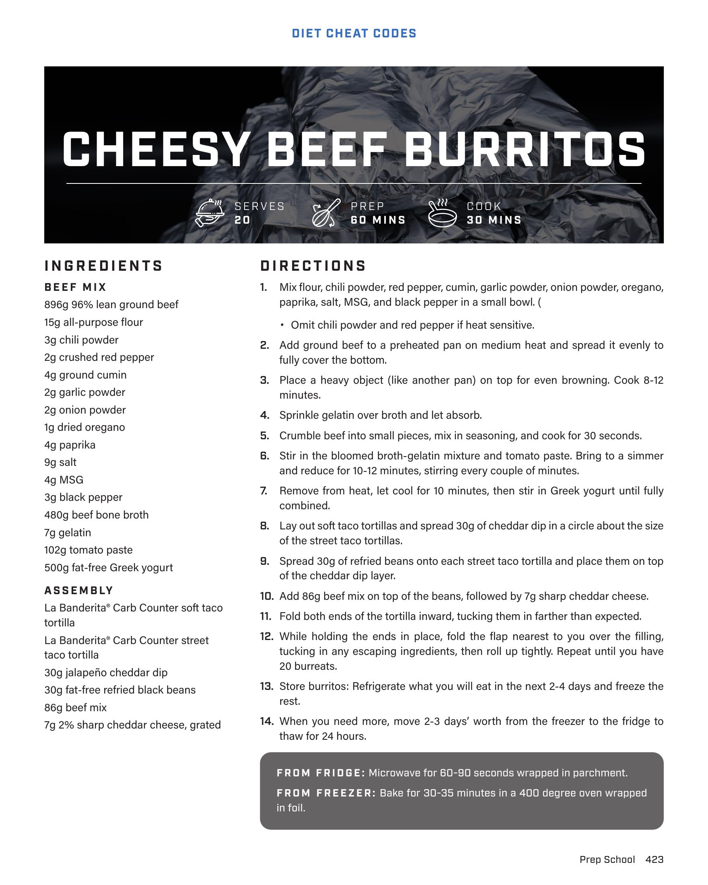

## Source Pages

424

---

# CHICKEN ALFREDO

**Serves:** 5 | **Prep:** 15 MINS | **Cook:** 8 HRS

## Macros

| Calories | Fat | Carbs | Net Carbs | Protein |
|----------|-----|-------|-----------|---------|
| 608 | 13 | 60 | undefined | 66 |

## Ingredients

- 10g olive oil
- 1000g chicken breast
- 10g garlic, minced
- 500g chicken broth
- 360g 2% milk
- 24g Better Than Bouillon™ chicken base
- 84g low-fat cream cheese
- 112g 2% cottage cheese
- 3g garlic powder
- 3g onion powder
- 308g pasta
- 3g salt
- 2g black pepper
- 300g broccoli, bagged
- 28g parmigiano reggiano, grated

### SLURRY

- 20g potato starch
- 30g water

## Directions

1. Pat chicken dry, heat oil in a pan over medium-high heat, and sear chicken for 3-4 minutes per side or until browned. Remove from pan.
2. Sauté garlic in the same pan for 30-45 seconds and add to a small bowl. Add a splash of broth to deglaze, scraping up the browned bits, and transfer this flavor juice into the slow cooker.
3. Add chicken, remaining broth, milk, chicken base, cream cheese, cottage cheese, garlic powder, and onion powder to the slow cooker. Ensure chicken is mostly submerged; slow breasts in half lengthwise if needed.
4. Set slow cooker to low for 5-6 hours or high for 3-4 hours, making sure the chicken reaches 165°F.
5. While the chicken cooks, place the pasta in a wide, shallow dish and cover it with lukewarm water, ensuring the water is about 1 inch above the pasta. Let it soak.
6. Remove the chicken, turn the slow cooker to high, and whisk the liquid until smooth.
7. In a small bowl, combine potato starch and water to form a slurry. Stir the garlic, slurry, salt, pepper, and Parmesan into the slow cooker.
8. Lift the pasta from the water, let most of the water drip off, then add it directly to the slow cooker and mix well.
9. Microwave the broccoli as directed, then shred the chicken and mix both into the slow cooker.
10. Let cool and divide into 5 containers (about 480g each).
11. Refrigerate and reheat for 2-3 minutes when ready to eat.

## Additional Recipe Pages

## Source Pages

435, 436, 437

---

# CHICKEN NOODLE SOUP

**Serves:** 5 | **Prep:** 20 MINS | **Cook:** 30 MINS

## Macros

| Calories | Fat | Carbs | Net Carbs | Protein |
|----------|-----|-------|-----------|---------|
| 515 | 10 | 57 | N/A | 52 |

## Ingredients

- 20g olive oil
- 400g celery, sliced
- 15g garlic, minced
- 454g peas and carrots, frozen
- 340g diced onion, frozen
- 3g paprika
- 3g black pepper
- 48g Better Than Bouillon® roasted chicken base
- 1014g chicken broth
- 224g Barilla® Protein+ noodles
- 255g spinach
- 1 rotisserie chicken
- 3g turmeric
- 8g parsley, chopped
- 400g chicken broth

## Directions

1. Add olive oil to a large pot and add to stovetop on medium heat.
2. Chop celery into 1/8 inch slices, add to pot, and stir to coat. Chop parsley.
3. Remove all meat from the rotisserie chicken and give the celery a stir.
4. Chop the chicken into bite sized pieces, add garlic to the pot, and stir.
5. After 45 seconds or the garlic becomes fragrant, add frozen vegetables and stir.
6. Let everything cook for 2-3 minutes, stirring occasionally.
7. Add paprika, black pepper, and Better Than Bouillon® to pot and mix to combine.
8. Add chicken broth and let it heat up for 2-3 minutes.
9. Once broth is simmering, add noodles and cook until al dente.
10. Add chicken and spinach. Gently push down and mix in spinach until completely submerged in chicken broth.
11. Add turmeric, parsley, and extra chicken broth. Give everything a stir and remove from heat.
12. Once cooled, add ~830g of soup to 5 containers and refrigerate.
13. To reheat, add to a bowl, put damp paper towel over the bowl, and microwave for 4-5 minutes.

## Tips

You can use the left-over chicken bones and skin to make a homemade chicken broth for the next round of chicken soup. I explain exactly how to do this in the recipe video.

## Additional Recipe Pages

## Source Pages

429, 430, 431

---

# CHICKEN PARM SANDWICH

**Serves:** 5 | **Prep:** 15 MINS | **Cook:** 20 MINS

## Macros

| Calories | Fat | Carbs | Net Carbs | Protein |
|----------|-----|-------|-----------|---------|
| 0 |  |  | N/A |  |

## Ingredients

- 5 thinly sliced chicken breasts

### DREDGE STATION 1

- 100g all-purpose flour

### DREDGE STATION 2

- 1 egg
- 1 egg white

### DREDGE STATION 3

- 160g italian seasoned breadcrumbs
- 16g Parmigiano-Reggiano cheese, grated
- 5g salt
- 2g black pepper

### MARINARA SAUCE

- 1 can crushed tomatoes
- 8g olive oil
- 7g garlic, minced
- 1g oregano
- 6g salt

### CHICKEN PARM BUILD

- POTATO BUN
- Chicken
- 40g marinara sauce
- 5g Parmigiano-Reggiano cheese, grated
- Oil spray

## Directions

1. Cut chicken into 140g cutlets.
2. Set up dredging stations into three separate containers and mix each station until well combined.
3. Take a piece of chicken and add it to Dredging Station 1.
4. Cover with flour, making sure to get into all the crevices, and shake off excess flour.
5. Add chicken to Dredging Station 2 and completely soak with egg, making sure there are no dry spots. Let excess liquid drip off.
6. Move chicken to Dredging Station 3 and completely cover with the breadcrumb mixture, making sure to press it into the chicken and all its crevices.
7. Put the breaded chicken on a wire rack and repeat steps 3-6 with another piece of chicken.
8. Lightly spray the top and bottom of the chicken with oil and add it to a preheated 400°F air fryer.
9. Air fry for 6-8 minutes or until internal temperature of the chicken reaches 160°F.
10. Continue breading the remaining chicken and once the first two pieces are finished cooking, put finished chicken on a wire rack and repeat the process until all chicken is cooked.
11. Toast a bun on the bagel setting to make sure only the inside of the bun is browned.
12. Add chicken to the bottom bun followed by marinara sauce and grated parmesan.
13. Add the extra marinara and leftover chicken into separate containers and refrigerate.
14. To reheat, add the chicken to a preheated 350° airfryer for 3-4 minutes and repeat steps 11 and 12 to plate.

## Source Pages

432

---

# CHICKEN TINGA TOSTADAS

**Serves:** 5 | **Prep:** 45 MINS | **Cook:** 5 HOURS

## Macros

| Calories | Fat | Carbs | Net Carbs | Protein |
|----------|-----|-------|-----------|---------|
| 611 | 12 | 79 | undefined | 56 |

## Ingredients

- 850g chicken breast, thinly sliced
- 225g onion, diced
- 10g garlic, minced
- 4g salt
- 4g smoked paprika
- 2g cumin
- 2g Mexican oregano
- 8g avocado oil
- 397g fire roasted tomatoes
- 105g chipotle peppers in adobo
- 9 Better Than Bouillon™ chicken base
- 2 bay leaves

### TOSTADA PLATE

- 3 baked tostadas (130 cal)
- 170g REFRIED BEANS
- 250g chicken tinga
- 30g avocado
- 20g lettuce
- 20g tomato
- 6g cotija cheese

## Directions

1. Chop onion, mince garlic, and add salt, smoked paprika, cumin, and Mexican oregano to a small bowl.
2. Add avocado oil and onion to a preheated pot on medium heat. Stir to combine.
3. Once onion becomes translucent, add garlic and seasonings to the pot and mix. Transfer to a slow cooker once the garlic becomes fragrant.
4. Add tomatoes, chipotle peppers, and chicken base to the slow cooker. Stir to combine.
5. Add chicken to the slow cooker, cover the top of the chicken with some of the tomato mix, cover with a lid, and cook on low for 4-6 hours. Chicken should be ½ to ¾ inches thick to cook in this timeframe.
6. Two hours before the chicken is finished cooking, start the REFRIED BEANS.
7. Finish the beans, take the chicken out of the pot, and pull the meat apart using two forks. For a smooth sauce, pour the pot into a high sided container and blend until smooth.
8. Add chicken and sauce back into the pot and stir to combine.
9. Place chicken and beans in 5 meal prep containers and refrigerate.
10. To reheat, place a damp paper towel over a container and microwave in 1-minute intervals, stirring between each interval until desired temperate is reached.
11. Top tostada with ingredients in the order listed and eat.

## Additional Recipe Pages

## Source Pages

441, 442

---

# CREAMY BEEF & SHELLS

**Serves:** 20 | **Prep:** 60 MINS | **Cook:** 80 MINS

## Macros

| Calories | Fat | Carbs | Net Carbs | Protein |
|----------|-----|-------|-----------|---------|
| 526 | 15 | 53 | undefined | 44 |

## Ingredients

- 2688g 93% lean ground beef
- 27g salt (for beef)
- 40g olive oil
- 810g onion, diced + frozen
- 3g salt (for onions)
- 80g garlic, pre-peeled + minced
- 6g black pepper
- 3g crushed red pepper
- 1420g bone broth
- 21g gelatin
- 2829g Cento San Marzano Tomatoes, crushed
- 100g water
- 12g salt (for pasta)
- 908g medium shell pasta
- 454g peas, frozen
- 540g 2% evaporated milk
- 126g Parmigiano Reggiano, grated
- 30g fresh basil

## Directions

1. Preheat oven to 500°F while preheating a pot on medium heat.
2. Flatten ground beef into an even layer on a SHEET PAN, top with salt, and set oven to broil on high.
3. Place meat 6 inches from the broiler and cook for 25-30 minutes, or until a deep brown crust forms across the top.
4. Place onion in a large bowl, heat for 4-6 minutes or until room temperature, and drain excess liquid.
5. Add olive oil to the pot followed by onion and salt, then mix.
6. Sprinkle gelatin over bone broth and let it absorb.
7. Sauté onion until liquid cooks out, but before it takes on color.
8. Create a space in the middle of the pot and add garlic. Evenly spread black pepper and crushed red pepper over the ingredients. Sauté for 60 seconds, then mix.
9. Add tomatoes, bone broth, water, and salt to the pot. Stir and bring to a simmer.
10. As the pot heats to a simmer, crumble beef into small pieces, mix with its juices, add to the pot, and stir.
11. Once simmering, add pasta and cook for 6-8 minutes, stirring every few minutes.
12. Add peas and evaporated milk, mix, and cook until pasta is al dente (typically 8-10 more minutes), stirring every couple of minutes to prevent burning at the bottom of the pot.
13. Remove pot from heat, add Parmigiano Reggiano and basil, and mix.
14. To cool quickly and avoid overcooking noodles, pour pasta onto 2 sheet pans and spread into an even layer.
15. Portion into containers, about 405g each, and refrigerate or freeze.
16. Reheat covered with a damp paper towel for 2 minutes from refrigerator, then mix. From frozen, microwave for 4-6 minutes, stir, then microwave for 1-2 more minutes and mix again.

## Notes

This recipe requires a 20 QT POT. If you don't have one, make 1/3 the recipe in a 5.5 qt pot for 6 servings.

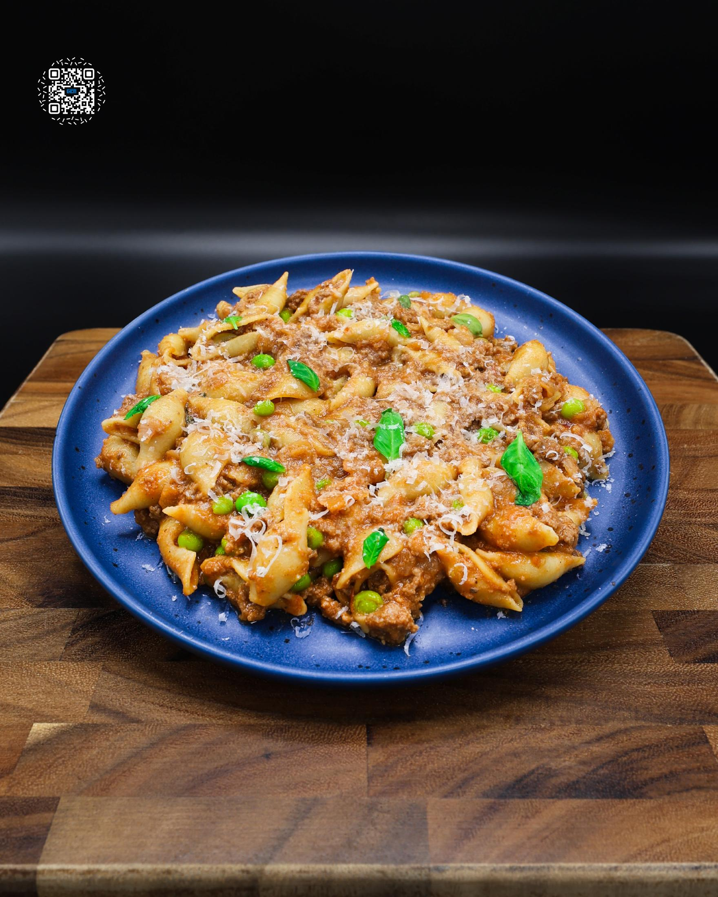

## Additional Recipe Pages

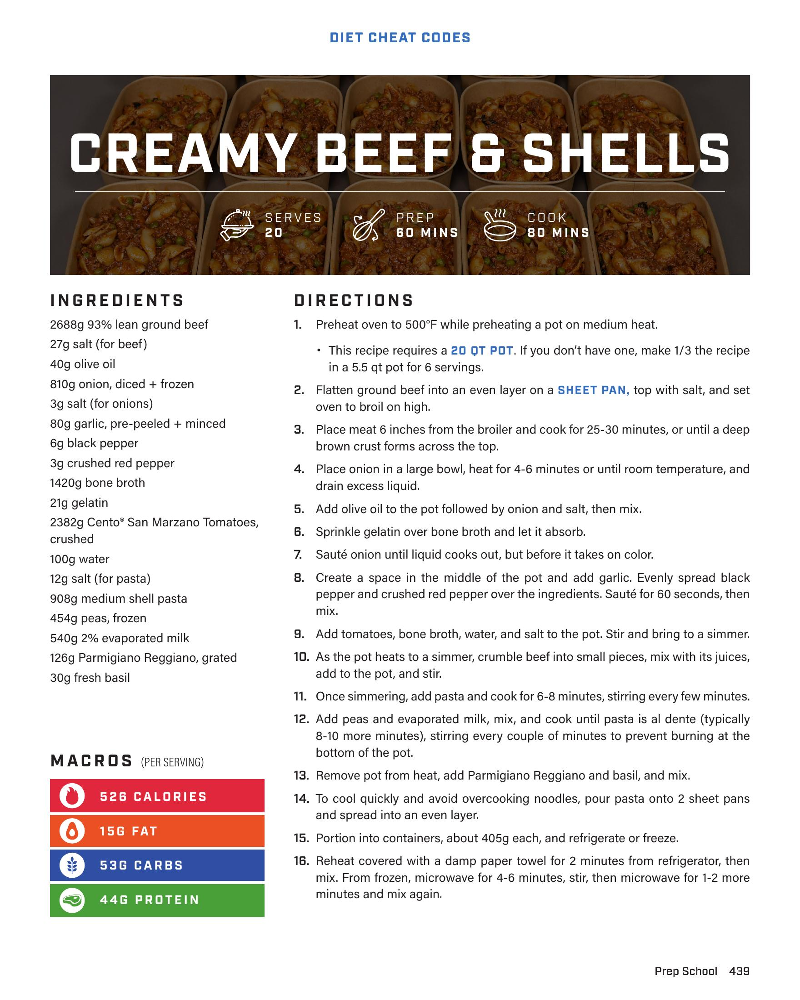

## Source Pages

439, 440

---

# GARLIC PARMESAN WING COMBO MEAL

**Serves:** 5 | **Prep:** 45 MINS | **Cook:** 90 MINS

## Macros

| Calories | Fat | Carbs | Net Carbs | Protein |
|----------|-----|-------|-----------|---------|
| 618 | 27 | 48 | undefined | 45 |

## Ingredients

### CHICKEN WINGS

- 15 whole chicken wings
- 8g salt
- 50g all-purpose flour
- 50g cornstarch
- Oil spray

### MEAL PREP BUILD

- 6 chicken wings
- 60g garlic parmesan sauce V2
- French fries

## Directions

1. ROAST 2-3 HEADS OF GARLIC.
2. Complete steps 1-3 of the NICKDONALD'S FRENCH FRIES.
3. Pat the chicken wings dry with a paper towel. Using a knife, remove wingtips and discard.
4. Using a knife, separate wings into drums and flats. Pat the chicken wings dry with a paper towel.
5. Add salt to both sides of the wings and place in a bowl.
6. Add flour and cornstarch and toss until evenly coated.
7. Add a layer of wings to a preheated 400°F air fryer, lightly spray the top of the wings with oil, and repeat layering/oil combination until all wings are added.
8. Cook for 25 minutes, shaking every 8-10 minutes for even browning.
9. While the wings cook, make the GARLIC PARMESAN SAUCE.
10. Complete step 4 of the Nickdonald's French Fries.
11. Place cooked wings into a large bowl and wipe down the air fryer using paper towels.
12. Complete steps 5-7 of the Nickdonald's French Fries.
13. Once the fries have cooled, separate the wings and fries into 5 meal prep containers and refrigerate.
14. When it's time to dig in, place the wings in a preheated 400°F air fryer for 6-8 minutes. Add the fries during the last 3 minutes of the cooking process.
15. Add wings and garlic parmesan sauce into a large bowl and toss to coat. Plate the combo meal and it's time to eat.

## Notes

You can buy flats and drums that are already separated; they will just be more expensive.

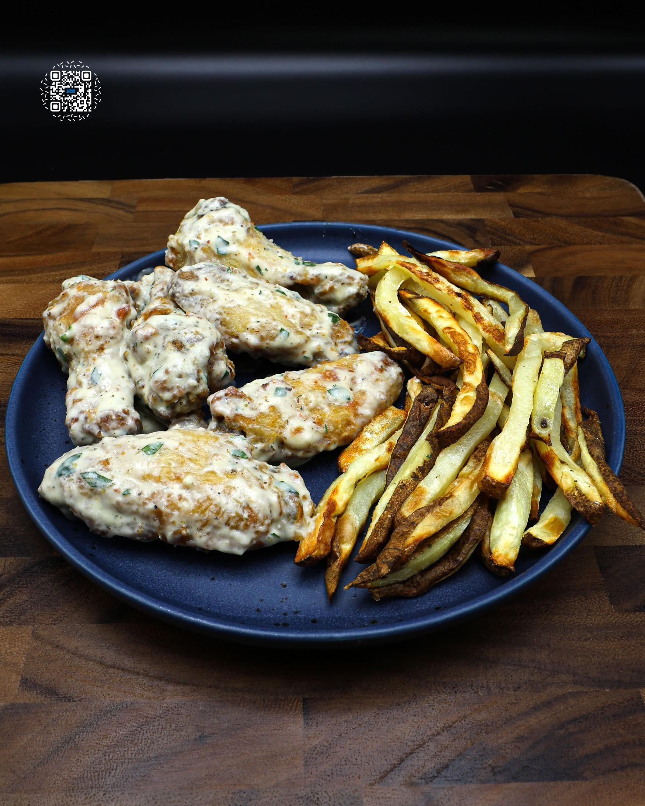

## Additional Recipe Pages

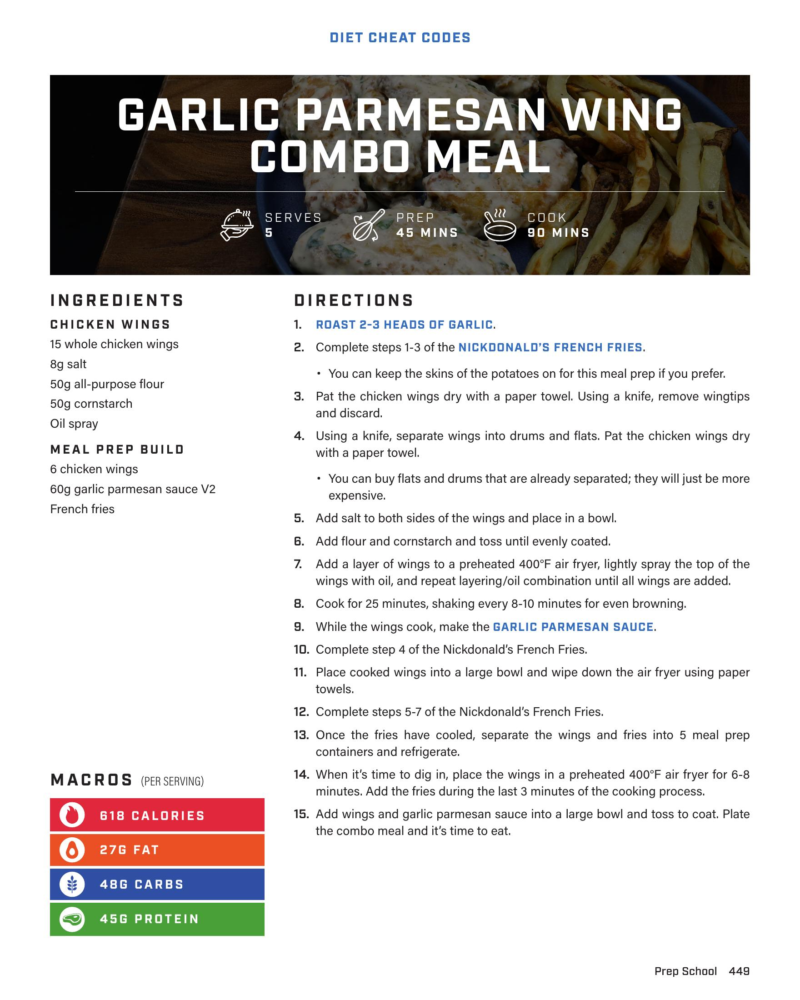

## Source Pages

449, 450

---

# NICKCHICKEN MEAL PREP

**Serves:** 5 | **Prep:** 45 MINS | **Cook:** 45 MINS

## Macros

| Calories | Fat | Carbs | Net Carbs | Protein |
|----------|-----|-------|-----------|---------|
| 541 | 11 | 72 | undefined | 41 |

## Ingredients

### CHICKEN MIX

- 700g chicken breast
- 9g salt
- 6g granulated erythritol
- 3g baking soda

### WET STATION ONE

- 230g water
- 20g corn starch

### DRY STATION:

- 90g all-purpose flour
- 3g garlic powder
- 2g paprika
- 3g salt
- 2g white pepper
- 3g black pepper

### WET STATION TWO

- 1 egg
- 1 egg white
- 2g baking powder

### FINISHING TOUCHES

- Olive oil spray

### NICKCHICKEN BUILD

- Buns (110 Cal)
- 1 NickChicken patty
- 15g light mayonnaise
- Lettuce

### FRENCH FRIES

- 1000g russet potatoes, peeled (about 1200g before peeling)
- 1200g beef broth
- 30g sugar
- 8g oil spray
- Salt, to taste

## Directions

1. Add beef broth and sugar to a large bowl and whisk until sugar is dissolved.
2. Peel potatoes and using a fry tower cutter, cut the potatoes into shoestring french fry size and add to beef broth mixture.
3. Once all fries are added to the beef broth, mix fries around to keep them separated. Make sure all fries are covered with broth and set to the side.
4. Preheat an air fryer to 400°F.
5. Cut chicken breast into medium-sized chunks, add to blender, and pulse blender for 10-15 seconds or until it is a similar consistency to ground chicken.
6. Add ground chicken to a bowl, then add salt and erythritol. Mix together until ingredients are thoroughly combined.
7. Spray your hands with oil to prevent the ground chicken from sticking to your hands, then separate the chicken mix into 140g sized balls. Form the chicken balls into patties that are slightly wider than the buns and place on a piece of parchment paper.
8. Set up dredging stations by adding all ingredients to three separate containers and mixing until well combined.
9. With one hand or your "wet hand," take a chicken patty, submerge it into the first wet station container, let extra liquid drip off, and place into the Dry Ingredients container.
10. Using your other hand or what I like to call your "dry hand," add the wet patty to your dry flour mixture and push flour into the patty to coat it thoroughly, making sure the sides of the patty are covered as well.
11. Once patty is fully coated, shake any excess flour off, and add to Wet Station Two.
12. Make sure the chicken patty is completely coated in egg wash and let any excess drip off.
13. Put chicken patty back into the dry station and repeat step 10.
14. Place the finished chicken patty on wire rack and repeat.
15. Spray the bottom of the air fryer and place a patty into the air fryer basket, spraying a light coat of oil on the top of the patty.
16. Cook chicken for 6-8 minutes in the air fryer or until chicken has reached an internal temperature of 165°F, flipping halfway through.
17. Repeat until all chicken is cooked.
18. While patties are cooking, drain broth out of the fries, and add fries to a salad spinner.
19. Use salad spinner to get excess liquid off of the fries and place them onto paper towels.
20. Using paper towels, pat the fries dry and once the final NickChicken is finished, lightly spray the bottom of the air fryer with oil.
21. Add a layer of fries to the air fryer, lightly spray the top of the fries with oil, and repeat layering/oil combination until all fries are added.
22. Cook at 400°F for 20-25 minutes, tossing every 5-6 minutes.
23. Take fries out, add salt to taste, and shake them to evenly disperse salt.
24. Thinly slice lettuce, add light mayo to condiment cups, lay out 5 meal prep containers, and let NickChickens and fries come to room temperature.
25. Add NickChicken, fries, lettuce, and mayo to each meal prep container and refrigerate.
26. When ready to chow down, toast the inside of a bun, place fries and NickChicken in a preheated 350°F air fryer for 3-4 minutes, plate it, and eat.

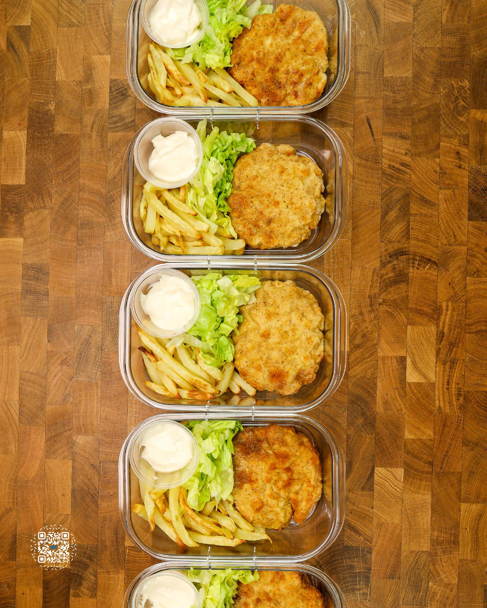

## Additional Recipe Pages

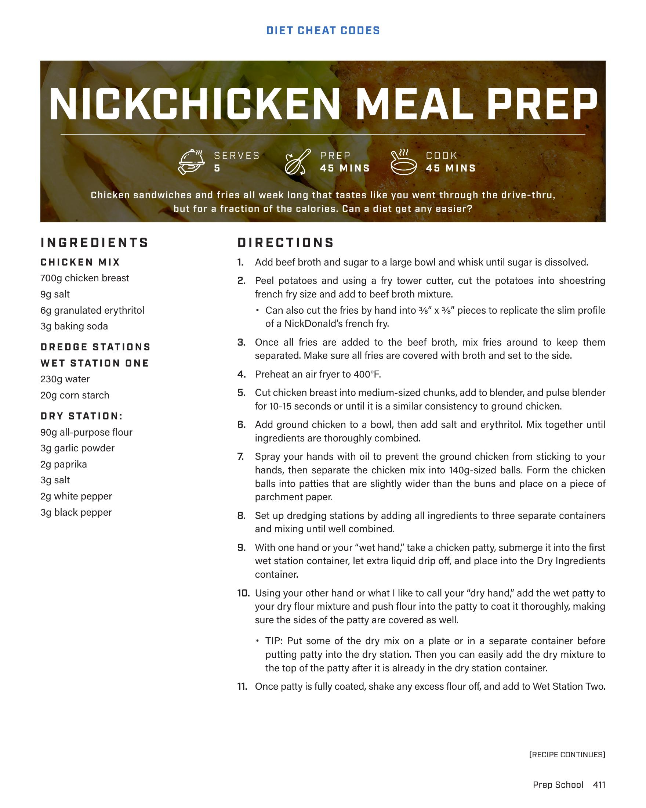

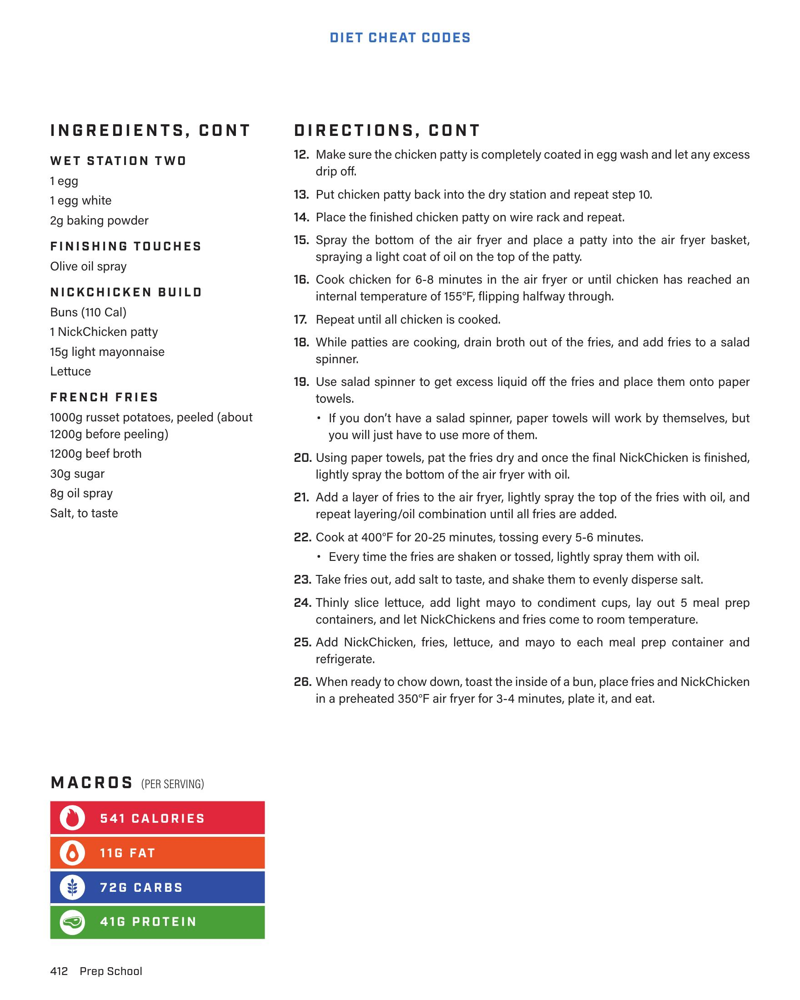

## Source Pages

411, 412, 413

---

# PIZZA POT PIE MEAL PREP

**Serves:** 5 | **Prep:** 60 MINS | **Cook:** 15 MINS

## Macros

| Calories | Fat | Carbs | Net Carbs | Protein |
|----------|-----|-------|-----------|---------|
| 585 | 17 | 69 | undefined | 41 |

## Ingredients

### DOUGH

- 405g all-purpose flour
- 5g salt
- 3g instant yeast
- 250g water

### SAUCE

- 10g olive oil
- 80g onion, grated
- 7g garlic
- 1g dried oregano
- 794g Red Gold® crushed tomatoes
- 5g salt

### POT PIE BUILD

- 1 dough
- 65g part-skim mozzarella, sliced
- 40g fat-free mozzarella, shredded
- 65g sauce
- 3g butter, melted
- Oil spray

## Directions

1. Add flour, salt, and yeast to a large bowl. Whisk to combine.
2. Add water and mix the ingredients using a spoon until a shaggy dough forms. Go in with a wet hand, press the dough down, and fold it onto itself. The goal is to get all of the dry ingredients mixed in.
3. Once the dough is fully hydrated, cover for 20 minutes.
4. Using a wet hand, perform a stretch and fold by pulling one side of the dough as high as possible then folding it over itself.
5. Turn the bowl 90 degrees and repeat 3-4 more times until all dough has been stretched.
6. Flip the dough over and form into a ball by sliding your hand underneath the dough and pulling it in a circular motion towards your body.
7. Cover the dough for 20 minutes and repeat steps 4-6. Cover for an additional 20 minutes.
8. Divide the dough into 5 pieces. Each piece should weigh roughly 130g.
9. Form each piece into individual balls by flattening the dough with your fingers, folding each side of the dough into the middle, flipping it over, and rolling it in a circular motion until a ball is formed.
10. Grab 5 high-sided containers, lightly spray oil into each one, put a dough ball into each container, cover with a lid, and refrigerate for 24 hours.
11. Add olive oil and onion to a preheated pot on medium heat and mix. Sauté onion for 2-3 minutes, add garlic and oregano, and stir.
12. Once garlic becomes fragrant, add tomatoes and salt. Stir to combine. When the sauce starts bubbling or boiling, reduce the heat to low, give the pot a mix, and simmer for 15-20 minutes.
13. After cooling, transfer the sauce to a high-sided container and refrigerate.
14. Grab a ceramic bowl that is about 6" wide and 1.5" deep. Lightly spray with oil.
15. Add slices of mozzarella to the bowl, followed by the fat-free mozzarella and sauce.
16. Grab the outside of the dough and rotate it in a circle, letting gravity stretch it out until it is big enough to cover the entire bowl.
17. Lay the dough over the top of the bowl and pat the edges of the dough.
18. Heat butter in the microwave until melted. Lightly brush it on the top and sides of the dough.
19. Bake in a preheated 450°F oven for 14-16 minutes or until dough is golden brown.
20. Once finished pull it out, heat 3g of butter in the microwave until melted, and brush on top.
21. With high quality oven mitts, quickly flip the bowl on a tray lined with aluminum foil. Slowly go around the rim with a spoon and pull the bowl away from the pot pie.
22. Brush any remaining butter on top of the crust and place under the broiler on high until the cheese and crust turn golden brown or to your preference.

## Tips

You can make multiple pot pies at once and freeze them. To reheat, bake at 450°F for 12-16 minutes.

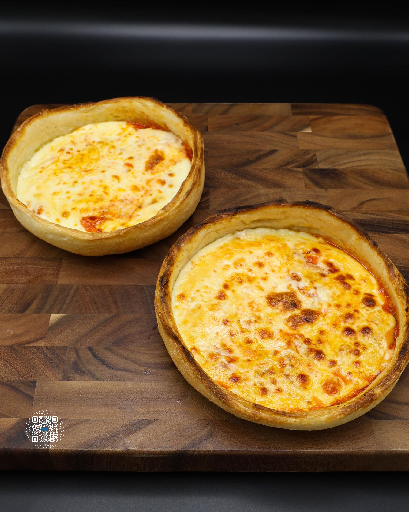

## Additional Recipe Pages

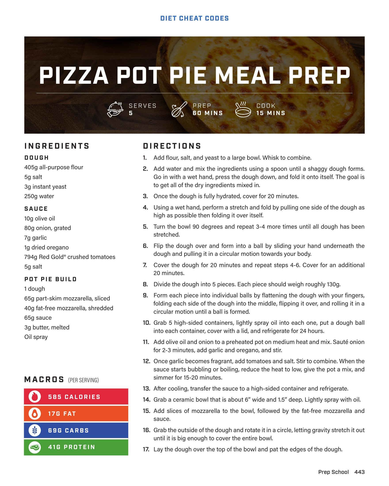

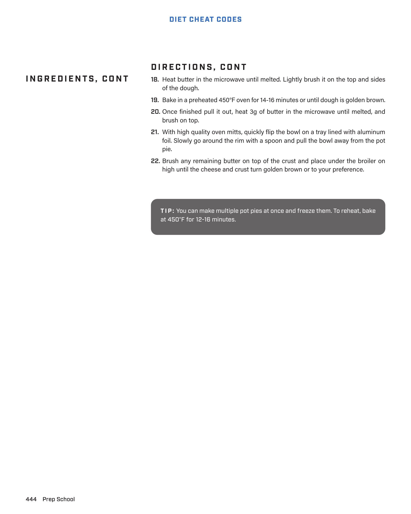

## Source Pages

443, 444, 445

---

# PULLED PORK + MAC

**Serves:** 6 | **Prep:** 20 MINS | **Cook:** 8 HOURS

## Macros

| Calories | Fat | Carbs | Net Carbs | Protein |
|----------|-----|-------|-----------|---------|
| 604 | 14 | 89 | 50 | 70 |

## Ingredients

- 1134g pork tenderloin
- 10g avocado oil
- 196g onion, diced
- 170g red pepper, diced
- 15g garlic, minced
- 16g salt
- 4g black pepper
- 8g smoked paprika
- 5g ground mustard
- 5g cumin
- 50g brown sugar erythritol
- 90g water
- 60g apple cider vinegar
- 45g Worcestershire sauce

### MEAL PREP BUILD

- 2 buns (100 cal)
- 200g pulled pork
- 40g barbeque sauce (20 cal)
- 160g OG MAC AND CHEESE

## Directions

1. Drain pork tenderloin, pat dry with paper towels, and add to a large bowl.
2. Dice onion and red pepper and mince garlic.
3. Add avocado oil and pork tenderloin to a preheated pan on medium high heat and sear on one side until golden brown.
4. Add salt, black pepper, smoked paprika, ground mustard, cumin, and brown sugar erythritol to a large bowl and mix. Add the seared pork tenderloin into the spice mix.
5. Add onion and red pepper to the pan and mix with remaining oil. Sauté for 2-3 minutes or until onions become translucent.
6. Add garlic to the pan, mix, and sauté for one minute or until garlic becomes fragrant.
7. Place the vegetables into the slow cooker along with the water, apple cider vinegar, and Worcestershire sauce.
8. Completely coat the pork tenderloin with the spice mix and place it in the slow cooker with the raw side facing up.
9. Cook on low for 8-10 hours or on high for 5-6 hours. When a fork easily pierces the tenderloin, it is finished.
10. Take the tenderloin out of the pot, pull the meat apart using two forks, and give the meat a rough chop.
11. For a smooth sauce, pour the pot into a high sided container and blend until smooth.
12. Add the sauce and pulled pork back to the slow cooker and mix.
13. Make the OG MAC AND CHEESE.
14. Add pulled pork and mac and cheese to 6 meal prep containers and refrigerate.
15. To reheat, place a damp paper towel over a container and microwave in 1-minute intervals, stirring between each interval until desired temperate is reached.
16. Add pork to buns, top with barbecue sauce, and enjoy.

## Additional Recipe Pages

## Source Pages

433, 434

---

# SAUSAGE EGG NICKMUFFIN

**Serves:** 6 | **Prep:** 15 MINS | **Cook:** 15 MINS

## Macros

| Calories | Fat | Carbs | Net Carbs | Protein |
|----------|-----|-------|-----------|---------|
| 346 | 15 | 34 | 23 | 29 |

## Ingredients

### SAUSAGE

- 448g 90% lean ground pork
- 6g salt
- 2g MSG
- 2g black pepper
- 1.5g sage
- 1.5g rosemary
- 1g garlic powder
- 1g onion powder
- .5g nutmeg
- 2.5g potato starch
- 20g erythritol

### SANDWICH [1 SERVING]

- 1 English muffin (100 cal)
- 1 slice Velveeta cheese
- 1 egg
- 1 sausage patty

## Directions

1. Combine sausage ingredients in a bowl. Cover and refrigerate for 12-24 hours for best flavor.
2. Divide sausage into 80g portions, roll into balls, and place each on a sheet of parchment paper. Cover with another sheet, and press into 5" patties using a flat-bottomed pan or pot.
3. Heat a pan over medium heat and cook the patties for 2-3 minutes on one side, until browned.
4. Flip the patties and cook for an additional 1-2 minutes.
5. Wipe the pan clean. Spray six CANNING LIDS AND BANDS with oil for easy release, and place them in the pan.
6. Crack an egg into each break the yolk, top with salt, and add 30g water to the pan. Cover immediately and cook 2-3 minutes.
7. Let the sausage and eggs cool completely, then pat dry with a paper towel to prevent soggy sandwiches.
8. Assemble the sandwiches by layering the bottom bun, cheese, an egg, a sausage patty, and the top bun. Optional: Toast muffins in the pan before assembling if desired. However, I find with condensation when reheating, it's not worth the extra step.

## Tips

If you can't get 90% lean ground pork, use ground beef or turkey with similar macros.

## Notes

Storage: Freezing: Freeze assembled sandwiches on a sheet pan for 2 hours, then vacuum seal or store in airtight bags. Refrigerating: Wrap sandwiches in parchment paper and refrigerate. Reheating: From frozen: Wrap in parchment paper, thaw overnight in the fridge (10-12 hours), then microwave 60-90 seconds. From fridge: Microwave 60-90 seconds.

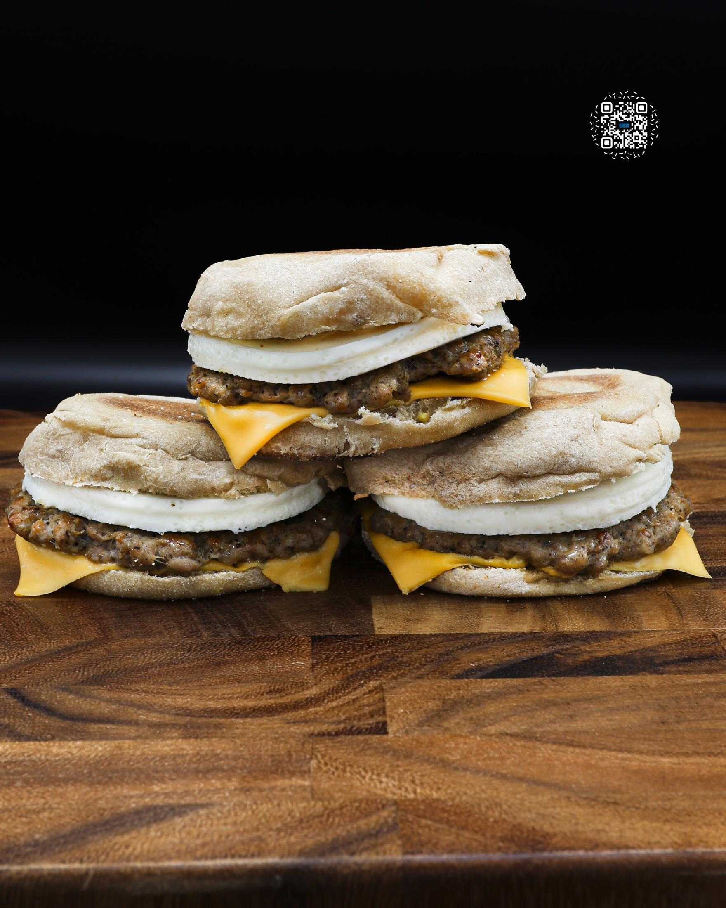

## Additional Recipe Pages

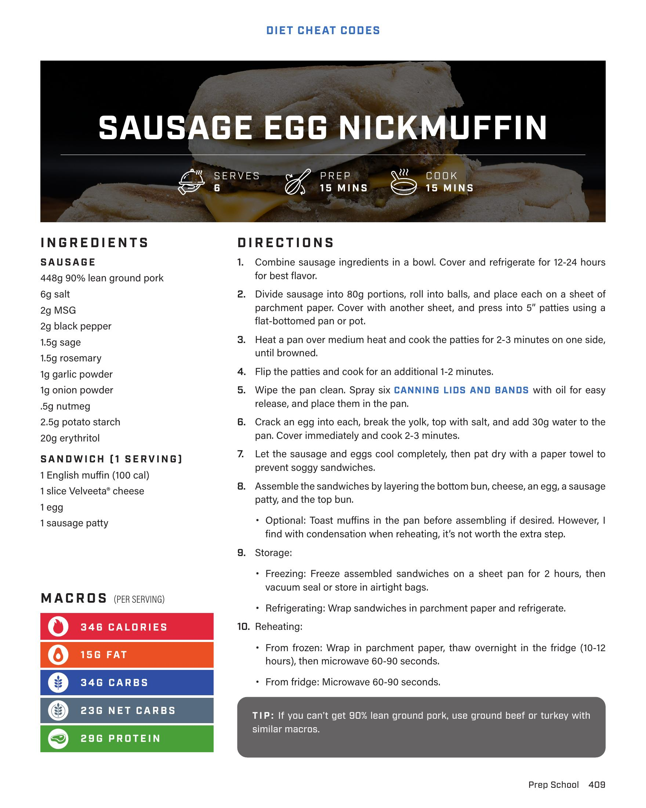

## Source Pages

409, 410

---

# STUFFED CHEESY BREAD

**Serves:** 5 | **Prep:** 1 HR | **Cook:** 15 MINS

## Macros

| Calories | Fat | Carbs | Net Carbs | Protein |
|----------|-----|-------|-----------|---------|
| 791 | 20 | 89 | undefined | 64 |

## Ingredients

### DOUGH

- 500g all-purpose flour
- 125g vital wheat gluten
- 10g salt
- 8g instant yeast
- 425g water

### CHEESY BREAD BUILD

- 1 dough
- 10g corn meal

### INSIDE CHEESE

- 35g fat-free mozzarella cheese
- 35g part-skim mozzarella cheese

### OUTSIDE CHEESE

- 12g fat-free cheddar cheese
- 12g fat-free mozzarella cheese
- 12g 2% mild cheddar cheese
- 12g part-skim mozzarella cheese

### GARLIC BUTTER

- 6g butter
- 1.5 garlic, minced
- 2g Parmigiano Reggiano
- .5g salt
- Pinch fresh parsley, chopped

## Directions

1. Add flour, vital wheat gluten, salt, and yeast to a large bowl. Whisk to combine.
2. Add water and mix the ingredients using a spoon until a shaggy dough forms.
3. Using a wet hand, press the dough down and fold it onto itself. Repeat until all dry ingredients are fully hydrated. Cover for 20 minutes.
4. Using a wet hand, perform a stretch and fold by pulling one side of the dough as high as possible then folding it over itself. Turn the bowl 90 degrees and repeat 3-4 more times until all dough has been stretched.
5. Flip the dough over and form into a ball by sliding your hand underneath the dough and pulling it in a circular motion towards the side of the bowl.
6. Cover the dough for 20 minutes, repeat steps 4 and 5, and divide the dough into 5 pieces. Each piece should weigh 210g.
7. Take one piece of dough, flatten it with your fingers, fold each side of the dough into the middle, and flip it over.
8. Start making the dough ball by pulling it towards your body and letting the friction on the table shape it into a ball. Turn the dough and repeat until a circle is formed. Flip it back over and pinch the edges to seal the dough. Repeat for the other 4 pieces of dough.
9. Grab 5 high-sided containers, lightly spray them with oil, and add the dough balls. Cover with a lid and refrigerate.
10. Pull a container out of the fridge 2-3 hours before you are ready to eat.
11. Pour half the cornmeal on top of the dough, flip dough out onto counter, and add the other half of the cornmeal.
12. Using the tips of your fingers, press and stretch dough until it is shaped into a roughly 8x8 inch square. You can also rotate the dough in a circle along the edge to let gravity stretch it out.
13. Add inside cheese to the front half of the dough. Fold the other half of the dough over the cheese, and seal along the edge.
14. Get a piece of parchment paper, place dough on top of it, and slice it into 8 pieces.
15. Mix the fat-free cheeses of the Outside Cheeses together and sprinkle over the top of the cheesy bread. Mix the remaining cheese together and add over the top of the fat-free cheese.
16. Place the cheesy bread into a preheated 450°F oven for 12-16 minutes.
17. Add butter and garlic to a small bowl and microwave for 15-20 seconds or until melted.
18. Add all other garlic butter ingredients to the bowl and mix. Microwave for another 6-8 seconds and mix again.
19. Brush garlic butter over the entire cheesy bread and proceed straight to Flavor Town.

## Tips

For a frozen meal prep, cook according to instructions and let the cheesy bread come to room temperature on the counter. Add to a plastic bag or vacuum seal and freeze. Place cheesy bread into a preheated 450°F oven for 12-14 minutes.

## Additional Recipe Pages

## Source Pages

451, 452, 453

---

# BUFFALO SAUCE

**Serves:** 10 | **Prep:** 5 MINS | **Cook:** 10 MINS

## Macros

| Calories | Fat | Carbs | Net Carbs | Protein |
|----------|-----|-------|-----------|---------|
| 29 | 2 | 3 | undefined | 0 |

## Ingredients

- 21g butter
- 15g garlic, minced
- 250g hot sauce
- 30g white vinegar
- 30g Worcestershire sauce
- 5g cornstarch

## Directions

1. Add butter to a pot and put on stovetop on low heat.
2. Place hot sauce, vinegar, Worcestershire sauce, and corn starch into a medium bowl. Whisk until corn starch dissolves.
3. Once butter has melted, add garlic and turn up to medium heat. Mix butter and garlic.
4. When the garlic butter starts bubbling and garlic becomes fragrant, add sauce and stir to combine.
5. Once the sauce starts to boil, remove from heat and mix to combine.
6. Add to a container and refrigerate.

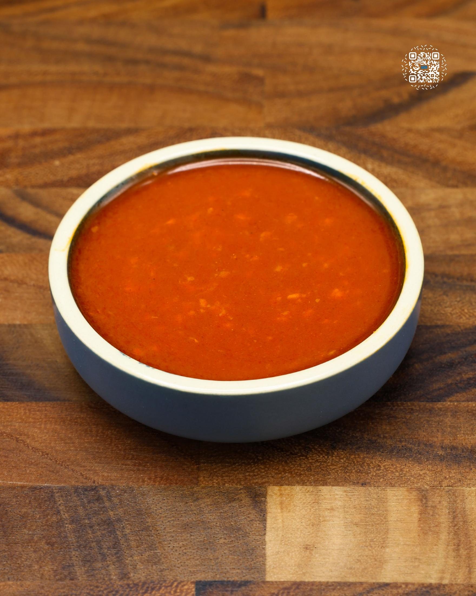

## Additional Recipe Pages

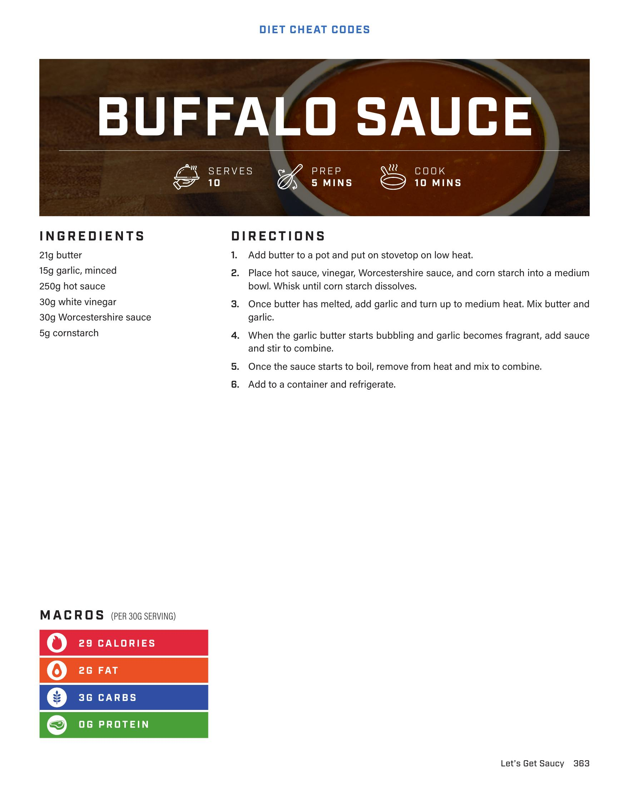

## Source Pages

363, 364

---

# CHIPOTLE AIOLI

**Serves:** 19 | **Prep:** 5 MINS | **Cook:** N/A

## Macros

| Calories | Fat | Carbs | Net Carbs | Protein |
|----------|-----|-------|-----------|---------|
| 34 | 2 | 3 | undefined | 1 |

## Ingredients

- 3g fresh cilantro
- 199g chipotle peppers in adobo sauce
- 150g light mayonnaise
- 200g fat-free Greek yogurt
- 1g white pepper
- 10g granulated erythritol
- 2g smoked paprika
- 5g roasted garlic

### EMULSIFIER

- 5g avocado oil
- 2g xanthan gum

## Directions

1. Add cilantro and chipotle peppers to a food processor and process for 60 seconds.
2. Add all additional ingredients besides the Emulsifiers and process for another 30 seconds.
3. Using a rubber spatula, scrape down the sides and bottom of processor.
4. In a small bowl, add the Emulsifying Ingredients and mix using a spoon.
5. Once the emulsifier has a smooth consistency, add it to the processor and process for 60 seconds.
6. Take blade out and mix together manually to make sure everything is incorporated.
7. Pour into a bowl and serve right away or use a funnel and add to a condiment bottle to use on a plethora of dishes.

## Tips

If you don't have a food processor, you can also put these ingredients into a bowl and use an immersion blender to both mix the ingredients and break them down. If you would like a smoother texture, remove seeds from chipotle peppers before adding to the food processor.

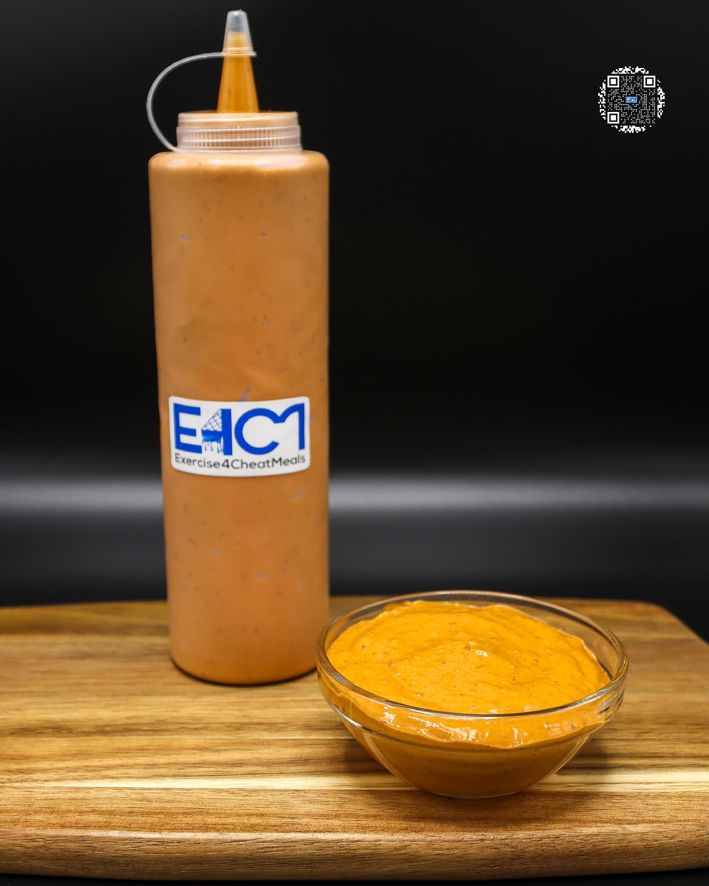

## Additional Recipe Pages

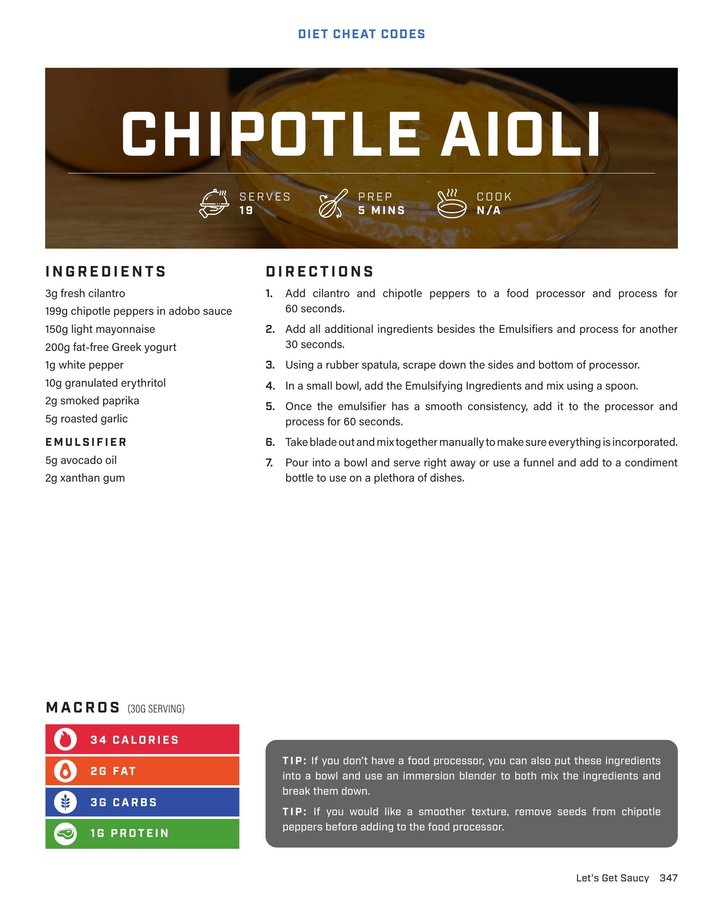

## Source Pages

347, 348

---

# CILANTRO LIME SALSA

**Serves:** 10 | **Prep:** 5 MINS | **Cook:** N/A

## Macros

| Calories | Fat | Carbs | Net Carbs | Protein |
|----------|-----|-------|-----------|---------|
| 20 | 1 | 1 | undefined | 2 |

## Ingredients

- 224g fat-free Greek yogurt
- 30g light mayonnaise
- 4g garlic, minced
- Zest of 1 lime
- 16g lime juice
- 30g fresh cilantro, chopped
- 3g Valentina hot sauce
- Salt and black pepper, to taste

## Directions

1. Add all ingredients to a food processor and process for 30 seconds.
2. Scrape down sides with spatula and process for an additional 30 seconds.
3. Pour salsa into a sauce bottle and serve right away or refrigerate for a couple hours for peak flavor.

## Tips

Use within 1-2 weeks or before ingredients are set to expire.

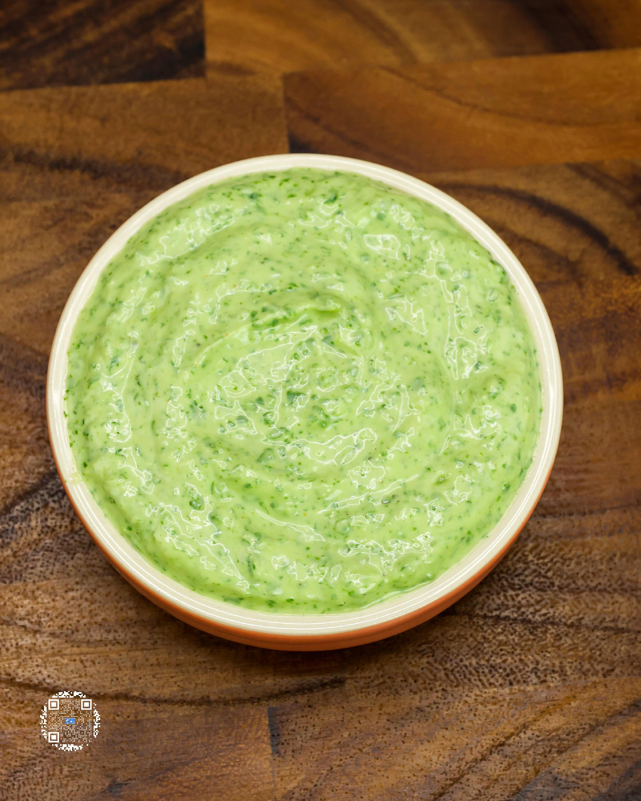

## Additional Recipe Pages

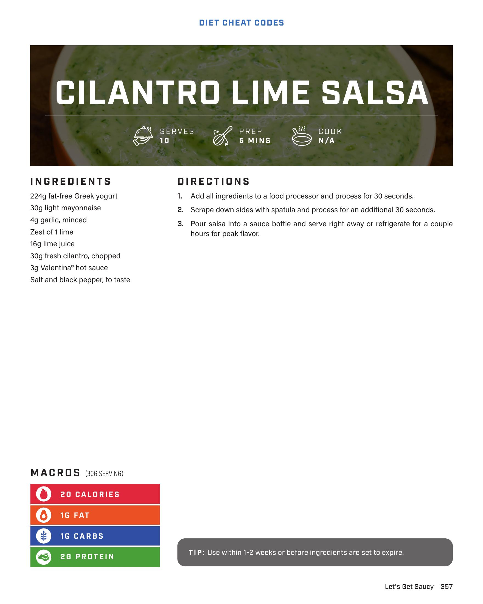

## Source Pages

357, 358

---

# FOOLPROOF HOMEMADE MARINARA

**Serves:** 15 | **Prep:** 5 MINS | **Cook:** N/A

## Macros

| Calories | Fat | Carbs | Net Carbs | Protein |
|----------|-----|-------|-----------|---------|
| 25 | 1 | 5 | 4 | 1 |

## Ingredients

- 28oz can Cento San Marzano whole peeled tomatoes
- 66g tomato paste
- 8g extra virgin olive oil
- 7g garlic, minced
- 2.3g onion powder
- 1g dried oregano
- 1g crushed red pepper flakes
- 6g salt, or to taste
- 10g granulated erythritol, or to taste
- Dash black pepper

## Directions

1. Pour half of the tomatoes into a large bowl.
2. Add the rest of the ingredients and mix with an immersion blender until desired consistency.
3. Pour the other half of the tomatoes into the container and mix with an immersion blender again until desired consistency is achieved.
4. Use right away or store in the fridge/freezer until ready for use.

## Tips

If you want a chunkier sauce, crush tomatoes by hand and mix all ingredients with a whisk or spatula instead of an immersion blender. If you want a zero stash up marinara, pour and mix ingredients directly in the container they will be stored in.

## Additional Recipe Pages

## Source Pages

339, 340

---

# GARLIC PARMESAN SAUCE V2

**Serves:** 13 | **Prep:** 15 MINS | **Cook:** 45 MINS

## Macros

| Calories | Fat | Carbs | Net Carbs | Protein |
|----------|-----|-------|-----------|---------|
| 44 | 3 | 2 | N/A | 3 |

## Ingredients

- 1 egg yolk
- 60g light mayonnaise
- 120g fat-free greek yogurt
- 7g garlic, minced
- 50g roasted garlic
- 42g Parmigiano-Reggiano, grated
- 14g apple cider vinegar
- 60g water
- 6g salt
- .5g dried basil
- .5g dried oregano
- .5g crushed red pepper
- .5g black pepper
- 5g avocado oil
- 1g xanthan gum
- 4g parsley, chopped

## Directions

1. ROAST 2-3 HEADS OF GARLIC.
2. Add all ingredients into a high-sided container besides avocado oil, xanthan gum, and parsley.
3. Using an immersion blender, mix to combine.
4. Add avocado oil and xanthan gum to a small bowl. Mix until the xanthan gum has completely dissolved into the oil.
5. Add oil mixture to the high-sided container and mix for 1-2 minutes.
6. Place sauce in a bottle and refrigerate.

## Notes

This sauce should stay good at least two weeks, especially if you make it with fresh greek yogurt. If you are worried about having too much sauce, I would suggest making a half batch first.

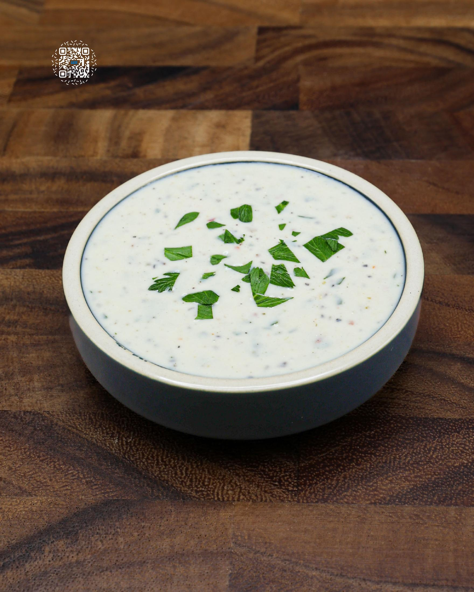

## Additional Recipe Pages

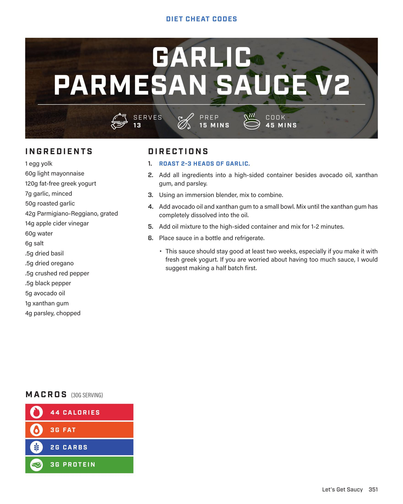

## Source Pages

351, 352

---

# GARLIC PARMESAN SAUCE

**Serves:** 8 | **Prep:** 15 MINS | **Cook:** 45 MINS

## Macros

| Calories | Fat | Carbs | Net Carbs | Protein |
|----------|-----|-------|-----------|---------|
| 48 | 3 | 3 | undefined | 2 |

## Ingredients

- 1 head garlic, roasted
- 5g avocado oil
- 1g xanthan gum
- 60g light mayonnaise
- 45g fat-free Greek yogurt
- 30g sugar-free maple syrup
- 7g apple cider vinegar
- 20g water
- 15g parmesan cheese
- 5g lemon juice
- 1 egg yolk
- 6g salt
- 5g granulated erythritol
- 30g marjoram
- 1g basil
- 1g oregano
- 1g crushed red pepper flakes
- 1g black pepper

## Directions

1. Take the head of garlic and chop off the top so that the tips of the cloves are exposed.
2. Lightly spray top with oil, add a pinch of salt, and a dash of pepper.
3. Wrap the garlic head in aluminum foil and add to a preheated 400°F oven for 45 minutes.
4. In a small bowl, add avocado oil and xanthan gum and mix until combined.
5. In a medium bowl, add all other ingredients and mix.
6. Add avocado oil mixture to bowl while stirring and combine.
7. Use a garlic press to add press in 25g of the freshly roasted garlic to the mix.
8. Give the sauce a good mix, add to a bottle, and refrigerate.

## Tips

To make sauce even smoother, use an immersion blender for steps 6 and 7.

## Additional Recipe Pages

## Source Pages

349, 350

---

# HOMEMADE MARINARA [COOKED]

**Serves:** 14 | **Prep:** 10 MINS | **Cook:** 30 MINS

## Macros

| Calories | Fat | Carbs | Net Carbs | Protein |
|----------|-----|-------|-----------|---------|
| 32 | 1 | 6 | 5 | 1 |

## Ingredients

- 10g extra virgin olive oil
- 120g white onion, diced
- 15g garlic, minced
- 28oz can Cento San Marzano whole peeled tomatoes
- 66g tomato paste
- 1g dried oregano
- 1g crushed red pepper flakes
- 6g salt, or to taste
- 5g erythritol, or to taste
- Dash black pepper

## Directions

1. Dice onions and mince garlic. Set aside.
2. Add olive oil and onions to a preheated pot on medium heat and stir to combine.
3. Add garlic, stir to combine, and let mixture cook for 3-5 minutes.
4. Add tomato paste and thoroughly combine all the ingredients. Simmer for 1 minute.
5. Put an immersion blender into the can of tomatoes, blend 15-20 seconds or until smooth, add to the pan with the rest of the Sauce ingredients, and stir to combine.
6. Once sauce starts bubbling, give it a stir, and turn burner to low.
7. Let sauce simmer for 20-30 minutes or until desired thickness is achieved, stirring occasionally.
8. Serve right away or add to an airtight container and store in the fridge.

## Notes

You can also crush in the tomatoes by hand if you prefer.

![HOMEMADE MARINARA [COOKED]](images/sauces__homemade-marinara-cooked__p341.jpg)

## Additional Recipe Pages

![HOMEMADE MARINARA [COOKED] - page 342](images/sauces__homemade-marinara-cooked__p342.jpg)

## Source Pages

341, 342

---

# MAPLE SYRUP

**Serves:** 18 | **Prep:** 10 MINS | **Cook:** 10 MINS

## Macros

| Calories | Fat | Carbs | Net Carbs | Protein |
|----------|-----|-------|-----------|---------|
| 0 | 0 | 4 | 0 | 0 |

## Ingredients

### WET

- 500g water
- 15g maple extract
- 8g imitation vanilla
- 25g brown sugar erythritol

### DRY

- 50g granulated erythritol
- 3.5g salt
- 2g xanthan gum
- .5g sucralose

## Directions

1. Add all wet ingredients into a high sided container.
2. Add 1g butter extract to provide a rich butter flavor to the maple syrup.
3. In a small bowl, add dry ingredients and mix to combine.
4. While blending, slowly add your dry ingredients into the container.
5. Once all dry ingredients have dissolved, continue blending for 2 minutes.
6. Add the syrup to a pot, put on medium heat, and stir every 2-3 minutes.
7. Once boiling, allow to boil for one additional minute, remove from heat, and let it cool.
8. Optional: When cooled, scrape the foam off the top of the syrup and discard.
9. Add syrup to a container and drizzle on all your breakfast favorites.

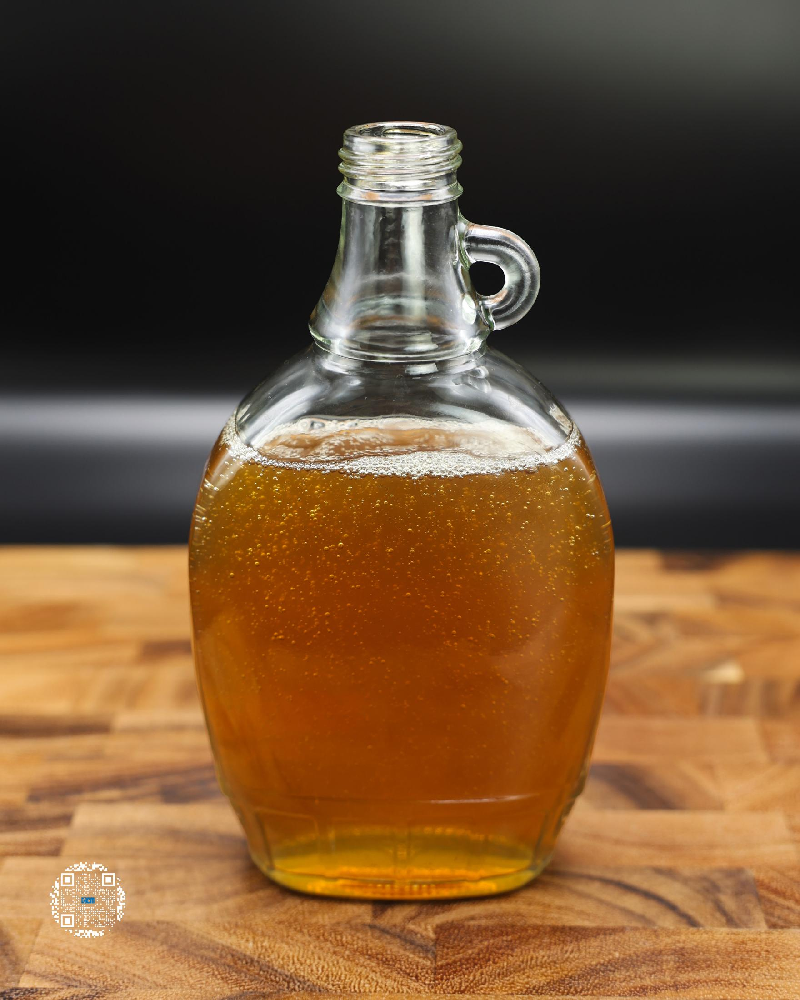

## Additional Recipe Pages

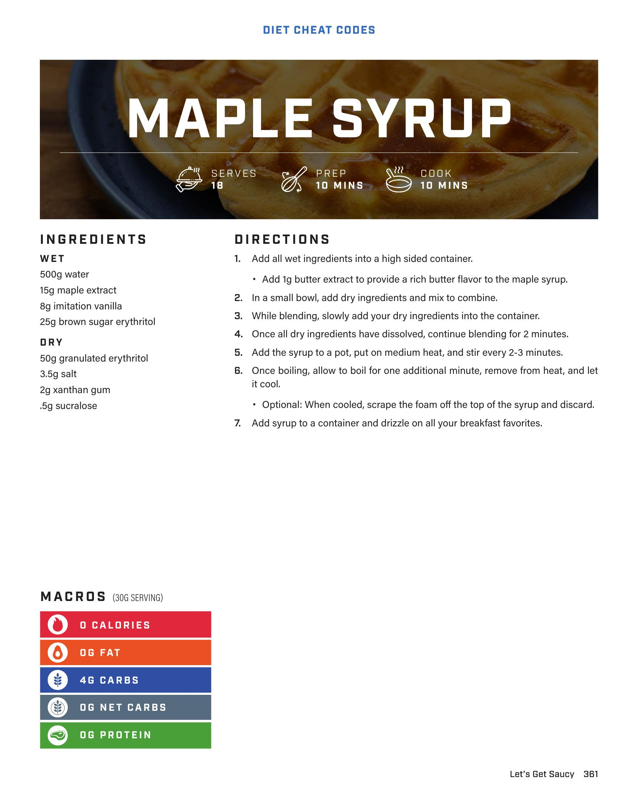

## Source Pages

361, 362

---

# NICKDONALD'S SWEET & SOUR SAUCE

**Serves:** 12 | **Prep:** 5 MINS | **Cook:** 8 MINS

## Macros

| Calories | Fat | Carbs | Net Carbs | Protein |
|----------|-----|-------|-----------|---------|
| 10 | 0 | 9 | 3 | 0 |

## Ingredients

- 85g sugar free peach preserves
- 85g sugar free apricot preserves
- 100g water
- 30g white vinegar
- 50g erythritol
- 10g soy sauce
- 5g mustard
- 2g cornstarch
- 1g salt
- 1g garlic powder
- .5g onion powder

## Directions

1. Place all ingredients in a high-sided container and emulsify for 30 seconds using an immersion blender.
2. If whisking by hand, first dissolve the cornstarch in the water, then add to the high-sided container with the remaining ingredients and mix well.
3. Transfer the mixture to a pot and place over medium heat.
4. Cook for 6-8 minutes, or until the sauce reaches 180°F. This activates the cornstarch and allows the sauce to thicken as it cools.
5. Remove from heat, stir, and allow the sauce to cool to room temperature.
6. Add sauce to a container and refrigerate.

## Tips

You may substitute 50g allulose syrup for erythritol. The flavor will be slightly different, but both work very well. If only one flavor of sugar-free preserves is available to you, double up and use 170g instead of 85g. The sauce will still taste excellent.

## Additional Recipe Pages

## Source Pages

343, 344

---

# RUSSIAN DRESSING

**Serves:** 9 | **Prep:** 5 MINS | **Cook:** N/A

## Macros

| Calories | Fat | Carbs | Net Carbs | Protein |
|----------|-----|-------|-----------|---------|
| 31 | 2 | 2 | undefined | 1 |

## Ingredients

- 6g onion
- 120g no sugar added ketchup
- 60g light mayonnaise
- 60g fat-free Greek yogurt
- 5g Sriracha
- 7.5g horseradish
- 2.5g Worcestershire sauce
- 1.2g smoked paprika
- 1g salt
- Dash black pepper

## Directions

1. Grate onion and add to a medium size bowl.
2. Put bowl on scale, add the rest of your ingredients, and combine.
3. Serve right away or let it sit in the fridge for a couple of hours to let the flavors compound.

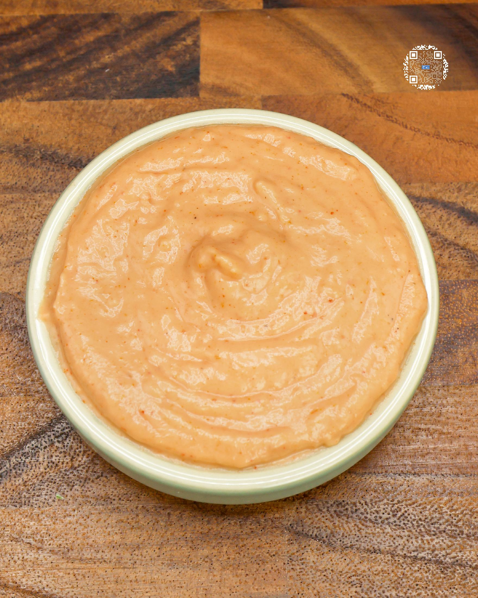

## Additional Recipe Pages

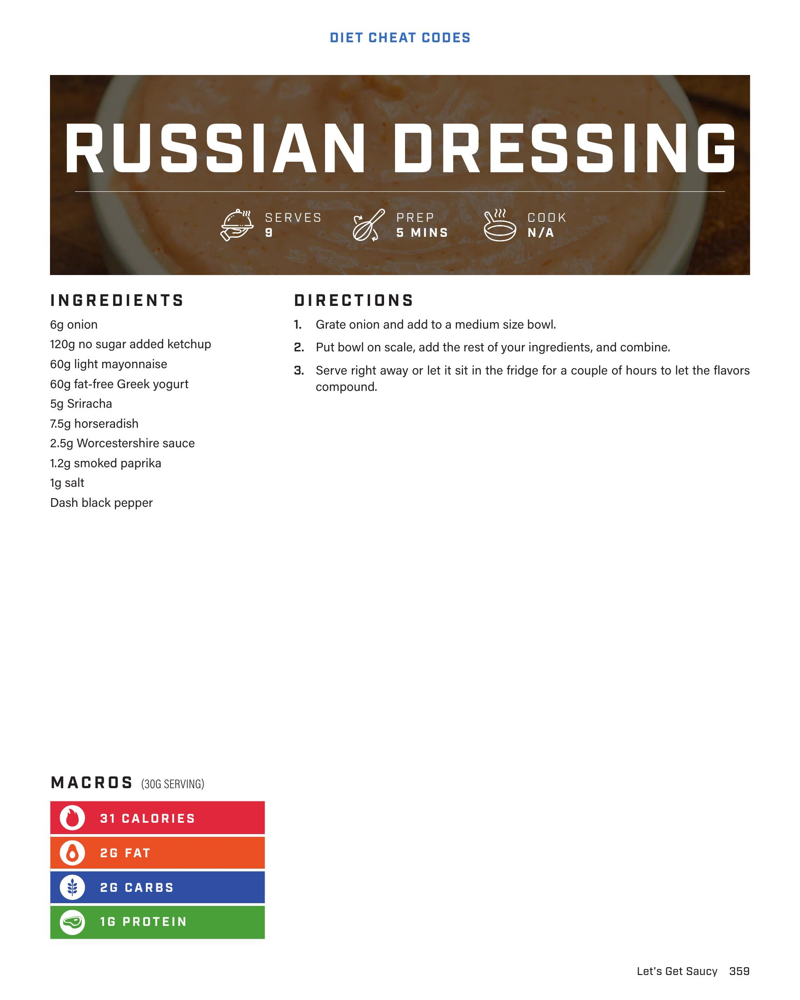

## Source Pages

359, 360

---

# SALSA CREMA

**Serves:** 12 | **Prep:** 5 MINS | **Cook:** N/A

## Macros

| Calories | Fat | Carbs | Net Carbs | Protein |
|----------|-----|-------|-----------|---------|
| 14 | 0 | 1 | 1 | 2 |

## Ingredients

- 220g fat-free Greek yogurt
- 4oz canned green chiles
- 5g cilantro
- 4g garlic, minced
- 10g lemon juice
- 4g salt
- 0.5g xanthan gum (optional)

## Directions

1. Put all ingredients in a medium sized bowl and mix using an immersion blender for 30-60 seconds.
2. Optional: Add xanthan gum over the top of the crema and mix in if a thicker consistency is desired.
3. Serve right away or put into a container and store in the fridge until ready to use.

## Tips

You can also make this in a food processor if you don't have an immersion blender.

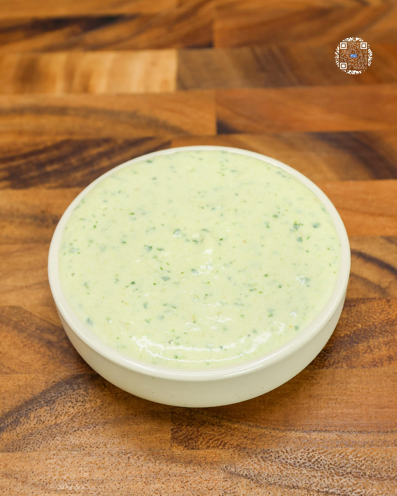

## Additional Recipe Pages

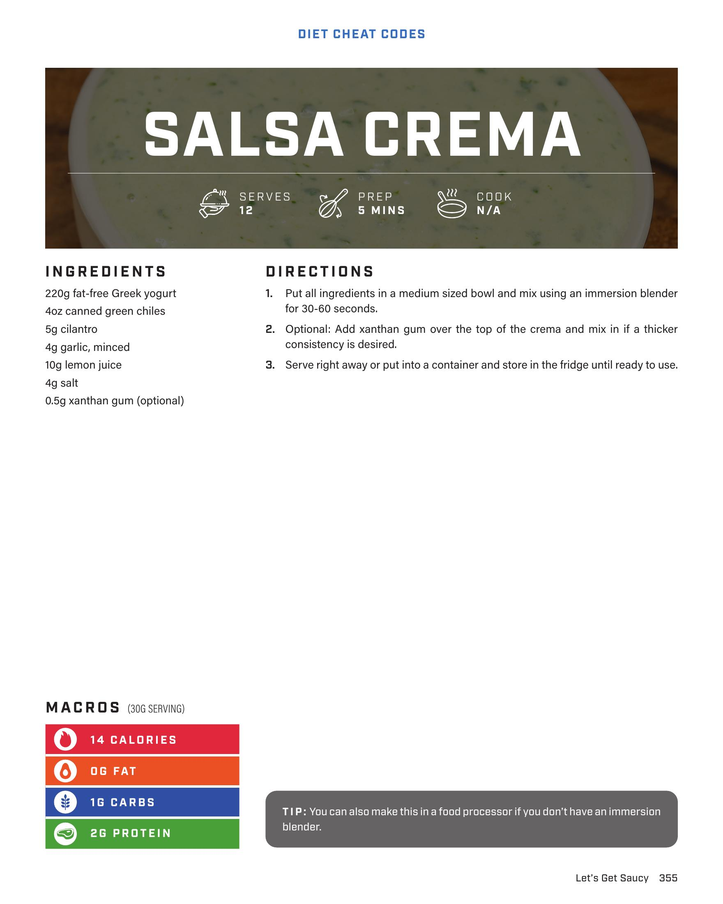

## Source Pages

355, 356

---

# SPICY RANCH

**Serves:** 14 | **Prep:** 5 MINS | **Cook:** N/A

## Macros

| Calories | Fat | Carbs | Net Carbs | Protein |
|----------|-----|-------|-----------|---------|
| 35 | 2 | 2 | undefined | 2 |

## Ingredients

### RANCH INGREDIENTS

- 170g fat-free Greek yogurt
- 105g light mayonnaise
- 80g reduced-fat buttermilk
- 2.5g fresh parsley
- 30g Franks RedHot® sauce
- 3g garlic, minced
- 6g onion powder
- 5g salt
- 1/4 tsp dill weed
- 1/4 tsp habanero powder
- 1/8 tsp black pepper
- 1 tsp dried chives

### EMULSIFIER BLEND

- 8g avocado oil
- 2g xanthan gum

## Directions

1. Add all of the Ranch Ingredients into a medium-sized bowl and mix with a spatula.
2. Into a small bowl, add the Emulsifier Blend and stir until combined.
3. Add the Emulsifier Blend to the medium sized bowl and, using an immersion blender, blend for 90 seconds or until thoroughly combined.
4. Serve right away or store in a squeeze bottle and keep in the fridge for up to 2 weeks.

## Tips

If you don't have an immersion blender you can use a food processor or a blender cup.

## Additional Recipe Pages

## Source Pages

345, 346

---

# SWEET CHILI SAUCE

**Serves:** 17 | **Prep:** 10 MINS | **Cook:** 15 MINS

## Macros

| Calories | Fat | Carbs | Net Carbs | Protein |
|----------|-----|-------|-----------|---------|
| 19 | 0 | 9 | 4 | 0 |

## Ingredients

- 120g rice vinegar
- 180g water
- 90g granulated erythritol
- 30g sugar
- 3g salt
- 10g garlic, minced
- 7g ginger, minced
- 30g soy sauce
- 68g chili garlic sauce
- 12g corn starch
- 30g water
- 5g sesame oil
- 1.5g xanthan gum

## Directions

1. Add vinegar, water, erythritol, sugar, salt, garlic, ginger, and soy sauce to a medium pot. Stir ingredients to combine and place on medium heat. Stir every 1-2 minutes.
2. Once erythritol and sugar have dissolved, add chili garlic sauce and stir.
3. Add corn starch and water to a bowl. Use a spoon to mix until the corn starch has completely dissolved into the water.
4. When the pot starts to boil, add corn starch slurry and stir immediately.
5. Let the sauce simmer for 1-2 minutes.
6. Place sesame oil and xanthan gum in a bowl and mix until the xanthan gum has completely dissolved into the oil.
7. Remove pot from heat, add oil mixture, and stir to combine.
8. Once sauce has reached room temperature, place in a container and refrigerate.

## Tips

If you can't get sesame oil, replace it with avocado oil or another neutral tasting oil.

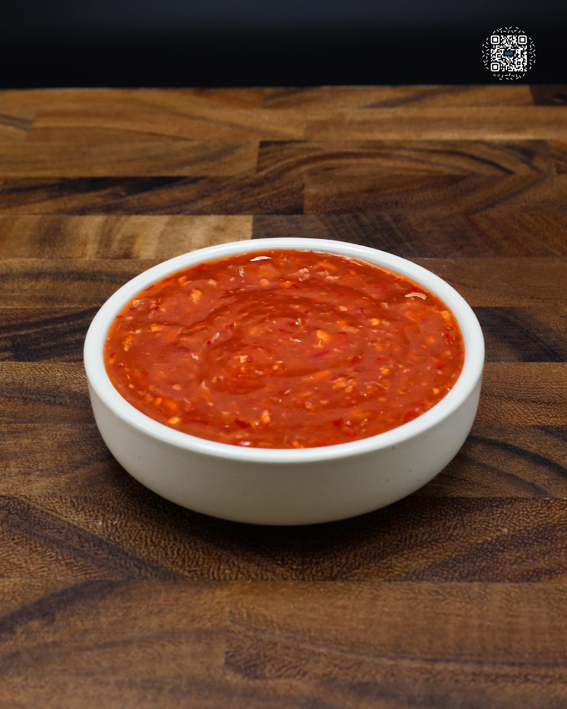

## Additional Recipe Pages

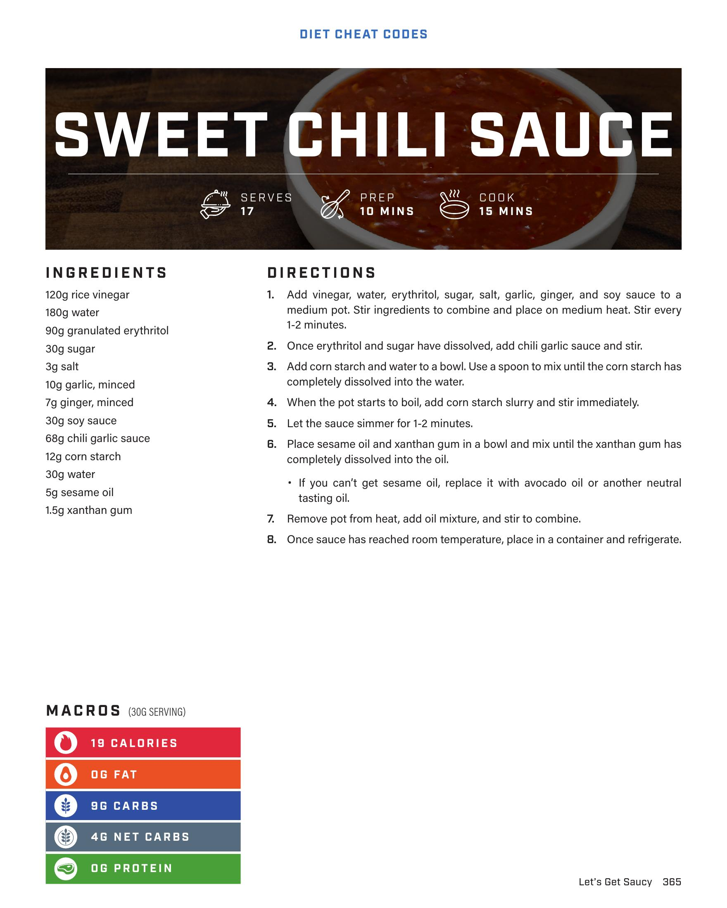

## Source Pages

365, 366

---

# TZATZIKI SAUCE

**Serves:** 10 | **Prep:** 15 MINS | **Cook:** N/A

## Macros

| Calories | Fat | Carbs | Net Carbs | Protein |
|----------|-----|-------|-----------|---------|
| 21 | 1 | 1 | undefined | 3 |

## Ingredients

- 160g 2% Greek yogurt
- 4g extra virgin olive oil
- 15g white vinegar
- 1/2 tsp dried dill
- 80g cucumber, peeled, deseeded, and grated
- 3g garlic, minced
- 42g fat-free feta
- 3g salt
- Dash black pepper

## Directions

1. Peel, deseed, grate, and squeeze cucumber with a cheese cloth or paper towels over a sink to try and get as much moisture out as possible.
2. Add all ingredients in a bowl and mix until combined.
3. Serve right away or, for best flavor, cover and refrigerate for at least 2-3 hours.

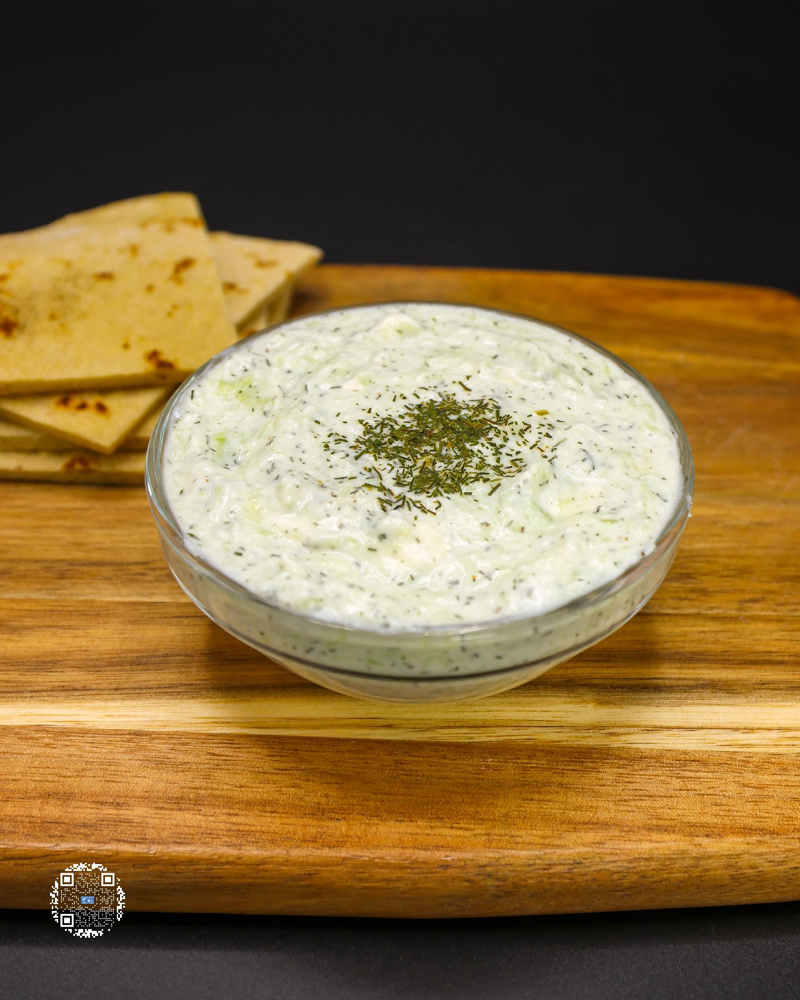

## Additional Recipe Pages

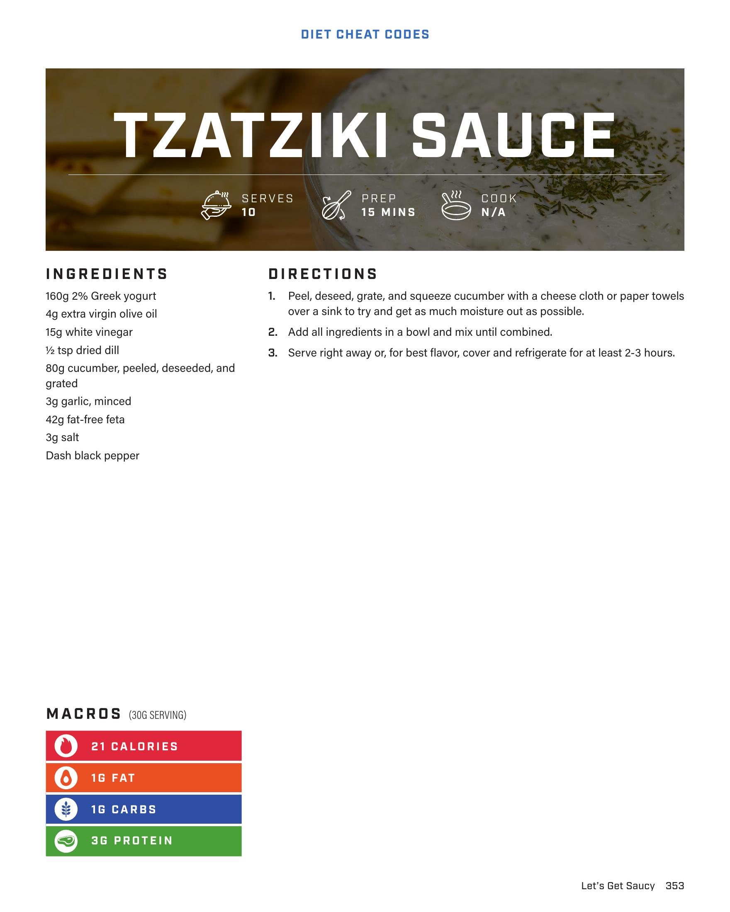

## Source Pages

353, 354

---

# BLT DIP

**Serves:** 13 | **Prep:** 10 MINS | **Cook:** 10 MINS

## Macros

| Calories | Fat | Carbs | Net Carbs | Protein |
|----------|-----|-------|-----------|---------|
| 78 | 5 | 2 | undefined | 8 |

## Ingredients

- 108g center cut bacon (1 package), chopped
- 450g 0% greek yogurt
- 100g low-fat cream cheese
- 150g tomatoes, chopped

## Directions

1. Let the cream cheese sit at room temperature for 2 to 4 hours before starting this recipe. This will make it MUCH easier to mix into the dip.
2. Arrange the bacon strips evenly on a sheet pan and place in a preheated 450°F oven for 10-14 minutes, or until they reach your preferred level of crispiness.
3. Slice the tomato in half, remove the seeds with a spoon, and then dice the tomato into small, uniform pieces.
4. Add tomato, cream cheese, and greek yogurt to a bowl.
5. Place the cooked bacon on a cutting board, chop into bite-sized pieces, and add to the bowl.
6. Mix all the ingredients together to combine.
7. Enjoy right away or place in the fridge and allow to sit for 24 hours for maximum flavor.

## Tips

I prefer to spend the extra couple minutes cooking fresh bacon to my preferred doneness. However, when short on time, real bacon bits are a great alternative.

## Additional Recipe Pages

## Source Pages

331, 332

---

# BUFFALO CHICKEN DIP

**Serves:** 4 | **Prep:** 25 MINS | **Cook:** 25 MINS

## Macros

| Calories | Fat | Carbs | Net Carbs | Protein |
|----------|-----|-------|-----------|---------|
| 546 | 18 | 16 | undefined | 82 |

## Ingredients

### DIP

- 1 rotisserie chicken, meat only
- 224g fat-free cream cheese
- 170g 2% greek yogurt
- 224g cottage cheese
- 210g Frank's buffalo sauce
- 2g onion powder
- 2g garlic powder
- 1g dried parsley
- .5g dried dill
- 84g 2% cheddar, shredded
- 84g fat-free cheddar, shredded
- 25g green onion, sliced
- 5 pepperoncinis, sliced

### TOPPING

- 42g pork rinds
- 14g Parmigiano-Reggiano
- 10g buffalo sauce
- 17.5g light ranch
- 4.5g green onion, diced

## Directions

1. Let the cream cheese sit at room temp for 1-2 hours until softened.
2. Remove the meat from the chicken, add it to a bowl, and shred it into bite-sized chunks. You can use 626g canned chicken here, but it'll bring the flavor down 3-4 notches (aka significantly).
3. Mix in the softened cream cheese.
4. Into a high-sided container, combine Greek yogurt, cottage cheese, 30g buffalo sauce, onion powder, garlic powder, parsley, and dill. Blend with an immersion blender until smooth.
5. Pour the blended mixture into the bowl along with the remaining buffalo sauce, cheddar cheese, chopped green onion (use the white/lighter parts), and pepperoncinis. Mix everything well.
6. Spread evenly into an 8"x8" pan.
7. Using a blender cup, mix pork rinds until a crumb-like texture forms. Combine with parmesan, then sprinkle over the top.
8. Bake in a preheated 375°F oven for 25-30 minutes.
9. Finish with buffalo sauce, ranch, and more green onion (the green part).
10. Slice into 4 squares, dig in, and watch the muscle pile on.

## Tips

During my five rotisserie chicken tests, I averaged 360g breast meat, 150g thigh meat, 73g drumstick meat, and 43g wing meat. I used these numbers to calculate the final calories and macros for this dish. For the best accuracy, place the bowl on a scale during step 2 and measure the amount of meat you get from each section. If you can't get fat-free cream cheese, replace with an additional 224g 2% cottage cheese.

## Additional Recipe Pages

## Source Pages

333, 334

---

# CRISPY ROASTED POTATOES

**Serves:** 5 | **Prep:** 15 MINS | **Cook:** 60 MINS

## Macros

| Calories | Fat | Carbs | Net Carbs | Protein |
|----------|-----|-------|-----------|---------|
| 218 | 4 | 43 | undefined | 5 |

## Ingredients

- 2000g water
- 30g salt
- 6g baking soda
- 1200g Yukon gold potatoes
- 20g olive oil
- 8g garlic, minced
- 2g fresh oregano, chopped
- 2g salt
- 1g black pepper
- 3g fresh parsley, chopped

## Directions

1. Place a sheet pan in the oven and preheat to 450°F.
2. In a large pot, add water, salt, and baking soda, stirring until dissolved. Place on the stovetop over high heat.
3. Set a small pan on medium heat next to the pot.
4. Cut each potato into 4-6 pieces depending on size. Each piece should be around 2-3".
5. Add potatoes to the boiling pot, stir, and boil for 10 minutes.
6. While the potatoes boil, add oil and oregano to the small pan. After 30-60 seconds, add the garlic and a pinch of salt, and stir.
7. Once the garlic turns golden brown, strain the oil over a large bowl and set the strainer aside.
8. Using a colander, strain the potatoes and let them steam for 4-5 minutes.
9. Add potatoes to the bowl of oil, season with salt and pepper, and toss to combine.
10. Be a bit rough with the potatoes. They should look slightly battered, which will help create an amazingly crispy crust.
11. Carefully remove the sheet pan from oven, pour the potatoes onto it, and spread them out evenly. Ensure the flesh of the potato, not the skin, is touching the pan.
12. Throw the potatoes in the oven for 25-30 minutes.
13. Carefully flip the potatoes so that another part of the flesh is touching the sheet pan. Return to the oven for 20-25 minutes, or until deeply golden brown.
14. Transfer the finished potatoes to a bowl, add the fried garlic and oregano, and toss. Top with parsley and salt to taste.
15. Take a bite and listen to the unbelievable crunch. Each serving should weigh about 115 grams.
16. To reheat, simply add them to a preheated 400°F air fryer for 3-4 minutes.

## Additional Recipe Pages

## Source Pages

317, 318

---

# DUMPLING FRIED RICE

**Serves:** 1 | **Prep:** 10 MINS | **Cook:** 5 MINS

## Macros

| Calories | Fat | Carbs | Net Carbs | Protein |
|----------|-----|-------|-----------|---------|
| 311 | 13 | 38 | undefined | 18 |

## Ingredients

### BOWL 1 (mixed)

- 3 dumplings, frozen (125 cal)
- 10oz bag cauliflower rice, frozen
- 15g oyster sauce
- 25g soy sauce
- 2g MSG
- Dash black pepper

### BOWL 2

- 9g avocado oil

### BOWL 3

- 7g green onion, chopped

### BOWL 4

- 8g garlic, minced

## Directions

1. Put dumplings in a bowl with 5g of water, cover 95% of the bowl with a lid or plastic wrap, and cook in microwave according to the instructions on the box, and chop dumplings into bite sized pieces.
2. Cook cauliflower rice in the microwave for the time recommended on the bag or use your own cauliflower and cook. While cooking, prep all other ingredients by adding them into separate bowls.
3. Add avocado oil in preheated high-sided pan on medium heat.
4. Add green onions, stir to combine, and fry for 30 seconds.
5. Add the dumplings and stir to combine.
6. After 60 seconds, crush in garlic and stir to avoid burning.
7. Once garlic becomes fragrant, add cauliflower rice and Bowl 1, and stir to combine.
8. Let all flavors come together for 1-2 minutes while constantly stirring. Serve and eat.

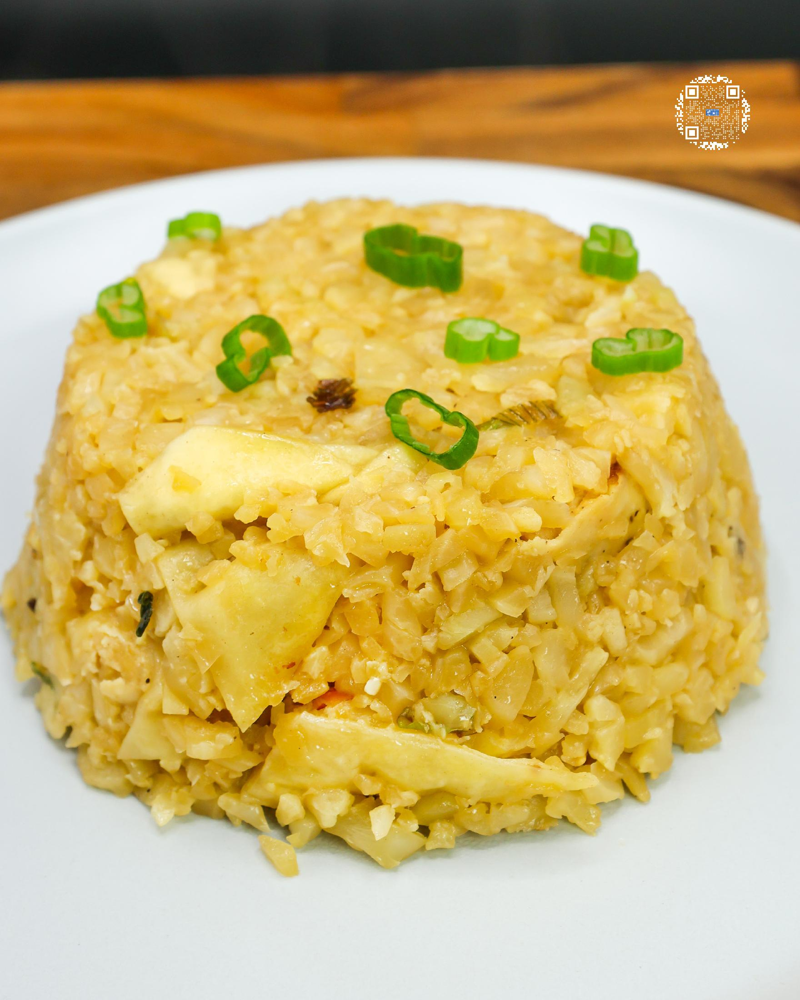

## Additional Recipe Pages

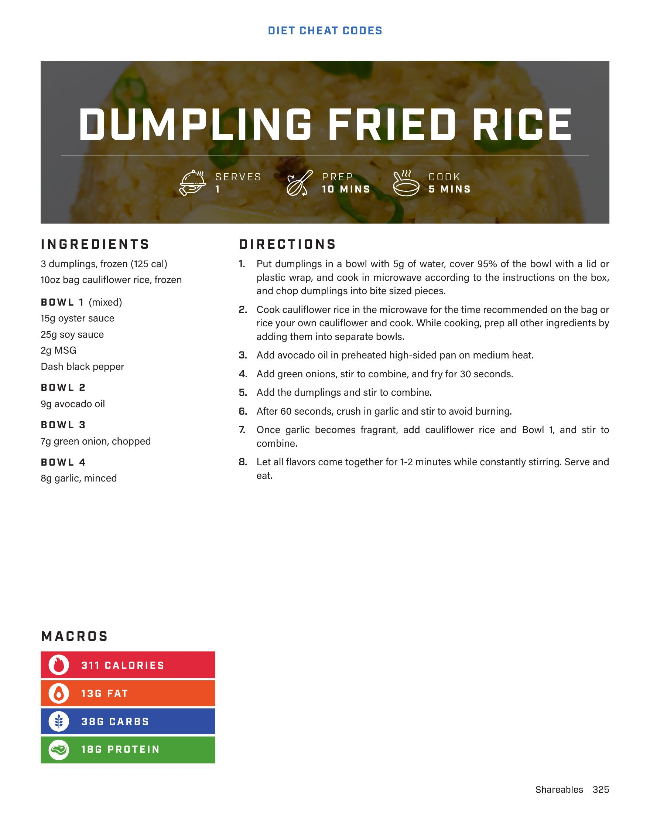

## Source Pages

325, 326

---

# KIMCHI FRIED RICE

**Serves:** 1 | **Prep:** 10 MINS | **Cook:** 5 MINS

## Macros

| Calories | Fat | Carbs | Net Carbs | Protein |
|----------|-----|-------|-----------|---------|
| 308 | 14 | 30 | N/A | 20 |

## Ingredients

- 1 egg, sunny side up
- 10oz bag cauliflower rice, frozen

### BOWL 1

- 2g avocado oil

### BOWL 2

- 2 slices center cut bacon, chopped

### BOWL 3

- 11g green onion, chopped

### BOWL 4 (mixed)

- 6g garlic, minced
- 84g kimchi
- 15g oyster sauce
- 15g soy sauce
- 2g MSG
- Dash black pepper

## Directions

1. Lightly spray a small pan with oil, add an egg, cover the pan, and turn on low.
2. Cook cauliflower rice in the microwave for the time recommended on the bag. While cooking, prep all other ingredients by adding them into separate bowls.
3. The egg should be done at this point with a soft yolk and no runny whites. When ready, plate the egg and put to the side. If it's not ready, give it another minute or two to finish.
4. Add avocado oil and bacon in preheated high-sided pan on medium heat, stir to combine, and let them cook for two minutes.
5. Add green onions, stir to combine, and fry for 60 seconds.
6. Add the garlic and stir for 30 seconds.
7. Once garlic becomes fragrant, add cauliflower rice, stir to combine, and cook for one minute.
8. Add Bowl 4 to the pan, stir to combine, and let all those flavors mingle together for 1-2 minutes.
9. Plate it and eat it.

## Additional Recipe Pages

## Source Pages

329, 330

---

# MAC AND CHEESE EGG ROLLS

**Serves:** 4 | **Prep:** 1.5 HRS | **Cook:** 30 MINS

## Macros

| Calories | Fat | Carbs | Net Carbs | Protein |
|----------|-----|-------|-----------|---------|
| 271 | 3 | 42 | undefined | 21 |

## Ingredients

- 126g Banza® Noodles
- 4g salt
- Dash black pepper

### CHEESE MIX

- 4 slices fat-free American cheese
- 2 slices sharp cheddar Velveeta®
- 56g fat-free cheddar cheese
- 60g fat-free milk
- 4g garlic, minced
- Dash onion powder

### EGG ROLL BUILD

- 4 egg roll wraps (80 cal per wrap)
- 1 egg white
- Oil spray (4 seconds total)

## Directions

1. Add noodles and salt to boiling water and cook per label instructions, stirring occasionally so noodles do not stick to the bottom of the pot.
2. Drain noodles and save some of the pasta water for later.
3. Add noodles back to pot, put pot back on stovetop, and set burner to low.
4. Add all Cheese Mix ingredients and stir to combine. If necessary, add a spoonful or two of pasta water to successfully melt everything together. The goal is to have a thick mac and cheese so that the egg rolls fry up perfectly in the air fryer without leaking.
5. Separate egg white from the egg yolk into a small bowl and whisk until smooth.
6. Put 4 egg roll wraps on counter and using a brush, spread egg white on outer edges of the wrap. Add mac and cheese as evenly as possible across the center of each wrap.
7. Take the corner of the egg roll and wrap it over the mac and cheese. Try and tuck the triangle portion of the wrap into/under the mac and cheese.
8. Add more egg white to the corners of the wrap and fold in.
9. Add a little more egg white to the tip of the wrap and finish rolling. Make sure egg roll is fully sealed and repeat.
10. Place egg rolls on lightly oiled parchment paper and freeze for one hour. You can cook these right away, but I have found it to be better after freezing.
11. Add egg white to the entire outside of egg rolls, then add to a preheated 400°F air fryer fold side down and spray the top with oil for one second per egg roll.
12. After 3 minutes, flip egg rolls and spray each one with oil for an additional second.
13. Cook for an additional 3-4 minutes, get some low-calorie ranch and ENJOY.

## Tips

Make double the egg rolls, pull them from the freezer, and air fry whenever you need a quick snack or meal. Use these as an appetizer or as a side to another low-calorie entrée.

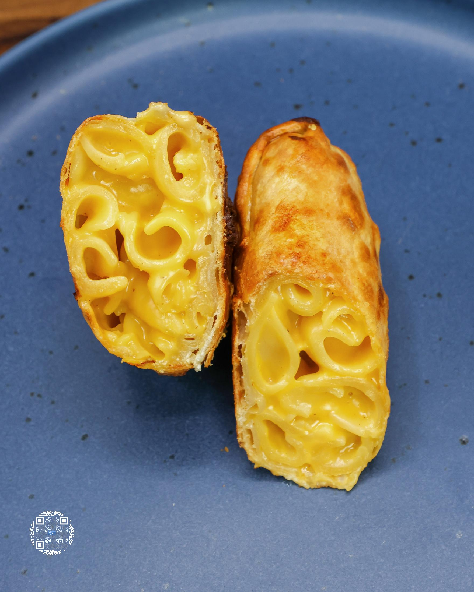

## Additional Recipe Pages

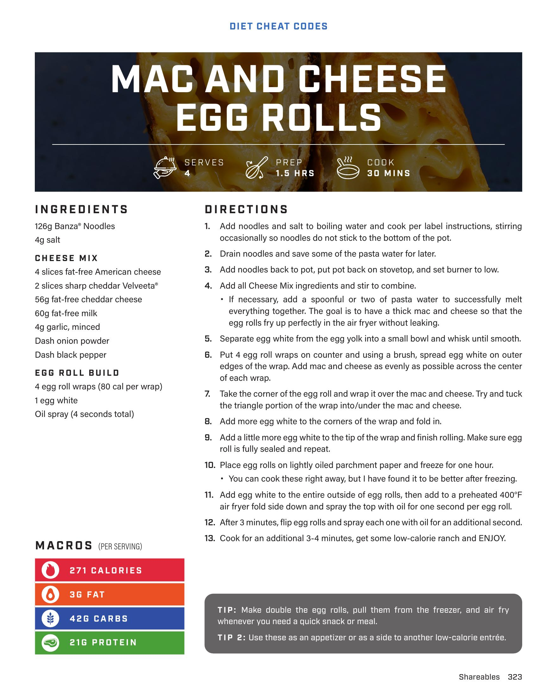

## Source Pages

323, 324

---

# MOZZARELLA STICKS

**Serves:** 1 | **Prep:** 25 MINS | **Cook:** 5 MINS

## Macros

| Calories | Fat | Carbs | Net Carbs | Protein |
|----------|-----|-------|-----------|---------|
| 488 | 23 | 29 | undefined | 42 |

## Ingredients

- 6 mozzarella sticks (45 Cal)

### DREDGE STATION 1

- 30g all-purpose flour

### DREDGE STATION 2

- 1 egg
- 1 egg white

### DREDGE STATION 3

- 100g plain breadcrumbs
- 10g grated Parmigiano-Reggiano cheese
- 1g dried parsley
- 5g salt
- 4g garlic powder
- Dash black pepper

## Directions

1. Set up dredging stations by adding all Dredge Station Ingredients to three separate containers and mixing until well combined.
2. Add 2 mozzarella sticks to Dredge Station 1, roll around until completely covered, and shake any excess flour off.
3. Add floured sticks to Dredge Station 2 and make sure they are completely covered in egg.
4. Lay mozzarella down in Dredge Station 3 and shake the container side to side to completely cover the sticks.
5. Press breading into the sticks for the most coverage and put back into Dredge Station 2.
6. Completely soak sticks and move back to Dredge Station 3 for one final breading.
7. Place breaded mozzarella sticks off to the side and repeat process until all 6 are done.
8. Add sticks to a preheated 400°F air fryer, make sure they aren't touching, and lightly spray with olive oil on both the top and bottom.
9. Cook for 2 minutes, flip sticks, and cook for another 2 minutes.
10. Plate em', grab some MARINARA SAUCE, and enjoy.

## Tips

Keep a close eye on the mozzarella sticks as they will start leaking if cooked for too long. Put breaded mozzarella sticks in the freezer for one hour or more to allow the mozzarella sticks to achieve a better browning and crisp in the air fryer.

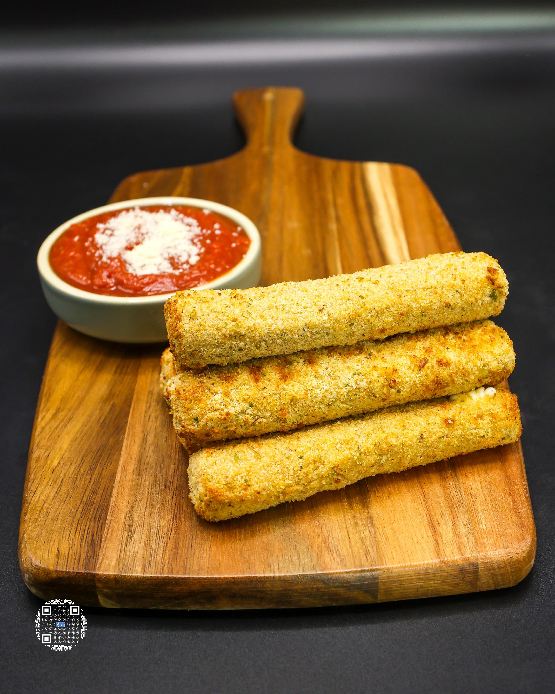

## Additional Recipe Pages

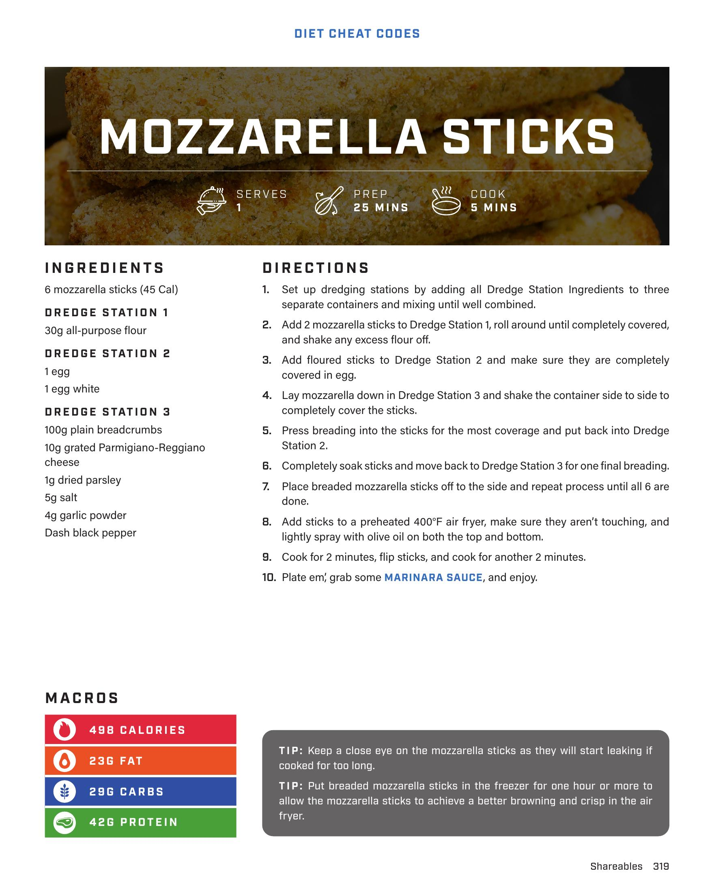

## Source Pages

319, 320

---

# NICKDONALD'S FRENCH FRIES

**Serves:** 5 | **Prep:** 40 MINS | **Cook:** 20 MINS

## Macros

| Calories | Fat | Carbs | Net Carbs | Protein |
|----------|-----|-------|-----------|---------|
| 172 | 2 | 38 | N/A | 4 |

## Ingredients

- 1000g russet potatoes, peeled (about ~1200g before peeling)
- 1200g beef broth
- 30g sugar
- 8g oil spray
- Salt, to taste

## Directions

1. Add beef broth and sugar into a large bowl and whisk to combine.
2. Peel potatoes and, using a fry tower cutter, cut the potatoes into shoestring french fry size and add to beef broth mixture. Can also cut the fries by hand into 1/4" x 1/4" pieces to replicate the slim profile of a NickDonalds french fry.
3. Once all fries are added to the beef broth, mix fries around to keep them separated. Make sure all fries are covered with broth and let them marinade for 30 minutes.
4. Drain liquid out of bowl and dry the fries using a salad spinner and/or paper towels.
5. Add a layer of fries to a preheated 400°F air fryer, lightly spray the top of the fries with oil, and repeat layering/oil combination until all fries are added.
6. Cook for 20-25 minutes; tossing every 5-6 minutes. Every time the fries are shaken or tossed, lightly spray them with oil.
7. Take fries out, add salt to taste, and shake them to evenly disperse salt.
8. Split into 5 portions and store them for use as a side dish to other meals throughout the week.
9. To reheat, simply add them to a preheated 400°F air fryer for 3-4 minutes.

## Tips

Make sure you buy broth with ingredients that are as close to pure beef broth as possible. You want to avoid ones that include celery, carrot, onion, and/or garlic powder.

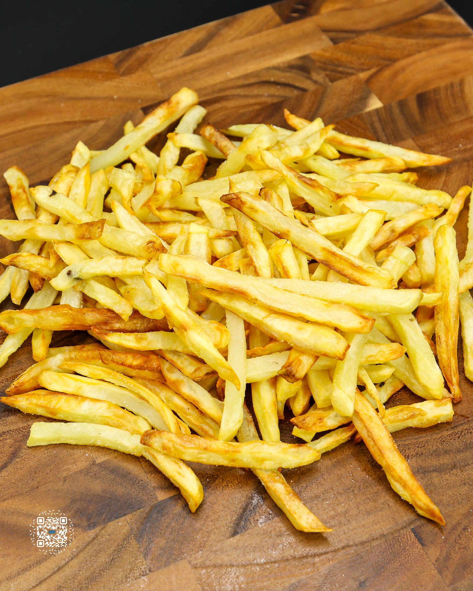

## Additional Recipe Pages

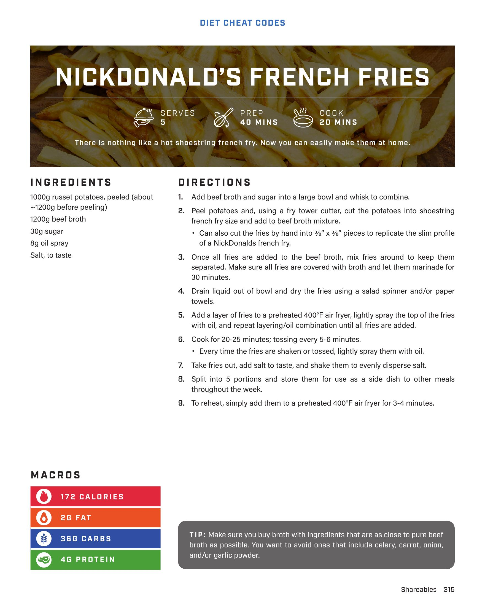

## Source Pages

315, 316

---

# Refried Beans

**Serves:** 5 | **Prep:** 15 MINS | **Cook:** 2 HOURS

## Macros

| Calories | Fat | Carbs | Net Carbs | Protein |
|----------|-----|-------|-----------|---------|
| 152 | 1 | 31 | undefined | 11 |

## Ingredients

- 230g pinto beans, dry
- 800g water
- 5g salt
- 6g bacon fat
- 100g onion, diced
- 5g garlic, minced
- Small pinch Mexican oregano
- Small pinch chili powder
- Small pinch cumin

## Directions

1. Add beans to a colander, rinse, and add to a large pot along with the water and salt. Give everything a quick mix.
2. Place pot on the stovetop and turn up to medium heat. Once boiling, turn the heat to low, and cover with a lid for 2-3 hours or until beans easily smash with a soft press.
3. Place beans in a large bowl, add the pot back to the stovetop, and turn up to medium heat.
4. Add bacon fat to the pot. Once melted, add onions and stir until they are coated in fat. Avocado oil or another high smokepoint oil works here as well!
5. Once translucent, add garlic, Mexican oregano, chili powder, and cumin. Give everything a mix and add beans back to the pot once the garlic becomes fragrant.
6. Using a potato masher or immersion blender, mash beans until desired chunkiness.
7. Simmer beans while constantly stirring until desired thiccncess. Please keep in mind, the beans will be significantly thicker once cooled.
8. Remove from heat and divide into five portions. Each portion should be around 170 grams.

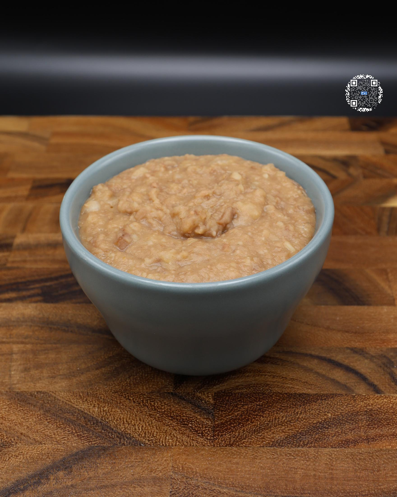

## Additional Recipe Pages

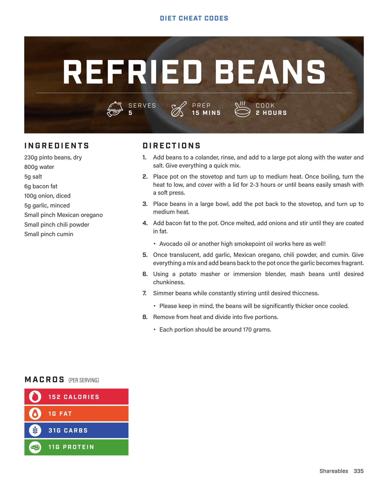

## Source Pages

335, 336

---

# SHRIMP FRIED RICE

**Serves:** 1 | **Prep:** 10 MINS | **Cook:** 5 MINS

## Macros

| Calories | Fat | Carbs | Net Carbs | Protein |
|----------|-----|-------|-----------|---------|
| 296 | 8 | 27 | N/A | 30 |

## Ingredients

- 128g medium shrimp, cooked and chopped
- 10oz bag cauliflower rice, frozen
- 7g green onion, chopped
- 8g garlic, minced
- 30g peas and carrots, frozen
- 8g avocado oil
- Sauce
- 20g oyster sauce
- 20g soy sauce
- 2g MSG
- Dash black pepper

## Directions

1. Put pre-cooked, frozen shrimp into a strainer, run under cold water for 5-6 minutes or until thawed, pat dry with a paper towel, and chop into small pieces.
2. Cook cauliflower rice in the microwave for the time recommended on the bag. While cooking, chop the green onion and garlic.
3. In a separate bowl, mix oyster sauce, soy sauce, MSG, and black pepper.
4. Add avocado oil in preheated high-sided pan on medium heat.
5. Add green onions, stir to combine, and fry for 30 seconds.
6. Add the garlic and stir to combine.
7. Once garlic becomes fragrant, add peas and carrots and stir constantly for one minute.
8. Add cauliflower rice and the sauce mix. Stir constantly for one minute.
9. Add shrimp, mix for an additional 30 seconds, plate it, and eat it.

## Additional Recipe Pages

## Source Pages

327, 328

---

# TACO EGG ROLLS

**Serves:** 14 | **Prep:** 40 MINS | **Cook:** 30 MINS

## Macros

| Calories | Fat | Carbs | Net Carbs | Protein |
|----------|-----|-------|-----------|---------|
| 158 | 4 | 15 | undefined | 14 |

## Ingredients

### EGG ROLL FILLING (~505g total cooked weight)

- 5g avocado oil (ground beef)
- 448g 96% lean ground beef
- 6g MSG
- 5g avocado oil
- 130g onion, diced
- 5g garlic, minced
- 3g chili powder
- 3g cumin
- 3g coriander
- 3g smoked paprika
- 1g black pepper
- 60g tomato sauce
- 50g beef broth
- 3g salt

### EGG ROLL

- 1 egg roll wrap (60 cal)
- 14g fat-free cheddar cheese, shredded
- 35g Egg Roll Filling
- 30g oil (for frying)

## Directions

1. Add avocado oil to a preheated pan on medium heat and add ground beef to the pan by crumbling in bite-sized chunks.
2. Add MSG evenly across the beef, break down beef even more using a wooden spatula, and stir constantly until meat is cooked.
3. Set meat aside on a plate or into a container, wipe down pan, place back on the stovetop, and add avocado oil.
4. Add chili powder, cumin, coriander, smoked paprika, and black pepper to a small bowl and mix.
5. Add onions to pan, mix around so oil is spread evenly throughout, and cook 1-2 minutes or until onions become translucent.
6. Make room in the middle of the pan, add garlic, and stir. Make room in the middle of the pan again, add the seasoning mix, let it sit for 20-30 seconds, then add cooked meat into the pan. Mix well.
7. Once combined, add beef broth and tomato sauce, mix together, and turn burner to low to let the mixture simmer for about 10 minutes.
8. Once Egg Roll Filling has reduced, put on a plate, and let it cool for 10-15 minutes.
9. Into a 5" or 6" pan add oil and turn on medium heat.
10. Fill a small bowl with water and set aside. Lay an egg roll wrap on the counter.
11. Into the middle of the egg roll wrap, add cheese and filling, and pack together. Using a brush, dampen a ½-inch square with water on the edge of the wrap.
12. Bring one of the corners of the egg roll wrap over the filling, tuck the inside of the egg roll wrap into the filling, put water on the corners of the wrap, and fold the corners towards the middle. Brush water on the edges of the wrap and roll it up. Making sure the egg roll is tightly wrapped is important because if anything gets out, oil will splatter and it not only makes a mess, but it can burn you.
13. Bring oil in the pan to 375°F. Carefully lay the egg roll corner side down and flip after 2 minutes or when browned.
14. If the sides of the egg roll need to be fried, use tongs and lay egg roll on its side. Repeat for other side if necessary.

## Tips

If you want to use the egg roll filling for a different recipe, it works perfectly in the as well.

## Additional Recipe Pages

## Source Pages

321, 322

---

# CANTALOUPE SORBET

**Serves:** 1 | **Prep:** 15 MINS | **Cook:** 5 MINS

## Macros

| Calories | Fat | Carbs | Net Carbs | Protein |
|----------|-----|-------|-----------|---------|
| 102 | 0 | 44 | 24 | 3 |

## Ingredients

- 1 cantaloupe

### PINT INGREDIENTS

- 300g cantaloupe
- 160g water
- 20g granulated erythritol
- 0.5g salt

## Directions

1. Wash and dry the outside of the cantaloupe, cut the ends off the cantaloupe, trying to make sure to cut off as little of the orange part as possible, then cut in half.
2. Remove the seeds, put half of the cantaloupe off to the side, and place the other half cut side down on the cutting board.
3. Cut where the orange meets the green (the rind) and try to follow that all the way down.
4. Go around the entire cantaloupe until there is no more rind remaining, but if a little rind remains, that is okay. Cube the orange flesh of the cantaloupe and set aside.
5. Repeat steps 3-6 for the other half of the cantaloupe.
6. Load the blender up with the chunks of cantaloupe, blend for 30 seconds or until pureed, put into storage containers, and repeat with any remaining cantaloupe.
7. Directly into a pint add Pint Ingredients and using a handheld blender, mix for 30 seconds.
8. Put the top on the pint and freeze for 24 hours.
9. Take the pint out of the freezer, run it under warm water for 60 seconds, dry the pint off, and load it into the CREAMi®.
10. Run pint on the sorbet function and directly after on the re-spin function.
11. Unload the pint and using a spoon push the contents of the CREAMi® down, smooth and level the surface, load it back up, and hit the re-spin button.
12. A perfect sorbet consistency has now been achieved and it is time to eat.

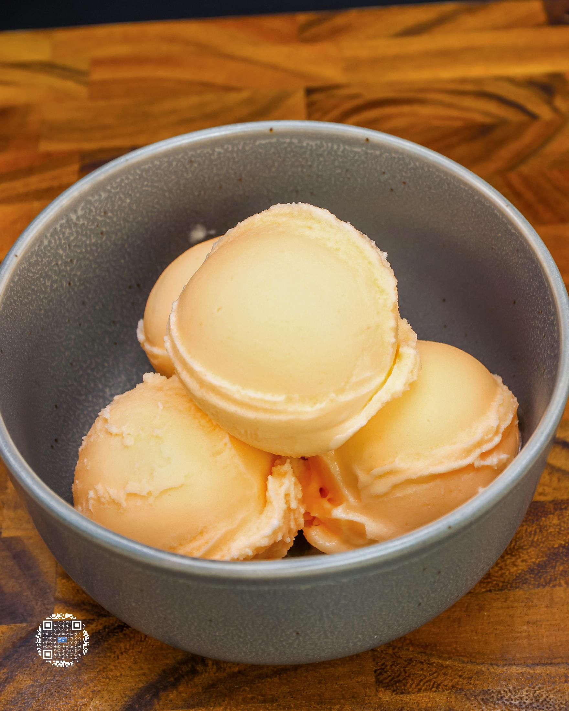

## Additional Recipe Pages

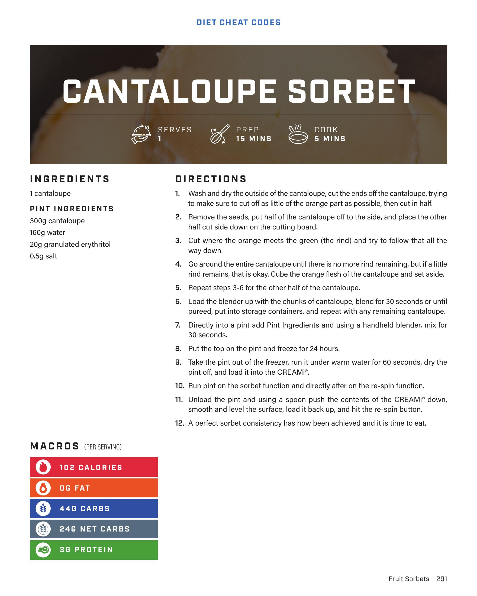

## Source Pages

291, 292

---

# GRAPEFRUIT SORBET

**Serves:** 1 | **Prep:** 10 MINS | **Cook:** 5 MINS

## Macros

| Calories | Fat | Carbs | Net Carbs | Protein |
|----------|-----|-------|-----------|---------|
| 73 | 0 | 69 | 19 | 2 |

## Ingredients

- 220g grapefruit
- 220g water
- 50g granulated erythritol
- .5g salt
- .5g xanthan gum
- Zest of half grapefruit

## Directions

1. Zest half of a grapefruit into a high sided container.
2. Juice grapefruit into a medium sized bowl.
3. Strain juice into the container as well as adding any extra pulp. Add water.
4. Into a small bowl, add erythritol, salt, and xanthan gum. Whisk together.
5. Using an immersion blender, start mixing the wet ingredients while slowly adding in the dry ingredients.
6. Once all dry ingredients have dissolved, continue blending for 90 seconds.
7. Add to a pint, put the top on, and freeze for 24 hours.
8. Take the pint out of the freezer, run it under warm water for 60 seconds, dry the pint off, and load it into the CREAMi®.
9. Run pint on the sorbet function and re-spin the pint 1-2 more times for desired consistency.
10. Eat.

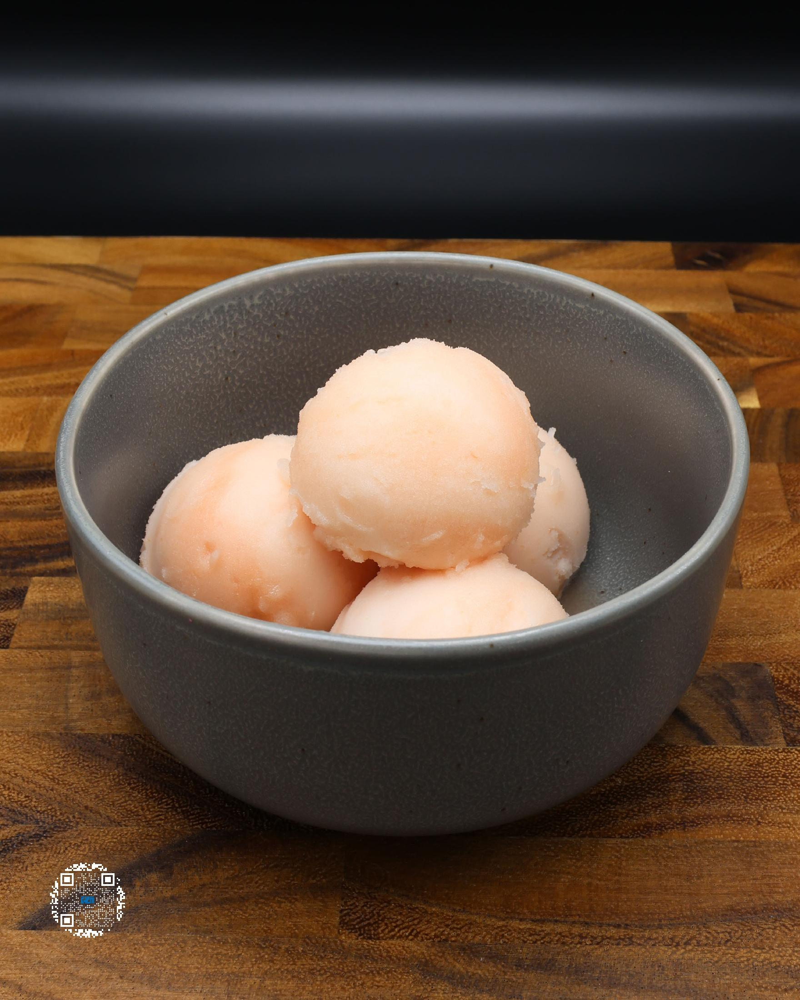

## Additional Recipe Pages

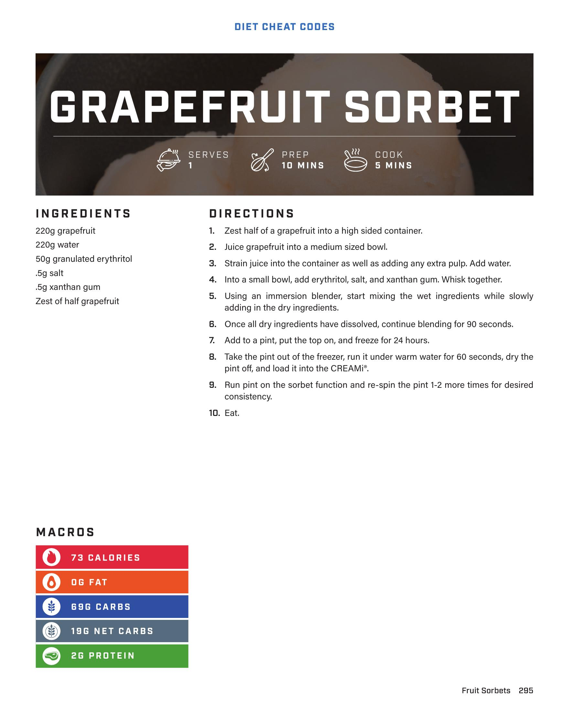

## Source Pages

295, 296

---

# PEACH SORBET

**Serves:** 1 | **Prep:** 5 MINS | **Cook:** 5 MINS

## Macros

| Calories | Fat | Carbs | Net Carbs | Protein |
|----------|-----|-------|-----------|---------|
| 117 | 1 | 59 | 29 | 3 |

## Ingredients

- 300g peaches
- 140g water
- 30g granulated erythritol
- .5g salt

## Directions

1. Rinse peaches under water, cut around the pit, twist the two halves, and remove the pit.
2. Add all ingredients to a high sided container.
3. Using an immersion blender, mix the ingredients for 90 seconds and add to a pint.
4. Put the top on the pint and freeze for 24 hours.
5. Take the pint out of the freezer, run it under warm water for 60 seconds, dry the pint off, and load it into the CREAMI®.
6. Run pint on the sorbet function and re-spin the pint 1-2 more times for desired consistency.
7. Eat.

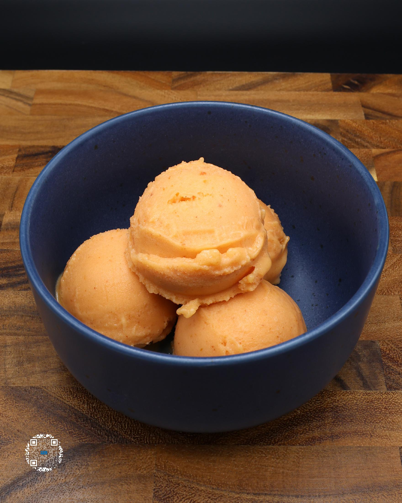

## Additional Recipe Pages

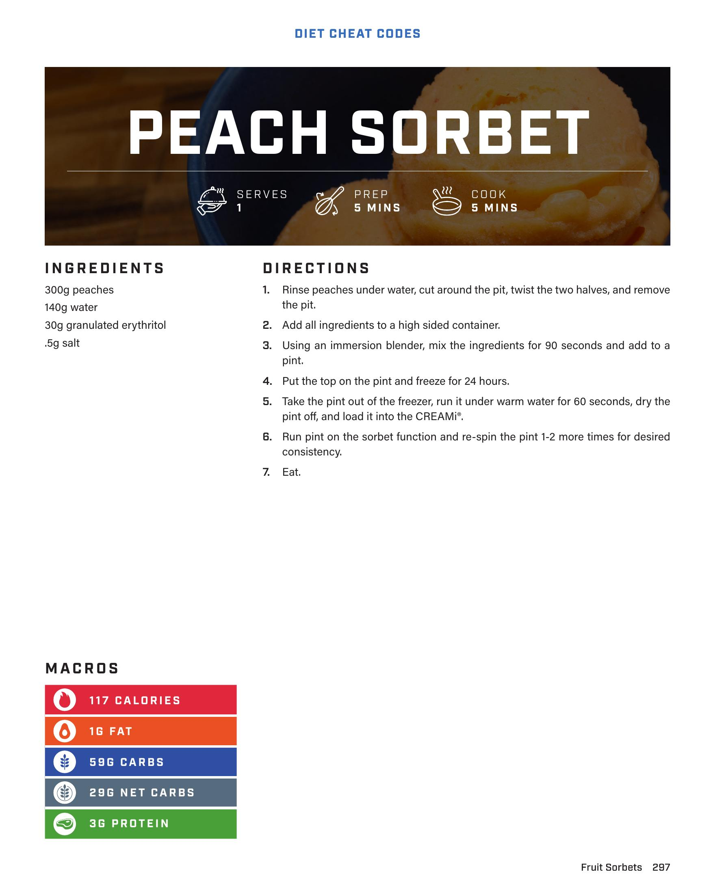

## Source Pages

297, 298

---

# RASPBERRY SORBET

**Serves:** 1 | **Prep:** 10 MINS | **Cook:** 5 MINS

## Macros

| Calories | Fat | Carbs | Net Carbs | Protein |
|----------|-----|-------|-----------|---------|
| 120 | 2 | 67 | 27 | 3 |

## Ingredients

- 230g raspberries
- 210g water
- 40g granulated erythritol
- .5g salt

## Directions

1. Rinse raspberries and add them to a high sided container along with all other ingredients.
2. Using an immersion blender, mix the ingredients for 90 seconds.
3. Strain the mixture over the pint and add seeds as desired.
4. Put the top on the pint and freeze for 24 hours.
5. Take the pint out of the freezer, run it under warm water for 60 seconds, dry the pint off, and load it into the CREAMI®.
6. Run pint on the sorbet function and re-spin the pint 1-2 more times for desired consistency.
7. Eat.

## Tips

Personally, I like either not adding any seeds at all or using ½ the seeds.

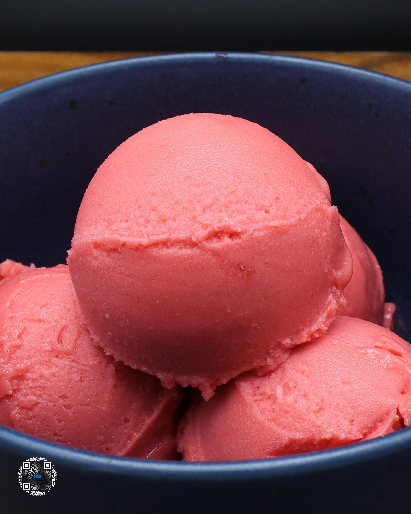

## Additional Recipe Pages

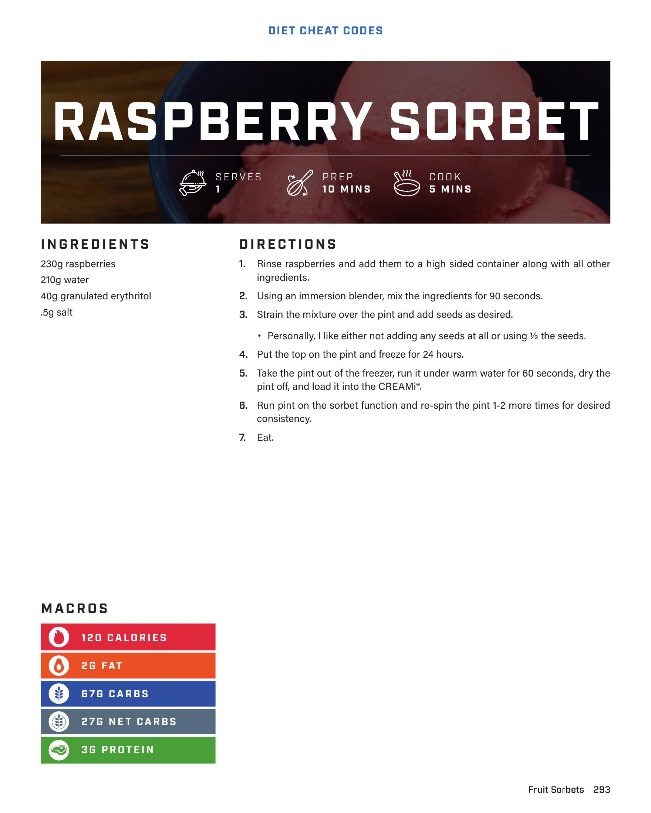

## Source Pages

293, 294

---

# STRAWBERRY SORBET

**Serves:** 1 | **Prep:** 10 MINS | **Cook:** 5 MINS

## Macros

| Calories | Fat | Carbs | Net Carbs | Protein |
|----------|-----|-------|-----------|---------|
| 98 | 0 | 44 | 24 | 3 |

## Ingredients

### INGREDIENTS

- 1lb strawberries

### PINT INGREDIENTS

- 300g strawberries
- 130g water
- 20g granulated erythritol
- 0.5g salt

## Directions

1. Rinse strawberries under water and cut off the stems.
2. Add Pint Ingredients into the pint and using an immersion blender crush strawberries and mix for 60-90 seconds or until everything is smooth.
3. Put the top on the pint and freeze for 24 hours.
4. Take the pint out of the freezer, run it under warm water for 60 seconds, dry the pint off, and load it into the CREAMI®.
5. Run pint on the sorbet function and directly after on the re-spin function.
6. A perfect sorbet consistency has now been achieved and it is time to eat.

## Tips

If you don't have an immersion blender, you can use a food processor or regular blender to break down the strawberries. If you want a more ice cream-like consistency, unload the pint after the re-spin and using a spoon, push the contents of the CREAMI® down, smooth and level the surface, and re-spin for a second time.

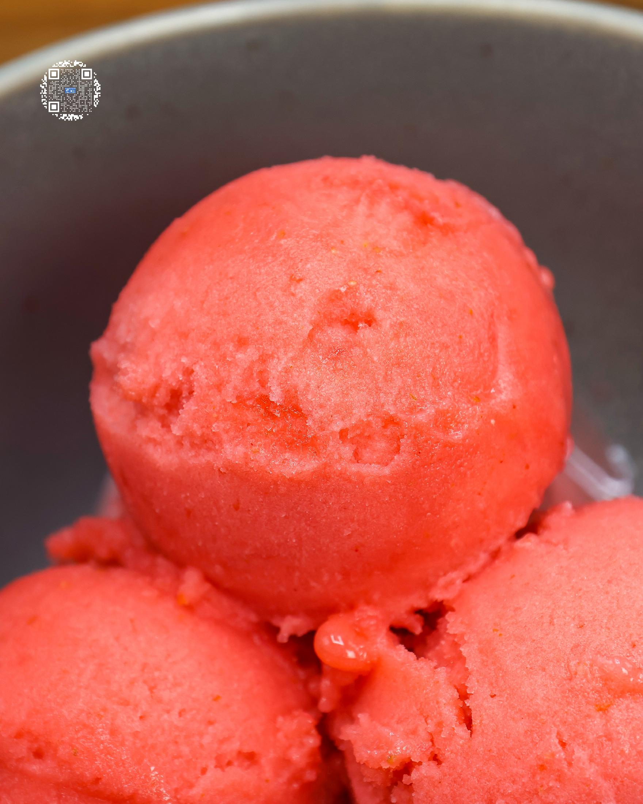

## Additional Recipe Pages

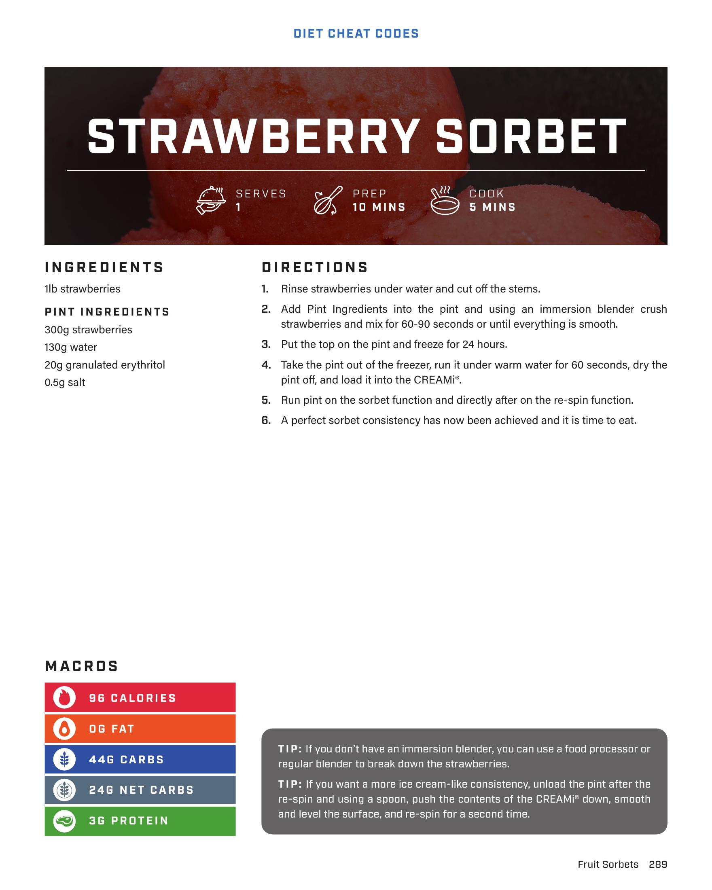

## Source Pages

289, 290

---

# WATERMELON SORBET

**Serves:** 1 | **Prep:** 15 MINS | **Cook:** 5 MINS

## Macros

| Calories | Fat | Carbs | Net Carbs | Protein |
|----------|-----|-------|-----------|---------|
| 99 | 0 | 46 | 26 | 3 |

## Ingredients

### PINT INGREDIENTS

- 1 seedless watermelon
- 330g seedless watermelon
- 110g water
- 20g granulated erythritol
- 0.5g salt

## Directions

1. Wash and dry the outside of the watermelon and put it on the biggest cutting board you have.
2. Cut the ends off the watermelon, trying to make sure to cut off as little of the pink part as possible, then cut the watermelon in half.
3. Put half of the watermelon off to the side and the other half cut side down on the cutting board.
4. Cut where the pink meets the white (the rind) and try to follow that all the way down.
5. Go around the entire watermelon until there is no more rind remaining, but if a little rind remains, that is okay.
6. Cube the red flesh of the watermelon and set aside.
7. Repeat steps 3-6 for the other half of the watermelon.
8. Load blender up, blend for 30 seconds or until watermelon is broken down, put into storage containers, and repeat until the entire watermelon has been pureed.
9. Directly into a pint add Pint Ingredients and using a handheld blender, mix for 30 seconds.
10. Put the top on the pint and freeze for 24 hours.
11. Take the pint out of the freezer, run it under warm water for 60 seconds, dry the pint off, and load it into the CREAMIT™.
12. Run pint on the sorbet function and directly after on the re-spin function.
13. Unload the pint and using a spoon, push the contents of the CREAMIT™ down, smooth and level the surface, load it back up, and hit the re-spin button.
14. A perfect sorbet consistency has now been achieved and it is time to eat.

## Tips

TIP: Instead of blending every gram of watermelon, put some chunks in containers to have as a quick snack or great pre-workout meal.TIP: You can buy pre-cut fruit to make the first part of this process go much faster, but it will also be much more expensive to do so. In addition, after you cut and puree the watermelon you will have enough for 10+ sorbets, so it's worth putting the extra work in.

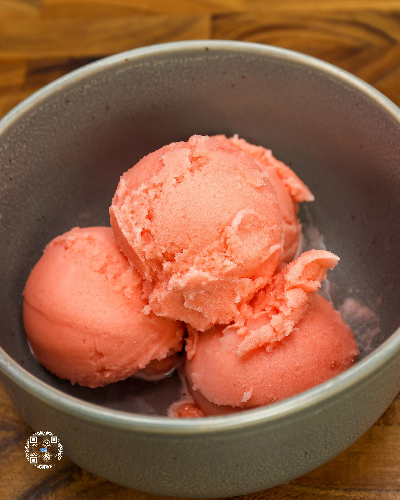

## Additional Recipe Pages

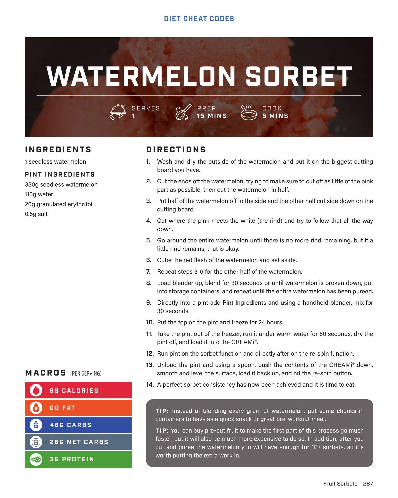

## Source Pages

287, 288

---

# STEAK FAJITA DINNER

**Serves:** 5 | **Prep:** 30 MINS | **Cook:** 50 MINS

## Macros

| Calories | Fat | Carbs | Net Carbs | Protein |
|----------|-----|-------|-----------|---------|
| 614 | 19 | 64 | undefined | 52 |

## Ingredients

### STEAK FAJITA

- 896g top round steak
- 20g soy sauce
- 6g salt
- 2g black pepper
- 4g baking soda
- 8g avocado oil (in bowl)
- 8g avocado oil (in pan)
- 750g white onion
- 150g red bell pepper
- 150g orange bell pepper
- 150g yellow bell pepper
- 150g green bell pepper
- 150g anaheim pepper
- 8g cumin
- 8g smoked paprika
- 8g garlic powder
- 4g onion powder
- 4g chili powder
- 2g dried oregano
- 10g salt
- 3g black pepper
- 40g lime juice
- 30g avocado oil

### MEXICAN RICE

- 8g avocado oil
- 170g white rice, washed
- 150g tomato sauce
- 12g chicken bouillon
- 2g garlic powder
- 2g onion powder
- 2g cumin
- 5g oregano
- 400g chicken broth

### ROASTED SALSA VERDE

- 300g tomatillos
- 50g onion, chopped
- 62g jalapeno
- 21g serrano pepper
- 12g roasted garlic
- 8g cilantro
- 15g lime juice
- 50g water
- 5g salt

## Directions

1. Preheat the oven to 500°F, add a sheet pan into the oven, preheat 2 large pans on medium heat, and place a large bowl in the freezer.
2. Cut steak diagonally into thin strips and transfer them to a bowl. In the same bowl, add soy sauce, salt, black pepper, baking soda, and avocado oil. Massage these ingredients into the steak, ensuring they are well incorporated.
3. Slice the onions, bell peppers, and anaheim peppers into ¼ inch strips and add to a large bowl.
4. In a small bowl, combine cumin, smoked paprika, garlic powder, onion powder, chili powder, dried oregano, salt, and black pepper. Mix the ingredients together until well blended.
5. Sprinkle the seasonings over the sliced vegetables followed by lime juice and avocado oil. Using your hands, mix all the ingredients together until they are thoroughly combined and evenly coated.
6. Using oven mitts, grab the sheet pan from the oven, add the vegetables to the pan, and spread them out evenly using tongs. Place the sheet pan in the oven and set a timer for 10 minutes.
7. Increase the heat to medium-high on both pans. In one of the pans, add the tomatillos, onion, jalapeno, and serrano pepper. Flip the vegetables every few minutes to ensure they are evenly roasted.
8. Using the other pan, add 4 grams of avocado oil and half of the steak. Spread the steak evenly over the pan's surface and brown for 2-3 minutes. Toss the steak, continue cooking for an additional 1-2 minutes, and transfer to a large bowl.
9. Once the timer goes off, remove the sheet pan from the oven and using tongs, mix the vegetables around the pan. After the vegetables are evenly spread out, place the sheet pan back in the oven and set another timer for 10 minutes.
10. Finish cooking the remaining steak by repeating Step 8. Add the cooked steak to the bowl with the rest of the finished steak.
11. Add the roasted stovetop vegetables into a food processor along with ROASTED GARLIC, cilantro, lime juice, water, and salt. Blend the ingredients for 1-2 minutes.
12. Grab the bowl from the freezer, add the salsa to it, and place back into the freezer for 5-10 minutes.
13. Once the timer goes off, turn the broiler on high, mix the vegetables around the pan, and broil them for 2-3 minutes.
14. Add the roasted vegetables to the cooked steak and mix thoroughly.
15. Into a medium bowl, add tomato sauce, chicken bouillon, garlic powder, onion powder, cumin, and oregano. Mix thoroughly.
16. Add chicken broth into a measuring cup and microwave for 1-2 minutes or until broth has reached 120°F.
17. Turn the pan that roasted the vegetables onto medium heat, add avocado oil and rice into the pan, and stir to combine. Frequently stir the mixture until the rice has become golden brown.
18. Add the tomato sauce into the pan, stir to combine, and cook for 30 seconds.
19. Add the chicken broth and stir to combine. Once boiling, turn the heat down to low, cover with a lid, and cook for 12 minutes.
20. Keeping the lid on, move the pan off the heat, let it sit for 15 minutes, and stir to combine.
21. To assemble, distribute the steak fajita mix and mexican rice evenly among 5 meal prep containers. Fill 2 oz plastic cups with salsa verde, cover each container with a lid, and refrigerate.
22. When it's time to eat, place a wet paper towel over the meal prep containers and microwave them in 60-second intervals until they are heated through. For more even cooking, mix the ingredients between each interval.

## Additional Recipe Pages

## Source Pages

425, 426, 427
