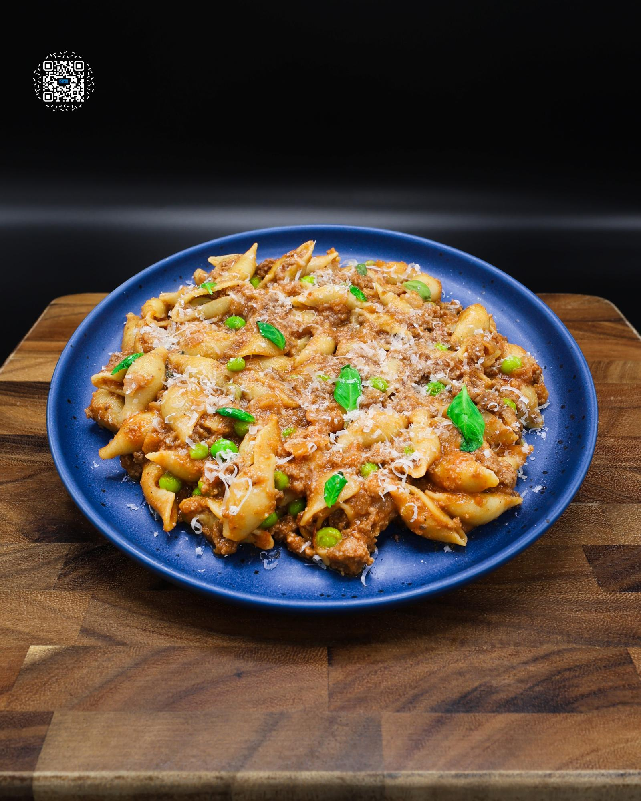

# CREAMY BEEF & SHELLS

**Serves:** 20 | **Prep:** 60 MINS | **Cook:** 80 MINS

## Macros

| Calories | Fat | Carbs | Net Carbs | Protein |
|----------|-----|-------|-----------|---------|
| 526 | 15 | 53 | N/A | 44 |

## Ingredients

- 2688g 93% lean ground beef
- 27g salt (for beef)
- 40g olive oil
- 810g onion, diced + frozen
- 3g salt (for onions)
- 80g garlic, pre-peeled + minced
- 6g black pepper
- 3g crushed red pepper
- 1420g bone broth
- 21g gelatin
- 2382g Cento San Marzano Tomatoes, crushed
- 100g water
- 12g salt (for pasta)
- 908g medium shell pasta
- 454g peas, frozen
- 540g 2% evaporated milk
- 126g Parmigiano Reggiano, grated
- 30g fresh basil

## Directions

1. Preheat oven to 500°F while preheating a pot on medium heat. This recipe requires a 20 QT POT. If you don't have one, make 1/3 the recipe in a 5.5 qt pot for 6 servings.
2. Flatten ground beef into an even layer on a SHEET PAN, top with salt, and set oven to broil on high.
3. Place meat 6 inches from the broiler and cook for 25-30 minutes, or until a deep brown crust forms across the top.
4. Place onion in a large bowl, heat for 4-6 minutes or until room temperature, and drain excess liquid.
5. Add olive oil to the pot followed by onion and salt, then mix.
6. Sprinkle gelatin over bone broth and let it absorb.
7. Sauté onion until liquid cooks out, but before it takes on color.
8. Create a space in the middle of the pot and add garlic. Evenly spread black pepper and crushed red pepper over the ingredients. Sauté for 60 seconds, then mix.
9. Add tomatoes, bone broth, water, and salt to the pot. Stir and bring to a simmer.
10. As the pot heats to a simmer, crumble beef into small pieces, mix with its juices, add to the pot, and stir.
11. Once simmering, add pasta and cook for 6-8 minutes, stirring every few minutes.
12. Add peas and evaporated milk, mix, and cook until pasta is al dente (typically 8-10 more minutes), stirring every couple of minutes to prevent burning at the bottom of the pot.
13. Remove pot from heat, add Parmigiano Reggiano and basil, and mix.
14. To cool quickly and avoid overcooking noodles, pour pasta onto 2 sheet pans and spread into an even layer.
15. Portion into containers, about 405g each, and refrigerate or freeze.
16. Reheat covered with a damp paper towel for 2 minutes from refrigerator, then mix. From frozen, microwave for 4-6 minutes, stir, then microwave for 1-2 more minutes and mix again.

