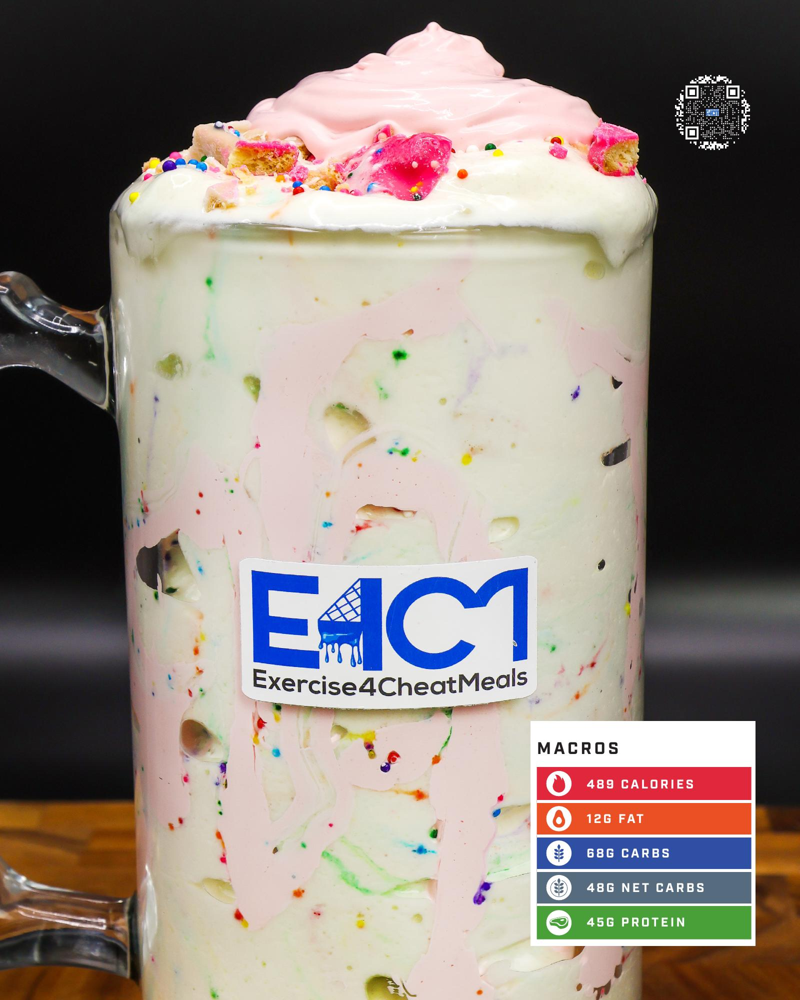

# ANIMAL CRACKER FREEZE

**Serves:** 1 | **Prep:** 15 MINS | **Cook:** 4 MINS

## Macros

| Calories | Fat | Carbs | Net Carbs | Protein |
|----------|-----|-------|-----------|---------|
| 489 | 12 | 68 | 48 | 45 |

## Ingredients

### HOMEMADE FROSTING

- 226g sugar-free whipped topping
- 10g sugar-free vanilla instant pudding mix
- 4.2g vanilla extract
- 6 drops red food coloring

### ANIMAL CRACKER FREEZE

- 460g ice

### SPIN 1

- 70g fat-free milk
- 80g fat-free Greek yogurt
- 18g sugar-free whipped topping
- 4.2g vanilla extract
- 1g salt

### SPIN 2

- 7g sugar-free vanilla instant pudding mix
- 1g xanthan gum
- 1g guar gum
- 40g PEScience Gourmet Vanilla protein powder
- 20g granulated erythritol

### MIX-INS/TOPPINGS

- 24g animal crackers, chopped
- 30g Homemade Frosting

## Directions

1. Using a hand mixer, mix 226g whipped topping for one minute.
2. Add all other Homemade Frosting ingredients and mix for an additional 5 minutes or until a thick frosting consistency forms.
3. Chop animal crackers into your preferred size pieces.
4. Add ice to blender and blend for 1 minute on high.
5. Add Spin 1 ingredients to blender in the order listed and blend for 1 minute on high.
6. Take blade out, mix everything around with a spatula, scrape off any dry ingredients stuck on the walls of blender, and replace blade.
7. Add Spin 2 ingredients to blender in the order listed and blend for 1 minute on high.
8. Take blade out, mix everything around with a spatula, scrape off any dry ingredients stuck on the walls of blender, replace blade, and blend for 1 more minute.
9. Take blade out, add ½ the animal crackers, and stir into the freeze.
10. Top with remaining animal crackers and frosting.
11. EAT.

## Tips

If you want the cream to look more aesthetic put a gallon bag in a cup, add frosting to it, cut the tip of the bag off, and pipe the frosting on top of your freeze.

