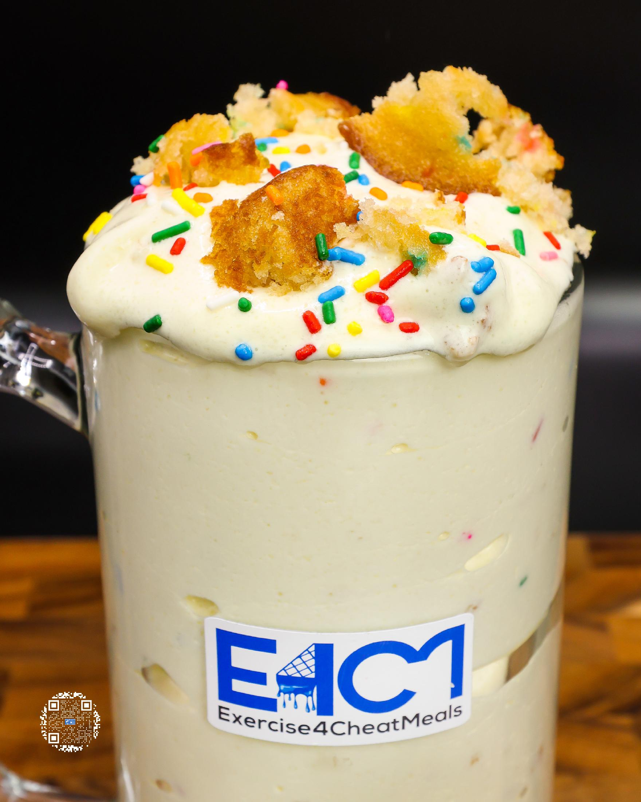
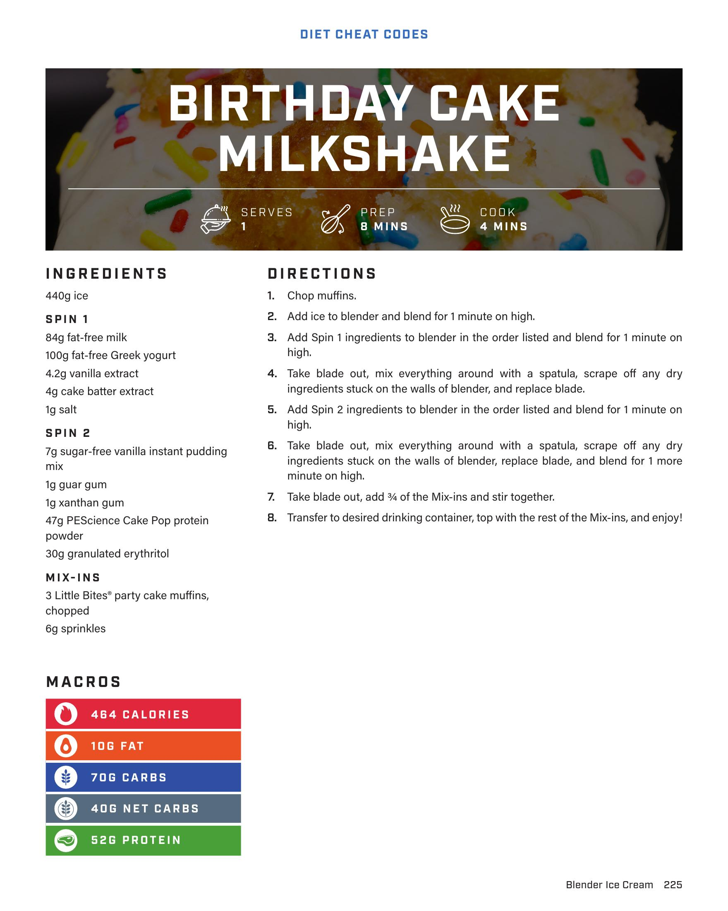

# BIRTHDAY CAKE MILKSHAKE

**Serves:** 1 | **Prep:** 8 MINS | **Cook:** 4 MINS

## Macros

| Calories | Fat | Carbs | Net Carbs | Protein |
|----------|-----|-------|-----------|---------|
| 464 | 10 | 70 | 40 | 52 |

## Ingredients

### SPIN 1

- 440g ice
- 84g fat-free milk
- 100g fat-free Greek yogurt
- 4.2g vanilla extract
- 4g cake batter extract
- 1g salt

### SPIN 2

- 7g sugar-free vanilla instant pudding mix
- 1g guar gum
- 1g xanthan gum
- 47g PEScience Cake Pop protein powder
- 30g granulated erythritol

### MIX-INS

- 3 Little Bites® party cake muffins, chopped
- 0g sprinkles

## Directions

1. Chop muffins.
2. Add ice to blender and blend for 1 minute on high.
3. Add Spin 1 ingredients to blender in the order listed and blend for 1 minute on high.
4. Take blade out, mix everything around with a spatula, scrape off any dry ingredients stuck on the walls of blender, and replace blade.
5. Add Spin 2 ingredients to blender in the order listed and blend for 1 minute on high.
6. Take blade out, mix everything around with a spatula, scrape off any dry ingredients stuck on the walls of blender, and replace blade, and blend for 1 more minute on high.
7. Take blade out, add ¾ of the Mix-ins and stir together.
8. Transfer to desired drinking container, top with the rest of the Mix-ins, and enjoy!

## Additional Recipe Pages

## Source Pages

225, 226
