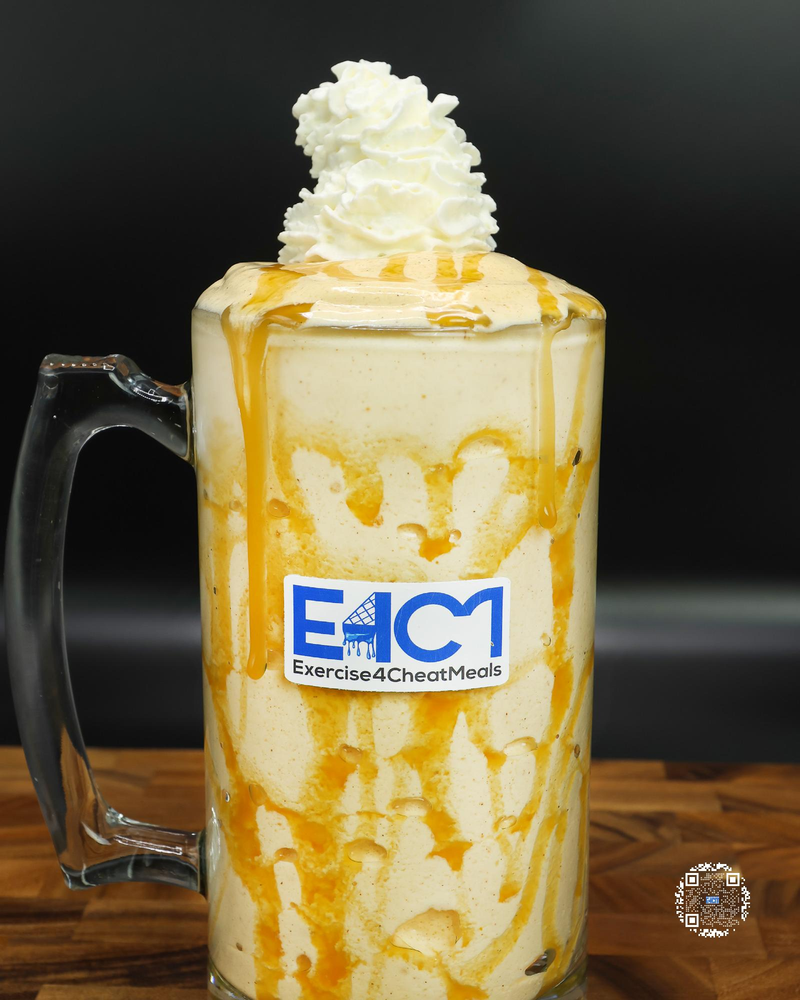

# CARAMEL PUMPKIN SPICE PROTEIN ICE CREAM

**Serves:** 1 | **Prep:** 8 MINS | **Cook:** 4 MINS

## Macros

| Calories | Fat | Carbs | Net Carbs | Protein |
|----------|-----|-------|-----------|---------|
| 505 | 6 | 69 | 49 | 61 |

## Ingredients

### BLENDER

- 480g ice

### SPIN 1

- 122g pure pumpkin
- 50g fat-free Greek yogurt
- 112g fat-free milk
- 4.2g vanilla extract

### SPIN 2

- 7g sugar-free cheesecake instant pudding mix
- 1g guar gum
- 1g xanthan gum
- 3g pumpkin pie spice
- 62g PEScience Snickerdoodle protein powder
- 20g granulated erythritol

### MIX-INS

- 25g caramel syrup
- 35g fat-free whipped cream

## Directions

1. Add ice to blender and blend for 1 minute.
2. Add Spin 1 ingredients to blender in the order listed and blend for 1 minute on high.
3. Take blade out, mix everything around with a spatula, scrape off any dry ingredients stuck on the walls of blender, and replace blade.
4. Add Spin 2 ingredients to blender in the order listed and blend for 1 minute on high.
5. Take blade out, mix everything around with a spatula, scrape off any dry ingredients stuck on the walls of blender, replace blade, and blend for 1 more minute.
6. Take blade out, add 15g caramel, and fold in with a spatula.
7. Transfer to desired drinking container, top with whipped cream and remaining caramel, and enjoy!

