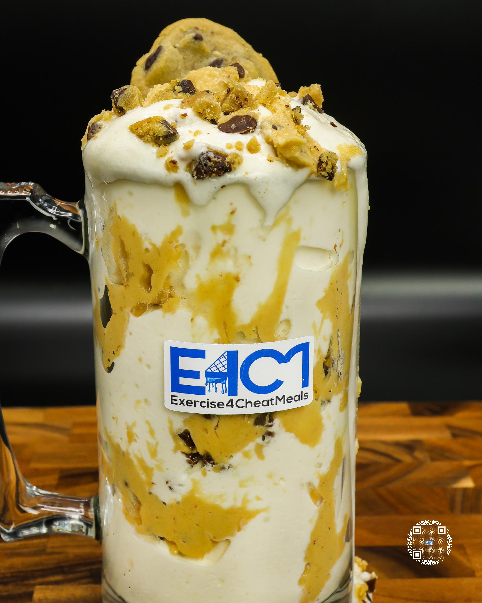

# CHOCOLATE CHIP COOKIE FREEZE

**Serves:** 1 | **Prep:** 8 MINS | **Cook:** 15 MINS

## Macros

| Calories | Fat | Carbs | Net Carbs | Protein |
|----------|-----|-------|-----------|---------|
| 497 | 13 | 67 | 47 | 45 |

## Ingredients

### SPIN 1

- 420g ice
- 65g fat-free milk
- 65g fat-free Greek yogurt
- 4.2g vanilla extract
- 18g sugar-free whipped topping
- 1g salt

### SPIN 2

- 7g sugar-free vanilla instant pudding mix
- 1g guar gum
- 1g xanthan gum
- 31g PEScience Gourmet Vanilla protein powder
- 20g granulated erythritol

### MIX-INS

- 50g CHOCOLATE CHIP COOKIE DOUGH (refrigerated)
- 25g Nestle Toll House® cookies (baked, then frozen)

## Directions

1. Bake cookies, chop them into bite sized chunks, and throw them in the freezer at least an hour before you want to eat.
2. Add ice to blender and blend for 1 minute.
3. Add Spin 1 ingredients to blender in the order listed and blend for 1 minute on high.
4. Take blade out, mix everything around with a spatula, scrape off any dry ingredients stuck on the walls of blender, and replace blade.
5. Add Spin 2 ingredients to blender in the order listed and blend for 1 minute on high.
6. Take blade out, mix everything around with a spatula, scrape off any dry ingredients stuck on the walls of blender, replace blade, and blend for 1 more minute.
7. Get Mix-ins, take blade out, put spatula in the corner of the blender, and push ice cream out of the corner to create a tunnel to the bottom of the blender.
8. Add a layer of cookies into the blender tunnel, followed by a layer of cookie dough, and repeat until Mix-ins are gone.
9. After putting blade back into blender, pulse 15 times (yes precisely 15) to make sure Mix-ins are dispersed evenly throughout cream.
10. Pop the top off, take the blade out, and ENJOY.

## Tips

For a more aesthetic freeze along with cookie dough bites throughout, line the drinking container with a third of the cookie dough, add some of the chopped cookies, and mix in the remaining cookie dough/cookie pieces.

