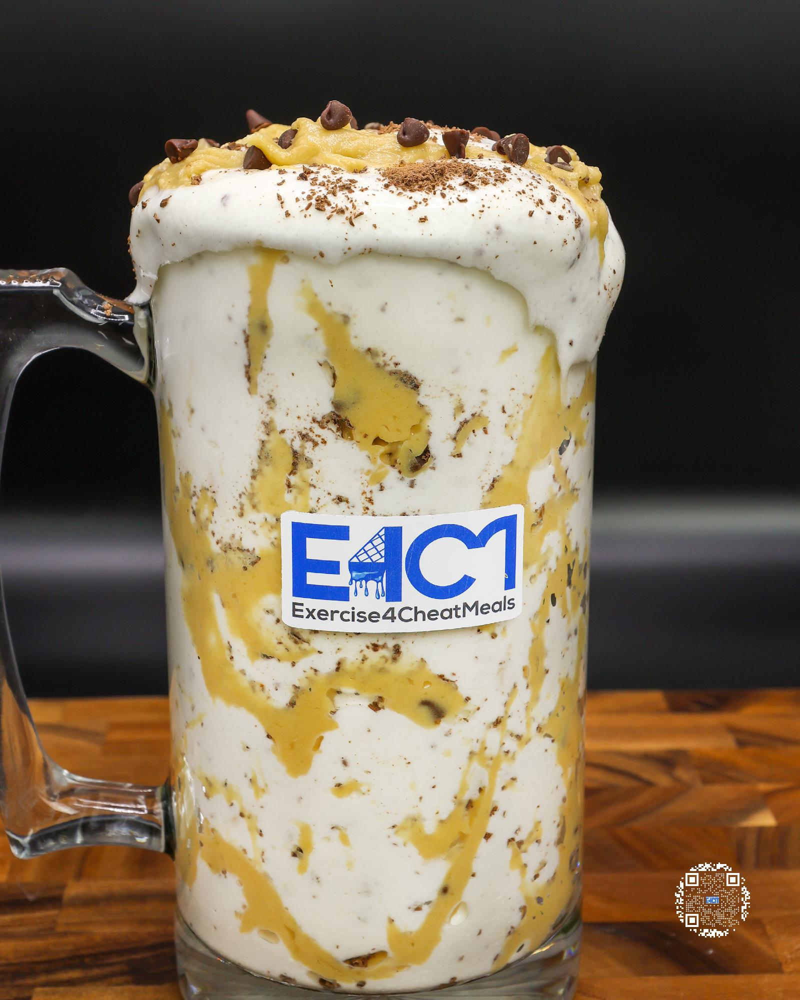

# COOKIE DOUGH PROTEIN ICE CREAM

**Serves:** 1 | **Prep:** 8 MINS | **Cook:** 4 MINS

## Macros

| Calories | Fat | Carbs | Net Carbs | Protein |
|----------|-----|-------|-----------|---------|
| 501 | 12 | 60 | 41 | 55 |

## Ingredients

- 400g ice

### SPIN 1

- 18g sugar-free whipped topping
- 130g fat-free Greek yogurt
- 84g fat-free milk
- 4.2g vanilla extract
- 1.5g salt

### SPIN 2

- 7g sugar-free white chocolate instant pudding mix
- 1g xanthan gum
- 1g guar gum
- 31g PEScience Gourmet Vanilla protein powder
- 15g granulated erythritol

### MIX-INS

- 2 Hershey Kisses®, grated
- 60g CHOCOLATE CHIP COOKIE DOUGH

## Directions

1. Add ice to blender and blend for 1 minute.
2. Add Spin 1 ingredients to blender in the order listed and blend for 1 minute on high.
3. Take blade out, mix everything around with a spatula, scrape off any dry ingredients stuck on the walls of blender, and replace blade.
4. Add Spin 2 ingredients to blender in the order listed and blend for 1 minute on high.
5. Take blade out, mix everything around with a spatula, scrape off any dry ingredients stuck on the walls of blender, replace blade, and blend for 1 more minute on high.
6. While blending, grate Hershey Kisses®.
7. Take blender stick out, add Hershey Kisses® to the blender, and mix in with a spatula.
8. Add 3-4 small chunks of cookie dough to the blender and gently fold in. Repeat until 60g of cookie dough has been added.
9. Transfer to desired drinking container, top with the rest of the Mix-ins, and enjoy!

## Tips

For a more aesthetic milkshake, line the drinking container with a third of the cookie dough, mix in a third of the cookie dough, and top with a third of the cookie dough.

