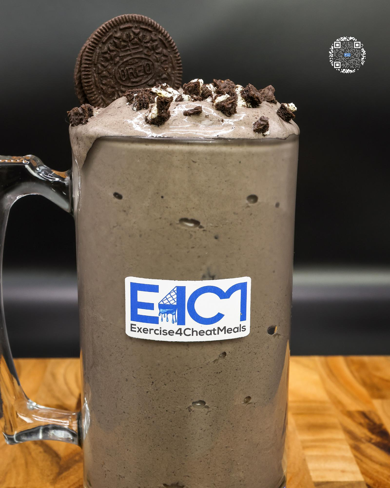

# COOKIES N' CREAM NICKFLURRY

**Serves:** 1 | **Prep:** 8 MINS | **Cook:** 4 MINS

## Macros

| Calories | Fat | Carbs | Net Carbs | Protein |
|----------|-----|-------|-----------|---------|
| 547 | 15 | 88 | 58 | 53 |

## Ingredients

- 480g ice

### SPIN 1

- 130g 1% milk
- 120g fat-free Greek yogurt
- 4.2g vanilla extract
- 2g salt

### SPIN 2

- 7g sugar-free vanilla instant pudding mix
- 1.5g guar gum
- 1.5g xanthan gum
- 42g PEScience Cookies and Cream protein powder
- 10g black cocoa powder
- 30g granulated erythritol
- 3 Oreos®

### MIX-INS

- 1 Oreo®, crushed

## Directions

1. Add ice to blender and blend for 1 minute.
2. Add Spin 1 ingredients to blender in the order listed and blend for 1 minute on high.
3. Take blade out, mix everything around with a spatula, scrape off any dry ingredients stuck on the walls of blender, and replace blade.
4. Add Spin 2 ingredients to blender in the order listed and blend for 1 minute on high.
5. Take blade out, mix everything around with a spatula, scrape off any dry ingredients stuck on the walls of blender, and blend for 1 more minute.
6. Add ½ the Mix-ins and stir together.
7. Top with remaining Mix-ins and it's time to eat.

