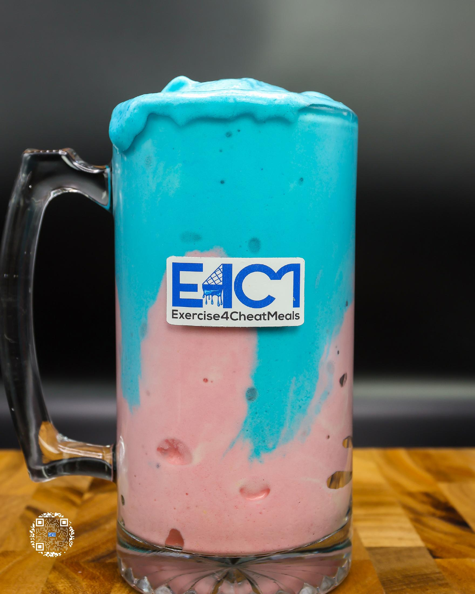
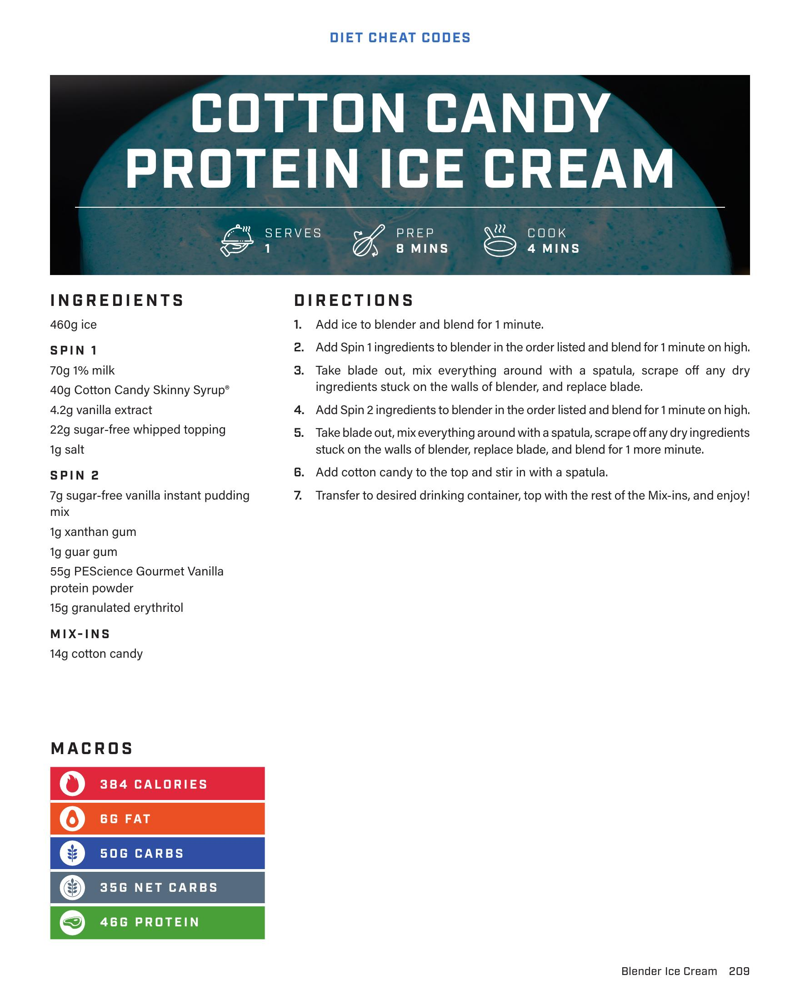

# COTTON CANDY PROTEIN ICE CREAM

**Serves:** 1 | **Prep:** 8 MINS | **Cook:** 4 MINS

## Macros

| Calories | Fat | Carbs | Net Carbs | Protein |
|----------|-----|-------|-----------|---------|
| 384 | 6 | 50 | 35 | 48 |

## Ingredients

### SPIN 1

- 460g ice
- 70g 1% milk
- 40g Cotton Candy Skinny Syrup*
- 4.2g vanilla extract
- 22g sugar-free whipped topping
- 1g salt

### SPIN 2

- 7g sugar-free vanilla instant pudding mix
- 1g xanthan gum
- 1g guar gum
- 55g PEScience Gourmet Vanilla protein powder
- 15g granulated erythritol

### MIX-INS

- 14g cotton candy

## Directions

1. Add ice to blender and blend for 1 minute.
2. Add Spin 1 ingredients to blender in the order listed and blend for 1 minute on high.
3. Take blade out, mix everything around with a spatula, scrape off any dry ingredients stuck on the walls of blender, and replace blade.
4. Add Spin 2 ingredients to blender in the order listed and blend for 1 minute on high.
5. Take blade out, mix everything around with a spatula, scrape off any dry ingredients stuck on the walls of blender, replace blade, and blend for 1 more minute.
6. Add cotton candy to the top and stir in with a spatula.
7. Transfer to desired drinking container, top with the rest of the Mix-ins, and enjoy!

## Additional Recipe Pages

## Source Pages

209, 210
