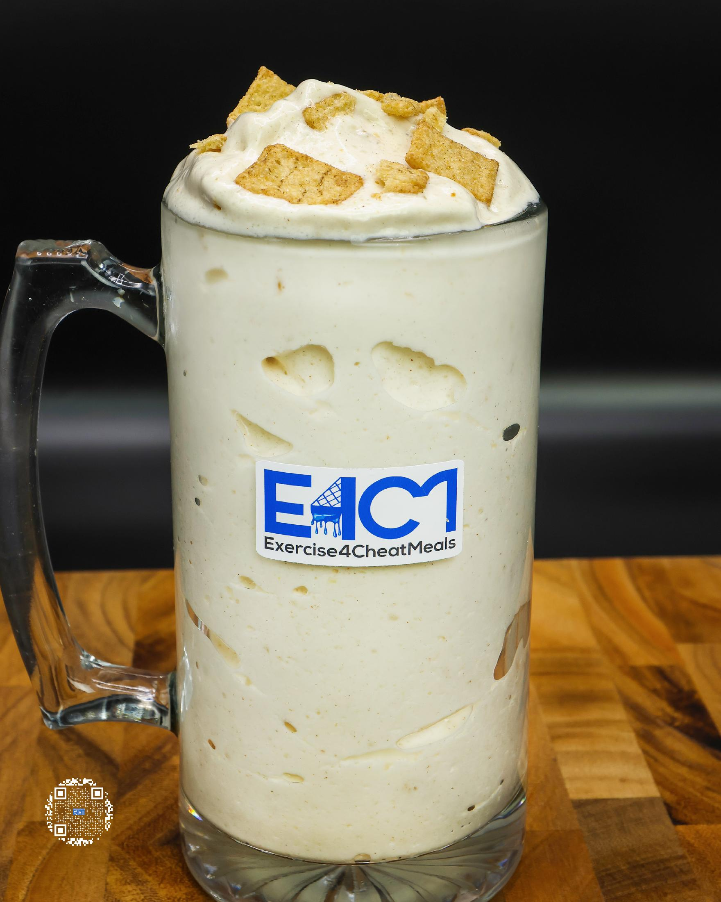
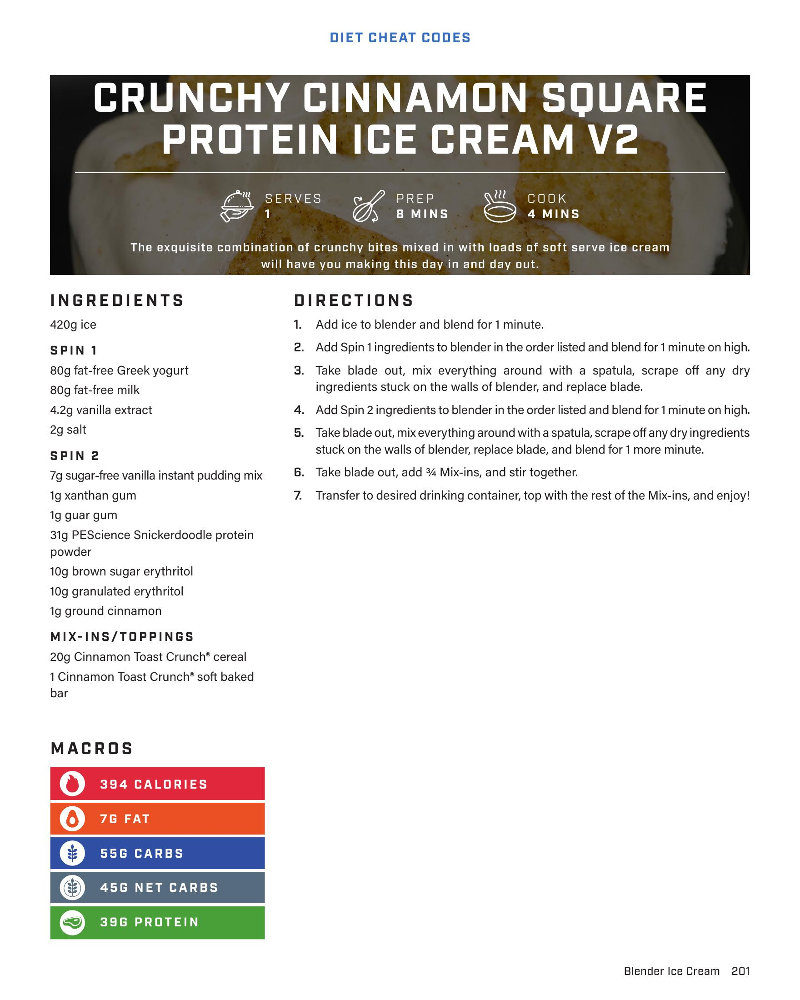
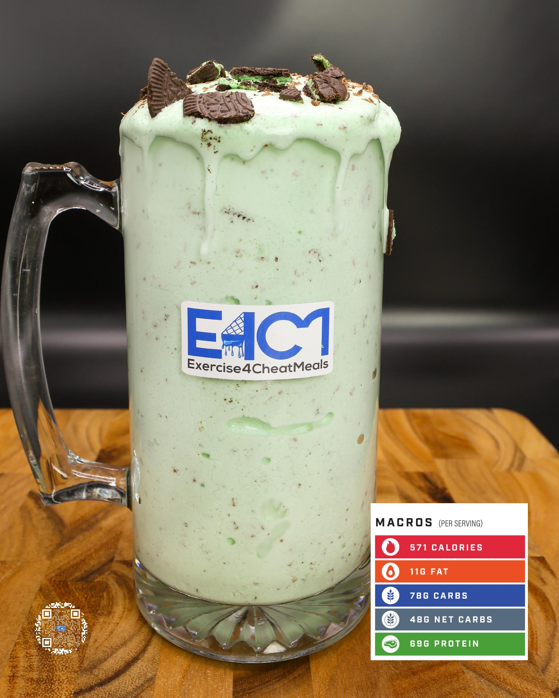

# CRUNCHY CINNAMON SQUARE PROTEIN ICE CREAM V2

**Serves:** 1 | **Prep:** 8 MINS | **Cook:** 4 MINS

## Macros

| Calories | Fat | Carbs | Net Carbs | Protein |
|----------|-----|-------|-----------|---------|
| 394 | 7 | 55 | 45 | 39 |

## Ingredients

### SPIN 1

- 420g ice
- 80g fat-free Greek yogurt
- 80g fat-free milk
- 4.2g vanilla extract
- 2g salt

### SPIN 2

- 7g sugar-free vanilla instant pudding mix
- 1g xanthan gum
- 1g guar gum
- 31g PEScience Snickerdoodle protein powder
- 10g brown sugar erythritol
- 10g granulated erythritol
- 1g ground cinnamon

### MIX-INS/TOPPINGS

- 20g Cinnamon Toast Crunch® cereal
- 1 Cinnamon Toast Crunch® soft baked bar

## Directions

1. Add ice to blender and blend for 1 minute.
2. Add Spin 1 ingredients to blender in the order listed and blend for 1 minute on high.
3. Take blade out, mix everything around with a spatula, scrape off any dry ingredients stuck on the walls of blender, and replace blade.
4. Add Spin 2 ingredients to blender in the order listed and blend for 1 minute on high.
5. Take blade out, mix everything around with a spatula, scrape off any dry ingredients stuck on the walls of blender, replace blade, and blend for 1 more minute.
6. Take blade out, add ¾ Mix-ins, and stir together.
7. Transfer to desired drinking container, top with the rest of the Mix-ins, and enjoy!

## Additional Recipe Pages

## Source Pages

201, 202, 203
