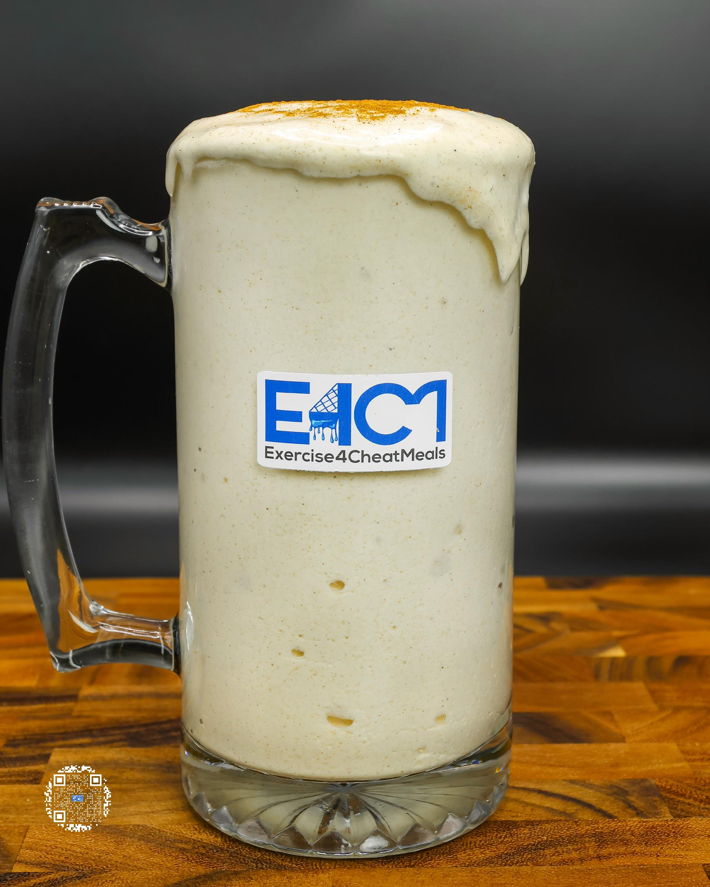
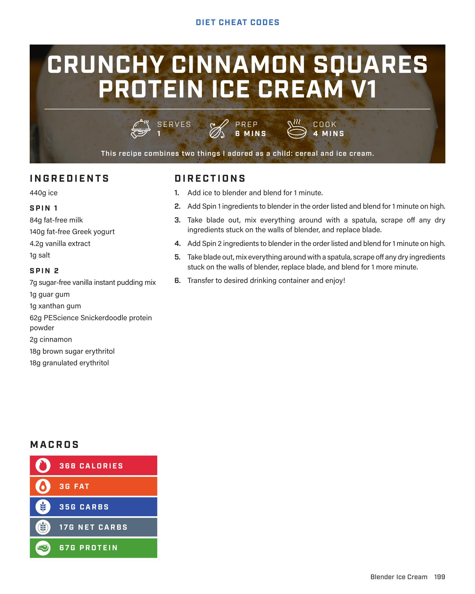

# CRUNCHY CINNAMON SQUARES PROTEIN ICE CREAM V1

**Serves:**  | **Prep:** 6 MINS | **Cook:** 4 MINS

## Macros

| Calories | Fat | Carbs | Net Carbs | Protein |
|----------|-----|-------|-----------|---------|
| 368 | 3 | 35 | 17 | 67 |

## Ingredients

### SPIN 1

- 440g ice
- 84g fat-free milk
- 140g fat-free Greek yogurt
- 4.2g vanilla extract
- 1g salt

### SPIN 2

- 7g sugar-free vanilla instant pudding mix
- 1g guar gum
- 1g xanthan gum
- 62g PEScience Snickerdoodle protein powder
- 2g cinnamon
- 18g brown sugar erythritol
- 18g granulated erythritol

## Directions

1. Add ice to blender and blend for 1 minute.
2. Add Spin 1 ingredients to blender in the order listed and blend for 1 minute on high.
3. Take blade out, mix everything around with a spatula, scrape off any dry ingredients stuck on the walls of blender, and replace blade.
4. Add Spin 2 ingredients to blender in the order listed and blend for 1 minute on high.
5. Take blade out, mix everything around with a spatula, scrape off any dry ingredients stuck on the walls of blender, replace blade, and blend for 1 more minute.
6. Transfer to desired drinking container and enjoy!

## Additional Recipe Pages

## Source Pages

199, 200
