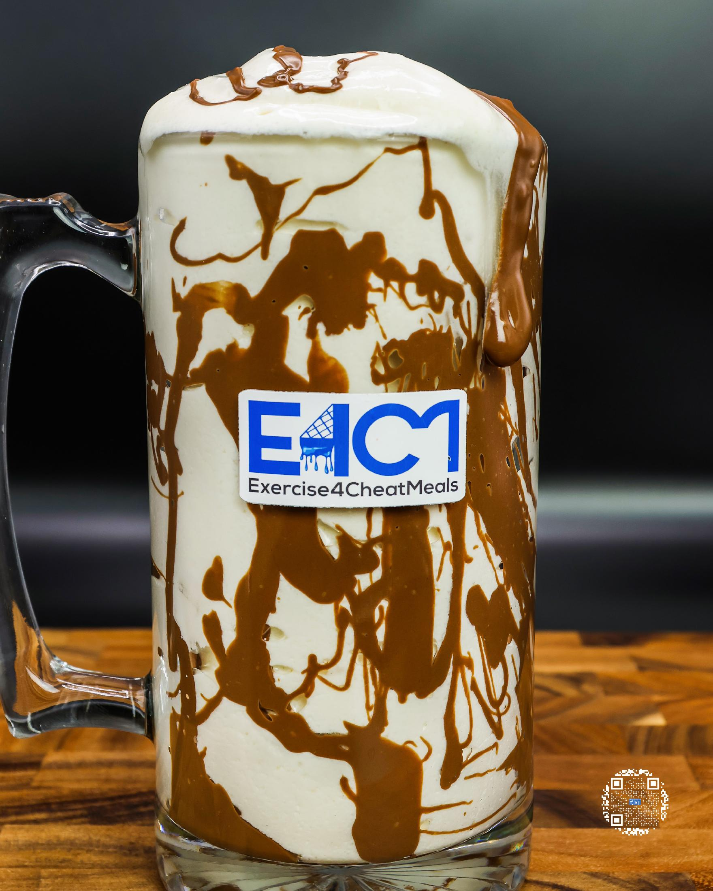
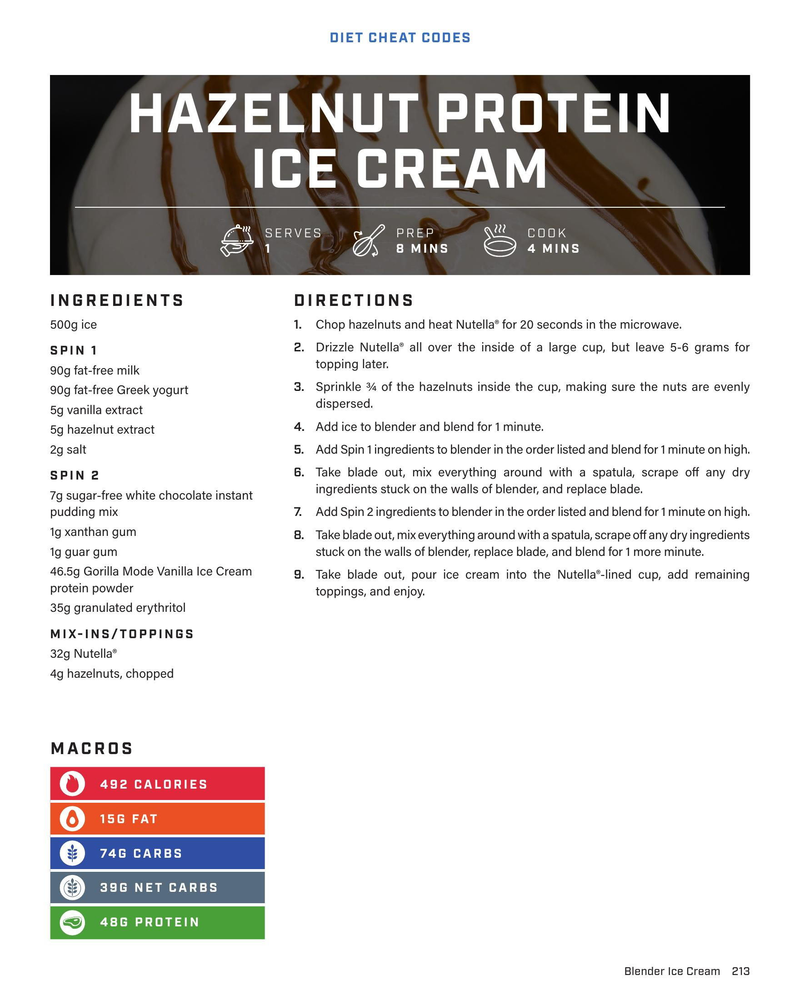

# HAZELNUT PROTEIN ICE CREAM

**Serves:** 1 | **Prep:** 8 MINS | **Cook:** 4 MINS

## Macros

| Calories | Fat | Carbs | Net Carbs | Protein |
|----------|-----|-------|-----------|---------|
| 492 | 15 | 74 | 39 | 48 |

## Ingredients

### SPIN 1

- 500g ice
- 90g fat-free milk
- 90g fat-free Greek yogurt
- 5g vanilla extract
- 5g hazelnut extract
- 2g salt

### SPIN 2

- 7g sugar-free white chocolate instant pudding mix
- 1g xanthan gum
- 1g guar gum
- 46.5g Gorilla Mode Vanilla Ice Cream protein powder
- 35g granulated erythritol

### MIX-INS/TOPPINGS

- 32g Nutella®
- 4g hazelnuts, chopped

## Directions

1. Chop hazelnuts and heat Nutella® for 20 seconds in the microwave.
2. Drizzle Nutella® all over the inside of a large cup, but leave 5-6 grams for topping later.
3. Sprinkle ¼ of the hazelnuts inside the cup, making sure the nuts are evenly dispersed.
4. Add ice to blender and blend for 1 minute.
5. Add Spin 1 ingredients to blender in the order listed and blend for 1 minute on high.
6. Take blade out, mix everything around with a spatula, scrape off any dry ingredients stuck on the walls of blender, and replace blade.
7. Add Spin 2 ingredients to blender in the order listed and blend for 1 minute on high.
8. Take blade out, mix everything around with a spatula, scrape off any dry ingredients stuck on the walls of blender, and replace blade, and blend for 1 more minute.
9. Take blade out, pour ice cream into the Nutella®-lined cup, add remaining toppings, and enjoy.

## Additional Recipe Pages

## Source Pages

213, 214
