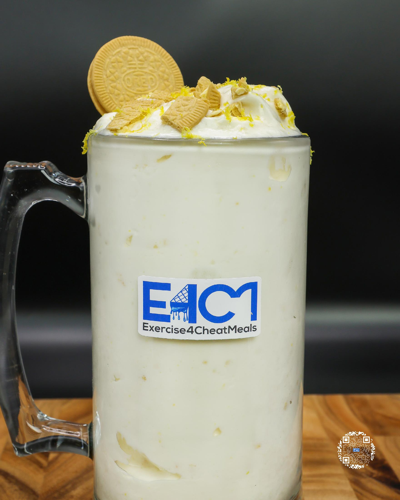
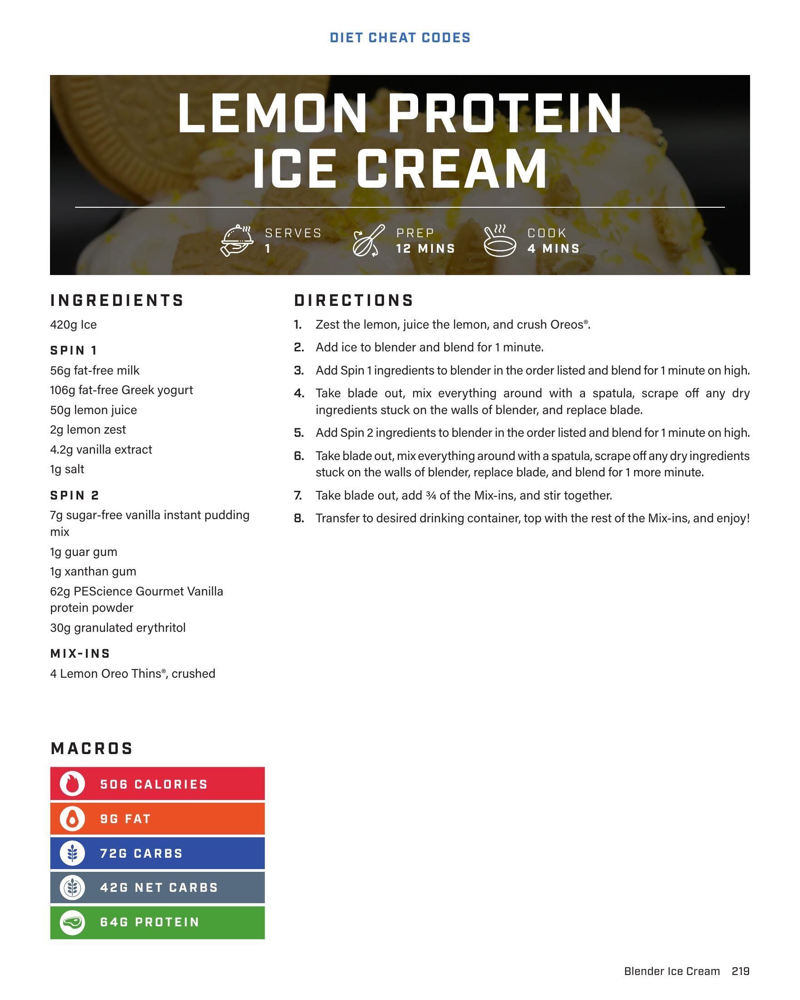

# LEMON PROTEIN ICE CREAM

**Serves:** 1 | **Prep:** 12 MINS | **Cook:** 4 MINS

## Macros

| Calories | Fat | Carbs | Net Carbs | Protein |
|----------|-----|-------|-----------|---------|
| 506 | 9 | 72 | 42 | 64 |

## Ingredients

### SPIN 1

- 420g Ice
- 56g fat-free milk
- 106g fat-free Greek yogurt
- 50g lemon juice
- 2g lemon zest
- 4.2g vanilla extract
- 1g salt

### SPIN 2

- 7g sugar-free vanilla instant pudding mix
- 1g guar gum
- 1g xanthan gum
- 62g PEScience Gourmet Vanilla protein powder
- 30g granulated erythritol

### MIX-INS

- 4 Lemon Oreo Thins®, crushed

## Directions

1. Zest the lemon, juice the lemon, and crush Oreos®.
2. Add ice to blender and blend for 1 minute.
3. Add Spin 1 ingredients to blender in the order listed and blend for 1 minute on high.
4. Take blade out, mix everything around with a spatula, scrape off any dry ingredients stuck on the walls of blender, and replace blade.
5. Add Spin 2 ingredients to blender in the order listed and blend for 1 minute on high.
6. Take blade out, mix everything around with a spatula, scrape off any dry ingredients stuck on the walls of blender, replace blade, and blend for 1 more minute.
7. Take blade out, add ¾ of the Mix-ins, and stir together.
8. Transfer to desired drinking container, top with the rest of the Mix-ins, and enjoy!

## Additional Recipe Pages

## Source Pages

219, 220
