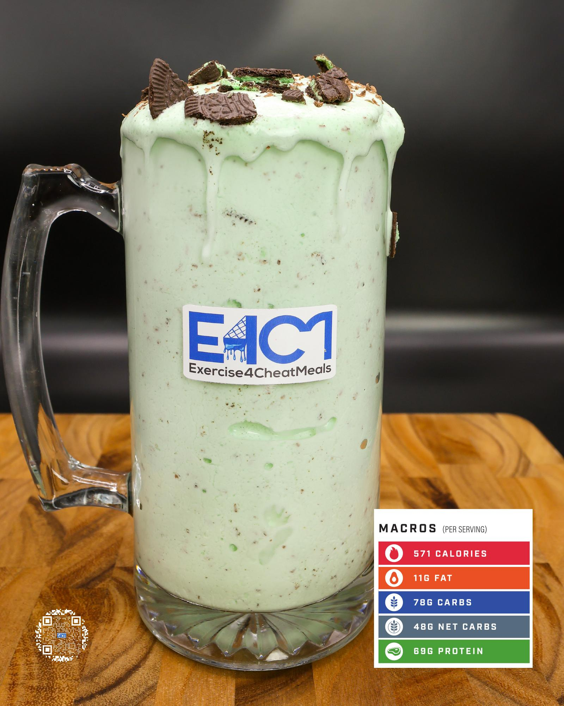

# MINT CHOCOLATE COOKIE PROTEIN ICE CREAM

**Serves:** 1 | **Prep:** 8 MINS | **Cook:** 4 MINS

## Macros

| Calories | Fat | Carbs | Net Carbs | Protein |
|----------|-----|-------|-----------|---------|
| 571 | 11 | 78 | 48 | 69 |

## Ingredients

### SPIN 1

- 480g ice
- 84g fat-free milk
- 140g fat-free Greek yogurt
- 15 drops or 1/4 tsp peppermint extract
- 4.2g vanilla extract
- 12 drops green food coloring (optional)
- 1g salt

### SPIN 2

- 10g Oreo® instant pudding mix
- 1g xanthan gum
- 1g guar gum
- 62g PEScience Gourmet Vanilla protein powder
- 30g granulated erythritol

### MIX-INS

- 4 Mint Oreo Thins®, crushed
- 7g Dark Chocolate Hershey Kisses®, grated

## Directions

1. Crush Oreo Thins® into your preferred chunks and grate chocolate on small-holed side of grater.
2. Add ice to blender and blend for 1 minute.
3. Add Spin 1 ingredients to blender in the order listed and blend for 1 minute on high.
4. Take blade out, mix everything around with a spatula, scrape off any dry ingredients stuck on the walls of blender, and replace blade.
5. Add Spin 2 ingredients to blender in the order listed and blend for 1 minute on high.
6. Take blade out, mix everything around with a spatula, scrape off any dry ingredients stuck on the walls of blender, replace blade, and blend for 1 more minute.
7. Take blade out, add ¾ Mix-ins, and stir together.
8. Transfer to desired drinking container, top with the rest of the Mix-ins, and enjoy!

