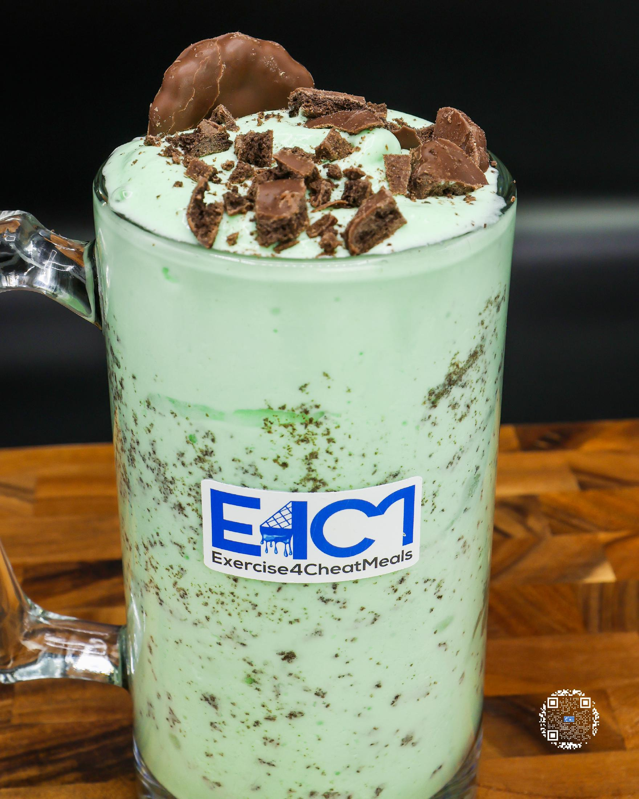
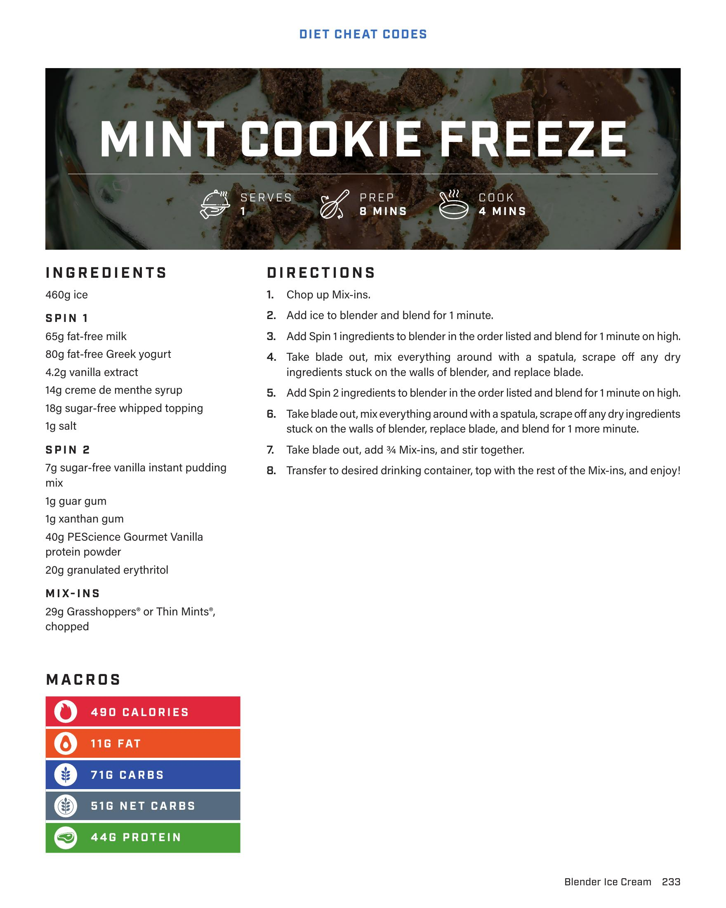

# MINT COOKIE FREEZE

**Serves:** 1 | **Prep:** 0 MINS | **Cook:** 4 MINS

## Macros

| Calories | Fat | Carbs | Net Carbs | Protein |
|----------|-----|-------|-----------|---------|
| 490 | 11 | 71 | 51 | 44 |

## Ingredients

- 460g Ice

### SPIN 1

- 65g fat-free milk
- 80g fat-free Greek yogurt
- 4.2g vanilla extract
- 14g creme de menthe syrup
- 18g sugar-free whipped topping
- 1g salt

### SPIN 2

- 7g sugar-free vanilla instant pudding mix
- 1g guar gum
- 1g xanthan gum
- 40g PEScience Gourmet Vanilla protein powder
- 20g granulated erythritol

### MIX-INS

- 29g Grasshoppers® or Thin Mints®, chopped

## Directions

1. Chop up Mix-ins.
2. Add ice to blender and blend for 1 minute.
3. Add Spin 1 ingredients to blender in the order listed and blend for 1 minute on high.
4. Take blade out, mix everything around with a spatula, scrape off any dry ingredients stuck on the walls of blender, and replace blade.
5. Add Spin 2 ingredients to blender in the order listed and blend for 1 minute on high.
6. Take blade out, mix everything around with a spatula, scrape off any dry ingredients stuck on the walls of blender, replace blade, and blend for 1 more minute.
7. Take blade out, add ¾ Mix-ins, and stir together.
8. Transfer to desired drinking container, top with the rest of the Mix-ins, and enjoy!

## Additional Recipe Pages

## Source Pages

233, 234
