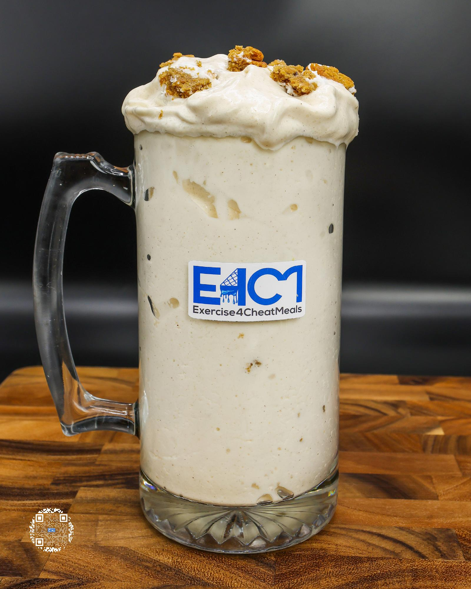

# OATMEAL CRÈME PIE PROTEIN ICE CREAM

**Serves:** 1 | **Prep:** 8 MINS | **Cook:** 4 MINS

## Macros

| Calories | Fat | Carbs | Net Carbs | Protein |
|----------|-----|-------|-----------|---------|
| 432 | 9 | 60 | 51 | 38 |

## Ingredients

- 420g ice

### SPIN 1

- 75g fat-free milk
- 75g fat-free Greek yogurt
- 4.2g vanilla extract
- 2g salt

### SPIN 2

- 7g sugar-free vanilla instant pudding mix
- 1g xanthan gum
- 1g guar gum
- 31g PEScience Snickerdoodle protein powder
- 9g brown sugar erythritol
- 9g granulated erythritol
- 1g ground cinnamon

### MIX-INS

- 1 Little Debbie® oatmeal creme pie
- 14g mini marshmallows

## Directions

1. Break creme pie into bite-sized chunks.
2. Add ice to blender and blend for 1 minute.
3. Add Spin 1 ingredients to blender in the order listed and blend for 1 minute on high.
4. Take blade out, mix everything around with a spatula, scrape off any dry ingredients stuck on the walls of blender, and replace blade.
5. Add Spin 2 ingredients to blender in the order listed and blend for 1 minute on high.
6. Take blade out, mix everything around with a spatula, scrape off any dry ingredients stuck on the walls of blender, replace blade, and blend for 1 more minute.
7. Take blade out, add ".75" Mix-ins, and stir together.
8. Transfer to desired drinking container, top with remaining Mix-ins, and EAT!

