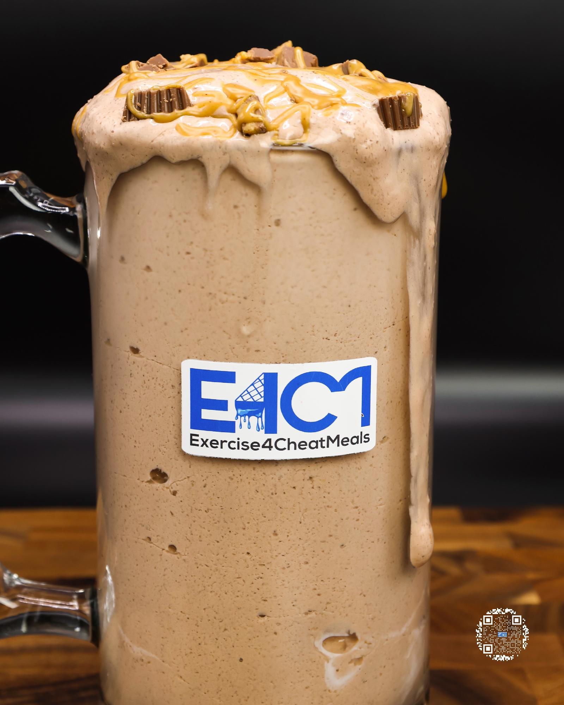

# PEANUT BUTTER CUP MILKSHAKE

**Serves:** 1 | **Prep:** 6 MINS | **Cook:** 4 MINS

## Macros

| Calories | Fat | Carbs | Net Carbs | Protein |
|----------|-----|-------|-----------|---------|
| 558 | 16 | 69 | 39 | 67 |

## Ingredients

- 460g ice

### SPIN 1

- 120g fat-free milk
- 140g fat-free Greek yogurt
- 1g salt

### SPIN 2

- 7g sugar-free chocolate fudge instant pudding mix
- 1g xanthan gum
- 1g guar gum
- 20g powdered peanut butter
- 5g unsweetened cocoa powder
- 41g PEScience Chocolate Peanut Butter Cup protein powder
- 30g granulated erythritol

### MIX-INS

- 8g peanut butter
- 2 Reese's Thins®, chopped

## Directions

1. Add ice to blender and blend for 1 minute.
2. Add Spin 1 ingredients to blender in the order listed and blend for 1 minute on high.
3. Take blade out, mix everything around with a spatula, scrape off any dry ingredients stuck on the walls of blender, and replace blade. Add Spin 2 ingredients to blender in the order listed and blend for 1 minute on high.
4. Take blade out, mix everything around with a spatula, scrape off any dry ingredients stuck on the walls of blender, replace blade, and blend for 1 more minute.
5. While blending, chop up Reese's Thins® into desired chunks and microwave peanut butter in small bowl for 30 seconds.
6. Take blade out, add ½ the Mix-ins, and fold in.
7. Top the milkshake with the rest of the Mix-ins and eat right out of the blender or pour into a cup and enjoy!

## Tips

Leave Reese's® in the freezer to make them easier to chop when ready to make a shake. This will also slow the melting process of the milkshake so you can enjoy for longer.

