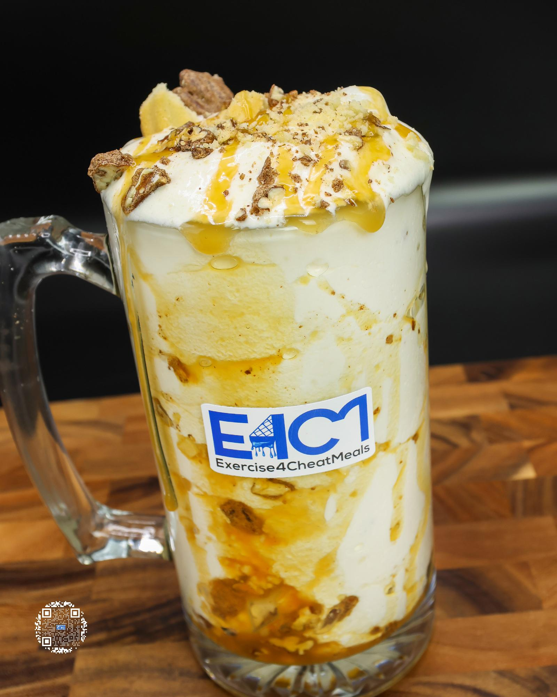

# PECAN PIE FREEZE

**Serves:** 1 | **Prep:** 8 MINS | **Cook:** 4 MINS

## Macros

| Calories | Fat | Carbs | Net Carbs | Protein |
|----------|-----|-------|-----------|---------|
| 594 | 21 | 78 | 53 | 53 |

## Ingredients

- 480g ice

### SPIN 1

- 120g fat-free milk
- 120g fat-free Greek yogurt
- 4.2g vanilla extract
- 2g salt

### SPIN 2

- 7g sugar-free vanilla instant pudding mix
- 1g guar gum
- 1g xanthan gum
- 38g PEScience Gourmet Vanilla protein powder
- 25g granulated erythritol

### MIX-INS

- 31g Candied Pecans, chopped
- 18g Salerno's® butter cookies, chopped
- 23g caramel sauce

## Directions

1. Chop pecans and butter cookies.
2. Add ice to blender and blend for 1 minute.
3. Add Spin 1 ingredients to blender in the order listed and blend for 1 minute on high.
4. Take blade out, mix everything around with a spatula, scrape off any dry ingredients stuck on the walls of blender, and replace blade.
5. Add Spin 2 ingredients to blender in the order listed and blend for 1 minute on high.
6. Take blade out, mix everything around with a spatula, scrape off any dry ingredients stuck on the walls of blender, replace blade, and blend for 1 more minute.
7. Take blade out, add ¾ the pecans and butter cookies, and stir together.
8. Get caramel, put spatula in the corner of the blender, and push ice cream out of the corner using the spatula to create a tunnel to the bottom of the blender.
9. Add caramel from the bottom to the top.
10. Fold in caramel, top with remaining Mix-ins, and enjoy!

## Tips

For a more aesthetic freeze, line the inside of a large glass with ¾ of the caramel after step 7 and immediately pour it into the glass. Top with the remaining Mix-ins and caramel and enjoy!

