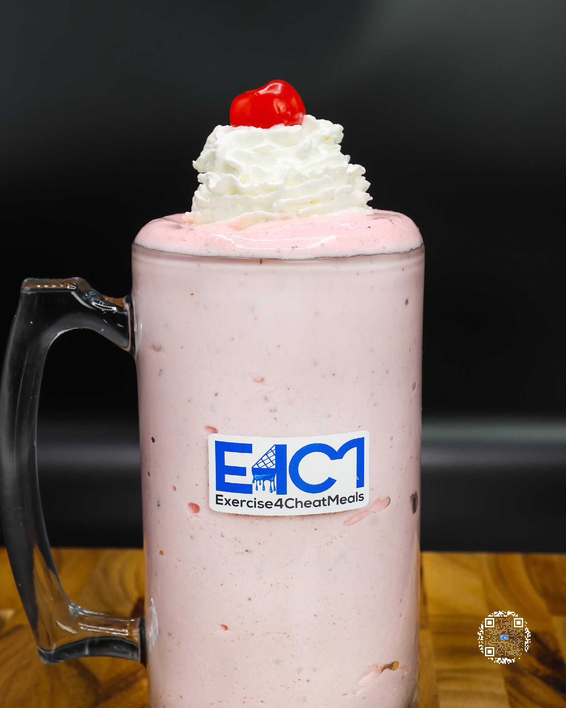
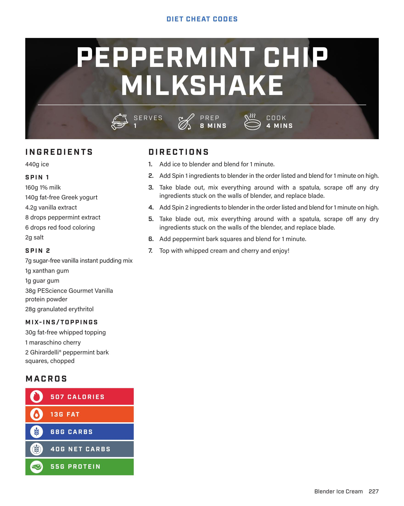

# PEPPERMINT CHIP MILKSHAKE

**Serves:** 1 | **Prep:** 8 MINS | **Cook:** 4 MINS

## Macros

| Calories | Fat | Carbs | Net Carbs | Protein |
|----------|-----|-------|-----------|---------|
| 507 | 13 | 68 | 40 | 55 |

## Ingredients

### SPIN 1

- 440g ice
- 160g 1% milk
- 140g fat-free Greek yogurt
- 4.2g vanilla extract
- 8 drops peppermint extract
- 6 drops red food coloring
- 2g salt

### SPIN 2

- 7g sugar-free vanilla instant pudding mix
- 1g xanthan gum
- 1g guar gum
- 38g PEScience Gourmet Vanilla protein powder
- 28g granulated erythritol

### MIX-INS/TOPPINGS

- 30g fat-free whipped topping
- 1 maraschino cherry
- 2 Ghirardelli® peppermint bark squares, chopped

## Directions

1. Add ice to blender and blend for 1 minute.
2. Add Spin 1 ingredients to blender in the order listed and blend for 1 minute on high.
3. Take blade out, mix everything around with a spatula, scrape off any dry ingredients stuck on the walls of blender, and replace blade.
4. Add Spin 2 ingredients to blender in the order listed and blend for 1 minute on high.
5. Take blade out, mix everything around with a spatula, scrape off any dry ingredients stuck on the walls of the blender, and replace blade.
6. Add peppermint bark squares and blend for 1 minute.
7. Top with whipped cream and cherry and enjoy!

## Additional Recipe Pages

## Source Pages

227, 228
