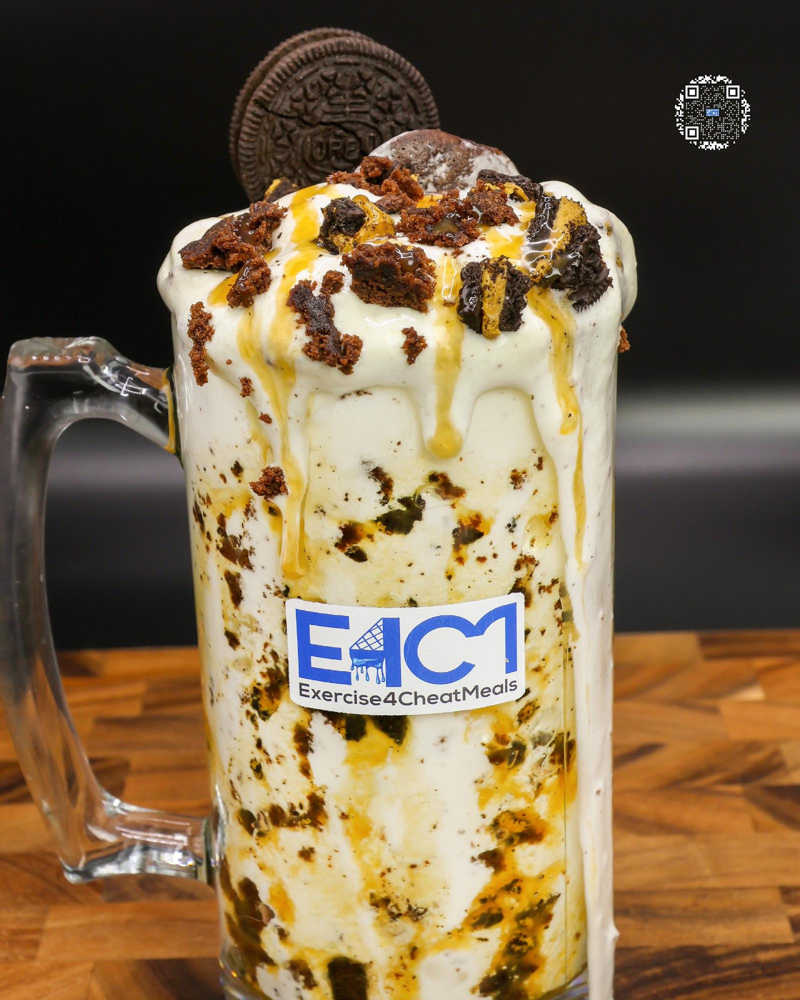

# SALTED CARAMEL FUDGE BROWNIE PROTEIN ICE CREAM

**Serves:** 1 | **Prep:** 8 MINS | **Cook:** 4 MINS

## Macros

| Calories | Fat | Carbs | Net Carbs | Protein |
|----------|-----|-------|-----------|---------|
| 523 | 12 | 72 | 54 | 45 |

## Ingredients

- 400g ice

### SPIN 1

- 90g fat-free milk
- 90g fat-free Greek yogurt
- 4.2g vanilla extract
- 2g salt

### SPIN 2

- 7g sugar-free vanilla instant pudding mix
- 1g guar gum
- 1g xanthan gum
- 38g PEScience Gourmet Vanilla protein powder
- 18g granulated erythritol

### MIX-INS

- 2 Toffee Crunch Oreos®
- 1 brownie bite (85 Cal)

### TOPPING

- 12g sea salt caramel sauce
- Dash sea salt

## Directions

1. Chop up Oreos® and the brownie bite and put to the side.
2. Add ice to blender and blend for 1 minute.
3. Add Spin 1 ingredients to blender in the order listed and blend for 1 minute on high.
4. Take blade out, mix everything around with a spatula, scrape off any dry ingredients stuck on the walls of blender, and replace blade.
5. Add Spin 2 ingredients to blender in the order listed and blend for 1 minute on high.
6. Take blade out, mix everything around with a spatula, scrape off any dry ingredients stuck on the walls of blender, replace blade, and blend for 1 more minute.
7. Take blade out, add 	 Mix-ins, and fold in.
8. Transfer to desired drinking container, top with the rest of the Mix-ins and toppings, and enjoy!

## Tips

For an even better eating experience, after step 7, line a large glass with the sea salt caramel. Then sprinkle some of the Mix-ins into the glass which will stick directly onto the caramel. Pour the ice cream into your glass, top with remaining caramel and Mix-ins, and continually get bites filled with caramel, Oreo®, and brownie as you eat your way down the glass.

