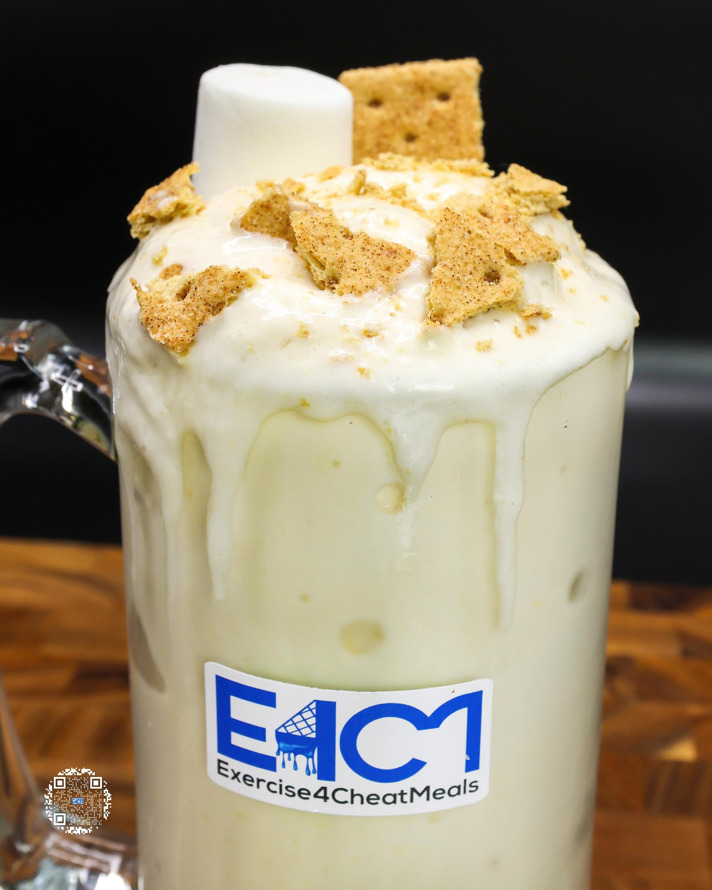

# S'MORES PROTEIN ICE CREAM

**Serves:** 1 | **Prep:** 10 MINS | **Cook:** 4 MINS

## Macros

| Calories | Fat | Carbs | Net Carbs | Protein |
|----------|-----|-------|-----------|---------|
| 460 | 3 | 80 | 62 | 44 |

## Ingredients

- 480g ice

### SPIN 1

- 84g fat-free milk
- 60g fat-free Greek yogurt
- 2.1g vanilla extract
- 1.5g salt
- 6 large marshmallows (150 Cal)

### SPIN 2

- 7g sugar-free vanilla instant pudding mix
- 1g guar gum
- 1g xanthan gum
- 40g PEScience Gourmet Vanilla protein powder
- 18g granulated erythritol

### MIX-INS

- 15g graham crackers

## Directions

1. Chop graham crackers
2. Place marshmallows in an even line on a lightly oiled sheet pan and put underneath the broiler for 45 seconds to a minute or until browned to your preference. CAUTION: Do not leave the oven unattended, you must watch this process. This can easily start on fire if just left under the broiler for an extended period of time.
3. Add ice to blender and blend for 1 minute on high.
4. Add Spin 1 ingredients to blender in the order listed and blend for 1 minute on high.
5. Take blade out, mix everything around with a spatula, scrape off any dry ingredients stuck on the walls of blender, and replace blade.
6. Add Spin 2 ingredients to blender in the order listed and blend for 1 minute on high.
7. Take blade out, mix everything around with a spatula, scrape off any dry ingredients stuck on the walls of blender, replace blade, and blend for 1 more minute.
8. Take blade out, add ounds Mix-ins, and stir together.
9. Transfer to desired drinking container, top with remaining graham crackers and EAT!

