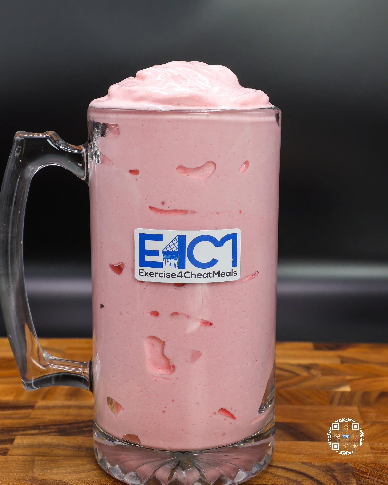

# STRAWBERRY SOFT SERVE

**Serves:** 1 | **Prep:** 8 MINS | **Cook:** 4 MINS

## Macros

| Calories | Fat | Carbs | Net Carbs | Protein |
|----------|-----|-------|-----------|---------|
| 388 | 2 | 78 | 53 | 37 |

## Ingredients

- 470g ice

### SPIN 1

- 110g fat-free milk
- 40g Torani® strawberry puree
- 4.2g vanilla extract
- 2g salt

### SPIN 2

- 7g sugar-free vanilla instant pudding mix
- 1g guar gum
- 1g xanthan gum
- 40g PEScience Gourmet Vanilla protein powder
- 25g granulated erythritol

## Directions

1. Add ice to blender and blend for 1 minute on high.
2. Add Spin 1 ingredients to blender in the order listed and blend for 1 minute on high.
3. Take blade out, mix everything around with a spatula, scrape off any dry ingredients stuck on the walls of blender, and replace blade.
4. Add Spin 2 ingredients to blender in the order listed and blend for 1 minute on high.
5. Take blade out, mix everything around with a spatula, scrape off any dry ingredients stuck on the walls of blender, replace blade, and blend for 1 more minute.
6. Take blade out, pour into a glass, and enjoy.

