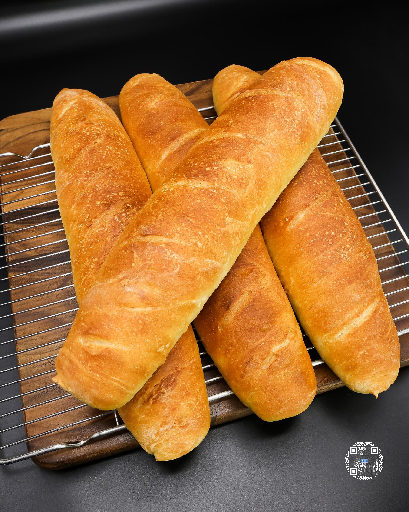
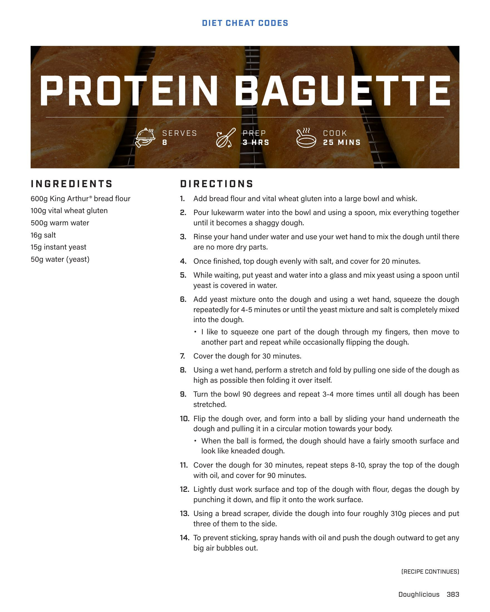
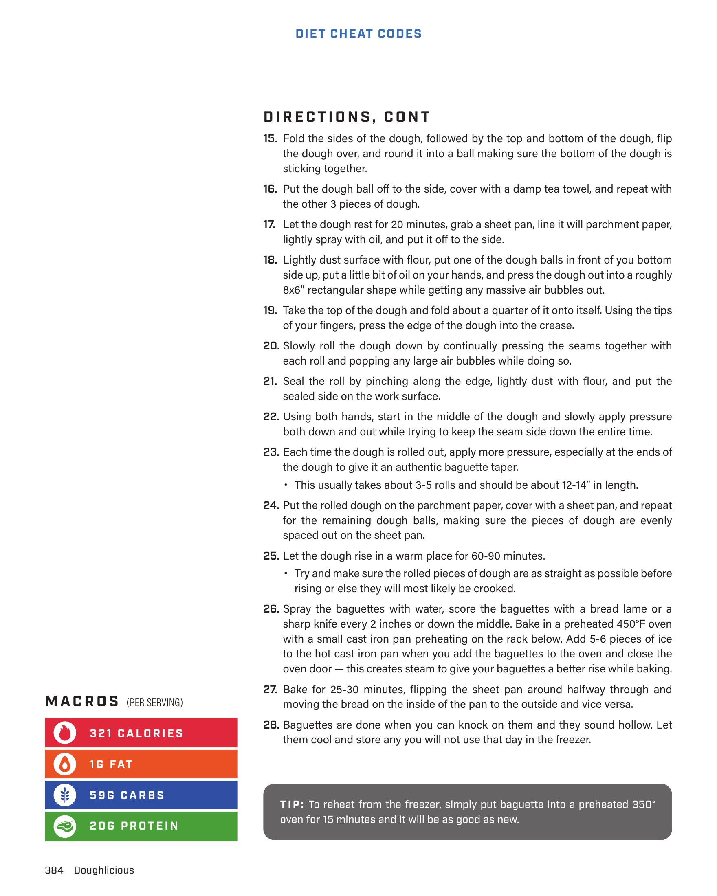
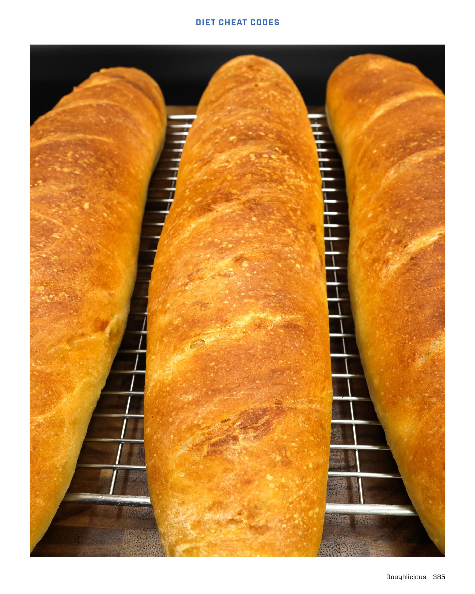
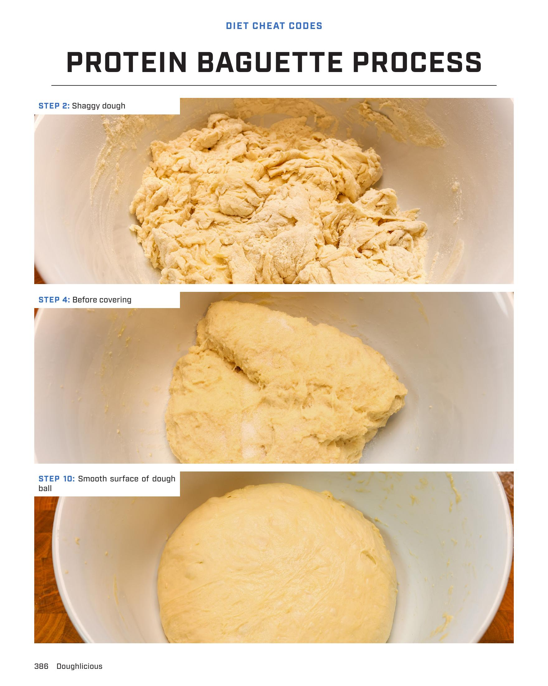
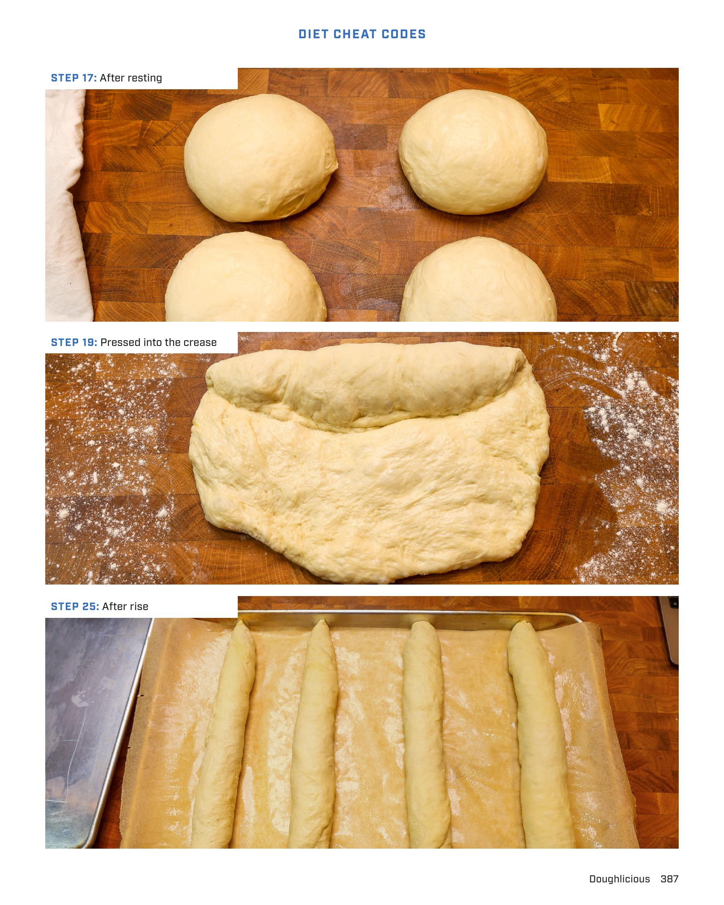

# PROTEIN BAGUETTE

**Serves:** 8 | **Prep:** 3 HRS | **Cook:** 25 MINS

## Macros

| Calories | Fat | Carbs | Net Carbs | Protein |
|----------|-----|-------|-----------|---------|
| 321 | 16 | 59 | undefined | 20 |

## Ingredients

- 600g King Arthur® bread flour
- 100g vital wheat gluten
- 500g warm water
- 16g salt
- 15g instant yeast
- 50g water (yeast)

## Directions

1. Add bread flour and vital wheat gluten into a large bowl and whisk.
2. Pour lukewarm water into the bowl and using a spoon, mix everything together until it becomes a shaggy dough.
3. Rinse your hand under water and use your wet hand to mix the dough until there are no more dry parts.
4. Once finished, top dough evenly with salt, and cover for 20 minutes.
5. While waiting, put yeast and water into a glass and mix yeast using a spoon until yeast is covered in water.
6. Add yeast mixture onto the dough and using a wet hand, squeeze the dough repeatedly for 4-5 minutes or until the yeast mixture and salt is completely mixed into the dough. I like to squeeze one part of the dough through my fingers, then move to another part and repeat while occasionally flipping the dough.
7. Cover the dough for 30 minutes.
8. Using a wet hand, perform a stretch and fold by pulling one side of the dough as high as possible then folding it over itself.
9. Turn the bowl 90 degrees and repeat 3-4 more times until all dough has been stretched.
10. Flip the dough over, and form into a ball by sliding your hand underneath the dough and pulling it in a circular motion towards your body. When the ball is formed, the dough should have a fairly smooth surface and look like kneaded dough.
11. Cover the dough for 30 minutes, repeat steps 8-10, spray the top of the dough with oil, and cover for 90 minutes.
12. Lightly dust work surface and top of the dough with flour, degas the dough by punching it down, and flip it onto the work surface.
13. Using a bread scraper, divide the dough into four roughly 310g pieces and put three of them to the side.
14. To prevent sticking, spray hands with oil and push the dough outward to get any big air bubbles out.
15. Fold the sides of the dough, followed by the top and bottom of the dough, flip the dough over, and round it into a ball making sure the bottom of the dough is sticking together.
16. Put the dough ball off to the side, cover with a damp tea towel, and repeat with the other 3 pieces of dough.
17. Let the dough rest for 20 minutes, grab a sheet pan, line it with parchment paper, lightly spray with oil, and put it off to the side.
18. Lightly dust surface with flour, put one of the dough balls in front of you bottom side up, put a little bit of oil on your hands, and press the dough out into a roughly 8x6" rectangular shape while getting any massive air bubbles out.
19. Take the top of the dough and fold about a quarter of it onto itself. Using the tips of your fingers, press the edge of the dough into the crease.
20. Slowly roll the dough down by continually pressing the seams together with each roll and popping any large air bubbles while doing so.
21. Seal the roll by pinching along the edge, lightly dust with flour, and put the sealed side on the work surface.
22. Using both hands, start in the middle of the dough and slowly apply pressure both down and out while trying to keep the seam side down the entire time.
23. Each time the dough is rolled out, apply more pressure, especially at the ends of the dough to give it an authentic baguette taper. This usually takes about 3-5 rolls and should be about 12-14" in length.
24. Put the rolled dough on the parchment paper, cover with a sheet pan, and repeat for the remaining dough balls, making sure the pieces of dough are evenly spaced out on the sheet pan.
25. Let the dough rise in a warm place for 60-90 minutes. Try and make sure the rolled pieces of dough are as straight as possible before rising or else they will most likely be crooked.
26. Spray the baguettes with water, score the baguettes with a bread lame or a sharp knife every 2 inches or down the middle. Bake in a preheated 450°F oven with a small cast iron pan preheating on the rack below. Add 5-6 pieces of ice to the hot cast iron pan when you add the baguettes to the oven and close the oven door.
27. Bake for 25-30 minutes, flipping the sheet pan around halfway through and moving the bread on the inside of the pan to the outside and vice versa.
28. Baguettes are done when you can knock on them and they sound hollow. Let them cool and store any you will not use that day in the freezer.

## Tips

To reheat from the freezer, simply put baguette into a preheated 350° oven for 15 minutes and it will be good as new.

## Additional Recipe Pages

## Source Pages

383, 384, 385, 386, 387, 388
