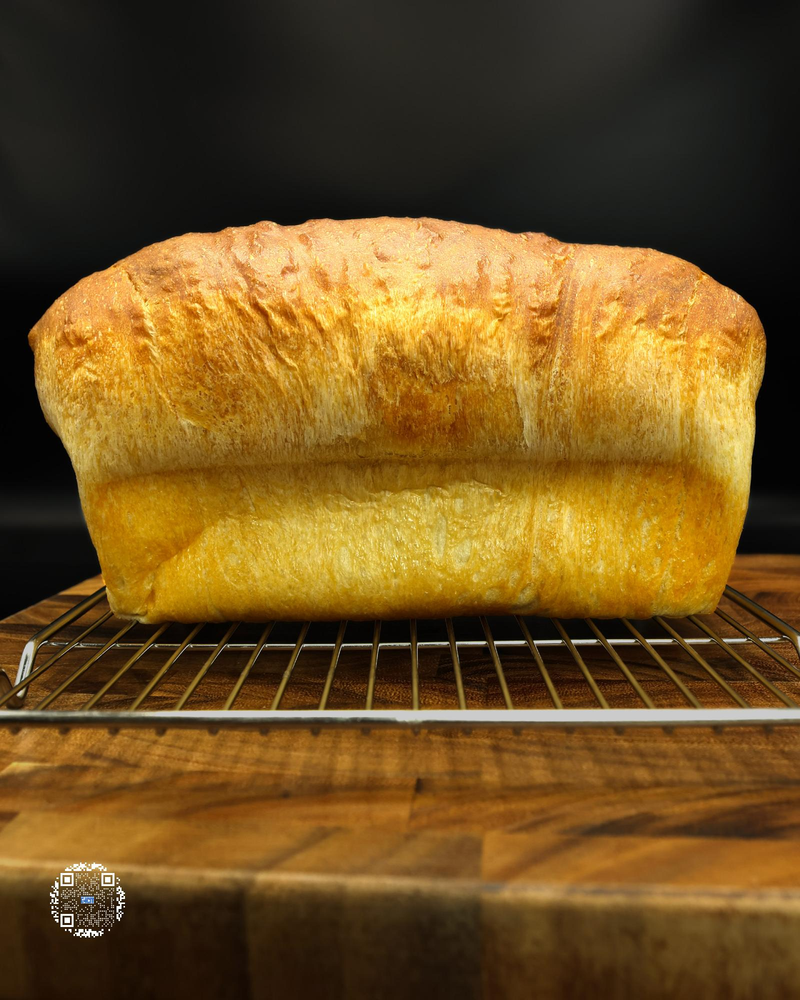

# PROTEIN BREAD

**Serves:** 23 | **Prep:** 3 HRS | **Cook:** 25 MINS

## Macros

| Calories | Fat | Carbs | Net Carbs | Protein |
|----------|-----|-------|-----------|---------|
| 367 | null | null | null | null |

## Ingredients

- 220g King Arthur® bread flour
- 110g vital wheat gluten
- 15g dough conditioner
- 270g 2% milk
- 15g white vinegar
- 7g salt
- 10g instant yeast
- 30g water (yeast)

## Directions

1. Add bread flour, vital wheat gluten, and dough conditioner to a large bowl and whisk.
2. Pour milk into a measuring cup and microwave for 30-45 seconds or until it reaches 90°F. Add milk to the bowl and using a spoon, mix everything together until the milk has dissolved.
3. Add vinegar, rinse your hand under water, and use your wet hand to mix the dough until there are no more dry parts.
4. Once finished, top dough evenly with salt, and cover for 15 minutes.
5. While waiting, put yeast and water into a glass and mix using a spoon until yeast is covered in water.
6. Add yeast mixture onto the dough and using a wet hand, squeeze the dough repeatedly for 4-5 minutes or until the yeast mixture and salt is completely mixed into the dough. I like to squeeze one part of the dough through my fingers, then move to another part and repeat while occasionally flipping the dough.
7. Cover the dough for 30 minutes.
8. Using a wet hand, perform a stretch and fold by pulling one side of the dough as high as possible then folding it over itself.
9. Turn the bowl 90 degrees and repeat 3-4 more times until all dough has been stretched.
10. Flip the dough over, and form into a ball by sliding your hand underneath the dough and pulling it in a circular motion towards your body. When the ball is formed, the dough should have a fairly smooth surface and look like kneaded dough.
11. Cover the dough for 30 minutes, repeat steps 8-10, and cover for 30 more minutes.
12. Pick the dough up out of the bowl and let it hang to stretch it into a long, narrow piece of dough that is about 5-6" wide.
13. Lay the dough down with the bottom side facing up towards the ceiling.
14. Take the top of the dough and fold about a quarter of it onto itself. Using the tips of your fingers, press the edge of the dough into the crease.

