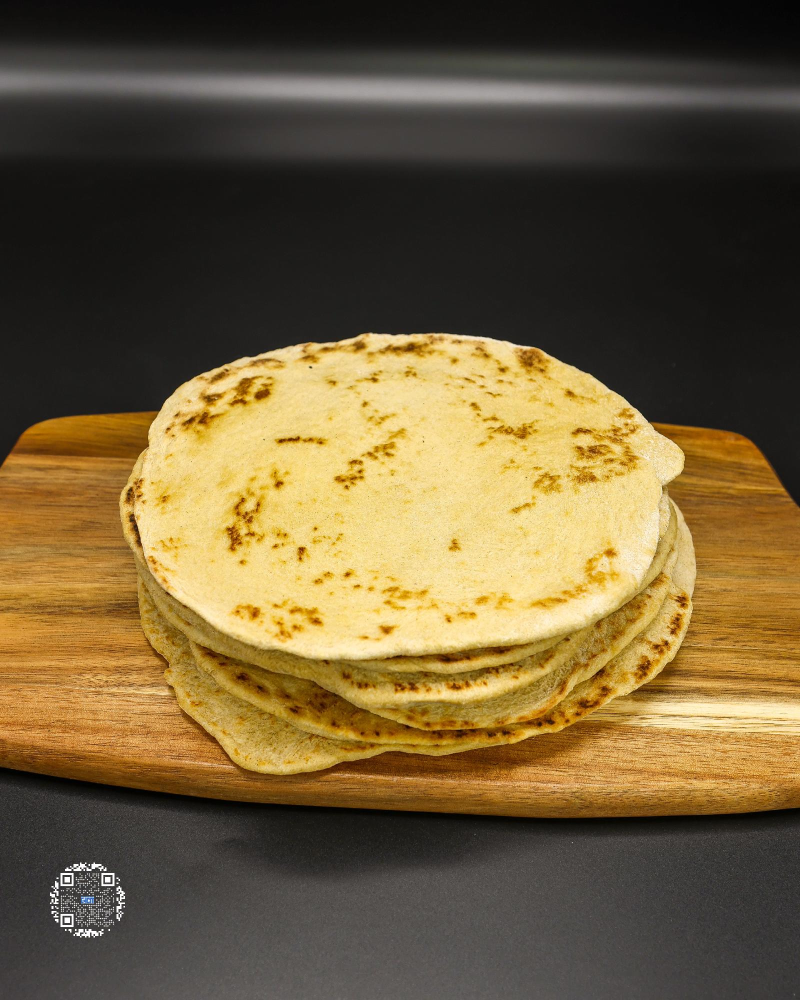

# PROTEIN PITA

**Serves:** 2 | **Prep:** 15 MINS | **Cook:** 3 MINS

## Macros

| Calories | Fat | Carbs | Net Carbs | Protein |
|----------|-----|-------|-----------|---------|
| 106 | 3 | 19 | 13 | 8 |

## Ingredients

### DRY

- 30g all-purpose flour
- 18g vital wheat gluten
- 12g oat fiber
- 1.5g salt
- 2g baking powder

### WET

- 4g extra virgin olive oil
- 54g water

## Directions

1. Add Dry Ingredients to a bowl and whisk together.
2. Add olive oil to the Dry Ingredients and mix the oil into the ingredients so it is spread evenly.
3. Add water to the bowl and using a spoon, incorporate the mixture as much as possible.
4. Flip the dough out onto the counter and continue incorporating all the ingredients into the dough making sure there are no dry parts.
5. Squeeze dough ball between fingers, switch hands, and repeat for one minute. This will make sure everything is evenly dispersed throughout.
6. Split dough into two balls.
7. Lightly dust counter and rolling pin with flour, put one dough ball down, and add a light dusting of flour to the top of the dough.
8. Roll dough 2-3 times, turn 90°, roll 2-3 times, and repeat until the dough is about 6" wide and 1/8-1/4" thick. If dough starts to stick to the rolling pin, lightly dust the surface where the dough is sticking, spread around, and continue rolling.
9. Lightly spray a cast iron pan on medium-high heat, place one rolled out piece of dough onto the pan, and cook each side for 1-2 minutes or until browning occurs.
10. Put cooked pita under a damp towel to prevent drying out and repeat for the other pita.

## Tips

Letting the dough balls relax for 15 minutes after step 6 will make the dough easier to roll out. Cook 3-4 batches at a time so that you have enough for multiple days. If you won't eat all of the pitas within 3-4 days, I would freeze them and reheat them in the microwave or on a skillet.

