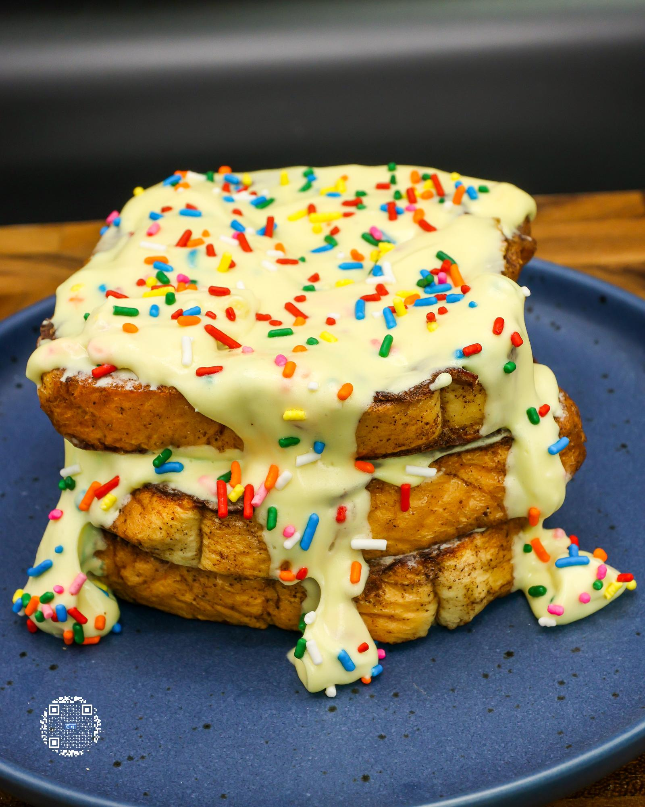

# BIRTHDAY CAKE FRENCH TOAST

**Serves:** 1 | **Prep:** 20 MINS | **Cook:** 20 MINS

## Macros

| Calories | Fat | Carbs | Net Carbs | Protein |
|----------|-----|-------|-----------|---------|
| 506 | 8 | 96 | 70 | 37 |

## Ingredients

### FRENCH TOAST

- 3 slices Texas Toast (90 cal/slice)
- 6 egg whites (204g)
- 12g granulated erythritol
- 4.2g vanilla extract
- 5g ground cinnamon
- 2g salt

### FROSTING

- 21g unsalted butter
- 224g fat-free cream cheese
- 1.5g salt
- 4g cake batter extract
- 4.2g vanilla extract
- 60g confectioners erythritol
- 12g sprinkles

### FRENCH TOAST BUILD

- 3 slices French Toast
- 75g Frosting

## Directions

1. In a large bowl, add egg whites, sweetener, vanilla, cinnamon, and salt. Mix with whisk or hand blender for 60 seconds or until all ingredients are incorporated.
2. Dip slices of bread one at a time in the wet mixture, soak for one minute, flip, and let bread soak on the other side for an additional minute.
3. Lightly spray a preheated pan on medium heat with oil. Place a soaked slice of bread into the pan.
4. Repeat for the additional slices. Lightly spray top of french toast with oil spray and let them cook for 20 minutes, flipping halfway through.
5. While the french toast cooks, add butter, cream cheese, and salt into a large bowl. Blend for 5 minutes using a hand mixer.
6. Add cake batter extract and vanilla extract to the bowl and continue mixing for an additional 3 minutes.
7. In 3 parts, add confectioners erythritol to the bowl. Add more sweetener once each part is fully mixed in. This blend should take 5 minutes in total.
8. When finished mixing, add sprinkles and fold into frosting.
9. Put frosting into a plastic container and refrigerate.
10. Add one slice of french toast to your plate, top with 1/3 of the frosting, spread evenly, and repeat for the other two slices of French toast.
11. Let's eat.

## Tips

If there is extra egg mixture leftover, pour it on top of the bread before spraying the french toast with oil. Pause halfway through to scrape down the sides of the bowl, then continue mixing. You can use the frosting right away, but it tastes best after sitting in the fridge for 1-2 hours.

