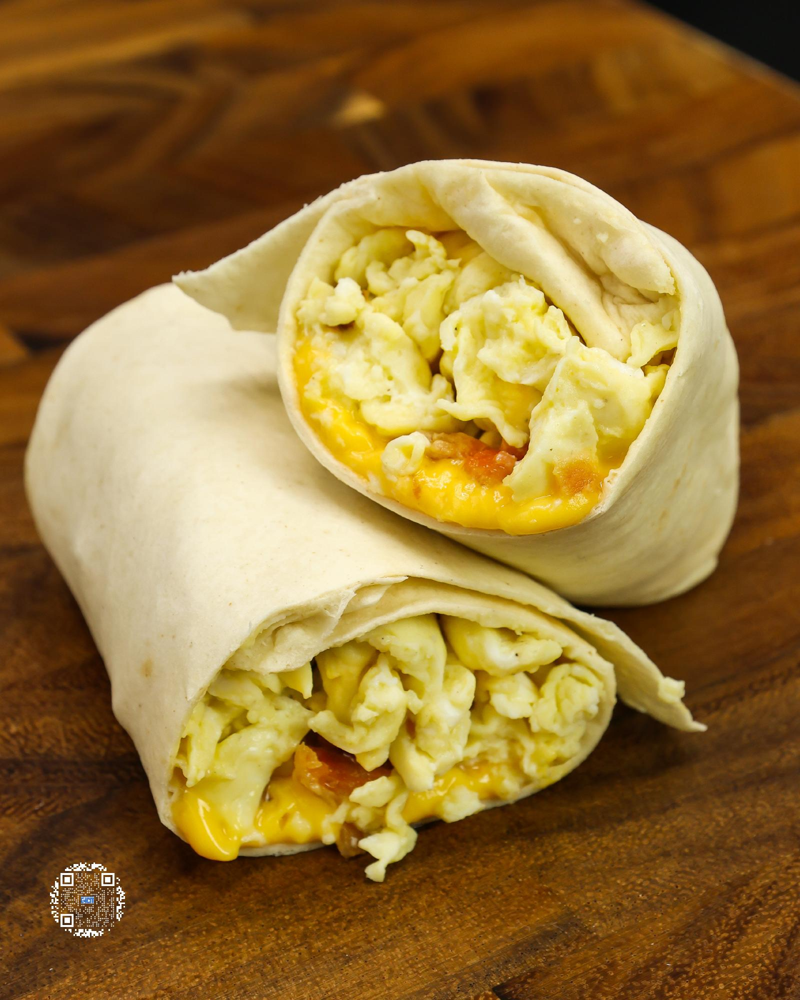

# 200 CALORIE BREAKFAST BURRITO

**Serves:** 1 | **Prep:** 10 MINS | **Cook:** 20 MINS

## Macros

| Calories | Fat | Carbs | Net Carbs | Protein |
|----------|-----|-------|-----------|---------|
| 466 | 20 | 37 | 13 | 47 |

## Ingredients

- 2 La Banderita® Carb Counter taco tortillas
- 2 slices original Velveeta® cheese
- 23g center cut bacon (cooked)
- 5 egg whites
- 1 egg
- Salt, to taste
- Black pepper, to taste
- 1g bacon fat

## Directions

1. Place each tortilla on a separate piece of parchment paper. Tear the cheese slices in half and lay them across the middle of the tortilla leaving about 1 inch of space on each end.
2. Cook the bacon on griddle or in a pan on high. Once bottom of bacon is cooked to your preference, flip, cook the other side, and put on a paper towel lined plate to cool. Reserve some bacon fat from the pan.
3. Add egg whites, egg, salt, and black pepper to a large bowl and whisk together.
4. Add bacon fat to a preheated pan on medium heat and spread evenly.
5. Add egg mixture to the pan and keep moving the eggs around with a spatula until fully cooked, then place them on a plate or into a container.
6. Chop bacon and evenly spread onto the tortilla followed by the scrambled eggs.
7. Bring the ends of the tortilla in while slowly flipping one side of the tortilla over the filling.
8. Use the end of the tortilla to bring filling towards the middle, seal the filling in, and finish by rolling until completely sealed.
9. Wrap the burrito in parchment paper and repeat the same process for the other burrito.
10. Put burritos in the microwave for about 30 seconds, let cool for a minute, and enjoy.

## Tips

To save time throughout the week, cook a full package of bacon on a parchment-lined sheet pan at 425°F for 10-12 minutes or crisp to your liking. Once cooled, chop into bite-sized pieces and store in the fridge.

