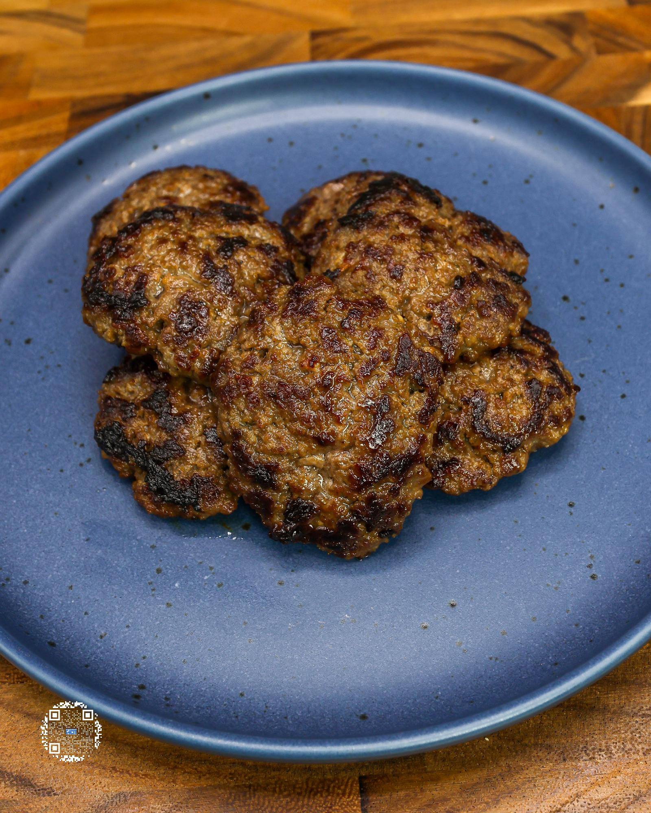

# BREAKFAST SAUSAGE PATTIES

**Serves:** 5.5 | **Prep:** 10 MINS | **Cook:** 10 MINS

## Macros

| Calories | Fat | Carbs | Net Carbs | Protein |
|----------|-----|-------|-----------|---------|
| 144 | 7 | 3 | N/A | 18 |

## Ingredients

- 448g 93% lean ground beef
- 30g sugar-free maple syrup
- 5g extra virgin olive oil
- 1g ground sage
- 1g ground thyme
- 6g salt
- 8g brown sugar erythritol
- 1g black pepper
- 0.8g ground nutmeg
- 1g cayenne pepper
- 1g paprika
- 12.5g powdered nonfat dairy milk

## Directions

1. Put all ingredients into a bowl, mix thoroughly, and form into 46.5g balls.
2. Flatten balls to about a ¼-½ inch thick patty and add to a preheated pan on medium heat. You should hear that sizzle as soon as it hits the pan.
3. Cook for 2-3 minutes per side, until lightly brown.

## Tips

Have sage or thyme, but need to grind it down? Use a food processor or coffee grinder to do so. It becomes ground sage or thyme in seconds. Spray hands with oil for an easier time forming patties. Let meat mixture sit in the fridge up to 24 hours to amplify the flavor profile.

