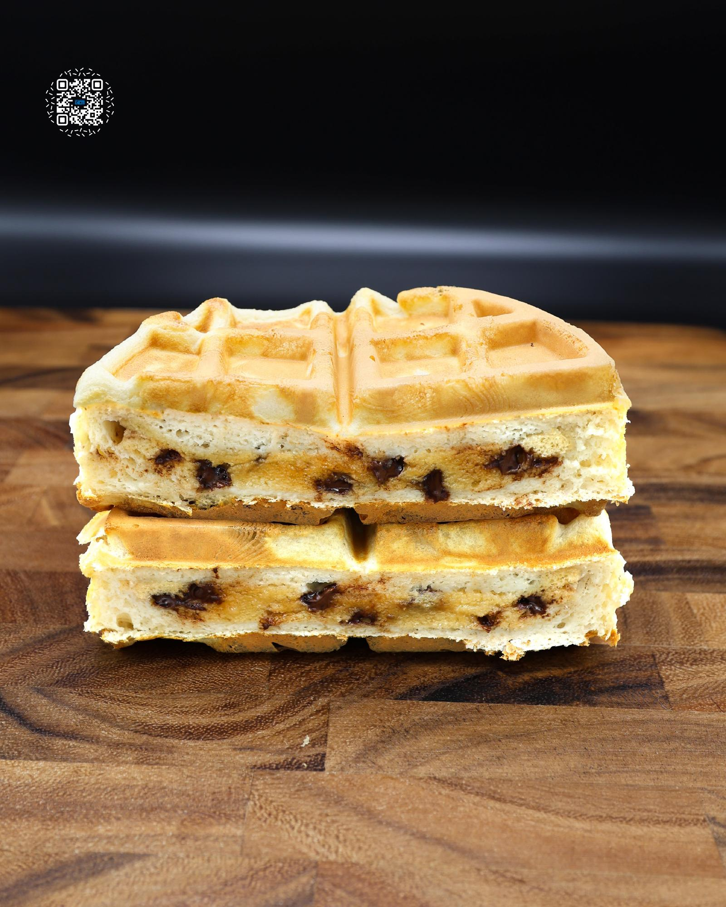

# COOKIE DOUGH STUFFED WAFFLE

**Serves:** 1 | **Prep:** 15 MINS | **Cook:** 5 MINS

## Macros

| Calories | Fat | Carbs | Net Carbs | Protein |
|----------|-----|-------|-----------|---------|
| 550 | 17 | 67 | 51 | 43 |

## Ingredients

- 50g PEScience Waffle & Pancake Mix
- 16.2g Gorilla Mode Vanilla Ice Cream protein
- OR
- 16g PEScience Gourmet Vanilla protein
- 100g water
- 100g chocolate chip cookie dough V2

## Directions

1. Make CHOCOLATE CHIP COOKIE DOUGH V2.
2. Add waffle mix and protein powder to a large bowl and whisk.
3. Add water and whisk until a batter forms. Wait 2-3 minutes to let it thicken.
4. Into a preheated Stuffler® waffle maker, add a layer of waffle batter so the bottom grids and waffle divider are thinly, but completely covered.
5. Shape the cookie dough into a flat circle and place it in the center of the waffle maker. The cookie dough should look like a cookie and be about a quarter inch from the edges of the waffle maker.
6. Cover the cookie dough with the remaining batter until it reaches the top of the square projections on the waffle tongs.
7. Close the waffle maker, flip, and cook for 5-6 minutes.

## Notes

You can use any premade waffle mix that you would like. However, you may need to adjust the amount of water used and macros as needed. One batch of cookie dough makes enough for 3 waffles.

