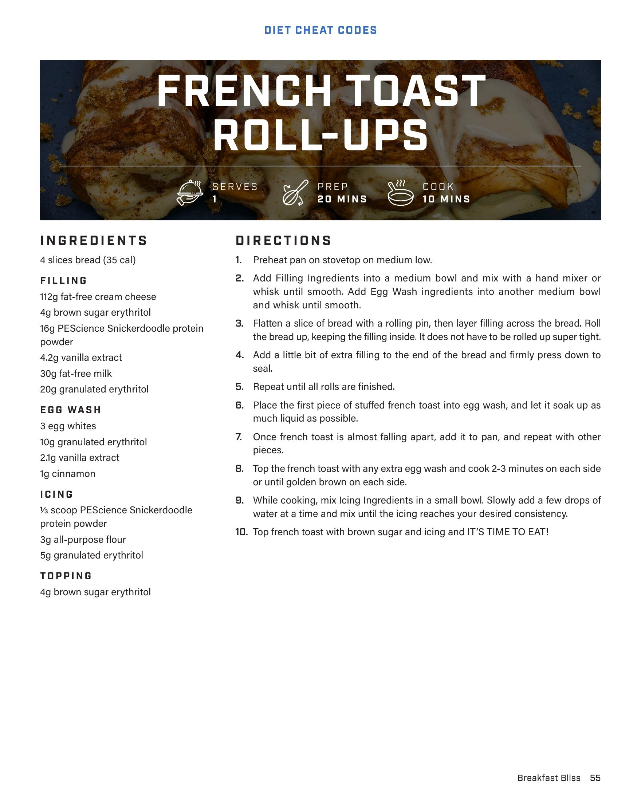

# FRENCH TOAST ROLL-UPS

**Serves:** 1 | **Prep:** 20 MINS | **Cook:** 10 MINS

## Macros

| Calories | Fat | Carbs | Net Carbs | Protein |
|----------|-----|-------|-----------|---------|
| 0 |  |  | undefined |  |

## Ingredients

- 4 slices bread (35 cal)

### FILLING

- 112g fat-free cream cheese
- 4g brown sugar erythritol
- 16g PEScience Snickerdoodle protein powder
- 4.2g vanilla extract
- 30g fat-free milk
- 20g granulated erythritol

### EGG WASH

- 3 egg whites
- 10g granulated erythritol
- 2.1g vanilla extract
- 1g cinnamon

### ICING

- 1/3 scoop PEScience Snickerdoodle protein powder
- 3g all-purpose flour
- 5g granulated erythritol

### TOPPING

- 4g brown sugar erythritol

## Directions

1. Preheat pan on stovetop on medium low.
2. Add Filling Ingredients into a medium bowl and mix with a hand mixer or whisk until smooth. Add Egg Wash ingredients into another medium bowl and whisk until smooth.
3. Flatten a slice of bread with a rolling pin, then layer filling across the bread. Roll the bread up, keeping the filling inside. It does not have to be rolled up super tight.
4. Add a little bit of extra filling to the end of the bread and firmly press down to seal.
5. Repeat until all rolls are finished.
6. Place the first piece of stuffed french toast into egg wash, and let it soak up as much liquid as possible.
7. Once french toast is almost falling apart, add it to pan, and repeat with other pieces.
8. Top the french toast with any extra egg wash and cook 2-3 minutes on each side or until golden brown on each side.
9. While cooking, mix Icing Ingredients in a small bowl. Slowly add a few drops of water at a time and mix until the icing reaches your desired consistency.
10. Top french toast with brown sugar and icing and IT'S TIME TO EAT!

## Source Pages

56
