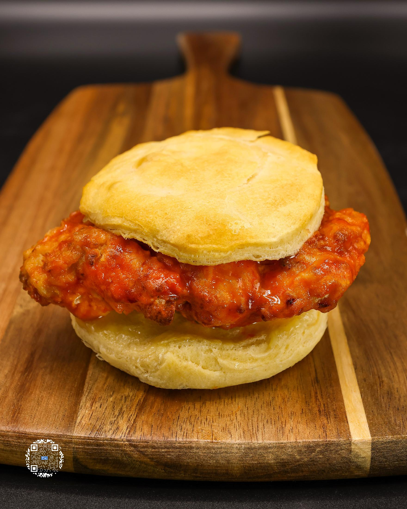
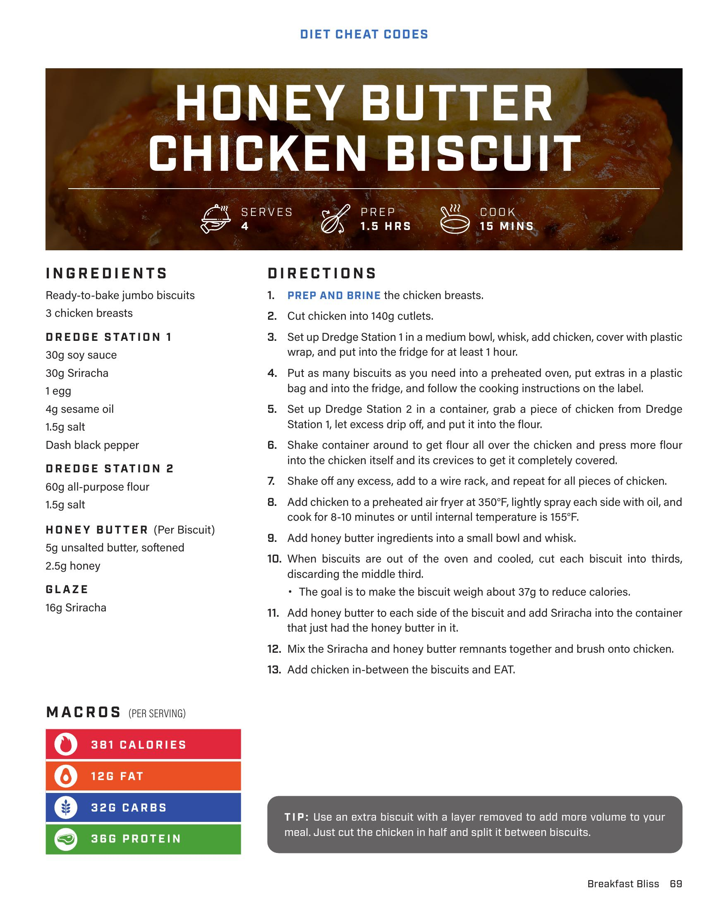
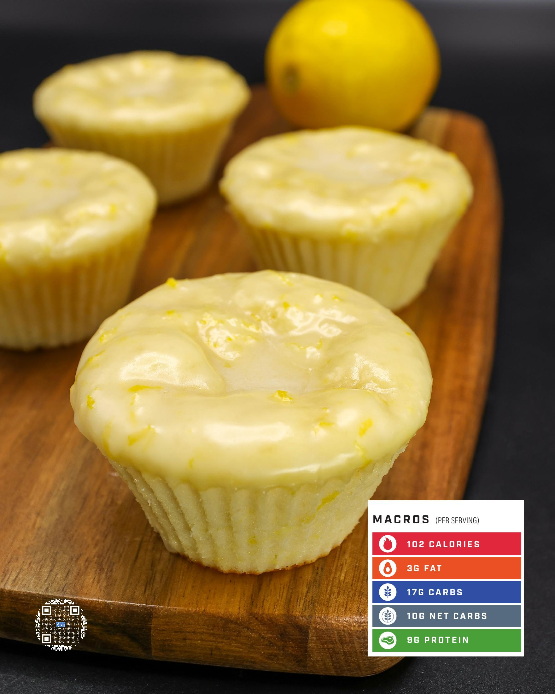

# HONEY BUTTER CHICKEN BISCUIT

**Serves:** 4 | **Prep:** 1.5 HRS | **Cook:** 15 MINS

## Macros

| Calories | Fat | Carbs | Net Carbs | Protein |
|----------|-----|-------|-----------|---------|
| 381 | 12 | 32 | undefined | 38 |

## Ingredients

- Ready-to-bake jumbo biscuits
- 3 chicken breasts

### DREDGE STATION 1

- 30g soy sauce
- 30g Sriracha
- 1 egg
- 4g sesame oil
- 1.5g salt
- Dash black pepper

### DREDGE STATION 2

- 60g all-purpose flour
- 1.5g salt

### HONEY BUTTER (Per Biscuit)

- 5g unsalted butter, softened
- 2.5g honey

### GLAZE

- 16g Sriracha

## Directions

1. PREP AND BRINE the chicken breasts.
2. Cut chicken into 140g cutlets.
3. Set up Dredge Station 1 in a medium bowl, whisk, add chicken, cover with plastic wrap, and put into the fridge for at least 1 hour.
4. Put as many biscuits as you need into a preheated oven, put extras in a plastic bag and into the fridge, and follow the cooking instructions on the label.
5. Set up Dredge Station 2 in a container, grab a piece of chicken from Dredge Station 1, let excess drip off, and put it into the flour.
6. Shake container around to get flour all over the chicken and press more flour into the chicken itself and its crevices to get it completely covered.
7. Shake off any excess, add to a wire rack, and repeat for all pieces of chicken.
8. Add chicken to a preheated air fryer at 350°F, lightly spray each side with oil, and cook for 8-10 minutes or until internal temperature is 155°F.
9. Add honey butter ingredients into a small bowl and whisk.
10. When biscuits are out of the oven and cooled, cut each biscuit into thirds, discarding the middle third. The goal is to make the biscuit weight about 37g to reduce calories.
11. Add honey butter to each side of the biscuit and add Sriracha into the container that just had the honey butter in it.
12. Mix the Sriracha and honey butter remnants together and brush onto chicken.
13. Add chicken in-between the biscuits and EAT.

## Tips

Use an extra biscuit with a layer removed to add more volume to your meal. Just cut the chicken in half and split it between biscuits.

## Additional Recipe Pages

## Source Pages

69, 70, 71
