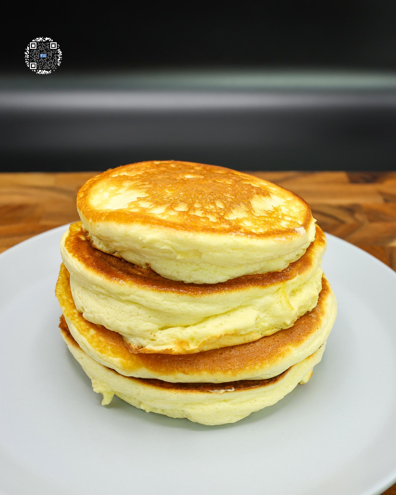

# JAPANESE PANCAKES

**Serves:** 1 | **Prep:** 10 MINS | **Cook:** 10 MINS

## Macros

| Calories | Fat | Carbs | Net Carbs | Protein |
|----------|-----|-------|-----------|---------|
| 350 | 11 | 45 | 20 | 39 |

## Ingredients

- 2 eggs
- 40g fat-free milk
- 2.1g vanilla extract
- Pinch salt (~.4 grams)
- 19g all-purpose flour
- 30g PEScience Gourmet Vanilla protein powder
- 1g baking powder
- 25g granulated erythritol
- Dash cream of tartar

## Directions

1. In a large bowl, separate egg whites from the yolks and place yolks in a separate bowl.
2. Add milk, vanilla extract, and salt to the yolks.
3. Into the egg yolk mixture, sift flour, protein powder, and baking powder. You can do this by using a strainer and gently shaking the flour-laden strainer until it is empty. Whisk to combine.
4. Start blending the egg whites using a hand mixer on low speed. When it begins to foam, add ¼ of the erythritol at a time, and add more once the sweetener is completely mixed in.
5. Once the erythritol has been completely mixed in, the egg whites should be very close to forming stiff peaks and it is time to add the cream of tartar and mix for an additional 30 seconds or until stiff peaks have formed.
6. Take a quarter of the meringue and vigorously mix it into the egg yolk mixture.
7. Take the remaining meringue, pour it on top, and gently fold it in until the mixture has JUST BARELY come together. The goal here is to not overwork the batter because that will cause the pancake to be noticeably less fluffy.
8. Transfer finished batter to a plastic gallon bag and when ready to cook, cut the corner of the bag off.
9. Lightly spray a preheated pan on low with oil and pipe batter into the pan where the middle of the pancake will be. Let gravity do the work while slowing raising the bag up as the pancake gets taller and spreads out.
10. Repeat for the other pancakes, add a few drops of water into the pan, and cover.
11. Let pancakes cook for 3-5 minutes, lightly spray the top of each pancake, flip, and cover.
12. Let the pancakes cook for an additional 2-3 minutes, plate it, pour some sugar-free syrup on top, and enjoy!

