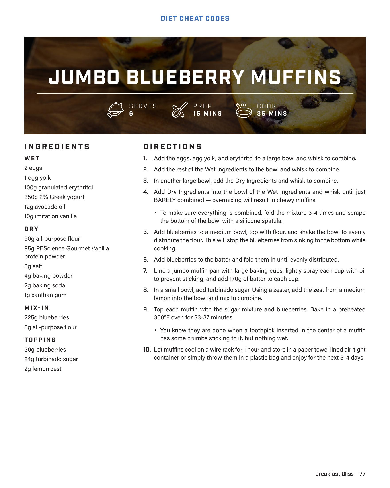

# JUMBO BLUEBERRY MUFFINS

**Serves:** 6 | **Prep:** 15 MINS | **Cook:** 35 MINS

## Macros

| Calories | Fat | Carbs | Net Carbs | Protein |
|----------|-----|-------|-----------|---------|
| 0 | 0 | 0 | undefined | 0 |

## Ingredients

### WET

- 2 eggs
- 1 egg yolk
- 100g granulated erythritol
- 350g 2% Greek yogurt
- 12g avocado oil
- 10g imitation vanilla

### DRY

- 90g all-purpose flour
- 95g PEScience Gourmet Vanilla protein powder
- 3g salt
- 4g baking powder
- 2g baking soda
- 1g xanthan gum

### MIX-IN

- 225g blueberries
- 3g all-purpose flour

### TOPPING

- 30g blueberries
- 24g turbinado sugar
- 2g lemon zest

## Directions

1. Add the eggs, egg yolk, and erythritol to a large bowl and whisk to combine.
2. Add the rest of the Wet Ingredients to the bowl and whisk to combine.
3. In another large bowl, add the Dry Ingredients and whisk to combine.
4. Add Dry Ingredients into the bowl of the Wet Ingredients and whisk until just BARELY combined — overmixing will result in chewy muffins.
5. To make sure everything is combined, fold the mixture 3-4 times and scrape the bottom of the bowl with a silicone spatula.
6. Add blueberries to a medium bowl, top with flour, and shake the bowl to evenly distribute the flour. This will stop the blueberries from sinking to the bottom while cooking.
7. Add blueberries to the batter and fold them in until evenly distributed.
8. Line a jumbo muffin pan with large baking cups, lightly spray each cup with oil to prevent sticking, and add 170g of batter to each cup.
9. In a small bowl, add turbinado sugar. Using a zester, add the zest from a medium lemon into the bowl and mix to combine.
10. Top each muffin with the sugar mixture and blueberries. Bake in a preheated 300°F oven for 33-37 minutes.
11. Let muffins cool on a wire rack for 1 hour and store in a paper towel lined air-tight container or simply throw them in a plastic bag and enjoy for the next 3-4 days.

## Tips

You know they are done when a toothpick inserted in the center of a muffin has some crumbs sticking to it, but nothing wet.

## Source Pages

78
