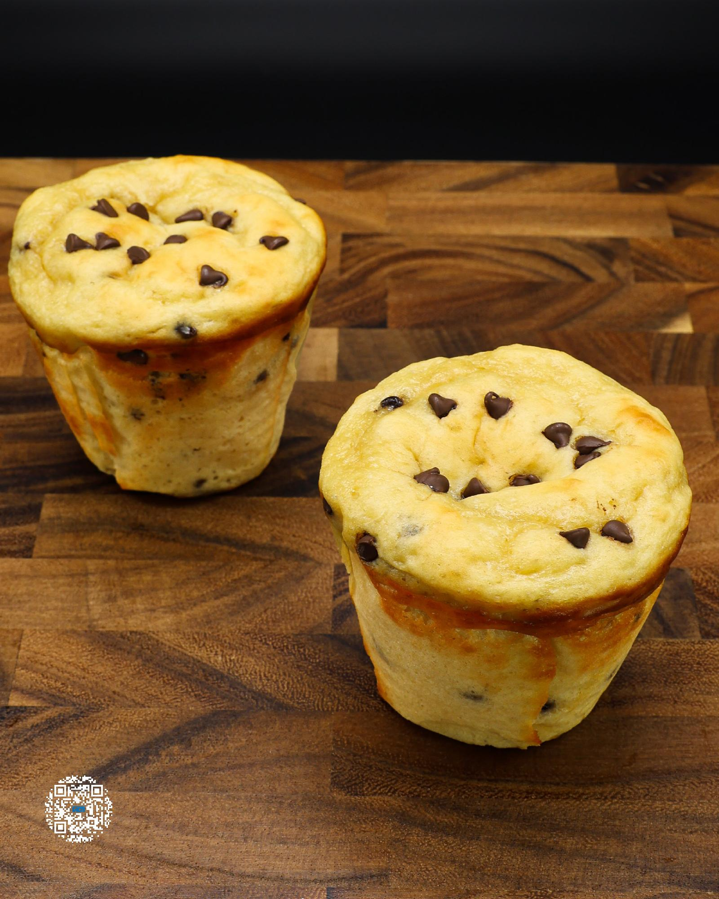

# JUMBO CHOCOLATE CHIP MUFFINS

**Serves:** 6 | **Prep:** 12 MINS | **Cook:** 30 MINS

## Macros

| Calories | Fat | Carbs | Net Carbs | Protein |
|----------|-----|-------|-----------|---------|
| 261 | 10 | 42 | 22 | 22 |

## Ingredients

### WET

- 2 eggs
- 1 egg yolk
- 60g granulated erythritol
- 60g brown sugar erythritol
- 350g 2% Greek yogurt
- 15g avocado oil
- 10g imitation vanilla

### DRY

- 90g all-purpose flour
- 95g PEScience Gourmet Vanilla protein powder
- 3g salt
- 4g baking powder
- 2g baking soda
- 1g xanthan gum

### MIX-IN/TOPPING

- 56g mini chocolate chips

## Directions

1. Add the eggs, egg yolk, granulated erythritol, and brown sugar erythritol to a large bowl and whisk to combine.
2. Add the rest of the Wet Ingredients to the bowl and whisk to combine.
3. In another large bowl, add the Dry Ingredients and whisk to combine.
4. Add Dry Ingredients into the bowl of the Wet Ingredients and whisk until just BARELY combined 
overmixing will result in chewy muffins. To make sure everything is combined, fold the mixture 3-4 times and scrape the bottom of the bowl with a silicone spatula.
5. Add 45 grams of chocolate chips to the batter and fold them in until evenly distributed.
6. Line a jumbo muffin pan with large baking cups, lightly spray each cup with oil to prevent sticking, and add 140g of batter to each cup.
7. Add remaining chocolate chips to a small bowl, top each muffin with chocolate chips, and bake in a preheated 300°F oven for 28-32 minutes. You know the muffins are done when a toothpick inserted in the center of a muffin has some crumbs sticking to it, but nothing wet.
8. Let muffins cool on a wire rack for 1 hour and store in a paper towel lined air-tight container or simply throw them in a plastic bag and enjoy for the next 3-4 days.

## Tips

For the ultimate eating experience, pop the muffin in the microwave for 10-15 seconds before indulging. This will make the muffin soft, ultra moist, and melt the chocolate chips to perfection.

