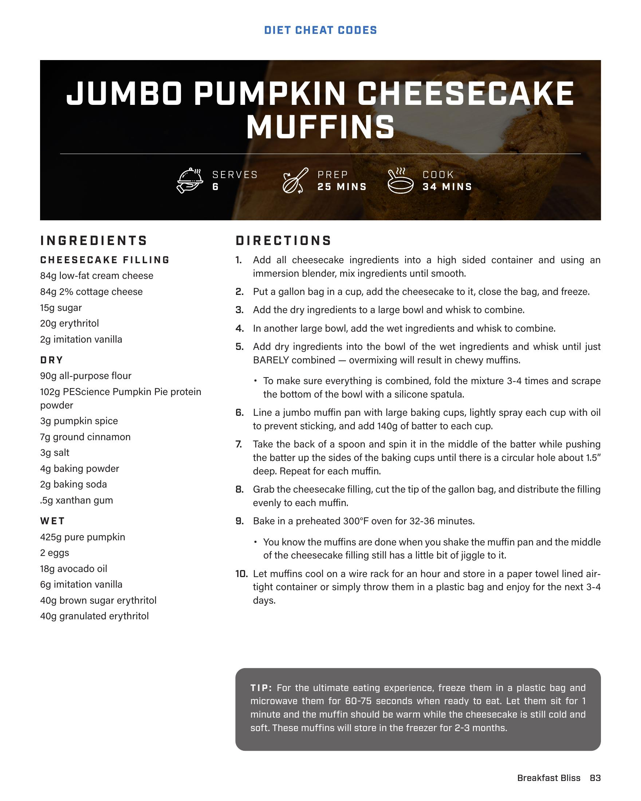

# JUMBO PUMPKIN CHEESECAKE MUFFINS

**Serves:** 6 | **Prep:** 25 MINS | **Cook:** 34 MINS

## Macros

| Calories | Fat | Carbs | Net Carbs | Protein |
|----------|-----|-------|-----------|---------|
| 0 | 0 | 0 | undefined | 0 |

## Ingredients

### CHEESECAKE FILLING

- 84g low-fat cream cheese
- 84g 2% cottage cheese
- 15g sugar
- 20g erythritol
- 2g imitation vanilla

### DRY

- 90g all-purpose flour
- 102g PEScience Pumpkin Pie protein powder
- 3g pumpkin spice
- 7g ground cinnamon
- 3g salt
- 4g baking powder
- 2g baking soda
- .5g xanthan gum

### WET

- 425g pure pumpkin
- 2 eggs
- 18g avocado oil
- 6g imitation vanilla
- 40g brown sugar erythritol
- 40g granulated erythritol

## Directions

1. Add all cheesecake ingredients into a high sided container and using an immersion blender, mix ingredients until smooth.
2. Put a gallon bag in a cup, add the cheesecake to it, close the bag, and freeze.
3. Add the dry ingredients to a large bowl and whisk to combine.
4. In another large bowl, add the wet ingredients and whisk to combine.
5. Add dry ingredients into the bowl of the wet ingredients and whisk until just BARELY combined — overmixing will result in chewy muffins.
6. To make sure everything is combined, fold the mixture 3-4 times and scrape the bottom of the bowl with a silicone spatula.
7. Line a jumbo muffin pan with large baking cups, lightly spray each cup with oil to prevent sticking, and add 140g of batter to each cup.
8. Take the back of a spoon and spin it in the middle of the batter while pushing the batter up the sides of the baking cups until there is a circular hole about 1.5" deep. Repeat for each muffin.
9. Grab the cheesecake filling, cut the tip of the gallon bag, and distribute the filling evenly to each muffin.
10. Bake in a preheated 300°F oven for 32-36 minutes.
11. You know the muffins are done when you shake the muffin pan and the middle of the cheesecake filling still has a little bit of jiggle to it.
12. Let muffins cool on a wire rack for an hour and store in a paper towel lined airtight container or simply throw them in a plastic bag and enjoy for the next 3-4 days.

## Tips

For the ultimate eating experience, freeze them in a plastic bag and microwave them for 60-75 seconds when ready to eat. Let them sit for 1 minute and the muffin should be warm while the cheesecake is still cold and soft. These muffins will store in the freezer for 2-3 months.

## Source Pages

84
