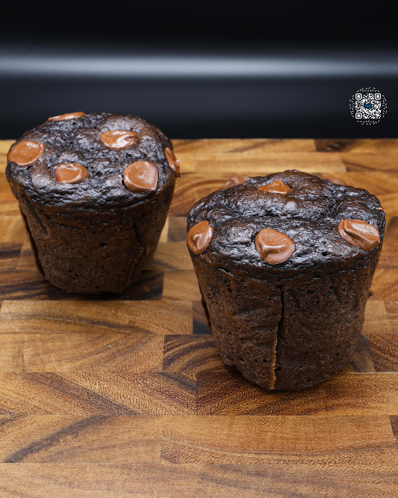
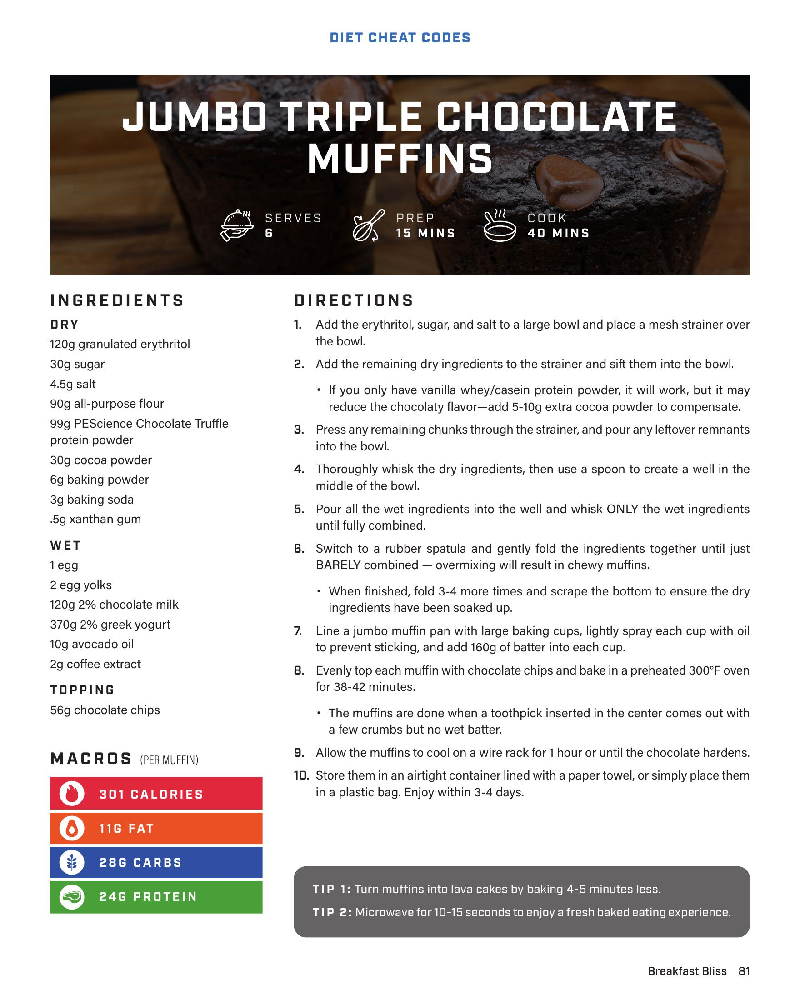
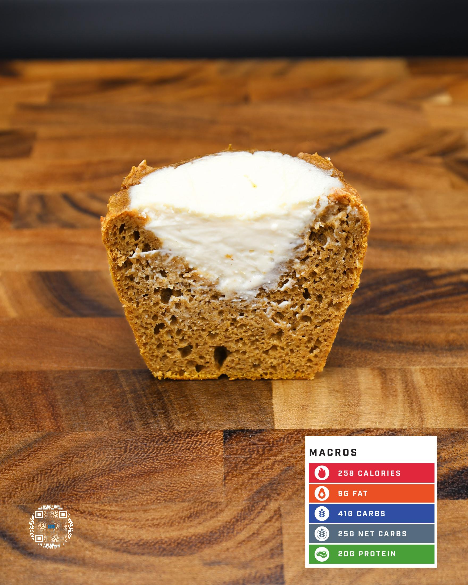

# JUMBO TRIPLE CHOCOLATE MUFFINS

**Serves:** 6 | **Prep:** 15 MINS | **Cook:** 40 MINS

## Macros

| Calories | Fat | Carbs | Net Carbs | Protein |
|----------|-----|-------|-----------|---------|
| 301 | 11 | 28 | undefined | 24 |

## Ingredients

### DRY

- 120g granulated erythritol
- 30g sugar
- 4.5g salt
- 90g all-purpose flour
- 99g PEScience Chocolate Truffle protein powder
- 30g cocoa powder
- 6g baking powder
- 2g baking soda
- 5g xanthan gum

### WET

- 1 egg
- 2 egg yolks
- 120g 2% chocolate milk
- 100g 2% greek yogurt
- 10g avocado oil
- 2g coffee extract

### TOPPING

- 56g chocolate chips

## Directions

1. Add the erythritol, sugar, and salt to a large bowl and place a mesh strainer over the bowl.
2. Add the remaining dry ingredients to the strainer and sift them into the bowl.
3. If you only have vanilla whey/casein protein powder, it will work, but it may reduce the chocolaty flavor-add 5-10g extra cocoa powder to compensate.
4. Press any remaining chunks through the strainer, and pour any leftover remnants into the bowl.
5. Thoroughly whisk the dry ingredients, then use a spoon to create a well in the middle of the bowl.
6. Pour all the wet ingredients into the well and whisk ONLY the wet ingredients until fully combined.
7. Switch to a rubber spatula and gently fold the ingredients together until just BARELY combined-overmixing will result in chewy muffins. WHEN finished, fold 3-4 more times and scrape the bottom to ensure the dry ingredients have been soaked up.
8. Line a jumbo muffin pan with large baking cups, lightly spray each cup with oil to prevent sticking, and add 160g of batter into each cup.
9. Evenly top each muffin with chocolate chips and bake in a preheated 300°F oven for 38-42 minutes. The muffins are done when a toothpick inserted in the center comes out with a few crumbs but no wet batter.
10. Allow the muffins to cool on a wire rack for 1 hour or until the chocolate hardens.
11. Store them in an airtight container lined with a paper towel, or simply place them in a plastic bag. Enjoy within 3-4 days.

## Tips

TIP 1: Turn muffins into lava cakes by baking 4-5 minutes less. TIP 2: Microwave for 10-15 seconds to enjoy a fresh baked eating experience.

## Additional Recipe Pages

## Source Pages

81, 82, 83
