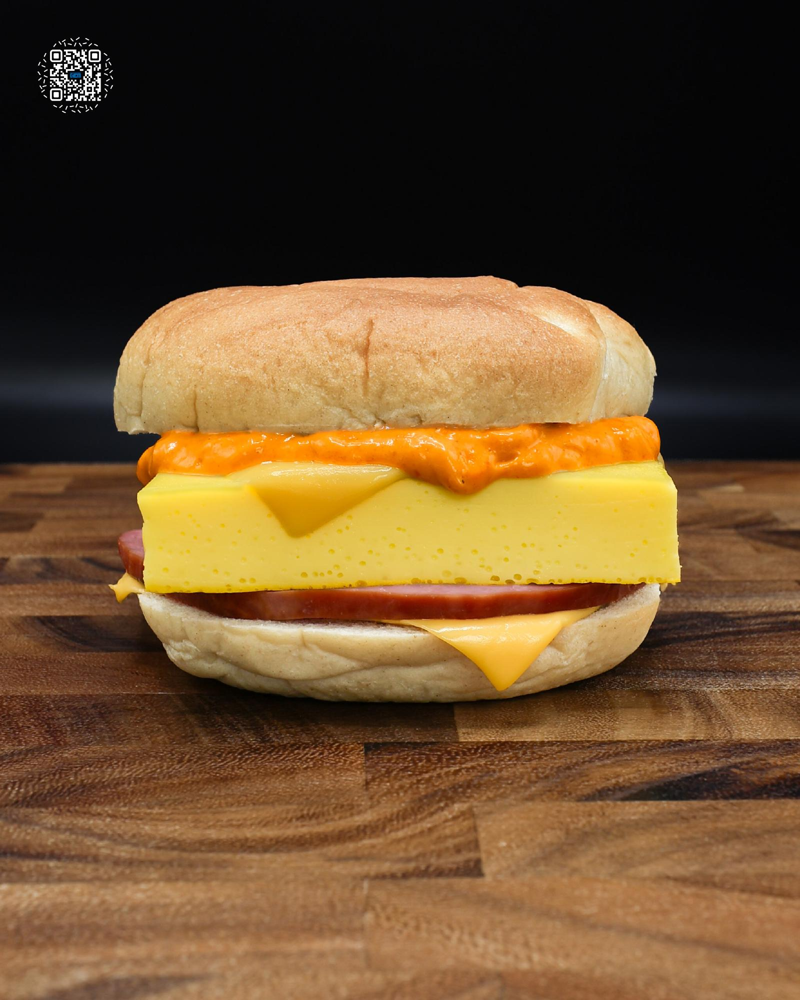

# KOREAN BREAKFAST SANDWICH

**Serves:** 4 | **Prep:** 15 MINS | **Cook:** 30 MINS

## Macros

| Calories | Fat | Carbs | Net Carbs | Protein |
|----------|-----|-------|-----------|---------|
| 438 | 18 | 47 | 17 | 50 |

## Ingredients

### FLUFFY EGGS

- 6 eggs
- 238g egg whites
- 210g 2% milk
- 4g salt
- 2g MSG

### SANDWICH

- Bagel (110 cal)
- 2 slices jalapeño Velveeta®
- 56g Canadian bacon (60 cal)
- ¼ fluffy eggs
- 20g chipotle aioli

## Directions

1. Preheat oven to 325°F. Add water to a medium saucepan and bring to a boil. Once boiling, reduce to a low simmer.
2. While water comes to a boil, add eggs to a large bowl and whisk with a fork. Add egg whites, milk, salt, and MSG, then whisk again until fully combined.
3. Lightly spray an 8" x 8" pan with oil. Strain the egg mixture into the pan using a fine-mesh strainer.
4. Tap the pan gently on the counter to release air bubbles. Cover tightly with aluminum foil.
5. Place the covered pan into a larger baking dish and transfer to the oven. Carefully pour the simmering water into the baking dish until it reaches halfway up the sides of the pan.
6. Bake for 25-30 minutes, or until the eggs are just set and reach 175°F internally.
7. While the eggs cook, prepare the CHIPOTLE AIOLI.
8. When the eggs are fully cooked, remove the dish from the oven and lift the pan out of the water bath and onto a towel. Let it rest for 5 minutes.
9. Uncover, place a cutting board over the pan, and flip to release the eggs. Cut into 4 equal squares.
10. Lightly oil a preheated pan over medium heat. Add Canadian bacon and sear for 1-2 minutes per side, or until browned.
11. While the bacon browns, toast the inside of the bagel.
12. On a sheet of parchment paper, layer the sandwich in this order: bottom bagel, cheese, bacon, egg, cheese, aioli, and top bagel.
13. Wrap sandwich in parchment, microwave for 30 seconds, and let rest (still wrapped) for 2 minutes to let the flavors mingle with each other.
14. Cut in half and enjoy.

