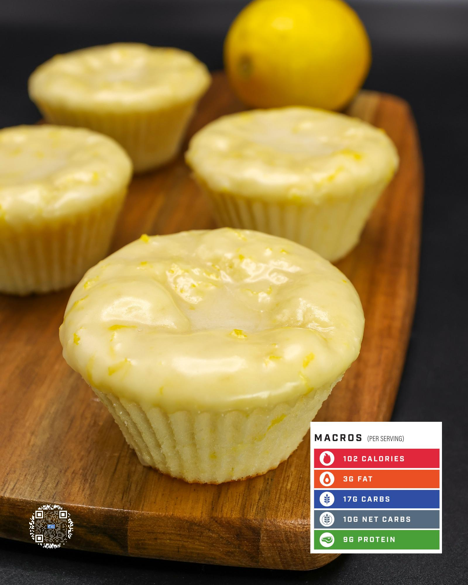

# LEMON GLAZE MUFFINS

**Serves:** 14 | **Prep:** 20 MINS | **Cook:** 17 MINS

## Macros

| Calories | Fat | Carbs | Net Carbs | Protein |
|----------|-----|-------|-----------|---------|
| 102 | 3 | 17 | 10 | 9 |

## Ingredients

### WET

- 300g 2% Greek yogurt
- 2 eggs
- 21g avocado oil
- 4.2g vanilla extract
- 80g lemon juice
- 4g lemon zest
- 2g lemon extract (optional)
- 100g granulated erythritol (add 20g if using lemon extract)

### DRY

- 90g all-purpose flour
- 93g PEScience Gourmet Vanilla protein powder
- 3g salt
- 4g baking powder
- 2g baking soda

### GLAZE

- 5g unsalted butter
- 110g powdered sugar
- 35g lemon juice
- Zest half lemon

## Directions

1. In a large bowl, add the Wet ingredients and whisk to combine.
2. In another large bowl, add the Dry Ingredients and whisk to combine.
3. Add Dry Ingredients into the bowl of the Wet Ingredients and whisk until just BARELY combined — overmixing will result in chewy muffins. To make sure everything is combined, fold the mixture 3-4 times and scrape the bottom of the bowl with a silicone spatula.
4. Line 14 muffin liners on a sheet pan, add 59g of muffin mix to each liner, and bake in a preheated 350°F oven for 16-18 minutes. You know they are done when a toothpick inserted in the center of a muffin has some crumbs sticking to it, but nothing wet.
5. While the muffins are baking, prepare the glaze by microwaving butter in a small bowl in ten second intervals until melted.
6. In a medium bowl, add the melted butter, powdered sugar, lemon juice, and lemon zest for the glaze. Whisk to combine.
7. Put parchment paper below a wire rack, add hot muffins to the rack, top each muffin with glaze, and spread the glaze around the top of the muffin using a spatula.
8. Store muffins in a paper towel lined air-tight container and enjoy for the next 3-4 days.

## Tips

If you want a moister muffin, pull them about one minute before they are done. They will be slightly underdone, but it'll make them so much more flavorful in my opinion.

