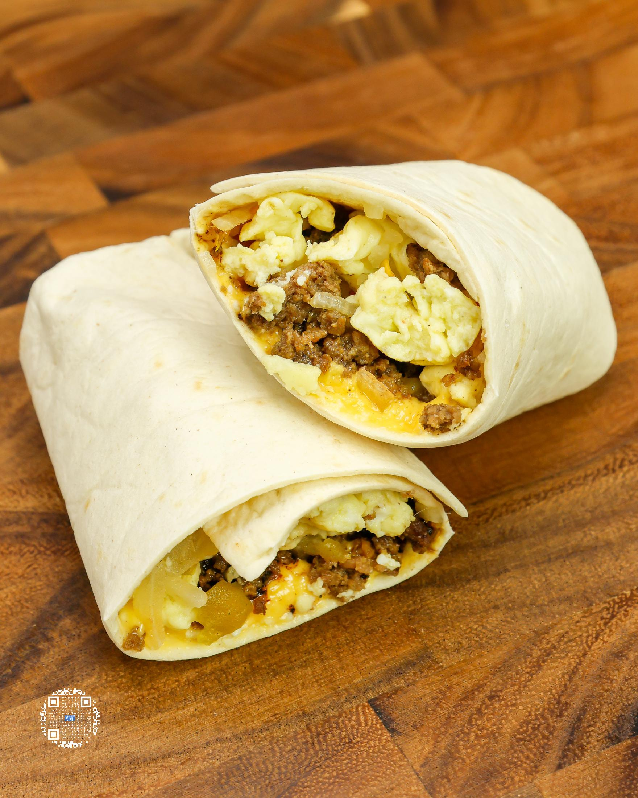
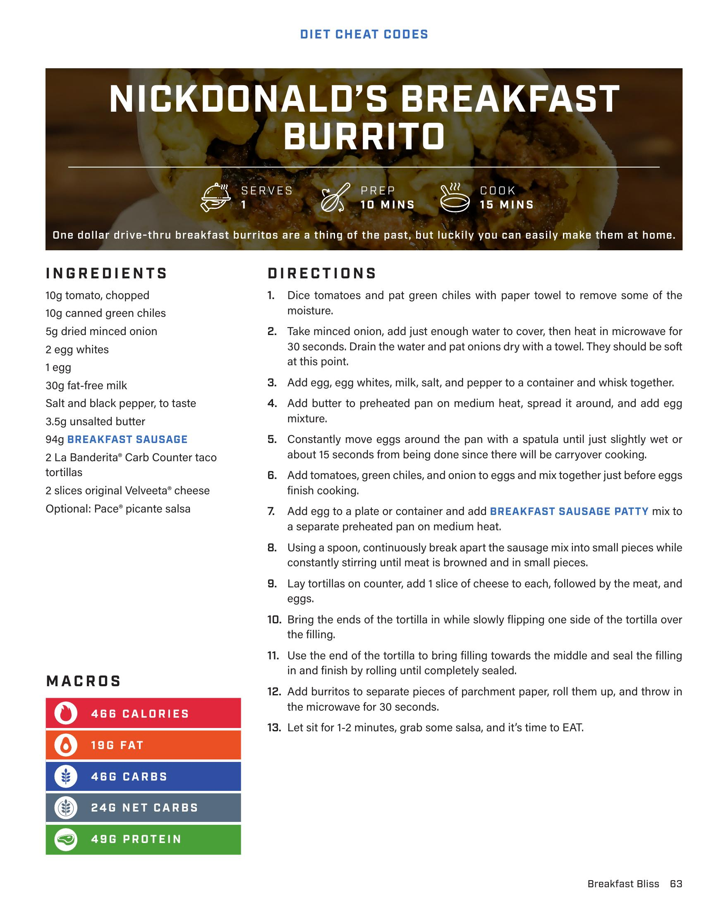

# NICKDONALD'S BREAKFAST BURRITO

**Serves:** 4 | **Prep:** 10 MINS | **Cook:** 15 MINS

## Macros

| Calories | Fat | Carbs | Net Carbs | Protein |
|----------|-----|-------|-----------|---------|
| 468 | 19 | 46 | 24 | 49 |

## Ingredients

- 10g tomato, chopped
- 10g canned green chiles
- 5g dried minced onion
- 2 egg whites
- 1 egg
- 30g fat-free milk
- Salt and black pepper, to taste
- 3.5g unsalted butter
- 94g BREAKFAST SAUSAGE
- 2 La Bandenta® Carb Counter taco tortillas
- 2 slices original Velveeta® cheese
- Optional: Pace® picante salsa

## Directions

1. Dice tomatoes and pat green chiles with paper towel to remove some of the moisture.
2. Take minced onion, add just enough water to cover, then heat in microwave for 30 seconds. Drain the water and pat onions dry with a towel. They should be soft at this point.
3. Add egg, egg whites, milk, salt, and pepper to a container and whisk together.
4. Add butter to preheated pan on medium heat, spread it around, and add egg mixture.
5. Constantly move eggs around the pan with a spatula until just slightly wet or about 15 seconds from being done since there will be carryover cooking.
6. Add tomatoes, green chiles, and onion to eggs and mix together just before eggs finish cooking.
7. Add egg to a plate or container and add BREAKFAST SAUSAGE PATTY mix to a separate preheated pan on medium heat.
8. Using a spoon, continuously break apart the sausage mix into small pieces while constantly stirring until meat is browned and in small pieces.
9. Lay tortillas on counter, add 1 slice of cheese to each, followed by the meat, and eggs.
10. Bring the ends of the tortilla in while slowly flipping one side of the tortilla over the filling.
11. Use the end of the tortilla to bring filling towards the middle and seal the filling in and finish by rolling until completely sealed.
12. Add burritos to separate pieces of parchment paper, roll them up, and throw in the microwave for 30 seconds.
13. Let sit for 1-2 minutes, grab some salsa, and it's time to EAT.

## Additional Recipe Pages

## Source Pages

63, 64
