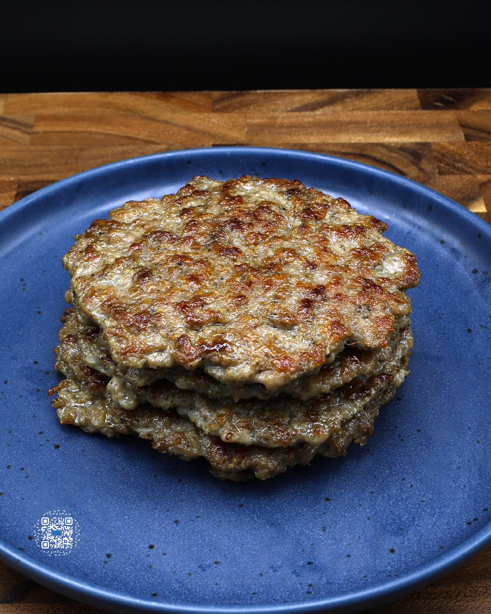
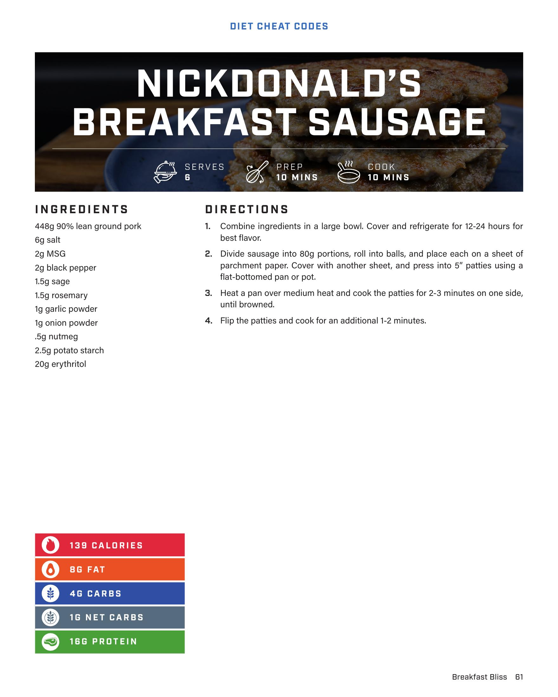

# NICKDONALD'S BREAKFAST SAUSAGE

**Serves:** 6 | **Prep:** 10 MINS | **Cook:** 10 MINS

## Macros

| Calories | Fat | Carbs | Net Carbs | Protein |
|----------|-----|-------|-----------|---------|
| 139 | 8 | 4 | 1 | 16 |

## Ingredients

- 448g 90% lean ground pork
- 6g salt
- 2g MSG
- 2g black pepper
- 1.5g sage
- 1.5g rosemary
- 1g garlic powder
- 1g onion powder
- .5g nutmeg
- 2.5g potato starch
- 20g erythritol

## Directions

1. Combine ingredients in a large bowl. Cover and refrigerate for 12-24 hours for best flavor.
2. Divide sausage into 80g portions, roll into balls, and place each on a sheet of parchment paper. Cover with another sheet, and press into 5" patties using a flat-bottomed pan or pot.
3. Heat a pan over medium heat and cook the patties for 2-3 minutes on one side, until browned.
4. Flip the patties and cook for an additional 1-2 minutes.

## Additional Recipe Pages

## Source Pages

61, 62
