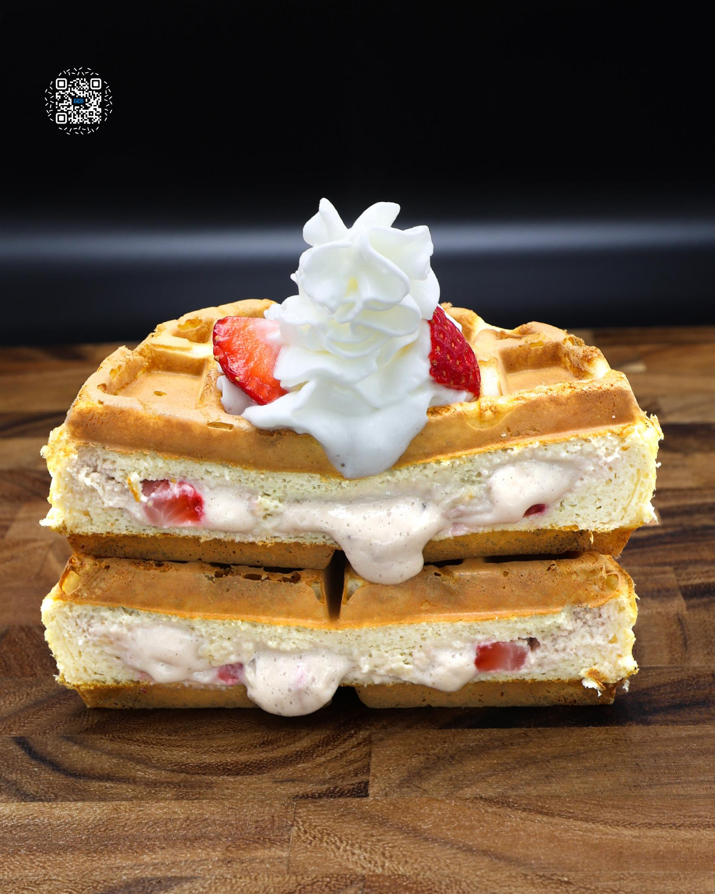
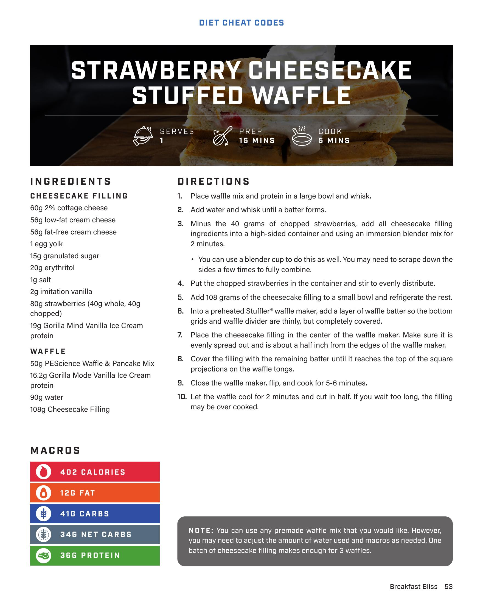
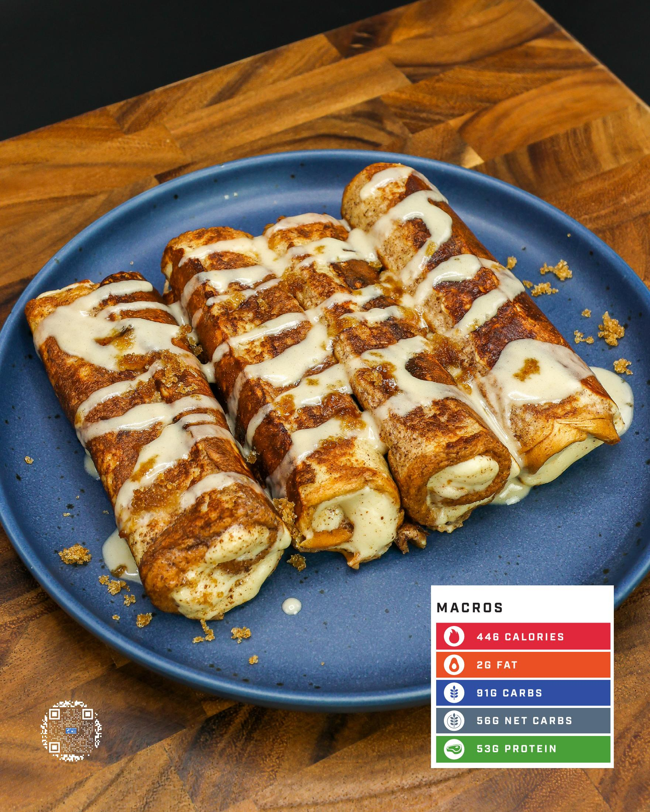

# STRAWBERRY CHEESECAKE STUFFED WAFFLE

**Serves:** 1 | **Prep:** 15 MINS | **Cook:** 5 MINS

## Macros

| Calories | Fat | Carbs | Net Carbs | Protein |
|----------|-----|-------|-----------|---------|
| 402 | 12 | 41 | 34 | 36 |

## Ingredients

### CHEESECAKE FILLING

- 60g 2% cottage cheese
- 56g low-fat cream cheese
- 56g fat-free cream cheese
- 1 egg yolk
- 15g granulated sugar
- 20g erythritol
- 1g salt
- 2g imitation vanilla
- 80g strawberries (40g whole, 40g chopped)
- 19g Gorilla Mind Vanilla Ice Cream protein

### WAFFLE

- 50g PEScience Waffle & Pancake Mix
- 16.2g Gorilla Mode Vanilla Ice Cream protein
- 90g water
- 108g Cheesecake Filling

## Directions

1. Place waffle mix and protein in a large bowl and whisk.
2. Add water and whisk until a batter forms.
3. Minus the 40 grams of chopped strawberries, add all cheesecake filling ingredients into a high-sided container and using an immersion blender mix for 2 minutes. You can use a blender cup to do this as well. You may need to scrape down the sides a few times to fully combine.
4. Put the chopped strawberries in the container and stir to evenly distribute.
5. Add 108 grams of the cheesecake filling to a small bowl and refrigerate the rest.
6. Into a preheated Stuffer® waffle maker, add a layer of waffle batter so the bottom grids and waffle divider are thinly, but completely covered.
7. Place the cheesecake filling in the center of the waffle maker. Make sure it is evenly spread out and is about a half inch from the edges of the waffle maker.
8. Cover the filling with the remaining batter until it reaches the top of the square projections on the waffle tongs.
9. Close the waffle maker, flip, and cook for 5-6 minutes.
10. Let the waffle cool for 2 minutes and cut in half. If you wait too long, the filling may be over cooked.

## Notes

You can use any premade waffle mix that you would like. However, you may need to adjust the amount of water used and macros as needed. One batch of cheesecake filling makes enough for 3 waffles.

## Additional Recipe Pages

## Source Pages

53, 54, 55
