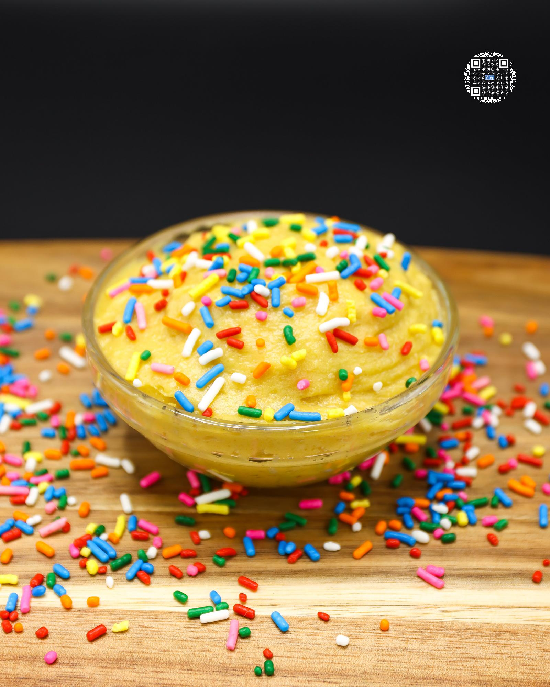

# BIRTHDAY CAKE COOKIE DOUGH

**Serves:** 6 | **Prep:** 10 MINS | **Cook:** N/A

## Macros

| Calories | Fat | Carbs | Net Carbs | Protein |
|----------|-----|-------|-----------|---------|
| 158 | 5 | 22 | 15 | 12 |

## Ingredients

### DRY

- 90g all-purpose flour
- 71g Gorilla Mind Vanilla Ice Cream protein powder OR 62g PEScience Gourmet Vanilla protein powder
- 1.5g salt

### WET

- 21g unsalted butter
- 2 eggs
- 5g cake batter extract
- 4.2g vanilla extract
- 42g granulated erythritol
- 14g brown sugar erythritol

### MIX-INS

- 8g sprinkles

## Directions

1. Add flour to large bowl and heat it up in the microwave in ten second intervals until it reaches 155F.
2. Add the rest of the Dry Ingredients to the bowl and whisk thoroughly.
3. In a separate large bowl, microwave butter in ten second intervals until melted.
4. Add the rest of the Wet Ingredients over the butter and whisk until combined.
5. Add the Dry Ingredients to the Wet Ingredients in 3-4 parts and combine using a whisk. Once one part is fully mixed in, add another, and repeat until finished.
6. When the mixture becomes too thick for the whisk, switch to a spatula.
7. To ensure everything is well combined, bring the mixture up the sides of the bowl with the spatula and wipe down the sides of the bowl, pressing out any clumps. Repeat this process 3-5 times.
8. Add sprinkles, mix until combined, and put in a container.
9. Enjoy right away or for peak flavor, refrigerate for 24 hours.

