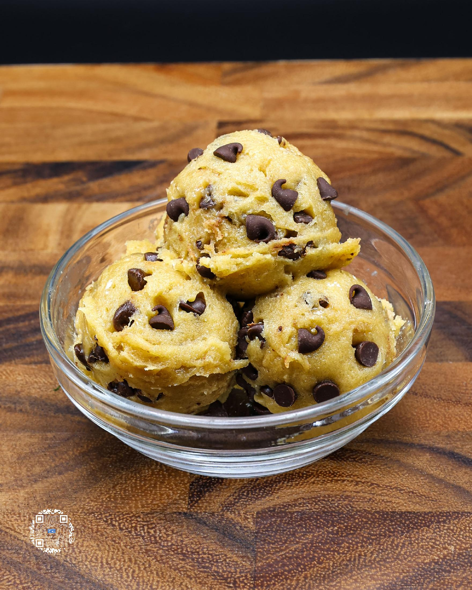
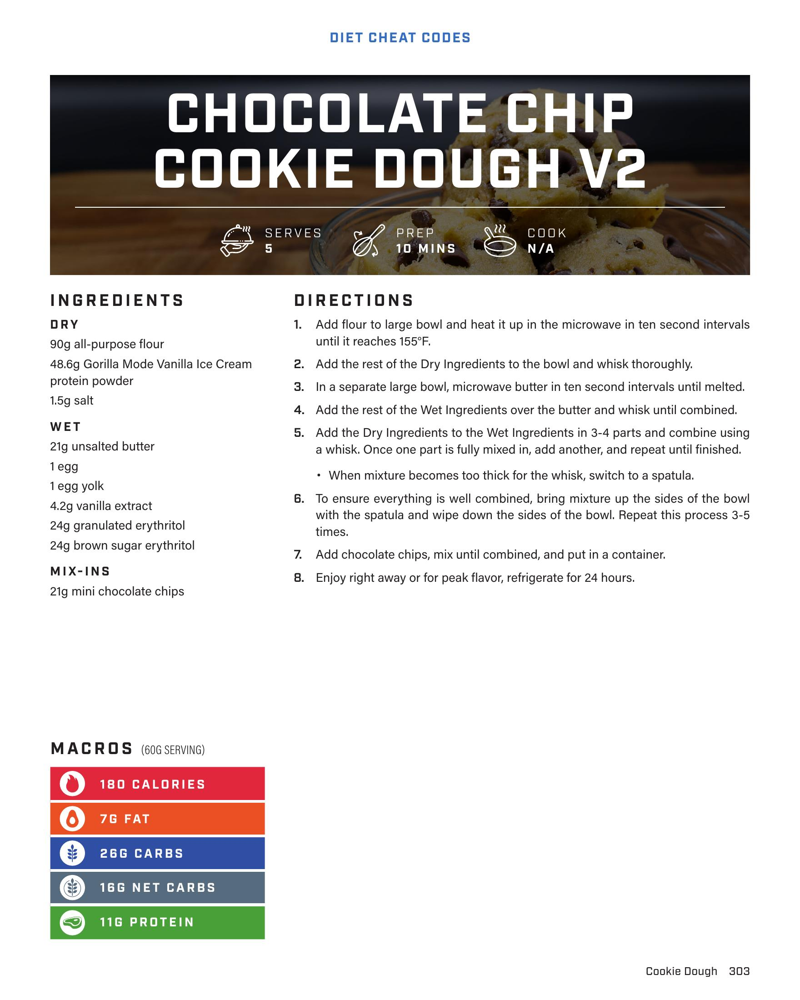

# CHOCOLATE CHIP COOKIE DOUGH V2

**Serves:** 5 | **Prep:** 10 MINS | **Cook:** N/A

## Macros

| Calories | Fat | Carbs | Net Carbs | Protein |
|----------|-----|-------|-----------|---------|
| 160 | 7 | 28 | 16 | 11 |

## Ingredients

### DRY

- 90g all-purpose flour
- 48.6g Gorilla Mode Vanilla Ice Cream protein powder
- 1.5g salt

### WET

- 21g unsalted butter
- 1 egg
- 1 egg yolk
- 4.2g vanilla extract
- 24g granulated erythritol
- 24g brown sugar erythritol

### MIX-INS

- 21g mini chocolate chips

## Directions

1. Add flour to large bowl and heat it up in the microwave in ten second intervals until it reaches 155°F.
2. Add the rest of the Dry Ingredients to the bowl and whisk thoroughly.
3. In a separate large bowl, microwave butter in ten second intervals until melted.
4. Add the rest of the Wet Ingredients over the butter and whisk until combined.
5. Add the Dry Ingredients to the Wet Ingredients in 3-4 parts and combine using a whisk. Once one part is fully mixed in, add another, and repeat until finished. When mixture becomes too thick for the whisk, switch to a spatula.
6. To ensure everything is well combined, bring mixture up the sides of the bowl with the spatula and wipe down the sides of the bowl. Repeat this process 3-5 times.
7. Add chocolate chips, mix until combined, and put in a container.
8. Enjoy right away or for peak flavor, refrigerate for 24 hours.

## Additional Recipe Pages

## Source Pages

303, 304
