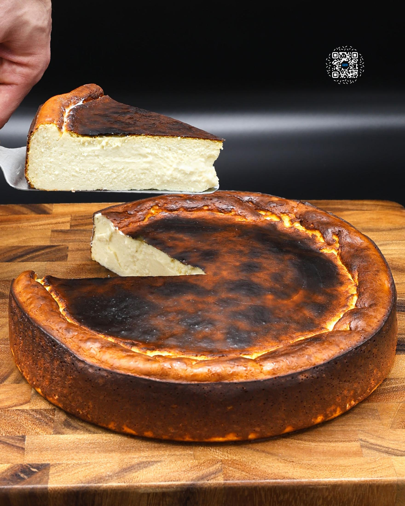
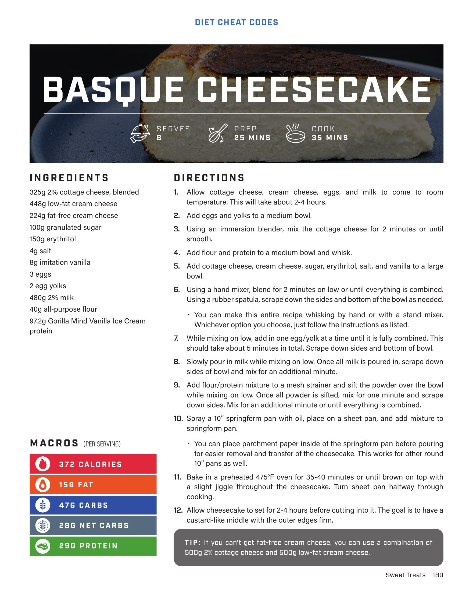

# BASQUE CHEESECAKE

**Serves:** 8 | **Prep:** 25 MINS | **Cook:** 35 MINS

## Macros

| Calories | Fat | Carbs | Net Carbs | Protein |
|----------|-----|-------|-----------|---------|
| 372 | 15 | 47 | 28 | 29 |

## Ingredients

- 325g 2% cottage cheese, blended
- 448g low-fat cream cheese
- 224g fat-free cream cheese
- 100g granulated sugar
- 150g erythritol
- 4g salt
- 8g imitation vanilla
- 3 eggs
- 2 egg yolks
- 480g 2% milk
- 40g all-purpose flour
- 97.2g Gorilla Mind Vanilla Ice Cream protein

## Directions

1. Allow cottage cheese, cream cheese, eggs, and milk to come to room temperature. This will take about 2-4 hours.
2. Add eggs and yolks to a medium bowl.
3. Using an immersion blender, mix the cottage cheese for 2 minutes or until smooth.
4. Add flour and protein to a medium bowl and whisk.
5. Add cottage cheese, cream cheese, sugar, erythritol, salt, and vanilla to a large bowl.
6. Using a hand mixer, blend for 2 minutes on low or until everything is combined. Using a rubber spatula, scrape down the sides and bottom of the bowl as needed. You can make this entire recipe whisking by hand or with a stand mixer. Whichever option you choose, just follow the instructions as listed.
7. While mixing on low, add in one egg/yolk at a time until it is fully combined. This should take about 5 minutes in total. Scrape down sides and bottom of bowl.
8. Slowly pour in milk while mixing on low. Once all milk is poured in, scrape down sides of bowl and mix for an additional minute.
9. Add flour/protein mixture to a meat strainer and a sift the powder over the bowl while mixing on low. Once all powder is sifted, mix for one minute and scrape down sides. Mix for an additional minute or until everything is combined.
10. Spray a 10" springform pan with oil, place on a sheet pan, and add mixture to springform pan. You can place parchment paper inside of the springform pan before pouring for easier removal and transfer of the cheesecake. This works for other round 10" pans as well.
11. Bake in a preheated 475°F oven for 35-40 minutes or until brown on top with a slight jiggle throughout the cheesecake. Turn sheet pan halfway through cooking.
12. Allow cheesecake to set for 2-4 hours before cutting into it. The goal is to have a custard-like middle with the outer edges firm.

## Tips

if you can't get fat-free cream cheese, you can use a combination of 500g 2% cottage cheese and 500g low-fat cream cheese.

## Additional Recipe Pages

## Source Pages

189, 190
