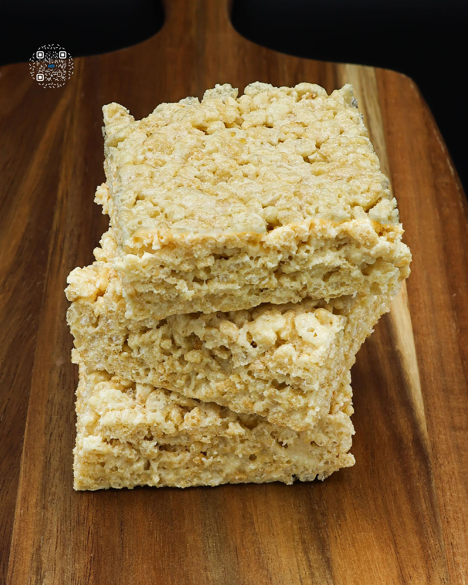
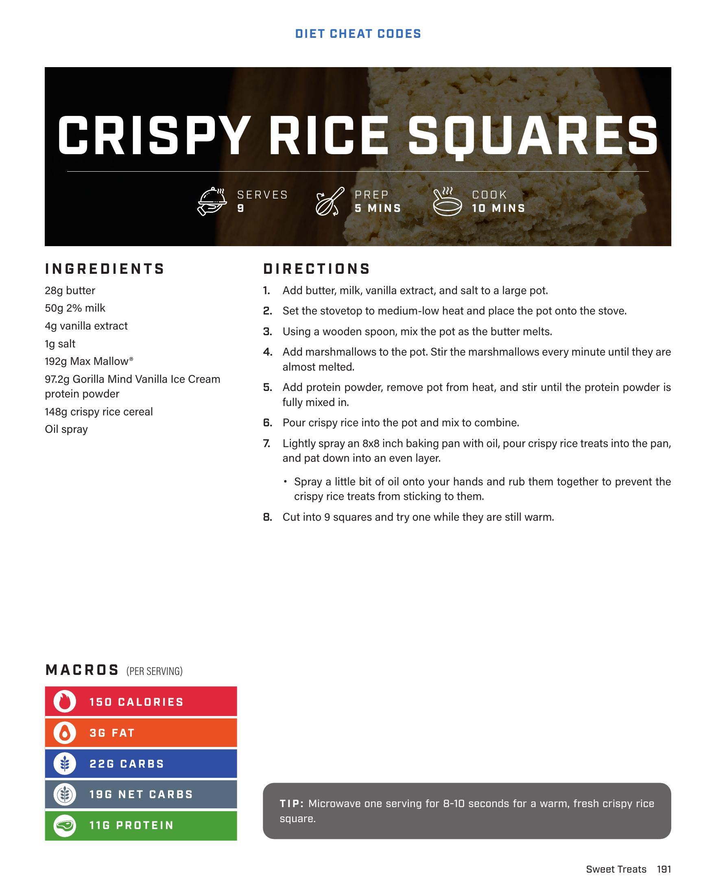

# CRISPY RICE SQUARES

**Serves:** 9 | **Prep:** 5 MINS | **Cook:** 10 MINS

## Macros

| Calories | Fat | Carbs | Net Carbs | Protein |
|----------|-----|-------|-----------|---------|
| 150 | 3 | 22 | 19 | 11 |

## Ingredients

- 28g butter
- 50g 2% milk
- 4g vanilla extract
- 1g salt
- 192g Max Mallow*
- 97.2g Gorilla Mind Vanilla Ice Cream protein powder
- 145g crispy rice cereal
- Oil spray

## Directions

1. Add butter, milk, vanilla extract, and salt to a large pot.
2. Set the stovetop to medium-low heat and place the pot onto the stove.
3. Using a wooden spoon, mix the pot as the butter melts.
4. Add marshmallows to the pot. Stir the marshmallows every minute until they are almost melted.
5. Add protein powder, remove pot from heat, and stir until the protein powder is fully mixed in.
6. Pour crispy rice into the pot and mix to combine.
7. Lightly spray an 8x8 inch baking pan with oil, pour crispy rice treats into the pan, and pat down into an even layer. Spray a little bit of oil onto your hands and rub them together to prevent the crispy rice treats from sticking to them.
8. Cut into 9 squares and try one while they are still warm.

## Tips

Microwave one serving for 8-10 seconds for a warm, fresh crispy rice square.

## Additional Recipe Pages

## Source Pages

191, 192
