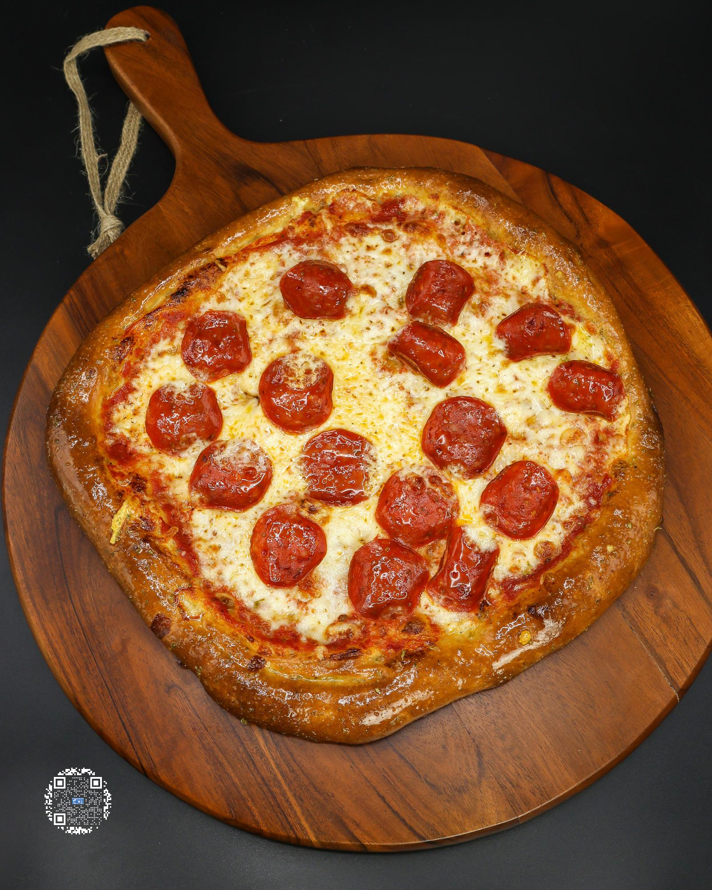

# 1 HOUR PIZZA

**Serves:** 2 | **Prep:** 50 MINS | **Cook:** 10 MINS

## Macros

| Calories | Fat | Carbs | Net Carbs | Protein |
|----------|-----|-------|-----------|---------|
| 729 | 24 | 58 | N/A | 68 |

## Ingredients

### DOUGH (makes 2 doughs)

- 120g tipo 00 flour
- 40g vital wheat gluten
- 6g instant yeast
- 2g salt
- 1g garlic powder
- 2g diastatic malt powder
- 6g extra virgin olive oil
- 120g light beer

### PIZZA

- 1 Dough
- 90g FOOLPROOF HOMEMADE MARINARA
- 5g grated parmesan
- 56g fat-free mozzarella cheese
- 70g part-skim mozzarella cheese
- 28g turkey pepperoni

## Directions

1. Add flour, vital wheat gluten, malt powder, garlic powder, salt, and yeast to food processor and process on high for 15 seconds. Add olive oil on top of dry ingredients.
2. Heat beer to 90°F, then turn food processor on high and slowly pour beer into it over a 20 second period. Keep processing for an additional 30 seconds.
3. Flip dough out onto a lightly floured surface and knead for 1 minute. Divide dough into two pieces, shape into balls, and put under a damp towel for 15 minutes.
4. While waiting, shred any cheese needed and/or make a FOOLPROOF HOMEMADE MARINARA.
5. Lay four 12-inch pieces of parchment paper on the counter and lightly spray with oil.
6. Grab a dough, pat between your hands until it is roughly 5 inches in diameter, put it on the parchment paper, and cover with another piece of parchment oil side down.
7. Using a rolling pin, gently roll back and forth at different angles to keep the shape of a circle.
8. Once pizza is about 12" or to your desired thickness, place in a warm spot in the kitchen to rise for 30 minutes and start preheating oven to 500°F.
9. Take parchment paper off the top of the dough and add Pizza Ingredients in the order listed.
10. Put pizza on a tray or using a pizza peel, put pizza in the oven for 8-10 minutes or to preferred doneness.
11. Slice and EAT.

## Tips

If you only want to make one pizza you can store the extra dough in the fridge for up to a week. In a high-sided container, spray with oil, place the dough ball [not rolled out], cover, and throw it in the fridge. An hour before you are ready to eat, take the dough out of the fridge and then start at step 4.

