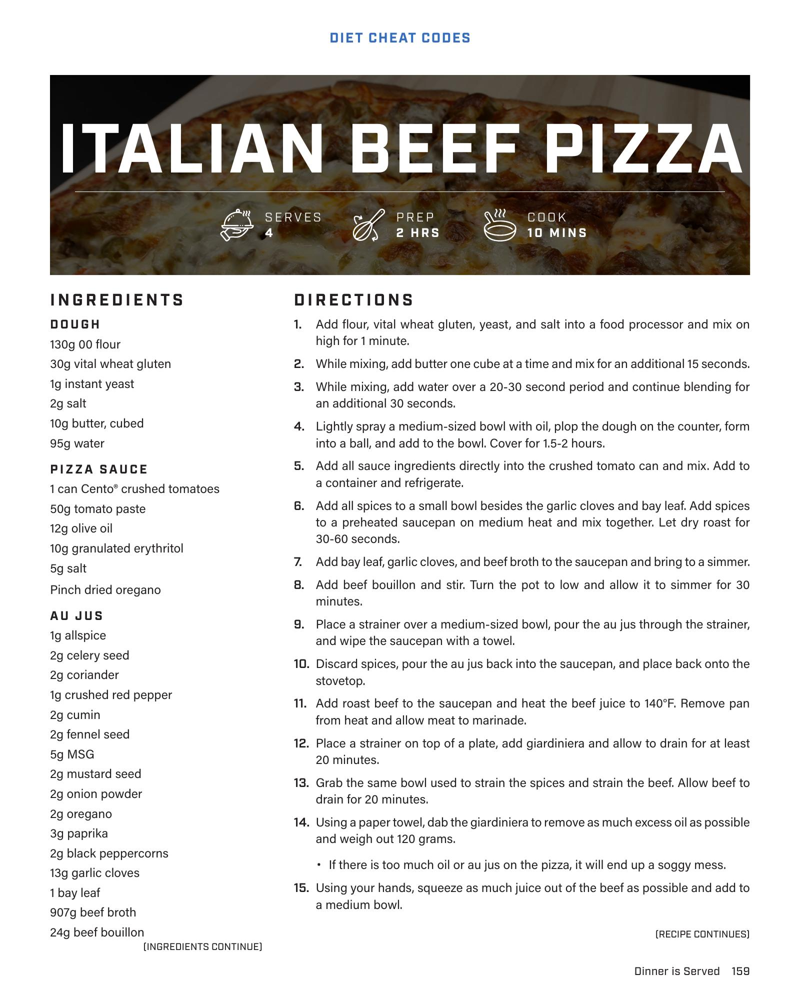

# Chicago Style Pizza

**Serves:**  | **Prep:**  | **Cook:** 8-10 MINUTES

## Macros

| Calories | Fat | Carbs | Net Carbs | Protein |
|----------|-----|-------|-----------|---------|
| 479 | 20 | 32 | N/A | 43 |

## Ingredients

### PIZZA BUILD

- 130g pizza sauce
- 224g italian beef, thinly sliced
- 120g giardiniera
- 8g pecorino romano cheese, grated
- 8g parmigiano reggiano cheese, grated
- 112g fat-free mozzarella cheese, shredded
- 187g part-skim mozzarella cheese, thinly sliced
- Corn meal

## Directions

1. Lightly sprinkle corn meal onto the work surface, flip dough onto the corn meal and add additional corn meal to the bottom of the dough.
2. Flip the dough back over and using a rolling pin, roll back and forth two times. Turn the dough 90° or a quarter turn, and roll back and forth two more times. Repeat this process until the dough is 10-11".
3. Pick up the dough, make two fists underneath it and move the dough in a circular motion. Make sure you go around the entire dough. The dough should be about 12" now.
4. Take the dough and grab the crust by your finger tips. Similar to spinning the dough with your fists, do the same thing to the crust and go all the way around the pizza. The dough should now have reached final form at 14".
5. Roll out the edges of the dough to remove any air pockets and flatten.
6. Place dough on top of a sheet of parchment paper and add pizza sauce, leaving about a quarter inch for a crust.
7. Add remaining toppings in the order listed and add to a preheated 550°F oven for 8-10 minutes.
8. Enjoy an authentic Chicago style pizza.

## Tips

Keep the au jus if you plan to make another pizza or an italian beef sandwich in the next week. Simply reheat the au jus and beef to 140°F and the italian beef is ready.

