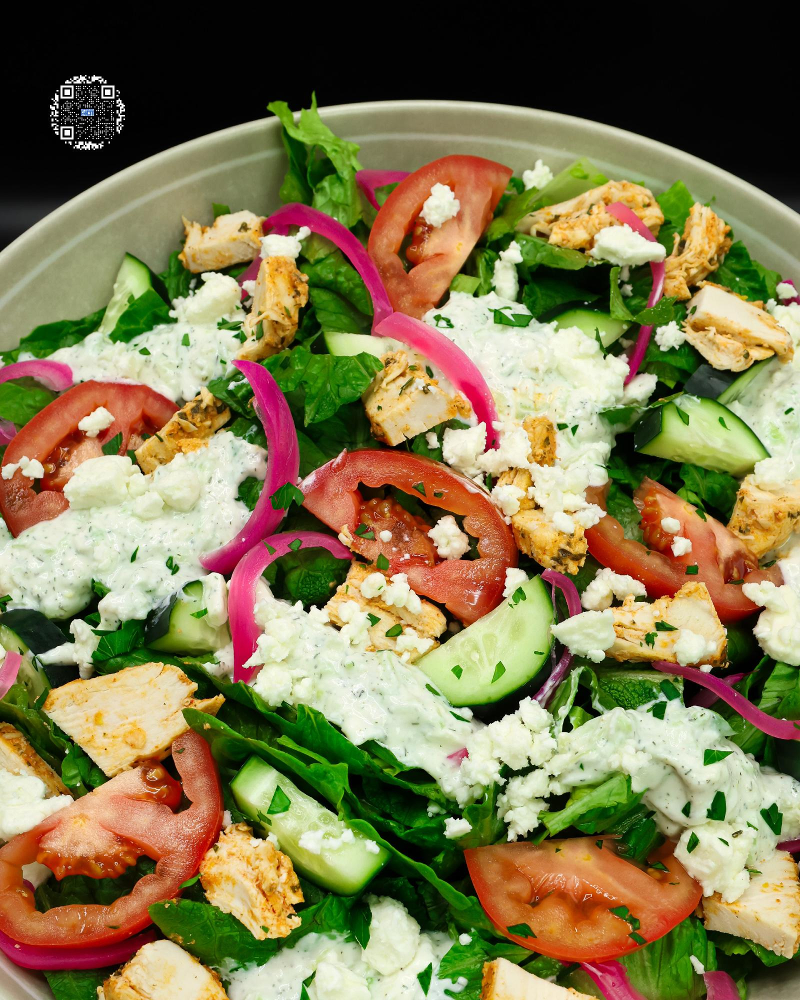

# CHICKEN GYRO SALAD

**Serves:** 1 | **Prep:** 90 MINS | **Cook:** 20 MINS

## Macros

| Calories | Fat | Carbs | Net Carbs | Protein |
|----------|-----|-------|-----------|---------|
| 481 | 4 | 30 | N/A | 83 |

## Ingredients

- 4 chicken breasts

### CHICKEN MARINADE

- 6g fresh parsley, chopped
- 30g white vinegar
- 10g garlic, minced
- 60g lemon juice
- 120g fat-free Greek yogurt
- 12g extra virgin olive oil
- 8g smoked paprika
- 12g salt
- 6g MSG
- 6g black pepper

### CHICKEN GYRO SALAD BUILD

- 300g romaine lettuce, chopped
- 140g tomato, sliced
- 150g cucumber, sliced
- 168g chicken, cooked
- 170g TZATZIKI SAUCE
- 40g PICKLED ONION
- 42g fat-free feta cheese

## Directions

1. Using a cutting board, trim excess fat off the chicken breasts.
2. Add the Chicken Marinade ingredients to a large bowl, whisk until combined, add chicken, and make sure every piece of chicken is thoroughly coated.
3. Cover bowl with plastic wrap and refrigerate for one hour, up to 24 hours for maximum flavor.
4. Prep TZATZIKI SAUCE. If you plan to eat this recipe through the week, double the recipe to make enough tzatziki for 4 salads.
5. Prep PICKLED ONION.
6. When ready to eat, arrange marinated chicken on a sheet pan lined with parchment paper and a wire rack and bake in a preheated 400°F oven for 20-25 minutes or until internal temperature of the chicken reaches 155°F.
7. While the chicken is cooking, prep the vegetables and add them to a large bowl.
8. Chop chicken into bite-sized chunks and add over top of the vegetables along with the tzatziki sauce, feta cheese, and an optional garnish of chopped parsley. Enjoy!

## Tips

Although there is a lot of prep work for this recipe, if you make it once, you should have enough prepared ingredients for the entire week. The only thing you will have to prep each day is the lettuce, cucumber, and tomato - and even those can be prepared for multiple days at a time if you prefer.

