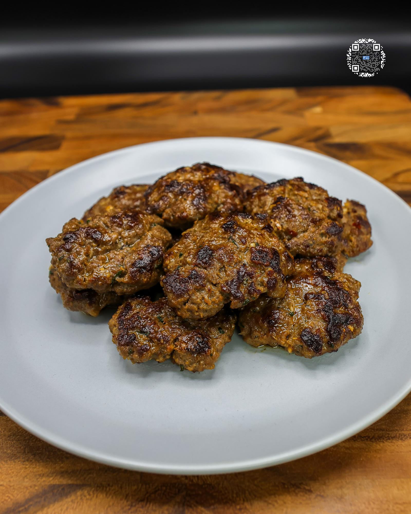

# ITALIAN SAUSAGE

**Serves:** 5 | **Prep:** 5 MINS | **Cook:** 5 MINS

## Macros

| Calories | Fat | Carbs | Net Carbs | Protein |
|----------|-----|-------|-----------|---------|
| 133 | 6 | 2 | N/A | 18 |

## Ingredients

- 2g fennel seeds, crushed
- 420g 96% lean ground beef
- 7g garlic, minced
- 2g parsley, chopped
- 7g salt
- Dash black pepper
- 6.5g paprika
- 3.5g onion powder
- 1g crushed red pepper flakes
- 1g Italian seasoning
- 10g extra virgin olive oil

## Directions

1. Place fennel seeds on a preheated pan on medium-low for 2 minutes or until they start to take on some color.
2. Crush fennel seeds using a mortar and pestle or food processor.
3. Into a large bowl, add fennel and all other ingredients, mix to combine, cover with plastic wrap, and refrigerate for 2-3 hours.
4. Take out a 92g serving, form in desired shape/s, and add to a preheated pan on medium high heat for 2 minutes per side or until internal temperature has reached 155°F.
5. Repeat step 4 and store any extra in the fridge.

